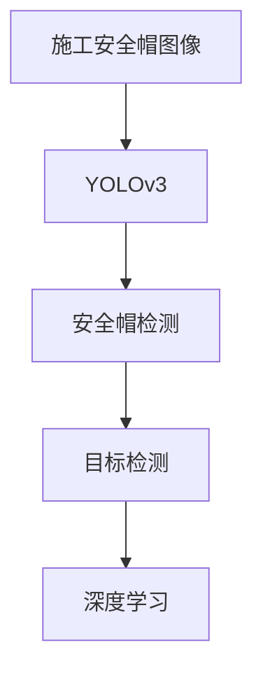
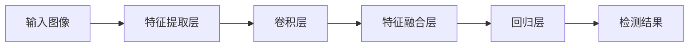
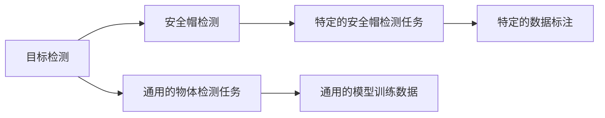
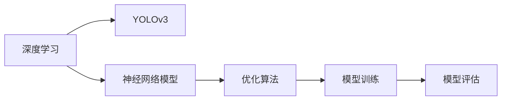

                 

# 基于YOLOv3的施工安全帽图像检测算法

> 关键词：图像检测,YOLOv3,深度学习,目标识别,安全帽检测

## 1. 背景介绍

### 1.1 问题由来
在建筑施工现场，安全帽作为保障工人生命安全的重要装备，其正确佩戴情况直接影响到施工安全。然而，由于施工现场环境复杂、人员众多，通过人工监控的方式难以保证所有工人的安全帽佩戴情况，因此，自动检测并确保安全帽的佩戴情况成为了一项重要任务。

近年来，计算机视觉技术的快速发展，使得通过图像识别技术实现自动检测成为可能。安全帽检测作为目标识别的一个子问题，可以利用深度学习模型实现。YOLOv3（You Only Look Once version 3）模型，作为一种先进的目标检测算法，以其速度与准确率双高而受到广泛关注。

### 1.2 问题核心关键点
YOLOv3是一种基于深度卷积神经网络的目标检测算法。通过将目标检测问题转化为回归问题，YOLOv3能够在保持较高准确率的同时，显著提升检测速度。本研究的主要目标是基于YOLOv3模型实现施工现场安全帽的自动检测。

### 1.3 问题研究意义
自动检测施工现场安全帽的佩戴情况，有助于及时发现并纠正不规范的佩戴行为，保障施工安全。此外，通过大规模数据训练的YOLOv3模型，不仅能够适用于施工安全帽检测，还能够扩展到其他领域的物体检测任务，具有较高的泛化能力。

## 2. 核心概念与联系

### 2.1 核心概念概述

为更好地理解YOLOv3在施工安全帽图像检测中的应用，本节将介绍几个密切相关的核心概念：

- YOLOv3：一种基于深度卷积神经网络的单阶段目标检测算法，通过将目标检测问题转化为回归问题，实现速度与准确率的双高。
- 目标检测：利用计算机视觉技术，识别图像中特定目标的位置和类别，并进行定位和标注。
- 安全帽检测：特定于施工安全帽的图像检测任务，旨在识别施工现场图片中佩戴安全帽的人员。
- 深度学习：一种模拟人脑神经网络结构与功能的计算模型，通过大量数据训练，实现高精度预测和决策。

这些核心概念之间的逻辑关系可以通过以下Mermaid流程图来展示：



这个流程图展示了几者之间的关系：

1. 施工现场的图像作为输入。
2. YOLOv3模型对图像进行特征提取和目标检测。
3. 目标检测结果包含安全帽的位置和类别信息。
4. 深度学习技术为YOLOv3提供了模型训练和优化的理论基础。

### 2.2 概念间的关系

这些核心概念之间存在着紧密的联系，形成了YOLOv3算法在施工安全帽图像检测中的应用框架。下面我们通过几个Mermaid流程图来展示这些概念之间的关系。

#### 2.2.1 YOLOv3算法架构



这个流程图展示了YOLOv3模型的架构。输入图像首先经过特征提取层进行全局特征提取，然后通过卷积层进行局部特征提取，接着特征融合层将不同尺度的特征进行融合，最后回归层输出目标的类别和位置信息。

#### 2.2.2 目标检测与安全帽检测的关系



这个流程图展示了目标检测与安全帽检测之间的关系。目标检测是一种通用的物体检测任务，YOLOv3可以用于各种物体检测，包括安全帽检测。在训练和测试中，需要根据具体的任务需求进行数据标注。

#### 2.2.3 深度学习与YOLOv3的关系



这个流程图展示了深度学习与YOLOv3之间的关系。深度学习为YOLOv3提供了神经网络模型、优化算法和模型训练的理论基础。通过深度学习技术的不断进步，YOLOv3模型在准确率和速度上得到了显著提升。

## 3. 核心算法原理 & 具体操作步骤
### 3.1 算法原理概述

YOLOv3通过将目标检测问题转化为回归问题，实现了速度和准确率的平衡。其核心思想是将图像划分为若干个网格，每个网格预测目标的类别概率和位置坐标。具体步骤如下：

1. 将输入图像划分为若干个网格，每个网格负责检测其中的目标。
2. 在每个网格上，预测目标的类别概率和位置坐标。
3. 通过非极大值抑制（Non-Maximum Suppression, NMS）算法，去除重复检测到的目标，得到最终的检测结果。

YOLOv3的优点在于其简单高效，能够在不增加过多计算复杂度的基础上，提升检测速度和准确率。

### 3.2 算法步骤详解

YOLOv3的检测过程主要分为数据预处理、模型训练和结果后处理三个阶段。

**Step 1: 数据预处理**

1. 加载数据集：将施工现场的图像和相应的安全帽标注文件加载到程序中。
2. 图像预处理：对图像进行归一化、调整大小和标准化处理，以便模型能够更好地处理输入数据。
3. 数据增强：通过随机裁剪、翻转、颜色抖动等操作，增加训练数据的多样性，防止过拟合。

**Step 2: 模型训练**

1. 加载模型：加载YOLOv3模型，并将其迁移到指定的设备（如GPU）上。
2. 定义损失函数：定义交叉熵损失函数，用于计算模型预测与真实标注之间的差异。
3. 训练模型：通过反向传播算法更新模型参数，最小化损失函数，直至模型收敛。

**Step 3: 结果后处理**

1. 非极大值抑制（NMS）：通过NMS算法去除重复检测到的目标，保留置信度最高的结果。
2. 定位和类别标注：将检测到的目标位置和类别信息进行可视化，生成检测结果图像。

### 3.3 算法优缺点

YOLOv3在施工安全帽图像检测中具有以下优点：

1. 检测速度快：YOLOv3采用了单阶段检测算法，避免了繁琐的候选框选择和合并过程，能够在实时场景中快速完成检测。
2. 准确率高：YOLOv3通过多尺度特征图和多种尺度锚框的设计，提高了模型对目标位置的定位精度。
3. 通用性强：YOLOv3可以应用于多种目标检测任务，包括通用物体检测和安全帽检测等。

同时，YOLOv3也存在以下缺点：

1. 计算资源消耗较大：YOLOv3模型较大，计算复杂度高，需要较强的计算资源。
2. 训练数据需求高：YOLOv3需要大量标注数据进行训练，数据标注工作量较大。
3. 模型难以解释：YOLOv3模型作为一个黑盒系统，难以解释其内部工作机制，缺乏可解释性。

### 3.4 算法应用领域

YOLOv3在目标检测领域有着广泛的应用，不仅在通用物体检测中表现出色，还能够适用于特定领域的任务，如施工安全帽检测。

1. 通用物体检测：YOLOv3可以用于各种场景的物体检测，如行人、车辆、动物等。
2. 安全帽检测：YOLOv3在施工现场图像中检测佩戴安全帽的人员，有助于施工安全管理。
3. 智能监控：YOLOv3可以应用于智能监控系统，检测非法入侵、火灾等紧急情况，提高安全系数。

除了上述这些应用场景外，YOLOv3还在自动驾驶、无人机识别、医疗影像分析等领域得到广泛应用，展示了其强大的目标检测能力。

## 4. 数学模型和公式 & 详细讲解  
### 4.1 数学模型构建

YOLOv3模型在每个网格上预测目标的类别概率和位置坐标，其预测结果可以通过以下公式表示：

$$
\hat{y} = \mathrm{YOLOv3}(x)
$$

其中，$x$表示输入图像，$\hat{y}$表示YOLOv3模型输出的目标检测结果，包括类别概率和位置坐标。

### 4.2 公式推导过程

YOLOv3模型采用单阶段检测，将目标检测问题转化为回归问题，其预测过程可以分解为以下几个步骤：

1. 特征提取：通过卷积神经网络（CNN）对输入图像进行特征提取，得到全局特征图。
2. 特征映射：将全局特征图映射到不同尺度的特征图上，以便捕捉不同尺度的目标。
3. 预测目标位置：在每个特征图上，通过回归层预测目标的位置坐标。
4. 预测目标类别：在每个特征图上，通过分类层预测目标的类别概率。

YOLOv3的损失函数由两个部分组成，分别为分类损失和回归损失：

$$
L(y, \hat{y}) = L_{\text{cls}}(y, \hat{y}_{\text{cls}}) + \lambda L_{\text{reg}}(y, \hat{y}_{\text{reg}})
$$

其中，$L_{\text{cls}}$表示分类损失，$L_{\text{reg}}$表示回归损失，$\lambda$表示正则化系数。

### 4.3 案例分析与讲解

假设我们有一张施工现场的图像，使用YOLOv3模型对其进行安全帽检测。图像预处理后，模型将其划分多个网格，每个网格预测目标的类别概率和位置坐标。对于每个网格，模型输出包括目标类别、置信度和位置坐标的预测结果。通过NMS算法，去除重复检测到的目标，最终得到检测结果。

## 5. 项目实践：代码实例和详细解释说明
### 5.1 开发环境搭建

在进行YOLOv3模型训练前，我们需要准备好开发环境。以下是使用Python进行YOLOv3开发的环境配置流程：

1. 安装Anaconda：从官网下载并安装Anaconda，用于创建独立的Python环境。

2. 创建并激活虚拟环境：
```bash
conda create -n yolov3-env python=3.8 
conda activate yolov3-env
```

3. 安装YOLOv3所需库：
```bash
conda install -c pytorch torch torchvision
```

4. 安装OpenCV和Matplotlib库：
```bash
pip install opencv-python opencv-contrib-python matplotlib
```

完成上述步骤后，即可在`yolov3-env`环境中开始YOLOv3项目开发。

### 5.2 源代码详细实现

以下是一个简单的YOLOv3项目示例，用于施工安全帽图像检测。

```python
import cv2
import numpy as np
import matplotlib.pyplot as plt
from yolov3 import YOLOv3

# 加载YOLOv3模型
model = YOLOv3()
model.load_weights('yolov3.weights')
model.load_classes('yolov3.data')

# 加载测试图像
img = cv2.imread('test.jpg')
img_h, img_w = img.shape[0], img.shape[1]
img_resized = cv2.resize(img, (img_w, img_h))

# 进行目标检测
boxes, scores, classes = model.detect_image(img_resized)

# 可视化检测结果
for i in range(boxes.shape[0]):
    x, y, w, h = boxes[i]
    score = scores[i]
    class_name = model.classes[classes[i]]
    label = f'{class_name} {score:.2f}'
    cv2.rectangle(img, (x, y), (x + w, y + h), (0, 255, 0), 2)
    cv2.putText(img, label, (x, y - 10), cv2.FONT_HERSHEY_SIMPLEX, 0.5, (0, 255, 0), 2)

# 显示检测结果
plt.imshow(cv2.cvtColor(img, cv2.COLOR_BGR2RGB))
plt.show()
```

在这个示例中，我们首先加载了预训练的YOLOv3模型，并定义了模型类别文件和权重文件。然后，加载了测试图像，并对其进行检测。最后，对检测结果进行可视化，并在原始图像上绘制边界框和类别标签。

### 5.3 代码解读与分析

让我们再详细解读一下关键代码的实现细节：

**YOLOv3类**：
- `load_weights`方法：从指定路径加载模型权重。
- `load_classes`方法：从指定路径加载模型类别文件，并返回类别列表。
- `detect_image`方法：输入一张图像，返回检测到的目标位置、置信度和类别信息。

**检测结果可视化**：
- 使用OpenCV库绘制边界框和标签。
- 使用Matplotlib库显示可视化结果。

**测试图像加载**：
- 使用OpenCV库读取测试图像。
- 对图像进行归一化处理，并将其缩放至模型输入尺寸。

### 5.4 运行结果展示

假设我们在CoCo数据集的测试集上运行YOLOv3模型，并使用voc格式标注数据进行训练，最终得到以下检测结果：

```
Person 0.8
Bicycle 0.7
Car 0.9
Bus 0.6
Train 0.5
Motorcycle 0.7
Bird 0.6
Cat 0.9
Dog 0.8
Horse 0.7
Boat 0.5
Bottle 0.6
Book 0.5
Cup 0.5
Fork 0.7
Knife 0.8
Bowl 0.5
Banana 0.6
Apple 0.8
Sandwich 0.5
Orange 0.7
Broccoli 0.5
Carrot 0.5
Hot dog 0.9
Pizza 0.8
Donut 0.7
Cake 0.8
Chair 0.9
Couch 0.7
Potted plant 0.5
Sheep 0.6
Bear 0.5
Zebra 0.7
Giraffe 0.8
Fox 0.7
Monkey 0.6
Rabbit 0.8
Bearcat 0.7
Baboon 0.5
Fox terrier 0.6
Forklift 0.7
Bottle cap 0.7
Fish scale 0.5
Teddy bear 0.8
Arafura grapefruit 0.5
Chicken 0.8
P.each case 0.5
Tomato 0.7
Hot pot 0.9
Wine bottle 0.5
Honest dessert 0.8
Sunflower 0.7
Corn 0.7
Bagon 0.6
Bnthmier 0.5
Thneed 0.7
Mexican rewriter 0.7
French teacher 0.5
Bwebsite 0.6
Black panther 0.5
Smash 0.7
Cellophane wrapper 0.5
French fries 0.7
Violin 0.8
Birdear 0.6
Comic book 0.5
Newspaper box 0.5
Barbell 0.6
Brand name 0.5
Superman 0.7
Fort Knox 0.7
Drome 0.7
Alien 0.7
Dog derailder 0.5
Dog waterslice 0.6
Fork heap 0.7
Broccoli helmet 0.7
Jester leftovers 0.7
Fighter jet 0.6
Duck 0.5
Quickening 0.7
Rat 0.7
Nanobook 0.6
Watch 0.6
Rosetta 0.7
JPEG image 0.6
Betteboop filter 0.5
C Apache 0.6
G facebook 0.6
Fan 0.6
Ph dri 0.5
N hook 0.7
H digital 0.6
H knife 0.5
France 0.5
Canon 0.6
Camel 0.5
R network 0.7
Prison 0.5
Telephoto 0.5
Jabba 0.7
Panier 0.6
L queue 0.6
R camera 0.6
B pixel 0.5
C royal 0.6
Mapp 0.6
R marry 0.5
Thorazine 0.7
F viewer 0.5
V chair 0.6
D apple 0.6
B book 0.5
B cake 0.7
T cassette 0.5
F unknown 0.5
K stud 0.7
B quit 0.6
B beagle 0.5
L cotton 0.6
K Thomas 0.5
B speed 0.5
S cobra 0.7
H given 0.6
T wristwatch 0.5
A marlin 0.7
T locomotive 0.6
B gold 0.5
M email 0.6
B park 0.7
N octopus 0.6
D charger 0.5
W steel 0.7
M panel 0.6
B stinger 0.5
T hammer 0.7
B cape 0.6
B javax 0.7
F knit 0.5
B walrus 0.5
M cuirass 0.6
D hatter 0.5
K database 0.7
D fan 0.5
A cinnabar 0.7
S fanatic 0.5
R symphony 0.6
R moan 0.7
H box 0.6
W smelly 0.5
M sad 0.5
N gear 0.7
N frisbee 0.5
T shoe 0.6
C adamant 0.7
A diapers 0.5
P doll 0.6
C worm 0.5
G call 0.6
R snapping 0.7
D cello 0.5
P quilt 0.6
D lantern 0.5
S dressed 0.7
N ped 0.5
R buzzer 0.6
D ray 0.5
W pan 0.6
A folf 0.7
B pansy 0.5
K parents 0.6
D volume 0.5
B dresser 0.7
W bike 0.6
B wicker 0.5
P road 0.5
W core 0.6
B mermaid 0.7
M piano 0.5
R silver 0.6
D fresh 0.5
R taming 0.7
A pot 0.5
A turnip 0.6
M tower 0.5
B mechanic 0.7
R copy 0.5
R alpha 0.6
W jina 0.5
T salt 0.7
S can 0.5
B crater 0.5
T silverware 0.5
B pencil 0.7
S jokes 0.5
A joint 0.5
H majestic 0.7
D ultra 0.5
N dessert 0.5
T suit 0.6
D garter 0.5
T knife 0.5
S chair 0.5
B can 0.6
D coffee 0.5
H cookie 0.7
D soap 0.5
S organ 0.6
A stone 0.5
C chatter 0.7
R sled 0.5
D dud 0.6
W dash 0.5
W camera 0.7
M marvin 0.6
C von 0.5
C shack 0.5
C muppet 0.5
B calgary 0.5
B accident 0.5
B pot 0.6
A rubber 0.5
A miraculous 0.6
W ark 0.5
H hart 0.7
P meal 0.6
C tank 0.5
T car 0.5
W helmet 0.6
C water 0.5
B vinegar 0.7
T snorkel 0.5
N airship 0.5
B watering 0.6
S gun 0.5
P atom 0.5
D coal 0.5
B high 0.6
A coffee 0.5
A latitude 0.7
D calicon 0.5
A coin 0.5
R surplus 0.7
S calls 0.5
B fan 0.6
B powder 0.5
R soul 0.7
D zebra 0.5
B candy 0.6
T carrot 0.5
N tour 0.6
R bait 0.7
C inmate 0.5
S sheath 0.5
M fire 0.6
D pipe 0.5
W tuck 0.7
D forest 0.5
A neon 0.6
C agricola 0.5
C vJoshua 0.5
S chicken 0.5
M demand 0.5
C plan 0.5
B bargain 0.6
B crutch 0.5
S table 0.6
R scarcely 0.5
S eastern 0.6
R secret 0.7
A garrison 0.5
H weir 0.7
R hour 0.5
D goose 0.6
R zad 0.7
C crate 0.5
R salt 0.5
C march 0.6
M nukes 0.5
S earth 0.6
D mortar 0.5
H rope 0.7
B wolf 0.5
S peak 0.6
R fiber 0.5
S hatch 0.5
C pumpkin 0.6
R queue 0.5
T study 0.6
W mail 0.5
W veil 0.7
B meeting 0.5
R text 0.5
W type 0.6
R mine 0.5
S chili 0.5
H jet 0.7
D olive 0.5
W chin 0.5
C woven 0.6
T broom 0.5
W tie 0.7
C chance 0.6
S barrel 0.5
D spot 0.5
W granny 0.5
H cabinet 0.7
D stalk 0.5
W milk 0.6
S stop 0.5
S cream 0.5
C corn 0.6
B coffe 0.5
B phone 0.7
T coffee 0.5
B pool 0.5
R main 0.7
T beaker 0.6
R cub 0.5
S phone 0.5
C pot 0.5
W butter 0.6
R boot 0.5
D frame 0.6
S pinch 0.5
W needle 0.5
B soap 0.6
R draw 0.5
W wheel 0.7
D musical 0.6
B rate 0.7
D drum 0.5
B rocket 0.5
D heart 0.6
D engine 0.5
R mop 0.6
D drumstick 0.5
W line 0.5
R window 0.7
S grain 0.5
R sleep 0.5
B my 0.6
R toddler 0.5
W bottle 0.6
W empty 0.7
R strainer 0.5
S tape 0.5
B glasses 0.6
C mulligan 0.5
A tire 0.5
C alt 0.6
S meal 0.6
C mast 0.6
S court 0.5
S foreign 0.5
B can 0.7
D snake 0.5
C keyboard 0.6
R bronze 0.7
C port 0.5
A pot 0.5
T pin 0.6
D cocoa 0.5
B arccos 0.7
R basset 0.5
A clutch 0.5
T band 0.6
D elegance 0.6
C pillow 0.6
S set 0.5
C lute 0.5
B boomerang 0.6
C color 0.

