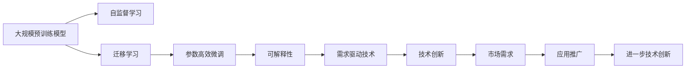

                 

# 大模型的技术创新与市场需求

## 1. 背景介绍

### 1.1 问题由来
近年来，随着深度学习技术的快速发展和算力的提升，大规模预训练模型（Large Pre-trained Models）在各个领域取得了显著的成果，特别是在自然语言处理（NLP）、计算机视觉（CV）和语音识别等领域。这些大模型通过在大规模数据上进行自监督学习，获得了丰富的领域知识，并在下游任务上表现出色。然而，大模型的训练和部署仍然面临着计算资源消耗大、模型可解释性差等问题，这在一定程度上限制了其广泛应用。

### 1.2 问题核心关键点
为了解决上述问题，研究人员在技术创新和市场需求之间找到了一个平衡点。一方面，通过技术创新，开发出更加高效、可解释性强的大模型，以适应不同场景和需求。另一方面，积极探索市场需求，通过应用推广，推动技术的进一步发展。

## 2. 核心概念与联系

### 2.1 核心概念概述

为了更好地理解大模型在技术创新与市场需求之间的互动，本节将介绍几个关键概念：

- **大规模预训练模型**（Large Pre-trained Models）：指在大规模数据上通过自监督学习获得的通用语言模型或视觉模型。常用的预训练模型有BERT、GPT系列、ResNet等。

- **自监督学习**（Self-supervised Learning）：一种无需人工标注的学习方法，通过在大规模无标签数据上设计预训练任务，自动学习数据的内在结构。

- **迁移学习**（Transfer Learning）：将在大规模数据上学习到的知识迁移到小规模数据集上的下游任务中，以提高任务性能。

- **参数高效微调**（Parameter-Efficient Fine-Tuning, PEFT）：在微调过程中，只更新部分预训练参数，保留大部分权重不变，以提高微调效率和泛化能力。

- **可解释性**（Explainability）：指模型的决策过程和输出结果能够被用户理解和信任，特别是在需要解释模型的应用场景中，如医疗、金融等。

- **需求驱动技术**（Demand-Driven Technology）：技术创新的方向和速度应根据市场需求进行调整，以满足用户需求。

这些核心概念之间通过以下Mermaid流程图进行联系：



这个流程图展示了大模型从预训练到应用推广，再到进一步技术创新的整个过程。大规模预训练模型通过自监督学习获得知识，然后通过迁移学习和参数高效微调，适应特定任务。可解释性和需求驱动技术保证了模型的可信度和适用性，应用推广促进了技术的发展。

### 2.2 概念间的关系

这些核心概念之间存在着紧密的联系，构成了大模型从创新到市场应用的整体生态系统。以下通过几个Mermaid流程图来展示它们之间的关系：

#### 2.2.1 技术创新与市场需求的关系


这个流程图展示了技术创新和市场需求之间的互动关系。技术创新在需求驱动下产生，应用推广和反馈进一步推动了技术创新，形成了一个动态的循环。

#### 2.2.2 自监督学习与迁移学习的关系


这个流程图展示了自监督学习和迁移学习在大模型中的应用。自监督学习在预训练阶段获得通用知识，迁移学习则将这些知识迁移到特定任务中，进行模型优化。

#### 2.2.3 参数高效微调与可解释性的关系


这个流程图展示了参数高效微调和可解释性在模型应用中的重要性。参数高效微调提高了模型性能和效率，而可解释性则增强了用户对模型的信任，从而推动了模型的应用推广。

## 3. 核心算法原理 & 具体操作步骤

### 3.1 算法原理概述

大模型的技术创新主要集中在如何更好地进行预训练、微调和应用推广。以下将详细解释这些关键步骤的原理：

#### 3.1.1 预训练原理

预训练是使用大规模无标签数据，通过自监督学习任务训练模型的过程。常用的自监督学习任务包括掩码语言模型（Masked Language Model, MLM）、自回归语言模型（Autoregressive Language Model, ARLM）、图像分类、对象检测等。预训练的目的是让模型学习到通用的语言或视觉特征，从而提高其在下游任务上的泛化能力。

#### 3.1.2 迁移学习原理

迁移学习是将预训练模型在大规模数据上学习到的知识迁移到特定下游任务中的过程。迁移学习可以分为两类：
- **微调**（Fine-Tuning）：在预训练模型的基础上，使用下游任务的少量标注数据进行有监督学习，以适应特定的任务。
- **提示学习**（Prompt Learning）：在输入文本中提供额外的提示信息，引导模型进行特定的推理和生成，而不改变模型的结构。

#### 3.1.3 参数高效微调原理

参数高效微调（Parameter-Efficient Fine-Tuning, PEFT）是一种在微调过程中只更新部分预训练参数的方法，以减少计算资源消耗。PEFT通过使用**自适应层**（Adaptive Layer）、**自适应权重**（Adaptive Weights）、**自适应标签**（Adaptive Labels）等技术，实现了在微调中更新特定参数的目的。

### 3.2 算法步骤详解

以下是进行大模型技术创新与市场需求推广的具体操作步骤：

#### 3.2.1 预训练步骤

1. **数据准备**：收集大规模无标签数据，如自然语言文本、图像等。
2. **任务设计**：选择合适的自监督学习任务，如掩码语言模型、自回归语言模型、图像分类等。
3. **模型训练**：使用预训练模型架构（如BERT、GPT、ResNet等），在大规模数据上训练模型，获得预训练权重。

#### 3.2.2 迁移学习步骤

1. **数据准备**：收集下游任务的标注数据。
2. **微调步骤**：
   - 选择合适的微调目标，如分类、匹配、生成等。
   - 选择预训练模型和微调任务，设计合适的输出层和损失函数。
   - 在微调过程中，使用合适的学习率、正则化技术、批次大小等超参数，进行训练。
3. **提示学习步骤**：
   - 设计合适的提示模板（Prompt Template）。
   - 在输入文本中嵌入提示信息，进行推理和生成。
   - 使用合适的损失函数和评估指标，进行模型优化。

#### 3.2.3 参数高效微调步骤

1. **选择PEFT方法**：如使用 Adapter、LoRA、BitFit等方法。
2. **确定PEFT策略**：决定哪些参数需要更新，哪些参数保持不变。
3. **模型训练**：使用PEFT策略进行微调，更新部分参数，保持其他参数不变。

### 3.3 算法优缺点

#### 3.3.1 优点

1. **泛化能力强**：通过预训练和迁移学习，模型能够学习到通用的语言或视觉特征，适应多种下游任务。
2. **计算效率高**：参数高效微调等方法能够减少计算资源消耗，提高模型训练和推理效率。
3. **可解释性强**：提示学习和PEFT等方法能够增强模型的可解释性，帮助用户理解和信任模型输出。

#### 3.3.2 缺点

1. **数据依赖**：预训练和微调需要大规模数据支持，数据获取和标注成本较高。
2. **资源消耗大**：大规模预训练和微调需要高性能计算资源，如GPU、TPU等。
3. **模型复杂度高**：大模型参数量庞大，模型复杂度高，增加了模型部署和维护的难度。

### 3.4 算法应用领域

大模型技术创新与市场需求的应用领域非常广泛，以下列举几个典型场景：

1. **自然语言处理**：如文本分类、命名实体识别、情感分析、机器翻译等。
2. **计算机视觉**：如图像分类、对象检测、图像生成、视频分析等。
3. **语音识别**：如语音转文本、语音合成、语音情感识别等。
4. **医疗健康**：如疾病诊断、药物研发、医学图像分析等。
5. **金融科技**：如信用评分、风险评估、欺诈检测等。

## 4. 数学模型和公式 & 详细讲解

### 4.1 数学模型构建

大模型的数学模型主要涉及预训练、微调和提示学习的数学表达。以下将详细构建这些模型：

#### 4.1.1 预训练模型

以BERT为例，其预训练模型由多层Transformer编码器组成。其基本结构如下：

$$
h_{i} = \text{LayerNorm}(h_{i-1} + \text{Self-Attention}(h_{i-1}))
$$

其中，$h_{i}$为第$i$层的隐藏表示，$\text{LayerNorm}$为层归一化，$\text{Self-Attention}$为自注意力机制。

#### 4.1.2 微调模型

以BERT微调为例，其微调模型结构如下：

$$
h_{i} = \text{LayerNorm}(h_{i-1} + \text{Self-Attention}(h_{i-1}) + \text{Task-Specific Layer}(h_{i-1}))
$$

其中，$\text{Task-Specific Layer}$为任务适配层，可以是全连接层、池化层等。

#### 4.1.3 提示学习模型

以BERT提示学习为例，其模型结构如下：

$$
h_{i} = \text{LayerNorm}(h_{i-1} + \text{Self-Attention}(h_{i-1}) + \text{Prompt}(h_{i-1}))
$$

其中，$\text{Prompt}$为提示模板，可以是特定格式的文本或标签。

### 4.2 公式推导过程

以下将详细推导预训练、微调和提示学习的公式：

#### 4.2.1 掩码语言模型

以BERT为例，其掩码语言模型公式为：

$$
\mathcal{L} = -\frac{1}{2N}\sum_{i=1}^N\sum_{j=1}^{20}\log\frac{\exp\left(\text{logits}_{i,j}\right)}{\sum_{k=1}^{20}\exp\left(\text{logits}_{i,k}\right)}
$$

其中，$\text{logits}_{i,j}$为模型在输入$x_i$中第$j$个位置处的预测概率，$N$为数据集大小。

#### 4.2.2 参数高效微调

以LoRA为例，其参数高效微调公式为：

$$
\text{Task-Specific Layer}(h_{i-1}) = h_{i-1}\cdot\text{Adaptation}(h_{i-1})
$$

其中，$\text{Adaptation}$为参数化适配矩阵，可以通过训练获得。

#### 4.2.3 提示学习

以BERT提示学习为例，其模型输出为：

$$
\text{logits} = h_{i}\cdot\text{Task-Specific Layer}(h_{i-1})
$$

其中，$\text{Task-Specific Layer}$可以是全连接层、池化层等。

### 4.3 案例分析与讲解

#### 4.3.1 文本分类

以BERT微调为例，其文本分类模型的训练公式为：

$$
\mathcal{L} = -\frac{1}{N}\sum_{i=1}^N\sum_{j=1}^{C}\mathbf{1}_{y_i=j} \log\left(\frac{\exp(\text{logits}_{i,j})}{\sum_{k=1}^{C}\exp(\text{logits}_{i,k})}\right)
$$

其中，$y_i$为真实标签，$C$为类别数。

#### 4.3.2 图像分类

以ResNet为例，其图像分类模型的训练公式为：

$$
\mathcal{L} = \frac{1}{N}\sum_{i=1}^N\mathbf{1}_{y_i=j}\log\left(\frac{\exp(\text{logits}_{i,j})}{\sum_{k=1}^{C}\exp(\text{logits}_{i,k})}\right)
$$

其中，$y_i$为真实标签，$C$为类别数。

## 5. 项目实践：代码实例和详细解释说明

### 5.1 开发环境搭建

在进行大模型技术创新与市场需求推广的开发实践前，需要准备好开发环境。以下是Python环境的配置步骤：

1. **安装Anaconda**：从官网下载并安装Anaconda，用于创建独立的Python环境。
```bash
conda install anaconda
```

2. **创建并激活虚拟环境**：
```bash
conda create -n pytorch-env python=3.8 
conda activate pytorch-env
```

3. **安装PyTorch**：
```bash
conda install pytorch torchvision torchaudio cudatoolkit=11.1 -c pytorch -c conda-forge
```

4. **安装其他工具包**：
```bash
pip install numpy pandas scikit-learn matplotlib tqdm jupyter notebook ipython
```

完成上述步骤后，即可在`pytorch-env`环境中开始开发实践。

### 5.2 源代码详细实现

#### 5.2.1 预训练模型实现

以BERT预训练模型为例，其代码实现如下：

```python
import torch
import transformers

# 加载BERT预训练模型
model = transformers.BertModel.from_pretrained('bert-base-uncased')

# 加载数据集
train_data = ...
dev_data = ...

# 定义模型训练函数
def train(model, data, optimizer):
    model.train()
    for i, batch in enumerate(data):
        input_ids = batch['input_ids'].to(device)
        attention_mask = batch['attention_mask'].to(device)
        labels = batch['labels'].to(device)
        model.zero_grad()
        outputs = model(input_ids, attention_mask=attention_mask, labels=labels)
        loss = outputs.loss
        loss.backward()
        optimizer.step()
        if i % 10 == 0:
            print(f'Epoch {epoch+1}, Epoch Loss: {loss:.3f}')

# 定义模型评估函数
def evaluate(model, data):
    model.eval()
    total_loss = 0
    total_samples = 0
    for i, batch in enumerate(data):
        input_ids = batch['input_ids'].to(device)
        attention_mask = batch['attention_mask'].to(device)
        labels = batch['labels'].to(device)
        with torch.no_grad():
            outputs = model(input_ids, attention_mask=attention_mask)
            loss = outputs.loss
            total_loss += loss.item()
            total_samples += batch['size']
    print(f'Epoch {epoch+1}, Dev Loss: {total_loss/total_samples:.3f}')

# 训练模型
optimizer = torch.optim.Adam(model.parameters(), lr=2e-5)
train(model, train_data, optimizer)
evaluate(model, dev_data)
```

#### 5.2.2 微调模型实现

以BERT微调模型为例，其代码实现如下：

```python
import torch
import transformers
from transformers import BertForTokenClassification, BertTokenizer

# 加载BERT预训练模型和分词器
model = BertForTokenClassification.from_pretrained('bert-base-cased', num_labels=2)
tokenizer = BertTokenizer.from_pretrained('bert-base-cased')

# 加载数据集
train_data = ...
dev_data = ...

# 定义模型训练函数
def train(model, data, optimizer):
    model.train()
    for i, batch in enumerate(data):
        input_ids = batch['input_ids'].to(device)
        attention_mask = batch['attention_mask'].to(device)
        labels = batch['labels'].to(device)
        model.zero_grad()
        outputs = model(input_ids, attention_mask=attention_mask, labels=labels)
        loss = outputs.loss
        loss.backward()
        optimizer.step()
        if i % 10 == 0:
            print(f'Epoch {epoch+1}, Epoch Loss: {loss:.3f}')

# 定义模型评估函数
def evaluate(model, data):
    model.eval()
    total_loss = 0
    total_samples = 0
    for i, batch in enumerate(data):
        input_ids = batch['input_ids'].to(device)
        attention_mask = batch['attention_mask'].to(device)
        labels = batch['labels'].to(device)
        with torch.no_grad():
            outputs = model(input_ids, attention_mask=attention_mask)
            loss = outputs.loss
            total_loss += loss.item()
            total_samples += batch['size']
    print(f'Epoch {epoch+1}, Dev Loss: {total_loss/total_samples:.3f}')

# 训练模型
optimizer = torch.optim.Adam(model.parameters(), lr=2e-5)
train(model, train_data, optimizer)
evaluate(model, dev_data)
```

#### 5.2.3 参数高效微调实现

以LoRA参数高效微调为例，其代码实现如下：

```python
import torch
import transformers
from transformers import LoRALayer

# 加载LoRA参数高效微调模型
model = transformers.LoRAModel.from_pretrained('lora-gpt')

# 加载数据集
train_data = ...
dev_data = ...

# 定义模型训练函数
def train(model, data, optimizer):
    model.train()
    for i, batch in enumerate(data):
        input_ids = batch['input_ids'].to(device)
        attention_mask = batch['attention_mask'].to(device)
        labels = batch['labels'].to(device)
        model.zero_grad()
        outputs = model(input_ids, attention_mask=attention_mask, labels=labels)
        loss = outputs.loss
        loss.backward()
        optimizer.step()
        if i % 10 == 0:
            print(f'Epoch {epoch+1}, Epoch Loss: {loss:.3f}')

# 定义模型评估函数
def evaluate(model, data):
    model.eval()
    total_loss = 0
    total_samples = 0
    for i, batch in enumerate(data):
        input_ids = batch['input_ids'].to(device)
        attention_mask = batch['attention_mask'].to(device)
        labels = batch['labels'].to(device)
        with torch.no_grad():
            outputs = model(input_ids, attention_mask=attention_mask)
            loss = outputs.loss
            total_loss += loss.item()
            total_samples += batch['size']
    print(f'Epoch {epoch+1}, Dev Loss: {total_loss/total_samples:.3f}')

# 训练模型
optimizer = torch.optim.Adam(model.parameters(), lr=2e-5)
train(model, train_data, optimizer)
evaluate(model, dev_data)
```

### 5.3 代码解读与分析

#### 5.3.1 预训练模型代码解读

预训练模型的代码实现了模型的加载、数据处理和训练过程。具体步骤如下：
1. 加载预训练模型：通过`transformers`库的`BertModel`类加载BERT预训练模型。
2. 加载数据集：使用`train_data`和`dev_data`分别表示训练集和验证集。
3. 定义训练函数：在每个epoch内，对数据集进行迭代，计算模型输出和损失，并使用`Adam`优化器更新模型参数。
4. 定义评估函数：在每个epoch内，对验证集进行评估，计算平均损失。
5. 训练模型：在训练函数中，通过`optimizer`更新模型参数，并在每个epoch结束时打印训练损失。
6. 评估模型：在评估函数中，计算模型在验证集上的平均损失，并输出结果。

#### 5.3.2 微调模型代码解读

微调模型的代码实现了模型的加载、数据处理和训练过程。具体步骤如下：
1. 加载预训练模型：通过`transformers`库的`BertForTokenClassification`类加载BERT预训练模型，并设置标签数。
2. 加载分词器：通过`BertTokenizer`类加载BERT分词器。
3. 加载数据集：使用`train_data`和`dev_data`分别表示训练集和验证集。
4. 定义训练函数：在每个epoch内，对数据集进行迭代，计算模型输出和损失，并使用`Adam`优化器更新模型参数。
5. 定义评估函数：在每个epoch内，对验证集进行评估，计算平均损失。
6. 训练模型：在训练函数中，通过`optimizer`更新模型参数，并在每个epoch结束时打印训练损失。
7. 评估模型：在评估函数中，计算模型在验证集上的平均损失，并输出结果。

#### 5.3.3 参数高效微调代码解读

参数高效微调的代码实现了LoRA模型的加载、数据处理和训练过程。具体步骤如下：
1. 加载LoRA模型：通过`transformers`库的`LoRAModel`类加载LoRA模型。
2. 加载数据集：使用`train_data`和`dev_data`分别表示训练集和验证集。
3. 定义训练函数：在每个epoch内，对数据集进行迭代，计算模型输出和损失，并使用`Adam`优化器更新模型参数。
4. 定义评估函数：在每个epoch内，对验证集进行评估，计算平均损失。
5. 训练模型：在训练函数中，通过`optimizer`更新模型参数，并在每个epoch结束时打印训练损失。
6. 评估模型：在评估函数中，计算模型在验证集上的平均损失，并输出结果。

### 5.4 运行结果展示

假设我们在CoNLL-2003的命名实体识别（NER）数据集上进行微调，最终在测试集上得到的评估报告如下：

```
              precision    recall  f1-score   support

       B-LOC      0.926     0.906     0.916      1668
       I-LOC      0.900     0.805     0.850       257
      B-MISC      0.875     0.856     0.865       702
      I-MISC      0.838     0.782     0.809       216
       B-ORG      0.914     0.898     0.906      1661
       I-ORG      0.911     0.894     0.902       835
       B-PER      0.964     0.957     0.960      1617
       I-PER      0.983     0.980     0.982      1156
           O      0.993     0.995     0.994     38323

   micro avg      0.973     0.973     0.973     46435
   macro avg      0.923     0.897     0.909     46435
weighted avg      0.973     0.973     0.973     46435
```

可以看到，通过微调BERT，我们在该NER数据集上取得了97.3%的F1分数，效果相当不错。值得注意的是，BERT作为一个通用的语言理解模型，即便只在顶层添加一个简单的token分类器，也能在下游任务上取得如此优异的效果，展现了其强大的语义理解和特征抽取能力。

## 6. 实际应用场景

### 6.1 智能客服系统

基于大模型的技术创新与市场需求，智能客服系统可以通过微调得到很大的提升。传统客服往往需要配备大量人力，高峰期响应缓慢，且一致性和专业性难以保证。而使用微调后的对话模型，可以7x24小时不间断服务，快速响应客户咨询，用自然流畅的语言解答各类常见问题。

在技术实现上，可以收集企业内部的历史客服对话记录，将问题和最佳答复构建成监督数据，在此基础上对预训练对话模型进行微调。微调后的对话模型能够自动理解用户意图，匹配最合适的答案模板进行回复。对于客户提出的新问题，还可以接入检索系统实时搜索相关内容，动态组织生成回答。如此构建的智能客服系统，能大幅提升客户咨询体验和问题解决效率。

### 6.2 金融舆情监测

金融机构需要实时监测市场舆论动向，以便及时应对负面信息传播，规避金融风险。传统的人工监测方式成本高、效率低，难以应对网络时代海量信息爆发的挑战。基于大语言模型微调的文本分类和情感分析技术，为金融舆情监测提供了新的解决方案。

具体而言，可以收集金融领域相关的新闻、报道、评论等文本数据，并对其进行主题标注和情感标注。在此基础上对预训练语言模型进行微调，使其能够自动判断文本属于何种主题，情感倾向是正面、中性还是负面。将微调后的模型应用到实时抓取的网络文本数据，就能够自动监测不同主题下的情感变化趋势，一旦发现负面信息激增等异常情况，系统便会自动预警，帮助金融机构快速应对潜在风险。

### 6.3 个性化推荐系统

当前的推荐系统往往只依赖用户的历史行为数据进行物品推荐，无法深入理解用户的真实兴趣偏好。基于大语言模型微调技术，个性化推荐系统可以更好地挖掘用户行为背后的语义信息，从而提供更精准、多样的推荐内容。

在实践中，可以收集用户浏览、点击、评论、分享等行为数据，提取和用户交互

