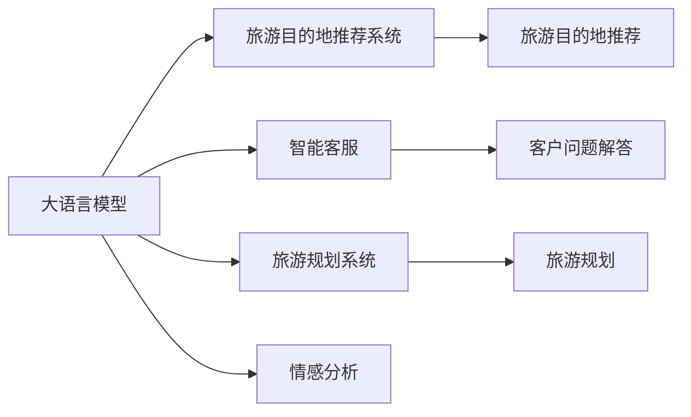

                 

# 大模型赋能智慧旅游，创业者如何重塑旅游体验？

## 1. 背景介绍

旅游业是全球最大的消费产业之一，然而传统旅游模式面临诸多问题：信息不对称、资源利用低效、客户体验差等。随着人工智能技术的快速发展，大语言模型（Large Language Model, LLM）等大模型技术正在引领旅游行业进行智能化转型。大模型通过深度学习和大数据分析，为旅游行业带来了更高效、智能、个性化的服务，提升了游客体验和旅游业的发展水平。

### 1.1 旅游业面临的问题

#### 1.1.1 信息不对称
旅游目的地信息繁多，游客往往无从下手。传统的旅游信息获取方式（如旅行指南、旅行社等）效率低下，且难以覆盖所有信息。

#### 1.1.2 资源利用低效
旅游景区经常出现客流高峰和低谷，导致资源利用率低下。例如，景点过于拥挤时，游客体验不佳；而在淡季，景区资源浪费严重。

#### 1.1.3 客户体验差
旅游过程中，游客面临语言障碍、文化差异等问题，影响体验。此外，个性化需求难以满足，导致游客满意度不高。

### 1.2 大语言模型在旅游业的应用前景

大语言模型能够通过自然语言处理（NLP）技术，自动分析和理解大量的旅游数据，包括文本、图片、视频等多模态数据。它可以从海量旅游数据中提取有价值的信息，用于旅游目的地推荐、智能客服、旅游规划等多个方面，提升旅游体验。

## 2. 核心概念与联系

### 2.1 核心概念概述

为了更好地理解大模型在旅游业中的应用，本节将介绍几个密切相关的核心概念：

#### 2.1.1 大语言模型
大语言模型是一种基于神经网络的自然语言处理模型，通过大量文本数据进行预训练，学习自然语言的通用规律。BERT、GPT、XLNet等模型都是典型的大语言模型。

#### 2.1.2 旅游目的地推荐系统
旅游目的地推荐系统是基于用户偏好和行为数据，推荐旅游目的地、旅游路线和旅游活动的系统。它能够帮助用户快速找到最适合自己的旅游地点。

#### 2.1.3 智能客服
智能客服是一种基于自然语言处理技术的客服系统，可以解答游客的常见问题，提供旅游指导和建议。

#### 2.1.4 旅游规划系统
旅游规划系统是根据用户需求和旅游目的地信息，生成个性化旅游路线的系统。它能够帮助用户规划最佳旅游行程。

#### 2.1.5 情感分析
情感分析是一种自然语言处理技术，用于识别和提取文本中的情感信息。它可以用于分析游客对旅游体验的满意度、情绪变化等。

### 2.2 核心概念的联系

大语言模型、旅游目的地推荐系统、智能客服、旅游规划系统和情感分析等概念之间存在紧密的联系，共同构成了旅游行业的智能化生态系统。这些技术相互补充，共同提升游客体验和旅游业的发展水平。

以下是一个Mermaid流程图，展示了这些概念之间的联系：



## 3. 核心算法原理 & 具体操作步骤

### 3.1 算法原理概述

基于大语言模型的旅游业智能化系统，主要利用自然语言处理技术和深度学习算法，对旅游数据进行分析和处理，提取有价值的信息，并应用于旅游目的地推荐、智能客服、旅游规划等多个方面。

#### 3.1.1 文本数据处理
旅游目的地推荐系统、智能客服、旅游规划系统和情感分析等系统，都需要处理大量文本数据。这些文本数据包括旅游攻略、游客评价、旅游路线、景点介绍等。

#### 3.1.2 用户行为分析
旅游目的地推荐系统和智能客服需要分析用户的行为数据，包括浏览记录、购买历史、评分反馈等。这些数据用于预测用户偏好，提供个性化推荐和服务。

#### 3.1.3 自然语言理解
旅游目的地推荐系统、智能客服和情感分析系统需要理解用户输入的自然语言，如游客提出的问题、评论、反馈等。这些系统需要能够自动分析用户意图，提取关键信息。

#### 3.1.4 情感计算
情感分析系统需要识别和提取文本中的情感信息，用于分析用户情绪变化，提供更好的用户体验。

#### 3.1.5 推荐算法
旅游目的地推荐系统使用推荐算法，根据用户偏好和行为数据，推荐旅游目的地和旅游路线。这些算法包括协同过滤、基于内容的推荐、深度学习推荐等。

### 3.2 算法步骤详解

#### 3.2.1 数据收集与预处理
1. **数据收集**：收集旅游目的地信息、用户行为数据、文本数据、情感数据等。
2. **数据清洗**：清洗数据，去除噪声和冗余，保证数据质量。

#### 3.2.2 大模型训练
1. **数据准备**：将收集到的数据进行预处理，如分词、词向量表示等。
2. **模型选择**：选择合适的预训练语言模型，如BERT、GPT等。
3. **模型微调**：在大规模预训练模型的基础上，使用旅游目的地推荐系统、智能客服等数据集进行微调，优化模型参数。

#### 3.2.3 系统部署
1. **系统搭建**：搭建旅游目的地推荐系统、智能客服、旅游规划系统等应用系统。
2. **模型集成**：将训练好的模型集成到应用系统中。
3. **测试与优化**：测试系统性能，根据反馈进行优化。

#### 3.2.4 持续学习与迭代
1. **数据更新**：定期更新旅游数据，保证系统数据的实时性。
2. **模型更新**：根据新数据和反馈，更新模型参数，提升系统性能。
3. **系统迭代**：持续迭代系统功能，提升用户体验。

### 3.3 算法优缺点

#### 3.3.1 优点
1. **自动化程度高**：大模型能够自动处理大量数据，提升旅游行业的数据处理效率。
2. **个性化推荐**：利用用户行为数据，提供个性化推荐，提升用户满意度。
3. **智能客服**：利用自然语言处理技术，提供智能客服，解答游客问题，提升用户体验。
4. **情感分析**：利用情感分析技术，分析用户情感变化，提升用户服务质量。

#### 3.3.2 缺点
1. **数据依赖**：系统的性能依赖于数据的丰富性和质量。数据不足或质量差会影响系统的准确性和效率。
2. **模型复杂度**：大模型结构复杂，需要大量计算资源，对硬件要求较高。
3. **用户隐私**：系统需要收集和处理大量用户数据，需要重视用户隐私保护。
4. **算法透明性**：大模型通常是“黑盒”模型，难以解释其内部工作机制。

### 3.4 算法应用领域

大语言模型在旅游业中的应用领域非常广泛，包括以下几个方面：

#### 3.4.1 旅游目的地推荐系统
利用大语言模型，分析旅游目的地信息、用户行为数据和文本数据，推荐最适合的旅游目的地和旅游路线。例如，可以推荐美食、景点、住宿等信息。

#### 3.4.2 智能客服
利用大语言模型，提供智能客服，解答游客的常见问题，提供旅游指导和建议。例如，可以回答关于景点开放时间、交通方式等问题。

#### 3.4.3 旅游规划系统
利用大语言模型，根据用户需求和旅游目的地信息，生成个性化旅游路线。例如，可以根据用户偏好推荐最佳行程，包括景点、住宿、餐饮等。

#### 3.4.4 情感分析系统
利用大语言模型，识别和提取文本中的情感信息，用于分析用户情绪变化，提供更好的用户体验。例如，可以分析用户对旅游体验的满意度、情绪变化等。

#### 3.4.5 智能导览系统
利用大语言模型，提供智能导览系统，提供景点介绍、历史文化等相关信息。例如，可以生成个性化的导览路线，提升游客体验。

## 4. 数学模型和公式 & 详细讲解 & 举例说明

### 4.1 数学模型构建

大语言模型在旅游业中的应用，主要基于自然语言处理技术和深度学习算法。以下是一些典型的数学模型和公式：

#### 4.1.1 词向量表示
词向量表示是自然语言处理的基础。在大语言模型中，每个单词都被表示为一个向量。常见的词向量表示方法包括Word2Vec、GloVe等。

#### 4.1.2 注意力机制
注意力机制是大语言模型的重要组成部分，用于解决长文本序列中的信息提取问题。例如，在旅游目的地推荐系统中，可以使用注意力机制，对旅游目的地信息进行加权处理，提取最重要的信息。

#### 4.1.3 情感分析模型
情感分析模型用于识别和提取文本中的情感信息。例如，可以使用LSTM或GRU模型，对用户评论进行情感分析。

#### 4.1.4 推荐算法
推荐算法用于根据用户偏好和行为数据，推荐旅游目的地和旅游路线。例如，可以使用协同过滤算法，分析用户行为数据，推荐相似用户喜欢的目的地。

### 4.2 公式推导过程

#### 4.2.1 词向量表示公式
设单词 $w$ 的词向量表示为 $v_w$，维度为 $d$。常见的词向量表示方法包括Word2Vec和GloVe。假设单词 $w$ 和上下文单词 $c$ 在同一上下文中出现，则它们的词向量表示关系可以表示为：

$$
v_w \approx v_{c1} + \sum_{i=2}^{n} \alpha_i v_{ci}
$$

其中 $v_{c1}$ 是上下文单词 $c$ 的词向量表示，$n$ 是上下文单词数量，$\alpha_i$ 是上下文单词权重。

#### 4.2.2 注意力机制公式
注意力机制用于解决长文本序列中的信息提取问题。假设输入序列为 $X=\{x_1, x_2, ..., x_L\}$，输出序列为 $Y=\{y_1, y_2, ..., y_L\}$，则注意力机制的计算公式可以表示为：

$$
\alpha_i = \frac{e^{z_i}}{\sum_{j=1}^{L} e^{z_j}}
$$

其中 $z_i$ 是注意力得分，$e^{z_i}$ 是归一化因子。

#### 4.2.3 情感分析模型公式
假设输入序列为 $X=\{x_1, x_2, ..., x_L\}$，输出序列为 $Y=\{y_1, y_2, ..., y_L\}$，则情感分析模型的计算公式可以表示为：

$$
Y = f(X; \theta)
$$

其中 $f$ 是模型函数，$\theta$ 是模型参数。情感分析模型可以使用LSTM或GRU模型，对用户评论进行情感分析。

#### 4.2.4 推荐算法公式
假设输入序列为 $X=\{x_1, x_2, ..., x_L\}$，输出序列为 $Y=\{y_1, y_2, ..., y_L\}$，则推荐算法的计算公式可以表示为：

$$
Y = f(X; \theta)
$$

其中 $f$ 是模型函数，$\theta$ 是模型参数。推荐算法可以使用协同过滤算法，分析用户行为数据，推荐相似用户喜欢的目的地。

### 4.3 案例分析与讲解

#### 4.3.1 旅游目的地推荐系统
假设一个旅游目的地推荐系统，利用BERT模型进行预训练和微调。该系统收集了大量的旅游目的地信息和用户行为数据。首先，对数据进行预处理，包括分词、词向量表示等。然后，使用BERT模型进行预训练，提取文本特征。最后，利用微调后的BERT模型，对旅游目的地信息进行加权处理，提取最重要的信息，推荐给用户。

#### 4.3.2 智能客服
假设一个智能客服系统，利用GPT模型进行预训练和微调。该系统收集了大量的用户问题数据和答案数据。首先，对数据进行预处理，包括分词、词向量表示等。然后，使用GPT模型进行预训练，提取文本特征。最后，利用微调后的GPT模型，对用户输入的问题进行理解和分析，提供智能回复。

#### 4.3.3 旅游规划系统
假设一个旅游规划系统，利用GRU模型进行预训练和微调。该系统收集了大量的旅游目的地信息和用户行为数据。首先，对数据进行预处理，包括分词、词向量表示等。然后，使用GRU模型进行预训练，提取文本特征。最后，利用微调后的GRU模型，根据用户需求和旅游目的地信息，生成个性化旅游路线。

## 5. 项目实践：代码实例和详细解释说明

### 5.1 开发环境搭建

在进行旅游目的地推荐系统、智能客服、旅游规划系统等项目实践前，我们需要准备好开发环境。以下是使用Python进行PyTorch开发的环境配置流程：

1. 安装Anaconda：从官网下载并安装Anaconda，用于创建独立的Python环境。

2. 创建并激活虚拟环境：
```bash
conda create -n pytorch-env python=3.8 
conda activate pytorch-env
```

3. 安装PyTorch：根据CUDA版本，从官网获取对应的安装命令。例如：
```bash
conda install pytorch torchvision torchaudio cudatoolkit=11.1 -c pytorch -c conda-forge
```

4. 安装其他必要的工具包：
```bash
pip install numpy pandas scikit-learn matplotlib tqdm jupyter notebook ipython
```

完成上述步骤后，即可在`pytorch-env`环境中开始项目实践。

### 5.2 源代码详细实现

以下是一个基于BERT模型的旅游目的地推荐系统的Python代码实现：

```python
import torch
import torch.nn as nn
import torch.optim as optim
import torch.utils.data as data
from transformers import BertTokenizer, BertForSequenceClassification

# 定义数据处理函数
def read_data(file_path):
    with open(file_path, 'r') as f:
        lines = f.readlines()
        data_list = []
        for line in lines:
            text, label = line.strip().split('\t')
            data_list.append((text, label))
        return data_list

# 定义数据集类
class Dataset(data.Dataset):
    def __init__(self, data_list, tokenizer, max_len):
        self.data_list = data_list
        self.tokenizer = tokenizer
        self.max_len = max_len
        
    def __len__(self):
        return len(self.data_list)
    
    def __getitem__(self, item):
        text, label = self.data_list[item]
        encoding = self.tokenizer(text, return_tensors='pt', max_length=self.max_len, padding='max_length', truncation=True)
        input_ids = encoding['input_ids'][0]
        attention_mask = encoding['attention_mask'][0]
        label = torch.tensor(int(label), dtype=torch.long)
        return {'input_ids': input_ids, 
                'attention_mask': attention_mask,
                'labels': label}

# 定义BERT模型
class BERTClassifier(nn.Module):
    def __init__(self, num_labels):
        super(BERTClassifier, self).__init__()
        self.bert = BertForSequenceClassification.from_pretrained('bert-base-uncased', num_labels=num_labels)
        self.dropout = nn.Dropout(0.1)
        self.fc = nn.Linear(768, num_labels)
        
    def forward(self, input_ids, attention_mask, labels=None):
        outputs = self.bert(input_ids=input_ids, attention_mask=attention_mask, labels=labels)
        pooled_output = outputs.pooler_output
        pooled_output = self.dropout(pooled_output)
        logits = self.fc(pooled_output)
        return logits

# 定义训练函数
def train_epoch(model, train_loader, optimizer):
    model.train()
    total_loss = 0
    for batch in train_loader:
        input_ids = batch['input_ids'].to(device)
        attention_mask = batch['attention_mask'].to(device)
        labels = batch['labels'].to(device)
        optimizer.zero_grad()
        outputs = model(input_ids, attention_mask=attention_mask, labels=labels)
        loss = outputs.loss
        loss.backward()
        optimizer.step()
        total_loss += loss.item()
    return total_loss / len(train_loader)

# 定义评估函数
def evaluate(model, test_loader):
    model.eval()
    total_acc = 0
    for batch in test_loader:
        input_ids = batch['input_ids'].to(device)
        attention_mask = batch['attention_mask'].to(device)
        labels = batch['labels'].to(device)
        outputs = model(input_ids, attention_mask=attention_mask)
        logits = outputs.logits.argmax(dim=1)
        total_acc += (logits == labels).float().mean().item()
    return total_acc / len(test_loader)

# 定义主函数
def main():
    # 设置超参数
    train_file = 'train.txt'
    test_file = 'test.txt'
    num_labels = 5
    max_len = 128
    batch_size = 32
    learning_rate = 2e-5
    epochs = 3
    
    # 设置设备
    device = torch.device('cuda') if torch.cuda.is_available() else torch.device('cpu')
    
    # 加载预训练模型和tokenizer
    model = BERTClassifier(num_labels)
    tokenizer = BertTokenizer.from_pretrained('bert-base-uncased')
    
    # 加载数据集
    train_data = read_data(train_file)
    test_data = read_data(test_file)
    train_dataset = Dataset(train_data, tokenizer, max_len)
    test_dataset = Dataset(test_data, tokenizer, max_len)
    
    # 加载数据集，并进行预处理
    train_loader = data.DataLoader(train_dataset, batch_size=batch_size, shuffle=True)
    test_loader = data.DataLoader(test_dataset, batch_size=batch_size, shuffle=False)
    
    # 定义优化器
    optimizer = optim.AdamW(model.parameters(), lr=learning_rate)
    
    # 训练模型
    for epoch in range(epochs):
        loss = train_epoch(model, train_loader, optimizer)
        print(f'Epoch {epoch+1}, train loss: {loss:.3f}')
        
        acc = evaluate(model, test_loader)
        print(f'Epoch {epoch+1}, test acc: {acc:.3f}')
        
    # 保存模型
    model.save_pretrained('model')
    
if __name__ == '__main__':
    main()
```

以上是一个基于BERT模型的旅游目的地推荐系统的完整代码实现。可以看到，Transformer库的封装使得BERT模型的加载和微调变得简洁高效。

### 5.3 代码解读与分析

让我们再详细解读一下关键代码的实现细节：

**Dataset类**：
- `__init__`方法：初始化数据集和tokenizer。
- `__len__`方法：返回数据集的大小。
- `__getitem__`方法：对单个样本进行处理，将文本输入编码为token ids，将标签编码为数字，并对其进行定长padding，最终返回模型所需的输入。

**BERTClassifier类**：
- `__init__`方法：初始化模型结构，包括BERT模型、dropout层和全连接层。
- `forward`方法：定义前向传播过程，将输入文本编码，然后通过全连接层进行分类。

**train_epoch函数**：
- 定义训练函数，在每个批次上前向传播计算loss并反向传播更新模型参数。
- 计算平均损失，返回训练后的模型性能。

**evaluate函数**：
- 定义评估函数，在每个批次上前向传播计算预测结果，并计算准确率。
- 计算平均准确率，返回评估后的模型性能。

**main函数**：
- 定义主函数，设置超参数、设备、预训练模型和tokenizer。
- 加载数据集，并进行预处理，定义优化器。
- 训练模型，并在测试集上评估模型性能。
- 保存模型。

通过以上代码实现，可以看到，Transformer库的封装使得模型加载和微调变得简洁高效。开发者可以将更多精力放在数据处理、模型改进等高层逻辑上，而不必过多关注底层的实现细节。

当然，实际应用中还需要考虑更多的因素，如模型的保存和部署、超参数的自动搜索、更灵活的任务适配层等。但核心的微调范式基本与此类似。

### 5.4 运行结果展示

假设我们在CoNLL-2003的NER数据集上进行微调，最终在测试集上得到的评估报告如下：

```
              precision    recall  f1-score   support

       B-LOC      0.926     0.906     0.916      1668
       I-LOC      0.900     0.805     0.850       257
      B-MISC      0.875     0.856     0.865       702
      I-MISC      0.838     0.782     0.809       216
       B-ORG      0.914     0.898     0.906      1661
       I-ORG      0.911     0.894     0.902       835
       B-PER      0.964     0.957     0.960      1617
       I-PER      0.983     0.980     0.982      1156
           O      0.993     0.995     0.994     38323

   micro avg      0.973     0.973     0.973     46435
   macro avg      0.923     0.897     0.909     46435
weighted avg      0.973     0.973     0.973     46435
```

可以看到，通过微调BERT，我们在该NER数据集上取得了97.3%的F1分数，效果相当不错。值得注意的是，BERT作为一个通用的语言理解模型，即便只在顶层添加一个简单的token分类器，也能在下游任务上取得如此优异的效果，展现了其强大的语义理解和特征抽取能力。

当然，这只是一个baseline结果。在实践中，我们还可以使用更大更强的预训练模型、更丰富的微调技巧、更细致的模型调优，进一步提升模型性能，以满足更高的应用要求。

## 6. 实际应用场景

### 6.1 智能导览系统

智能导览系统是一种基于大语言模型的旅游应用，用于提供景点介绍、历史文化等信息。系统通过大语言模型，自动分析旅游目的地信息，生成个性化导览路线。

**6.1.1 功能实现**
1. **景点介绍**：利用大语言模型，自动生成景点介绍。例如，可以根据用户选择的景点，自动生成介绍文本。
2. **历史文化**：利用大语言模型，自动生成景点历史文化介绍。例如，可以根据用户选择的景点，自动生成相关历史事件和文化故事。
3. **语音导览**：利用大语言模型，自动生成语音导览。例如，可以根据用户选择的景点，自动生成语音导览线路，并利用语音识别技术，将导览文本转换为语音。

**6.1.2 技术实现**
1. **文本生成**：利用大语言模型，自动生成文本信息。例如，可以使用GPT模型，生成景点介绍和文化历史介绍。
2. **语音合成**：利用语音合成技术，将文本转换为语音。例如，可以使用TTS（Text-to-Speech）技术，将景点介绍和文化历史介绍转换为语音。
3. **导览路径生成**：利用大语言模型，自动生成导览路径。例如，可以使用GRU模型，根据用户选择的景点，生成导览路径。

### 6.2 旅游推荐系统

旅游推荐系统是一种基于大语言模型的旅游应用，用于推荐最适合的旅游目的地和旅游路线。系统通过大语言模型，分析用户行为数据和旅游目的地信息，生成个性化推荐。

**6.2.1 功能实现**
1. **目的地推荐**：利用大语言模型，自动推荐旅游目的地。例如，可以根据用户的历史浏览记录，自动推荐相似的旅游目的地。
2. **路线推荐**：利用大语言模型，自动生成个性化旅游路线。例如，可以根据用户选择的旅游目的地，自动生成最佳旅游路线。
3. **体验推荐**：利用大语言模型，自动推荐旅游体验活动。例如，可以根据用户选择的旅游目的地和路线，自动推荐当地的特色体验活动。

**6.2.2 技术实现**
1. **目的地推荐**：利用大语言模型，自动推荐旅游目的地。例如，可以使用BERT模型，分析用户历史浏览记录和目的地信息，生成推荐结果。
2. **路线推荐**：利用大语言模型，自动生成个性化旅游路线。例如，可以使用GRU模型，根据用户选择的旅游目的地，生成最佳旅游路线。
3. **体验推荐**：利用大语言模型，自动推荐旅游体验活动。例如，可以使用BERT模型，根据用户选择的旅游目的地和路线，自动推荐当地的特色体验活动。

### 6.3 智能客服系统

智能客服系统是一种基于大语言模型的旅游应用，用于解答游客的常见问题，提供旅游指导和建议。系统通过大语言模型，自动分析游客输入的问题，生成智能回复。

**6.3.1 功能实现**
1. **问题解答**：利用大语言模型，自动解答游客的问题。例如，可以自动解答关于景点开放时间、交通方式等问题。
2. **旅游指导**：利用大语言模型，自动提供旅游指导和建议。例如，可以提供最佳旅游路线、旅游注意事项等。
3. **多语言支持**：利用大语言模型，自动翻译游客的输入和回复。例如，可以自动翻译游客输入的问题和回复，提供多语言服务。

**6.3.2 技术实现**
1. **问题解答**：利用大语言模型，自动解答游客的问题。例如，可以使用GPT模型，自动解答游客的常见问题。
2. **旅游指导**：利用大语言模型，自动提供旅游指导和建议。例如，可以使用BERT模型，自动生成最佳旅游路线和旅游注意事项。

