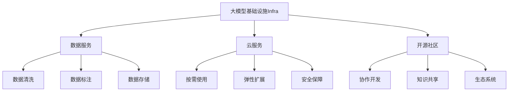
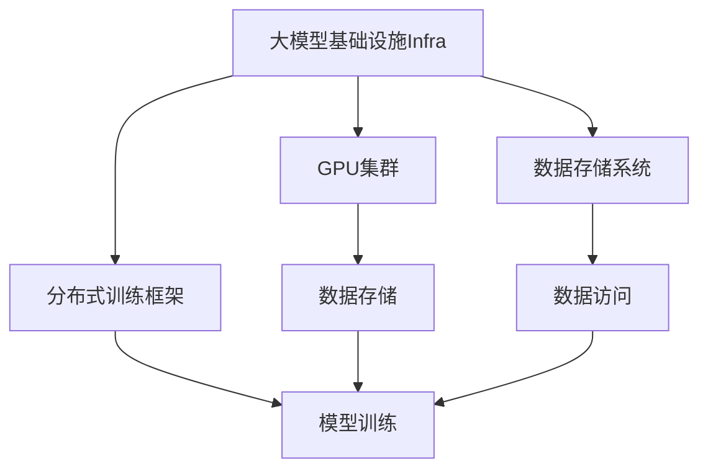
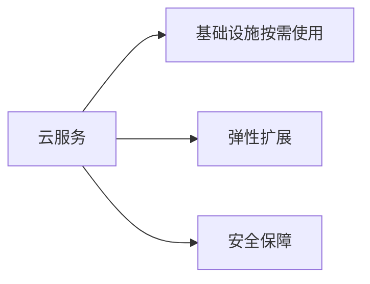
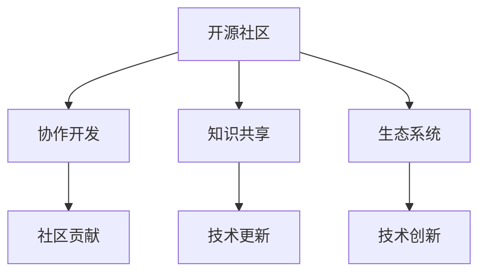

                 

# 大模型基础设施(Infra)的盈利模式探讨

> 关键词：
大模型基础设施、盈利模式、人工智能、AI平台、数据服务、云服务、技术创新

## 1. 背景介绍

### 1.1 问题由来
近年来，随着人工智能技术的快速发展，尤其是深度学习和大模型的兴起，大模型基础设施建设逐渐成为行业焦点。大模型基础设施为大规模模型的训练和部署提供了高效、便捷的解决方案，极大推动了AI应用的落地和产业化进程。然而，如何有效挖掘这些基础设施的价值，探索可持续的盈利模式，成为一个亟待解决的问题。

### 1.2 问题核心关键点
在探讨大模型基础设施的盈利模式时，我们需要关注以下几个核心问题：
- 大模型基础设施的建设、运维和管理模式是怎样的？
- 用户如何利用这些基础设施进行大模型的训练和部署？
- 基于这些基础设施，可以提供哪些商业服务？
- 大模型基础设施的盈利模式有哪些？各模式的优势和局限是什么？
- 如何平衡基础设施建设成本与收益，实现商业可持续发展？

### 1.3 问题研究意义
探索大模型基础设施的盈利模式，对于推动AI技术的商业化、加速产业升级具有重要意义：
- 为AI公司提供基础设施建设的指导，降低技术门槛和运营成本。
- 丰富AI平台的商业变现手段，提升公司的盈利能力。
- 促进大模型技术的应用落地，加速AI在各垂直行业的渗透。
- 探索基础设施与应用的深度融合，实现业务价值的最大化。

## 2. 核心概念与联系

### 2.1 核心概念概述

为更好地理解大模型基础设施的盈利模式，本节将介绍几个密切相关的核心概念：

- 大模型基础设施（Infra）：指用于支持大模型训练、推理和部署的一系列软硬件资源，包括GPU集群、分布式训练框架、数据存储系统、云服务等。
- 数据服务：指提供数据采集、清洗、标注和存储等服务，是大模型训练的重要支撑。
- 云服务：指通过云计算平台提供大模型基础设施的按需使用，提升资源的利用效率和灵活性。
- 开源社区：指围绕大模型基础设施的开发、部署和应用形成的技术生态系统，促进知识共享和创新。

这些概念之间的逻辑关系可以通过以下Mermaid流程图来展示：



这个流程图展示了大模型基础设施的核心概念及其之间的关系：

1. 大模型基础设施作为AI的核心基础设施，与数据服务、云服务、开源社区等密切相关，共同构建了AI的生态系统。
2. 数据服务为基础设施提供了数据支撑，通过清洗、标注和存储服务，提升数据质量和可用性。
3. 云服务提供按需使用、弹性扩展和安全保障等能力，提高了基础设施的灵活性和可管理性。
4. 开源社区促进知识共享和协作开发，推动技术的快速迭代和创新。

### 2.2 概念间的关系

这些核心概念之间存在着紧密的联系，形成了大模型基础设施的整体生态系统。下面我们通过几个Mermaid流程图来展示这些概念之间的关系。

#### 2.2.1 大模型基础设施的构建



这个流程图展示了构建大模型基础设施的关键步骤：

1. 基础设施的核心组成部分包括GPU集群、分布式训练框架和数据存储系统。
2. GPU集群提供计算资源，分布式训练框架提供训练框架，数据存储系统提供数据存储和访问服务。
3. 各组件相互依赖，共同支持模型的训练和推理。

#### 2.2.2 云服务与基础设施的关系



这个流程图展示了云服务与基础设施的关系：

1. 云服务提供基础设施的按需使用，提高了资源的灵活性和利用效率。
2. 弹性扩展功能允许根据需求动态调整资源配置，确保系统的可扩展性和稳定性。
3. 安全保障服务确保基础设施和数据的安全性，避免信息泄露和攻击风险。

#### 2.2.3 开源社区的作用



这个流程图展示了开源社区的作用：

1. 开源社区促进开发者之间的协作开发，共同推进技术进步。
2. 知识共享机制推动技术经验和知识的快速传播，提高整体研发水平。
3. 生态系统形成技术创新的良性循环，加速新思想的孵化和应用。

## 3. 核心算法原理 & 具体操作步骤
### 3.1 算法原理概述

大模型基础设施的盈利模式设计，需要综合考虑基础设施的成本、服务能力和市场需求。主要盈利模式包括：

- 硬件基础设施销售：提供GPU集群、服务器等硬件设备的直销服务。
- 云服务按需付费：按使用量收费，提供大模型训练、推理等服务的弹性扩展。
- 数据服务收费：提供数据清洗、标注和存储等服务，收取数据处理费用。
- 平台订阅模式：提供AI平台的订阅服务，涵盖模型训练、推理、部署和管理等全生命周期服务。
- 开源社区支持：提供技术支持和社区协作平台，促进技术的迭代和创新。

### 3.2 算法步骤详解

探索大模型基础设施盈利模式的步骤如下：

**Step 1: 确定基础设施成本和收益模型**

- 计算基础设施的建设、运维和管理成本。
- 分析目标市场的需求和价格弹性，预测服务收益。
- 进行成本-收益分析，制定盈利目标。

**Step 2: 设计服务方案**

- 根据成本和收益模型，设计差异化的服务方案。
- 确定服务的计费方式，如按需付费、订阅服务等。
- 制定服务协议和条款，明确服务的边界和使用规则。

**Step 3: 市场推广和用户反馈**

- 制定市场推广策略，吸引用户使用基础设施。
- 收集用户反馈，优化服务方案和用户体验。
- 不断迭代和优化，提升市场竞争力。

**Step 4: 用户运营和数据服务**

- 提供持续的客户支持和维护服务。
- 提供数据清洗、标注和存储等数据服务，提升数据质量。
- 利用数据服务，吸引更多用户和提高收益。

**Step 5: 技术创新和社区支持**

- 持续技术创新，提升基础设施的服务能力和用户体验。
- 提供开源社区支持，促进技术交流和协作开发。
- 形成技术生态系统，推动技术进步和应用落地。

### 3.3 算法优缺点

大模型基础设施盈利模式的优缺点如下：

**优点：**

- 提供丰富的服务选择，满足不同用户的需求。
- 灵活的计费方式，降低用户的使用成本。
- 按需付费模式，降低固定成本。
- 云服务和开源社区支持，提升生态系统的活力和创新能力。

**缺点：**

- 基础设施的建设和运维成本较高。
- 服务定价复杂，需要精细化的市场分析。
- 数据服务的质量和准确性依赖于数据清洗和标注的精度。
- 技术创新的投入较大，需要持续的技术研发和投入。

### 3.4 算法应用领域

大模型基础设施的盈利模式可以应用于多个领域：

- 高性能计算中心：提供GPU集群和分布式训练框架，支持大规模模型的训练。
- 云服务平台：提供云服务按需付费，支持弹性扩展和安全保障。
- 数据服务提供商：提供数据清洗、标注和存储服务，支持模型训练和推理。
- AI平台运营商：提供AI平台的订阅服务，涵盖模型训练、推理、部署和管理。
- 开源社区支持商：提供技术支持和社区协作平台，促进技术的迭代和创新。

## 4. 数学模型和公式 & 详细讲解 & 举例说明（备注：数学公式请使用latex格式，latex嵌入文中独立段落使用 $$，段落内使用 $)
### 4.1 数学模型构建

大模型基础设施的盈利模式可以采用以下数学模型进行建模：

设大模型基础设施的建设成本为 $C$，年运维成本为 $M$，年收益为 $R$，则盈亏平衡点为 $R_0$，满足：

$$
R = C + M
$$

式中 $R_0$ 为盈亏平衡点，即年收益等于年成本。

### 4.2 公式推导过程

假设基础设施的服务价格为 $P$，每月使用量为 $U$，则每月收益为 $P \times U$。假设每月的运营成本为 $O$，则年收益为 $12 \times P \times U - 12 \times O$。因此，年收益 $R$ 可以表示为：

$$
R = 12 \times P \times U - 12 \times O
$$

将上式代入盈亏平衡点公式 $R_0 = C + M$，得：

$$
12 \times P \times U - 12 \times O = C + M
$$

简化得：

$$
P \times U - O = \frac{C + M}{12}
$$

### 4.3 案例分析与讲解

假设某公司的基础设施建设成本为 $C = 100,000,000$ 美元，年运维成本为 $M = 10,000,000$ 美元，每月的服务价格为 $P = 1000$ 美元，每月使用量为 $U = 500$，每月的运营成本为 $O = 500,000$ 美元。则年收益 $R$ 可以计算如下：

$$
R = 12 \times P \times U - 12 \times O = 12 \times 1000 \times 500 - 12 \times 500,000 = 30,000,000 - 6,000,000 = 24,000,000
$$

因此，盈亏平衡点为 $R_0 = C + M = 100,000,000 + 10,000,000 = 110,000,000$。

## 5. 项目实践：代码实例和详细解释说明
### 5.1 开发环境搭建

在进行盈利模式探索时，我们需要准备好开发环境。以下是使用Python进行数据分析和计算的环境配置流程：

1. 安装Anaconda：从官网下载并安装Anaconda，用于创建独立的Python环境。

2. 创建并激活虚拟环境：
```bash
conda create -n pyenv python=3.8 
conda activate pyenv
```

3. 安装相关库：
```bash
pip install pandas numpy sympy sympy
```

完成上述步骤后，即可在`pyenv`环境中开始盈利模式探索的实践。

### 5.2 源代码详细实现

这里以计算大模型基础设施的盈亏平衡点为例，给出Python代码实现：

```python
from sympy import symbols, Eq, solve

# 定义符号变量
C, M, P, U, O = symbols('C M P U O')

# 构建盈亏平衡点方程
equation = Eq(P * U - O, (C + M) / 12)

# 求解盈亏平衡点
R0 = solve(equation, P * U - O)[0]

# 打印盈亏平衡点
print(f"盈亏平衡点为：{R0}")
```

### 5.3 代码解读与分析

让我们再详细解读一下关键代码的实现细节：

**符号定义**：
- 使用Sympy库定义符号变量，方便后续计算。

**盈亏平衡点方程**：
- 根据公式 $P \times U - O = \frac{C + M}{12}$，构建盈亏平衡点方程。

**求解盈亏平衡点**：
- 使用Sympy求解方程，得到盈亏平衡点 $R_0$。

**输出盈亏平衡点**：
- 打印盈亏平衡点，便于观察和分析。

### 5.4 运行结果展示

假设我们已经计算出大模型基础设施的盈亏平衡点为 $R_0 = 20,000,000$，即每月收益为 $20,000,000$ 美元时，公司将实现盈亏平衡。这表明，为了实现盈利，每月服务价格和用户数量的乘积需要达到 $20,000,000$ 美元。

## 6. 实际应用场景
### 6.1 高性能计算中心

大模型基础设施可以构建高性能计算中心，支持大规模模型的训练和推理。例如，Google的TPU（Tensor Processing Unit）提供的大模型基础设施，通过按需付费模式，为企业提供高性能计算资源，支持各类深度学习模型的训练和推理。

### 6.2 云服务平台

大模型基础设施可以构建云服务平台，提供大模型训练、推理等服务的弹性扩展。例如，AWS的云服务平台提供GPU实例、分布式训练框架等基础设施，支持AI模型的全生命周期管理。

### 6.3 数据服务提供商

大模型基础设施可以提供数据清洗、标注和存储服务，提升数据质量。例如，Kaggle提供的数据服务，帮助用户获取高质量的数据集，支持模型训练和验证。

### 6.4 开源社区支持

大模型基础设施可以提供开源社区支持，促进技术交流和协作开发。例如，TensorFlow提供丰富的开源资源和社区支持，帮助开发者快速上手并实现技术创新。

### 6.5 未来应用展望

未来，大模型基础设施将在更多领域得到应用，为AI技术落地提供更强大的支撑：

1. 智能制造：支持大规模模型的训练和推理，实现智能生产线的优化和预测。
2. 智慧城市：提供大模型基础设施，支持智能交通、环境监测等城市管理应用。
3. 医疗健康：支持医疗影像分析、基因组学等领域的AI应用，提升医疗服务的智能化水平。
4. 金融服务：提供AI平台和数据服务，支持风险评估、投资分析等金融应用。
5. 教育培训：提供AI平台和数据服务，支持智能教学、自动批改等教育应用。

## 7. 工具和资源推荐
### 7.1 学习资源推荐

为了帮助开发者系统掌握大模型基础设施的盈利模式，这里推荐一些优质的学习资源：

1. 《人工智能基础设施建设与运营》系列博文：详细介绍了基础设施的建设、运维和管理模式，涵盖GPU集群、分布式训练框架、数据存储系统等关键技术。

2. 《深度学习实战》课程：斯坦福大学开设的深度学习实战课程，涵盖大模型基础设施的建设、优化和应用，适合实战技能的学习和提升。

3. 《AI基础设施建设指南》书籍：全面介绍了大模型基础设施的建设和管理方法，包括硬件基础设施、云服务、数据服务等内容。

4. 《AI基础设施优化》书籍：介绍基础设施的优化技术，如硬件加速、分布式训练、模型压缩等，提升基础设施的性能和效率。

5. 《AI基础设施管理》课程：课程内容涵盖基础设施的运维、监控、安全等方面，帮助开发者提升基础设施管理能力。

通过对这些资源的学习实践，相信你一定能够全面掌握大模型基础设施的盈利模式，并用于解决实际的商业问题。

### 7.2 开发工具推荐

高效的开发离不开优秀的工具支持。以下是几款用于大模型基础设施开发和运营的工具：

1. Docker：提供容器化技术，方便基础设施的部署和迁移。

2. Kubernetes：提供集群管理和调度，提升基础设施的灵活性和可扩展性。

3. Prometheus：提供监控和告警系统，实时监测基础设施的运行状态。

4. ELK Stack：提供日志管理和可视化，帮助调试和优化基础设施。

5. Terraform：提供基础设施的自动化部署，减少人工干预和提升部署效率。

6. Ansible：提供自动化配置管理，方便基础设施的快速配置和部署。

合理利用这些工具，可以显著提升大模型基础设施的开发和运营效率，确保系统的稳定性和可扩展性。

### 7.3 相关论文推荐

大模型基础设施的建设与运营涉及众多技术前沿，以下是几篇奠基性的相关论文，推荐阅读：

1. "Scalable Deep Learning" by Gupta et al.：介绍了大规模深度学习的系统架构和优化技术，推动大模型基础设施的发展。

2. "Large-Scale Deep Learning with GPUs" by Dean et al.：探讨了使用GPU加速大规模深度学习的技术和方法，推动硬件基础设施的进步。

3. "Scalable Deep Learning via Model Parallelism" by Yang et al.：提出了模型并行化的技术方案，提升大规模深度学习的计算效率。

4. "Big Data Management and Processing" by Ramakrishnan et al.：介绍了大数据管理和处理的技术方法，支持大规模数据集的存储和处理。

5. "Optimizing Big Data Clusters: An Evaluation of Platforms and Practices" by Sahin et al.：评估了大数据集群的管理和优化方法，提升基础设施的性能和可靠性。

这些论文代表了大模型基础设施的发展脉络，帮助研究者把握学科前进方向，激发更多的创新灵感。

除上述资源外，还有一些值得关注的前沿资源，帮助开发者紧跟大模型基础设施的最新进展，例如：

1. arXiv论文预印本：人工智能领域最新研究成果的发布平台，包括大量尚未发表的前沿工作，学习前沿技术的必读资源。

2. 业界技术博客：如Google AI、Microsoft Azure、Amazon Web Services等顶尖实验室的官方博客，第一时间分享他们的最新研究成果和洞见。

3. 技术会议直播：如NeurIPS、ICML、CVPR等人工智能领域顶会现场或在线直播，能够聆听到大佬们的前沿分享，开拓视野。

4. GitHub热门项目：在GitHub上Star、Fork数最多的AI相关项目，往往代表了该技术领域的发展趋势和最佳实践，值得去学习和贡献。

5. 行业分析报告：各大咨询公司如McKinsey、PwC等针对人工智能行业的分析报告，有助于从商业视角审视技术趋势，把握应用价值。

总之，对于大模型基础设施的盈利模式的学习和实践，需要开发者保持开放的心态和持续学习的意愿。多关注前沿资讯，多动手实践，多思考总结，必将收获满满的成长收益。

## 8. 总结：未来发展趋势与挑战
### 8.1 总结

本文对大模型基础设施的盈利模式进行了全面系统的介绍。首先阐述了基础设施的建设、运维和管理模式，明确了不同服务模式的优势和局限。其次，从原理到实践，详细讲解了基础设施的建设和运营过程，给出了具体的盈利模式探索案例。同时，本文还广泛探讨了基础设施在各个领域的应用前景，展示了其巨大的应用潜力。此外，本文精选了基础设施的相关学习资源，力求为读者提供全方位的技术指引。

通过本文的系统梳理，可以看到，大模型基础设施为AI技术的商业化、产业化提供了重要支撑，具有广阔的市场应用前景。未来的研究需要在基础设施的建设、运维、管理等方面持续创新，实现商业可持续发展。

### 8.2 未来发展趋势

展望未来，大模型基础设施的盈利模式将呈现以下几个发展趋势：

1. 基础设施的智能化和自动化：利用AI技术提升基础设施的智能化和自动化水平，减少人工干预，降低运营成本。

2. 数据服务的市场化：提供高质量的数据清洗、标注和存储服务，提升数据质量，满足更多用户需求。

3. 云服务的弹性化和定制化：提供弹性扩展和定制化服务，支持多样化的用户需求和业务场景。

4. 开源社区的活跃化：加强开源社区的支持和协作，推动技术创新和应用落地。

5. 生态系统的深度整合：将基础设施与数据服务、云服务、开源社区等要素深度整合，形成一体化解决方案。

这些趋势凸显了大模型基础设施的市场前景，为AI技术的商业化、产业化提供了新的方向和动力。

### 8.3 面临的挑战

尽管大模型基础设施的盈利模式已经取得了一些进展，但在迈向更加智能化、普适化应用的过程中，仍面临诸多挑战：

1. 基础设施的建设和运维成本高昂。硬件设备的购置和维护需要投入大量资金和资源，短期内难以大规模扩展。

2. 服务的定价和收费复杂。不同用户的需求和使用场景各异，需要精细化的市场分析和定价策略。

3. 数据服务的质量和可靠性依赖于数据质量和处理精度，存在数据偏差和错误的风险。

4. 技术创新的投入较大，需要持续的技术研发和投入。

5. 市场竞争激烈，需要不断提升基础设施的性能和服务质量，保持竞争力。

6. 基础设施的安全性和隐私保护需要加强，确保用户数据的安全性。

7. 基础设施的扩展和优化需要专业的团队和技术支持，存在技术人才短缺的风险。

### 8.4 研究展望

面对大模型基础设施的挑战，未来的研究需要在以下几个方面寻求新的突破：

1. 探索更多基础设施的建设和管理方案，提升基础设施的性能和效率。

2. 优化数据服务流程，提升数据质量和处理精度，确保服务质量。

3. 设计更加灵活的云服务模式，提升服务的可扩展性和定制化水平。

4. 加强开源社区支持，促进技术交流和协作开发，推动技术进步。

5. 引入AI技术提升基础设施的智能化和自动化水平，降低运营成本。

6. 加强基础设施的安全性和隐私保护，确保用户数据的安全性。

7. 引入更多技术人才，提升基础设施的扩展和优化能力。

这些研究方向将推动大模型基础设施的成熟和落地，为AI技术的商业化、产业化提供更坚实的支撑。

## 9. 附录：常见问题与解答

**Q1：大模型基础设施的主要盈利模式有哪些？**

A: 大模型基础设施的主要盈利模式包括：硬件基础设施销售、云服务按需付费、数据服务收费、平台订阅模式、开源社区支持。

**Q2：如何平衡基础设施建设成本与收益？**

A: 基础设施建设成本和收益的平衡需要精细化的市场分析和成本控制。可以通过成本-收益分析，制定盈利目标，并通过合理的定价策略、用户运营和数据服务等手段，提升基础设施的盈利能力。

**Q3：大模型基础设施的盈利模式是否适用于所有行业？**

A: 大模型基础设施的盈利模式可以应用于多个行业，但不同行业的需求和使用场景各异，需要根据具体需求进行定制化的服务设计和优化。

**Q4：如何降低大模型基础设施的运营成本？**

A: 可以通过技术创新和自动化管理来降低运营成本，如引入AI技术提升基础设施的智能化和自动化水平，优化数据服务流程，提高服务质量。

**Q5：如何提升大模型基础设施的市场竞争力？**

A: 可以通过提升基础设施的性能和服务质量，设计灵活的定价策略，加强开源社区支持和用户运营，引入更多技术人才等手段，提升市场竞争力。

---

作者：禅与计算机程序设计艺术 / Zen and the Art of Computer Programming

