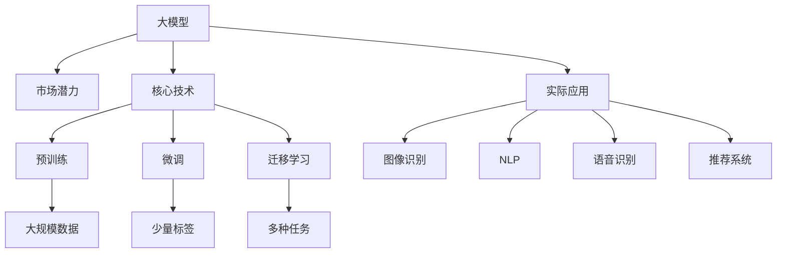
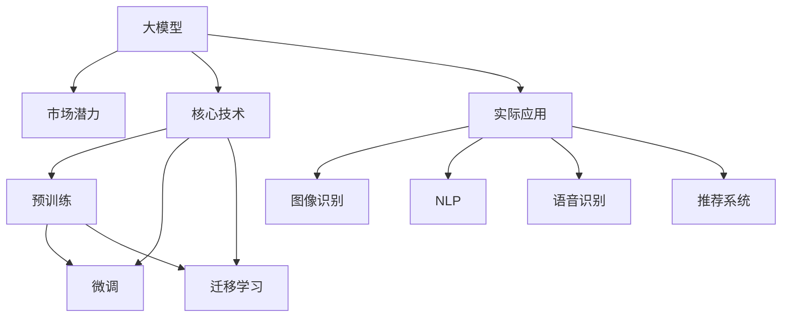

                 

# 大模型的市场潜力与挑战

大模型技术正引发深度学习领域的巨大变革，其市场潜力及面临的挑战成为业界和学术界关注的焦点。本文将从市场潜力、核心技术、实际应用和面临的挑战四个方面，全面剖析大模型技术的未来发展前景。

## 1. 背景介绍

### 1.1 问题由来

近年来，随着深度学习技术的快速发展，大模型技术在图像识别、自然语言处理（NLP）、语音识别等多个领域取得了突破性进展。尤其是以BERT、GPT为代表的大语言模型，通过在大规模无标签文本语料上进行预训练，学习到了丰富的语言知识和常识，展示出强大的语言理解和生成能力。

这些模型在多个领域的落地应用中表现出色，推动了深度学习技术的产业化进程，引发了业界对大模型技术潜力的关注和讨论。然而，大模型技术在实际应用中也面临诸多挑战，如算力成本、数据获取、模型泛化、用户隐私等问题，亟需从技术、应用、伦理等多个维度进行深入探讨。

### 1.2 问题核心关键点

本文聚焦于大模型的市场潜力和面临的挑战，具体包括以下几个核心问题：

- 大模型的市场规模与潜在的商业价值。
- 大模型的核心技术原理与优势。
- 大模型在实际应用中的具体场景和实现。
- 大模型在实际应用中面临的挑战与未来突破。

## 2. 核心概念与联系

### 2.1 核心概念概述

为了更好地理解大模型的市场潜力与挑战，我们首先介绍几个关键概念：

- **大模型（Large Model）**：指具有上亿参数规模的深度学习模型，如BERT、GPT、ResNet等。通过在大规模数据集上进行预训练，学习到丰富的语言或图像特征，能够在多种任务上取得优异的性能。
- **市场潜力**：指大模型技术在商业化应用中所能带来的潜在市场空间和经济收益。
- **核心技术**：指实现大模型技术的核心算法和架构，包括模型预训练、微调、迁移学习等。
- **实际应用**：指大模型技术在图像识别、自然语言处理、语音识别、推荐系统等多个领域的实际应用场景和实现方法。
- **面临的挑战**：指大模型技术在实际应用中遇到的计算资源、数据获取、模型泛化、隐私保护等技术难题。

### 2.2 概念间的关系

这些核心概念之间存在着紧密的联系，形成了大模型技术的完整生态系统。我们可以用以下Mermaid流程图来展示这些概念之间的关系：



这个流程图展示了从大模型到市场潜力、核心技术、实际应用的过程。预训练、微调和迁移学习是大模型的核心技术，而图像识别、NLP、语音识别和推荐系统是大模型的实际应用场景。

### 2.3 核心概念的整体架构

最后，我们用一个综合的流程图来展示这些核心概念在大模型技术的整体架构中的位置：



这个综合流程图展示了从预训练到微调、迁移学习，再到实际应用的市场潜力。

## 3. 核心算法原理 & 具体操作步骤

### 3.1 算法原理概述

大模型的核心算法原理主要涉及预训练、微调和迁移学习三个环节。预训练是指在大规模无标签数据上，通过自监督学习任务训练通用模型。微调则是在预训练模型的基础上，使用下游任务的少量标注数据进行有监督学习，优化模型在特定任务上的性能。迁移学习是将预训练模型的知识迁移到新的任务上，提升模型在新领域的适应能力。

### 3.2 算法步骤详解

1. **预训练阶段**：
   - 选择合适的大规模数据集，如ImageNet、COCO、维基百科等。
   - 使用自监督学习任务，如图像识别、语言建模、掩码预测等，在大规模数据集上进行预训练。
   - 定期评估模型在数据集上的表现，防止过拟合。

2. **微调阶段**：
   - 准备下游任务的少量标注数据集。
   - 在预训练模型基础上，添加任务适配层，设计适当的损失函数。
   - 选择合适的优化算法和超参数，进行微调训练。
   - 定期在验证集上评估模型性能，防止过拟合。

3. **迁移学习阶段**：
   - 选择目标任务，准备任务相关的数据集。
   - 在预训练模型的基础上，使用迁移学习技术，优化模型在目标任务上的表现。
   - 使用少量标注数据或零样本学习，提高模型的泛化能力。

### 3.3 算法优缺点

大模型技术的优点包括：

- **强大表现力**：通过预训练和微调，大模型在多种任务上能取得优异的性能，如图像分类、目标检测、自然语言理解等。
- **泛化能力强**：大模型通过大规模数据集进行预训练，能够学习到更丰富的语言或图像特征，泛化到新的任务上表现良好。
- **应用广泛**：大模型技术在多个领域（如医疗、金融、教育等）都有广泛应用，推动了相关产业的数字化转型。

然而，大模型技术也存在一些缺点：

- **计算资源需求高**：大模型参数量庞大，需要强大的计算资源进行训练和推理。
- **数据获取困难**：大规模数据集获取和标注成本高，特别是小样本任务的数据获取更难。
- **模型泛化不足**：大模型在特定领域的数据集上表现优秀，但在新领域或数据集上的泛化能力有限。
- **隐私和伦理问题**：大模型训练和推理过程中涉及大量数据，数据隐私和伦理问题需要重点关注。

### 3.4 算法应用领域

大模型技术在多个领域中都有广泛应用，具体包括：

- **图像识别**：如卷积神经网络（CNN）和ResNet等模型，通过大规模图像数据集进行预训练，应用于物体识别、人脸识别等任务。
- **自然语言处理**：如BERT、GPT等大语言模型，通过大规模文本数据集进行预训练，应用于文本分类、命名实体识别、问答系统等任务。
- **语音识别**：如卷积神经网络（CNN）、循环神经网络（RNN）和Transformer等模型，通过大规模语音数据集进行预训练，应用于语音识别、语音合成等任务。
- **推荐系统**：如深度学习推荐系统，通过用户行为数据进行预训练，应用于商品推荐、广告推荐等任务。

## 4. 数学模型和公式 & 详细讲解 & 举例说明

### 4.1 数学模型构建

大模型的数学模型通常基于神经网络架构，如CNN、RNN、Transformer等。我们以Transformer模型为例，介绍其基本数学模型构建。

Transformer模型包含编码器和解码器两个部分，其中编码器由多头自注意力机制和前向神经网络组成，解码器由多头自注意力机制、多头自注意力机制和前向神经网络组成。设输入序列为 $X$，输出序列为 $Y$，模型的目标是最小化损失函数 $L$：

$$
L = \sum_{i=1}^{n} \ell(X_i, Y_i)
$$

其中 $\ell$ 为损失函数，如交叉熵损失、均方误差损失等。

### 4.2 公式推导过程

以BERT模型为例，介绍其预训练任务的设计。BERT模型通过掩码预测和下一句预测任务进行预训练。设输入序列为 $X$，掩码为 $M$，模型预测为 $Y$，预训练任务为：

$$
\ell_{mask} = -\sum_{i=1}^{n} [\log p_{mask}(X_i, M_i) + \log (1-p_{mask}(X_i, M_i))]
$$

$$
\ell_{next} = -\sum_{i=1}^{n} [\log p_{next}(X_i, Y_i)]
$$

其中 $p_{mask}$ 和 $p_{next}$ 为掩码预测和下一句预测的概率，通过最大化这些概率来训练模型。

### 4.3 案例分析与讲解

以GPT模型为例，介绍其预训练任务和微调方法。GPT模型通过语言建模任务进行预训练，设输入序列为 $X$，输出序列为 $Y$，预训练任务为：

$$
\ell = -\sum_{i=1}^{n} \log p(X_i|X_{<i})
$$

其中 $p$ 为语言模型概率。在微调阶段，假设下游任务为分类任务，设输入序列为 $X$，标签为 $Y$，任务适配层为线性分类器，损失函数为交叉熵损失，微调任务为：

$$
\ell = -\sum_{i=1}^{n} \log p(Y_i|X_i, \theta)
$$

其中 $\theta$ 为微调后的模型参数，$Y_i$ 为标签。

## 5. 项目实践：代码实例和详细解释说明

### 5.1 开发环境搭建

进行大模型项目实践，首先需要准备好开发环境。以下是使用Python进行TensorFlow和PyTorch开发的环境配置流程：

1. 安装Anaconda：从官网下载并安装Anaconda，用于创建独立的Python环境。

2. 创建并激活虚拟环境：
```bash
conda create -n pytorch-env python=3.8 
conda activate pytorch-env
```

3. 安装PyTorch：根据CUDA版本，从官网获取对应的安装命令。例如：
```bash
conda install pytorch torchvision torchaudio cudatoolkit=11.1 -c pytorch -c conda-forge
```

4. 安装TensorFlow：使用pip安装TensorFlow。例如：
```bash
pip install tensorflow
```

5. 安装各类工具包：
```bash
pip install numpy pandas scikit-learn matplotlib tqdm jupyter notebook ipython
```

完成上述步骤后，即可在`pytorch-env`环境中开始项目实践。

### 5.2 源代码详细实现

以BERT模型为例，介绍其微调过程的代码实现。

首先，准备训练集和测试集，并进行数据预处理：

```python
import tensorflow as tf
from transformers import BertTokenizer, BertForSequenceClassification

# 准备数据集
train_dataset = tf.data.Dataset.from_tensor_slices((train_input_ids, train_labels))
test_dataset = tf.data.Dataset.from_tensor_slices((test_input_ids, test_labels))

# 数据预处理
tokenizer = BertTokenizer.from_pretrained('bert-base-uncased')
def preprocess(text):
    tokens = tokenizer.encode_plus(text, add_special_tokens=True, max_length=512, truncation=True, padding='max_length', return_tensors='tf')
    return tokens['input_ids'], tokens['attention_mask']

train_dataset = train_dataset.map(preprocess)
test_dataset = test_dataset.map(preprocess)
```

接着，定义模型和优化器：

```python
# 定义模型
model = BertForSequenceClassification.from_pretrained('bert-base-uncased', num_labels=2)

# 定义优化器
optimizer = tf.keras.optimizers.Adam(learning_rate=2e-5)

# 定义训练过程
@tf.function
def train_step(inputs):
    with tf.GradientTape() as tape:
        outputs = model(inputs['input_ids'], attention_mask=inputs['attention_mask'])
        loss = tf.keras.losses.SparseCategoricalCrossentropy()(inputs['labels'], outputs.logits, from_logits=True)
    gradients = tape.gradient(loss, model.trainable_variables)
    optimizer.apply_gradients(zip(gradients, model.trainable_variables))
    return loss
```

最后，启动训练流程并在测试集上评估：

```python
# 训练过程
epochs = 5
batch_size = 32

for epoch in range(epochs):
    loss = train_loss = tf.keras.metrics.Mean()
    train_dataset = train_dataset.shuffle(buffer_size=1000).batch(batch_size)
    for inputs in train_dataset:
        loss = train_step(inputs)
        train_loss.update_state(loss)
    print(f'Epoch {epoch+1}, train loss: {train_loss.result().numpy()}')

# 评估过程
test_loss = tf.keras.metrics.Mean()
test_dataset = test_dataset.batch(batch_size)
for inputs in test_dataset:
    loss = test_step(inputs)
    test_loss.update_state(loss)
print(f'Test loss: {test_loss.result().numpy()}')
```

以上就是使用TensorFlow对BERT模型进行微调的完整代码实现。可以看到，TensorFlow提供了强大的计算图支持，使得模型训练和推理变得更为高效。

### 5.3 代码解读与分析

让我们再详细解读一下关键代码的实现细节：

**数据预处理函数preprocess**：
- 对输入文本进行分词和编码，生成输入序列和注意力掩码。
- 设置序列最大长度为512，并进行截断和填充。

**模型定义**：
- 使用BERT模型和序列分类器，设置标签数为2（二分类任务）。

**训练过程**：
- 定义训练步骤，使用Adam优化器，更新模型参数。
- 在每个批次上计算损失，并更新训练损失。

**评估过程**：
- 定义测试损失，在测试集上进行计算。

**训练流程**：
- 设置总的epoch数和batch size，开始循环迭代。
- 每个epoch内，在训练集上训练，输出平均损失。
- 在测试集上评估，输出测试损失。

## 6. 实际应用场景

### 6.1 智能客服系统

基于大模型微调的对话技术，可以广泛应用于智能客服系统的构建。传统客服往往需要配备大量人力，高峰期响应缓慢，且一致性和专业性难以保证。而使用微调后的对话模型，可以7x24小时不间断服务，快速响应客户咨询，用自然流畅的语言解答各类常见问题。

在技术实现上，可以收集企业内部的历史客服对话记录，将问题和最佳答复构建成监督数据，在此基础上对预训练对话模型进行微调。微调后的对话模型能够自动理解用户意图，匹配最合适的答案模板进行回复。对于客户提出的新问题，还可以接入检索系统实时搜索相关内容，动态组织生成回答。如此构建的智能客服系统，能大幅提升客户咨询体验和问题解决效率。

### 6.2 金融舆情监测

金融机构需要实时监测市场舆论动向，以便及时应对负面信息传播，规避金融风险。传统的人工监测方式成本高、效率低，难以应对网络时代海量信息爆发的挑战。基于大语言模型微调的文本分类和情感分析技术，为金融舆情监测提供了新的解决方案。

具体而言，可以收集金融领域相关的新闻、报道、评论等文本数据，并对其进行主题标注和情感标注。在此基础上对预训练语言模型进行微调，使其能够自动判断文本属于何种主题，情感倾向是正面、中性还是负面。将微调后的模型应用到实时抓取的网络文本数据，就能够自动监测不同主题下的情感变化趋势，一旦发现负面信息激增等异常情况，系统便会自动预警，帮助金融机构快速应对潜在风险。

### 6.3 个性化推荐系统

当前的推荐系统往往只依赖用户的历史行为数据进行物品推荐，无法深入理解用户的真实兴趣偏好。基于大语言模型微调技术，个性化推荐系统可以更好地挖掘用户行为背后的语义信息，从而提供更精准、多样的推荐内容。

在实践中，可以收集用户浏览、点击、评论、分享等行为数据，提取和用户交互的物品标题、描述、标签等文本内容。将文本内容作为模型输入，用户的后续行为（如是否点击、购买等）作为监督信号，在此基础上微调预训练语言模型。微调后的模型能够从文本内容中准确把握用户的兴趣点。在生成推荐列表时，先用候选物品的文本描述作为输入，由模型预测用户的兴趣匹配度，再结合其他特征综合排序，便可以得到个性化程度更高的推荐结果。

### 6.4 未来应用展望

随着大模型和微调方法的不断发展，基于微调范式将在更多领域得到应用，为传统行业带来变革性影响。

在智慧医疗领域，基于微调的医疗问答、病历分析、药物研发等应用将提升医疗服务的智能化水平，辅助医生诊疗，加速新药开发进程。

在智能教育领域，微调技术可应用于作业批改、学情分析、知识推荐等方面，因材施教，促进教育公平，提高教学质量。

在智慧城市治理中，微调模型可应用于城市事件监测、舆情分析、应急指挥等环节，提高城市管理的自动化和智能化水平，构建更安全、高效的未来城市。

此外，在企业生产、社会治理、文娱传媒等众多领域，基于大模型微调的人工智能应用也将不断涌现，为经济社会发展注入新的动力。相信随着技术的日益成熟，微调方法将成为人工智能落地应用的重要范式，推动人工智能技术在垂直行业的规模化落地。

## 7. 工具和资源推荐

### 7.1 学习资源推荐

为了帮助开发者系统掌握大模型微调的理论基础和实践技巧，这里推荐一些优质的学习资源：

1. 《Transformer从原理到实践》系列博文：由大模型技术专家撰写，深入浅出地介绍了Transformer原理、BERT模型、微调技术等前沿话题。

2. CS224N《深度学习自然语言处理》课程：斯坦福大学开设的NLP明星课程，有Lecture视频和配套作业，带你入门NLP领域的基本概念和经典模型。

3. 《Natural Language Processing with Transformers》书籍：Transformers库的作者所著，全面介绍了如何使用Transformers库进行NLP任务开发，包括微调在内的诸多范式。

4. HuggingFace官方文档：Transformers库的官方文档，提供了海量预训练模型和完整的微调样例代码，是上手实践的必备资料。

5. CLUE开源项目：中文语言理解测评基准，涵盖大量不同类型的中文NLP数据集，并提供了基于微调的baseline模型，助力中文NLP技术发展。

通过对这些资源的学习实践，相信你一定能够快速掌握大模型微调的精髓，并用于解决实际的NLP问题。

### 7.2 开发工具推荐

高效的开发离不开优秀的工具支持。以下是几款用于大模型微调开发的常用工具：

1. PyTorch：基于Python的开源深度学习框架，灵活动态的计算图，适合快速迭代研究。大部分预训练语言模型都有PyTorch版本的实现。

2. TensorFlow：由Google主导开发的开源深度学习框架，生产部署方便，适合大规模工程应用。同样有丰富的预训练语言模型资源。

3. Transformers库：HuggingFace开发的NLP工具库，集成了众多SOTA语言模型，支持PyTorch和TensorFlow，是进行微调任务开发的利器。

4. Weights & Biases：模型训练的实验跟踪工具，可以记录和可视化模型训练过程中的各项指标，方便对比和调优。与主流深度学习框架无缝集成。

5. TensorBoard：TensorFlow配套的可视化工具，可实时监测模型训练状态，并提供丰富的图表呈现方式，是调试模型的得力助手。

6. Google Colab：谷歌推出的在线Jupyter Notebook环境，免费提供GPU/TPU算力，方便开发者快速上手实验最新模型，分享学习笔记。

合理利用这些工具，可以显著提升大模型微调任务的开发效率，加快创新迭代的步伐。

### 7.3 相关论文推荐

大模型和微调技术的发展源于学界的持续研究。以下是几篇奠基性的相关论文，推荐阅读：

1. Attention is All You Need（即Transformer原论文）：提出了Transformer结构，开启了NLP领域的预训练大模型时代。

2. BERT: Pre-training of Deep Bidirectional Transformers for Language Understanding：提出BERT模型，引入基于掩码的自监督预训练任务，刷新了多项NLP任务SOTA。

3. Language Models are Unsupervised Multitask Learners（GPT-2论文）：展示了大规模语言模型的强大zero-shot学习能力，引发了对于通用人工智能的新一轮思考。

4. Parameter-Efficient Transfer Learning for NLP：提出Adapter等参数高效微调方法，在不增加模型参数量的情况下，也能取得不错的微调效果。

5. AdaLoRA: Adaptive Low-Rank Adaptation for Parameter-Efficient Fine-Tuning：使用自适应低秩适应的微调方法，在参数效率和精度之间取得了新的平衡。

6. Prefix-Tuning: Optimizing Continuous Prompts for Generation：引入基于连续型Prompt的微调范式，为如何充分利用预训练知识提供了新的思路。

这些论文代表了大模型微调技术的发展脉络。通过学习这些前沿成果，可以帮助研究者把握学科前进方向，激发更多的创新灵感。

除上述资源外，还有一些值得关注的前沿资源，帮助开发者紧跟大模型微调技术的最新进展，例如：

1. arXiv论文预印本：人工智能领域最新研究成果的发布平台，包括大量尚未发表的前沿工作，学习前沿技术的必读资源。

2. 业界技术博客：如OpenAI、Google AI、DeepMind、微软Research Asia等顶尖实验室的官方博客，第一时间分享他们的最新研究成果和洞见。

3. 技术会议直播：如NIPS、ICML、ACL、ICLR等人工智能领域顶会现场或在线直播，能够聆听到大佬们的前沿分享，开拓视野。

4. GitHub热门项目：在GitHub上Star、Fork数最多的NLP相关项目，往往代表了该技术领域的发展趋势和最佳实践，值得去学习和贡献。

5. 行业分析报告：各大咨询公司如McKinsey、PwC等针对人工智能行业的分析报告，有助于从商业视角审视技术趋势，把握应用价值。

总之，对于大模型微调技术的学习和实践，需要开发者保持开放的心态和持续学习的意愿。多关注前沿资讯，多动手实践，多思考总结，必将收获满满的成长收益。

## 8. 总结：未来发展趋势与挑战

### 8.1 总结

本文对大模型技术的市场潜力、核心技术、实际应用和面临的挑战进行了全面系统的介绍。大模型技术正引发深度学习领域的巨大变革，其市场潜力巨大，核心技术先进，实际应用广泛，但面临诸多挑战。

通过本文的系统梳理，可以看到，大模型技术在图像识别、自然语言处理、语音识别、推荐系统等多个领域展示了巨大的应用前景，但同时也需要在计算资源、数据获取、模型泛化、隐私保护等方面进行深入研究，突破技术瓶颈。

### 8.2 未来发展趋势

展望未来，大模型技术将呈现以下几个发展趋势：

1. 市场规模持续扩大：随着预训练模型和微调方法的不断进步，大模型技术在各行各业的应用将更加广泛，市场需求将不断扩大。

2. 技术架构更加灵活：大模型架构将更加灵活，能够适应不同任务的需求。如自适应大模型、分布式大模型等技术将得到广泛应用。

3. 模型规模不断增大：大模型的参数量将进一步增大，以应对更复杂的任务。超大规模语言模型将逐步取代传统的深度学习模型。

4. 计算资源更加普及：随着硬件设施的不断发展，大模型的训练和推理成本将大幅降低，大模型技术将更容易普及应用。

5. 应用场景更加多样化：大模型技术将在更多领域（如医疗、金融、教育等）得到应用，推动相关产业的数字化转型。

### 8.3 面临的挑战

尽管大模型技术在多个领域取得了显著成果，但在迈向更加智能化、普适化应用的过程中，仍然面临诸多挑战：

1. 计算资源需求高：大模型参数量庞大，需要强大的计算资源进行训练和推理。如何在保持性能的同时降低计算成本，是大模型应用亟需解决的问题。

2. 数据获取困难：大规模数据集获取和标注成本高，特别是小样本任务的数据获取更难。如何高效获取和利用数据，是大模型应用的重要挑战。

3. 模型泛化不足：大模型在特定领域的数据集上表现优秀，但在新领域或数据集上的泛化能力有限。如何提高模型的泛化能力，是大模型应用的重要研究方向。

4. 隐私和伦理问题：大模型训练和推理过程中涉及大量数据，数据隐私和伦理问题需要重点关注。如何在保证隐私和安全的前提下，利用大模型技术，是大模型应用的重要课题。

### 8.4 研究展望

面向未来，大模型技术需要在以下几个方面寻求新的突破：

1. 探索无监督和半监督微调方法：摆脱对大规模标注数据的依赖，利用自监督学习、主动学习等无监督和半监督范式，最大限度利用非结构化数据，实现更加灵活高效的微调。

2. 研究参数高效和计算高效的微调范式：开发更加参数高效的微调方法，在固定大部分预训练参数的同时，只更新极少量的任务相关参数。同时优化微调模型的计算图，减少前向传播和反向传播的资源消耗，实现更加轻量级、实时性的部署。

3. 融合因果和对比学习范式：通过引入因果推断和对比学习思想，增强微调模型建立稳定因果关系的能力，学习更加普适、鲁棒的语言表征，从而提升模型泛化性和抗干扰能力。

4. 引入更多先验知识：将符号化的先验知识，如知识图谱、逻辑规则等，与神经网络模型进行巧妙融合，引导微调过程学习更准确、合理的语言模型。同时加强不同模态数据的整合，实现视觉、

