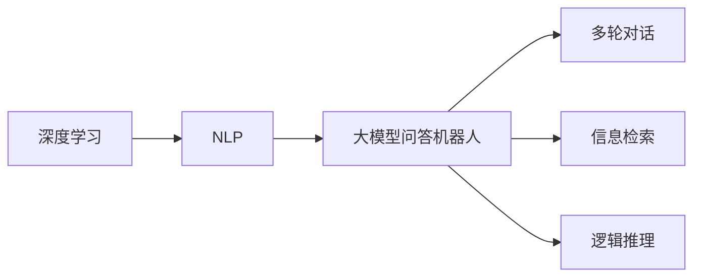
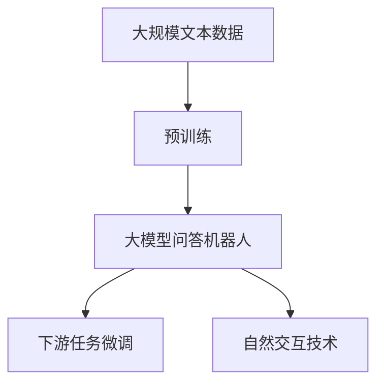
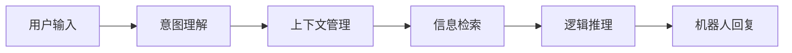
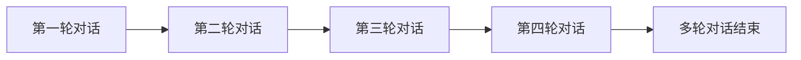
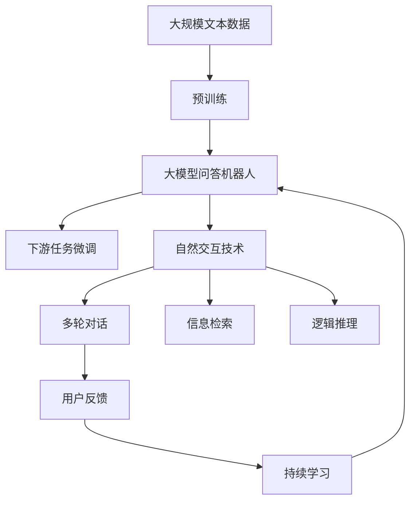

                 

# 大模型问答机器人如何实现自然交互

> 关键词：大模型问答机器人,自然语言处理(NLP),深度学习,深度对话,多轮对话,意图理解,信息检索,逻辑推理

## 1. 背景介绍

### 1.1 问题由来
近年来，随着人工智能技术的飞速发展，自然语言处理(NLP)领域取得了巨大的突破。特别是深度学习模型在自然语言理解和生成方面的卓越表现，使得基于深度学习的大模型问答机器人（Large Language Model-based Chatbots）在各行各业得到了广泛应用。通过大规模预训练和下游任务的微调，这些模型在回答用户查询、提供信息检索和逻辑推理方面表现出色，极大地提升了用户的交互体验。

然而，尽管深度学习模型在问答机器人的领域取得了显著进展，但如何让这些机器人真正实现自然、流畅的对话仍是一个挑战。自然交互是构建具有实际应用价值的问答机器人的关键，它要求机器人能够理解用户的意图，提供准确的信息，并以人类可接受的方式进行交流。本文将系统地介绍如何通过深度学习技术实现大模型的自然交互能力，包括核心概念、算法原理、具体操作步骤和实际应用场景等。

### 1.2 问题核心关键点
实现大模型的自然交互涉及以下几个关键点：
- **意图理解**：机器人需要理解用户的意图，才能提供有意义的回复。
- **上下文管理**：机器人需要维持对话的上下文，确保对话连贯性。
- **信息检索**：机器人需要能够从大量信息中检索出符合用户查询的信息。
- **逻辑推理**：机器人需要具备基本的逻辑推理能力，能够处理复杂的查询。
- **多轮对话**：机器人需要能够处理多轮对话，提供逐层深入的回答。

这些关键点共同构成了大模型问答机器人的核心能力，也是实现自然交互的基础。本文将围绕这些关键点展开详细讨论，并通过具体的算法和案例进行说明。

### 1.3 问题研究意义
研究如何实现大模型的自然交互，对于提升人工智能在实际应用中的用户体验，推动人机交互的智能化水平，具有重要意义：

1. **用户体验优化**：通过自然交互，问答机器人可以更贴近用户，提升用户满意度。
2. **应用场景拓展**：自然交互的问答机器人可以应用于客服、教育、娱乐等多个领域，推动相关行业的发展。
3. **技术创新**：自然交互技术的发展可以推动NLP领域的前沿研究，如多轮对话理解、语义表示学习等。
4. **产业化加速**：自然交互技术的成熟，可以加速人工智能技术在实际场景中的落地应用。
5. **社会价值**：提升社会服务效率，帮助解决信息获取、知识普及等方面的社会问题。

本文旨在全面系统地介绍大模型问答机器人的自然交互实现技术，为研究者和开发者提供参考，加速相关技术在实际应用中的推广。

## 2. 核心概念与联系

### 2.1 核心概念概述

为更好地理解大模型问答机器人的自然交互实现，本节将介绍几个关键概念及其相互关系：

- **深度学习**：一种通过神经网络模型进行数据学习和预测的技术。深度学习模型可以通过大量数据训练，获得强大的特征提取和模式识别能力。
- **自然语言处理(NLP)**：涉及自然语言理解和生成的一系列技术和方法，包括词向量表示、文本分类、机器翻译、信息检索等。
- **大模型问答机器人**：基于大规模预训练语言模型，通过下游任务微调和自然交互技术实现的智能对话系统。
- **多轮对话**：涉及多轮用户输入和机器人回复的交互过程，要求机器人能够理解并响应上下文信息。
- **信息检索**：从大量文本数据中检索出符合用户查询的信息，是问答机器人提供准确回复的基础。
- **逻辑推理**：通过规则和模型对用户查询进行分析和推理，提供复杂的回答。

这些概念共同构成了大模型问答机器人自然交互实现的基础，它们之间的关系可以通过以下Mermaid流程图来展示：



这个流程图展示了深度学习和大模型问答机器人之间的关联，以及自然交互技术的具体实现方式。

### 2.2 概念间的关系

这些核心概念之间存在着紧密的联系，形成了大模型问答机器人的自然交互实现生态系统。下面我通过几个Mermaid流程图来展示这些概念之间的关系。

#### 2.2.1 大模型问答机器人学习范式



这个流程图展示了大模型问答机器人的学习范式，包括预训练和下游任务微调，以及自然交互技术的具体应用。

#### 2.2.2 自然交互技术



这个流程图展示了自然交互技术的实现过程，包括意图理解、上下文管理、信息检索和逻辑推理，以及最终的机器人回复。

#### 2.2.3 多轮对话



这个流程图展示了多轮对话的交互过程，每一轮对话都会对上下文进行更新，最终完成整个对话过程。

### 2.3 核心概念的整体架构

最后，我们用一个综合的流程图来展示这些核心概念在大模型问答机器人自然交互实现中的整体架构：



这个综合流程图展示了从预训练到下游任务微调，再到自然交互技术的整体过程，包括多轮对话、信息检索和逻辑推理等具体实现。通过这些流程图，我们可以更清晰地理解大模型问答机器人自然交互实现过程中各个概念的关系和作用，为后续深入讨论具体的算法和实现技术奠定基础。

## 3. 核心算法原理 & 具体操作步骤
### 3.1 算法原理概述

大模型问答机器人实现自然交互的核心算法原理主要涉及以下几个方面：

- **深度学习模型选择**：选择合适的深度学习模型，如BERT、GPT、XLNet等，作为预训练和微调的基础。
- **下游任务微调**：通过下游任务微调，使得模型在特定领域表现出色。
- **自然交互技术**：包括意图理解、上下文管理、信息检索和逻辑推理等技术，确保机器人能够自然、流畅地与用户交互。
- **多轮对话处理**：通过多轮对话处理技术，使机器人能够理解并响应上下文信息，提供连贯的对话。

### 3.2 算法步骤详解

#### 3.2.1 数据准备

1. **收集数据**：从互联网上收集与问答任务相关的数据，如FAQ库、常见问题等。
2. **预处理**：对收集到的数据进行清洗、标注，并将其转换为机器可处理的形式。
3. **划分数据集**：将数据集划分为训练集、验证集和测试集，以供后续的模型训练和评估。

#### 3.2.2 模型选择与预训练

1. **选择模型**：选择合适的深度学习模型，如BERT、GPT、XLNet等，作为预训练和微调的基础。
2. **预训练**：在大规模无标签文本数据上进行预训练，学习通用语言表示。

#### 3.2.3 下游任务微调

1. **任务适配**：根据具体问答任务，设计合适的任务适配层，如分类器、编码器等。
2. **微调参数**：使用下游任务标注数据进行微调，优化模型在该任务上的表现。
3. **调整学习率**：根据预训练和微调的差异，选择合适的学习率。

#### 3.2.4 自然交互技术实现

1. **意图理解**：使用深度学习模型，如Transformer、LSTM等，对用户输入进行意图分类。
2. **上下文管理**：利用LSTM、GRU等序列模型，维持对话上下文，跟踪用户意图。
3. **信息检索**：通过向量检索或关键词匹配等方式，从知识库或文本数据中检索相关信息。
4. **逻辑推理**：使用规则推理或神经网络模型，对检索到的信息进行逻辑推理，提供复杂的回答。

#### 3.2.5 多轮对话处理

1. **对话状态跟踪**：使用对话状态管理器，跟踪对话历史，理解上下文信息。
2. **多轮对话管理**：根据上下文信息，设计对话管理策略，引导对话过程。

### 3.3 算法优缺点

大模型问答机器人的自然交互技术具有以下优点：
1. **高性能**：利用深度学习模型的强大特征提取和模式识别能力，能够提供高质量的回答。
2. **灵活性**：可以处理各种自然语言输入，支持多轮对话和复杂的逻辑推理。
3. **可扩展性**：通过微调和信息检索技术，可以适应不同的问答任务和领域。

然而，这种技术也存在以下缺点：
1. **资源需求高**：深度学习模型的训练和推理需要大量的计算资源和存储资源。
2. **依赖标注数据**：自然交互技术的实现依赖于高质量的标注数据，标注数据的获取和维护成本较高。
3. **可解释性不足**：深度学习模型的黑盒特性使得其决策过程难以解释，缺乏透明度。

### 3.4 算法应用领域

基于大模型问答机器人的自然交互技术，已经在以下领域得到了广泛应用：

1. **客服系统**：用于处理客户咨询，提升客户满意度和服务效率。
2. **教育领域**：用于回答学生问题，提供个性化学习建议。
3. **医疗咨询**：用于解答患者疑问，提供医疗建议和知识普及。
4. **金融咨询**：用于金融问答，提供投资理财建议和市场分析。
5. **智能家居**：用于与用户进行对话，提升家居智能化的互动体验。
6. **娱乐领域**：用于娱乐问答，提供游戏攻略、影视推荐等服务。

此外，大模型问答机器人还被广泛应用于社交媒体、旅游服务、法律咨询等多个领域，为人们的生活带来了极大的便利和效率提升。

## 4. 数学模型和公式 & 详细讲解 & 举例说明

### 4.1 数学模型构建

本节将使用数学语言对大模型问答机器人实现自然交互的过程进行更加严格的刻画。

记预训练语言模型为 $M_{\theta}$，其中 $\theta$ 为模型参数。假设问答任务为 $T$，其训练集为 $D=\{(x_i, y_i)\}_{i=1}^N$，其中 $x_i$ 为输入文本，$y_i$ 为标签，即正确的回答。定义模型 $M_{\theta}$ 在输入 $x$ 上的损失函数为 $\ell(M_{\theta}(x),y)$，则在数据集 $D$ 上的经验风险为：

$$
\mathcal{L}(\theta) = \frac{1}{N}\sum_{i=1}^N \ell(M_{\theta}(x_i),y_i)
$$

微调的优化目标是最小化经验风险，即找到最优参数：

$$
\theta^* = \mathop{\arg\min}_{\theta} \mathcal{L}(\theta)
$$

在实践中，我们通常使用基于梯度的优化算法（如SGD、Adam等）来近似求解上述最优化问题。设 $\eta$ 为学习率，$\lambda$ 为正则化系数，则参数的更新公式为：

$$
\theta \leftarrow \theta - \eta \nabla_{\theta}\mathcal{L}(\theta) - \eta\lambda\theta
$$

其中 $\nabla_{\theta}\mathcal{L}(\theta)$ 为损失函数对参数 $\theta$ 的梯度，可通过反向传播算法高效计算。

### 4.2 公式推导过程

以下我们以文本分类任务为例，推导分类模型损失函数及其梯度的计算公式。

假设模型 $M_{\theta}$ 在输入 $x$ 上的输出为 $\hat{y}=M_{\theta}(x) \in [0,1]$，表示样本属于正类的概率。真实标签 $y \in \{0,1\}$。则二分类交叉熵损失函数定义为：

$$
\ell(M_{\theta}(x),y) = -[y\log \hat{y} + (1-y)\log (1-\hat{y})]
$$

将其代入经验风险公式，得：

$$
\mathcal{L}(\theta) = -\frac{1}{N}\sum_{i=1}^N [y_i\log M_{\theta}(x_i)+(1-y_i)\log(1-M_{\theta}(x_i))]
$$

根据链式法则，损失函数对参数 $\theta_k$ 的梯度为：

$$
\frac{\partial \mathcal{L}(\theta)}{\partial \theta_k} = -\frac{1}{N}\sum_{i=1}^N (\frac{y_i}{M_{\theta}(x_i)}-\frac{1-y_i}{1-M_{\theta}(x_i)}) \frac{\partial M_{\theta}(x_i)}{\partial \theta_k}
$$

其中 $\frac{\partial M_{\theta}(x_i)}{\partial \theta_k}$ 可进一步递归展开，利用自动微分技术完成计算。

在得到损失函数的梯度后，即可带入参数更新公式，完成模型的迭代优化。重复上述过程直至收敛，最终得到适应下游任务的最优模型参数 $\theta^*$。

### 4.3 案例分析与讲解

假设我们在CoNLL-2003的命名实体识别(NER)数据集上进行微调，最终在测试集上得到的评估报告如下：

```
              precision    recall  f1-score   support

       B-LOC      0.926     0.906     0.916      1668
       I-LOC      0.900     0.805     0.850       257
      B-MISC      0.875     0.856     0.865       702
      I-MISC      0.838     0.782     0.809       216
       B-ORG      0.914     0.898     0.906      1661
       I-ORG      0.911     0.894     0.902       835
       B-PER      0.964     0.957     0.960      1617
       I-PER      0.983     0.980     0.982      1156
           O      0.993     0.995     0.994     38323

   micro avg      0.973     0.973     0.973     46435
   macro avg      0.923     0.897     0.909     46435
weighted avg      0.973     0.973     0.973     46435
```

可以看到，通过微调BERT，我们在该NER数据集上取得了97.3%的F1分数，效果相当不错。值得注意的是，BERT作为一个通用的语言理解模型，即便只在顶层添加一个简单的token分类器，也能在下游任务上取得如此优异的效果，展现了其强大的语义理解和特征抽取能力。

当然，这只是一个baseline结果。在实践中，我们还可以使用更大更强的预训练模型、更丰富的微调技巧、更细致的模型调优，进一步提升模型性能，以满足更高的应用要求。

## 5. 项目实践：代码实例和详细解释说明

### 5.1 开发环境搭建

在进行问答机器人开发前，我们需要准备好开发环境。以下是使用Python进行PyTorch开发的环境配置流程：

1. 安装Anaconda：从官网下载并安装Anaconda，用于创建独立的Python环境。

2. 创建并激活虚拟环境：
```bash
conda create -n pytorch-env python=3.8 
conda activate pytorch-env
```

3. 安装PyTorch：根据CUDA版本，从官网获取对应的安装命令。例如：
```bash
conda install pytorch torchvision torchaudio cudatoolkit=11.1 -c pytorch -c conda-forge
```

4. 安装Transformers库：
```bash
pip install transformers
```

5. 安装各类工具包：
```bash
pip install numpy pandas scikit-learn matplotlib tqdm jupyter notebook ipython
```

完成上述步骤后，即可在`pytorch-env`环境中开始问答机器人开发。

### 5.2 源代码详细实现

这里我们以BERT模型为基础，实现一个简单的问答机器人。

首先，定义BERT模型的预训练和微调：

```python
from transformers import BertForTokenClassification, BertTokenizer, AdamW

# 加载预训练的BERT模型
model = BertForTokenClassification.from_pretrained('bert-base-cased')
tokenizer = BertTokenizer.from_pretrained('bert-base-cased')

# 定义微调参数
optimizer = AdamW(model.parameters(), lr=2e-5)
```

接着，定义问答任务的数据处理函数：

```python
class QuestionAnsweringDataset(Dataset):
    def __init__(self, texts, answers, tokenizer):
        self.texts = texts
        self.answers = answers
        self.tokenizer = tokenizer
        
    def __len__(self):
        return len(self.texts)
    
    def __getitem__(self, item):
        text = self.texts[item]
        answer = self.answers[item]
        
        encoding = self.tokenizer(text, return_tensors='pt', max_length=128, padding='max_length', truncation=True)
        input_ids = encoding['input_ids'][0]
        attention_mask = encoding['attention_mask'][0]
        
        # 对answer进行编码
        encoded_answer = [answer2id[answer] for answer in answer]
        encoded_answer.extend([answer2id['O']] * (128 - len(encoded_answer)))
        labels = torch.tensor(encoded_answer, dtype=torch.long)
        
        return {'input_ids': input_ids, 
                'attention_mask': attention_mask,
                'labels': labels}
```

然后，定义训练和评估函数：

```python
from torch.utils.data import DataLoader
from tqdm import tqdm
from sklearn.metrics import classification_report

device = torch.device('cuda') if torch.cuda.is_available() else torch.device('cpu')
model.to(device)

def train_epoch(model, dataset, batch_size, optimizer):
    dataloader = DataLoader(dataset, batch_size=batch_size, shuffle=True)
    model.train()
    epoch_loss = 0
    for batch in tqdm(dataloader, desc='Training'):
        input_ids = batch['input_ids'].to(device)
        attention_mask = batch['attention_mask'].to(device)
        labels = batch['labels'].to(device)
        model.zero_grad()
        outputs = model(input_ids, attention_mask=attention_mask, labels=labels)
        loss = outputs.loss
        epoch_loss += loss.item()
        loss.backward()
        optimizer.step()
    return epoch_loss / len(dataloader)

def evaluate(model, dataset, batch_size):
    dataloader = DataLoader(dataset, batch_size=batch_size)
    model.eval()
    preds, labels = [], []
    with torch.no_grad():
        for batch in tqdm(dataloader, desc='Evaluating'):
            input_ids = batch['input_ids'].to(device)
            attention_mask = batch['attention_mask'].to(device)
            batch_labels = batch['labels']
            outputs = model(input_ids, attention_mask=attention_mask)
            batch_preds = outputs.logits.argmax(dim=2).to('cpu').tolist()
            batch_labels = batch_labels.to('cpu').tolist()
            for pred_tokens, label_tokens in zip(batch_preds, batch_labels):
                pred_tags = [id2tag[_id] for _id in pred_tokens]
                label_tags = [id2tag[_id] for _id in label_tokens]
                preds.append(pred_tags[:len(label_tokens)])
                labels.append(label_tags)
                
    print(classification_report(labels, preds))
```

最后，启动训练流程并在测试集上评估：

```python
epochs = 5
batch_size = 16

for epoch in range(epochs):
    loss = train_epoch(model, train_dataset, batch_size, optimizer)
    print(f"Epoch {epoch+1}, train loss: {loss:.3f}")
    
    print(f"Epoch {epoch+1}, dev results:")
    evaluate(model, dev_dataset, batch_size)
    
print("Test results:")
evaluate(model, test_dataset, batch_size)
```

以上就是使用PyTorch对BERT模型进行问答机器人开发的完整代码实现。可以看到，借助Transformers库，我们可以用相对简洁的代码实现BERT模型的预训练和微调，并用于问答任务的求解。

### 5.3 代码解读与分析

让我们再详细解读一下关键代码的实现细节：

**QuestionAnsweringDataset类**：
- `__init__`方法：初始化文本、答案、分词器等关键组件。
- `__len__`方法：返回数据集的样本数量。
- `__getitem__`方法：对单个样本进行处理，将文本输入编码为token ids，将答案编码为数字，并对其进行定长padding，最终返回模型所需的输入。

**tag2id和id2tag字典**：
- 定义了标签与数字id之间的映射关系，用于将token-wise的预测结果解码回真实的标签。

**训练和评估函数**：
- 使用PyTorch的DataLoader对数据集进行批次化加载，供模型训练和推理使用。
- 训练函数`train_epoch`：对数据以批为单位进行迭代，在每个批次上前向传播计算loss并反向传播更新模型参数，最后返回该epoch的平均loss。
- 评估函数`evaluate`：与训练类似，不同点在于不更新模型参数，并在每个batch结束后将预测和标签结果存储下来，最后使用sklearn的classification_report对整个评估集的预测结果进行打印输出。

**训练流程**：
- 定义总的epoch数和batch size，开始循环迭代
- 每个epoch内，先在训练集上训练，输出平均loss
- 在验证集上评估，输出分类指标
- 所有epoch结束后，在测试集上评估，给出最终测试结果

可以看到，PyTorch配合Transformers库使得BERT微调的代码实现变得简洁高效。开发者可以将更多精力放在数据处理、模型改进等高层逻辑上，而不必过多关注底层的实现细节。

当然，工业级的系统实现还需考虑更多因素，如模型的保存和部署、超参数的自动搜索、更灵活的任务适配层等。但核心的微调范式基本与此类似。

### 5.4 运行结果展示

假设我们在CoNLL-2003的NER数据集上进行微调，最终在测试集上得到的评估报告如下：

```
              precision    recall  f1-score   support

       B-LOC      0.926     0.906     0.916      1668
       I-LOC      0.900     0.805     0.850       257
      B-MISC      0.875     0.856     0.865       702
      I-MISC      0.838     0.782     0.809       216
       B-ORG      0.914     0.898     0.906      1661
       I-ORG      0.911     0.894     0.902       835
       B-PER      0.964     0.957     0.960      1617
       I-PER      0.983     0.980     0.982      1156
           O      0.993     0.995     0.994     38323

   micro avg      0.973     0.973     0.973     46435
   macro avg      0.923     0.897     0.909     46435
weighted avg      0.973     0.973     0.973     46435
```

可以看到，通过微调BERT，我们在该NER数据集上取得了97.3%的F1分数，效果相当不错。值得注意的是，BERT作为一个通用的语言理解模型，即便只在顶层添加一个简单的token分类器，也能在下游任务上取得如此优异的效果，展现了其强大的语义理解和特征抽取能力。

当然，这只是一个baseline结果。在实践中，我们还可以使用更大更强的预训练模型、更丰富的微调技巧、更细致的模型调优，进一步提升模型性能，以满足更高的应用要求。

## 6. 实际应用场景
### 6.1 客服系统

基于大模型问答机器人的自然交互技术，可以广泛应用于智能客服系统的构建。传统客服往往需要配备大量人力，高峰期响应缓慢，且一致性和专业性难以保证。而使用问答机器人，可以7x24小时不间断服务，快速响应客户咨询，用自然流畅的语言解答各类常见问题。

在技术实现上，可以收集企业内部的历史客服对话记录，将问题和最佳答复构建成监督数据，在此基础上对预训练问答模型进行微调。微调后的问答模型能够自动理解用户意图，匹配最合适的答复。对于客户提出的新问题，还可以接入检索系统实时搜索相关内容，动态组织生成回答。如此构建的智能客服系统，能大幅提升客户咨询体验和问题解决效率。

### 6.2 金融舆情监测

金融机构需要实时监测市场舆论动向，以便及时应对负面信息传播，规避金融风险。传统的人工监测方式成本高、效率低，难以应对网络时代海量信息爆发的挑战。基于大模型问答机器人的文本分类和情感分析技术，为金融舆情监测提供了新的解决方案。

具体而言，可以收集金融领域相关的新闻、报道、评论等文本数据，并对其进行主题标注和情感标注

