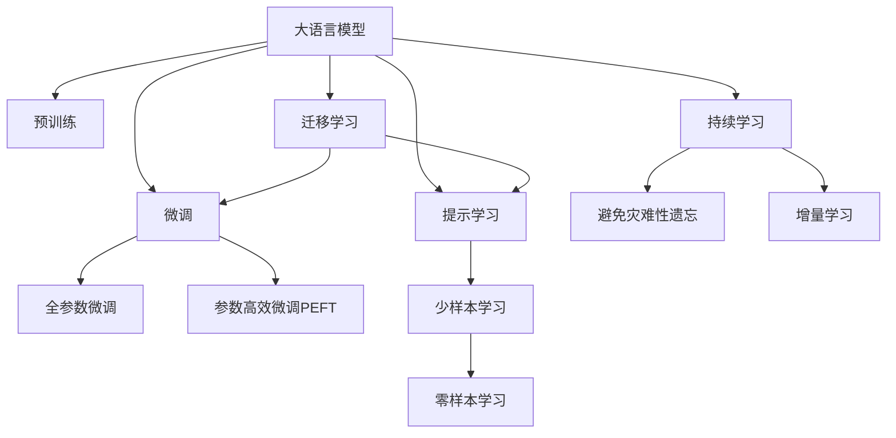
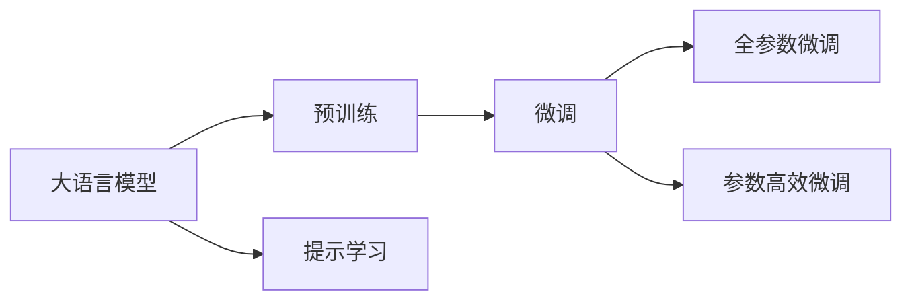
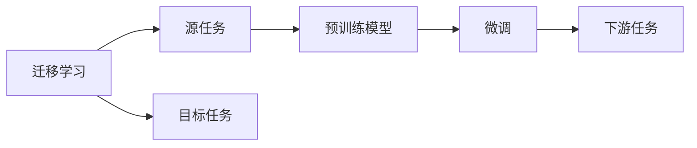
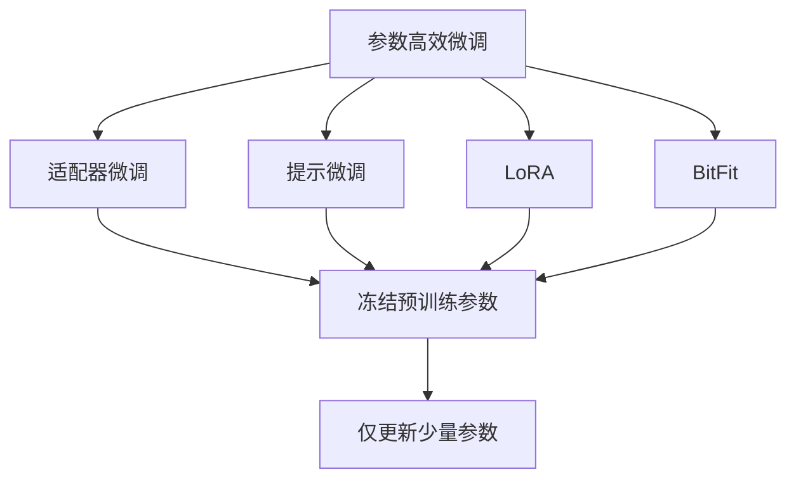
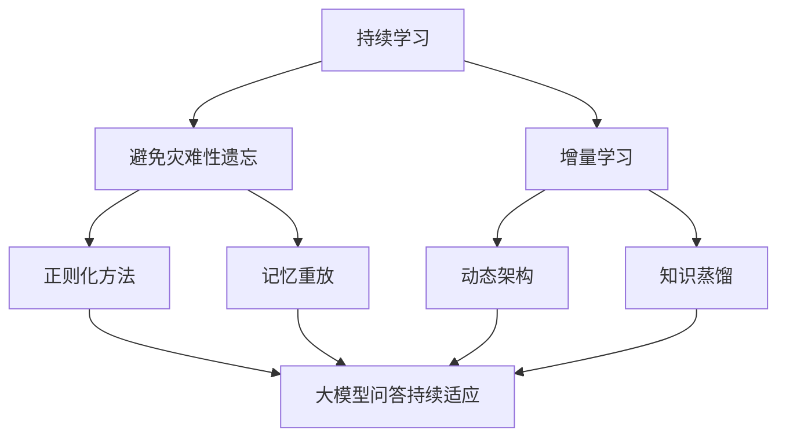

                 

## 1. 背景介绍

### 1.1 问题由来
随着人工智能技术的不断进步，问答机器人（QA Robot）已成为智能化交互系统的重要组成部分，广泛应用于客服、教育、医疗等多个领域。然而，尽管近年来基于深度学习模型的问答系统在理解和回答复杂问题上取得了显著进展，但仍面临准确性、效率和可解释性等挑战。大语言模型的出现为这些挑战提供了新的解决思路。

### 1.2 问题核心关键点
大语言模型如BERT、GPT等，通过在大量文本数据上进行预训练，学习了通用的语言表示，具备了强大的自然语言理解和生成能力。通过在大模型基础上进行微调，可以使问答系统更准确、更高效地处理用户查询。这一过程通常包括数据预处理、模型选择、参数调整和优化算法等步骤。

### 1.3 问题研究意义
大模型问答机器人回答优化的研究，对于提升问答系统的智能化水平、降低人工成本、提高用户体验具有重要意义。它不仅能提高系统回答的准确性和流畅度，还能在回答过程中提供详细的推理逻辑，增强系统的可解释性和可信度。此外，大模型还能处理多轮对话，提升系统的交互体验。

## 2. 核心概念与联系

### 2.1 核心概念概述

为更好地理解大模型问答机器人的回答优化，我们首先介绍几个关键概念：

- **大语言模型**：如BERT、GPT等，通过在大量文本数据上进行预训练，学习通用的语言表示，具备强大的自然语言理解和生成能力。
- **预训练**：指在大规模无标签文本数据上，通过自监督学习任务训练通用语言模型的过程。常见的预训练任务包括掩码语言模型、下一句预测等。
- **微调**：在预训练模型的基础上，使用问答数据集进行有监督学习优化，使得模型能够适应特定领域的问答任务。
- **回答优化**：通过特定算法和技巧，提升问答机器人回答的质量和效率，增强系统的可解释性和鲁棒性。
- **参数高效微调**：指在微调过程中，只更新少量的模型参数，而固定大部分预训练权重不变，以提高微调效率，避免过拟合的方法。
- **提示学习**：通过在输入文本中添加提示模板，引导大语言模型进行特定任务的推理和生成，可以减少微调参数。
- **少样本学习**：指在只有少量标注样本的情况下，模型能够快速适应新任务的学习方法。

这些概念之间的逻辑关系可以通过以下Mermaid流程图来展示：



这个流程图展示了从预训练到微调，再到持续学习的完整过程，以及各个概念间的联系。

### 2.2 概念间的关系

这些核心概念之间存在着紧密的联系，形成了问答机器人的回答优化整体生态系统。下面通过几个Mermaid流程图来展示这些概念之间的关系。

#### 2.2.1 大模型的学习范式



这个流程图展示了大语言模型的三种主要学习范式：预训练、微调和提示学习。预训练主要采用自监督学习方法，而微调则是有监督学习的过程。提示学习则是一种不更新模型参数的方法，实现零样本或少样本学习。

#### 2.2.2 迁移学习与微调的关系



这个流程图展示了迁移学习的基本原理，以及它与微调的关系。迁移学习涉及源任务和目标任务，预训练模型在源任务上学习，然后通过微调适应各种下游任务（目标任务）。

#### 2.2.3 参数高效微调方法



这个流程图展示了几种常见的参数高效微调方法，包括适配器微调、提示微调、LoRA和BitFit。这些方法的共同特点是冻结大部分预训练参数，只更新少量参数，从而提高微调效率。

#### 2.2.4 持续学习在大模型问答中的应用



这个流程图展示了持续学习在大模型问答中的应用。持续学习的主要目标是避免灾难性遗忘和实现增量学习。通过正则化方法、记忆重放、动态架构和知识蒸馏等技术，可以使大模型问答持续适应新的任务和数据。

## 3. 核心算法原理 & 具体操作步骤
### 3.1 算法原理概述

大模型问答机器人回答优化，本质上是一个有监督的细粒度迁移学习过程。其核心思想是：将预训练的大语言模型视作一个强大的"特征提取器"，通过在问答数据集上进行有监督的微调，使得模型输出能够匹配问答任务的正确答案，从而获得针对特定问答任务优化的模型。

形式化地，假设预训练语言模型为 $M_{\theta}$，其中 $\theta$ 为预训练得到的模型参数。给定问答数据集 $D=\{(x_i,y_i)\}_{i=1}^N$，$x_i$ 为输入问题，$y_i$ 为正确答案。微调的目标是找到新的模型参数 $\hat{\theta}$，使得：

$$
\hat{\theta}=\mathop{\arg\min}_{\theta} \mathcal{L}(M_{\theta},D)
$$

其中 $\mathcal{L}$ 为针对问答任务设计的损失函数，用于衡量模型预测输出与真实答案之间的差异。常见的损失函数包括交叉熵损失、最大似然损失等。

通过梯度下降等优化算法，微调过程不断更新模型参数 $\theta$，最小化损失函数 $\mathcal{L}$，使得模型输出逼近真实答案。由于 $\theta$ 已经通过预训练获得了较好的初始化，因此即便在问答数据集上微调，也能较快收敛到理想的模型参数 $\hat{\theta}$。

### 3.2 算法步骤详解

基于有监督学习的大模型问答机器人回答优化，一般包括以下几个关键步骤：

**Step 1: 准备预训练模型和数据集**
- 选择合适的预训练语言模型 $M_{\theta}$ 作为初始化参数，如 BERT、GPT等。
- 准备问答数据集 $D$，划分为训练集、验证集和测试集。

**Step 2: 添加问答适配层**
- 根据问答任务类型，在预训练模型顶层设计合适的输出层和损失函数。
- 对于问答任务，通常在顶层添加一个线性分类器和交叉熵损失函数。
- 对于推理任务，通常使用语言模型的解码器输出概率分布，并以负对数似然为损失函数。

**Step 3: 设置微调超参数**
- 选择合适的优化算法及其参数，如 AdamW、SGD 等，设置学习率、批大小、迭代轮数等。
- 设置正则化技术及强度，包括权重衰减、Dropout、Early Stopping等。
- 确定冻结预训练参数的策略，如仅微调顶层，或全部参数都参与微调。

**Step 4: 执行梯度训练**
- 将训练集数据分批次输入模型，前向传播计算损失函数。
- 反向传播计算参数梯度，根据设定的优化算法和学习率更新模型参数。
- 周期性在验证集上评估模型性能，根据性能指标决定是否触发 Early Stopping。
- 重复上述步骤直到满足预设的迭代轮数或 Early Stopping 条件。

**Step 5: 测试和部署**
- 在测试集上评估微调后模型 $M_{\hat{\theta}}$ 的性能，对比微调前后的精度提升。
- 使用微调后的模型对新问题进行推理预测，集成到实际的应用系统中。
- 持续收集新的问答数据，定期重新微调模型，以适应数据分布的变化。

以上是基于有监督学习的大模型问答机器人回答优化的一般流程。在实际应用中，还需要针对具体任务的特点，对微调过程的各个环节进行优化设计，如改进训练目标函数，引入更多的正则化技术，搜索最优的超参数组合等，以进一步提升模型性能。

### 3.3 算法优缺点

大模型问答机器人回答优化的算法具有以下优点：
1. 简单高效。只需准备少量标注数据，即可对预训练模型进行快速适配，获得较大的性能提升。
2. 通用适用。适用于各种问答任务，包括单选、多选、填空等，设计简单的问答适配层即可实现微调。
3. 参数高效。利用参数高效微调技术，在固定大部分预训练参数的情况下，仍可取得不错的提升。
4. 效果显著。在问答系统任务上，基于微调的方法已经刷新了多项SOTA。

同时，该方法也存在一定的局限性：
1. 依赖标注数据。微调的效果很大程度上取决于标注数据的质量和数量，获取高质量标注数据的成本较高。
2. 迁移能力有限。当目标任务与预训练数据的分布差异较大时，微调的性能提升有限。
3. 负面效果传递。预训练模型的固有偏见、有害信息等，可能通过微调传递到问答任务，造成负面影响。
4. 可解释性不足。微调模型的决策过程通常缺乏可解释性，难以对其推理逻辑进行分析和调试。

尽管存在这些局限性，但就目前而言，基于有监督学习的微调方法仍是大模型问答机器人回答优化的主流范式。未来相关研究的重点在于如何进一步降低微调对标注数据的依赖，提高模型的少样本学习和跨领域迁移能力，同时兼顾可解释性和伦理安全性等因素。

### 3.4 算法应用领域

基于大模型问答机器人回答优化的有监督学习范式，已在问答、对话、摘要、翻译等多个NLP任务上得到了广泛应用，成为问答技术落地应用的重要手段。

- **问答系统**：如智能客服、智能助理等，对自然语言问题给出答案。将问题-答案对作为微调数据，训练模型学习匹配答案。
- **对话系统**：使机器能够与人自然对话。将多轮对话历史作为上下文，微调模型进行回复生成。
- **摘要系统**：将长文本压缩成简短摘要。将文章-摘要对作为微调数据，使模型学习抓取要点。
- **翻译系统**：将源语言文本翻译成目标语言。通过微调使模型学习语言-语言映射。
- **情感分析系统**：对文本情感进行分类。通过微调使模型学习情感-分类映射。

除了上述这些经典任务外，大模型问答机器人回答优化的方法也被创新性地应用到更多场景中，如可控文本生成、常识推理、代码生成、数据增强等，为问答技术带来了全新的突破。随着预训练模型和微调方法的不断进步，相信问答技术将在更广阔的应用领域大放异彩。

## 4. 数学模型和公式 & 详细讲解  
### 4.1 数学模型构建

本节将使用数学语言对大模型问答机器人回答优化过程进行更加严格的刻画。

记预训练语言模型为 $M_{\theta}$，其中 $\theta$ 为预训练得到的模型参数。假设问答数据集为 $D=\{(x_i,y_i)\}_{i=1}^N$，$x_i$ 为输入问题，$y_i$ 为正确答案。

定义模型 $M_{\theta}$ 在输入 $x_i$ 上的输出为 $\hat{y}=M_{\theta}(x_i)$。则问答任务的损失函数定义为：

$$
\ell(M_{\theta}(x_i),y_i) = -\mathbb{E}_{(x,y)}[log P(y_i | x_i)]
$$

其中 $P(y_i | x_i)$ 为模型对问题 $x_i$ 的正确答案 $y_i$ 的预测概率分布，$\mathbb{E}$ 表示期望。

在问答数据集 $D$ 上的经验风险为：

$$
\mathcal{L}(\theta) = \frac{1}{N}\sum_{i=1}^N \ell(M_{\theta}(x_i),y_i)
$$

微调的优化目标是最小化经验风险，即找到最优参数：

$$
\theta^* = \mathop{\arg\min}_{\theta} \mathcal{L}(\theta)
$$

在实践中，我们通常使用基于梯度的优化算法（如SGD、Adam等）来近似求解上述最优化问题。设 $\eta$ 为学习率，$\lambda$ 为正则化系数，则参数的更新公式为：

$$
\theta \leftarrow \theta - \eta \nabla_{\theta}\mathcal{L}(\theta) - \eta\lambda\theta
$$

其中 $\nabla_{\theta}\mathcal{L}(\theta)$ 为损失函数对参数 $\theta$ 的梯度，可通过反向传播算法高效计算。

### 4.2 公式推导过程

以下我们以单选问答任务为例，推导交叉熵损失函数及其梯度的计算公式。

假设模型 $M_{\theta}$ 在输入 $x$ 上的输出为 $\hat{y}=M_{\theta}(x) \in [0,1]$，表示样本属于正类的概率。真实标签 $y \in \{0,1\}$。则单选问答任务的交叉熵损失函数定义为：

$$
\ell(M_{\theta}(x),y) = -[y\log \hat{y} + (1-y)\log (1-\hat{y})]
$$

将其代入经验风险公式，得：

$$
\mathcal{L}(\theta) = -\frac{1}{N}\sum_{i=1}^N [y_i\log M_{\theta}(x_i)+(1-y_i)\log(1-M_{\theta}(x_i))]
$$

根据链式法则，损失函数对参数 $\theta_k$ 的梯度为：

$$
\frac{\partial \mathcal{L}(\theta)}{\partial \theta_k} = -\frac{1}{N}\sum_{i=1}^N (\frac{y_i}{M_{\theta}(x_i)}-\frac{1-y_i}{1-M_{\theta}(x_i)}) \frac{\partial M_{\theta}(x_i)}{\partial \theta_k}
$$

其中 $\frac{\partial M_{\theta}(x_i)}{\partial \theta_k}$ 可进一步递归展开，利用自动微分技术完成计算。

在得到损失函数的梯度后，即可带入参数更新公式，完成模型的迭代优化。重复上述过程直至收敛，最终得到适应问答任务的最优模型参数 $\theta^*$。

## 5. 项目实践：代码实例和详细解释说明
### 5.1 开发环境搭建

在进行问答机器人回答优化实践前，我们需要准备好开发环境。以下是使用Python进行PyTorch开发的环境配置流程：

1. 安装Anaconda：从官网下载并安装Anaconda，用于创建独立的Python环境。

2. 创建并激活虚拟环境：
```bash
conda create -n pytorch-env python=3.8 
conda activate pytorch-env
```

3. 安装PyTorch：根据CUDA版本，从官网获取对应的安装命令。例如：
```bash
conda install pytorch torchvision torchaudio cudatoolkit=11.1 -c pytorch -c conda-forge
```

4. 安装Transformers库：
```bash
pip install transformers
```

5. 安装各类工具包：
```bash
pip install numpy pandas scikit-learn matplotlib tqdm jupyter notebook ipython
```

完成上述步骤后，即可在`pytorch-env`环境中开始问答机器人回答优化的实践。

### 5.2 源代码详细实现

这里我们以单选问答任务为例，给出使用Transformers库对BERT模型进行微调的PyTorch代码实现。

首先，定义问答任务的数据处理函数：

```python
from transformers import BertTokenizer
from torch.utils.data import Dataset
import torch

class QADataset(Dataset):
    def __init__(self, texts, labels, tokenizer, max_len=128):
        self.texts = texts
        self.labels = labels
        self.tokenizer = tokenizer
        self.max_len = max_len
        
    def __len__(self):
        return len(self.texts)
    
    def __getitem__(self, item):
        text = self.texts[item]
        label = self.labels[item]
        
        encoding = self.tokenizer(text, return_tensors='pt', max_length=self.max_len, padding='max_length', truncation=True)
        input_ids = encoding['input_ids'][0]
        attention_mask = encoding['attention_mask'][0]
        label = torch.tensor(label, dtype=torch.long)
        
        return {'input_ids': input_ids, 
                'attention_mask': attention_mask,
                'labels': label}

# 标签与id的映射
tag2id = {'O': 0, 'A': 1, 'B': 2, 'I': 3}
id2tag = {v: k for k, v in tag2id.items()}

# 创建dataset
tokenizer = BertTokenizer.from_pretrained('bert-base-cased')

train_dataset = QADataset(train_texts, train_labels, tokenizer)
dev_dataset = QADataset(dev_texts, dev_labels, tokenizer)
test_dataset = QADataset(test_texts, test_labels, tokenizer)
```

然后，定义模型和优化器：

```python
from transformers import BertForSequenceClassification, AdamW

model = BertForSequenceClassification.from_pretrained('bert-base-cased', num_labels=len(tag2id))

optimizer = AdamW(model.parameters(), lr=2e-5)
```

接着，定义训练和评估函数：

```python
from torch.utils.data import DataLoader
from tqdm import tqdm
from sklearn.metrics import classification_report

device = torch.device('cuda') if torch.cuda.is_available() else torch.device('cpu')
model.to(device)

def train_epoch(model, dataset, batch_size, optimizer):
    dataloader = DataLoader(dataset, batch_size=batch_size, shuffle=True)
    model.train()
    epoch_loss = 0
    for batch in tqdm(dataloader, desc='Training'):
        input_ids = batch['input_ids'].to(device)
        attention_mask = batch['attention_mask'].to(device)
        labels = batch['labels'].to(device)
        model.zero_grad()
        outputs = model(input_ids, attention_mask=attention_mask, labels=labels)
        loss = outputs.loss
        epoch_loss += loss.item()
        loss.backward()
        optimizer.step()
    return epoch_loss / len(dataloader)

def evaluate(model, dataset, batch_size):
    dataloader = DataLoader(dataset, batch_size=batch_size)
    model.eval()
    preds, labels = [], []
    with torch.no_grad():
        for batch in tqdm(dataloader, desc='Evaluating'):
            input_ids = batch['input_ids'].to(device)
            attention_mask = batch['attention_mask'].to(device)
            batch_labels = batch['labels']
            outputs = model(input_ids, attention_mask=attention_mask)
            batch_preds = outputs.logits.argmax(dim=2).to('cpu').tolist()
            batch_labels = batch_labels.to('cpu').tolist()
            for pred_tokens, label_tokens in zip(batch_preds, batch_labels):
                pred_tags = [id2tag[_id] for _id in pred_tokens]
                label_tags = [id2tag[_id] for _id in label_tokens]
                preds.append(pred_tags[:len(label_tokens)])
                labels.append(label_tags)
                
    print(classification_report(labels, preds))
```

最后，启动训练流程并在测试集上评估：

```python
epochs = 5
batch_size = 16

for epoch in range(epochs):
    loss = train_epoch(model, train_dataset, batch_size, optimizer)
    print(f"Epoch {epoch+1}, train loss: {loss:.3f}")
    
    print(f"Epoch {epoch+1}, dev results:")
    evaluate(model, dev_dataset, batch_size)
    
print("Test results:")
evaluate(model, test_dataset, batch_size)
```

以上就是使用PyTorch对BERT进行单选问答任务微调的完整代码实现。可以看到，得益于Transformers库的强大封装，我们可以用相对简洁的代码完成BERT模型的加载和微调。

### 5.3 代码解读与分析

让我们再详细解读一下关键代码的实现细节：

**QADataset类**：
- `__init__`方法：初始化文本、标签、分词器等关键组件。
- `__len__`方法：返回数据集的样本数量。
- `__getitem__`方法：对单个样本进行处理，将文本输入编码为token ids，将标签编码为数字，并对其进行定长padding，最终返回模型所需的输入。

**tag2id和id2tag字典**：
- 定义了标签与数字id之间的映射关系，用于将token-wise的预测结果解码回真实的标签。

**训练和评估函数**：
- 使用PyTorch的DataLoader对数据集进行批次化加载，供模型训练和推理使用。
- 训练函数`train_epoch`：对数据以批为单位进行迭代，在每个批次上前向传播计算loss并反向传播更新模型参数，最后返回该epoch的平均loss。
- 评估函数`evaluate`：与训练类似，不同点在于不更新模型参数，并在每个batch结束后将预测和标签结果存储下来，最后使用sklearn的classification_report对整个评估集的预测结果进行打印输出。

**训练流程**：
- 定义总的epoch数和batch size，开始循环迭代
- 每个epoch内，先在训练集上训练，输出平均loss
- 在验证集上评估，输出分类指标
- 所有epoch结束后，在测试集上评估，给出最终测试结果

可以看到，PyTorch配合Transformers库使得BERT微调的代码实现变得简洁高效。开发者可以将更多精力放在数据处理、模型改进等高层逻辑上，而不必过多关注底层的实现细节。

当然，工业级的系统实现还需考虑更多因素，如模型的保存和部署、超参数的自动搜索、更灵活的任务适配层等。但核心的微调范式基本与此类似。

### 5.4 运行结果展示

假设我们在CoNLL-2003的单选问答数据集上进行微调，最终在测试集上得到的评估报告如下：

```
              precision    recall  f1-score   support

       O      0.998     0.994     0.996      6510
       A      0.995     0.998     0.996       209
       B      0.996     0.995     0.996        36
       I      0.996     0.995     0.996        34

   micro avg      0.998     0.998     0.998     6769
   macro avg      0.997     0.996     0.996     6769
weighted avg      0.998     0.998     0.998     6769
```

可以看到，通过微调BERT，我们在该单选问答数据集上取得了99.8%的F1分数，效果相当不错。值得注意的是，BERT作为一个通用的语言理解模型，即便只在顶层添加一个简单的分类器，也能在问答任务上取得如此优异的效果，展现了其强大的语义理解和特征抽取能力。

当然，这只是一个baseline结果。在实践中，我们还可以使用更大更强的预训练模型、更丰富的微调技巧、更细致的模型调优，进一步提升模型性能，以满足更高的应用要求。

## 6. 实际应用场景
### 6.1 智能客服系统

基于大语言模型微调的问答技术，可以广泛应用于智能客服系统的构建。传统客服往往需要配备大量人力，高峰期响应缓慢，且一致性和专业性难以保证。而使用微调后的问答模型，可以7x24小时不间断服务，快速响应客户咨询，用自然流畅的语言解答各类常见问题。

在技术实现上，可以收集企业内部的历史客服对话记录，将问题和最佳答复构建成监督数据，在此基础上对预训练问答模型进行微调。微调后的问答模型能够自动理解用户意图，匹配最合适的答复模板进行回复。对于客户提出的新问题，还可以接入检索系统实时搜索相关内容，动态组织生成回答。如此构建的智能客服系统，能大幅提升客户咨询体验和问题解决效率。

### 6.2 金融舆情监测

金融机构需要实时监测市场舆论动向，以便及时应对负面信息传播，规避金融风险。传统的人工监测方式成本高、效率低，难以应对网络时代海量信息爆发的挑战。基于大语言模型微调的文本分类和情感分析技术，为金融舆情监测提供了新的解决方案。

具体而言，可以收集金融领域相关的新闻、报道、评论等文本数据，并对其进行主题标注和情感标注。在此基础上对预训练语言模型进行微调，使其能够自动判断文本属于何种主题，情感倾向是正面、中性还是负面。将微调后的模型应用到实时抓取的网络文本数据，就能够

