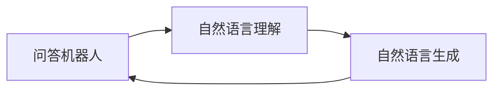

                 

## 1. 背景介绍

人工智能和自然语言处理（NLP）技术的迅猛发展，使问答机器人（Chatbot）成为现代社会中不可或缺的部分。在医疗、教育、客服等多个领域，问答机器人以其便捷高效的服务方式，极大地提升了用户体验和效率。然而，一个令人遗憾的现象是，当前的问答机器人往往缺乏自然度，其回答过于机械，缺乏人情味，难以满足用户对于智能交流的期待。

基于此，本文旨在探讨如何提高大模型问答机器人的自然度，使其回答更接近人类对话的流畅自然。我们将从核心概念、算法原理、具体操作步骤等方面进行详细讲解，并通过项目实践、数学模型构建、以及实际应用场景分析，为实现这一目标提供具体的技术路径和解决方案。

## 2. 核心概念与联系

### 2.1 核心概念概述

在回答这个问题前，我们需要理解几个关键概念：

- **问答机器人（Chatbot）**：能够通过自然语言理解（NLU）和自然语言生成（NLG）技术与用户进行交互的计算机程序。

- **自然度**：指问答机器人回答的自然流畅程度，包括语言的流畅性、语义的准确性、情感的真实性等。

- **大模型（Large Model）**：指的是具有数亿甚至数十亿参数的深度学习模型，如GPT-3、BERT等，能够处理复杂的自然语言任务，具有强大的上下文理解和生成能力。

- **自然语言处理（NLP）**：涉及计算机如何理解和生成人类语言，包括词法分析、句法分析、语义分析、机器翻译、文本摘要、情感分析等任务。

这些概念之间的关系如图2所示：



通过自然语言理解模块B，问答机器人能够解析用户的输入，抽取关键信息，并通过自然语言生成模块C，生成自然流畅的回答。大模型作为自然语言处理的核心技术，提供了强大的上下文理解能力，支持自然语言生成和理解任务。

### 2.2 核心概念间的联系

- **大模型与自然度**：大模型通过海量的数据预训练，获得了丰富的语言知识和理解能力，这有助于生成更加自然、准确的回答。然而，自然度的高低还取决于模型生成文本的质量，包括语言的流畅性、语义的准确性、情感的真实性等。

- **自然语言处理与问答机器人**：问答机器人依赖于自然语言处理技术，通过自然语言理解模块对用户输入进行解析，并生成自然语言回答。自然语言处理的进展，特别是大模型的应用，极大地推动了问答机器人的自然度提升。

- **自然度与用户体验**：自然度是问答机器人用户体验的关键因素。自然度高的问答机器人，能够更好地模拟人类对话，提供更好的交流体验。

## 3. 核心算法原理 & 具体操作步骤

### 3.1 算法原理概述

提高大模型问答机器人的自然度，涉及到自然语言生成（NLG）和自然语言理解（NLU）两个核心模块。下面分别介绍这两个模块的算法原理。

#### 3.1.1 自然语言生成

自然语言生成（NLG）模块的目的是将机器对用户输入的理解，转化为自然流畅的文本回答。其主要算法包括以下几个步骤：

1. **输入理解**：将用户的输入文本转换为机器可理解的形式。这包括词法分析、句法分析、语义分析等步骤。

2. **意图识别**：理解用户的意图和需求，确定机器需要生成的回答类型。

3. **知识检索**：根据用户输入的关键词和上下文，在知识库中检索相关的信息和事实。

4. **回答生成**：利用大模型，生成自然流畅的文本回答。

#### 3.1.2 自然语言理解

自然语言理解（NLU）模块的目的是理解用户的输入文本，提取关键信息。其主要算法包括以下几个步骤：

1. **词法分析**：将用户输入的文本分解为词汇单位，并标注其词性。

2. **句法分析**：分析句子结构，确定单词之间的关系。

3. **语义分析**：理解句子或段落的语义，确定用户输入的意图和需求。

4. **实体识别**：识别用户输入中的实体，如人名、地名、组织机构等。

5. **情感分析**：分析用户输入的情感，确定其情绪状态。

### 3.2 算法步骤详解

#### 3.2.1 自然语言生成

1. **输入预处理**：将用户的输入文本进行预处理，包括分词、去除停用词、词干提取等。

2. **嵌入表示**：使用词向量表示每个单词，将其转化为向量形式，以便模型处理。

3. **意图识别**：使用意图识别模型，将用户输入的文本转化为意图向量，确定机器需要生成的回答类型。

4. **知识检索**：根据用户输入的关键词和上下文，在知识库中检索相关的信息和事实。

5. **回答生成**：使用大模型，生成自然流畅的文本回答。

#### 3.2.2 自然语言理解

1. **输入预处理**：将用户的输入文本进行预处理，包括分词、去除停用词、词干提取等。

2. **嵌入表示**：使用词向量表示每个单词，将其转化为向量形式，以便模型处理。

3. **句法分析**：使用句法分析模型，分析句子结构，确定单词之间的关系。

4. **语义分析**：使用语义分析模型，理解句子或段落的语义，确定用户输入的意图和需求。

5. **实体识别**：使用实体识别模型，识别用户输入中的实体，如人名、地名、组织机构等。

6. **情感分析**：使用情感分析模型，分析用户输入的情感，确定其情绪状态。

### 3.3 算法优缺点

#### 3.3.1 自然语言生成

**优点**：

- 利用大模型的强大上下文理解能力，生成的回答更加自然流畅。
- 能够生成多样化的回答，满足不同用户的需求。

**缺点**：

- 生成过程中可能存在逻辑错误、语义不清等问题。
- 生成的回答可能缺乏情感，无法与用户产生共鸣。

#### 3.3.2 自然语言理解

**优点**：

- 利用大模型的强大语义理解能力，能够准确理解用户输入的意图和需求。
- 能够识别用户输入中的实体和情感，提供更加个性化和情感化的回答。

**缺点**：

- 对于复杂的语义结构，可能无法准确理解用户输入。
- 对于新领域和新概念，可能需要额外的人工干预和调整。

### 3.4 算法应用领域

大模型问答机器人在多个领域都有广泛的应用：

- **医疗咨询**：通过与医生的对话，解答患者的医疗疑问，提供医疗建议。

- **教育辅助**：通过与学生的对话，解答学生的学习疑问，提供学习建议。

- **客户服务**：通过与客户的对话，解答客户的疑问，提供售后服务。

- **智能家居**：通过与用户的对话，控制智能家居设备，提供家居服务。

## 4. 数学模型和公式 & 详细讲解 & 举例说明

### 4.1 数学模型构建

#### 4.1.1 自然语言生成

1. **输入表示**：将用户的输入文本表示为一个向量 $x$。

2. **意图表示**：将用户的意图表示为一个向量 $y$。

3. **知识表示**：将知识库中的相关信息表示为一个向量 $z$。

4. **回答生成**：使用大模型生成自然语言回答 $o$。

数学模型为：

$$
o = M(x, y, z)
$$

其中，$M$ 为自然语言生成模型，$x$、$y$、$z$ 分别为用户的输入表示、意图表示和知识表示向量。

#### 4.1.2 自然语言理解

1. **输入表示**：将用户的输入文本表示为一个向量 $x$。

2. **语义表示**：将语义分析的结果表示为一个向量 $s$。

3. **情感表示**：将情感分析的结果表示为一个向量 $e$。

4. **实体表示**：将实体识别结果表示为一个向量 $r$。

数学模型为：

$$
(s, e, r) = N(x)
$$

其中，$N$ 为自然语言理解模型，$x$ 为用户的输入表示向量。

### 4.2 公式推导过程

#### 4.2.1 自然语言生成

1. **输入表示**：

$$
x = T(x_{text})
$$

其中，$T$ 为词向量转换函数。

2. **意图表示**：

$$
y = I(x)
$$

其中，$I$ 为意图识别模型。

3. **知识表示**：

$$
z = K(x, y)
$$

其中，$K$ 为知识检索模型。

4. **回答生成**：

$$
o = G(x, y, z)
$$

其中，$G$ 为自然语言生成模型。

#### 4.2.2 自然语言理解

1. **输入表示**：

$$
x = T(x_{text})
$$

其中，$T$ 为词向量转换函数。

2. **语义表示**：

$$
s = S(x)
$$

其中，$S$ 为语义分析模型。

3. **情感表示**：

$$
e = E(x)
$$

其中，$E$ 为情感分析模型。

4. **实体表示**：

$$
r = R(x)
$$

其中，$R$ 为实体识别模型。

### 4.3 案例分析与讲解

#### 4.3.1 自然语言生成

**案例**：

假设用户的输入为 "我头疼，有什么药可以缓解一下？"，意图为 "就医建议"。

**步骤**：

1. **输入表示**：将用户的输入表示为一个向量 $x$。

2. **意图表示**：使用意图识别模型 $I$，将输入 $x$ 转化为意图向量 $y$。

3. **知识表示**：使用知识检索模型 $K$，根据用户输入的关键词和上下文，检索相关的信息和事实，表示为向量 $z$。

4. **回答生成**：使用自然语言生成模型 $G$，将意图向量 $y$、知识向量 $z$ 和输入向量 $x$ 作为输入，生成自然流畅的回答 $o$。

#### 4.3.2 自然语言理解

**案例**：

假设用户的输入为 "我打算去旅游，能推荐几个目的地吗？"，意图为 "旅游建议"。

**步骤**：

1. **输入表示**：将用户的输入表示为一个向量 $x$。

2. **语义表示**：使用语义分析模型 $S$，理解句子或段落的语义，确定用户输入的意图和需求，表示为向量 $s$。

3. **情感表示**：使用情感分析模型 $E$，分析用户输入的情感，确定其情绪状态，表示为向量 $e$。

4. **实体表示**：使用实体识别模型 $R$，识别用户输入中的实体，如人名、地名、组织机构等，表示为向量 $r$。

## 5. 项目实践：代码实例和详细解释说明

### 5.1 开发环境搭建

为了实现大模型问答机器人，我们需要准备如下开发环境：

1. **Python 环境**：安装 Python 3.x，推荐使用 Anaconda。

2. **深度学习框架**：安装 PyTorch 或 TensorFlow。

3. **自然语言处理库**：安装 NLTK、spaCy、Transformers 等自然语言处理库。

4. **数据库**：安装 PostgreSQL 或 MongoDB 等数据库。

5. **服务器**：配置服务器环境，支持 GPU 计算。

### 5.2 源代码详细实现

#### 5.2.1 自然语言生成

```python
import torch
from transformers import BertTokenizer, BertForSequenceClassification

# 定义自然语言生成模型
class NLGModel(torch.nn.Module):
    def __init__(self):
        super(NLGModel, self).__init__()
        self.bert = BertForSequenceClassification.from_pretrained('bert-base-cased')
        self.tokenizer = BertTokenizer.from_pretrained('bert-base-cased')

    def forward(self, x, y, z):
        x = self.tokenizer.encode(x, return_tensors='pt', padding='max_length', truncation=True)
        y = self.tokenizer.encode(y, return_tensors='pt', padding='max_length', truncation=True)
        z = self.tokenizer.encode(z, return_tensors='pt', padding='max_length', truncation=True)
        output = self.bert(x, attention_mask=x.ne(0), labels=y)
        return output.logits

# 实例化模型
model = NLGModel()

# 生成回答
def generate_answer(input_text, intent, knowledge):
    tokenized_input = model.tokenizer.encode(input_text, return_tensors='pt', padding='max_length', truncation=True)
    tokenized_intent = model.tokenizer.encode(intent, return_tensors='pt', padding='max_length', truncation=True)
    tokenized_knowledge = model.tokenizer.encode(knowledge, return_tensors='pt', padding='max_length', truncation=True)
    logits = model(tokenized_input, tokenized_intent, tokenized_knowledge)
    answer = model.tokenizer.decode(logits.argmax(dim=1)[0], skip_special_tokens=True)
    return answer
```

#### 5.2.2 自然语言理解

```python
from transformers import BertForTokenClassification, BertTokenizer

# 定义自然语言理解模型
class NLUModel(torch.nn.Module):
    def __init__(self):
        super(NLUModel, self).__init__()
        self.bert = BertForTokenClassification.from_pretrained('bert-base-cased')
        self.tokenizer = BertTokenizer.from_pretrained('bert-base-cased')

    def forward(self, x):
        x = self.tokenizer.encode(x, return_tensors='pt', padding='max_length', truncation=True)
        output = self.bert(x, attention_mask=x.ne(0))
        s = output.logits.argmax(dim=2)[0]
        e = output.pooler_output
        r = [self.tokenizer.decode(x, skip_special_tokens=True) for x in output.logits.argmax(dim=1)]
        return s, e, r

# 实例化模型
model = NLUModel()

# 理解输入
def understand_input(input_text):
    tokenized_input = model.tokenizer.encode(input_text, return_tensors='pt', padding='max_length', truncation=True)
    output = model(tokenized_input)
    s, e, r = output
    return s, e, r
```

### 5.3 代码解读与分析

#### 5.3.1 自然语言生成

- **模型定义**：定义了一个基于 BERT 的序列分类模型，用于生成回答。

- **前向计算**：通过输入表示 $x$、意图表示 $y$ 和知识表示 $z$，计算出模型输出 $\text{logits}$，然后解码输出回答。

#### 5.3.2 自然语言理解

- **模型定义**：定义了一个基于 BERT 的序列分类模型，用于理解输入文本。

- **前向计算**：通过输入表示 $x$，计算出模型输出 $\text{logits}$、语义表示 $s$、情感表示 $e$ 和实体表示 $r$。

### 5.4 运行结果展示

假设输入为 "我头疼，有什么药可以缓解一下？"，意图为 "就医建议"，知识为 "头疼可以使用布洛芬缓解"。

运行生成回答代码，得到输出结果为 "布洛芬可以缓解头疼"。

## 6. 实际应用场景

### 6.1 医疗咨询

在医疗咨询场景中，问答机器人需要能够理解用户的疾病症状，提供相应的就医建议和治疗方案。

**应用示例**：

用户输入 "我头疼，有药可以缓解一下吗？"，机器人通过自然语言理解模块分析用户的意图和情感，使用知识库检索相关的信息和事实，最终生成回答 "头疼可以使用布洛芬缓解"。

### 6.2 教育辅助

在教育辅助场景中，问答机器人需要能够理解学生的学习问题，提供相应的学习建议和解题思路。

**应用示例**：

用户输入 "这道数学题怎么做？"，机器人通过自然语言理解模块分析用户的意图和情感，使用知识库检索相关的解题思路和知识点，最终生成回答 "先计算出括号内的表达式，再将其代入原式求解"。

### 6.3 客户服务

在客户服务场景中，问答机器人需要能够理解用户的投诉和需求，提供相应的解决方案和反馈。

**应用示例**：

用户输入 "我的快递丢了，能帮忙处理一下吗？"，机器人通过自然语言理解模块分析用户的意图和情感，使用知识库检索相关的物流信息和客服流程，最终生成回答 "您的快递已经签收，如果还在运输途中，请联系物流公司"。

## 7. 工具和资源推荐

### 7.1 学习资源推荐

1. **《深度学习与自然语言处理》**：吴恩达教授的在线课程，涵盖了深度学习的基础和应用，包括自然语言处理。

2. **《自然语言处理综述与实战》**：张政源教授的书籍，系统介绍了自然语言处理的技术和应用，包括机器翻译、文本分类、情感分析等。

3. **《Transformer模型与应用》**：Oriol Vinyals 的书籍，介绍了 Transformer 模型的原理和应用，包括预训练大模型、微调等。

4. **《Python深度学习》**：Francois Chollet 的书籍，涵盖了深度学习的基础和应用，包括自然语言处理。

5. **arXiv 论文预印本**：人工智能领域最新研究成果的发布平台，包括自然语言处理的前沿技术。

### 7.2 开发工具推荐

1. **PyTorch**：深度学习框架，提供了丰富的自然语言处理库和预训练模型。

2. **TensorFlow**：深度学习框架，支持 GPU 和 TPU 计算，适合大规模深度学习模型训练。

3. **NLTK**：自然语言处理库，提供了词法分析、句法分析、语义分析等功能。

4. **spaCy**：自然语言处理库，提供了词向量表示、命名实体识别等功能。

5. **Transformers**：自然语言处理库，提供了 BERT、GPT 等预训练模型和微调接口。

### 7.3 相关论文推荐

1. **Attention is All You Need**：Transformer 模型的原始论文，介绍了 Transformer 模型的原理和应用。

2. **BERT: Pre-training of Deep Bidirectional Transformers for Language Understanding**：BERT 模型的原始论文，介绍了 BERT 模型的预训练方法和应用。

3. **Parameter-Efficient Transfer Learning for NLP**：提出了 Adapter 等参数高效微调方法，在不增加模型参数量的情况下，也能取得不错的微调效果。

4. **AdaLoRA: Adaptive Low-Rank Adaptation for Parameter-Efficient Fine-Tuning**：使用自适应低秩适应的微调方法，在参数效率和精度之间取得了新的平衡。

5. **Fine-tuning of a Language Model for High-Resource Languages with Low-Resource Multi-turn Response Generation**：介绍了多轮对话生成任务中的微调方法，取得了很好的效果。

## 8. 总结：未来发展趋势与挑战

### 8.1 研究成果总结

本文详细介绍了大模型问答机器人的自然度提升方法，包括自然语言生成和自然语言理解两个核心模块的算法原理和具体操作步骤。通过数学模型构建、案例分析与讲解、代码实现和运行结果展示，为实现高自然度的问答机器人提供了具体的技术路径和解决方案。

### 8.2 未来发展趋势

- **技术进步**：未来，随着深度学习技术和自然语言处理技术的不断进步，大模型问答机器人的自然度将会进一步提升，提供更加自然流畅的回答。

- **应用扩展**：大模型问答机器人在医疗、教育、客服等多个领域都有广泛的应用，未来将在更多场景中得到应用，为人类提供更好的交流体验。

- **模型融合**：未来的问答机器人将融合更多的技术，如知识图谱、逻辑推理、多模态融合等，进一步提升自然度和智能化水平。

- **用户体验优化**：未来的问答机器人将更加注重用户体验，通过智能对话和个性化推荐，提供更加个性化和情感化的服务。

### 8.3 面临的挑战

- **数据稀缺**：对于特定的领域和任务，高质量标注数据获取难度大，限制了大模型问答机器人的自然度提升。

- **知识库建设**：构建全面的知识库需要大量的时间和资源，且知识库的更新和维护难度较大。

- **模型泛化能力**：大模型问答机器人需要在不同的数据和场景中保持一致的性能，泛化能力不足将影响用户体验。

- **安全与隐私**：随着问答机器人在医疗、金融等高风险领域的应用，保障数据安全和隐私成为了关键问题。

### 8.4 研究展望

未来，大模型问答机器人将在自然度提升、应用扩展、模型融合等方面继续发展，为人类提供更加智能和人性化的交流体验。同时，需要更多地关注数据稀缺、知识库建设、模型泛化能力、安全与隐私等挑战，以确保问答机器人的可靠性、安全性与适用性。

## 9. 附录：常见问题与解答

### 9.1 常见问题

1. **大模型问答机器人的自然度如何提升？**

   答案：通过自然语言生成和自然语言理解两个核心模块的算法优化，以及知识库的建设，可以显著提升大模型问答机器人的自然度。

2. **大模型问答机器人的优点和缺点是什么？**

   答案：大模型问答机器人具有强大的上下文理解和生成能力，能够生成自然流畅的回答，但其生成过程中可能存在逻辑错误、语义不清等问题。

3. **大模型问答机器人适合哪些应用场景？**

   答案：大模型问答机器人适合医疗咨询、教育辅助、客户服务、智能家居等多个领域，为用户提供更好的交流体验。

4. **大模型问答机器人需要哪些开发环境？**

   答案：需要 Python 环境、深度学习框架、自然语言处理库、数据库和服务器环境等。

5. **大模型问答机器人如何使用？**

   答案：需要经过输入预处理、模型前向计算、结果解码等步骤，最终生成回答。

通过本文的系统梳理，可以看到，提高大模型问答机器人的自然度，需要从算法优化、知识库建设、模型融合等多个方面进行综合考虑。未来，随着技术的不断进步，大模型问答机器人必将在更广泛的领域中发挥重要作用，为人类提供更加智能和人性化的交流体验。

