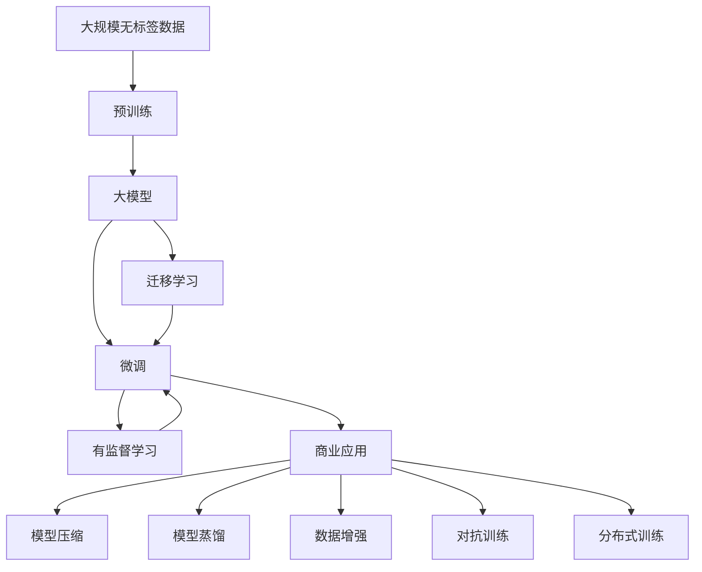

                 

# 大模型：从理论到商业应用的跨越

> 关键词：大模型, 预训练, 微调, 迁移学习, 商业应用, 技术创新

## 1. 背景介绍

### 1.1 问题由来
近年来，人工智能技术的飞速发展，尤其是深度学习技术的突破，极大地推动了大数据时代的到来。大模型（Big Models）作为深度学习技术的重要组成部分，以其卓越的性能和泛化能力在计算机视觉、自然语言处理、语音识别等领域展现了强大的影响力。然而，尽管大模型的性能不断提升，其在实际商业应用中的落地效果并不理想，主要原因在于：

1. **计算资源需求高**：大模型的训练和推理需要极高的计算资源，包括大量的GPU、TPU等高性能硬件，普通企业和个人难以负担。
2. **数据依赖性强**：大模型需要海量的数据进行预训练和微调，获取高质量标注数据成本高，周期长。
3. **可解释性差**：大模型往往被视为"黑箱"，缺乏可解释性和透明性，难以满足商业应用中对模型决策过程的解释需求。
4. **泛化能力弱**：尽管大模型在特定任务上表现优异，但在不同领域或数据集上的泛化能力仍需提高。

### 1.2 问题核心关键点
为了解决上述问题，大模型的商业应用需要考虑以下几个关键点：

- **高效计算**：优化模型结构和算法，降低计算成本，提高模型训练和推理的效率。
- **数据获取**：优化数据标注流程，降低数据获取成本，提高数据的质量和多样性。
- **模型可解释**：提高模型的可解释性和透明度，增强用户对模型的信任和接受度。
- **泛化能力**：提升模型在不同领域和数据集上的泛化能力，减少过拟合和迁移学习的限制。
- **应用落地**：将大模型技术转化为具体的应用场景和产品，实现商业价值的最大化。

### 1.3 问题研究意义
研究大模型从理论到商业应用的跨越，对于推动人工智能技术的普及和产业化具有重要意义：

1. **降低应用门槛**：优化大模型的计算和存储，降低应用门槛，使更多企业能够采用大模型技术。
2. **提升应用效果**：通过优化数据获取和模型结构，提升大模型在商业应用中的效果。
3. **增加商业价值**：将大模型技术应用到多个商业场景，如金融、医疗、教育、智能制造等，创造新的商业机会。
4. **加速技术创新**：推动模型压缩、自监督学习、迁移学习等前沿技术的发展，加速人工智能技术的创新和落地。

## 2. 核心概念与联系

### 2.1 核心概念概述

为更好地理解大模型从理论到商业应用的跨越，本节将介绍几个关键概念及其相互联系：

- **大模型（Big Models）**：基于深度学习的大规模神经网络模型，通常参数量在亿级以上，具有强大的表示能力和泛化能力。
- **预训练（Pre-training）**：在大规模无标签数据上，使用自监督学习方法训练大模型，学习通用的语言或视觉特征表示。
- **微调（Fine-tuning）**：在预训练模型的基础上，使用下游任务的少量标注数据，通过有监督学习方法优化模型，适应特定任务。
- **迁移学习（Transfer Learning）**：将在大规模数据上预训练的模型，迁移到下游小规模任务上进行微调，提高模型在新任务上的性能。
- **自监督学习（Self-supervised Learning）**：利用数据自身的特性进行训练，无需标签数据，适用于大规模无标签数据预训练。
- **模型压缩（Model Compression）**：通过剪枝、量化、低秩分解等方法，减少模型大小和计算量，提高模型计算效率。
- **模型蒸馏（Model Distillation）**：通过知识转移，将大模型的知识蒸馏到小模型上，提高小模型性能。
- **数据增强（Data Augmentation）**：通过对数据进行增强处理，如翻转、旋转、裁剪等，增加数据多样性，提高模型泛化能力。
- **对抗训练（Adversarial Training）**：通过引入对抗样本，提高模型的鲁棒性和泛化能力。
- **分布式训练（Distributed Training）**：将模型并行部署在多台机器上进行训练，加速模型训练过程。

### 2.2 概念间的关系

这些概念之间存在着紧密的联系，共同构成了大模型从理论到商业应用的完整生态系统。以下通过几个Mermaid流程图展示这些概念之间的关系：



这个流程图展示了从数据预训练到大模型微调，再到商业应用的全过程。预训练阶段通过自监督学习方法在大规模数据上训练大模型，学习通用的特征表示。微调阶段在特定任务的少量标注数据上进行有监督学习，适应新任务。迁移学习阶段通过在大模型上进行微调，提高模型在新任务上的性能。商业应用阶段通过模型压缩、蒸馏、增强、对抗训练等方法，优化模型性能，适应实际应用场景。

## 3. 核心算法原理 & 具体操作步骤

### 3.1 算法原理概述

大模型的商业应用主要通过预训练-微调范式实现，其核心思想是在大规模无标签数据上预训练一个大模型，然后针对特定任务进行微调，使模型适应该任务，从而提升模型的性能和泛化能力。

具体来说，预训练和微调过程可以分为以下几个步骤：

1. **预训练阶段**：在大规模无标签数据上，使用自监督学习方法训练大模型，学习通用的特征表示。常见的自监督任务包括语言建模、图像分类、目标检测等。
2. **微调阶段**：在特定任务的少量标注数据上，通过有监督学习方法优化大模型，使其适应该任务。微调过程中通常只更新模型的顶层，以降低计算成本和避免过拟合。
3. **商业应用阶段**：将微调后的大模型部署到实际应用场景中，通过模型压缩、蒸馏、增强等方法，优化模型性能，适应实际应用需求。

### 3.2 算法步骤详解

以下是大模型从理论到商业应用的具体操作步骤：

1. **数据准备**：收集大规模无标签数据进行预训练，收集特定任务的少量标注数据进行微调。
2. **模型选择**：选择合适的预训练模型，如BERT、GPT-3等，进行微调。
3. **模型预训练**：在大规模无标签数据上，使用自监督学习方法训练模型，学习通用的特征表示。
4. **微调模型**：在特定任务的少量标注数据上，使用有监督学习方法微调模型，使其适应新任务。
5. **模型优化**：通过模型压缩、蒸馏、增强等方法，优化模型性能，适应实际应用场景。
6. **模型部署**：将微调后的大模型部署到实际应用场景中，进行商业化应用。

### 3.3 算法优缺点

大模型从理论到商业应用的方法具有以下优点：

1. **泛化能力强**：预训练模型通过自监督学习，学习了通用的特征表示，具有较强的泛化能力，可以适应不同领域的任务。
2. **模型性能高**：通过微调和大规模数据预训练，模型的性能往往优于从头训练的模型。
3. **计算效率高**：预训练和微调过程可以通过分布式计算加速，提高模型训练和推理效率。

同时，该方法也存在以下缺点：

1. **计算资源需求高**：预训练和微调过程需要大量的计算资源，普通企业和个人难以负担。
2. **数据依赖性强**：微调模型需要大量的标注数据，数据获取成本高，周期长。
3. **可解释性差**：大模型往往被视为"黑箱"，缺乏可解释性和透明性，难以满足商业应用中对模型决策过程的解释需求。
4. **泛化能力弱**：大模型在特定领域或数据集上的泛化能力有限，需要针对特定任务进行微调。

### 3.4 算法应用领域

大模型从理论到商业应用的方法广泛应用于多个领域，以下是几个典型的应用场景：

1. **自然语言处理（NLP）**：通过预训练-微调方法，大模型在文本分类、命名实体识别、机器翻译等任务上取得了优异的效果。
2. **计算机视觉（CV）**：大模型在图像分类、目标检测、人脸识别等任务上表现出色，广泛应用于智能安防、医疗影像等领域。
3. **语音识别**：大模型在语音识别、语音生成、语音情感分析等任务上取得了突破性进展，推动了智能客服、语音助手等应用的普及。
4. **智能推荐**：通过预训练-微调方法，大模型在电商、新闻、视频等领域的个性化推荐上取得了优异的效果，提升了用户体验和平台转化率。
5. **金融科技**：大模型在股票预测、风险评估、信用评分等金融领域的应用，提高了金融机构的决策效率和风险控制能力。
6. **医疗健康**：大模型在医学影像、病历分析、药物研发等领域的应用，提升了医疗诊断的准确性和效率。
7. **智能制造**：大模型在工业生产、质量控制、设备维护等领域的应用，推动了制造业的智能化转型和升级。

## 4. 数学模型和公式 & 详细讲解 & 举例说明

### 4.1 数学模型构建

以自然语言处理中的文本分类任务为例，构建数学模型：

- **输入数据**：文本 $x$，长度为 $n$。
- **预训练模型**：大模型 $M_{\theta}$，参数 $\theta$。
- **任务标签**：类别 $y \in \{1,2,\ldots,K\}$。
- **损失函数**：交叉熵损失函数 $\mathcal{L}(M_{\theta},x,y)$。
- **优化器**：如 AdamW、SGD 等，学习率 $\eta$。

### 4.2 公式推导过程

文本分类任务的数学模型构建如下：

1. **预训练模型输出**：
   $$
   \hat{y} = M_{\theta}(x)
   $$
2. **交叉熵损失函数**：
   $$
   \mathcal{L}(M_{\theta},x,y) = -\sum_{k=1}^K y_k \log \hat{y}_k
   $$
3. **优化器更新**：
   $$
   \theta \leftarrow \theta - \eta \nabla_{\theta}\mathcal{L}(\theta)
   $$

### 4.3 案例分析与讲解

以BERT模型的文本分类任务为例，分析其微调过程：

1. **预训练阶段**：使用大规模无标签文本数据进行预训练，学习通用的语言表示。
2. **微调阶段**：在特定任务的标注数据上，微调BERT模型，学习特定任务的特征表示。
3. **商业应用阶段**：通过模型压缩、蒸馏等方法，优化模型性能，适应实际应用场景。

## 5. 项目实践：代码实例和详细解释说明

### 5.1 开发环境搭建

大模型的开发环境搭建通常需要以下步骤：

1. **安装Python**：从官网下载并安装 Python，确保支持 `pip` 包管理工具。
2. **安装PyTorch**：使用 `pip` 安装 PyTorch，通常需要安装 GPU 版本以利用 GPU 加速。
3. **安装 Transformers 库**：使用 `pip` 安装 Transformers 库，该库提供了多种预训练模型的实现。
4. **安装 GPU 设备**：确保系统中的 GPU 设备已经正确安装，并能够被 PyTorch 识别和使用。
5. **配置环境变量**：配置环境变量，确保 PyTorch 和 Transformers 库能够找到正确的 GPU 设备。

### 5.2 源代码详细实现

以使用 BERT 模型进行文本分类任务的微调为例，代码实现如下：

```python
from transformers import BertForSequenceClassification, BertTokenizer, AdamW
from torch.utils.data import DataLoader, Dataset
import torch

# 数据准备
tokenizer = BertTokenizer.from_pretrained('bert-base-uncased')
class TextDataset(Dataset):
    def __init__(self, texts, labels, tokenizer):
        self.texts = texts
        self.labels = labels
        self.tokenizer = tokenizer
    
    def __len__(self):
        return len(self.texts)
    
    def __getitem__(self, idx):
        text = self.texts[idx]
        label = self.labels[idx]
        encoding = tokenizer(text, truncation=True, padding='max_length', max_length=512, return_tensors='pt')
        input_ids = encoding['input_ids']
        attention_mask = encoding['attention_mask']
        return {'input_ids': input_ids, 'attention_mask': attention_mask, 'labels': torch.tensor(label, dtype=torch.long)}

# 模型准备
model = BertForSequenceClassification.from_pretrained('bert-base-uncased', num_labels=2)
optimizer = AdamW(model.parameters(), lr=1e-5)

# 训练过程
device = torch.device('cuda' if torch.cuda.is_available() else 'cpu')
model.to(device)
for epoch in range(3):
    model.train()
    for batch in DataLoader(dataset, batch_size=16, shuffle=True):
        input_ids = batch['input_ids'].to(device)
        attention_mask = batch['attention_mask'].to(device)
        labels = batch['labels'].to(device)
        model.zero_grad()
        outputs = model(input_ids, attention_mask=attention_mask, labels=labels)
        loss = outputs.loss
        loss.backward()
        optimizer.step()
    print(f'Epoch {epoch+1}, loss: {loss:.4f}')

# 模型评估
model.eval()
correct = 0
total = 0
with torch.no_grad():
    for batch in DataLoader(dataset, batch_size=16, shuffle=False):
        input_ids = batch['input_ids'].to(device)
        attention_mask = batch['attention_mask'].to(device)
        labels = batch['labels'].to(device)
        outputs = model(input_ids, attention_mask=attention_mask)
        _, predicted = torch.max(outputs.logits, dim=1)
        total += labels.size(0)
        correct += (predicted == labels).sum().item()
print(f'Accuracy: {correct / total * 100:.2f}%')
```

### 5.3 代码解读与分析

这段代码实现了一个基本的文本分类任务，使用 BERT 模型进行微调。代码分为数据准备、模型准备、训练和评估四个部分。

- **数据准备**：定义了一个简单的数据集类 `TextDataset`，用于存储文本和标签，并使用 `BertTokenizer` 进行文本分词和编码。
- **模型准备**：使用 `BertForSequenceClassification` 类创建了 BERT 模型的分类器，并使用 `AdamW` 优化器进行参数优化。
- **训练过程**：在 GPU 上训练模型，使用交叉熵损失函数，每次迭代更新模型参数。
- **模型评估**：在 GPU 上评估模型，计算分类准确率。

## 6. 实际应用场景

### 6.1 智能客服系统

智能客服系统利用大模型进行自然语言处理，通过预训练-微调方法实现客户意图的自动识别和回复生成，提升客户体验和服务效率。

### 6.2 金融舆情监测

金融机构通过大模型进行情感分析和主题识别，实时监测金融舆情，预警潜在的金融风险，保障金融稳定。

### 6.3 个性化推荐系统

电商和新闻平台使用大模型进行个性化推荐，通过微调模型学习用户兴趣和行为特征，推荐更符合用户需求的物品和内容。

### 6.4 未来应用展望

未来，大模型在商业应用中将有更广阔的前景，广泛应用于智能制造、智慧医疗、智能安防等领域。随着大模型技术的不断成熟和优化，其在商业应用中的价值将进一步凸显。

## 7. 工具和资源推荐

### 7.1 学习资源推荐

1. **深度学习入门**：《Deep Learning》书籍，Ian Goodfellow 等著。
2. **自然语言处理**：《Natural Language Processing with PyTorch》书籍，Denny Britz 著。
3. **计算机视觉**：《Hands-On Machine Learning with Scikit-Learn, Keras, and TensorFlow》书籍，Aurélien Géron 著。
4. **数据科学**：Kaggle 网站，提供大量数据科学竞赛和教程。
5. **在线课程**：Coursera、edX 等在线学习平台提供的深度学习和人工智能课程。

### 7.2 开发工具推荐

1. **深度学习框架**：PyTorch、TensorFlow、Keras。
2. **自然语言处理库**：NLTK、spaCy、Gensim。
3. **计算机视觉库**：OpenCV、Pillow、Scikit-image。
4. **数据处理库**：Pandas、NumPy、SciPy。
5. **可视化工具**：TensorBoard、Weights & Biases。

### 7.3 相关论文推荐

1. **自然语言处理**：Attention is All You Need（NIPS 2017），Vaswani 等著。
2. **计算机视觉**：Deep Residual Learning for Image Recognition（CVPR 2016），He 等著。
3. **数据科学**：A Survey on Online Learning with Streaming Data（IEEE TNNLS 2019），Zhang 等著。

## 8. 总结：未来发展趋势与挑战

### 8.1 研究成果总结

大模型从理论到商业应用的研究成果主要集中在以下几个方面：

1. **预训练方法**：自监督学习、对抗训练、知识蒸馏等方法，提高了模型泛化能力和泛化性。
2. **微调技术**：参数高效微调、连续型 Prompt 学习等技术，提高了微调效率和效果。
3. **分布式训练**：分布式深度学习框架，如 PyTorch、TensorFlow 等，提升了模型训练效率。
4. **模型压缩**：剪枝、量化、低秩分解等方法，减小了模型大小和计算量。
5. **商业应用**：自然语言处理、计算机视觉、个性化推荐等应用，提升了商业价值和社会效益。

### 8.2 未来发展趋势

未来大模型的发展趋势主要包括以下几个方面：

1. **模型规模增大**：随着计算资源和数据量的增加，大模型的规模将进一步增大，学习到的特征表示将更加丰富。
2. **模型结构优化**：优化模型结构和算法，降低计算成本，提高模型训练和推理效率。
3. **数据获取优化**：优化数据标注流程，降低数据获取成本，提高数据的质量和多样性。
4. **可解释性增强**：提高模型的可解释性和透明度，增强用户对模型的信任和接受度。
5. **泛化能力提升**：提升模型在不同领域和数据集上的泛化能力，减少过拟合和迁移学习的限制。
6. **商业价值拓展**：将大模型技术应用到更多商业场景，如智能制造、智慧医疗等，创造新的商业机会。

### 8.3 面临的挑战

尽管大模型技术取得了重要进展，但在商业应用中仍面临以下挑战：

1. **计算资源瓶颈**：大规模模型的训练和推理需要大量的计算资源，难以在普通硬件上实现。
2. **数据依赖性强**：微调模型需要大量的标注数据，数据获取成本高，周期长。
3. **可解释性差**：大模型往往被视为"黑箱"，缺乏可解释性和透明性，难以满足商业应用中对模型决策过程的解释需求。
4. **泛化能力弱**：大模型在特定领域或数据集上的泛化能力有限，需要针对特定任务进行微调。
5. **伦理与安全问题**：预训练语言模型可能学习到有害信息和偏见，传递到下游任务，产生误导性、歧视性的输出。

### 8.4 研究展望

未来大模型研究可以从以下几个方向进行突破：

1. **无监督和半监督学习**：利用自监督和主动学习方法，降低数据标注成本，提高模型泛化能力。
2. **参数高效微调**：开发更高效的微调方法，如 Adapter、Prefix Tuning 等，提高微调效率和效果。
3. **多模态学习**：融合视觉、语音等多模态数据，提升模型对现实世界的理解和建模能力。
4. **因果推断**：引入因果推断方法，提高模型的可解释性和鲁棒性。
5. **对抗训练**：通过对抗训练提高模型的鲁棒性和泛化能力。
6. **分布式计算**：优化分布式训练算法，提升模型训练效率。
7. **模型压缩与加速**：通过模型压缩、量化、剪枝等方法，提高模型计算效率。
8. **知识蒸馏**：通过知识蒸馏方法，提高小模型的性能和泛化能力。
9. **商业应用落地**：将大模型技术转化为具体的应用场景和产品，实现商业价值。

通过这些研究方向的探索，大模型技术将进一步拓展其应用范围和商业价值，成为人工智能技术发展的重要推动力。

## 9. 附录：常见问题与解答

**Q1：大模型与传统的机器学习模型有哪些区别？**

A: 大模型与传统的机器学习模型有以下区别：

1. **数据需求**：大模型需要海量的无标签数据进行预训练，而传统的机器学习模型主要依赖于有标签的数据进行训练。
2. **计算资源**：大模型需要大量的计算资源进行训练和推理，而传统的机器学习模型可以在普通硬件上进行训练和推理。
3. **模型结构**：大模型通常采用深度神经网络结构，具有复杂的层次结构和庞大的参数量，而传统的机器学习模型结构相对简单。
4. **可解释性**：大模型通常被视为"黑箱"，缺乏可解释性和透明性，而传统的机器学习模型具有较好的可解释性。
5. **泛化能力**：大模型具有较强的泛化能力，可以适应不同领域的任务，而传统的机器学习模型在特定领域上的泛化能力有限。

**Q2：大模型在微调过程中需要注意哪些关键点？**

A: 大模型在微调过程中需要注意以下几个关键点：

1. **学习率设置**：微调学习率通常比预训练学习率小，避免破坏预训练权重。
2. **正则化技术**：如权重衰减、Dropout、Early Stopping 等，防止模型过拟合。
3. **数据增强**：通过回译、近义替换等方式扩充训练集，增加数据多样性。
4. **对抗训练**：引入对抗样本，提高模型鲁棒性和泛化能力。
5. **参数高效微调**：只调整少量参数，提高微调效率。
6. **分布式训练**：利用分布式深度学习框架，提高模型训练效率。

**Q3：大模型在商业应用中如何降低计算资源需求？**

A: 大模型在商业应用中可以通过以下方法降低计算资源需求：

1. **模型压缩**：通过剪枝、量化、低秩分解等方法，减小模型大小和计算量。
2. **分布式训练**：利用分布式深度学习框架，提高模型训练效率。
3. **硬件加速**：使用 GPU、TPU 等高性能硬件，加速模型训练和推理。
4. **数据增强**：通过数据增强技术，增加数据多样性，提高模型泛化能力。
5. **对抗训练**：通过对抗训练提高模型的鲁棒性和泛化能力。
6. **参数高效微调**：只调整少量参数，提高微调效率。

**Q4：大模型在商业应用中如何提高模型的可解释性？**

A: 大模型在商业应用中可以通过以下方法提高模型的可解释性：

1. **可解释性模型**：使用可解释性模型（如 LIME、SHAP 等）对模型输出进行解释。
2. **注意力机制**：通过注意力机制可视化模型对输入数据的关注点，提高模型的可解释性。
3. **用户反馈**：利用用户反馈对模型进行迭代优化，提高模型的透明度和可解释性。
4. **模型蒸馏**：通过知识蒸馏方法，将大模型的知识蒸馏到小模型上，提高小模型的可解释性。

**Q5：大模型在商业应用中如何处理伦理与安全问题？**

A: 大模型在商业应用中可以通过以下方法处理伦理与安全问题：

1. **数据过滤**：过滤有害信息和偏见数据，减少模型学习到有害信息的风险。
2. **算法审查**：对模型进行算法审查，确保模型输出符合伦理和道德标准。
3. **用户监控**：监控模型输出，及时发现和纠正有害信息，保护用户隐私和权益。
4. **透明化机制**：建立透明的决策机制，增强用户对模型的信任和接受度。
5. **法律法规**：遵守相关法律法规，确保模型应用符合法律要求。

---

作者：禅与计算机程序设计艺术 / Zen and the Art of Computer Programming

