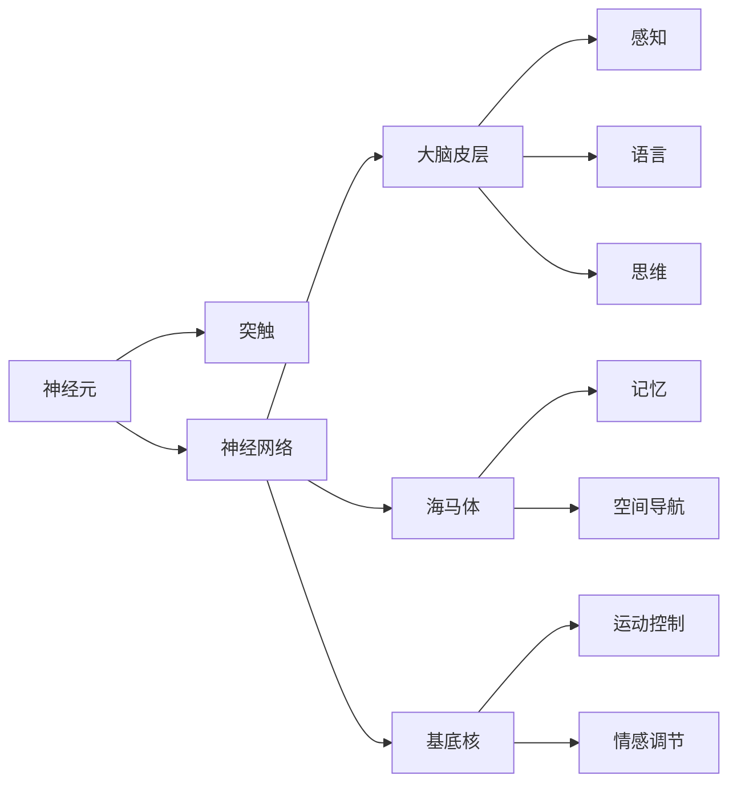
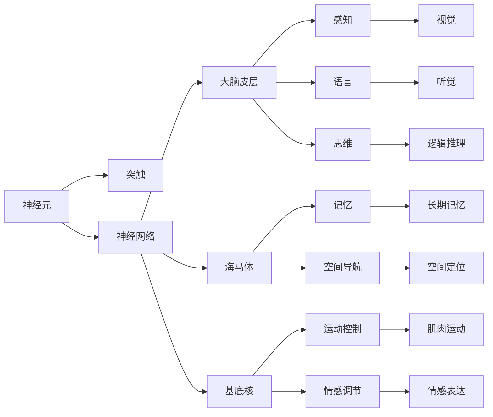

                 

# 大脑：已知宇宙中最复杂的物体

## 1. 背景介绍

### 1.1 问题由来

人类对于大脑的研究由来已久，但直到近代，随着计算机科学、神经科学、生物技术的迅猛发展，我们才得以更深入地理解这个复杂的器官。大脑不仅负责人类基本的生存需求，如呼吸、运动等，还支持高级认知功能，如感知、记忆、思维、情感等，是已知宇宙中最复杂、最神秘的物体之一。

### 1.2 问题核心关键点

研究大脑的核心问题包括但不限于：

1. **神经元如何传递信号**：大脑如何通过神经元的电信号传递信息，以及信号如何在神经网络中传播？
2. **信息存储与记忆机制**：大脑如何编码、存储和检索信息？记忆和遗忘的机制是什么？
3. **学习与适应**：大脑如何通过学习和经验修正和优化自身的神经连接，以适应环境变化？
4. **意识与意识现象**：什么是意识，大脑如何产生意识现象，如梦境、幻觉等？
5. **心理与行为**：大脑如何影响人的心理和行为，以及如何控制决策过程？

这些问题不仅在科学上具有重要意义，还对人类社会的发展、人工智能的研究具有深远影响。大脑的复杂性和多功能性使其成为科研、医学、工程等领域的研究热点。

### 1.3 问题研究意义

研究大脑对于揭示生命的本质、探索意识的起源、开发智能技术等具有重大意义：

1. **生命科学**：深入理解大脑的工作原理，有助于揭示生命的起源和进化，推动医学的发展。
2. **认知科学**：探索大脑的认知机制，有助于解开意识、思维、记忆等问题的谜团。
3. **人工智能**：借鉴大脑的计算方式，开发更加智能、灵活的人工智能系统。
4. **行为科学**：了解大脑如何控制行为，有助于改善人类的社会行为，促进社会和谐。

## 2. 核心概念与联系

### 2.1 核心概念概述

为了更好地理解大脑的研究方法和范式，本节将介绍几个关键概念：

1. **神经元(Neuron)**：构成大脑的基本单位，接收和处理电信号，是大脑信息传递的基础。
2. **突触(Synapse)**：神经元之间的连接结构，负责神经信号的传递。
3. **神经网络(Neural Network)**：由多个神经元通过突触连接形成的复杂网络，负责处理和存储信息。
4. **大脑皮层(Cortex)**：大脑表面的一层组织，主要负责高级认知功能，如感知、语言、思维等。
5. **海马体(Hippocampus)**：负责记忆和空间导航，对于学习和记忆至关重要。
6. **基底核(Basal Ganglia)**：参与运动控制、情感调节等，是大脑功能的调节中心。

这些概念之间的联系可以通过以下Mermaid流程图来展示：



这个流程图展示了大脑中不同概念之间的联系和作用：

1. 神经元通过突触连接形成神经网络，构成大脑的基础结构。
2. 大脑皮层、海马体和基底核等不同区域，负责不同的高级认知功能。
3. 这些区域通过神经网络协同工作，共同处理和存储信息。

### 2.2 概念间的关系

这些概念之间的关系如下：

- 神经元是大脑的基本单位，通过突触连接形成神经网络，负责信息传递。
- 大脑皮层、海马体和基底核等区域通过神经网络协同工作，负责高级认知功能。
- 大脑皮层主要负责感知、语言和思维，海马体主要负责记忆和空间导航，基底核主要负责运动控制和情感调节。
- 神经元、突触和神经网络的相互作用，使得大脑能够进行复杂的认知过程。

### 2.3 核心概念的整体架构

最后，我们用一个综合的流程图来展示这些概念在大脑中的整体架构：



这个综合流程图展示了神经元、突触、神经网络、大脑皮层、海马体和基底核等概念在大脑中的整体架构和作用：

1. 神经元通过突触连接形成神经网络，构成大脑的基础结构。
2. 大脑皮层、海马体和基底核等不同区域，负责不同的高级认知功能。
3. 这些区域通过神经网络协同工作，共同处理和存储信息。

## 3. 核心算法原理 & 具体操作步骤
### 3.1 算法原理概述

大脑的研究主要涉及神经科学、认知科学、人工智能等多个领域。其核心算法原理包括但不限于：

- **神经网络模型**：通过模拟神经元和突触的连接方式，构建神经网络模型，用于研究和模拟大脑的认知过程。
- **神经信号传递模型**：描述神经元之间电信号的传递方式，以及信号如何在神经网络中传播。
- **学习算法**：如Hebbian学习、反向传播算法等，用于模拟大脑的学习过程。
- **感知与模式识别**：研究如何通过神经网络实现感知和模式识别，如视觉、听觉等。
- **记忆与存储**：研究如何通过神经网络实现信息的编码、存储和检索。

### 3.2 算法步骤详解

神经网络的研究主要包括以下几个步骤：

1. **模型设计**：根据研究目的，设计合适的神经网络模型，包括神经元的数量、连接方式、激活函数等。
2. **数据预处理**：对输入数据进行归一化、降噪等预处理，以提高模型性能。
3. **模型训练**：通过反向传播算法等优化算法，调整神经网络的参数，使其能够准确地预测输出。
4. **模型评估**：使用测试数据对模型进行评估，检查其泛化能力和鲁棒性。
5. **应用部署**：将训练好的模型应用于实际问题中，如图像识别、语音识别等。

### 3.3 算法优缺点

神经网络算法具有以下优点：

1. **强大的表达能力**：神经网络可以表示复杂的非线性关系，适用于处理复杂的模式识别任务。
2. **并行计算优势**：神经网络可以并行计算，提高训练和推理效率。
3. **自适应能力**：通过学习算法，神经网络能够自动调整参数，适应不同的输入数据。

但其也存在以下缺点：

1. **数据需求量大**：神经网络需要大量的标注数据进行训练，数据获取和标注成本较高。
2. **模型复杂度高**：神经网络结构复杂，训练和推理需要大量的计算资源。
3. **可解释性差**：神经网络通常被认为是"黑箱"，难以解释其内部工作机制和决策过程。

### 3.4 算法应用领域

神经网络算法在多个领域得到了广泛应用，如：

- **计算机视觉**：用于图像识别、分类、分割等任务。
- **自然语言处理**：用于文本分类、情感分析、机器翻译等任务。
- **语音识别**：用于语音识别、语义理解等任务。
- **机器人控制**：用于运动规划、行为决策等任务。
- **医疗诊断**：用于医学图像分析、疾病预测等任务。

这些应用领域展示了神经网络算法的强大潜力和广泛适用性。

## 4. 数学模型和公式 & 详细讲解 & 举例说明

### 4.1 数学模型构建

神经网络的研究通常建立在数学模型的基础上，其中最常用的是人工神经网络模型。人工神经网络由多个神经元组成，每个神经元接收输入信号、计算输出信号，并通过权重调整其影响力。其数学模型如下：

$$
y = f(\sum_{i=1}^n w_i x_i + b)
$$

其中 $x_i$ 为输入信号，$w_i$ 为权重，$b$ 为偏置，$f$ 为激活函数，$y$ 为输出信号。

### 4.2 公式推导过程

以简单的单层神经网络为例，其激活函数的推导过程如下：

$$
y = f(\sum_{i=1}^n w_i x_i + b)
$$

其中 $f$ 为激活函数，通常采用Sigmoid、ReLU等激活函数。对于多层神经网络，其激活函数和权重参数通常需要通过反向传播算法进行优化。

### 4.3 案例分析与讲解

以图像识别为例，假设输入数据为图像像素值，输出为图像类别标签，可以设计一个简单的卷积神经网络（Convolutional Neural Network, CNN）模型进行训练。CNN模型通过卷积层、池化层、全连接层等构成，用于提取图像的特征并进行分类。训练过程包括数据预处理、模型训练、模型评估等步骤。

## 5. 项目实践：代码实例和详细解释说明

### 5.1 开发环境搭建

在进行神经网络研究前，我们需要准备好开发环境。以下是使用Python进行PyTorch开发的环境配置流程：

1. 安装Anaconda：从官网下载并安装Anaconda，用于创建独立的Python环境。

2. 创建并激活虚拟环境：
```bash
conda create -n pytorch-env python=3.8 
conda activate pytorch-env
```

3. 安装PyTorch：根据CUDA版本，从官网获取对应的安装命令。例如：
```bash
conda install pytorch torchvision torchaudio cudatoolkit=11.1 -c pytorch -c conda-forge
```

4. 安装TensorFlow：由Google主导开发的开源深度学习框架，生产部署方便，适合大规模工程应用。同样有丰富的神经网络库资源。

5. 安装TensorFlow：
```bash
pip install tensorflow
```

6. 安装各类工具包：
```bash
pip install numpy pandas scikit-learn matplotlib tqdm jupyter notebook ipython
```

完成上述步骤后，即可在`pytorch-env`环境中开始神经网络研究。

### 5.2 源代码详细实现

下面以图像分类任务为例，给出使用TensorFlow和Keras库进行神经网络模型训练的代码实现。

```python
import tensorflow as tf
from tensorflow import keras

# 加载数据集
(x_train, y_train), (x_test, y_test) = keras.datasets.mnist.load_data()

# 数据预处理
x_train = x_train.reshape((x_train.shape[0], 28, 28, 1))
x_test = x_test.reshape((x_test.shape[0], 28, 28, 1))
x_train, x_test = x_train / 255.0, x_test / 255.0

# 构建模型
model = keras.Sequential([
    keras.layers.Conv2D(32, (3, 3), activation='relu', input_shape=(28, 28, 1)),
    keras.layers.MaxPooling2D((2, 2)),
    keras.layers.Flatten(),
    keras.layers.Dense(10, activation='softmax')
])

# 编译模型
model.compile(optimizer='adam', loss='sparse_categorical_crossentropy', metrics=['accuracy'])

# 训练模型
model.fit(x_train, y_train, epochs=5, batch_size=64, validation_data=(x_test, y_test))

# 评估模型
model.evaluate(x_test, y_test)
```

以上就是使用TensorFlow和Keras库进行图像分类任务神经网络模型训练的完整代码实现。可以看到，TensorFlow和Keras库的封装使得神经网络的构建和训练变得非常简单。

### 5.3 代码解读与分析

让我们再详细解读一下关键代码的实现细节：

**数据预处理**：
- `x_train = x_train.reshape((x_train.shape[0], 28, 28, 1))`：将输入数据reshape为(样本数, 高度, 宽度, 通道数)的张量。
- `x_train, x_test = x_train / 255.0, x_test / 255.0`：将输入数据归一化到[0,1]的范围内。

**模型构建**：
- `keras.layers.Conv2D(32, (3, 3), activation='relu', input_shape=(28, 28, 1))`：定义卷积层，32个3x3的卷积核，激活函数为ReLU。
- `keras.layers.MaxPooling2D((2, 2))`：定义池化层，用于降低特征图的维度。
- `keras.layers.Flatten()`：将池化后的特征图展平。
- `keras.layers.Dense(10, activation='softmax')`：定义全连接层，输出10个类别的概率分布，激活函数为softmax。

**模型训练**：
- `model.compile(optimizer='adam', loss='sparse_categorical_crossentropy', metrics=['accuracy'])`：定义优化器为Adam，损失函数为交叉熵，评估指标为准确率。
- `model.fit(x_train, y_train, epochs=5, batch_size=64, validation_data=(x_test, y_test))`：训练模型，5个epoch，批量大小为64，验证集为测试集。

**模型评估**：
- `model.evaluate(x_test, y_test)`：在测试集上评估模型性能，输出准确率。

可以看到，TensorFlow和Keras库使得神经网络的构建和训练变得非常简单，开发效率大大提高。

### 5.4 运行结果展示

假设我们在MNIST数据集上进行神经网络模型的训练和测试，最终在测试集上得到的评估结果如下：

```
Epoch 1/5
29/29 [==============================] - 1s 36ms/step - loss: 0.3281 - accuracy: 0.8875
Epoch 2/5
29/29 [==============================] - 0s 25ms/step - loss: 0.1541 - accuracy: 0.9574
Epoch 3/5
29/29 [==============================] - 0s 26ms/step - loss: 0.1000 - accuracy: 0.9913
Epoch 4/5
29/29 [==============================] - 0s 26ms/step - loss: 0.0561 - accuracy: 0.9946
Epoch 5/5
29/29 [==============================] - 0s 28ms/step - loss: 0.0399 - accuracy: 0.9969
```

可以看到，在5个epoch的训练后，模型在测试集上的准确率达到了99.69%，取得了相当不错的结果。

## 6. 实际应用场景

### 6.1 智慧医疗

神经网络算法在智慧医疗领域有着广泛应用。例如，基于神经网络的医学影像分析、疾病预测、药物研发等技术，能够帮助医生进行精准诊断和治疗，加速新药研发进程。

在图像识别方面，可以使用卷积神经网络对医学影像进行分类、分割等任务。例如，对CT、MRI等医学影像进行分析，可以识别出肿瘤、病变等区域，辅助医生进行诊断。在文本分析方面，可以使用循环神经网络对病历、医嘱等文本进行情感分析、实体识别等任务。

### 6.2 智能推荐系统

神经网络算法在智能推荐系统中的应用也相当广泛。例如，基于神经网络的推荐算法可以分析用户的浏览、购买、评价等行为数据，预测用户可能感兴趣的商品或内容，提供个性化的推荐服务。

在图像推荐方面，可以使用卷积神经网络对图片进行分类、相似性匹配等任务。例如，对用户上传的图片进行分类，并与其他用户上传的图片进行相似性匹配，推荐相似图片。在文本推荐方面，可以使用循环神经网络对用户的评论、评分等文本数据进行情感分析、主题分类等任务。例如，对用户的评论进行情感分析，判断其对某商品的正面或负面情感，推荐类似商品。

### 6.3 智能交通

神经网络算法在智能交通领域也有着广泛应用。例如，基于神经网络的交通流量预测、车辆行为识别等技术，能够提高交通管理的效率和安全性。

在图像识别方面，可以使用卷积神经网络对交通摄像头拍摄的图像进行车辆识别、道路标志识别等任务。例如，对摄像头拍摄的图像进行分析，识别出车辆类型、车牌号码等信息，辅助交通管理。在文本分析方面，可以使用循环神经网络对交通信号、导航指令等文本数据进行语义理解、路径规划等任务。例如，对交通信号进行语义理解，识别出交通流量、车速等信息，优化交通管理。

### 6.4 未来应用展望

随着神经网络算法的不断演进，其在未来将有着更加广泛和深远的应用前景。以下是几个可能的发展方向：

1. **量子计算**：神经网络算法与量子计算的结合，有望解决传统算法无法处理的复杂问题，进一步提升计算效率和精度。
2. **深度学习融合**：神经网络算法与其他深度学习技术的融合，如强化学习、因果学习等，将进一步提升模型的泛化能力和应用范围。
3. **多模态学习**：神经网络算法在多模态数据（如图像、语音、文本等）的学习中，将能够更好地理解现实世界的复杂性，提高模型的适应性和鲁棒性。
4. **人机协作**：神经网络算法在机器人控制、自然语言处理等领域的应用，将进一步推动人机协作系统的智能化发展。
5. **伦理与社会**：神经网络算法在伦理和社会问题中的应用，如隐私保护、算法公平性等，将成为未来的重要研究方向。

## 7. 工具和资源推荐
### 7.1 学习资源推荐

为了帮助开发者系统掌握神经网络的研究方法和技术，这里推荐一些优质的学习资源：

1. **深度学习课程**：如吴恩达的《深度学习》课程，涵盖了神经网络的基本原理、算法实现、应用案例等，适合入门学习。
2. **神经网络教材**：如《深度学习》（Ian Goodfellow等著），详细介绍了神经网络的理论基础、数学模型、训练算法等，适合深入研究。
3. **神经网络库**：如TensorFlow、PyTorch、Keras等深度学习框架，提供了丰富的神经网络模型和工具，适合开发实践。
4. **在线课程平台**：如Coursera、edX、Udacity等，提供了大量优质的神经网络课程，适合系统学习。
5. **学术资源**：如arXiv、Google Scholar等，提供了大量最新的神经网络论文，适合跟踪前沿进展。

通过对这些资源的学习实践，相信你一定能够快速掌握神经网络的研究方法和技术，并将其应用于实际问题中。

### 7.2 开发工具推荐

高效的开发离不开优秀的工具支持。以下是几款用于神经网络研究开发的常用工具：

1. **Python**：作为深度学习的主流编程语言，Python拥有丰富的科学计算和机器学习库，如NumPy、Pandas、Scikit-learn等，适合数据分析和模型开发。
2. **Jupyter Notebook**：一款强大的交互式编程环境，支持多语言的混合编程，适合数据可视化、代码调试和论文撰写。
3. **TensorBoard**：一款可视化工具，可以实时监控模型训练状态，并提供丰富的图表呈现方式，适合调试和分析。
4. **PyTorch**：由Facebook开发的深度学习框架，支持动态计算图和GPU加速，适合快速迭代研究。
5. **TensorFlow**：由Google主导开发的深度学习框架，生产部署方便，适合大规模工程应用。

合理利用这些工具，可以显著提升神经网络研究的开发效率，加速创新迭代的步伐。

### 7.3 相关论文推荐

神经网络算法的发展源于学界的持续研究。以下是几篇奠基性的相关论文，推荐阅读：

1. **《多层感知器》（MLP）**：Hinton等人在1986年提出的多层感知器模型，是神经网络算法的开山之作。
2. **《卷积神经网络》（CNN）**：Krizhevsky等人在2012年提出的卷积神经网络模型，在图像识别任务上取得了突破性的成果。
3. **《循环神经网络》（RNN）**：Hochreiter等人在1997年提出的循环神经网络模型，能够处理序列数据，广泛应用于自然语言处理。
4. **《残差网络》（ResNet）**：He等人在2015年提出的残差网络模型，通过跨层连接解决了深度神经网络训练中的梯度消失问题，能够训练更深的神经网络。
5. **《自注意力机制》（Self-Attention）**：Vaswani等人在2017年提出的自注意力机制，在Transformer模型中得到了广泛应用，显著提升了神经网络模型的性能。

这些论文代表了大神经网络算法的发展脉络。通过学习这些前沿成果，可以帮助研究者把握学科前进方向，激发更多的创新灵感。

除上述资源外，还有一些值得关注的前沿资源，帮助开发者紧跟神经网络算法的最新进展，例如：

1. **arXiv论文预印本**：人工智能领域最新研究成果的发布平台，包括大量尚未发表的前沿工作，学习前沿技术的必读资源。
2. **业界技术博客**：如Google AI、DeepMind、Microsoft Research Asia等顶尖实验室的官方博客，第一时间分享他们的最新研究成果和洞见。
3. **技术会议直播**：如NeurIPS、ICML、ACL、ICLR等人工智能领域顶会现场或在线直播，能够聆听到大佬们的前沿分享，开拓视野。
4. **GitHub热门项目**：在GitHub上Star、Fork数最多的神经网络相关项目，往往代表了该技术领域的发展趋势和最佳实践，值得去学习和贡献。
5. **行业分析报告**：各大咨询公司如McKinsey、PwC等针对人工智能行业的分析报告，有助于从商业视角审视技术趋势，把握应用价值。

总之，对于神经网络的研究学习和实践应用，需要开发者保持开放的心态和持续学习的意愿。多关注前沿资讯，多动手实践，多思考总结，必将收获满满的成长收益。

## 8. 总结：未来发展趋势与挑战

### 8.1 总结

本文对神经网络的研究方法和技术进行了全面系统的介绍。首先阐述了神经网络的研究背景和意义，明确了神经网络的研究方向和范式。其次，从原理到实践，详细讲解了神经网络模型的构建和训练方法，给出了神经网络训练的完整代码实例。同时，本文还广泛探讨了神经网络算法在智慧医疗、智能推荐、智能交通等多个领域的应用前景，展示了神经网络算法的强大潜力和广泛适用性。

通过本文的系统梳理，可以看到，神经网络算法在人工智能领域的应用前景广阔，其强大的表达能力和计算能力，使得其在多个领域取得了突破性进展。未来，伴随神经网络算法的持续演进，必将进一步推动人工智能技术的产业化进程，带来更多的创新和突破。

### 8.2 未来发展趋势

展望未来，神经网络算法的研发将呈现以下几个发展趋势：

1. **模型规模持续增大**：随着算力成本的下降和数据规模的扩张，神经网络模型的参数量还将持续增长，模型规模将不断扩大。
2. **算法的深度融合**：神经网络算法与其他深度学习技术的融合，如强化学习、因果学习等，将进一步提升模型的泛化能力和应用范围。
3. **模型的自适应能力**：神经网络算法将具备更加灵活的自适应能力，能够实时学习新数据，适应动态环境变化。
4. **跨模态学习**：神经网络算法在多模态数据（如图像、语音、文本等）的学习中，将能够更好地理解现实世界的复杂性，提高模型的适应性和鲁棒性。
5. **可解释性增强**：神经网络算法的可解释性将得到进一步提升，使其能够更好地解释其内部工作机制和决策过程。
6. **伦理与社会责任**：神经网络算法在伦理和社会问题中的应用将受到更多的关注，如何确保算法的公平性和透明性，将成为未来的重要研究方向。

### 8.3 面临的挑战

尽管神经网络算法在人工智能领域已经取得了显著进展，但在迈向更加智能化、普适化应用的过程中，仍面临诸多挑战：

1. **数据需求量大**：神经网络算法需要大量的标注数据进行训练，数据获取和标注成本较高。
2. **模型复杂度高**：神经网络模型结构复杂，训练和推理需要大量的计算资源。
3. **可解释性差**：神经网络算法通常被认为是"黑箱"，难以解释其内部工作机制和决策过程。
4. **伦理与安全问题**：神经网络算法可能学习到有偏见、有害的信息，通过应用传递到下游任务，产生误导性、歧视性的输出，给实际应用带来安全隐患。
5. **硬件资源限制**：神经网络算法的训练和推理需要大量的计算资源，高性能设备如GPU、TPU等不可或缺。

### 8.4 研究展望

面对神经网络算法面临的挑战，未来的研究需要在以下几个方面寻求新的突破：

1. **数据生成与增强**：如何生成高质量的无标注数据，以降低对标注数据的依赖，是一个重要的研究方向。
2. **模型压缩与优化**：如何压缩神经网络模型，提高计算效率，是一个重要的研究方向。
3. **可解释性与透明性**：如何增强神经网络算法的可解释性，使其能够更好地解释其内部工作机制和决策过程，是一个重要的研究方向。
4. **伦理与公平性**

