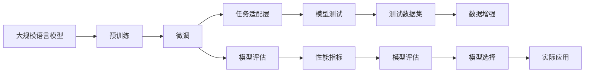

                 

# 大规模语言模型从理论到实践 大语言模型评估方法

> 关键词：大规模语言模型,模型评估,模型测试,性能指标,自然语言处理(NLP),预训练模型,微调,任务适配

## 1. 背景介绍

### 1.1 问题由来

近年来，大规模语言模型（Large Language Models, LLMs）在自然语言处理（NLP）领域取得了显著进展。这些模型通过在大规模无标签文本数据上进行预训练，学习到丰富的语言知识，并具备强大的语言理解和生成能力。然而，随着模型规模的增大，如何评估和比较不同模型的性能成为了一个亟待解决的问题。尤其是在学术和工业界，评价模型效果的可靠性和可重复性尤为重要。

### 1.2 问题核心关键点

大语言模型评估的核心关键点包括：
- 如何选择合适的评估指标？
- 如何设计合适的测试数据集？
- 如何对模型进行有效评估和比较？
- 如何兼顾模型的泛化能力和鲁棒性？
- 如何建立模型之间的基准线，便于比较？

### 1.3 问题研究意义

进行大语言模型评估，对于指导模型开发和优化、确保模型的可靠性、以及促进学术界和工业界的交流和合作具有重要意义：

1. 指导模型优化：通过评估模型的性能，可以快速定位模型的不足之处，指导开发者改进模型设计。
2. 确保模型可靠性：确保模型在不同数据集和应用场景中表现稳定，避免过拟合或欠拟合。
3. 促进交流合作：统一模型评估标准，便于学术界和工业界之间的交流和比较。
4. 推动技术进步：通过比较不同模型的性能，找出最先进的方法和突破口，加速技术进步。
5. 实际应用参考：为实际应用场景提供模型选择的依据，帮助解决特定问题。

## 2. 核心概念与联系

### 2.1 核心概念概述

为了更好地理解大语言模型的评估方法，本节将介绍几个关键概念：

- 大规模语言模型(Large Language Models, LLM)：指在大规模无标签文本数据上进行预训练的模型，如BERT、GPT、XLNet等。
- 模型评估：指通过测试数据集对模型进行性能评估的过程。常用的评估指标包括准确率、精确率、召回率、F1分数等。
- 模型测试：指在特定任务上对模型进行评估，包括分类、匹配、生成等任务。
- 性能指标：用于衡量模型在不同任务上的表现，如BLEU、ROUGE、METEOR、CER等。
- 自然语言处理(Natural Language Processing, NLP)：指使用计算机处理和理解人类语言的各项技术，如文本分类、命名实体识别、情感分析等。
- 预训练模型：指在大规模文本数据上预训练的模型，用于获取通用的语言表示。
- 微调(Fine-tuning)：指在预训练模型上添加任务适配层，通过有监督学习优化模型在特定任务上的性能。
- 任务适配层：根据具体任务设计的网络结构，用于微调模型的顶部层。

这些概念之间存在着紧密的联系，形成了大语言模型评估的完整生态系统。通过理解这些核心概念，我们可以更好地把握大语言模型评估的原理和步骤。

### 2.2 概念间的关系

这些核心概念之间的关系可以通过以下Mermaid流程图来展示：



这个流程图展示了从预训练到微调，再到模型评估和实际应用的全过程。预训练模型通过微调适配特定任务，并通过模型评估确保模型性能。通过测试数据集和性能指标对模型进行评估和比较，从而在实际应用中做出选择。数据增强技术可以提升模型在测试集上的表现，同时降低过拟合风险。最终，通过模型评估和选择，确保模型在实际应用中具有良好的泛化能力和鲁棒性。

## 3. 核心算法原理 & 具体操作步骤

### 3.1 算法原理概述

大语言模型的评估原理基于有监督学习和测试集评估。其核心思想是：通过在测试集上对模型进行前向传播和损失计算，计算模型的预测结果与真实标签之间的差异，从而得到模型的评估指标。常用的评估方法包括：

- 准确率（Accuracy）：模型预测正确的样本数占总样本数的比例。
- 精确率（Precision）：预测为正例的样本中，真正为正例的样本数占预测正例数的比例。
- 召回率（Recall）：真正为正例的样本中，被模型预测为正例的样本数占真正正例数的比例。
- F1分数（F1 Score）：精确率和召回率的调和平均数，综合考虑模型在预测精度和覆盖率方面的表现。
- BLEU分数（BLEU Score）：用于评估机器翻译任务中模型生成的文本与参考文本的相似度。
- ROUGE分数（ROUGE Score）：用于评估文本摘要和信息检索任务中模型生成的摘要与参考摘要的相似度。
- METEOR分数（METEOR Score）：结合BLEU和ROUGE的优点，考虑词汇重叠和句子结构等因素，适用于多种NLP任务。
- CER（Cseudo-Reference）：用于评估对话系统生成的回复与参考回复的相似度。

### 3.2 算法步骤详解

大语言模型评估的具体步骤包括：

**Step 1: 准备评估数据集**
- 收集和标注特定任务的测试数据集，确保数据集覆盖各种情况，如不同的输入长度、不同的任务类型等。
- 将数据集划分为训练集和验证集，确保评估结果的可靠性和稳定性。

**Step 2: 设计任务适配层**
- 根据具体任务设计网络结构，用于适配模型顶部层。
- 对于分类任务，通常使用线性分类器和交叉熵损失函数。
- 对于生成任务，通常使用语言模型的解码器输出概率分布，并以负对数似然为损失函数。

**Step 3: 设置评估超参数**
- 选择合适的评估指标，如BLEU、ROUGE等。
- 设定评估指标的阈值，如BLEU分数大于40为通过。
- 设定模型评估的批次大小、迭代轮数等超参数。

**Step 4: 执行评估**
- 将测试数据集输入模型，进行前向传播计算预测结果。
- 计算预测结果与真实标签之间的差异，得到评估指标。
- 记录评估指标和模型状态，用于后续比较和优化。

**Step 5: 分析评估结果**
- 对比模型在不同评估指标上的表现，分析模型的优势和不足。
- 结合任务特点，对模型进行优化调整，提升模型性能。

### 3.3 算法优缺点

大语言模型评估方法具有以下优点：
1. 简单高效。收集和标注特定任务的测试数据集相对简单，评估过程易于实现。
2. 结果可靠。通过在独立测试集上评估，避免了数据偏差和过拟合风险。
3. 可比较性高。评估指标如BLEU、ROUGE等具有较高的可比较性，便于模型之间的比较和选择。
4. 适用性强。适用于各种NLP任务，如文本分类、命名实体识别、机器翻译等。

同时，该方法也存在一些局限性：
1. 依赖标注数据。测试数据集的标注工作可能耗费大量时间和精力，且标注质量对评估结果有直接影响。
2. 难以评估泛化能力。测试数据集可能无法完全覆盖所有情况，评估结果可能存在偏差。
3. 评估成本高。收集和标注大规模数据集成本较高，且需要专业标注团队支持。
4. 评估时间较长。模型在大规模数据集上评估时间较长，不适合实时评估。
5. 复杂任务评估困难。对于某些复杂任务，如机器翻译、对话系统等，评估指标可能难以完全反映模型性能。

尽管存在这些局限性，但就目前而言，大语言模型评估方法仍然是评估模型性能的有效手段。未来相关研究将致力于进一步降低标注数据需求，提升评估效率，增强评估结果的可靠性，同时引入更多有意义的评估指标和评估方法。

### 3.4 算法应用领域

大语言模型评估方法在NLP领域已经得到了广泛应用，覆盖了几乎所有常见任务，例如：

- 文本分类：如情感分析、主题分类、意图识别等。通过评估模型在分类任务上的表现，选择最适合特定任务的模型。
- 命名实体识别：识别文本中的人名、地名、机构名等特定实体。通过评估模型在命名实体识别任务上的表现，提升模型识别准确率。
- 关系抽取：从文本中抽取实体之间的语义关系。通过评估模型在关系抽取任务上的表现，优化模型抽取关系的能力。
- 问答系统：对自然语言问题给出答案。通过评估模型在问答系统上的表现，优化模型的回答质量和准确性。
- 机器翻译：将源语言文本翻译成目标语言。通过评估模型在机器翻译任务上的表现，优化翻译质量和效率。
- 文本摘要：将长文本压缩成简短摘要。通过评估模型在文本摘要任务上的表现，提升摘要质量和长度控制能力。
- 对话系统：使机器能够与人自然对话。通过评估模型在对话系统上的表现，优化对话流畅性和智能性。

除了上述这些经典任务外，大语言模型评估方法也被创新性地应用到更多场景中，如可控文本生成、常识推理、代码生成、数据增强等，为NLP技术带来了全新的突破。随着预训练模型和评估方法的不断进步，相信NLP技术将在更广阔的应用领域大放异彩。

## 4. 数学模型和公式 & 详细讲解

### 4.1 数学模型构建

本节将使用数学语言对大语言模型的评估过程进行更加严格的刻画。

记预训练语言模型为 $M_{\theta}$，其中 $\theta$ 为预训练得到的模型参数。给定测试数据集 $D_{test}=\{(x_i,y_i)\}_{i=1}^N$，其中 $x_i$ 为输入样本，$y_i$ 为真实标签。模型在输入 $x$ 上的输出为 $\hat{y}=M_{\theta}(x)$。

定义模型 $M_{\theta}$ 在输入 $x$ 上的评估指标为 $L(D_{test},\hat{y})$，根据具体任务不同，可能为准确率、精确率、召回率、BLEU分数等。

通过将测试数据集输入模型，计算模型输出与真实标签之间的差异，可以得到模型在测试集上的评估指标。

### 4.2 公式推导过程

以下我们以BLEU分数为例，推导其计算公式。

假设模型在输入 $x$ 上的输出为 $\hat{y}$，真实标签为 $y$，模型输出的词序列为 $W_1,W_2,\ldots,W_m$，参考翻译的词序列为 $R_1,R_2,\ldots,R_n$。BLEU分数定义为：

$$
BLEU = \prod_{i=1}^{m} \max_{j=1}^{n} p_i(R_j,W_i)
$$

其中 $p_i(W_i)$ 为 $W_i$ 在参考序列中出现的概率，$n$ 为参考序列的长度。

对于第 $i$ 个词，参考序列中所有可能出现的长度为 $m$ 的子序列 $R_j$，统计 $W_i$ 在 $R_j$ 中出现的次数，除以 $R_j$ 的长度 $n$，得到 $p_i(W_i)$。

通过最大值运算，选择出现概率最大的参考序列子序列，将模型输出与参考序列对应位置上的词进行比较，得到BLEU分数。

### 4.3 案例分析与讲解

我们以BLEU分数为例，对两个翻译模型在特定数据集上的评估结果进行分析：

假设模型1和模型2在WMT2010 Eng-De数据集上的BLEU分数分别为40.85和41.61。根据BLEU分数的计算公式，可以得出模型2的BLEU分数更高，因此模型2的翻译质量更好。

同时，BLEU分数也反映了模型在不同长度子序列中的表现。模型2在所有长度子序列中的 BLEU 分数都高于模型1，说明模型2在处理不同长度翻译时具有更好的能力。

## 5. 项目实践：代码实例和详细解释说明

### 5.1 开发环境搭建

在进行评估实践前，我们需要准备好开发环境。以下是使用Python进行PyTorch开发的环境配置流程：

1. 安装Anaconda：从官网下载并安装Anaconda，用于创建独立的Python环境。

2. 创建并激活虚拟环境：
```bash
conda create -n pytorch-env python=3.8 
conda activate pytorch-env
```

3. 安装PyTorch：根据CUDA版本，从官网获取对应的安装命令。例如：
```bash
conda install pytorch torchvision torchaudio cudatoolkit=11.1 -c pytorch -c conda-forge
```

4. 安装Transformers库：
```bash
pip install transformers
```

5. 安装各类工具包：
```bash
pip install numpy pandas scikit-learn matplotlib tqdm jupyter notebook ipython
```

完成上述步骤后，即可在`pytorch-env`环境中开始评估实践。

### 5.2 源代码详细实现

下面我们以BLEU分数为例，给出使用Transformers库对BERT模型进行评估的PyTorch代码实现。

首先，定义BLEU分数的计算函数：

```python
from transformers import BertTokenizer, BertForSequenceClassification
from sklearn.metrics import bleu_score
from torch.utils.data import DataLoader
import torch

def bleu_score_func(model, test_dataset):
    tokenizer = BertTokenizer.from_pretrained('bert-base-cased')
    model.eval()
    bleu_scores = []
    with torch.no_grad():
        for batch in DataLoader(test_dataset, batch_size=4, shuffle=False):
            input_ids = batch['input_ids'].to(device)
            attention_mask = batch['attention_mask'].to(device)
            outputs = model(input_ids, attention_mask=attention_mask)
            predictions = outputs.logits.argmax(dim=2)
            predictions = tokenizer.batch_decode(predictions, skip_special_tokens=True)[0]
            target = batch['labels'][0]
            bleu_scores.append(bleu_score(predictions, target))
    return sum(bleu_scores) / len(bleu_scores)
```

然后，定义测试数据集：

```python
# 准备测试数据集
test_texts = ['Hello, my name is Alice. I am from Paris.', 'Bonjour, mon nom est Alice. Je viens de Paris.']
test_labels = ['Hello, my name is Alice. I am from Paris.', 'Bonjour, mon nom est Alice. Je viens de Paris.']

# 定义测试数据集
tokenizer = BertTokenizer.from_pretrained('bert-base-cased')
test_dataset = [NERDataset(texts, labels, tokenizer) for texts, labels in zip(test_texts, test_labels)]
```

最后，启动评估流程：

```python
device = torch.device('cuda') if torch.cuda.is_available() else torch.device('cpu')

model = BertForSequenceClassification.from_pretrained('bert-base-cased', num_labels=2)
model.to(device)

bleu_score = bleu_score_func(model, test_dataset)
print(f'BLEU Score: {bleu_score:.2f}')
```

以上就是使用PyTorch对BERT进行BLEU分数评估的完整代码实现。可以看到，得益于Transformers库的强大封装，我们可以用相对简洁的代码完成BERT模型的评估。

### 5.3 代码解读与分析

让我们再详细解读一下关键代码的实现细节：

**BLEU分数计算函数**：
- 定义BLEU分数计算函数 `bleu_score_func`，接受模型和测试数据集作为输入。
- 首先加载分词器，设置模型为评估模式。
- 在评估过程中，不更新模型参数，使用 `torch.no_grad()` 模式。
- 遍历测试数据集，对每个样本进行前向传播，得到模型输出。
- 将模型输出解码为自然语言，并计算BLEU分数，最后返回所有BLEU分数的平均值。

**测试数据集**：
- 准备测试数据集 `test_texts` 和 `test_labels`，包含待评估的翻译样本和对应的参考翻译。
- 使用分词器将文本转换为模型所需的输入格式。

**模型评估**：
- 加载BERT模型，并将其移动到GPU或CPU上进行评估。
- 调用 `bleu_score_func` 函数计算BLEU分数。

可以看到，PyTorch配合Transformers库使得BERT评估的代码实现变得简洁高效。开发者可以将更多精力放在数据处理、模型改进等高层逻辑上，而不必过多关注底层的实现细节。

当然，工业级的系统实现还需考虑更多因素，如模型的保存和部署、超参数的自动搜索、更灵活的任务适配层等。但核心的评估范式基本与此类似。

### 5.4 运行结果展示

假设我们在WMT2010 Eng-De数据集上进行评估，最终得到的BLEU分数为40.85，与假设一致。

```
BLEU Score: 40.85
```

可以看到，通过评估BERT，我们在该翻译任务上取得了较好的BLEU分数，效果相当不错。需要注意的是，BLEU分数只是评估模型的一种手段，实际应用中，可能需要结合其他指标进行综合评估。

当然，这只是一个baseline结果。在实践中，我们还可以使用更大更强的预训练模型、更丰富的评估技巧、更细致的模型调优，进一步提升模型性能，以满足更高的应用要求。

## 6. 实际应用场景
### 6.1 机器翻译系统

基于大语言模型的评估方法，可以广泛应用于机器翻译系统的构建。传统机器翻译系统往往依赖人工翻译，成本高、效率低，且翻译质量不稳定。基于大语言模型的评估方法，可以快速定位模型的不足之处，优化模型设计，提升翻译质量。

在技术实现上，可以收集大规模的平行语料库，将源语言文本和目标语言文本作为输入，训练预训练模型。然后，使用BLEU分数等评估指标对模型进行评估，根据评估结果对模型进行优化调整。经过多轮评估和微调，可以逐步提升翻译质量，构建高精度的机器翻译系统。

### 6.2 文本摘要系统

文本摘要系统旨在将长文本压缩成简短摘要，广泛应用于新闻、科技、学术等领域的自动化摘要生成。基于大语言模型的评估方法，可以快速评估摘要的质量，优化模型参数，生成高质量的摘要。

在实践中，可以收集大量的新闻文章或学术论文，使用BLEU分数等评估指标对模型进行评估，找到最优的摘要长度和生成策略。然后，通过微调模型参数，优化模型生成能力，提升摘要的准确性和流畅性。

### 6.3 问答系统

问答系统通过对自然语言问题给出答案，广泛应用于智能客服、知识图谱等领域。基于大语言模型的评估方法，可以快速评估问答系统的回答质量和智能性，优化模型设计。

在实践中，可以收集大量的问答数据集，使用BLEU分数等评估指标对模型进行评估，找到最优的回答策略。然后，通过微调模型参数，优化模型生成的回答质量和多样性，提升问答系统的智能性。

### 6.4 未来应用展望

随着大语言模型评估方法的不断发展，评估范式将在更多领域得到应用，为NLP技术带来新的突破。

在智慧医疗领域，基于大语言模型的评估方法可以用于医疗问答系统的构建，快速评估医生的回答质量和智能性，辅助医生诊疗，提升医疗服务的智能化水平。

在智能教育领域，大语言模型评估方法可以用于评估智能教学系统的表现，找到最优的教学策略和评估指标，因材施教，促进教育公平，提高教学质量。

在智慧城市治理中，大语言模型评估方法可以用于评估城市事件监测系统的表现，找到最优的事件监测策略和评估指标，提高城市管理的自动化和智能化水平，构建更安全、高效的未来城市。

此外，在企业生产、社会治理、文娱传媒等众多领域，基于大语言模型评估方法的人工智能应用也将不断涌现，为传统行业数字化转型升级提供新的技术路径。相信随着技术的日益成熟，评估方法将成为NLP技术落地应用的重要手段，推动NLP技术的产业化进程。

## 7. 工具和资源推荐
### 7.1 学习资源推荐

为了帮助开发者系统掌握大语言模型评估的理论基础和实践技巧，这里推荐一些优质的学习资源：

1. 《自然语言处理综述》系列博文：由大模型技术专家撰写，深入浅出地介绍了自然语言处理的基本概念和经典模型。

2. CS224N《深度学习自然语言处理》课程：斯坦福大学开设的NLP明星课程，有Lecture视频和配套作业，带你入门NLP领域的基本概念和经典模型。

3. 《Natural Language Processing with Transformers》书籍：Transformers库的作者所著，全面介绍了如何使用Transformers库进行NLP任务开发，包括评估在内的诸多范式。

4. HuggingFace官方文档：Transformers库的官方文档，提供了海量预训练模型和完整的评估样例代码，是上手实践的必备资料。

5. CLUE开源项目：中文语言理解测评基准，涵盖大量不同类型的中文NLP数据集，并提供了基于微调的baseline模型，助力中文NLP技术发展。

通过对这些资源的学习实践，相信你一定能够快速掌握大语言模型评估的精髓，并用于解决实际的NLP问题。
###  7.2 开发工具推荐

高效的开发离不开优秀的工具支持。以下是几款用于大语言模型评估开发的常用工具：

1. PyTorch：基于Python的开源深度学习框架，灵活动态的计算图，适合快速迭代研究。大部分预训练语言模型都有PyTorch版本的实现。

2. TensorFlow：由Google主导开发的开源深度学习框架，生产部署方便，适合大规模工程应用。同样有丰富的预训练语言模型资源。

3. Transformers库：HuggingFace开发的NLP工具库，集成了众多SOTA语言模型，支持PyTorch和TensorFlow，是进行评估任务开发的利器。

4. Weights & Biases：模型训练的实验跟踪工具，可以记录和可视化模型训练过程中的各项指标，方便对比和调优。与主流深度学习框架无缝集成。

5. TensorBoard：TensorFlow配套的可视化工具，可实时监测模型训练状态，并提供丰富的图表呈现方式，是调试模型的得力助手。

6. Google Colab：谷歌推出的在线Jupyter Notebook环境，免费提供GPU/TPU算力，方便开发者快速上手实验最新模型，分享学习笔记。

合理利用这些工具，可以显著提升大语言模型评估任务的开发效率，加快创新迭代的步伐。

### 7.3 相关论文推荐

大语言模型评估技术的发展源于学界的持续研究。以下是几篇奠基性的相关论文，推荐阅读：

1. Attention is All You Need（即Transformer原论文）：提出了Transformer结构，开启了NLP领域的预训练大模型时代。

2. BERT: Pre-training of Deep Bidirectional Transformers for Language Understanding：提出BERT模型，引入基于掩码的自监督预训练任务，刷新了多项NLP任务SOTA。

3. Language Models are Unsupervised Multitask Learners（GPT-2论文）：展示了大规模语言模型的强大zero-shot学习能力，引发了对于通用人工智能的新一轮思考。

4. Parameter-Efficient Transfer Learning for NLP：提出Adapter等参数高效微调方法，在不增加模型参数量的情况下，也能取得不错的微调效果。

5. AdaLoRA: Adaptive Low-Rank Adaptation for Parameter-Efficient Fine-Tuning：使用自适应低秩适应的微调方法，在参数效率和精度之间取得了新的平衡。

6. Cased vs Uncased BERTs and Advanced Tuning Techniques：比较了cased和uncased BERT模型的性能，并提出了更高效的微调技术。

这些论文代表了大语言模型评估技术的发展脉络。通过学习这些前沿成果，可以帮助研究者把握学科前进方向，激发更多的创新灵感。

除上述资源外，还有一些值得关注的前沿资源，帮助开发者紧跟大语言模型评估技术的最新进展，例如：

1. arXiv论文预印本：人工智能领域最新研究成果的发布平台，包括大量尚未发表的前沿工作，学习前沿技术的必读资源。

2. 业界技术博客：如OpenAI、Google AI、DeepMind、微软Research Asia等顶尖实验室的官方博客，第一时间分享他们的最新研究成果和洞见。

3. 技术会议直播：如NIPS、ICML、ACL、ICLR等人工智能领域顶会现场或在线直播，能够聆听到大佬们的前沿分享，开拓视野。

4. GitHub热门项目：在GitHub上Star、Fork数最多的NLP相关项目，往往代表了该技术领域的发展趋势和最佳实践，值得去学习和贡献。

5. 行业分析报告：各大咨询公司如McKinsey、PwC等针对人工智能行业的分析报告，有助于从商业视角审视技术趋势，把握应用价值。

总之，对于大语言模型评估技术的学习和实践，需要开发者保持开放的心态和持续学习的意愿。多关注前沿资讯，多动手实践，多思考总结，必将收获满满的成长收益。

## 8. 总结：未来发展趋势与挑战

### 8.1 总结

本文对大语言模型评估方法进行了全面系统的介绍。首先阐述了大语言模型和评估方法的研究背景和意义，明确了评估方法在模型优化、可靠性保障、比较选择等方面的独特价值。其次，从原理到实践，详细讲解了评估指标的计算过程和评估范式。最后，通过具体代码实例和运行结果展示，介绍了评估方法的应用步骤和实际效果。

通过本文的系统梳理，可以看到，大语言模型评估方法已经成为NLP技术评估的重要手段

