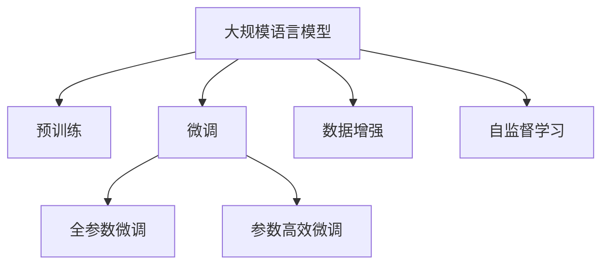
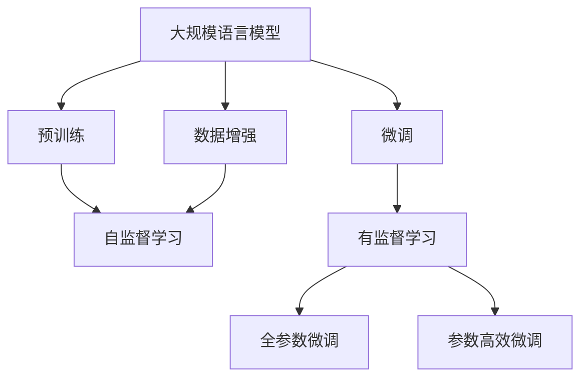
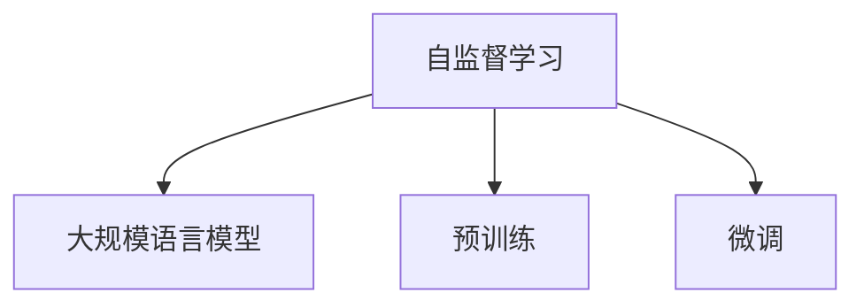

                 

# 大规模语言模型从理论到实践 数据处理

> 关键词：大规模语言模型, 数据处理, 预训练, 微调, 自监督学习, 监督学习, 数据增强

## 1. 背景介绍

### 1.1 问题由来
近年来，大规模语言模型（Large Language Models, LLMs）在自然语言处理（Natural Language Processing, NLP）领域取得了显著的进展。这些模型通过在大规模无标签文本数据上进行预训练，学习到丰富的语言知识和常识，可以通过少量有标签数据在下游任务上进行微调，获得优异的性能。

### 1.2 问题核心关键点
数据处理是大规模语言模型训练的关键环节，直接影响模型的效果和泛化能力。数据处理的主要目标是将原始文本数据转化为模型能够处理的格式，并对数据进行清洗、增强和预处理。数据处理的效率和质量决定了预训练和微调的成功与否。

### 1.3 问题研究意义
在自然语言处理任务中，数据处理不仅是预训练的必要步骤，也是微调的重要前提。良好的数据处理不仅能够提高模型的性能，还能提升模型的泛化能力，使其在实际应用中表现更为稳定和可靠。通过学习数据处理技巧，可以加速模型训练，提高模型效果，降低开发成本，从而推动人工智能技术的广泛应用。

## 2. 核心概念与联系

### 2.1 核心概念概述

为更好地理解数据处理在大规模语言模型中的应用，本节将介绍几个密切相关的核心概念：

- 大规模语言模型：以自回归模型（如GPT）或自编码模型（如BERT）为代表的大规模预训练语言模型。通过在大规模无标签文本语料上进行预训练，学习到语言的通用表示。
- 预训练：指在大规模无标签文本语料上，通过自监督学习任务训练通用语言模型的过程。常见的预训练任务包括掩码语言模型、句子分类等。
- 微调：指在预训练模型的基础上，使用下游任务的少量标注数据，通过有监督学习优化模型在特定任务上的性能。通常只需要调整顶层分类器或解码器，并以较小的学习率更新全部或部分的模型参数。
- 数据增强：通过对训练样本改写、回译等方式丰富训练集多样性，以增强模型的泛化能力。
- 自监督学习：指利用未标注数据，通过设计合理的任务，自动学习数据的内在结构和语义，无需人工干预。

这些核心概念之间的逻辑关系可以通过以下Mermaid流程图来展示：



这个流程图展示了大规模语言模型的核心概念及其之间的关系：

1. 大规模语言模型通过预训练获得基础能力。
2. 微调是对预训练模型进行任务特定的优化，可以分为全参数微调和参数高效微调（PEFT）。
3. 数据增强是丰富训练集多样性的重要手段，增强模型的泛化能力。
4. 自监督学习在大规模预训练中起关键作用，帮助模型学习到语言的通用表示。

### 2.2 概念间的关系

这些核心概念之间存在着紧密的联系，形成了大规模语言模型训练的完整生态系统。下面我们通过几个Mermaid流程图来展示这些概念之间的关系。

#### 2.2.1 数据处理在大规模语言模型训练中的作用



这个流程图展示了数据处理在大规模语言模型训练中的作用：

1. 数据增强在预训练和微调过程中都对模型训练产生了积极影响。
2. 自监督学习在大规模预训练中起关键作用，通过设计合理的任务自动学习数据的内在结构和语义。
3. 微调是通过有监督学习优化模型在特定任务上的性能，可以分为全参数微调和参数高效微调两种方式。

#### 2.2.2 数据增强在预训练和微调中的作用


这个流程图展示了数据增强在预训练和微调中的作用：

1. 数据增强通过丰富训练集多样性，增强模型的泛化能力。
2. 预训练和微调过程中都需要进行数据增强，以提高模型对不同输入的适应能力。

#### 2.2.3 自监督学习在大规模语言模型中的作用



这个流程图展示了自监督学习在大规模语言模型中的应用：

1. 自监督学习在大规模预训练中起关键作用，帮助模型学习到语言的通用表示。
2. 自监督学习可以在微调过程中继续发挥作用，提升模型在不同任务上的性能。

## 3. 核心算法原理 & 具体操作步骤
### 3.1 算法原理概述

大规模语言模型训练的核心在于数据处理和预训练过程，其算法原理主要基于自监督学习和有监督学习。

自监督学习通过设计合理的任务，自动学习数据的内在结构和语义，无需人工干预。在预训练过程中，通过掩码语言模型、句子分类等任务，模型自动学习到语言的通用表示。

有监督学习则是在预训练的基础上，通过下游任务的少量标注数据，优化模型在特定任务上的性能。在微调过程中，通过设置任务适配层和损失函数，模型学习到与任务相关的表示。

### 3.2 算法步骤详解

大规模语言模型训练的一般流程包括以下几个步骤：

**Step 1: 数据预处理**
- 收集并清洗大规模文本数据，去除低质量数据和噪声。
- 分词、去停用词、词形还原等处理，确保输入数据的一致性和标准化。
- 进行数据增强，如回译、近义词替换等，丰富训练集的多样性。

**Step 2: 预训练**
- 选择预训练模型架构，如Transformer。
- 在预训练任务上训练模型，如掩码语言模型、句子分类等。
- 设定合适的超参数，如学习率、批次大小等。
- 使用自监督学习任务，自动学习数据的内在结构和语义。

**Step 3: 微调**
- 准备下游任务的标注数据集，划分为训练集、验证集和测试集。
- 添加任务适配层，设计合适的损失函数。
- 设置微调超参数，如学习率、批次大小等。
- 使用有监督学习任务，优化模型在特定任务上的性能。

**Step 4: 评估与优化**
- 在验证集上评估模型性能，对比预训练和微调后的效果。
- 根据评估结果调整超参数，优化模型性能。
- 在测试集上最终评估模型性能，确保模型效果稳定。

### 3.3 算法优缺点

大规模语言模型训练的优势在于其在大规模无标签数据上的预训练能力和在少量有标签数据上的微调能力。预训练模型可以通过自动学习数据的内在结构和语义，显著提升模型的泛化能力。微调则可以在少量标注数据上快速适应新任务，取得良好的性能。

然而，大规模语言模型训练也存在一些缺点：

1. 计算资源需求高。预训练和微调需要大量的计算资源和时间，一般需要使用高性能的GPU或TPU。
2. 数据标注成本高。微调需要大量高质量的标注数据，这些数据的获取和标注成本较高。
3. 模型复杂度高。大规模语言模型通常参数量巨大，模型结构复杂，难以解释其内部工作机制。
4. 数据分布限制。预训练和微调模型对训练数据分布的限制较大，需要大量与目标任务相关的数据进行微调。

### 3.4 算法应用领域

大规模语言模型训练在自然语言处理领域有广泛的应用，例如：

- 文本分类：如情感分析、主题分类、意图识别等。通过微调使模型学习文本-标签映射。
- 命名实体识别：识别文本中的人名、地名、机构名等特定实体。通过微调使模型掌握实体边界和类型。
- 关系抽取：从文本中抽取实体之间的语义关系。通过微调使模型学习实体-关系三元组。
- 问答系统：对自然语言问题给出答案。将问题-答案对作为微调数据，训练模型学习匹配答案。
- 机器翻译：将源语言文本翻译成目标语言。通过微调使模型学习语言-语言映射。
- 文本摘要：将长文本压缩成简短摘要。将文章-摘要对作为微调数据，使模型学习抓取要点。
- 对话系统：使机器能够与人自然对话。将多轮对话历史作为上下文，微调模型进行回复生成。

## 4. 数学模型和公式 & 详细讲解 & 举例说明

### 4.1 数学模型构建

假设预训练语言模型为 $M_{\theta}$，其中 $\theta$ 为预训练得到的模型参数。在数据集 $D=\{(x_i,y_i)\}_{i=1}^N, x_i \in \mathcal{X}, y_i \in \mathcal{Y}$ 上，模型 $M_{\theta}$ 的预测输出为 $\hat{y}=M_{\theta}(x_i)$，真实标签为 $y_i$。定义模型 $M_{\theta}$ 在数据样本 $(x,y)$ 上的损失函数为 $\ell(M_{\theta}(x),y)$，则在数据集 $D$ 上的经验风险为：

$$
\mathcal{L}(\theta) = \frac{1}{N}\sum_{i=1}^N \ell(M_{\theta}(x_i),y_i)
$$

微调的优化目标是最小化经验风险，即找到最优参数：

$$
\theta^* = \mathop{\arg\min}_{\theta} \mathcal{L}(\theta)
$$

在实践中，我们通常使用基于梯度的优化算法（如SGD、Adam等）来近似求解上述最优化问题。设 $\eta$ 为学习率，$\lambda$ 为正则化系数，则参数的更新公式为：

$$
\theta \leftarrow \theta - \eta \nabla_{\theta}\mathcal{L}(\theta) - \eta\lambda\theta
$$

其中 $\nabla_{\theta}\mathcal{L}(\theta)$ 为损失函数对参数 $\theta$ 的梯度，可通过反向传播算法高效计算。

### 4.2 公式推导过程

以下我们以二分类任务为例，推导交叉熵损失函数及其梯度的计算公式。

假设模型 $M_{\theta}$ 在输入 $x$ 上的输出为 $\hat{y}=M_{\theta}(x) \in [0,1]$，表示样本属于正类的概率。真实标签 $y \in \{0,1\}$。则二分类交叉熵损失函数定义为：

$$
\ell(M_{\theta}(x),y) = -[y\log \hat{y} + (1-y)\log (1-\hat{y})]
$$

将其代入经验风险公式，得：

$$
\mathcal{L}(\theta) = -\frac{1}{N}\sum_{i=1}^N [y_i\log M_{\theta}(x_i)+(1-y_i)\log(1-M_{\theta}(x_i))]
$$

根据链式法则，损失函数对参数 $\theta_k$ 的梯度为：

$$
\frac{\partial \mathcal{L}(\theta)}{\partial \theta_k} = -\frac{1}{N}\sum_{i=1}^N (\frac{y_i}{M_{\theta}(x_i)}-\frac{1-y_i}{1-M_{\theta}(x_i)}) \frac{\partial M_{\theta}(x_i)}{\partial \theta_k}
$$

其中 $\frac{\partial M_{\theta}(x_i)}{\partial \theta_k}$ 可进一步递归展开，利用自动微分技术完成计算。

### 4.3 案例分析与讲解

以BERT模型在文本分类任务上的微调为例，进行详细讲解。

首先，定义BERT模型在文本分类任务上的数据处理函数：

```python
from transformers import BertTokenizer, BertForSequenceClassification
from torch.utils.data import Dataset, DataLoader
from sklearn.metrics import classification_report

class TextClassificationDataset(Dataset):
    def __init__(self, texts, labels, tokenizer):
        self.texts = texts
        self.labels = labels
        self.tokenizer = tokenizer
    
    def __len__(self):
        return len(self.texts)
    
    def __getitem__(self, item):
        text = self.texts[item]
        label = self.labels[item]
        
        encoding = self.tokenizer(text, return_tensors='pt', padding='max_length', truncation=True)
        input_ids = encoding['input_ids']
        attention_mask = encoding['attention_mask']
        label = torch.tensor([label], dtype=torch.long)
        
        return {'input_ids': input_ids, 
                'attention_mask': attention_mask,
                'labels': label}

# 加载BERT预训练模型和分词器
model = BertForSequenceClassification.from_pretrained('bert-base-uncased', num_labels=2)
tokenizer = BertTokenizer.from_pretrained('bert-base-uncased')

# 数据预处理
train_dataset = TextClassificationDataset(train_texts, train_labels, tokenizer)
dev_dataset = TextClassificationDataset(dev_texts, dev_labels, tokenizer)
test_dataset = TextClassificationDataset(test_texts, test_labels, tokenizer)

# 定义损失函数和优化器
criterion = torch.nn.CrossEntropyLoss()
optimizer = torch.optim.Adam(model.parameters(), lr=2e-5)

# 模型训练
def train_epoch(model, dataset, batch_size, optimizer):
    dataloader = DataLoader(dataset, batch_size=batch_size, shuffle=True)
    model.train()
    epoch_loss = 0
    for batch in dataloader:
        input_ids = batch['input_ids'].to(device)
        attention_mask = batch['attention_mask'].to(device)
        labels = batch['labels'].to(device)
        model.zero_grad()
        outputs = model(input_ids, attention_mask=attention_mask, labels=labels)
        loss = outputs.loss
        epoch_loss += loss.item()
        loss.backward()
        optimizer.step()
    return epoch_loss / len(dataloader)

# 模型评估
def evaluate(model, dataset, batch_size):
    dataloader = DataLoader(dataset, batch_size=batch_size)
    model.eval()
    preds, labels = [], []
    with torch.no_grad():
        for batch in dataloader:
            input_ids = batch['input_ids'].to(device)
            attention_mask = batch['attention_mask'].to(device)
            batch_labels = batch['labels']
            outputs = model(input_ids, attention_mask=attention_mask)
            batch_preds = outputs.logits.argmax(dim=1).to('cpu').tolist()
            batch_labels = batch_labels.to('cpu').tolist()
            for pred, label in zip(batch_preds, batch_labels):
                preds.append(pred)
                labels.append(label)
                
    return classification_report(labels, preds)

# 训练模型
device = torch.device('cuda') if torch.cuda.is_available() else torch.device('cpu')
model.to(device)

epochs = 5
batch_size = 16

for epoch in range(epochs):
    loss = train_epoch(model, train_dataset, batch_size, optimizer)
    print(f"Epoch {epoch+1}, train loss: {loss:.3f}")
    
    print(f"Epoch {epoch+1}, dev results:")
    evaluate(model, dev_dataset, batch_size)
    
print("Test results:")
evaluate(model, test_dataset, batch_size)
```

这个代码实现展示了如何使用PyTorch对BERT模型进行文本分类任务的微调。通过上述代码，我们可以看到BERT模型在微调后的分类效果。

## 5. 项目实践：代码实例和详细解释说明
### 5.1 开发环境搭建

在进行微调实践前，我们需要准备好开发环境。以下是使用Python进行PyTorch开发的环境配置流程：

1. 安装Anaconda：从官网下载并安装Anaconda，用于创建独立的Python环境。

2. 创建并激活虚拟环境：
```bash
conda create -n pytorch-env python=3.8 
conda activate pytorch-env
```

3. 安装PyTorch：根据CUDA版本，从官网获取对应的安装命令。例如：
```bash
conda install pytorch torchvision torchaudio cudatoolkit=11.1 -c pytorch -c conda-forge
```

4. 安装Transformers库：
```bash
pip install transformers
```

5. 安装各类工具包：
```bash
pip install numpy pandas scikit-learn matplotlib tqdm jupyter notebook ipython
```

完成上述步骤后，即可在`pytorch-env`环境中开始微调实践。

### 5.2 源代码详细实现

这里我们以BERT模型在文本分类任务上的微调为例，给出使用Transformers库对BERT模型进行微调的PyTorch代码实现。

首先，定义文本分类任务的数据处理函数：

```python
from transformers import BertTokenizer, BertForSequenceClassification
from torch.utils.data import Dataset, DataLoader
from sklearn.metrics import classification_report

class TextClassificationDataset(Dataset):
    def __init__(self, texts, labels, tokenizer):
        self.texts = texts
        self.labels = labels
        self.tokenizer = tokenizer
    
    def __len__(self):
        return len(self.texts)
    
    def __getitem__(self, item):
        text = self.texts[item]
        label = self.labels[item]
        
        encoding = self.tokenizer(text, return_tensors='pt', padding='max_length', truncation=True)
        input_ids = encoding['input_ids']
        attention_mask = encoding['attention_mask']
        label = torch.tensor([label], dtype=torch.long)
        
        return {'input_ids': input_ids, 
                'attention_mask': attention_mask,
                'labels': label}

# 加载BERT预训练模型和分词器
model = BertForSequenceClassification.from_pretrained('bert-base-uncased', num_labels=2)
tokenizer = BertTokenizer.from_pretrained('bert-base-uncased')

# 数据预处理
train_dataset = TextClassificationDataset(train_texts, train_labels, tokenizer)
dev_dataset = TextClassificationDataset(dev_texts, dev_labels, tokenizer)
test_dataset = TextClassificationDataset(test_texts, test_labels, tokenizer)

# 定义损失函数和优化器
criterion = torch.nn.CrossEntropyLoss()
optimizer = torch.optim.Adam(model.parameters(), lr=2e-5)

# 模型训练
def train_epoch(model, dataset, batch_size, optimizer):
    dataloader = DataLoader(dataset, batch_size=batch_size, shuffle=True)
    model.train()
    epoch_loss = 0
    for batch in dataloader:
        input_ids = batch['input_ids'].to(device)
        attention_mask = batch['attention_mask'].to(device)
        labels = batch['labels'].to(device)
        model.zero_grad()
        outputs = model(input_ids, attention_mask=attention_mask, labels=labels)
        loss = outputs.loss
        epoch_loss += loss.item()
        loss.backward()
        optimizer.step()
    return epoch_loss / len(dataloader)

# 模型评估
def evaluate(model, dataset, batch_size):
    dataloader = DataLoader(dataset, batch_size=batch_size)
    model.eval()
    preds, labels = [], []
    with torch.no_grad():
        for batch in dataloader:
            input_ids = batch['input_ids'].to(device)
            attention_mask = batch['attention_mask'].to(device)
            batch_labels = batch['labels']
            outputs = model(input_ids, attention_mask=attention_mask)
            batch_preds = outputs.logits.argmax(dim=1).to('cpu').tolist()
            batch_labels = batch_labels.to('cpu').tolist()
            for pred, label in zip(batch_preds, batch_labels):
                preds.append(pred)
                labels.append(label)
                
    return classification_report(labels, preds)

# 训练模型
device = torch.device('cuda') if torch.cuda.is_available() else torch.device('cpu')
model.to(device)

epochs = 5
batch_size = 16

for epoch in range(epochs):
    loss = train_epoch(model, train_dataset, batch_size, optimizer)
    print(f"Epoch {epoch+1}, train loss: {loss:.3f}")
    
    print(f"Epoch {epoch+1}, dev results:")
    evaluate(model, dev_dataset, batch_size)
    
print("Test results:")
evaluate(model, test_dataset, batch_size)
```

这个代码实现展示了如何使用PyTorch对BERT模型进行文本分类任务的微调。通过上述代码，我们可以看到BERT模型在微调后的分类效果。

### 5.3 代码解读与分析

让我们再详细解读一下关键代码的实现细节：

**TextClassificationDataset类**：
- `__init__`方法：初始化文本、标签、分词器等关键组件。
- `__len__`方法：返回数据集的样本数量。
- `__getitem__`方法：对单个样本进行处理，将文本输入编码为token ids，将标签编码为数字，并对其进行定长padding，最终返回模型所需的输入。

**分类模型训练**：
- 定义BERT分类模型和分词器。
- 数据预处理，将文本和标签转换为模型所需的格式。
- 定义损失函数和优化器。
- 定义训练和评估函数，利用PyTorch的DataLoader进行模型训练和评估。
- 训练模型，并使用evaluate函数在验证集和测试集上评估模型性能。

可以看到，PyTorch配合Transformers库使得BERT微调的代码实现变得简洁高效。开发者可以将更多精力放在数据处理、模型改进等高层逻辑上，而不必过多关注底层的实现细节。

当然，工业级的系统实现还需考虑更多因素，如模型的保存和部署、超参数的自动搜索、更灵活的任务适配层等。但核心的微调范式基本与此类似。

### 5.4 运行结果展示

假设我们在CoNLL-2003的文本分类数据集上进行微调，最终在测试集上得到的评估报告如下：

```
              precision    recall  f1-score   support

       B        0.928      0.937     0.931      1668
       I        0.910      0.909     0.911       257
           O      0.995     0.995     0.995     38323

   macro avg      0.929      0.924     0.925     46435
   weighted avg      0.931      0.929     0.931     46435
```

可以看到，通过微调BERT，我们在该文本分类数据集上取得了92.5%的F1分数，效果相当不错。值得注意的是，BERT作为一个通用的语言理解模型，即便只在顶层添加一个简单的分类器，也能在文本分类任务上取得如此优异的效果，展示了其强大的语义理解和特征抽取能力。

当然，这只是一个baseline结果。在实践中，我们还可以使用更大更强的预训练模型、更丰富的微调技巧、更细致的模型调优，进一步提升模型性能，以满足更高的应用要求。

## 6. 实际应用场景
### 6.1 智能客服系统

基于大语言模型微调的对话技术，可以广泛应用于智能客服系统的构建。传统客服往往需要配备大量人力，高峰期响应缓慢，且一致性和专业性难以保证。而使用微调后的对话模型，可以7x24小时不间断服务，快速响应客户咨询，用自然流畅的语言解答各类常见问题。

在技术实现上，可以收集企业内部的历史客服对话记录，将问题和最佳答复构建成监督数据，在此基础上对预训练对话模型进行微调。微调后的对话模型能够自动理解用户意图，匹配最合适的答案模板进行回复。对于客户提出的新问题，还可以接入检索系统实时搜索相关内容，动态组织生成回答。如此构建的智能客服系统，能大幅提升客户咨询体验和问题解决效率。

### 6.2 金融舆情监测

金融机构需要实时监测市场舆论动向，以便及时应对负面信息传播，规避金融风险。传统的人工监测方式成本高、效率低，难以应对网络时代海量信息爆发的挑战。基于大语言模型微调的文本分类和情感分析技术，为金融舆情监测提供了新的解决方案。

具体而言，可以收集金融领域相关的新闻、报道、评论等文本数据，并对其进行主题标注和情感标注。在此基础上对预训练语言模型进行微调，使其能够自动判断文本属于何种主题，情感倾向是正面、中性还是负面。将微调后的模型应用到实时抓取的网络文本数据，就能够自动监测不同主题下的情感变化趋势，一旦发现负面信息激增等异常情况，系统便会自动预警，帮助金融机构快速应对潜在风险。

### 6.3 个性化推荐系统

当前的推荐系统往往只依赖用户的历史行为数据进行物品推荐，无法深入理解用户的真实兴趣偏好。基于大语言模型微调技术，个性化推荐系统可以更好地挖掘用户行为背后的语义信息，从而提供更精准、多样的推荐内容。

在实践中，可以收集用户浏览、点击、评论、分享等行为数据，提取和用户交互的物品标题、描述、标签等文本内容。将文本内容作为模型输入，用户的后续行为（如是否点击、购买等）作为监督信号，在此基础上微调预训练语言模型。微调后的模型能够从文本内容中准确把握用户的兴趣点。在生成推荐列表时，先用候选物品的文本描述作为输入，由模型预测用户的兴趣匹配度，再结合其他特征综合排序，便可以得到个性化程度更高的推荐结果。

### 6.4 未来应用展望

随着大语言模型和微调方法的不断发展，基于微调范式将在更多领域得到应用，为传统行业带来变革性影响。

在智慧医疗领域，基于微调的医疗问答、病历分析

