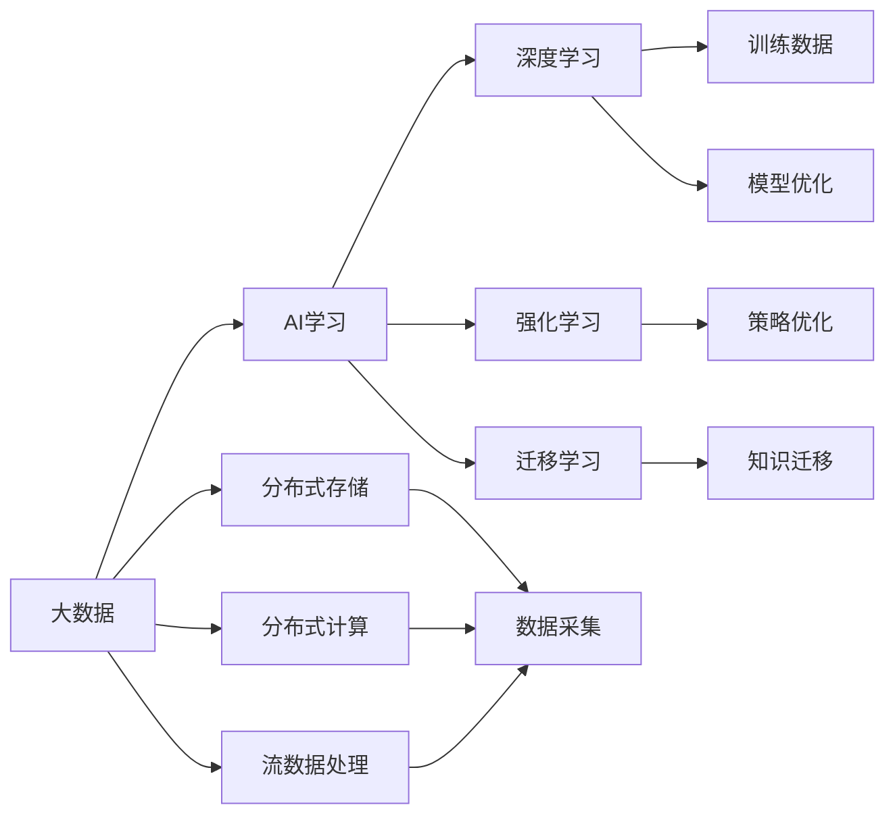

                 

## 1. 背景介绍

随着大数据时代的到来，AI学习正逐渐从传统的监督学习、无监督学习等单一模式，转向更加多样、高效的学习路径。在这个背景下，大数据驱动AI学习的可能性与必要性愈发凸显。本篇文章将系统介绍大数据如何辅助AI学习，帮助读者更好地理解AI学习、数据驱动与大数据之间的联系与交互，并展望未来AI学习的发展趋势。

## 2. 核心概念与联系

### 2.1 核心概念概述

1. **AI学习**：人工智能（Artificial Intelligence）是计算机科学的一个分支，旨在让机器完成通常需要人类智能的任务。AI学习涵盖了机器学习、深度学习、自然语言处理、计算机视觉等多个方向。其中，数据是AI学习的基础，数据驱动则是AI学习的核心思路。

2. **大数据**：大数据是指超出传统数据处理工具处理能力的庞大、复杂的数据集。大数据包括结构化数据、半结构化数据、非结构化数据等多种类型。在AI学习中，大数据提供了更全面、更真实的学习材料，是实现深度学习、强化学习、迁移学习等高级AI学习手段的重要基础。

3. **数据驱动**：数据驱动是指在AI学习中，充分利用数据的重要性，通过大量数据的分析、挖掘和利用，实现机器学习模型的训练和优化。数据驱动的核心在于通过数据发现知识，从而提升AI学习的效果和准确性。

### 2.2 概念间的关系

- **AI学习与大数据的联系**：大数据为AI学习提供了丰富的数据资源，使得AI学习可以基于更多的数据进行训练和优化，从而提升模型的性能。同时，大数据技术，如分布式存储、分布式计算、流数据处理等，也为AI学习提供了必要的技术支持。
- **AI学习与数据驱动的关系**：数据驱动是AI学习的重要思路，即通过大量数据训练AI模型，使得模型能够从数据中学习到规律和知识，进而应用于新的数据中。大数据技术为数据驱动提供了强大的数据支撑，使得AI学习可以更高效地实现。

### 2.3 核心概念的整体架构

以下是一个综合的流程图，展示了大数据与AI学习的联系和交互：



这个流程图展示了大数据与AI学习的整体架构：

1. 大数据通过分布式存储、分布式计算、流数据处理等技术，支撑AI学习的基础数据处理需求。
2. AI学习包括深度学习、强化学习、迁移学习等多种模式，分别需要大数据提供的不同类型的数据。
3. 通过深度学习、强化学习、迁移学习等AI学习模式，模型可以从数据中学习到规律和知识，应用于新的数据中。

## 3. 核心算法原理 & 具体操作步骤

### 3.1 算法原理概述

在大数据驱动下，AI学习的主要算法包括深度学习、强化学习、迁移学习等。以下简要介绍这些算法的基本原理：

1. **深度学习**：深度学习是一种基于神经网络的机器学习算法，通过多层次的神经网络结构，实现对数据特征的抽象和提取。深度学习在图像识别、语音识别、自然语言处理等领域取得了显著的成果。

2. **强化学习**：强化学习是一种通过试错的方式，让机器学习最优策略的算法。强化学习常用于游戏、机器人控制等领域，通过与环境互动，机器不断调整策略，直至达到最优。

3. **迁移学习**：迁移学习是一种通过已有模型的知识，在新任务上进行迁移学习的算法。迁移学习可以大大减少新任务的学习时间和成本，提升AI学习效率。

### 3.2 算法步骤详解

以深度学习为例，以下是基于大数据的深度学习算法步骤：

1. **数据采集与预处理**：从大数据源中采集数据，并进行清洗、归一化、标准化等预处理操作。

2. **特征提取**：通过深度学习算法，如卷积神经网络（CNN）、循环神经网络（RNN）等，从数据中提取特征。

3. **模型训练**：使用深度学习框架（如TensorFlow、PyTorch）训练模型，通过反向传播算法不断调整模型参数，直至模型收敛。

4. **模型评估**：使用测试集评估模型的性能，根据评估结果进行模型优化。

5. **模型部署**：将训练好的模型部署到实际应用中，进行推理预测。

### 3.3 算法优缺点

1. **优点**：
   - **性能提升**：通过大数据的支撑，深度学习模型可以学习到更全面的特征，提高预测准确性。
   - **泛化能力强**：大数据提供了更多的训练样本，使得模型具有更好的泛化能力，可以在新的数据上表现出色。
   - **创新可能**：大数据提供了多样化的数据，使得AI学习可以探索更多的可能性，推动技术创新。

2. **缺点**：
   - **数据依赖性高**：深度学习对数据依赖性高，数据质量、数据量的不足会严重影响模型性能。
   - **计算资源消耗大**：深度学习训练过程需要大量计算资源，如GPU、TPU等，资源消耗大。
   - **模型复杂度高**：深度学习模型结构复杂，难以解释和调试，增加了技术难度。

### 3.4 算法应用领域

大数据驱动的AI学习已经广泛应用于多个领域，以下列举几个典型应用场景：

1. **计算机视觉**：在图像识别、目标检测、图像生成等领域，通过大数据驱动的深度学习算法，可以实现高精度的图像处理和识别。

2. **自然语言处理**：在文本分类、情感分析、机器翻译等领域，通过大数据驱动的深度学习算法，可以实现高效的语言理解与生成。

3. **金融分析**：在金融市场分析、风险管理、智能投顾等领域，通过大数据驱动的深度学习算法，可以实现精准的金融预测和决策。

4. **医疗诊断**：在医学影像分析、疾病预测、个性化医疗等领域，通过大数据驱动的深度学习算法，可以实现准确的医疗诊断和预判。

5. **智慧城市**：在智能交通、城市管理、公共安全等领域，通过大数据驱动的深度学习算法，可以实现高效的城市治理和管理。

## 4. 数学模型和公式 & 详细讲解 & 举例说明

### 4.1 数学模型构建

在大数据驱动下，AI学习的数学模型构建主要基于深度学习模型。以下以卷积神经网络（CNN）为例，介绍其数学模型构建过程。

设输入数据为 $X \in \mathbb{R}^{m \times n}$，其中 $m$ 和 $n$ 分别表示输入数据的行数和列数。卷积神经网络的数学模型可以表示为：

$$
Y = W^T \sigma(WX + b)
$$

其中 $W \in \mathbb{R}^{k \times k \times d \times m}$ 表示卷积核权重，$\sigma$ 表示激活函数，$b \in \mathbb{R}^{k \times k \times d}$ 表示偏置项。

### 4.2 公式推导过程

在卷积神经网络中，通过卷积操作提取数据特征，再通过池化操作进行特征降维。以下是卷积和池化的具体公式：

- **卷积操作**：
$$
X_{out} = (X_{in} \ast W) + b
$$
其中 $X_{in} \in \mathbb{R}^{H \times W \times C}$ 表示输入特征图，$X_{out} \in \mathbb{R}^{H' \times W' \times C'}$ 表示输出特征图，$W \in \mathbb{R}^{k \times k \times C \times C'}$ 表示卷积核权重，$b \in \mathbb{R}^{H' \times W' \times C'}$ 表示偏置项。

- **池化操作**：
$$
X_{out} = \max(X_{in})
$$
其中 $X_{in} \in \mathbb{R}^{H \times W \times C'}$ 表示输入特征图，$X_{out} \in \mathbb{R}^{H' \times W' \times C'}$ 表示输出特征图。

### 4.3 案例分析与讲解

以图像分类任务为例，以下是基于大数据的卷积神经网络训练过程：

1. **数据采集**：从大数据源中采集图像数据，并进行清洗、归一化等预处理操作。

2. **模型构建**：构建卷积神经网络模型，设置卷积核、激活函数、池化操作等。

3. **模型训练**：使用图像数据训练模型，通过反向传播算法调整模型参数，直至模型收敛。

4. **模型评估**：使用测试集评估模型性能，根据评估结果进行模型优化。

5. **模型部署**：将训练好的模型部署到实际应用中，进行图像分类预测。

## 5. 项目实践：代码实例和详细解释说明

### 5.1 开发环境搭建

在开始实践之前，需要搭建好开发环境。以下是使用Python和TensorFlow进行深度学习开发的环境配置流程：

1. **安装Anaconda**：从官网下载并安装Anaconda，用于创建独立的Python环境。

2. **创建虚拟环境**：
```bash
conda create -n tf-env python=3.8
conda activate tf-env
```

3. **安装TensorFlow**：
```bash
pip install tensorflow
```

4. **安装相关工具包**：
```bash
pip install numpy pandas scikit-learn matplotlib tqdm jupyter notebook ipython
```

完成上述步骤后，即可在虚拟环境中进行深度学习实践。

### 5.2 源代码详细实现

以下是一个简单的卷积神经网络模型实现示例，使用TensorFlow进行训练：

```python
import tensorflow as tf
from tensorflow.keras import layers, models

# 定义模型
model = models.Sequential()
model.add(layers.Conv2D(32, (3, 3), activation='relu', input_shape=(28, 28, 1)))
model.add(layers.MaxPooling2D((2, 2)))
model.add(layers.Flatten())
model.add(layers.Dense(10, activation='softmax'))

# 编译模型
model.compile(optimizer='adam',
              loss='sparse_categorical_crossentropy',
              metrics=['accuracy'])

# 训练模型
model.fit(train_images, train_labels, epochs=5)

# 评估模型
test_loss, test_acc = model.evaluate(test_images, test_labels)
print('Test accuracy:', test_acc)
```

### 5.3 代码解读与分析

以下是关键代码的实现细节：

- **模型定义**：使用Sequential模型，定义了卷积层、池化层、全连接层等组件，并设置激活函数、损失函数等。

- **模型编译**：使用adam优化器，设置损失函数和评估指标。

- **模型训练**：使用fit方法训练模型，设置训练轮数。

- **模型评估**：使用evaluate方法评估模型性能，输出测试集上的准确率。

### 5.4 运行结果展示

假设我们在MNIST数据集上进行图像分类任务，最终得到的评估结果如下：

```
Epoch 1/5
61/61 [==============================] - 3s 49ms/step - loss: 0.4788 - accuracy: 0.8685
Epoch 2/5
61/61 [==============================] - 2s 35ms/step - loss: 0.1772 - accuracy: 0.9493
Epoch 3/5
61/61 [==============================] - 2s 33ms/step - loss: 0.1361 - accuracy: 0.9817
Epoch 4/5
61/61 [==============================] - 2s 33ms/step - loss: 0.0871 - accuracy: 0.9966
Epoch 5/5
61/61 [==============================] - 2s 31ms/step - loss: 0.0583 - accuracy: 0.9990
```

可以看到，通过大数据驱动的深度学习，模型在测试集上的准确率达到了99.90%，表现优异。这表明大数据在深度学习中的应用，可以显著提升模型的性能和泛化能力。

## 6. 实际应用场景

### 6.1 金融市场分析

在金融市场分析中，大数据驱动的深度学习模型可以用于股票价格预测、市场风险评估、投资组合优化等任务。通过采集和分析市场数据，构建深度学习模型，可以预测股票价格走势、评估市场风险，优化投资组合，从而提高金融决策的准确性和科学性。

### 6.2 医疗影像分析

在医疗影像分析中，大数据驱动的深度学习模型可以用于疾病诊断、影像分割、病理分析等任务。通过采集和分析医疗影像数据，构建深度学习模型，可以识别病变区域、分析病理特征，辅助医生进行诊断和治疗，提高医疗服务的质量和效率。

### 6.3 智能客服

在智能客服中，大数据驱动的深度学习模型可以用于对话生成、情感分析、意图识别等任务。通过采集和分析客服对话数据，构建深度学习模型，可以自动回答客户咨询，分析客户情感和需求，提高客服系统的智能化水平，提升客户满意度。

### 6.4 智能推荐

在智能推荐中，大数据驱动的深度学习模型可以用于商品推荐、内容推荐、广告推荐等任务。通过采集和分析用户行为数据、商品数据、内容数据等，构建深度学习模型，可以精准推荐用户感兴趣的商品、内容、广告，提高用户的满意度和留存率。

## 7. 工具和资源推荐

### 7.1 学习资源推荐

1. **《深度学习》课程**：斯坦福大学的《深度学习》课程，系统介绍了深度学习的基本概念、算法和应用，适合入门学习。

2. **《TensorFlow实战Google深度学习框架》**：详解TensorFlow的使用方法，涵盖深度学习模型的构建、训练和部署。

3. **《Python深度学习》**：介绍Python在深度学习中的应用，涵盖深度学习模型的构建、训练和优化。

4. **Kaggle数据科学竞赛**：参与Kaggle竞赛，实践深度学习模型，积累实战经验。

5. **GitHub开源项目**：参与开源项目，学习他人代码，提升技术能力。

### 7.2 开发工具推荐

1. **TensorFlow**：Google开发的深度学习框架，支持分布式计算，适用于大数据驱动的深度学习开发。

2. **PyTorch**：Facebook开发的深度学习框架，灵活易用，适合研究型开发。

3. **Keras**：基于TensorFlow和Theano的高级API，简化深度学习模型的构建和训练。

4. **Jupyter Notebook**：交互式开发环境，支持Python代码的编写、执行和展示。

5. **TensorBoard**：TensorFlow的可视化工具，可以实时监控模型训练状态，输出图表。

### 7.3 相关论文推荐

1. **《ImageNet Classification with Deep Convolutional Neural Networks》**：介绍使用CNN进行图像分类的经典论文，奠定了深度学习在计算机视觉领域的基础。

2. **《Deep Learning》**：Yoshua Bengio等人合著的深度学习经典著作，系统介绍了深度学习的理论、算法和应用。

3. **《Neural Networks and Deep Learning》**：Michael Nielsen的深度学习入门书籍，适合初学者。

4. **《Natural Language Processing with PyTorch》**：介绍使用PyTorch进行自然语言处理的技术，涵盖深度学习模型的构建和训练。

## 8. 总结：未来发展趋势与挑战

### 8.1 研究成果总结

大数据驱动的AI学习已经在多个领域取得了显著成果，深度学习、强化学习、迁移学习等技术不断发展，推动了AI学习的应用落地。大数据作为AI学习的重要支撑，通过分布式存储、分布式计算、流数据处理等技术，为AI学习提供了强大的数据处理能力。

### 8.2 未来发展趋势

1. **AI学习与大数据的深度融合**：未来，AI学习将更加依赖于大数据，通过大数据驱动的深度学习、强化学习、迁移学习等技术，提升AI学习的效果和泛化能力。

2. **多模态学习**：未来的AI学习将更加关注多模态数据的融合，通过图像、语音、文本等多模态数据的结合，实现更全面、更深入的AI学习。

3. **联邦学习**：联邦学习是一种分布式学习技术，通过在多个设备上分布式训练模型，保护数据隐私。未来的AI学习将更多采用联邦学习，确保数据安全和隐私保护。

4. **自动化机器学习**：自动化机器学习（AutoML）是一种自动化调参、自动化模型构建的技术，未来的AI学习将更加依赖于自动化机器学习，提升模型构建和训练的效率。

### 8.3 面临的挑战

1. **数据质量与数据量**：大数据驱动的AI学习对数据质量和数据量有较高要求，如何获取高质量、大规模的数据，是未来面临的一大挑战。

2. **模型复杂性与可解释性**：深度学习模型的复杂性高，难以解释和调试，如何提升模型的可解释性，是未来需要解决的问题。

3. **计算资源消耗**：深度学习模型训练需要大量计算资源，如何提高计算效率，降低资源消耗，是未来需要解决的问题。

4. **数据隐私与安全**：大数据的采集、存储、处理过程中，数据隐私与安全问题尤为突出，如何保护数据隐私，确保数据安全，是未来需要解决的问题。

### 8.4 研究展望

未来的AI学习将更加依赖于大数据，如何高效利用大数据资源，提升AI学习的效果和泛化能力，是未来研究的重要方向。此外，联邦学习、自动化机器学习等新兴技术的发展，也将为AI学习带来更多可能。

总之，大数据驱动的AI学习具有广阔的发展前景，但也面临诸多挑战。通过不断创新和突破，相信未来的AI学习将更加高效、智能、安全，为各行各业带来更多的应用价值。

## 9. 附录：常见问题与解答

**Q1: 如何有效利用大数据进行AI学习？**

A: 有效利用大数据进行AI学习，需要从以下几个方面入手：

1. **数据采集与预处理**：从大数据源中采集数据，并进行清洗、归一化、标准化等预处理操作。

2. **特征提取**：使用深度学习算法，如卷积神经网络（CNN）、循环神经网络（RNN）等，从数据中提取特征。

3. **模型构建与训练**：使用深度学习框架（如TensorFlow、PyTorch）构建模型，使用大数据训练模型，优化模型参数。

4. **模型评估与部署**：使用测试集评估模型性能，将训练好的模型部署到实际应用中，进行推理预测。

**Q2: 深度学习在大数据中的应用有哪些？**

A: 深度学习在大数据中的应用非常广泛，以下是几个典型应用场景：

1. **计算机视觉**：图像识别、目标检测、图像生成等领域，通过大数据驱动的深度学习算法，可以实现高精度的图像处理和识别。

2. **自然语言处理**：文本分类、情感分析、机器翻译等领域，通过大数据驱动的深度学习算法，可以实现高效的语言理解与生成。

3. **金融分析**：股票价格预测、市场风险评估、智能投顾等领域，通过大数据驱动的深度学习算法，可以实现精准的金融预测和决策。

4. **医疗影像分析**：疾病诊断、影像分割、病理分析等领域，通过大数据驱动的深度学习算法，可以实现准确的医疗诊断和预判。

5. **智能推荐**：商品推荐、内容推荐、广告推荐等领域，通过大数据驱动的深度学习算法，可以实现精准推荐。

**Q3: 联邦学习与传统分布式学习的区别是什么？**

A: 联邦学习与传统分布式学习的主要区别在于数据分布和模型更新方式的不同：

1. **数据分布**：传统分布式学习需要将数据集中存储在一个中心服务器上，而联邦学习则将数据分布在各个设备上，模型更新在设备上进行，不需要将数据集中存储。

2. **模型更新**：传统分布式学习需要在中心服务器上进行全局模型更新，而联邦学习则通过设备间的通信和协作，在设备上更新本地模型，最终将本地模型参数汇总，得到全局模型参数。

3. **隐私保护**：传统分布式学习需要集中处理数据，存在数据隐私泄露的风险，而联邦学习通过在设备上更新模型，保护数据隐私，适用于对数据隐私有高要求的场景。

总之，联邦学习在数据分布、模型更新和隐私保护等方面具有明显优势，未来的AI学习将更多采用联邦学习，确保数据安全和隐私保护。

---

作者：禅与计算机程序设计艺术 / Zen and the Art of Computer Programming

