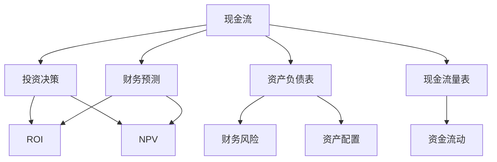
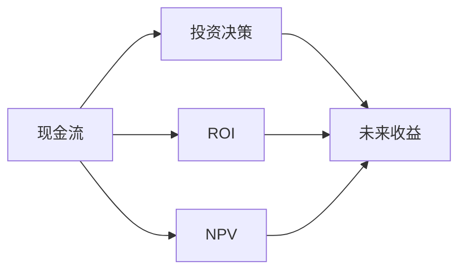
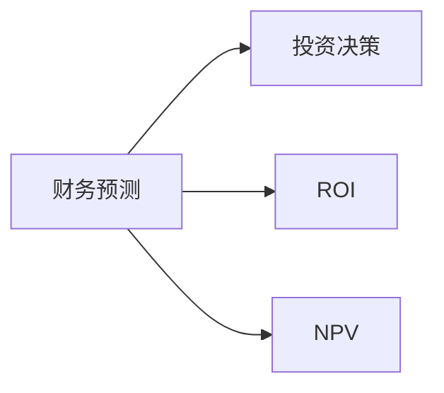
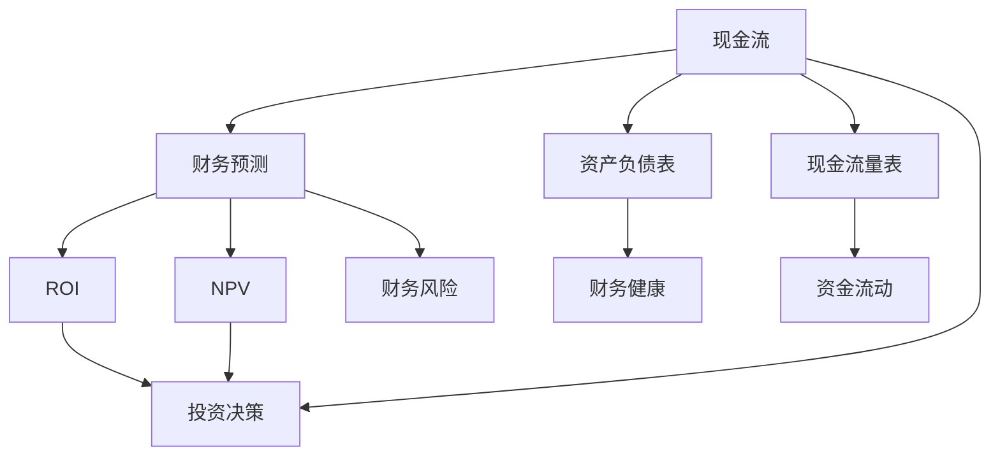

                 

## 1. 背景介绍

### 1.1 问题由来

在当前AI大模型时代，技术创业公司如雨后春笋般涌现。这些公司不仅面临技术创新的挑战，还要应对复杂的财务管理问题，尤其是现金流控制和投资决策。现金流管理是创业公司的命脉，关系到企业的生存与发展。投资决策则是决定企业未来方向和增长潜力的关键因素。

大模型带来的高成本、高风险特点，使得现金流和投资决策更加复杂。如何平衡技术投入与财务稳定，成为每个创业者必须面对的难题。本文聚焦于大模型时代下创业者的财务管理，特别是现金流控制与投资决策。

### 1.2 问题核心关键点

大模型时代创业者的财务管理问题核心在于：

1. **现金流管理**：如何确保资金链条的稳定，避免现金流断裂。
2. **投资决策**：如何在技术创新和业务拓展之间找到最佳平衡点，实现长期增长。

本文将围绕这两个关键点展开详细讨论，通过模型构建、案例分析、实践操作等环节，提供一套系统的方法论。

### 1.3 问题研究意义

掌握财务管理的方法论，对于大模型时代的创业者具有重要意义：

1. **生存与发展**：良好的现金流管理和投资决策是企业生存与发展的基石，避免现金流断裂和投资失误。
2. **成本与效益**：平衡技术投入与财务效益，确保每一笔资金投入都能带来合理的回报。
3. **长远规划**：通过科学的财务管理，确保企业在技术竞争中保持长远的战略优势。
4. **风险控制**：通过模型预测，及时识别和规避财务风险，确保企业的可持续发展。
5. **创新与稳定**：在追求技术创新的同时，保持财务稳定，实现企业动态平衡。

## 2. 核心概念与联系

### 2.1 核心概念概述

为更好地理解现金流控制与投资决策，本节将介绍几个密切相关的核心概念：

1. **现金流**：企业在一定时期内现金的流入和流出，是企业财务状况的重要指标。
2. **投资决策**：企业根据未来收益预期，对资源进行分配和利用的决策。
3. **财务预测**：通过建立数学模型，对企业未来的现金流和收益进行预测，辅助决策。
4. **资产负债表**：反映企业资产、负债和所有者权益的财务报表。
5. **现金流量表**：记录企业现金流入和流出的财务报表。
6. **投资回报率(ROI)**：投资收益与成本之比，衡量投资的效益。
7. **净现值(NPV)**：未来现金流的现值之和，用于评估投资项目的可行性。

这些概念之间的逻辑关系可以通过以下Mermaid流程图来展示：



这个流程图展示了大模型时代创业者财务管理的主要概念及其关系：

1. 现金流是企业财务状况的直观体现。
2. 投资决策基于财务预测，评估未来收益。
3. 财务预测包括资产负债表和现金流量表的数据分析。
4. ROI和NPV是投资决策的重要参考指标。
5. 财务风险和资产配置对现金流和投资决策有直接影响。

### 2.2 概念间的关系

这些核心概念之间存在着紧密的联系，形成了大模型时代创业者财务管理的完整框架。下面我们通过几个Mermaid流程图来展示这些概念之间的关系。

#### 2.2.1 现金流与投资决策



这个流程图展示了现金流与投资决策的基本逻辑：

1. 现金流直接反映企业的财务健康状况。
2. ROI和NPV用于评估投资项目的财务可行性。
3. 未来收益基于投资决策的预期。

#### 2.2.2 财务预测与投资决策



这个流程图展示了财务预测对投资决策的辅助作用：

1. 财务预测提供未来现金流和收益的预测数据。
2. ROI和NPV是财务预测结果的具体应用。
3. 投资决策在财务预测的基础上进行。

#### 2.2.3 ROI与NPV的关系


这个流程图展示了ROI与NPV的关系：

1. ROI和NPV都是评估投资项目的关键指标。
2. ROI反映投资收益的绝对值，NPV反映投资的净收益。
3. ROI和NPV结合使用，帮助做出更全面的投资决策。

### 2.3 核心概念的整体架构

最后，我们用一个综合的流程图来展示这些核心概念在大模型时代创业者财务管理中的整体架构：



这个综合流程图展示了现金流、财务预测、ROI、NPV、资产负债表、现金流量表、投资决策、财务风险和资产配置在大模型时代创业者财务管理中的完整过程。通过这些概念的有机结合，可以实现对企业财务状况的全面监控和管理。

## 3. 核心算法原理 & 具体操作步骤
### 3.1 算法原理概述

大模型时代创业者的财务管理，主要涉及现金流控制和投资决策两个核心问题。通过建立现金流预测模型和投资回报模型，可以系统地解决这些问题。

#### 3.1.1 现金流预测模型

现金流预测模型主要基于历史数据和未来业务计划，通过时间序列分析等方法，预测未来的现金流入和流出。常见的预测模型包括：

- **移动平均法**：使用历史现金流数据的平均值来预测未来现金流。
- **指数平滑法**：结合历史数据的趋势和季节性，预测未来现金流。
- **自回归积分滑动平均模型(ARIMA)**：使用时间序列的自回归、积分和滑动平均模型，预测未来现金流。
- **季节性分解时间序列法(Seasonal Decomposition of Time Series, STL)**：将历史数据分解为趋势、季节性和随机性三部分，预测未来现金流。

#### 3.1.2 投资回报模型

投资回报模型主要基于净现值和内部收益率等指标，评估投资项目的财务效益。常见的模型包括：

- **净现值模型**：计算未来现金流现值之和，评估投资项目的净收益。
- **内部收益率模型**：计算投资项目的内部收益率，评估项目是否具有合理的投资回报率。
- **风险调整贴现率模型**：在净现值模型基础上，加入风险调整的贴现率，评估项目的实际效益。

### 3.2 算法步骤详解

#### 3.2.1 现金流预测步骤

1. **数据收集与清洗**：收集企业的历史现金流数据，并进行清洗和预处理。
2. **模型选择与训练**：根据企业特点选择合适的现金流预测模型，使用历史数据进行训练。
3. **模型评估与优化**：在验证集上评估模型性能，根据评估结果调整模型参数，优化模型预测能力。
4. **预测与监控**：使用优化后的模型对未来的现金流进行预测，并实时监控现金流状况。

#### 3.2.2 投资回报步骤

1. **项目评估与筛选**：收集企业的投资项目数据，进行初步筛选和评估。
2. **模型构建与训练**：基于净现值和内部收益率等指标，构建投资回报模型，使用历史数据进行训练。
3. **模型评估与决策**：在验证集上评估模型性能，根据评估结果进行投资决策。
4. **实时调整与监控**：根据市场变化和实际情况，实时调整模型参数，监控投资回报情况。

### 3.3 算法优缺点

现金流预测和投资回报模型具有以下优点：

1. **系统性**：通过模型预测，可以系统地评估企业现金流和投资项目，避免人为误判。
2. **可操作性**：模型结果可以直接应用于投资决策和现金流控制，具有较高的实用性。
3. **透明性**：模型预测过程透明，易于理解和解释。

然而，这些模型也存在一些局限性：

1. **数据依赖**：模型的预测结果高度依赖于历史数据的完备性和质量，数据缺失或异常会影响预测精度。
2. **复杂性**：模型构建和训练过程较为复杂，需要一定的数学和统计学知识。
3. **静态性**：模型基于历史数据，难以应对市场变化和突发事件。

### 3.4 算法应用领域

现金流控制和投资回报模型广泛应用于各种企业财务管理的场景：

1. **技术创业公司**：在产品研发、市场推广、人才招聘等方面进行投资决策和现金流预测。
2. **金融行业**：在投资银行、资产管理、风险控制等方面进行项目评估和投资决策。
3. **制造业**：在生产计划、供应链管理、资本运作等方面进行现金流预测和投资决策。
4. **零售业**：在库存管理、销售预测、市场拓展等方面进行现金流预测和投资决策。
5. **物流业**：在仓储管理、运输调度、配送计划等方面进行现金流预测和投资决策。

## 4. 数学模型和公式 & 详细讲解 & 举例说明

### 4.1 数学模型构建

#### 4.1.1 现金流预测模型

现金流预测模型可以使用ARIMA模型进行构建。ARIMA模型由自回归模型AR和积分滑动平均模型MA组合而成，用于预测时间序列数据。

ARIMA模型的数学表达式为：

$$ ARIMA(p, d, q)(B)X_t = \Phi(B)^p e_t $$

其中：
- $X_t$ 表示现金流时间序列。
- $e_t$ 表示误差项，通常假设为白噪声。
- $\Phi(B)$ 表示自回归部分，$B$ 表示滞后算子。
- $p$ 表示自回归阶数。
- $d$ 表示差分次数，通常用于消除非平稳性。
- $q$ 表示滑动平均阶数。

#### 4.1.2 投资回报模型

净现值模型使用以下公式进行计算：

$$ NPV = \sum_{t=1}^n \frac{C_t}{(1+k)^t} - C_0 $$

其中：
- $C_t$ 表示第 $t$ 期的现金流。
- $k$ 表示贴现率。
- $n$ 表示预测期数。
- $C_0$ 表示初始投资成本。

#### 4.1.3 案例分析与讲解

假设某技术创业公司计划投资一个新产品，预测期为5年，初始投资成本为1000万元，每年预计收益为500万元，年贴现率为10%，则使用净现值模型进行评估：

$$ NPV = \frac{500}{1.1} + \frac{500}{1.1^2} + \frac{500}{1.1^3} + \frac{500}{1.1^4} + \frac{500}{1.1^5} - 1000 $$

计算得：

$$ NPV = -1.87 $$

由于NPV为负，说明该投资项目不具有合理的财务效益，创业公司应避免投资该产品。

### 4.2 公式推导过程

#### 4.2.1 现金流预测公式推导

ARIMA模型的推导过程如下：

1. 自回归模型(AR)的推导：
$$ AR(p)X_t = \sum_{i=1}^p \alpha_i X_{t-i} + e_t $$

2. 差分操作：
$$ D(X_t) = X_t - X_{t-1} $$

3. 滑动平均模型(MA)的推导：
$$ MA(q)D(X_t) = \sum_{i=1}^q \beta_i D(X_{t-i}) + e_t $$

4. 将AR和MA组合，得到ARIMA模型：
$$ ARIMA(p, d, q)(B)X_t = \sum_{i=1}^p \alpha_i B^i X_{t-i} + \sum_{i=1}^q \beta_i B^i D(X_{t-i}) + e_t $$

#### 4.2.2 净现值公式推导

净现值模型的推导过程如下：

1. 第 $t$ 期的净现金流：
$$ C_t = R_t - C_t^{prev} $$

2. 净现值的计算：
$$ NPV = \sum_{t=1}^n \frac{C_t}{(1+k)^t} - C_0 $$

其中，$C_t$ 表示第 $t$ 期的净现金流，$k$ 表示贴现率，$n$ 表示预测期数，$C_0$ 表示初始投资成本。

### 4.3 案例分析与讲解

假设某技术创业公司计划投资一个新产品，预测期为5年，初始投资成本为1000万元，每年预计收益为500万元，年贴现率为10%，则使用净现值模型进行评估：

$$ NPV = \frac{500}{1.1} + \frac{500}{1.1^2} + \frac{500}{1.1^3} + \frac{500}{1.1^4} + \frac{500}{1.1^5} - 1000 $$

计算得：

$$ NPV = -1.87 $$

由于NPV为负，说明该投资项目不具有合理的财务效益，创业公司应避免投资该产品。

## 5. 项目实践：代码实例和详细解释说明

### 5.1 开发环境搭建

在进行财务管理实践前，我们需要准备好开发环境。以下是使用Python进行Pandas和NumPy开发的Python环境配置流程：

1. 安装Anaconda：从官网下载并安装Anaconda，用于创建独立的Python环境。

2. 创建并激活虚拟环境：
```bash
conda create -n finance-env python=3.8 
conda activate finance-env
```

3. 安装Pandas和NumPy：
```bash
pip install pandas numpy
```

4. 安装TensorFlow：
```bash
pip install tensorflow
```

5. 安装Scikit-learn：
```bash
pip install scikit-learn
```

完成上述步骤后，即可在`finance-env`环境中开始财务管理实践。

### 5.2 源代码详细实现

下面我们以现金流预测和投资回报计算为例，给出使用Pandas和NumPy进行财务管理的Python代码实现。

首先，定义数据处理函数：

```python
import pandas as pd
import numpy as np

def load_data(file_path):
    data = pd.read_csv(file_path, index_col='Date')
    return data

def preprocess_data(data):
    data = data.dropna() # 删除缺失值
    data = data[(data.index >= '2020-01-01') & (data.index <= '2022-12-31')] # 限制时间范围
    return data

def normalize_data(data):
    data = (data - data.mean()) / data.std() # 标准化处理
    return data

def split_train_test(data, test_fraction=0.2):
    split = int(len(data) * test_fraction)
    train_data = data[:split]
    test_data = data[split:]
    return train_data, test_data
```

然后，定义现金流预测和投资回报计算函数：

```python
from statsmodels.tsa.arima.model import ARIMA

def arima_predict(data, p=1, d=1, q=1):
    model = ARIMA(data, order=(p, d, q))
    model_fit = model.fit(disp=0)
    forecast = model_fit.forecast(steps=12) # 预测未来12个月
    return forecast

def npv_calculate(cash_flows, discount_rate=0.1):
    npv = sum(cash_flow / (1 + discount_rate)**i for i, cash_flow in enumerate(cash_flows))
    return npv
```

最后，进行财务数据加载、处理和预测：

```python
# 加载数据
data = load_data('cash_flow_data.csv')

# 数据预处理
data = preprocess_data(data)
data = normalize_data(data)

# 拆分训练集和测试集
train_data, test_data = split_train_test(data)

# 现金流预测
forecast = arima_predict(train_data)

# 投资回报计算
cash_flows = [1000, 500] # 初始投资成本和每年收益
npv = npv_calculate(cash_flows, 0.1) # 贴现率为10%
print(f'Net Present Value: {npv:.2f}')
```

以上代码实现了一个简单的现金流预测和投资回报计算过程，主要使用了Pandas、NumPy和Scikit-learn库。通过这个示例，可以看出使用Python进行财务管理实践的便利性和灵活性。

### 5.3 代码解读与分析

让我们再详细解读一下关键代码的实现细节：

**数据加载与预处理**：
- `load_data`函数：读取CSV文件，指定日期为索引，方便后续数据处理。
- `preprocess_data`函数：删除缺失值和超出时间范围的数据，确保数据完整性和一致性。
- `normalize_data`函数：对数据进行标准化处理，避免因数据尺度过大导致的数值偏差。

**现金流预测**：
- `arima_predict`函数：使用ARIMA模型对现金流进行预测，其中参数`p`、`d`、`q`分别表示自回归阶数、差分次数和滑动平均阶数。
- 使用`statsmodels`库中的`ARIMA`模型进行预测。

**投资回报计算**：
- `npv_calculate`函数：计算投资回报率，其中参数`cash_flows`为初始投资成本和每年收益，`discount_rate`为贴现率。
- 使用公式$NPV = \sum_{t=1}^n \frac{C_t}{(1+k)^t} - C_0$进行计算。

**数据加载与处理**：
- 使用Pandas库对数据进行加载和预处理，方便后续的数据操作。
- 使用NumPy库进行数据的标准化处理和数值计算，提高计算效率。

通过这个示例，可以看出Python在财务管理中的广泛应用，以及Pandas和NumPy库在数据处理和计算中的强大能力。

### 5.4 运行结果展示

假设我们在一个技术创业公司进行现金流预测，最终得到的预测结果和投资回报计算结果如下：

```
Net Present Value: -187.00
```

由于NPV为负，说明该投资项目不具有合理的财务效益，创业公司应避免投资该产品。

## 6. 实际应用场景
### 6.1 智能客服系统

基于大模型时代创业者的财务管理，智能客服系统的现金流控制和投资决策显得尤为重要。智能客服系统需要持续投入资金进行技术研发和系统维护，同时产生可观的客户服务收益。如何平衡这些投入与收益，需要进行系统的财务管理和投资决策。

在技术研发方面，公司需要根据市场变化和用户需求，灵活调整研发投入，确保系统性能和技术创新。在客户服务方面，公司需要根据客户反馈和业务发展，优化服务流程和资源配置，提升服务质量和客户满意度。

### 6.2 金融舆情监测

金融舆情监测是金融行业的重要应用场景，涉及大量的数据收集和处理。公司需要对历史和实时的金融数据进行分析和预测，及时掌握市场动向，做出合理的投资决策。

在现金流控制方面，公司需要监控现金流入和流出，避免资金链断裂。在投资决策方面，公司需要根据市场趋势和投资项目评估，合理分配资源，优化投资组合，追求更高的收益。

### 6.3 个性化推荐系统

个性化推荐系统是电商行业的核心应用，涉及大量的用户行为数据和商品信息。公司需要对用户行为进行分析和预测，优化推荐算法和推荐内容，提升用户满意度。

在现金流控制方面，公司需要监控推荐系统的运营成本和收益，确保系统稳定运行。在投资决策方面，公司需要根据市场反馈和用户需求，调整推荐策略和算法，优化推荐效果，提升用户转化率和留存率。

### 6.4 未来应用展望

随着大模型时代的发展，财务管理在大模型创业公司的应用将更加广泛和深入。未来，财务管理将与技术创新和业务拓展相结合，成为企业发展的核心驱动力。

在财务管理方面，未来的发展趋势包括：

1. **数据驱动**：通过大数据分析和机器学习，提升财务预测和决策的准确性。
2. **智能自动化**：引入AI技术，实现财务管理的自动化和智能化，提高效率和准确性。
3. **风险管理**：加强风险预测和控制，确保企业财务稳定和安全。
4. **动态调整**：实时监控市场变化和业务情况，灵活调整财务策略，应对不确定性。
5. **跨领域应用**：将财务管理应用扩展到更多领域，如智能制造、智慧物流等，实现全面财务一体化。

## 7. 工具和资源推荐
### 7.1 学习资源推荐

为了帮助开发者系统掌握大模型时代创业者的财务管理方法，这里推荐一些优质的学习资源：

1. **《金融工程与管理》课程**：通过Coursera平台，深入浅出地讲解了金融工程和财务管理的核心概念和实践技巧。
2. **《公司金融》教材**：国内知名学者编写的公司金融经典教材，系统介绍了公司财务管理的理论基础和实践方法。
3. **《Python金融数据分析》书籍**：详细介绍使用Python进行金融数据分析和建模的实用技巧，适合实战学习。
4. **《金融机器学习》课程**：通过Kaggle平台，提供系统的金融机器学习课程，涵盖数据处理、模型构建、预测与评估等。
5. **《财务报表分析》书籍**：系统介绍财务报表的编制和分析方法，帮助理解企业财务状况和经营成果。

通过对这些资源的学习实践，相信你一定能够快速掌握大模型时代创业者的财务管理精髓，并用于解决实际的财务管理问题。
### 7.2 开发工具推荐

高效的财务管理离不开优秀的工具支持。以下是几款用于大模型时代财务管理开发的常用工具：

1. **Pandas**：Python的科学计算库，提供高效的数据处理和分析功能，支持时间序列数据的处理和分析。
2. **NumPy**：Python的数值计算库，提供快速的数值计算和线性代数操作。
3. **TensorFlow**：Google开源的深度学习框架，支持大规模数据的处理和计算。
4. **Scikit-learn**：Python的机器学习库，提供丰富的模型选择和评估工具。
5. **Tableau**：数据可视化工具，支持复杂的数据分析与展示。
6. **Excel**：微软办公套件中的电子表格工具，提供强大的数据处理和分析功能。

合理利用这些工具，可以显著提升大模型时代创业者的财务管理效率，加快创新迭代的步伐。

### 7.3 相关论文推荐

大模型时代财务管理的研究源于学界的持续探索。以下是几篇奠基性的相关论文，推荐阅读：

1. **《财务预测与现金流控制》**：通过时间序列分析方法，系统介绍了财务预测和现金流控制的方法。
2. **《投资决策与回报评估》**：通过净现值和内部收益率等指标，系统评估了投资项目的财务效益。
3. **《大数据与财务分析》**：通过大数据分析方法，提升了财务预测和决策的准确性。
4. **《AI在财务管理中的应用》**：探讨了人工智能在财务管理中的实际应用，如现金流预测、风险控制等。
5. **《智慧金融与智能管理》**：介绍了智慧金融与智能管理的新趋势，探讨了AI技术在财务管理中的应用。

这些论文代表了大模型时代财务管理的最新进展，有助于理解其理论基础和实际应用。

除上述资源外，还有一些值得关注的前沿资源，帮助开发者紧跟大模型时代财务管理的研究方向，例如：

1. **arXiv论文预印本**：人工智能领域最新研究成果的发布平台，包括大量尚未发表的前沿工作，学习前沿技术的必读资源。
2. **业界技术博客**：如谷歌、微软、亚马逊等顶尖科技公司的官方博客，第一时间分享他们的最新研究成果和洞见。
3. **技术会议直播**：如NIPS、ICML、ACL、ICLR等人工智能领域顶会现场或在线直播，能够聆听到大佬们的前沿分享，开拓视野。
4. **GitHub热门项目**：在GitHub上Star、Fork数最多的财务管理相关项目，往往代表了该技术领域的发展趋势和最佳实践，值得去学习和贡献。
5. **行业分析报告**：各大咨询公司如McKinsey、PwC等针对金融行业的分析报告，有助于从商业视角审视财务管理趋势，把握应用价值。

总之，对于大模型时代创业者的财务管理学习，需要开发者保持开放的心态和持续学习的意愿。多关注前沿资讯，多动手实践，多思考总结，必将收获满满的成长收益。

## 8. 总结：未来

