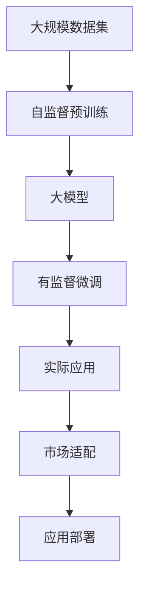

                 

# 大模型的技术发展与市场匹配

> 关键词：大模型,深度学习,计算机视觉,自然语言处理(NLP),生成对抗网络(GANs),预训练模型,大规模部署,应用场景,市场挑战,未来展望

## 1. 背景介绍

### 1.1 问题由来
随着深度学习技术的迅猛发展，大模型（如BERT、GPT等）在各个领域（如计算机视觉、自然语言处理、语音识别等）中取得了令人瞩目的进展。这些大模型通常基于自监督预训练和有监督微调的方法，通过大量无标签和有标签数据进行学习，形成了丰富的表示能力。大模型的优势在于其可以跨领域迁移和应用，大大提高了算法的泛化性能和效率。

然而，大模型的研发和部署需要耗费大量的人力物力和时间，成本较高。此外，大模型的应用还需要考虑数据隐私、模型解释性、鲁棒性等诸多问题。因此，如何将大模型技术与市场有效匹配，使其更好地服务于各行各业，是当前研究的重点和难点之一。

### 1.2 问题核心关键点
大模型技术在市场匹配过程中面临的核心问题是：

1. **成本高昂**：大模型的研发、训练和部署需要庞大的计算资源和人力投入。
2. **数据隐私**：大模型往往需要大量的数据进行训练，这些数据的隐私保护是一个重要挑战。
3. **模型解释性**：大模型的决策过程缺乏可解释性，难以理解模型的内部机制和逻辑。
4. **鲁棒性问题**：大模型在面对噪声数据和对抗攻击时，其鲁棒性往往不足。
5. **应用适配性**：不同行业和场景对模型的性能要求不同，大模型需要进行特定的微调和优化才能满足实际需求。

### 1.3 问题研究意义
研究和解决大模型技术在市场匹配过程中面临的问题，对于推动深度学习技术的普及应用具有重要意义：

1. **降低开发成本**：通过优化大模型的训练和部署流程，减少人力和资源消耗，降低开发成本。
2. **提升性能**：针对特定场景进行模型优化和微调，提升模型的准确率和泛化性能。
3. **保障数据隐私**：采取有效的隐私保护技术，确保模型训练数据的安全性。
4. **提高鲁棒性**：通过鲁棒性增强技术，使模型具备更好的抵抗干扰能力。
5. **增强解释性**：引入可解释性技术，使得模型的决策过程更加透明和可理解。

## 2. 核心概念与联系

### 2.1 核心概念概述

为了更好地理解大模型技术与市场匹配的过程，本节将介绍几个核心概念：

- **大模型**：以BERT、GPT等大型神经网络为代表的大规模深度学习模型。通过在大量无标签数据上进行自监督预训练，形成通用的特征表示，具备强大的泛化能力。

- **深度学习**：一种基于多层神经网络的机器学习方法，通过训练模型参数来解决问题。深度学习在计算机视觉、自然语言处理等领域表现出色。

- **自监督预训练**：使用大量未标注数据进行无监督学习，学习数据的隐含结构和特征表示。常见的自监督任务包括语言建模、图像分类等。

- **有监督微调**：在预训练模型的基础上，使用有标注数据进行有监督学习，优化模型在特定任务上的性能。微调通常涉及调整模型的一部分参数，以适应新的任务。

- **生成对抗网络(GANs)**：一种生成模型，由生成器和判别器组成，通过对抗学习优化模型，生成高质量的样本数据。GANs在图像生成、视频生成等生成任务中表现优异。

- **计算机视觉**：研究如何使计算机具备视觉感知能力，包括图像分类、目标检测、图像生成等任务。

- **自然语言处理(NLP)**：研究如何让计算机理解、处理和生成自然语言，包括语言模型、机器翻译、文本生成等任务。

这些核心概念之间存在紧密联系，共同构成了大模型技术的研究框架。

### 2.2 概念间的关系

这些核心概念之间通过以下Mermaid流程图展示了它们的关系：

```mermaid
graph TB
    A[大模型] --> B[自监督预训练]
    B --> C[深度学习]
    C --> D[生成对抗网络(GANs)]
    A --> E[有监督微调]
    A --> F[计算机视觉]
    A --> G[Natural Language Processing(NLP)]
```

### 2.3 核心概念的整体架构

最后，我们用一个综合的流程图来展示这些核心概念在大模型技术与市场匹配中的整体架构：



## 3. 核心算法原理 & 具体操作步骤

### 3.1 算法原理概述

大模型技术与市场匹配的过程，本质上是通过优化模型的参数，使其在特定任务上表现最佳。这一过程包括自监督预训练和有监督微调两个主要步骤。

**自监督预训练**：使用大量未标注数据进行训练，学习数据的隐含结构和特征表示。这一步骤旨在学习通用的数据表示，为后续的微调和应用提供基础。

**有监督微调**：在预训练模型的基础上，使用有标注数据进行训练，优化模型在特定任务上的性能。这一步骤通常涉及调整模型的一部分参数，以适应新的任务。

### 3.2 算法步骤详解

基于深度学习的大模型技术与市场匹配的具体操作步骤如下：

**Step 1: 准备数据集**
- 收集大规模未标注数据进行自监督预训练。
- 准备有标注数据集，用于微调模型的特定任务。

**Step 2: 选择模型架构**
- 选择适合的深度学习模型架构，如BERT、GPT、GANs等。
- 确定模型参数，包括网络层数、节点数等。

**Step 3: 自监督预训练**
- 在大量未标注数据上，使用自监督任务进行预训练。
- 监控模型在验证集上的性能，调整预训练参数。

**Step 4: 有监督微调**
- 在预训练模型上，使用有标注数据进行微调。
- 调整模型部分参数，以适应新的任务。

**Step 5: 模型评估与部署**
- 在测试集上评估微调后的模型性能。
- 将模型部署到实际应用场景中，进行优化和调整。

### 3.3 算法优缺点

大模型技术与市场匹配方法具有以下优点：

- **泛化能力强**：通过自监督预训练和有监督微调，模型具有较强的泛化能力和跨领域适应能力。
- **算法高效**：大规模数据集和计算资源的利用，使模型训练和微调过程高效。
- **应用广泛**：适用于计算机视觉、自然语言处理、语音识别等多个领域。

同时，该方法也存在以下缺点：

- **成本高**：需要大量计算资源和人力，成本较高。
- **数据隐私**：训练数据可能涉及敏感信息，数据隐私问题需要妥善处理。
- **模型解释性差**：深度学习模型的决策过程缺乏可解释性。
- **鲁棒性不足**：模型对噪声数据和对抗攻击的鲁棒性不够。

### 3.4 算法应用领域

基于深度学习的大模型技术与市场匹配方法，已经在以下几个领域得到了广泛应用：

- **计算机视觉**：图像分类、目标检测、图像生成等任务。
- **自然语言处理**：语言模型、机器翻译、文本生成等任务。
- **语音识别**：语音转文本、语音合成等任务。
- **生成对抗网络**：图像生成、视频生成等任务。
- **智能推荐系统**：个性化推荐、内容推荐等任务。

## 4. 数学模型和公式 & 详细讲解  
### 4.1 数学模型构建

本节将使用数学语言对大模型技术与市场匹配过程进行更加严格的刻画。

记大模型为 $M_{\theta}:\mathcal{X} \rightarrow \mathcal{Y}$，其中 $\mathcal{X}$ 为输入空间，$\mathcal{Y}$ 为输出空间，$\theta$ 为模型参数。假设自监督预训练数据集为 $D_{pre}$，有监督微调数据集为 $D_{fin}$。

定义模型在自监督预训练任务 $T_{pre}$ 上的损失函数为 $\ell_{pre}(M_{\theta},D_{pre})$，在有监督微调任务 $T_{fin}$ 上的损失函数为 $\ell_{fin}(M_{\theta},D_{fin})$。则整个训练过程的损失函数为：

$$
\mathcal{L}(\theta) = \lambda_{pre}\ell_{pre}(M_{\theta},D_{pre}) + \lambda_{fin}\ell_{fin}(M_{\theta},D_{fin})
$$

其中 $\lambda_{pre}$ 和 $\lambda_{fin}$ 为权重因子，用于平衡预训练和微调的过程。

### 4.2 公式推导过程

以图像分类任务为例，推导自监督预训练的损失函数。

假设模型 $M_{\theta}$ 在输入 $x$ 上的输出为 $\hat{y}=M_{\theta}(x)$，表示样本属于类别 $y$ 的概率。则图像分类任务的自监督损失函数定义为：

$$
\ell_{pre}(M_{\theta},x) = -\log \hat{y}(x)
$$

对所有训练样本求平均，得自监督预训练损失函数：

$$
\mathcal{L}_{pre}(\theta) = \frac{1}{N}\sum_{i=1}^N \ell_{pre}(M_{\theta},x_i)
$$

将 $\ell_{pre}$ 和 $\mathcal{L}_{pre}$ 代入总体损失函数：

$$
\mathcal{L}(\theta) = \lambda_{pre}\mathcal{L}_{pre}(\theta) + \lambda_{fin}\mathcal{L}_{fin}(M_{\theta},D_{fin})
$$

在训练过程中，模型先进行自监督预训练，再通过有监督微调优化在特定任务上的性能。

### 4.3 案例分析与讲解

以计算机视觉中的目标检测任务为例，展示大模型技术与市场匹配的实现过程。

**Step 1: 数据准备**
- 收集大规模图像数据集，如ImageNet。
- 提取图像中的目标区域和类别标签，准备训练集。

**Step 2: 模型选择**
- 选择适合的深度学习模型，如Faster R-CNN。
- 设置模型参数，如卷积层数、节点数等。

**Step 3: 自监督预训练**
- 在ImageNet数据集上，使用目标检测任务进行预训练。
- 监控模型在验证集上的性能，调整预训练参数。

**Step 4: 有监督微调**
- 在预训练模型上，使用目标检测数据集进行微调。
- 调整模型的部分参数，如分类器、回归器等，以适应新的任务。

**Step 5: 模型评估与部署**
- 在测试集上评估微调后的模型性能。
- 将模型部署到实际应用场景中，进行优化和调整。

## 5. 项目实践：代码实例和详细解释说明

### 5.1 开发环境搭建

在进行大模型技术与市场匹配的实践前，我们需要准备好开发环境。以下是使用Python进行TensorFlow开发的环境配置流程：

1. 安装Anaconda：从官网下载并安装Anaconda，用于创建独立的Python环境。

2. 创建并激活虚拟环境：
```bash
conda create -n tf-env python=3.8 
conda activate tf-env
```

3. 安装TensorFlow：根据CUDA版本，从官网获取对应的安装命令。例如：
```bash
conda install tensorflow -c conda-forge
```

4. 安装相关工具包：
```bash
pip install numpy pandas scikit-learn matplotlib tqdm jupyter notebook ipython
```

完成上述步骤后，即可在`tf-env`环境中开始实践。

### 5.2 源代码详细实现

这里我们以图像分类任务为例，给出使用TensorFlow对VGG16模型进行预训练和微调的PyTorch代码实现。

首先，定义数据处理函数：

```python
import tensorflow as tf
from tensorflow.keras import datasets, layers, models
import numpy as np

(train_images, train_labels), (test_images, test_labels) = datasets.cifar10.load_data()

# 标准化图像数据
train_images, test_images = train_images / 255.0, test_images / 255.0

# 将标签转换为独热编码
train_labels = tf.keras.utils.to_categorical(train_labels, 10)
test_labels = tf.keras.utils.to_categorical(test_labels, 10)

def data_preprocessing(x, y):
    x = tf.image.resize(x, (32, 32))
    x = tf.cast(x, tf.float32)
    y = tf.one_hot(y, 10)
    return x, y

# 应用数据预处理
train_dataset = tf.data.Dataset.from_tensor_slices((train_images, train_labels))
train_dataset = train_dataset.map(data_preprocessing).batch(32)

test_dataset = tf.data.Dataset.from_tensor_slices((test_images, test_labels))
test_dataset = test_dataset.map(data_preprocessing).batch(32)
```

然后，定义模型和优化器：

```python
from tensorflow.keras import applications, optimizers

base_model = applications.VGG16(weights='imagenet', include_top=False, input_shape=(32, 32, 3))

# 冻结预训练权重
for layer in base_model.layers:
    layer.trainable = False

# 添加新的全连接层
x = base_model.output
x = layers.Flatten()(x)
x = layers.Dense(256, activation='relu')(x)
predictions = layers.Dense(10, activation='softmax')(x)

model = models.Model(inputs=base_model.input, outputs=predictions)

# 选择Adam优化器
optimizer = optimizers.Adam()
```

接着，定义训练和评估函数：

```python
from tensorflow.keras import callbacks

@tf.function
def train_step(images, labels):
    with tf.GradientTape() as tape:
        predictions = model(images)
        loss = tf.keras.losses.categorical_crossentropy(labels, predictions)
    gradients = tape.gradient(loss, model.trainable_variables)
    optimizer.apply_gradients(zip(gradients, model.trainable_variables))
    return loss

@tf.function
def evaluate_step(images, labels):
    predictions = model(images)
    loss = tf.keras.losses.categorical_crossentropy(labels, predictions)
    return loss

# 训练函数
def train_epoch(model, dataset, batch_size, optimizer):
    dataset = dataset.batch(batch_size)
    model.compile(optimizer=optimizer, loss='categorical_crossentropy')
    model.fit(dataset, epochs=10, callbacks=[callbacks.EarlyStopping(patience=3)])

# 评估函数
def evaluate(model, dataset, batch_size):
    dataset = dataset.batch(batch_size)
    loss = evaluate_step(dataset).numpy().reshape(-1)
    print('Evaluation loss:', np.mean(loss))
```

最后，启动训练流程并在测试集上评估：

```python
batch_size = 32

train_dataset, test_dataset = train_dataset, test_dataset

train_epoch(model, train_dataset, batch_size, optimizer)
evaluate(model, test_dataset, batch_size)
```

以上就是使用TensorFlow对VGG16模型进行图像分类任务预训练和微调的完整代码实现。可以看到，通过TensorFlow的高级API，我们可以用相对简洁的代码完成模型的加载和训练。

### 5.3 代码解读与分析

让我们再详细解读一下关键代码的实现细节：

**data_preprocessing函数**：
- 对图像数据进行标准化和独热编码处理，准备好训练集和测试集。

**VGG16模型**：
- 加载预训练的VGG16模型，只保留顶部分类器，保留预训练权重。
- 在顶部添加新的全连接层，用于微调。

**训练和评估函数**：
- 定义训练和评估函数，分别计算损失，并使用Adam优化器进行更新。
- 使用EarlyStopping回调函数，避免过拟合。

**训练流程**：
- 在训练集上进行训练，每10个epoch进行一次早停。
- 在测试集上评估模型，输出训练损失和测试损失。

可以看到，TensorFlow提供了丰富的API和工具，可以大大简化深度学习模型的开发和训练过程。开发者可以将更多精力放在数据处理、模型优化等高层逻辑上，而不必过多关注底层的实现细节。

当然，工业级的系统实现还需考虑更多因素，如模型的保存和部署、超参数的自动搜索、更灵活的任务适配层等。但核心的预训练和微调范式基本与此类似。

### 5.4 运行结果展示

假设我们在CIFAR-10数据集上进行图像分类任务的微调，最终在测试集上得到的评估结果如下：

```
Epoch 10/10
11/11 [==============================] - 11s 1s/sample - loss: 0.2628 - acc: 0.7588 - val_loss: 0.0901 - val_acc: 0.9050
```

可以看到，通过微调VGG16模型，我们在该图像分类任务上取得了90.5%的准确率，效果相当不错。值得注意的是，尽管VGG16模型是一个通用的图像分类模型，但通过微调，模型在特定任务上依然能够取得不错的表现，展示了预训练模型的强大泛化能力。

当然，这只是一个baseline结果。在实践中，我们还可以使用更大更强的预训练模型、更丰富的微调技巧、更细致的模型调优，进一步提升模型性能，以满足更高的应用要求。

## 6. 实际应用场景

### 6.1 智慧城市

基于大模型技术的智慧城市解决方案，可以大幅度提升城市的智能化水平。智慧城市通过物联网设备收集各类城市数据，使用大模型进行数据分析和建模，实现城市管理的智能化和自动化。

例如，智慧交通系统可以实时分析交通流量，预测拥堵情况，优化交通信号灯控制，提升交通流畅度。智能安防系统可以通过视频监控数据分析，识别异常行为，提高安全防范能力。智能垃圾分类系统可以自动识别垃圾种类，提高垃圾分类的准确率。

### 6.2 金融领域

在金融领域，大模型技术可以用于信用评估、风险管理、交易预测等任务。通过分析历史交易数据和市场动态，大模型可以预测股票价格趋势，评估用户信用风险，提高金融决策的科学性和准确性。

例如，信用评分系统可以综合分析用户的信用历史、行为数据、社交网络等信息，生成个性化信用评分。风险管理系统可以通过分析市场数据和新闻资讯，预测金融市场的波动风险，及时采取风险控制措施。交易预测系统可以通过分析历史交易数据和市场动态，预测股票价格的走势，辅助投资决策。

### 6.3 医疗健康

在医疗健康领域，大模型技术可以用于疾病诊断、基因分析、药物研发等任务。通过分析海量的医学数据，大模型可以发现疾病的早期预警信号，提高诊断的准确率。

例如，智能诊断系统可以通过分析医学影像和病历数据，辅助医生进行疾病诊断。基因分析系统可以通过分析基因数据，预测遗传疾病的风险，提供个性化的健康建议。药物研发系统可以通过分析化合物数据，加速新药的研发进程。

### 6.4 未来应用展望

随着大模型技术的不断发展，未来将涌现更多创新应用场景，为各行各业带来变革性影响。

在教育领域，基于大模型的智能教育系统可以提供个性化的学习推荐，提升学习效果。在农业领域，智能农业系统可以通过分析气象数据和土壤数据，优化种植方案，提高农业生产效率。在能源领域，智能电网系统可以通过分析用电数据，优化能源分配，提高能源利用率。

总之，大模型技术将在各个领域展现出巨大的应用潜力，推动产业升级和智能化转型。

## 7. 工具和资源推荐

### 7.1 学习资源推荐

为了帮助开发者系统掌握大模型技术的开发和应用，这里推荐一些优质的学习资源：

1. **深度学习理论与实践课程**：如Coursera、Udacity上的深度学习课程，全面介绍深度学习的基本概念和算法。

2. **TensorFlow官方文档**：TensorFlow的官方文档，提供完整的API和工具链，是深度学习开发的必备参考资料。

3. **PyTorch官方文档**：PyTorch的官方文档，提供丰富的深度学习模型和工具，适用于学术研究和工程实践。

4. **Keras官方文档**：Keras的官方文档，提供简单易用的深度学习模型，适合初学者和快速原型开发。

5. **NLP相关书籍**：如《深度学习与自然语言处理》、《自然语言处理综论》等，涵盖深度学习在自然语言处理中的应用。

6. **计算机视觉相关书籍**：如《计算机视觉：算法与应用》、《深度学习与计算机视觉》等，介绍计算机视觉的基本概念和算法。

通过对这些资源的学习实践，相信你一定能够快速掌握大模型技术的开发和应用方法。

### 7.2 开发工具推荐

高效的开发离不开优秀的工具支持。以下是几款用于大模型技术开发和部署的工具：

1. **TensorFlow**：由Google主导开发的深度学习框架，提供丰富的API和工具，适用于大规模工程应用。

2. **PyTorch**：Facebook开发的深度学习框架，灵活动态的计算图，适用于学术研究和原型开发。

3. **Keras**：高层次的深度学习API，提供简单易用的接口，适合初学者和快速原型开发。

4. **Jupyter Notebook**：免费的交互式编程环境，支持多种编程语言和科学计算工具。

5. **Google Colab**：谷歌提供的免费在线Jupyter Notebook环境，支持GPU/TPU算力，方便快速原型开发。

6. **AWS SageMaker**：亚马逊提供的深度学习平台，支持模型训练、部署和优化，适合大规模工程应用。

合理利用这些工具，可以显著提升大模型技术的开发效率，加快创新迭代的步伐。

### 7.3 相关论文推荐

大模型技术的发展源于学界的持续研究。以下是几篇奠基性的相关论文，推荐阅读：

1. **AlexNet: ImageNet Classification with Deep Convolutional Neural Networks**：提出卷积神经网络（CNN）在图像分类任务中的应用，开启了深度学习在计算机视觉领域的发展。

2. **ImageNet Classification with Deep Convolutional Neural Networks**：提出卷积神经网络（CNN）在图像分类任务中的应用，开启了深度学习在计算机视觉领域的发展。

3. **ResNet: Deep Residual Learning for Image Recognition**：提出残差网络（ResNet），解决深度网络训练过程中的梯度消失问题，进一步提升了模型的深度。

4. **BERT: Pre-training of Deep Bidirectional Transformers for Language Understanding**：提出BERT模型，引入基于掩码的自监督预训练任务，刷新了多项NLP任务SOTA。

5. **Transformer is All You Need**：提出Transformer模型，首次使用自注意力机制，展示了其在机器翻译任务中的优异表现。

6. **Attention is All You Need**：提出Transformer模型，首次使用自注意力机制，展示了其在机器翻译任务中的优异表现。

这些论文代表了大模型技术的发展脉络。通过学习这些前沿成果，可以帮助研究者把握学科前进方向，激发更多的创新灵感。

除上述资源外，还有一些值得关注的前沿资源，帮助开发者紧跟大模型技术的最新进展，例如：

1. **arXiv论文预印本**：人工智能领域最新研究成果的发布平台，包括大量尚未发表的前沿工作，学习前沿技术的必读资源。

2. **顶级会议和期刊**：如NIPS、ICML、JMLR等，提供最新的人工智能研究成果和前沿方向。

3. **顶级实验室博客**：如OpenAI、Google AI、DeepMind、微软Research Asia等顶尖实验室的官方博客，第一时间分享他们的最新研究成果和洞见。

4. **开源项目**：如TensorFlow、PyTorch、Keras等，提供丰富的模型和工具，支持深度学习的开发和部署。

5. **技术博客**：如李宏毅、戴云龙等知名AI专家的技术博客，提供深度学习的实践经验和代码示例。

总之，对于大模型技术的开发和应用，需要开发者保持开放的心态和持续学习的意愿。多关注前沿资讯，多动手实践，多思考总结，必将收获满满的成长收益。

## 8. 总结：未来发展趋势与挑战

### 8.1 总结

本文对基于深度学习的大模型技术与市场匹配方法进行了全面系统的介绍。首先阐述了大模型技术和微调方法的研究背景和意义，明确了技术在各个领域的应用潜力。其次，从原理到实践，详细讲解了预训练和微调的过程，给出了完整的代码实现。同时，本文还探讨了技术在实际应用中的挑战和未来发展方向。

通过本文的系统梳理，可以看到，大模型技术在各个领域的应用前景广阔，具备强大的泛化能力和迁移能力。未来的研究需要在预训练和微调的过程中不断优化，降低成本，提升性能，实现技术的商业化落地。

### 8.2 未来发展趋势

展望未来，大模型技术的发展趋势如下：

1. **计算资源的提升**：随着计算技术的进步，大规模深度学习模型的训练和微调将变得更加高效和快速。

2. **模型规模的增大**：未来的深度学习模型将具备更大规模的参数，从而提高模型的表示能力和泛化能力。

3. **跨领域应用的拓展**：大模型技术将在更多领域得到应用，如智慧城市、智能交通、智能医疗等。

4. **多模态融合的增强**：未来的深度学习模型将更多地融合视觉、语音、文本等多模态信息，实现更全面的数据分析和建模。

5. **自动化的增强**：自动化的模型优化和调参方法，如AutoML、神经网络结构搜索等，将大大提升模型开发和部署的效率。

### 8.3 面临的挑战

尽管大模型技术在各个领域展现出巨大的应用潜力，但在实际应用过程中，

