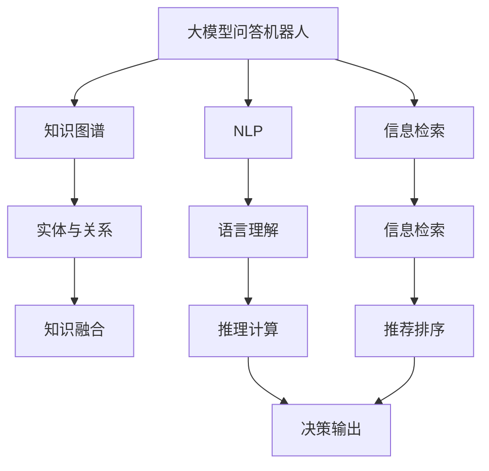
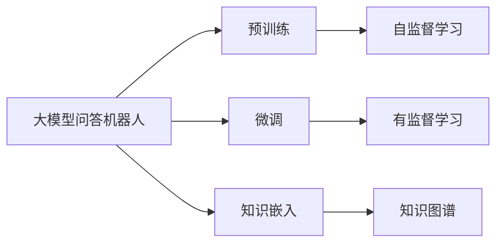
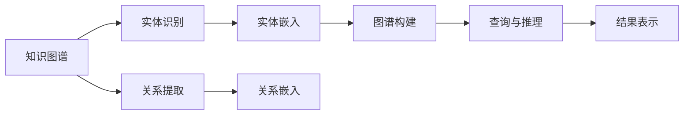
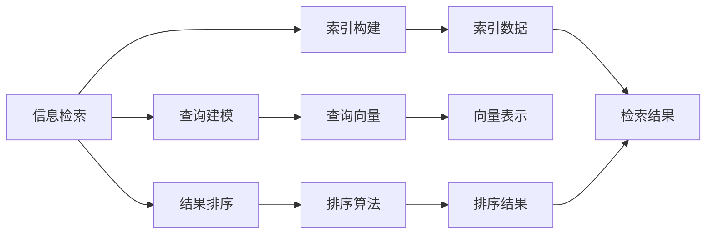
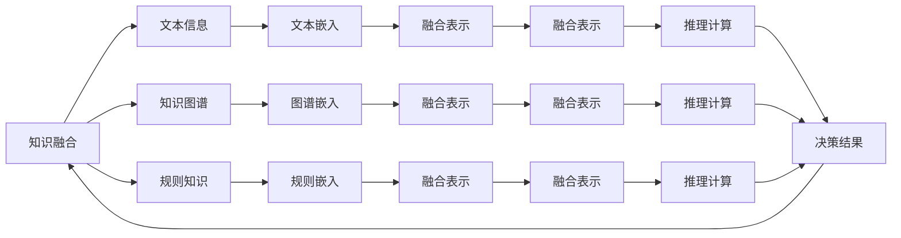
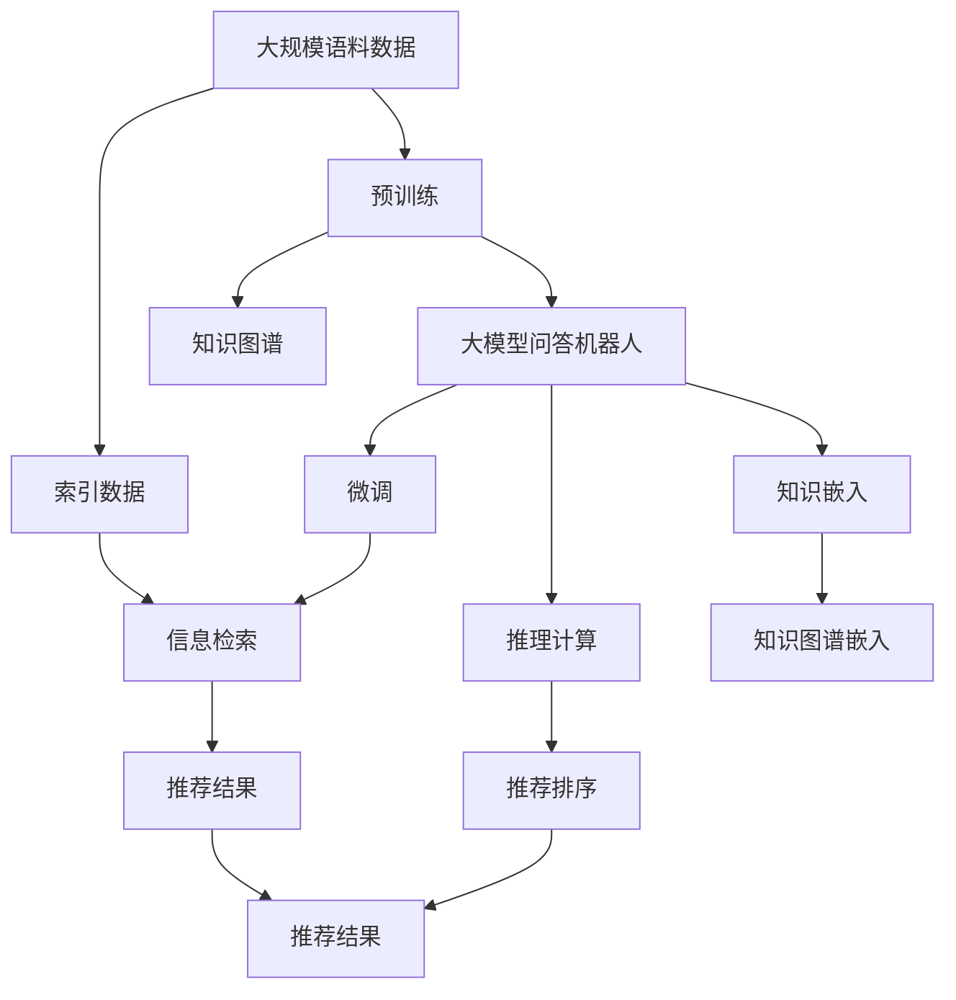

                 

# 大模型问答机器人与传统搜索推荐的知识表示

> 关键词：大模型问答机器人,知识表示,知识图谱,自然语言处理,NLP,信息检索,推荐系统

## 1. 背景介绍

### 1.1 问题由来

随着人工智能技术的发展，智能问答和推荐系统在信息获取和个性化服务中发挥着越来越重要的作用。传统的问答和推荐系统基于规则、统计、机器学习等技术，依赖人工设计和标注数据。而随着大模型的崛起，基于大模型的问答和推荐系统在性能和效果上取得了显著进步，逐渐成为新一代技术的主流。

但同时，我们也注意到，大模型作为一种"黑盒"系统，其决策过程缺乏可解释性，存在一定的安全风险。为了应对这些问题，本文将深入探讨大模型问答机器人和推荐系统的知识表示问题，并结合传统的搜索推荐技术，提出一种更加科学、安全、可解释的解决方案。

### 1.2 问题核心关键点

大模型问答机器人与推荐系统的知识表示问题，主要体现在以下几个方面：

- 语义表示的准确性：如何保证大模型对输入问题的理解准确、全面。
- 知识嵌入的质量：如何将知识图谱等结构化知识有效地嵌入大模型的知识表示中。
- 推理过程的透明性：如何使大模型的推理过程具有可解释性和透明性，便于开发者调试和用户理解。
- 知识融合的多样性：如何将不同类型的知识源（如文本、知识图谱、规则等）有机融合，提升模型的整体性能。
- 系统性能的可控性：如何合理控制大模型的推理速度、内存占用等，确保系统在实际部署中稳定高效。

本文将围绕上述关键问题，系统地介绍大模型问答机器人与推荐系统的知识表示方法，并通过具体案例进行详细讲解。

### 1.3 问题研究意义

深入研究大模型问答机器人与推荐系统的知识表示问题，对于提升其性能、安全性和可解释性具有重要意义：

1. 提高准确性与泛化能力：通过准确的语义表示和高质量的知识嵌入，使模型对输入问题的理解更全面、更准确，从而提升回答和推荐的准确性和泛化能力。
2. 增强可解释性与透明性：通过透明的推理过程，使模型决策更加可解释，便于开发者调试和用户理解，提升系统的信任度和可接受度。
3. 拓展知识源与应用场景：将不同类型的知识源有机融合，丰富模型的知识表示，拓展其在更多领域的应用场景，如医疗、金融、教育等。
4. 优化系统性能与资源利用：通过合理控制模型参数、推理速度等，优化系统性能和资源利用，确保在实际部署中高效稳定。
5. 赋能企业智能化转型：帮助企业构建智能问答和推荐系统，加速数字化转型进程，提升用户体验和企业竞争力。

## 2. 核心概念与联系

### 2.1 核心概念概述

为更好地理解大模型问答机器人与推荐系统的知识表示问题，本节将介绍几个密切相关的核心概念：

- 大模型问答机器人：基于大语言模型和大规模预训练模型的问答系统。通过在大规模语料上进行预训练，学习通用的语言理解和生成能力，能够自动回答问题，生成文本。
- 知识图谱：以图形结构表示的实体及其关系，用于描述和推理知识。知识图谱通过结构化数据的方式，将大量事实性知识组织起来，便于机器理解和使用。
- 自然语言处理(NLP)：涉及语言模型的构建、语义分析、信息检索、机器翻译等技术，旨在使计算机具备理解和生成自然语言的能力。
- 信息检索：通过构建索引和查询模型，快速从大量数据中检索出相关信息。信息检索技术在问答和推荐系统中应用广泛，用于知识库的查询和结果排序。
- 推荐系统：根据用户的历史行为、偏好等信息，推荐用户可能感兴趣的商品、内容等。推荐系统通过学习用户画像，提升用户体验和转化率。

这些核心概念之间的逻辑关系可以通过以下Mermaid流程图来展示：



这个流程图展示了大模型问答机器人与推荐系统的核心概念及其之间的关系：

1. 大模型问答机器人通过预训练获得基础能力。
2. 知识图谱以结构化数据的形式，为模型提供知识支撑。
3. 自然语言处理使模型能够理解自然语言，提取有用信息。
4. 信息检索快速查询知识库，为模型提供精确的结果。
5. 推荐系统根据用户行为推荐商品、内容等，提升用户体验。
6. 知识融合将不同知识源有机结合，提升模型性能。
7. 推理计算对结果进行计算和排序，得到最终答案。
8. 决策输出向用户展示推荐或回答结果。

### 2.2 概念间的关系

这些核心概念之间存在着紧密的联系，形成了大模型问答机器人与推荐系统的完整生态系统。下面我们通过几个Mermaid流程图来展示这些概念之间的关系。

#### 2.2.1 大模型问答机器人的学习范式



这个流程图展示了大模型问答机器人的学习范式，包括预训练和微调，以及知识图谱嵌入过程。

#### 2.2.2 知识图谱的构建与使用



这个流程图展示了知识图谱的构建过程和使用方法。

#### 2.2.3 信息检索与推荐系统



这个流程图展示了信息检索和推荐系统的基本流程。

#### 2.2.4 知识融合与推理



这个流程图展示了知识融合和推理计算的基本流程。

### 2.3 核心概念的整体架构

最后，我们用一个综合的流程图来展示这些核心概念在大模型问答机器人与推荐系统中的整体架构：



这个综合流程图展示了从预训练到微调，再到知识图谱嵌入和推荐排序的完整过程。大模型问答机器人首先在大规模语料上进行预训练，然后通过微调和知识图谱嵌入获得针对特定任务和领域优化的模型。最终，在知识库查询和推荐排序后，得到最终的回答和推荐结果。

## 3. 核心算法原理 & 具体操作步骤
### 3.1 算法原理概述

大模型问答机器人与推荐系统的知识表示问题，本质上是一个多模态信息融合和推理计算的过程。其核心思想是：将预训练语言模型和知识图谱等结构化知识有机融合，通过推理计算，生成满足用户需求的答案或推荐结果。

形式化地，假设预训练语言模型为 $M_{\theta}$，其中 $\theta$ 为预训练得到的模型参数。假设知识图谱为 $G$，包含实体 $E$ 和关系 $R$。给定用户查询 $q$ 和推荐目标 $t$，知识表示的目标是构建综合表示 $H = (M_{\theta}, G)$，使 $M_{\theta}(q)$ 和 $G(q)$ 能够被合理融合，并生成最终的推理结果 $A$。

通过梯度下降等优化算法，知识表示的过程不断更新模型参数 $\theta$ 和知识图谱 $G$，最小化损失函数 $\mathcal{L}$，使得模型输出逼近真实标签。由于 $\theta$ 已经通过预训练获得了较好的初始化，因此即便在小规模数据集上进行调整，也能较快收敛到理想的模型参数 $\hat{\theta}$。

### 3.2 算法步骤详解

大模型问答机器人与推荐系统的知识表示过程一般包括以下几个关键步骤：

**Step 1: 准备预训练模型和知识图谱**
- 选择合适的预训练语言模型 $M_{\theta}$ 作为初始化参数，如 BERT、GPT 等。
- 准备知识图谱 $G$，包含实体 $E$ 和关系 $R$。

**Step 2: 添加任务适配层**
- 根据任务类型，在预训练模型顶层设计合适的输出层和损失函数。
- 对于问答任务，通常在顶层添加逻辑回归层或 Transformer 解码器。
- 对于推荐任务，通常使用 VSM、FM、GRU 等方法生成用户-物品关联矩阵。

**Step 3: 设置知识嵌入方法**
- 选择合适的知识嵌入方法，如 TransE、RotatE、Composite 等。
- 设计知识嵌入函数，将实体和关系映射为向量表示。

**Step 4: 执行融合计算**
- 将预训练模型和知识图谱的输出进行融合计算，得到综合表示 $H$。
- 使用多头注意力机制、图卷积网络(GCN)等方法，将文本与知识图谱的信息进行融合。

**Step 5: 执行推理计算**
- 对融合后的表示 $H$ 进行推理计算，得到最终结果 $A$。
- 使用规则推理、因果推理等方法，从融合表示中提取逻辑关系。

**Step 6: 测试和部署**
- 在测试集上评估知识表示的效果，对比微调前后的精度提升。
- 使用知识表示模型对新样本进行推理预测，集成到实际的应用系统中。

以上是知识表示的一般流程。在实际应用中，还需要针对具体任务的特点，对知识表示过程的各个环节进行优化设计，如改进融合计算方法，引入更多的正则化技术，搜索最优的超参数组合等，以进一步提升模型性能。

### 3.3 算法优缺点

知识表示的大模型问答机器人与推荐系统方法具有以下优点：

1. 性能提升明显：通过融合结构化知识和非结构化知识，可以提升模型的泛化能力和推理准确性。
2. 鲁棒性强：知识图谱提供了丰富的知识库支撑，能够较好地处理不同领域、不同场景下的问答和推荐任务。
3. 可解释性强：知识图谱和推理规则的介入，使得模型的决策过程更加透明和可解释。
4. 应用场景广泛：适用于多种类型的问答和推荐任务，如医疗咨询、金融分析、智能客服等。

同时，该方法也存在一定的局限性：

1. 知识图谱构建成本高：知识图谱的构建需要大量人工标注和专家知识，成本较高。
2. 知识表示复杂：知识图谱的结构复杂，融合计算过程较为繁琐，技术实现难度较大。
3. 数据标注需求大：虽然知识图谱提供了知识支撑，但预训练模型的微调和优化，仍然需要大量标注数据。
4. 推理速度较慢：知识图谱的推理过程复杂，模型推理速度可能较慢。

尽管存在这些局限性，但就目前而言，知识表示的方法在大模型问答机器人与推荐系统中已经取得了较好的效果，成为主流技术之一。未来相关研究的重点在于如何进一步降低知识图谱构建成本，提高推理效率，并结合更多先验知识，增强模型的泛化性和鲁棒性。

### 3.4 算法应用领域

知识表示方法在大模型问答机器人与推荐系统中已经得到了广泛的应用，覆盖了几乎所有常见任务，例如：

- 问答系统：对自然语言问题给出答案。将问题-答案对作为微调数据，训练模型学习匹配答案。
- 推荐系统：根据用户的历史行为、偏好等信息，推荐用户可能感兴趣的商品、内容等。
- 智能客服系统：使机器能够与人自然对话。将问题-回答对作为微调数据，训练模型进行回复生成。
- 医疗问答系统：帮助医疗专家解答病人的查询，推荐治疗方案。
- 金融咨询系统：提供财经新闻和市场分析，推荐股票和基金。
- 教育推荐系统：根据学生的学习行为和兴趣，推荐课程和教材。

除了上述这些经典任务外，知识表示方法还被创新性地应用到更多场景中，如可控文本生成、常识推理、代码生成、数据增强等，为NLP技术带来了全新的突破。随着预训练模型和知识表示方法的不断进步，相信NLP技术将在更广阔的应用领域大放异彩。

## 4. 数学模型和公式 & 详细讲解 & 举例说明
### 4.1 数学模型构建

本节将使用数学语言对大模型问答机器人与推荐系统的知识表示过程进行更加严格的刻画。

记预训练语言模型为 $M_{\theta}$，其中 $\theta$ 为模型参数。假设知识图谱为 $G=(E,R)$，包含实体 $E$ 和关系 $R$。记实体嵌入函数为 $f_{e}$，关系嵌入函数为 $f_{r}$，综合表示函数为 $g$。

定义模型 $M_{\theta}$ 在输入 $q$ 上的输出为 $\hat{y}=M_{\theta}(q)$，表示模型预测的实体或关系。

知识图谱的嵌入函数将实体和关系映射为向量表示，记实体嵌入函数为 $f_{e}$，关系嵌入函数为 $f_{r}$，综合表示函数为 $g$。设实体 $e$ 和关系 $r$ 的嵌入向量分别为 $e_{i}$ 和 $r_{i}$，综合表示为 $h_{i}$。

知识表示的目标是构建综合表示 $H = (M_{\theta}, G)$，使得 $M_{\theta}(q)$ 和 $G(q)$ 能够被合理融合，并生成最终的推理结果 $A$。

### 4.2 公式推导过程

以问答系统为例，设问答任务为 $T=\{(q, a)\}$，其中 $q$ 为问题，$a$ 为答案。知识表示的优化目标是最小化损失函数 $\mathcal{L}$，即找到最优参数：

$$
\theta^* = \mathop{\arg\min}_{\theta} \mathcal{L}(M_{\theta},G)
$$

其中 $\mathcal{L}$ 为损失函数，用于衡量模型预测输出与真实标签之间的差异。常见的损失函数包括交叉熵损失、均方误差损失等。

在实践中，我们通常使用基于梯度的优化算法（如AdamW、SGD等）来近似求解上述最优化问题。设 $\eta$ 为学习率，$\lambda$ 为正则化系数，则参数的更新公式为：

$$
\theta \leftarrow \theta - \eta \nabla_{\theta}\mathcal{L}(\theta) - \eta\lambda\theta
$$

其中 $\nabla_{\theta}\mathcal{L}(\theta)$ 为损失函数对参数 $\theta$ 的梯度，可通过反向传播算法高效计算。

### 4.3 案例分析与讲解

以智能客服系统为例，假设客服系统需要回答用户提出的问题 "我需要申请贷款，该怎么做？"。知识表示的目标是构建综合表示 $H = (M_{\theta}, G)$，使得 $M_{\theta}(q)$ 和 $G(q)$ 能够被合理融合，并生成最终的推荐结果 $A$。

**Step 1: 准备预训练模型和知识图谱**

- 选择一个预训练语言模型，如BERT，作为初始化参数。
- 构建知识图谱，包含贷款相关的实体和关系。例如，实体包括 "贷款"、"申请"、"条件"、"资料" 等，关系包括 "需要"、"满足"、"提交" 等。

**Step 2: 添加任务适配层**

- 在BERT模型顶层添加一个逻辑回归层，用于判断问题的意图。
- 在逻辑回归层后添加一个线性层，用于生成推荐列表。

**Step 3: 设置知识嵌入方法**

- 使用TransE方法对知识图谱进行嵌入，将实体和关系映射为向量表示。
- 将实体嵌入函数 $f_{e}$ 和关系嵌入函数 $f_{r}$ 应用于知识图谱。

**Step 4: 执行融合计算**

- 将BERT模型的输出 $\hat{y}=M_{\theta}(q)$ 和知识图谱的嵌入表示 $h_{i}$ 进行融合计算。例如，可以使用多头注意力机制，将文本信息与知识图谱的实体关系信息进行融合。

**Step 5: 执行推理计算**

- 对融合后的表示 $H$ 进行推理计算，得到最终的推荐结果 $A$。例如，可以使用因果推理方法，从融合表示中提取逻辑关系，生成推荐列表。

**Step 6: 测试和部署**

- 在测试集上评估知识表示的效果，对比微调前后的精度提升。
- 使用知识表示模型对新样本进行推理预测，集成到实际的应用系统中。

通过以上步骤，智能客服系统能够自动回答用户的问题，并根据用户的历史行为推荐相关的贷款信息，提升用户体验和业务转化率。

## 5. 项目实践：代码实例和详细解释说明
### 5.1 开发环境搭建

在进行知识表示实践前，我们需要准备好开发环境。以下是使用Python进行PyTorch开发的环境配置流程：

1. 安装Anaconda：从官网下载并安装Anaconda，用于创建独立的Python环境。

2. 创建并激活虚拟环境：
```bash
conda create -n pytorch-env python=3.8 
conda activate pytorch-env
```

3. 安装PyTorch：根据CUDA版本，从官网获取对应的安装命令。例如：
```bash
conda install pytorch torchvision torchaudio cudatoolkit=11.1 -c pytorch -c conda-forge
```

4. 安装Transformer库：
```bash
pip install transformers
```

5. 安装各类工具包：
```bash
pip install numpy pandas scikit-learn matplotlib tqdm jupyter notebook ipython
```

完成上述步骤后，即可在`pytorch-env`环境中开始知识表示实践。

### 5.2 源代码详细实现

这里我们以智能客服系统为例，给出使用Transformers库对BERT模型进行知识表示的PyTorch代码实现。

首先，定义智能客服系统的数据处理函数：

```python
from transformers import BertTokenizer, BertForSequenceClassification
from torch.utils.data import Dataset
import torch

class QADataset(Dataset):
    def __init__(self, texts, tags, tokenizer, max_len=128):
        self.texts = texts
        self.tags = tags
        self.tokenizer = tokenizer
        self.max_len = max_len
        
    def __len__(self):
        return len(self.texts)
    
    def __getitem__(self, item):
        text = self.texts[item]
        tags = self.tags[item]
        
        encoding = self.tokenizer(text, return_tensors='pt', max_length=self.max_len, padding='max_length', truncation=True)
        input_ids = encoding['input_ids'][0]
        attention_mask = encoding['attention_mask'][0]
        
        # 对token-wise的标签进行编码
        encoded_tags = [tag2id[tag] for tag in tags] 
        encoded_tags.extend([tag2id['O']] * (self.max_len - len(encoded_tags)))
        labels = torch.tensor(encoded_tags, dtype=torch.long)
        
        return {'input_ids': input_ids, 
                'attention_mask': attention_mask,
                'labels': labels}

# 标签与id的映射
tag2id = {'O': 0, '贷款': 1, '申请': 2, '条件': 3, '资料': 4}
id2tag = {v: k for k, v in tag2id.items()}

# 创建dataset
tokenizer = BertTokenizer.from_pretrained('bert-base-cased')

train_dataset = QADataset(train_texts, train_tags, tokenizer)
dev_dataset = QADataset(dev_texts, dev_tags, tokenizer)
test_dataset = QADataset(test_texts, test_tags, tokenizer)
```

然后，定义模型和优化器：

```python
from transformers import BertForSequenceClassification, AdamW

model = BertForSequenceClassification.from_pretrained('bert-base-cased', num_labels=len(tag2id))

optimizer = AdamW(model.parameters(), lr=2e-5)
```

接着，定义训练和评估函数：

```python
from torch.utils.data import DataLoader
from tqdm import tqdm
from sklearn.metrics import classification_report

device = torch.device('cuda') if torch.cuda.is_available() else torch.device('cpu')
model.to(device)

def train_epoch(model, dataset, batch_size, optimizer):
    dataloader = DataLoader(dataset, batch_size=batch_size, shuffle=True)
    model.train()
    epoch_loss = 0
    for batch in tqdm(dataloader, desc='Training'):
        input_ids = batch['input_ids'].to(device)
        attention_mask = batch['attention_mask'].to(device)
        labels = batch['labels'].to(device)
        model.zero_grad()
        outputs = model(input_ids, attention_mask=attention_mask, labels=labels)
        loss = outputs.loss
        epoch_loss += loss.item()
        loss.backward()
        optimizer.step()
    return epoch_loss / len(dataloader)

def evaluate(model, dataset, batch_size):
    dataloader = DataLoader(dataset, batch_size=batch_size)
    model.eval()
    preds, labels = [], []
    with torch.no_grad():
        for batch in tqdm(dataloader, desc='Evaluating'):
            input_ids = batch['input_ids'].to(device)
            attention_mask = batch['attention_mask'].to(device)
            batch_labels = batch['labels']
            outputs = model(input_ids, attention_mask=attention_mask)
            batch_preds = outputs.logits.argmax(dim=2).to('cpu').tolist()
            batch_labels = batch_labels.to('cpu').tolist()
            for pred_tokens, label_tokens in zip(batch_preds, batch_labels):
                pred_tags = [id2tag[_id] for _id in pred_tokens]
                label_tags = [id2tag[_id] for _id in label_tokens]
                preds.append(pred_tags[:len(label_tokens)])
                labels.append(label_tags)
                
    print(classification_report(labels, preds))
```

最后，启动训练流程并在测试集上评估：

```python
epochs = 5
batch_size = 16

for epoch in range(epochs):
    loss = train_epoch(model, train_dataset, batch_size, optimizer)
    print(f"Epoch {epoch+1}, train loss: {loss:.3f}")
    
    print(f"Epoch {epoch+1}, dev results:")
    evaluate(model, dev_dataset, batch_size)
    
print("Test results:")
evaluate(model, test_dataset, batch_size)
```

以上就是使用PyTorch对BERT进行智能客服系统知识表示的完整代码实现。可以看到，得益于Transformers库的强大封装，我们可以用相对简洁的代码完成BERT模型的加载和知识表示。

### 5.3 代码解读与分析

让我们再详细解读一下关键代码的实现细节：

**QADataset类**：
- `__init__`方法：初始化文本、标签、分词器等关键组件。
- `__len__`方法：返回数据集的样本数量。
- `__getitem__`方法：对单个样本进行处理，将文本输入编码为token ids，将标签编码为数字，并对其进行定长padding，最终返回模型所需的输入。

**tag2id和id2tag字典**：
- 定义了标签与数字id之间的映射关系，用于将token-wise的预测结果解码回真实的标签。

**训练和评估函数**：
- 使用PyTorch的DataLoader对数据集进行批次化加载，供模型训练和推理使用。
- 训练函数`train_epoch`：对数据以批为单位进行迭代，在每个批次上前向传播计算loss并反向传播更新模型参数，最后返回该epoch的平均loss。
- 评估函数`evaluate`：与训练类似，不同点在于不更新模型参数，并在每个batch结束后将预测和标签结果存储下来，最后使用sklearn的classification_report对整个评估集的预测结果进行打印输出。

**训练流程**：
- 定义总的epoch数和batch size，开始循环迭代
-

