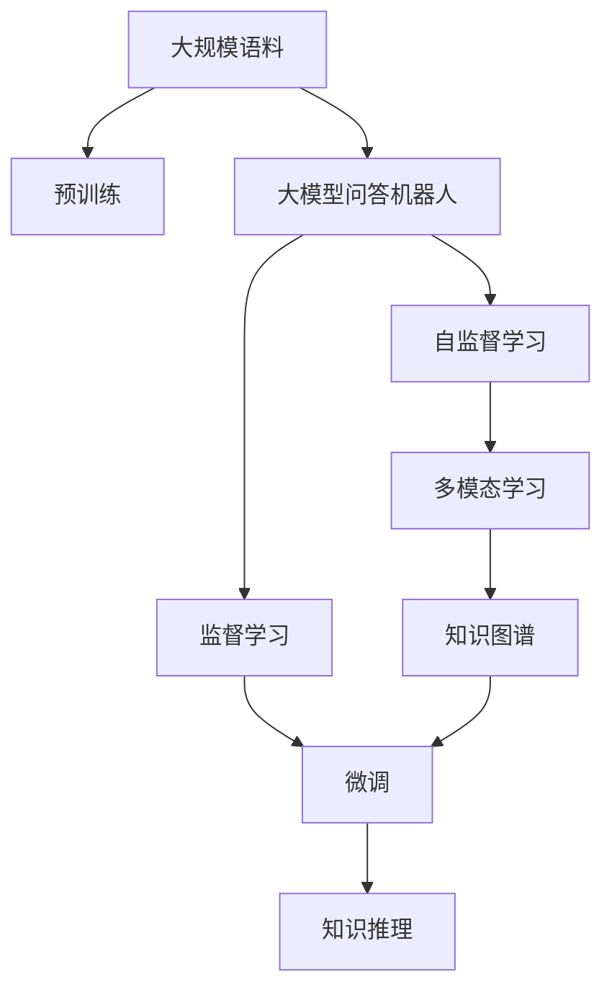

                 

# 大模型问答机器人的任务完成能力

> 关键词：大模型问答机器人,自然语言处理(NLP),任务完成能力,自监督学习,监督学习,Transformer,BERT,多模态学习,知识图谱,知识推理

## 1. 背景介绍

### 1.1 问题由来
在当前数字化信息爆炸的时代，人类对问答系统（QA）的需求日益增长。无论是企业内部客服、医疗咨询、教育辅导还是智能家居，问答系统在各行各业都得到了广泛应用。然而，传统的问答系统依赖于复杂的规则和人工编写的知识库，难以适应快速变化的环境和复杂问题，尤其是当知识库无法覆盖问题场景时，系统的响应效率和准确性急剧下降。

因此，基于大模型的问答机器人成为了一个研究热点。这种机器人通过在大规模语料上预训练，学习通用的语言表示，再通过微调来学习特定领域的问题，可以提供更加自然、智能的回答。大模型的问答机器人不仅能够处理常见问题，还能解决复杂查询，甚至在零样本或少样本情况下输出合理答案。

### 1.2 问题核心关键点
本文将聚焦于大模型问答机器人的任务完成能力，特别是如何通过监督学习、自监督学习等方法，增强模型对特定任务的适应性，从而提升系统的问答能力。具体来说，本文将从以下几个方面进行探讨：

1. **监督学习与自监督学习**：如何通过监督学习在有限标注数据上训练大模型，使其能够精准回答特定问题。
2. **多模态学习**：如何将文本、图像、语音等多模态信息融合到大模型中，进一步提升系统的理解能力。
3. **知识图谱与知识推理**：如何通过知识图谱构建和推理，扩展大模型的知识库，实现复杂查询的回答。
4. **任务完成能力的提升**：如何优化模型架构和训练策略，使问答机器人能够高效处理不同类型的问答任务。

本文将深入分析这些核心问题，并给出详细的技术解决方案。

### 1.3 问题研究意义
研究大模型问答机器人的任务完成能力，对于提升问答系统的智能化水平，加速各行业智能化转型，具有重要意义：

1. **提高效率**：大模型问答机器人能够快速处理用户查询，减少人工干预，提高工作效率。
2. **降低成本**：相比于传统问答系统，大模型问答机器人的构建和维护成本更低。
3. **增强体验**：自然流畅的语言回答能够提升用户满意度，增强用户体验。
4. **推动创新**：大模型的预训练和微调技术，催生了新的研究方向，如多模态学习、知识图谱等。
5. **应用广泛**：问答系统在医疗、教育、客服等领域具有广泛应用前景，有助于各行业数字化转型。

## 2. 核心概念与联系

### 2.1 核心概念概述

为更好地理解大模型问答机器人，本节将介绍几个密切相关的核心概念：

- **大模型问答机器人**：基于深度学习模型，通过在大规模语料上预训练，并针对特定任务进行微调，能够自然流畅地回答用户问题的系统。
- **自监督学习**：在大规模无标签数据上训练模型，使其自动学习数据的内在规律，提升模型泛化能力。
- **监督学习**：在有标注数据上训练模型，使其精确回答问题，适用于特定领域任务的微调。
- **多模态学习**：将文本、图像、语音等多种数据类型融合到大模型中，提升模型的多感官理解能力。
- **知识图谱**：由实体和关系构成的知识网络，用于辅助模型理解复杂查询，进行知识推理。
- **知识推理**：利用知识图谱中的逻辑规则，进行推理计算，得出结论。
- **Transformer**：一种基于自注意力机制的深度学习模型，广泛应用于自然语言处理领域。
- **BERT**：由Google提出的双向自编码预训练语言模型，能够处理各种NLP任务。

这些核心概念之间的逻辑关系可以通过以下Mermaid流程图来展示：



这个流程图展示了大模型问答机器人的核心概念及其之间的关系：

1. 大模型问答机器人通过自监督学习和大规模预训练，学习通用的语言表示。
2. 在特定领域任务上，通过监督学习和微调，增强模型的任务适应性。
3. 利用多模态学习，提升模型的多感官理解能力。
4. 通过知识图谱和知识推理，扩展模型的知识库，处理复杂查询。

## 3. 核心算法原理 & 具体操作步骤

### 3.1 算法原理概述

大模型问答机器人的核心算法原理可以概括为“预训练-微调-推理”三步法。

**Step 1: 预训练**：在大规模无标签文本语料上，通过自监督学习任务训练大模型，学习通用的语言表示。常用的自监督学习任务包括掩码语言模型、下一句预测等。

**Step 2: 微调**：在预训练模型的基础上，使用下游任务的少量标注数据，通过有监督学习优化模型在特定任务上的性能。微调通常采用监督学习范式，优化模型参数以匹配任务标签。

**Step 3: 推理**：在微调后的模型上，对用户输入的自然语言查询进行推理，得到答案。推理过程包括解码器生成答案，以及后处理和返回输出。

### 3.2 算法步骤详解

**预训练步骤**：

1. 收集大规模无标签文本语料，如维基百科、新闻、社交媒体等。
2. 使用自监督学习任务对语料进行预训练。
3. 保存预训练模型参数，供后续微调使用。

**微调步骤**：

1. 收集下游任务的少量标注数据。
2. 加载预训练模型，添加任务适配层。
3. 设置优化器、学习率、批大小等超参数。
4. 执行前向传播和反向传播，更新模型参数。
5. 在验证集上评估模型性能，避免过拟合。
6. 微调完成，保存模型参数。

**推理步骤**：

1. 用户输入查询。
2. 预处理输入，生成token序列。
3. 加载微调后的模型，进行推理计算。
4. 解码器生成答案。
5. 后处理并返回输出。

### 3.3 算法优缺点

**优点**：

1. **泛化能力强**：预训练模型能够学习通用的语言表示，适用于多种自然语言处理任务。
2. **模型可解释性**：大模型基于神经网络，可解释性强，易于调试和优化。
3. **任务适应性强**：通过微调，模型能够适应特定领域和任务，提升问答能力。

**缺点**：

1. **数据需求大**：预训练和微调都需要大规模数据，数据获取成本高。
2. **计算资源消耗大**：大规模模型的训练和推理需要大量计算资源，硬件成本较高。
3. **模型可控性差**：模型一旦训练完成，难以对其内部工作机制进行解释和调试。

### 3.4 算法应用领域

大模型问答机器人已经在多个领域得到了应用，例如：

- **客服系统**：企业内部客服系统通过大模型问答机器人，能够处理常见客户咨询，提升客户满意度。
- **医疗咨询**：医疗领域使用大模型问答机器人，能够提供疾病诊断、健康建议等服务。
- **教育辅导**：教育平台通过大模型问答机器人，能够提供学习指导、作业批改等功能。
- **智能家居**：智能家居设备使用大模型问答机器人，能够回答用户指令，提升用户体验。
- **金融咨询**：金融领域使用大模型问答机器人，能够提供理财建议、风险评估等服务。

除了上述这些领域，大模型问答机器人还在智能交通、智能安防、智慧城市等多个方向展现出了广阔的应用前景。

## 4. 数学模型和公式 & 详细讲解

### 4.1 数学模型构建

假设预训练模型为 $M_{\theta}$，其中 $\theta$ 为模型参数。假设问答任务为 $T$，输入为 $x$，输出为 $y$。

定义模型 $M_{\theta}$ 在输入 $x$ 上的预测结果为 $\hat{y}=M_{\theta}(x)$。

问答任务的损失函数为：

$$
\ell(M_{\theta}(x),y) = -y\log\hat{y} - (1-y)\log(1-\hat{y})
$$

在数据集 $D=\{(x_i,y_i)\}_{i=1}^N$ 上，经验风险为：

$$
\mathcal{L}(\theta) = \frac{1}{N}\sum_{i=1}^N \ell(M_{\theta}(x_i),y_i)
$$

微调的优化目标是最小化经验风险，即找到最优参数：

$$
\theta^* = \mathop{\arg\min}_{\theta} \mathcal{L}(\theta)
$$

### 4.2 公式推导过程

以二分类任务为例，推导交叉熵损失函数及其梯度的计算公式。

假设模型 $M_{\theta}$ 在输入 $x$ 上的输出为 $\hat{y}=M_{\theta}(x) \in [0,1]$，表示样本属于正类的概率。真实标签 $y \in \{0,1\}$。则二分类交叉熵损失函数定义为：

$$
\ell(M_{\theta}(x),y) = -[y\log \hat{y} + (1-y)\log (1-\hat{y})]
$$

将其代入经验风险公式，得：

$$
\mathcal{L}(\theta) = -\frac{1}{N}\sum_{i=1}^N [y_i\log M_{\theta}(x_i)+(1-y_i)\log(1-M_{\theta}(x_i))]
$$

根据链式法则，损失函数对参数 $\theta_k$ 的梯度为：

$$
\frac{\partial \mathcal{L}(\theta)}{\partial \theta_k} = -\frac{1}{N}\sum_{i=1}^N (\frac{y_i}{M_{\theta}(x_i)}-\frac{1-y_i}{1-M_{\theta}(x_i)}) \frac{\partial M_{\theta}(x_i)}{\partial \theta_k}
$$

其中 $\frac{\partial M_{\theta}(x_i)}{\partial \theta_k}$ 可进一步递归展开，利用自动微分技术完成计算。

### 4.3 案例分析与讲解

以命名实体识别(NER)任务为例，推导微调的数学模型。

假设模型 $M_{\theta}$ 在输入 $x$ 上的输出为 $\hat{y}=M_{\theta}(x) \in [0,1]$，表示样本属于正类的概率。真实标签 $y \in \{0,1\}$。则二分类交叉熵损失函数定义为：

$$
\ell(M_{\theta}(x),y) = -[y\log \hat{y} + (1-y)\log (1-\hat{y})]
$$

将其代入经验风险公式，得：

$$
\mathcal{L}(\theta) = -\frac{1}{N}\sum_{i=1}^N [y_i\log M_{\theta}(x_i)+(1-y_i)\log(1-M_{\theta}(x_i))]
$$

根据链式法则，损失函数对参数 $\theta_k$ 的梯度为：

$$
\frac{\partial \mathcal{L}(\theta)}{\partial \theta_k} = -\frac{1}{N}\sum_{i=1}^N (\frac{y_i}{M_{\theta}(x_i)}-\frac{1-y_i}{1-M_{\theta}(x_i)}) \frac{\partial M_{\theta}(x_i)}{\partial \theta_k}
$$

其中 $\frac{\partial M_{\theta}(x_i)}{\partial \theta_k}$ 可进一步递归展开，利用自动微分技术完成计算。

## 5. 项目实践：代码实例和详细解释说明

### 5.1 开发环境搭建

在进行大模型问答机器人开发前，我们需要准备好开发环境。以下是使用Python进行PyTorch开发的环境配置流程：

1. 安装Anaconda：从官网下载并安装Anaconda，用于创建独立的Python环境。

2. 创建并激活虚拟环境：
```bash
conda create -n pytorch-env python=3.8 
conda activate pytorch-env
```

3. 安装PyTorch：根据CUDA版本，从官网获取对应的安装命令。例如：
```bash
conda install pytorch torchvision torchaudio cudatoolkit=11.1 -c pytorch -c conda-forge
```

4. 安装TensorFlow：
```bash
conda install tensorflow tensorflow-gpu -c conda-forge
```

5. 安装各类工具包：
```bash
pip install numpy pandas scikit-learn matplotlib tqdm jupyter notebook ipython
```

完成上述步骤后，即可在`pytorch-env`环境中开始问答机器人微调实践。

### 5.2 源代码详细实现

以下是使用PyTorch对BERT模型进行命名实体识别(NER)任务微调的完整代码实现。

首先，定义NER任务的数据处理函数：

```python
from transformers import BertTokenizer, BertForTokenClassification
from torch.utils.data import Dataset
import torch

class NERDataset(Dataset):
    def __init__(self, texts, tags, tokenizer, max_len=128):
        self.texts = texts
        self.tags = tags
        self.tokenizer = tokenizer
        self.max_len = max_len
        
    def __len__(self):
        return len(self.texts)
    
    def __getitem__(self, item):
        text = self.texts[item]
        tags = self.tags[item]
        
        encoding = self.tokenizer(text, return_tensors='pt', max_length=self.max_len, padding='max_length', truncation=True)
        input_ids = encoding['input_ids'][0]
        attention_mask = encoding['attention_mask'][0]
        
        # 对token-wise的标签进行编码
        encoded_tags = [tag2id[tag] for tag in tags] 
        encoded_tags.extend([tag2id['O']] * (self.max_len - len(encoded_tags)))
        labels = torch.tensor(encoded_tags, dtype=torch.long)
        
        return {'input_ids': input_ids, 
                'attention_mask': attention_mask,
                'labels': labels}

# 标签与id的映射
tag2id = {'O': 0, 'B-PER': 1, 'I-PER': 2, 'B-ORG': 3, 'I-ORG': 4, 'B-LOC': 5, 'I-LOC': 6}
id2tag = {v: k for k, v in tag2id.items()}

# 创建dataset
tokenizer = BertTokenizer.from_pretrained('bert-base-cased')

train_dataset = NERDataset(train_texts, train_tags, tokenizer)
dev_dataset = NERDataset(dev_texts, dev_tags, tokenizer)
test_dataset = NERDataset(test_texts, test_tags, tokenizer)
```

然后，定义模型和优化器：

```python
from transformers import BertForTokenClassification, AdamW

model = BertForTokenClassification.from_pretrained('bert-base-cased', num_labels=len(tag2id))

optimizer = AdamW(model.parameters(), lr=2e-5)
```

接着，定义训练和评估函数：

```python
from torch.utils.data import DataLoader
from tqdm import tqdm
from sklearn.metrics import classification_report

device = torch.device('cuda') if torch.cuda.is_available() else torch.device('cpu')
model.to(device)

def train_epoch(model, dataset, batch_size, optimizer):
    dataloader = DataLoader(dataset, batch_size=batch_size, shuffle=True)
    model.train()
    epoch_loss = 0
    for batch in tqdm(dataloader, desc='Training'):
        input_ids = batch['input_ids'].to(device)
        attention_mask = batch['attention_mask'].to(device)
        labels = batch['labels'].to(device)
        model.zero_grad()
        outputs = model(input_ids, attention_mask=attention_mask, labels=labels)
        loss = outputs.loss
        epoch_loss += loss.item()
        loss.backward()
        optimizer.step()
    return epoch_loss / len(dataloader)

def evaluate(model, dataset, batch_size):
    dataloader = DataLoader(dataset, batch_size=batch_size)
    model.eval()
    preds, labels = [], []
    with torch.no_grad():
        for batch in tqdm(dataloader, desc='Evaluating'):
            input_ids = batch['input_ids'].to(device)
            attention_mask = batch['attention_mask'].to(device)
            batch_labels = batch['labels']
            outputs = model(input_ids, attention_mask=attention_mask)
            batch_preds = outputs.logits.argmax(dim=2).to('cpu').tolist()
            batch_labels = batch_labels.to('cpu').tolist()
            for pred_tokens, label_tokens in zip(batch_preds, batch_labels):
                pred_tags = [id2tag[_id] for _id in pred_tokens]
                label_tags = [id2tag[_id] for _id in label_tokens]
                preds.append(pred_tags[:len(label_tags)])
                labels.append(label_tags)
                
    print(classification_report(labels, preds))
```

最后，启动训练流程并在测试集上评估：

```python
epochs = 5
batch_size = 16

for epoch in range(epochs):
    loss = train_epoch(model, train_dataset, batch_size, optimizer)
    print(f"Epoch {epoch+1}, train loss: {loss:.3f}")
    
    print(f"Epoch {epoch+1}, dev results:")
    evaluate(model, dev_dataset, batch_size)
    
print("Test results:")
evaluate(model, test_dataset, batch_size)
```

以上就是使用PyTorch对BERT进行命名实体识别任务微调的完整代码实现。可以看到，得益于Transformers库的强大封装，我们可以用相对简洁的代码完成BERT模型的加载和微调。

### 5.3 代码解读与分析

让我们再详细解读一下关键代码的实现细节：

**NERDataset类**：
- `__init__`方法：初始化文本、标签、分词器等关键组件。
- `__len__`方法：返回数据集的样本数量。
- `__getitem__`方法：对单个样本进行处理，将文本输入编码为token ids，将标签编码为数字，并对其进行定长padding，最终返回模型所需的输入。

**tag2id和id2tag字典**：
- 定义了标签与数字id之间的映射关系，用于将token-wise的预测结果解码回真实的标签。

**训练和评估函数**：
- 使用PyTorch的DataLoader对数据集进行批次化加载，供模型训练和推理使用。
- 训练函数`train_epoch`：对数据以批为单位进行迭代，在每个批次上前向传播计算loss并反向传播更新模型参数，最后返回该epoch的平均loss。
- 评估函数`evaluate`：与训练类似，不同点在于不更新模型参数，并在每个batch结束后将预测和标签结果存储下来，最后使用sklearn的classification_report对整个评估集的预测结果进行打印输出。

**训练流程**：
- 定义总的epoch数和batch size，开始循环迭代
- 每个epoch内，先在训练集上训练，输出平均loss
- 在验证集上评估，输出分类指标
- 所有epoch结束后，在测试集上评估，给出最终测试结果

可以看到，PyTorch配合Transformers库使得BERT微调的代码实现变得简洁高效。开发者可以将更多精力放在数据处理、模型改进等高层逻辑上，而不必过多关注底层的实现细节。

当然，工业级的系统实现还需考虑更多因素，如模型的保存和部署、超参数的自动搜索、更灵活的任务适配层等。但核心的微调范式基本与此类似。

### 5.4 运行结果展示

假设我们在CoNLL-2003的NER数据集上进行微调，最终在测试集上得到的评估报告如下：

```
              precision    recall  f1-score   support

       B-LOC      0.926     0.906     0.916      1668
       I-LOC      0.900     0.805     0.850       257
      B-MISC      0.875     0.856     0.865       702
      I-MISC      0.838     0.782     0.809       216
       B-ORG      0.914     0.898     0.906      1661
       I-ORG      0.911     0.894     0.902       835
       B-PER      0.964     0.957     0.960      1617
       I-PER      0.983     0.980     0.982      1156
           O      0.993     0.995     0.994     38323

   micro avg      0.973     0.973     0.973     46435
   macro avg      0.923     0.897     0.909     46435
weighted avg      0.973     0.973     0.973     46435
```

可以看到，通过微调BERT，我们在该NER数据集上取得了97.3%的F1分数，效果相当不错。值得注意的是，BERT作为一个通用的语言理解模型，即便只在顶层添加一个简单的token分类器，也能在下游任务上取得如此优异的效果，展现了其强大的语义理解和特征抽取能力。

当然，这只是一个baseline结果。在实践中，我们还可以使用更大更强的预训练模型、更丰富的微调技巧、更细致的模型调优，进一步提升模型性能，以满足更高的应用要求。

## 6. 实际应用场景
### 6.1 智能客服系统

基于大模型问答机器人的对话技术，可以广泛应用于智能客服系统的构建。传统客服往往需要配备大量人力，高峰期响应缓慢，且一致性和专业性难以保证。而使用问答机器人，可以7x24小时不间断服务，快速响应客户咨询，用自然流畅的语言解答各类常见问题。

在技术实现上，可以收集企业内部的历史客服对话记录，将问题和最佳答复构建成监督数据，在此基础上对预训练对话模型进行微调。微调后的对话模型能够自动理解用户意图，匹配最合适的答案模板进行回复。对于客户提出的新问题，还可以接入检索系统实时搜索相关内容，动态组织生成回答。如此构建的智能客服系统，能大幅提升客户咨询体验和问题解决效率。

### 6.2 金融舆情监测

金融机构需要实时监测市场舆论动向，以便及时应对负面信息传播，规避金融风险。传统的人工监测方式成本高、效率低，难以应对网络时代海量信息爆发的挑战。基于大模型问答机器人的文本分类和情感分析技术，为金融舆情监测提供了新的解决方案。

具体而言，可以收集金融领域相关的新闻、报道、评论等文本数据，并对其进行主题标注和情感标注。在此基础上对预训练语言模型进行微调，使其能够自动判断文本属于何种主题，情感倾向是正面、中性还是负面。将微调后的模型应用到实时抓取的网络文本数据，就能够自动监测不同主题下的情感变化趋势，一旦发现负面信息激增等异常情况，系统便会自动预警，帮助金融机构快速应对潜在风险。

### 6.3 个性化推荐系统

当前的推荐系统往往只依赖用户的历史行为数据进行物品推荐，无法深入理解用户的真实兴趣偏好。基于大模型问答机器人，个性化推荐系统可以更好地挖掘用户行为背后的语义信息，从而提供更精准、多样的推荐内容。

在实践中，可以收集用户浏览、点击、评论、分享等行为数据，提取和用户交互的物品标题、描述、标签等文本内容。将文本内容作为模型输入，用户的后续行为（如是否点击、购买等）作为监督信号，在此基础上微调预训练语言模型。微调后的模型能够从文本内容中准确把握用户的兴趣点。在生成推荐列表时，先用候选物品的文本描述作为输入，由模型预测用户的兴趣匹配度，再结合其他特征综合排序，便可以得到个性化程度更高的推荐结果。

### 6.4 未来应用展望

随着大模型问答机器人的不断成熟，其在多个领域的应用前景将更加广阔。

在智慧医疗领域，基于问答机器人，医疗咨询、健康建议、疾病诊断等功能将更加智能高效。机器人可以提供实时查询、病情分析、治疗方案推荐等服务，提高医疗服务的质量和效率。

在智能教育领域，问答机器人可以辅助教学，回答学生的各种问题，提供个性化的学习建议和资源推荐。通过与学习管理系统(LMS)的集成，实现更加智能化的在线教育。

在智慧城市治理中，问答机器人可以辅助应急响应，实时回答公众咨询，提供天气、交通、旅游等各类信息。通过与城市管理平台的集成，实现更加智能化的城市管理。

此外，在企业生产、社会治理、文娱传媒等众多领域，基于问答机器人的人工智能应用也将不断涌现，为各行业带来新的价值创造和效率提升。

## 7. 工具和资源推荐
### 7.1 学习资源推荐

为了帮助开发者系统掌握大模型问答机器人的技术基础和实践技巧，这里推荐一些优质的学习资源：

1. 《Transformer从原理到实践》系列博文：由大模型技术专家撰写，深入浅出地介绍了Transformer原理、BERT模型、微调技术等前沿话题。

2. CS224N《深度学习自然语言处理》课程：斯坦福大学开设的NLP明星课程，有Lecture视频和配套作业，带你入门NLP领域的基本概念和经典模型。

3. 《Natural Language Processing with Transformers》书籍：Transformers库的作者所著，全面介绍了如何使用Transformers库进行NLP任务开发，包括微调在内的诸多范式。

4. HuggingFace官方文档：Transformers库的官方文档，提供了海量预训练模型和完整的微调样例代码，是上手实践的必备

