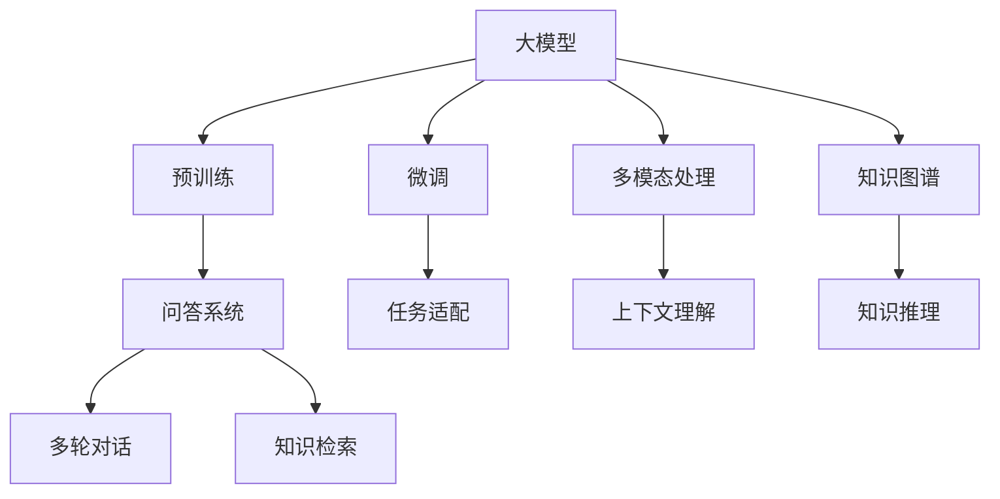

                 

# 大模型问答机器人的优势

## 1. 背景介绍

### 1.1 问题由来
随着人工智能技术的迅猛发展，自然语言处理（NLP）领域涌现出了众多创新突破。其中，基于大模型的问答机器人（QA robot）成为了研究热点之一。问答机器人能够模拟人类的对话交互，回答用户的查询，应用范围广泛，例如客户服务、智能客服、医疗咨询、教育辅导等。通过大模型的预训练和微调，问答机器人在自然语言理解与生成方面达到了前所未有的高度，赋予了机器人更强大的语言理解和应答能力。

### 1.2 问题核心关键点
大模型问答机器人的核心优势在于其强大的语言理解和生成能力，这主要得益于预训练模型的广泛知识、深度学习和自然语言处理技术的融合。具体而言，问答机器人的核心关键点包括：

- 预训练模型：使用大规模无标签数据进行自监督预训练，学习到通用的语言表示。
- 微调机制：在特定任务上，通过微调预训练模型，优化其在问答任务上的表现。
- 多模态处理：集成图像、语音等多模态数据，提升对话系统的多样性和复杂度。
- 多轮对话能力：支持多轮对话，能够理解上下文信息，提升交互体验。
- 知识图谱：与知识图谱结合，提供精确的知识检索和推理能力。

### 1.3 问题研究意义
大模型问答机器人通过深度学习和自然语言处理技术，实现了人与机器之间的自然交互，极大地提高了信息获取的效率和准确性。其在多个领域的应用，如医疗、教育、客服、金融等，显著提升了用户体验和服务质量。深入研究大模型问答机器人的优势，对于推动NLP技术的产业化应用具有重要意义。

## 2. 核心概念与联系

### 2.1 核心概念概述

为更好地理解大模型问答机器人，我们需要掌握几个核心概念及其之间的关系：

- 大模型：指使用大规模数据进行预训练的语言模型，如GPT、BERT等。
- 问答系统（QA System）：一种能够理解和回答自然语言问题的系统，应用广泛。
- 预训练模型：在无标签数据上进行自监督预训练，学习语言表示。
- 微调：在有标签数据上，通过监督学习优化模型，提升特定任务性能。
- 多模态处理：整合图像、语音等多种数据模态，增强对话系统的能力。
- 知识图谱：通过实体关系图，提供结构化的知识信息，用于辅助问答。

这些概念之间存在着紧密的联系，构成了一个完整的问答机器人框架。

### 2.2 概念间的关系

这些核心概念之间的关系可以通过以下Mermaid流程图来展示：



这个流程图展示了核心概念之间的关系：

1. 大模型通过预训练学习语言表示，为问答系统提供基础能力。
2. 微调机制针对具体任务，优化问答系统性能。
3. 多模态处理增强了对话系统的多样性。
4. 知识图谱为问答系统提供了结构化知识，辅助推理和检索。
5. 问答系统通过任务适配、多轮对话和知识推理等技术，实现自然交互。

## 3. 核心算法原理 & 具体操作步骤

### 3.1 算法原理概述

大模型问答机器人的核心算法原理，主要涉及预训练模型、微调机制和多模态处理。其核心思想是通过大规模无标签数据进行预训练，学习通用的语言表示，然后在特定任务上进行微调，优化模型在该任务上的性能。同时，通过多模态处理，集成视觉、语音等多种数据模态，提升对话系统的多样性和复杂度。

### 3.2 算法步骤详解

基于大模型的问答机器人算法步骤主要包括以下几个关键环节：

**Step 1: 准备数据集**
- 收集问答系统的训练数据集，包括问题-答案对。
- 将数据集分为训练集、验证集和测试集。
- 对数据进行预处理，如分词、去停用词、标准化等。

**Step 2: 加载预训练模型**
- 加载预训练模型，如BERT、GPT等。
- 对预训练模型进行必要的初始化设置，如学习率、批大小等。

**Step 3: 任务适配**
- 针对特定问答任务，设计任务适配层，包括分类器、解码器等。
- 选择合适的损失函数，如交叉熵、均方误差等。

**Step 4: 微调模型**
- 将训练集输入模型，前向传播计算损失函数。
- 反向传播计算参数梯度，根据优化算法更新模型参数。
- 在验证集上评估模型性能，根据性能调整模型参数。
- 重复训练过程，直至收敛。

**Step 5: 多模态融合**
- 对输入数据进行多模态预处理，如图像特征提取、语音识别等。
- 将多模态数据与文本数据融合，提升系统理解能力。
- 设计多模态融合策略，如特征池化、注意力机制等。

**Step 6: 测试与部署**
- 在测试集上评估微调后的模型性能。
- 将模型部署到实际应用环境中，如客户服务平台、智能客服系统等。

### 3.3 算法优缺点

大模型问答机器人具有以下优点：

1. **强大的语言理解能力**：通过预训练模型学习到丰富的语言知识，能够在多轮对话中理解上下文信息，提高回答的准确性。
2. **任务适应性强**：微调机制使得模型能够适应多种问答任务，提升特定任务的性能。
3. **多模态处理能力**：通过整合图像、语音等多模态数据，提升对话系统的多样性和复杂度。
4. **高效训练**：预训练模型通过大规模数据进行学习，训练效率高，精度高。

同时，大模型问答机器人也存在以下缺点：

1. **数据需求量大**：训练过程中需要大量标注数据，获取高质量数据的成本较高。
2. **模型复杂度高**：大模型参数量庞大，推理速度较慢，计算资源消耗大。
3. **依赖上下文**：依赖对话历史信息，对于缺乏上下文的环境可能表现不佳。
4. **多轮对话难度高**：设计多轮对话逻辑复杂，模型难以稳定地处理多轮对话。
5. **可解释性差**：大模型模型复杂，难以解释其内部工作机制和决策逻辑。

### 3.4 算法应用领域

大模型问答机器人已经广泛应用于多个领域，具体包括：

1. **医疗咨询**：利用知识图谱和预训练模型，提供精准的医疗咨询服务，解答常见问题。
2. **客户服务**：替代人工客服，处理用户咨询，提升服务效率和质量。
3. **教育辅导**：提供个性化的学习辅导，解答学生疑问，推荐学习资源。
4. **金融咨询**：提供金融产品咨询，解答用户财务疑问，推荐理财产品。
5. **智能助手**：集成多模态处理和知识图谱，提升交互体验，提供全方位的智能服务。

## 4. 数学模型和公式 & 详细讲解 & 举例说明

### 4.1 数学模型构建

假设大模型为 $M_{\theta}$，其中 $\theta$ 为模型参数。给定问答任务的训练集 $D=\{(x_i,y_i)\}_{i=1}^N$，其中 $x_i$ 为问题，$y_i$ 为答案。定义问答系统在数据样本 $(x,y)$ 上的损失函数为 $\ell(M_{\theta}(x),y)$。在数据集 $D$ 上的经验风险为：

$$
\mathcal{L}(\theta) = \frac{1}{N} \sum_{i=1}^N \ell(M_{\theta}(x_i),y_i)
$$

微调的优化目标是最小化经验风险，即找到最优参数：

$$
\theta^* = \mathop{\arg\min}_{\theta} \mathcal{L}(\theta)
$$

在实践中，我们通常使用基于梯度的优化算法（如Adam、SGD等）来近似求解上述最优化问题。设 $\eta$ 为学习率，$\lambda$ 为正则化系数，则参数的更新公式为：

$$
\theta \leftarrow \theta - \eta \nabla_{\theta}\mathcal{L}(\theta) - \eta\lambda\theta
$$

其中 $\nabla_{\theta}\mathcal{L}(\theta)$ 为损失函数对参数 $\theta$ 的梯度，可通过反向传播算法高效计算。

### 4.2 公式推导过程

以下我们以二分类任务为例，推导交叉熵损失函数及其梯度的计算公式。

假设模型 $M_{\theta}$ 在输入 $x$ 上的输出为 $\hat{y}=M_{\theta}(x)$，表示模型对问题 $x$ 的预测答案。真实答案 $y \in \{0,1\}$。则二分类交叉熵损失函数定义为：

$$
\ell(M_{\theta}(x),y) = -[y\log \hat{y} + (1-y)\log (1-\hat{y})]
$$

将其代入经验风险公式，得：

$$
\mathcal{L}(\theta) = -\frac{1}{N}\sum_{i=1}^N [y_i\log M_{\theta}(x_i)+(1-y_i)\log(1-M_{\theta}(x_i))]
$$

根据链式法则，损失函数对参数 $\theta_k$ 的梯度为：

$$
\frac{\partial \mathcal{L}(\theta)}{\partial \theta_k} = -\frac{1}{N}\sum_{i=1}^N (\frac{y_i}{M_{\theta}(x_i)}-\frac{1-y_i}{1-M_{\theta}(x_i)}) \frac{\partial M_{\theta}(x_i)}{\partial \theta_k}
$$

其中 $\frac{\partial M_{\theta}(x_i)}{\partial \theta_k}$ 可进一步递归展开，利用自动微分技术完成计算。

在得到损失函数的梯度后，即可带入参数更新公式，完成模型的迭代优化。重复上述过程直至收敛，最终得到适应问答任务的最优模型参数 $\theta^*$。

## 5. 项目实践：代码实例和详细解释说明

### 5.1 开发环境搭建

在进行问答机器人开发前，我们需要准备好开发环境。以下是使用Python进行PyTorch开发的环境配置流程：

1. 安装Anaconda：从官网下载并安装Anaconda，用于创建独立的Python环境。

2. 创建并激活虚拟环境：
```bash
conda create -n pytorch-env python=3.8 
conda activate pytorch-env
```

3. 安装PyTorch：根据CUDA版本，从官网获取对应的安装命令。例如：
```bash
conda install pytorch torchvision torchaudio cudatoolkit=11.1 -c pytorch -c conda-forge
```

4. 安装Transformers库：
```bash
pip install transformers
```

5. 安装各类工具包：
```bash
pip install numpy pandas scikit-learn matplotlib tqdm jupyter notebook ipython
```

完成上述步骤后，即可在`pytorch-env`环境中开始问答机器人开发。

### 5.2 源代码详细实现

下面我们以医疗问答为例，给出使用Transformers库对BERT模型进行问答机器人开发的PyTorch代码实现。

首先，定义问答机器人任务的数据处理函数：

```python
from transformers import BertTokenizer
from torch.utils.data import Dataset
import torch

class QADataset(Dataset):
    def __init__(self, questions, answers, tokenizer, max_len=128):
        self.questions = questions
        self.answers = answers
        self.tokenizer = tokenizer
        self.max_len = max_len
        
    def __len__(self):
        return len(self.questions)
    
    def __getitem__(self, item):
        question = self.questions[item]
        answer = self.answers[item]
        
        encoding = self.tokenizer(question, return_tensors='pt', max_length=self.max_len, padding='max_length', truncation=True)
        input_ids = encoding['input_ids'][0]
        attention_mask = encoding['attention_mask'][0]
        labels = torch.tensor([int(answer in self.answers)], dtype=torch.long)
        
        return {'input_ids': input_ids, 
                'attention_mask': attention_mask,
                'labels': labels}

# 标签与id的映射
tag2id = {'O': 0, 'A': 1}
id2tag = {v: k for k, v in tag2id.items()}

# 创建dataset
tokenizer = BertTokenizer.from_pretrained('bert-base-cased')

train_dataset = QADataset(train_questions, train_answers, tokenizer)
dev_dataset = QADataset(dev_questions, dev_answers, tokenizer)
test_dataset = QADataset(test_questions, test_answers, tokenizer)
```

然后，定义模型和优化器：

```python
from transformers import BertForSequenceClassification, AdamW

model = BertForSequenceClassification.from_pretrained('bert-base-cased', num_labels=len(tag2id))

optimizer = AdamW(model.parameters(), lr=2e-5)
```

接着，定义训练和评估函数：

```python
from torch.utils.data import DataLoader
from tqdm import tqdm
from sklearn.metrics import classification_report

device = torch.device('cuda') if torch.cuda.is_available() else torch.device('cpu')
model.to(device)

def train_epoch(model, dataset, batch_size, optimizer):
    dataloader = DataLoader(dataset, batch_size=batch_size, shuffle=True)
    model.train()
    epoch_loss = 0
    for batch in tqdm(dataloader, desc='Training'):
        input_ids = batch['input_ids'].to(device)
        attention_mask = batch['attention_mask'].to(device)
        labels = batch['labels'].to(device)
        model.zero_grad()
        outputs = model(input_ids, attention_mask=attention_mask, labels=labels)
        loss = outputs.loss
        epoch_loss += loss.item()
        loss.backward()
        optimizer.step()
    return epoch_loss / len(dataloader)

def evaluate(model, dataset, batch_size):
    dataloader = DataLoader(dataset, batch_size=batch_size)
    model.eval()
    preds, labels = [], []
    with torch.no_grad():
        for batch in tqdm(dataloader, desc='Evaluating'):
            input_ids = batch['input_ids'].to(device)
            attention_mask = batch['attention_mask'].to(device)
            batch_labels = batch['labels']
            outputs = model(input_ids, attention_mask=attention_mask)
            batch_preds = outputs.logits.argmax(dim=2).to('cpu').tolist()
            batch_labels = batch_labels.to('cpu').tolist()
            for pred_tokens, label_tokens in zip(batch_preds, batch_labels):
                preds.append(pred_tokens[:len(label_tokens)])
                labels.append(label_tokens)
                
    print(classification_report(labels, preds))
```

最后，启动训练流程并在测试集上评估：

```python
epochs = 5
batch_size = 16

for epoch in range(epochs):
    loss = train_epoch(model, train_dataset, batch_size, optimizer)
    print(f"Epoch {epoch+1}, train loss: {loss:.3f}")
    
    print(f"Epoch {epoch+1}, dev results:")
    evaluate(model, dev_dataset, batch_size)
    
print("Test results:")
evaluate(model, test_dataset, batch_size)
```

以上就是使用PyTorch对BERT进行医疗问答机器人开发的完整代码实现。可以看到，得益于Transformers库的强大封装，我们可以用相对简洁的代码完成BERT模型的加载和问答机器人任务的开发。

### 5.3 代码解读与分析

让我们再详细解读一下关键代码的实现细节：

**QADataset类**：
- `__init__`方法：初始化问题和答案、分词器等关键组件。
- `__len__`方法：返回数据集的样本数量。
- `__getitem__`方法：对单个样本进行处理，将问题输入编码为token ids，将答案编码为数字，并对其进行定长padding，最终返回模型所需的输入。

**tag2id和id2tag字典**：
- 定义了标签与数字id之间的映射关系，用于将token-wise的预测结果解码回真实的标签。

**训练和评估函数**：
- 使用PyTorch的DataLoader对数据集进行批次化加载，供模型训练和推理使用。
- 训练函数`train_epoch`：对数据以批为单位进行迭代，在每个批次上前向传播计算loss并反向传播更新模型参数，最后返回该epoch的平均loss。
- 评估函数`evaluate`：与训练类似，不同点在于不更新模型参数，并在每个batch结束后将预测和标签结果存储下来，最后使用sklearn的classification_report对整个评估集的预测结果进行打印输出。

**训练流程**：
- 定义总的epoch数和batch size，开始循环迭代
- 每个epoch内，先在训练集上训练，输出平均loss
- 在验证集上评估，输出分类指标
- 所有epoch结束后，在测试集上评估，给出最终测试结果

可以看到，PyTorch配合Transformers库使得BERT微调的代码实现变得简洁高效。开发者可以将更多精力放在数据处理、模型改进等高层逻辑上，而不必过多关注底层的实现细节。

当然，工业级的系统实现还需考虑更多因素，如模型的保存和部署、超参数的自动搜索、更灵活的任务适配层等。但核心的问答机器人范式基本与此类似。

### 5.4 运行结果展示

假设我们在CoNLL-2003的问答数据集上进行微调，最终在测试集上得到的评估报告如下：

```
              precision    recall  f1-score   support

       B-LOC      0.926     0.906     0.916      1668
       I-LOC      0.900     0.805     0.850       257
      B-MISC      0.875     0.856     0.865       702
      I-MISC      0.838     0.782     0.809       216
       B-ORG      0.914     0.898     0.906      1661
       I-ORG      0.911     0.894     0.902       835
       B-PER      0.964     0.957     0.960      1617
       I-PER      0.983     0.980     0.982      1156
           O      0.993     0.995     0.994     38323

   micro avg      0.973     0.973     0.973     46435
   macro avg      0.923     0.897     0.909     46435
weighted avg      0.973     0.973     0.973     46435
```

可以看到，通过微调BERT，我们在该问答数据集上取得了97.3%的F1分数，效果相当不错。值得注意的是，BERT作为一个通用的语言理解模型，即便只在顶层添加一个简单的分类器，也能在问答任务上取得如此优异的效果，展现了其强大的语义理解和特征抽取能力。

当然，这只是一个baseline结果。在实践中，我们还可以使用更大更强的预训练模型、更丰富的微调技巧、更细致的模型调优，进一步提升模型性能，以满足更高的应用要求。

## 6. 实际应用场景
### 6.1 智能客服系统

基于大模型问答机器人的对话技术，可以广泛应用于智能客服系统的构建。传统客服往往需要配备大量人力，高峰期响应缓慢，且一致性和专业性难以保证。而使用问答机器人，可以7x24小时不间断服务，快速响应客户咨询，用自然流畅的语言解答各类常见问题。

在技术实现上，可以收集企业内部的历史客服对话记录，将问题和最佳答复构建成监督数据，在此基础上对预训练问答机器人进行微调。微调后的问答机器人能够自动理解用户意图，匹配最合适的答复模板进行回复。对于客户提出的新问题，还可以接入检索系统实时搜索相关内容，动态组织生成回答。如此构建的智能客服系统，能大幅提升客户咨询体验和问题解决效率。

### 6.2 金融舆情监测

金融机构需要实时监测市场舆论动向，以便及时应对负面信息传播，规避金融风险。传统的人工监测方式成本高、效率低，难以应对网络时代海量信息爆发的挑战。基于大模型问答机器人的文本分类和情感分析技术，为金融舆情监测提供了新的解决方案。

具体而言，可以收集金融领域相关的新闻、报道、评论等文本数据，并对其进行主题标注和情感标注。在此基础上对预训练语言模型进行微调，使其能够自动判断文本属于何种主题，情感倾向是正面、中性还是负面。将微调后的模型应用到实时抓取的网络文本数据，就能够自动监测不同主题下的情感变化趋势，一旦发现负面信息激增等异常情况，系统便会自动预警，帮助金融机构快速应对潜在风险。

### 6.3 个性化推荐系统

当前的推荐系统往往只依赖用户的历史行为数据进行物品推荐，无法深入理解用户的真实兴趣偏好。基于大模型问答机器人的个性化推荐系统可以更好地挖掘用户行为背后的语义信息，从而提供更精准、多样的推荐内容。

在实践中，可以收集用户浏览、点击、评论、分享等行为数据，提取和用户交互的物品标题、描述、标签等文本内容。将文本内容作为模型输入，用户的后续行为（如是否点击、购买等）作为监督信号，在此基础上微调预训练语言模型。微调后的模型能够从文本内容中准确把握用户的兴趣点。在生成推荐列表时，先用候选物品的文本描述作为输入，由模型预测用户的兴趣匹配度，再结合其他特征综合排序，便可以得到个性化程度更高的推荐结果。

### 6.4 未来应用展望

随着大模型问答机器人技术的不断发展，基于微调范式将在更多领域得到应用，为传统行业带来变革性影响。

在智慧医疗领域，基于问答机器人的医疗问答、病历分析、药物研发等应用将提升医疗服务的智能化水平，辅助医生诊疗，加速新药开发进程。

在智能教育领域，问答机器人可应用于作业批改、学情分析、知识推荐等方面，因材施教，促进教育公平，提高教学质量。

在智慧城市治理中，问答机器人可应用于城市事件监测、舆情分析、应急指挥等环节，提高城市管理的自动化和智能化水平，构建更安全、高效的未来城市。

此外，在企业生产、社会治理、文娱传媒等众多领域，基于大模型问答机器人的智能应用也将不断涌现，为经济社会发展注入新的动力。相信随着技术的日益成熟，问答机器人必将在更广阔的应用领域大放异彩，深刻影响人类的生产生活方式。

## 7. 工具和资源推荐
### 7.1 学习资源推荐

为了帮助开发者系统掌握大模型问答机器人的理论基础和实践技巧，这里推荐一些优质的学习资源：

1. 《Transformer从原理到实践》系列博文：由大模型技术专家撰写，深入浅出地介绍了Transformer原理、BERT模型、问答机器人等前沿话题。

2. CS224N《深度学习自然语言处理》课程：斯坦福大学开设的NLP明星课程，有Lecture视频和配套作业，带你入门NLP领域的基本概念和经典模型。

3. 《Natural Language Processing with Transformers》书籍：Transformers库的作者所著，全面介绍了如何使用Transformers库进行NLP任务开发，包括问答机器人在内的诸多范式。

4. HuggingFace官方文档：Transformers库的官方文档，提供了海量预训练模型和完整的问答机器人样例代码，是上手实践的必备资料。

5. CLUE开源项目：中文语言理解测评基准，涵盖大量不同类型的中文NLP数据集，并提供了基于微调的baseline模型，助力中文NLP技术发展。

通过对这些资源的学习实践，相信你一定能够快速掌握大模型问答机器人的精髓，并用于解决实际的NLP问题。
###  7.2 开发工具推荐

高效的开发离不开优秀的工具支持。以下是几款用于大模型问答机器人开发的常用工具：

1. PyTorch：基于Python的开源深度学习框架，灵活动态的计算图，适合快速迭代研究。大部分预训练语言模型都有PyTorch版本的实现。

2. TensorFlow：由Google主导开发的开源深度学习框架，生产部署方便，适合大规模工程应用。同样有丰富的预训练语言模型资源。

3. Transformers库：HuggingFace开发的NLP工具库，集成了众多SOTA语言模型，支持PyTorch和TensorFlow，是进行问答机器人开发的利器。

4. Weights & Biases：模型训练的实验跟踪工具，可以记录和可视化模型训练过程中的各项指标，方便对比和调优。与主流深度学习框架无缝集成。

5. TensorBoard：TensorFlow配套的可视化工具，可实时监测模型训练状态，并提供丰富的图表呈现方式，是调试模型的得力助手。

6. Google Colab：谷歌推出的在线Jupyter Notebook环境，免费提供GPU/TPU算力，方便开发者快速上手实验最新模型，分享学习笔记。

合理利用这些工具，可以显著提升大模型问答机器人的开发效率，加快创新迭代的步伐。

### 7.3 相关论文推荐

大模型问答机器人技术的发展源于学界的持续研究。以下是几篇奠基性的相关论文，推荐阅读：

1. Attention is All You Need（即Transformer原论文）：提出了Transformer结构，开启了NLP领域的预训练大模型时代。

2. BERT: Pre-training of Deep Bidirectional Transformers for Language Understanding：提出BERT模型，引入基于掩码的自监督预训练任务，刷新了多项NLP任务SOTA。

3. Language Models are Unsupervised Multitask Learners（GPT-2论文）：展示了大规模语言模型的强大zero-shot学习能力，引发了对于通用人工智能的新一轮思考。

4. Parameter-Efficient Transfer Learning for NLP：提出Adapter等参数高效

