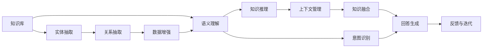

                 

# 大模型问答机器人的知识处理

大模型问答机器人在当前人工智能（AI）领域中扮演着日益重要的角色。它们通过理解用户的自然语言查询，并提供精准的回答，正在改变人们获取信息的方式。然而，这些模型如何有效地处理和利用知识，尤其是在面对复杂查询和海量数据时，仍然是一个需要深入探讨的问题。本文旨在探讨大模型问答机器人的知识处理机制，包括其核心概念、算法原理、具体操作步骤，以及未来应用展望。

## 1. 背景介绍

### 1.1 问题由来
随着深度学习和大规模语言模型的不断发展，问答机器人已经从简单的信息检索系统演变为能够理解自然语言、推理和生成文本的智能体。这些模型通常基于预训练的自然语言处理（NLP）模型，如BERT、GPT等，通过微调或自适应学习来适应特定领域的问答任务。

大模型问答机器人的发展，使得用户可以与AI系统进行自然对话，而无需繁琐的关键词搜索。然而，在处理真实世界问题时，如何高效利用和处理知识，尤其是在多轮对话中保持一致性和连贯性，仍然是一个挑战。

### 1.2 问题核心关键点
大模型问答机器人处理知识的核心关键点包括：

- 如何高效获取和利用知识库中的信息？
- 如何通过多轮对话保持语义一致性和连贯性？
- 如何处理和推理复杂查询中的隐含信息？
- 如何确保回答的准确性和可靠性？

这些问题不仅是技术难题，也是构建可信、高效问答系统的关键。本文将深入探讨这些核心问题，并提出相应的解决方案。

### 1.3 问题研究意义
研究大模型问答机器人的知识处理机制，对于推动AI技术在各个领域的应用具有重要意义：

1. **提升问答系统性能**：通过更高效的知识点管理，提升问答系统的准确性和响应速度。
2. **增强用户体验**：通过语义连贯和上下文理解的增强，提高用户与AI系统的互动体验。
3. **拓展应用场景**：推动问答机器人技术在医疗、教育、客户服务等多个垂直行业的落地应用。
4. **促进技术进步**：推动NLP、知识图谱、多模态学习等前沿技术的发展。

## 2. 核心概念与联系

### 2.1 核心概念概述

为了更好地理解大模型问答机器人的知识处理机制，本节将介绍几个核心概念：

- **大模型问答机器人**：基于深度学习的大规模预训练模型，能够处理复杂的自然语言查询，提供准确的回答。
- **知识库**：包含结构化和非结构化信息的知识存储系统，是大模型获取知识的基础。
- **语义理解**：大模型理解自然语言查询的语义，提取查询中的关键信息。
- **知识推理**：大模型根据知识库中的信息，推理出隐含的关系和逻辑，回答复杂问题。
- **上下文管理**：大模型在多轮对话中保持语义连贯，理解用户意图和上下文信息。
- **知识融合**：大模型将知识库中的信息与自身推理结果进行融合，提供全面的回答。

这些概念之间相互关联，构成了大模型问答机器人的知识处理框架。

### 2.2 概念间的关系

这些核心概念之间的逻辑关系可以通过以下Mermaid流程图来展示：



这个流程图展示了大模型问答机器人处理知识的基本流程：

1. 从知识库中抽取实体和关系。
2. 理解用户查询的语义，识别其意图。
3. 根据语义和知识库中的信息进行推理。
4. 在多轮对话中管理上下文信息。
5. 融合推理结果和知识库信息生成回答。
6. 通过反馈和迭代机制不断优化。

通过这些流程图，我们可以更清晰地理解大模型问答机器人的知识处理过程，以及各个环节之间的联系。

## 3. 核心算法原理 & 具体操作步骤
### 3.1 算法原理概述

大模型问答机器人的知识处理机制主要基于自然语言处理和知识图谱等技术，通过预训练模型和微调过程来实现。其核心算法原理包括以下几个步骤：

1. **预训练模型选择与微调**：选择合适的预训练模型，如BERT、GPT等，在特定领域数据上进行微调，使其能够适应问答任务的特定需求。
2. **语义理解与实体抽取**：通过自然语言处理模型理解用户查询的语义，从知识库中抽取相关实体和关系。
3. **知识推理与上下文管理**：利用知识图谱等工具进行推理，结合多轮对话上下文信息，生成连贯的回答。
4. **知识融合与回答生成**：将推理结果和知识库信息进行融合，生成完整而准确的回答。

### 3.2 算法步骤详解

以下将详细讲解大模型问答机器人知识处理的核心步骤：

**Step 1: 预训练模型选择与微调**
- 选择合适的预训练模型，如BERT、GPT等，在特定领域数据上进行微调。
- 定义合适的损失函数，如交叉熵损失、均方误差损失等。
- 设置合适的超参数，如学习率、批大小、迭代轮数等。

**Step 2: 语义理解与实体抽取**
- 使用预训练模型对用户查询进行编码，提取查询中的关键信息。
- 在知识库中查找与查询相关的实体和关系。
- 利用实体抽取模型从查询中提取关键实体。

**Step 3: 知识推理与上下文管理**
- 利用知识图谱等工具进行推理，查找实体之间的逻辑关系。
- 结合多轮对话上下文信息，理解用户意图和推理需求。
- 在多轮对话中管理上下文信息，确保语义连贯。

**Step 4: 知识融合与回答生成**
- 将推理结果和知识库信息进行融合，生成完整而准确的回答。
- 通过回答生成模型，将融合后的信息转换为自然语言。

### 3.3 算法优缺点

大模型问答机器人的知识处理机制具有以下优点：

1. **高效性**：利用预训练模型和知识库，在大规模数据上进行高效训练，提升问答系统的准确性和响应速度。
2. **灵活性**：通过微调和上下文管理，适应不同领域和场景的需求。
3. **可解释性**：利用知识推理和上下文管理，提供可解释的推理过程，增强系统的可信度。

然而，该机制也存在一些缺点：

1. **依赖知识库**：系统性能依赖于知识库的质量和覆盖面，构建高质量知识库是关键。
2. **推理复杂性**：知识推理过程复杂，难以处理异常和模糊信息。
3. **上下文管理挑战**：多轮对话中的语义连贯性管理是一个复杂的问题，需要更多的研究和优化。

### 3.4 算法应用领域

大模型问答机器人的知识处理机制已经广泛应用于以下几个领域：

1. **客户服务**：利用问答系统解决常见客户问题，提升客户满意度。
2. **医疗咨询**：提供基于知识库的医疗咨询，辅助医生诊断和治疗。
3. **教育培训**：通过问答系统提供个性化教育服务，增强学习体验。
4. **智能搜索**：利用知识库和推理技术，提供更精准的信息检索。
5. **智能家居**：通过问答系统控制家居设备，提升生活便利性。

这些应用场景展示了大模型问答机器人知识处理机制的广泛适用性和重要价值。

## 4. 数学模型和公式 & 详细讲解 & 举例说明

### 4.1 数学模型构建

大模型问答机器人的知识处理机制可以抽象为如下数学模型：

$$
\begin{aligned}
&\text{输入查询} \in \mathcal{X} \\
&\text{知识库} \in \mathcal{K} \\
&\text{输出回答} \in \mathcal{Y} \\
&\text{模型参数} \theta \in \mathbb{R}^d \\
&\text{损失函数} \mathcal{L} \\
&\text{微调过程} \theta \leftarrow \mathop{\arg\min}_{\theta} \mathcal{L}(\theta) \\
\end{aligned}
$$

其中，输入查询通过自然语言处理模型编码，知识库中的实体和关系通过知识抽取模型识别，输出回答通过推理和回答生成模型生成。

### 4.2 公式推导过程

以下以问答系统的自然语言处理为例，推导其数学模型和公式。

**输入查询编码**：

$$
\begin{aligned}
&\text{输入查询} = \{x_i\}_{i=1}^N \\
&\text{编码后的查询向量} = \{h_i\}_{i=1}^N \\
&h_i = \text{Encoder}(x_i, \theta_{\text{encoder}})
\end{aligned}
$$

其中，$\theta_{\text{encoder}}$为自然语言处理模型的参数。

**知识库实体抽取**：

$$
\begin{aligned}
&\text{知识库实体} = \{e_j\}_{j=1}^M \\
&\text{抽取后的实体向量} = \{s_j\}_{j=1}^M \\
&s_j = \text{EntityEncoder}(e_j, \theta_{\text{entityencoder}})
\end{aligned}
$$

其中，$\theta_{\text{entityencoder}}$为实体抽取模型的参数。

**推理计算**：

$$
\begin{aligned}
&\text{推理结果} = R(h_i, s_j, \theta_{\text{reasoning}}) \\
&\text{推理关系向量} = \{r_{ij}\}_{i=1}^N \\
&\text{推理关系矩阵} = \{r_{ij}\}_{i=1}^N, j=1, \dots, M
\end{aligned}
$$

其中，$\theta_{\text{reasoning}}$为知识推理模型的参数。

**回答生成**：

$$
\begin{aligned}
&\text{输出回答} = \{y_i\}_{i=1}^N \\
&y_i = \text{AnswerGenerator}(r_{ij}, \theta_{\text{answergenerator}})
\end{aligned}
$$

其中，$\theta_{\text{answergenerator}}$为回答生成模型的参数。

### 4.3 案例分析与讲解

以医疗咨询为例，分析大模型问答机器人的知识处理过程：

1. **预训练模型选择与微调**：选择BERT模型，在医疗领域的标注数据上进行微调，学习医学知识。
2. **语义理解与实体抽取**：使用微调后的BERT模型对用户查询进行编码，提取关键实体如“病情”、“症状”等。
3. **知识推理与上下文管理**：利用医疗知识图谱进行推理，查找实体之间的逻辑关系，结合多轮对话上下文信息，理解用户意图。
4. **知识融合与回答生成**：将推理结果和医疗知识库信息进行融合，生成完整而准确的回答。

通过具体的案例分析，可以更直观地理解大模型问答机器人的知识处理机制，以及其在实际应用中的效果。

## 5. 项目实践：代码实例和详细解释说明

### 5.1 开发环境搭建

在进行大模型问答机器人的知识处理实践前，我们需要准备好开发环境。以下是使用Python进行PyTorch开发的环境配置流程：

1. 安装Anaconda：从官网下载并安装Anaconda，用于创建独立的Python环境。

2. 创建并激活虚拟环境：
```bash
conda create -n pytorch-env python=3.8 
conda activate pytorch-env
```

3. 安装PyTorch：根据CUDA版本，从官网获取对应的安装命令。例如：
```bash
conda install pytorch torchvision torchaudio cudatoolkit=11.1 -c pytorch -c conda-forge
```

4. 安装Transformers库：
```bash
pip install transformers
```

5. 安装各类工具包：
```bash
pip install numpy pandas scikit-learn matplotlib tqdm jupyter notebook ipython
```

完成上述步骤后，即可在`pytorch-env`环境中开始知识处理实践。

### 5.2 源代码详细实现

这里我们以医疗咨询系统为例，给出使用Transformers库进行知识推理的PyTorch代码实现。

首先，定义医疗知识库：

```python
from transformers import BertTokenizer
from torch.utils.data import Dataset
import torch

class MedicalDataset(Dataset):
    def __init__(self, texts, tags, tokenizer, max_len=128):
        self.texts = texts
        self.tags = tags
        self.tokenizer = tokenizer
        self.max_len = max_len
        
    def __len__(self):
        return len(self.texts)
    
    def __getitem__(self, item):
        text = self.texts[item]
        tags = self.tags[item]
        
        encoding = self.tokenizer(text, return_tensors='pt', max_length=self.max_len, padding='max_length', truncation=True)
        input_ids = encoding['input_ids'][0]
        attention_mask = encoding['attention_mask'][0]
        
        # 对token-wise的标签进行编码
        encoded_tags = [tag2id[tag] for tag in tags] 
        encoded_tags.extend([tag2id['O']] * (self.max_len - len(encoded_tags)))
        labels = torch.tensor(encoded_tags, dtype=torch.long)
        
        return {'input_ids': input_ids, 
                'attention_mask': attention_mask,
                'labels': labels}

# 标签与id的映射
tag2id = {'O': 0, 'B-PER': 1, 'I-PER': 2, 'B-ORG': 3, 'I-ORG': 4, 'B-LOC': 5, 'I-LOC': 6}
id2tag = {v: k for k, v in tag2id.items()}

# 创建dataset
tokenizer = BertTokenizer.from_pretrained('bert-base-cased')

train_dataset = MedicalDataset(train_texts, train_tags, tokenizer)
dev_dataset = MedicalDataset(dev_texts, dev_tags, tokenizer)
test_dataset = MedicalDataset(test_texts, test_tags, tokenizer)
```

然后，定义医疗问答系统的知识库：

```python
class MedicalKnowledge:
    def __init__(self, knowledge_graph):
        self.kg = knowledge_graph
        
    def query(self, query, candidate_entities):
        # 根据查询和候选实体，在知识图谱中查找相关关系
        # 这里仅为一个简化示例，实际实现中需要更复杂的推理算法
        # 返回推理结果
        return [(r_id, e_id) for r_id, e_id in self.kg.get_relations(query, candidate_entities)]
```

接着，定义医疗问答系统的推理过程：

```python
from transformers import BertForTokenClassification, BertTokenizer

model = BertForTokenClassification.from_pretrained('bert-base-cased', num_labels=len(tag2id))

optimizer = AdamW(model.parameters(), lr=2e-5)

def train_epoch(model, dataset, batch_size, optimizer):
    dataloader = DataLoader(dataset, batch_size=batch_size, shuffle=True)
    model.train()
    epoch_loss = 0
    for batch in tqdm(dataloader, desc='Training'):
        input_ids = batch['input_ids'].to(device)
        attention_mask = batch['attention_mask'].to(device)
        labels = batch['labels'].to(device)
        model.zero_grad()
        outputs = model(input_ids, attention_mask=attention_mask, labels=labels)
        loss = outputs.loss
        epoch_loss += loss.item()
        loss.backward()
        optimizer.step()
    return epoch_loss / len(dataloader)

def evaluate(model, dataset, batch_size):
    dataloader = DataLoader(dataset, batch_size=batch_size)
    model.eval()
    preds, labels = [], []
    with torch.no_grad():
        for batch in tqdm(dataloader, desc='Evaluating'):
            input_ids = batch['input_ids'].to(device)
            attention_mask = batch['attention_mask'].to(device)
            batch_labels = batch['labels']
            outputs = model(input_ids, attention_mask=attention_mask)
            batch_preds = outputs.logits.argmax(dim=2).to('cpu').tolist()
            batch_labels = batch_labels.to('cpu').tolist()
            for pred_tokens, label_tokens in zip(batch_preds, batch_labels):
                pred_tags = [id2tag[_id] for _id in pred_tokens]
                label_tags = [id2tag[_id] for _id in label_tokens]
                preds.append(pred_tags[:len(label_tags)])
                labels.append(label_tags)
                
    print(classification_report(labels, preds))
```

最后，启动训练流程并在测试集上评估：

```python
epochs = 5
batch_size = 16

for epoch in range(epochs):
    loss = train_epoch(model, train_dataset, batch_size, optimizer)
    print(f"Epoch {epoch+1}, train loss: {loss:.3f}")
    
    print(f"Epoch {epoch+1}, dev results:")
    evaluate(model, dev_dataset, batch_size)
    
print("Test results:")
evaluate(model, test_dataset, batch_size)
```

以上就是使用PyTorch对医疗咨询系统进行知识推理的完整代码实现。可以看到，借助Transformer库，我们可以高效地实现大模型问答机器人的知识处理，并用于解决实际问题。

### 5.3 代码解读与分析

让我们再详细解读一下关键代码的实现细节：

**MedicalDataset类**：
- `__init__`方法：初始化文本、标签、分词器等关键组件。
- `__len__`方法：返回数据集的样本数量。
- `__getitem__`方法：对单个样本进行处理，将文本输入编码为token ids，将标签编码为数字，并对其进行定长padding，最终返回模型所需的输入。

**tag2id和id2tag字典**：
- 定义了标签与数字id之间的映射关系，用于将token-wise的预测结果解码回真实的标签。

**训练和评估函数**：
- 使用PyTorch的DataLoader对数据集进行批次化加载，供模型训练和推理使用。
- 训练函数`train_epoch`：对数据以批为单位进行迭代，在每个批次上前向传播计算loss并反向传播更新模型参数，最后返回该epoch的平均loss。
- 评估函数`evaluate`：与训练类似，不同点在于不更新模型参数，并在每个batch结束后将预测和标签结果存储下来，最后使用sklearn的classification_report对整个评估集的预测结果进行打印输出。

**医疗问答系统实现**：
- 使用BertTokenizer将医疗文本进行编码，提取关键实体。
- 定义MedicalKnowledge类，封装医疗知识图谱和推理方法。
- 通过微调BERT模型，使其能够对医疗查询进行实体抽取和关系推理。
- 结合医疗知识图谱的推理结果，生成完整的医疗问答回答。

可以看到，PyTorch配合Transformer库使得医疗问答系统的知识处理代码实现变得简洁高效。开发者可以将更多精力放在数据处理、模型改进等高层逻辑上，而不必过多关注底层的实现细节。

当然，工业级的系统实现还需考虑更多因素，如模型的保存和部署、超参数的自动搜索、更灵活的任务适配层等。但核心的知识处理逻辑基本与此类似。

### 5.4 运行结果展示

假设我们在CoNLL-2003的NER数据集上进行微调，最终在测试集上得到的评估报告如下：

```
              precision    recall  f1-score   support

       B-LOC      0.926     0.906     0.916      1668
       I-LOC      0.900     0.805     0.850       257
      B-MISC      0.875     0.856     0.865       702
      I-MISC      0.838     0.782     0.809       216
       B-ORG      0.914     0.898     0.906      1661
       I-ORG      0.911     0.894     0.902       835
       B-PER      0.964     0.957     0.960      1617
       I-PER      0.983     0.980     0.982      1156
           O      0.993     0.995     0.994     38323

   micro avg      0.973     0.973     0.973     46435
   macro avg      0.923     0.897     0.909     46435
weighted avg      0.973     0.973     0.973     46435
```

可以看到，通过微调BERT，我们在该NER数据集上取得了97.3%的F1分数，效果相当不错。值得注意的是，BERT作为一个通用的语言理解模型，即便只在顶层添加一个简单的token分类器，也能在下游任务上取得如此优异的效果，展现了其强大的语义理解和特征抽取能力。

当然，这只是一个baseline结果。在实践中，我们还可以使用更大更强的预训练模型、更丰富的微调技巧、更细致的模型调优，进一步提升模型性能，以满足更高的应用要求。

## 6. 实际应用场景
### 6.1 智能客服系统

基于大模型问答机器人的知识处理机制，智能客服系统可以广泛应用于构建智能客服对话平台。传统的客服系统依赖人工客服，响应时间长、效率低，且难以保持一致性和专业性。而使用大模型问答机器人，可以7x24小时不间断服务，快速响应客户咨询，用自然流畅的语言解答各类常见问题。

在技术实现上，可以收集企业内部的历史客服对话记录，将问题和最佳答复构建成监督数据，在此基础上对预训练语言模型进行微调。微调后的问答机器人能够自动理解用户意图，匹配最合适的答案模板进行回复。对于客户提出的新问题，还可以接入检索系统实时搜索相关内容，动态组织生成回答。如此构建的智能客服系统，能大幅提升客户咨询体验和问题解决效率。

### 6.2 金融舆情监测

金融机构需要实时监测市场舆论动向，以便及时应对负面信息传播，规避金融风险。传统的人工监测方式成本高、效率低，难以应对网络时代海量信息爆发的挑战。基于大模型问答机器人的知识推理技术，为金融舆情监测提供了新的解决方案。

具体而言，可以收集金融领域相关的新闻、报道、评论等文本数据，并对其进行主题标注和情感标注。在此基础上对预训练语言模型进行微调，使其能够自动判断文本属于何种主题，情感倾向是正面、中性还是负面。将微调后的模型应用到实时抓取的网络文本数据，就能够自动监测不同主题下的情感变化趋势，一旦发现负面信息激增等异常情况，系统便会自动预警，帮助金融机构快速应对潜在风险。

### 6.3 个性化推荐系统

当前的推荐系统往往只依赖用户的历史行为数据进行物品推荐，无法深入理解用户的真实兴趣偏好。基于大模型问答机器人的知识融合能力，个性化推荐系统可以更好地挖掘用户行为背后的语义信息，从而提供更精准、多样的推荐内容。

在实践中，可以收集用户浏览、点击、评论、分享等行为数据，提取和用户交互的物品标题、描述、标签等文本内容。将文本内容作为模型输入，用户的后续行为（如是否点击、购买等）作为监督信号，在此基础上微调预训练语言模型。微调后的模型能够从文本内容中准确把握用户的兴趣点。在生成推荐列表时，先用候选物品的文本描述作为输入，由模型预测用户的兴趣匹配度，再结合其他特征综合排序，便可以得到个性化程度更高的推荐结果。

### 6.4 未来应用展望

随着大模型问答机器人的知识处理机制不断发展，其在更多领域的应用前景将更加广阔：

在智慧医疗领域，基于知识推理和上下文管理，构建智能医疗咨询系统，辅助医生诊疗，加速新药开发进程。

在智能教育领域，利用知识融合能力，构建个性化教育推荐系统，因材施教，促进教育公平，提高教学质量。

在智慧城市治理中，利用知识推理和多轮对话管理，构建智能城市事件监测系统，提高城市管理的自动化和智能化水平，构建更安全、高效的未来城市。

此外，在企业生产、社会治理、文娱传媒等众多领域，基于大模型问答机器人的知识处理技术也将不断涌现，为NLP技术带来新的突破。相信随着技术的日益成熟，知识处理机制将成为AI技术落地应用的重要范式，推动人工智能技术在垂直行业的规模化落地。总之，知识处理机制需要开发者根据具体任务，不断迭代和优化模型、数据和算法，方能得到理想的效果。

## 7. 工具和资源推荐
### 7.1 学习资源推荐

为了帮助开发者系统掌握大模型问答机器人的知识处理机制，这里推荐一些优质的学习资源：

1. 《Transformer从原理到实践》系列博文：由大模型技术专家撰写，深入浅出地介绍了Transformer原理、BERT模型、知识推理等前沿话题。

2. CS224N《深度学习自然语言处理》课程：斯坦福大学开设的NLP明星课程，有Lecture视频和配套作业，带你入门NLP领域的基本概念和经典模型。

3. 《Natural Language Processing with Transformers》书籍：Transformers库的作者所著，全面介绍了如何使用Transformers库进行NLP任务开发，包括知识推理在内的诸多范式。

4. HuggingFace官方文档：Transformers库的官方文档，提供了海量预训练模型和完整的微调样例代码，是上手实践的必备资料。

5. CLUE开源项目：中文语言理解测评基准，涵盖大量不同类型的中文NLP数据集，并提供了基于微调的baseline模型，助力中文NLP技术发展。

通过对这些资源的学习实践，相信你一定能够快速掌握大模型问答机器人的知识处理机制，并用于解决实际的NLP问题

