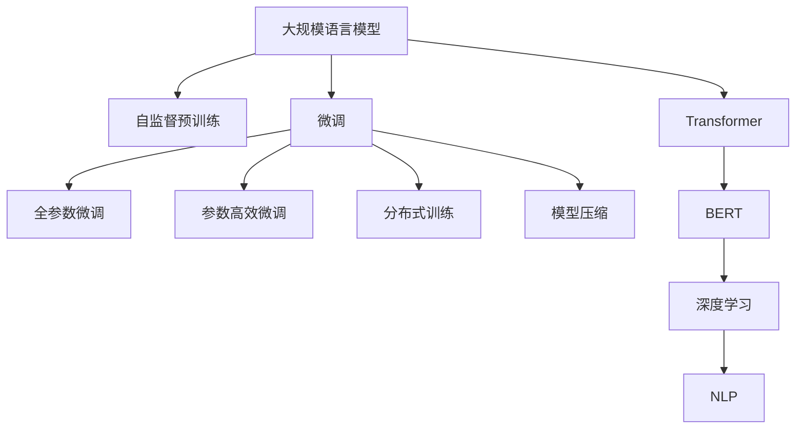
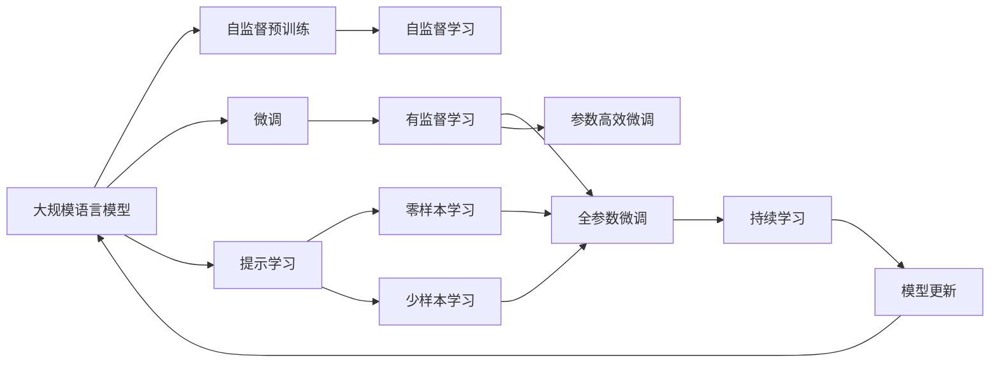
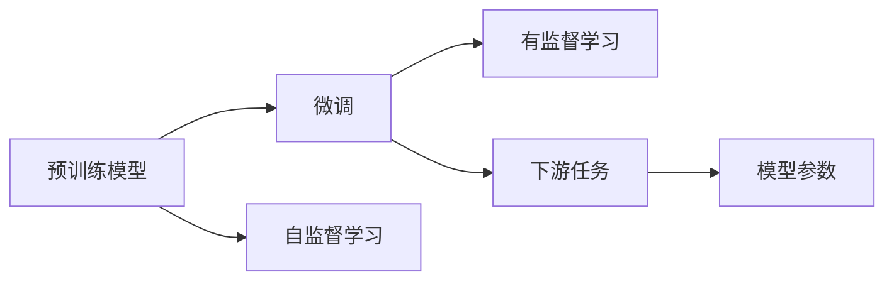
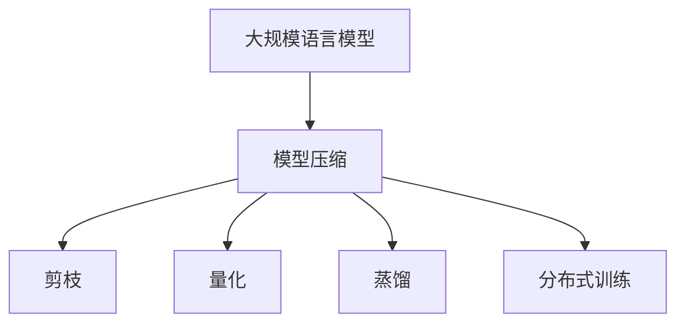

                 

# 大规模语言模型从理论到实践 代码结构

> 关键词：大语言模型,Transformer,BERT,深度学习,自然语言处理(NLP),代码结构,模型压缩,分布式训练

## 1. 背景介绍

### 1.1 问题由来
随着深度学习技术的快速发展，大规模语言模型（Large Language Models, LLMs）在自然语言处理（NLP）领域取得了突破性进展。这些模型通过在大规模无标签文本语料上进行预训练，学习到了丰富的语言知识和常识，具备强大的语言理解和生成能力。其中，以自回归（如GPT）或自编码（如BERT）模型为代表的大规模预训练语言模型（如BERT、GPT-3、T5等）在多个NLP任务上取得了优异的效果。

### 1.2 问题核心关键点
大规模语言模型的核心思想是通过自监督预训练获得语言表示，然后通过下游任务的少量标注数据进行微调，优化模型在特定任务上的性能。微调是使模型适应特定任务的重要步骤，可以通过选择适当的损失函数、优化器、正则化技术、学习率等进行模型优化。

### 1.3 问题研究意义
研究大规模语言模型的代码结构和微调技术，对于拓展模型的应用范围、提升下游任务的性能、加速NLP技术的产业化进程，具有重要意义。微调技术不仅能够降低开发成本，提高模型效果，还能促进技术创新，赋能各行各业数字化转型升级。

## 2. 核心概念与联系

### 2.1 核心概念概述

为了更好地理解大规模语言模型的微调过程，本文将介绍几个密切相关的核心概念：

- **大规模语言模型**：以自回归（如GPT）或自编码（如BERT）模型为代表的大规模预训练语言模型。通过在大规模无标签文本语料上进行预训练，学习到丰富的语言知识和常识。
- **自监督预训练**：在大规模无标签文本数据上，通过自监督学习任务训练语言模型的过程。常见的自监督任务包括掩码语言模型（如BERT）、语言建模（如GPT）等。
- **微调**：在预训练模型的基础上，使用下游任务的少量标注数据，通过有监督学习优化模型在特定任务上的性能。微调通常使用较小的学习率，以避免破坏预训练权重。
- **Transformer**：一种深度学习模型架构，广泛用于语言建模和机器翻译等NLP任务。其核心思想是通过多头自注意力机制实现高效的序列建模。
- **BERT**：一种基于自编码的预训练模型，通过掩码语言模型和下一句预测等任务进行训练，广泛应用于各种NLP任务。
- **深度学习**：一种基于神经网络的机器学习技术，通过多层次的非线性变换提取数据特征，广泛应用于图像、语音、文本等领域。
- **自然语言处理（NLP）**：研究如何让计算机理解和处理人类语言的技术，包括文本分类、命名实体识别、机器翻译、问答系统等。
- **代码结构**：指程序代码的组织形式和结构，包括类、函数、模块等组成元素的层次关系和依赖关系。
- **模型压缩**：通过剪枝、量化、蒸馏等方法减小模型的尺寸，降低计算资源消耗，提高推理速度。
- **分布式训练**：将大规模模型任务分解为多个子任务，分布在多个计算节点上并行训练，以加速模型训练过程。

这些核心概念之间的逻辑关系可以通过以下Mermaid流程图来展示：



这个流程图展示了从预训练到微调，再到分布式训练和模型压缩的完整过程。大规模语言模型首先在大规模无标签文本数据上进行自监督预训练，然后通过微调适应特定任务，最后通过分布式训练和模型压缩技术提升模型性能和计算效率。

### 2.2 概念间的关系

这些核心概念之间存在着紧密的联系，形成了大规模语言模型的完整生态系统。下面我们通过几个Mermaid流程图来展示这些概念之间的关系。

#### 2.2.1 大规模语言模型的学习范式



这个流程图展示了大规模语言模型的三种主要学习范式：自监督预训练、微调和提示学习。自监督预训练主要采用自监督学习方法，而微调则是有监督学习的过程。提示学习可以实现零样本和少样本学习，而全参数微调和参数高效微调都是在微调过程中优化模型性能的两种常见方法。持续学习旨在使模型能够不断学习新知识，同时避免遗忘旧知识。

#### 2.2.2 微调与预训练的关系



这个流程图展示了预训练与微调的关系。预训练模型通过自监督学习获得通用语言表示，然后通过微调适应特定任务，优化模型参数，以更好地匹配下游任务。

#### 2.2.3 模型压缩方法



这个流程图展示了模型压缩方法与大规模语言模型的关系。通过剪枝、量化、蒸馏等方法，可以减小模型尺寸，降低计算资源消耗，提高推理速度，同时保持模型的精度和性能。

## 3. 核心算法原理 & 具体操作步骤

### 3.1 算法原理概述

大规模语言模型的微调过程本质上是一个有监督学习的过程。其核心思想是通过下游任务的少量标注数据，优化模型在特定任务上的性能。具体而言，微调过程可以大致分为以下几个步骤：

1. **准备预训练模型和数据集**：选择合适的预训练语言模型（如BERT、GPT等）作为初始化参数，准备下游任务的少量标注数据集。
2. **添加任务适配层**：根据下游任务类型，在预训练模型顶层设计合适的输出层和损失函数。
3. **设置微调超参数**：选择合适的优化器（如AdamW、SGD等）及其参数，设置学习率、批大小、迭代轮数等。
4. **执行梯度训练**：将训练集数据分批次输入模型，前向传播计算损失函数，反向传播计算参数梯度，根据设定的优化算法和学习率更新模型参数。
5. **测试和部署**：在测试集上评估微调后模型性能，集成到实际应用系统中，持续收集新数据，定期重新微调模型。

### 3.2 算法步骤详解

以下是对大规模语言模型微调的具体操作步骤的详细介绍：

**Step 1: 准备预训练模型和数据集**

- **选择合适的预训练语言模型**：常用的预训练模型包括BERT、GPT等，需要根据具体任务选择合适的模型。
- **准备下游任务的少量标注数据集**：通常需要收集几百到几千条标注数据，用于微调模型。数据集应与预训练数据的分布尽可能接近。

**Step 2: 添加任务适配层**

- **根据任务类型设计输出层**：对于分类任务，通常需要添加线性分类器；对于生成任务，通常需要添加语言模型的解码器。
- **选择损失函数**：常用的损失函数包括交叉熵损失、均方误差损失等。

**Step 3: 设置微调超参数**

- **选择合适的优化器**：常用的优化器包括AdamW、SGD等。
- **设置学习率**：通常需要设置较小的学习率，避免破坏预训练权重。
- **设置批大小和迭代轮数**：根据计算资源和模型大小，选择合适的批大小和迭代轮数。

**Step 4: 执行梯度训练**

- **分批次输入数据**：将训练集数据分批次输入模型，每次一个batch。
- **前向传播计算损失函数**：将输入数据送入模型，计算损失函数。
- **反向传播计算梯度**：使用自动微分技术计算损失函数对模型参数的梯度。
- **更新模型参数**：根据优化算法和学习率，更新模型参数。
- **周期性评估模型性能**：在验证集上评估模型性能，根据性能指标决定是否触发Early Stopping。

**Step 5: 测试和部署**

- **在测试集上评估模型性能**：使用测试集数据评估微调后模型的性能，与预训练模型进行对比。
- **集成到应用系统中**：将微调后的模型集成到实际应用系统中，进行实时推理。
- **持续收集新数据**：定期收集新数据，重新微调模型，以适应数据分布的变化。

### 3.3 算法优缺点

大规模语言模型微调具有以下优点：

- **简单高效**：仅需少量标注数据，即可通过微调获得显著性能提升。
- **通用适用**：适用于各种NLP任务，只需设计合适的任务适配层即可。
- **参数高效**：通过参数高效微调方法，可以在不增加模型参数量的情况下，优化模型性能。
- **效果显著**：在学术界和工业界的众多任务上，基于微调的方法已经刷新了多项SOTA。

同时，该方法也存在以下缺点：

- **依赖标注数据**：微调效果很大程度上取决于标注数据的质量和数量，获取高质量标注数据的成本较高。
- **迁移能力有限**：当目标任务与预训练数据的分布差异较大时，微调的性能提升有限。
- **负面效果传递**：预训练模型的固有偏见、有害信息等，可能通过微调传递到下游任务，造成负面影响。
- **可解释性不足**：微调模型的决策过程通常缺乏可解释性，难以对其推理逻辑进行分析和调试。

尽管存在这些缺点，但就目前而言，基于监督学习的微调方法仍然是大规模语言模型应用的主流范式。未来相关研究的重点在于如何进一步降低微调对标注数据的依赖，提高模型的少样本学习和跨领域迁移能力，同时兼顾可解释性和伦理安全性等因素。

### 3.4 算法应用领域

大规模语言模型微调在NLP领域已经得到了广泛的应用，覆盖了几乎所有常见任务，例如：

- **文本分类**：如情感分析、主题分类、意图识别等。通过微调使模型学习文本-标签映射。
- **命名实体识别**：识别文本中的人名、地名、机构名等特定实体。通过微调使模型掌握实体边界和类型。
- **关系抽取**：从文本中抽取实体之间的语义关系。通过微调使模型学习实体-关系三元组。
- **问答系统**：对自然语言问题给出答案。将问题-答案对作为微调数据，训练模型学习匹配答案。
- **机器翻译**：将源语言文本翻译成目标语言。通过微调使模型学习语言-语言映射。
- **文本摘要**：将长文本压缩成简短摘要。将文章-摘要对作为微调数据，使模型学习抓取要点。
- **对话系统**：使机器能够与人自然对话。将多轮对话历史作为上下文，微调模型进行回复生成。

除了上述这些经典任务外，大规模语言模型微调还被创新性地应用到更多场景中，如可控文本生成、常识推理、代码生成、数据增强等，为NLP技术带来了全新的突破。随着预训练模型和微调方法的不断进步，相信NLP技术将在更广阔的应用领域大放异彩。

## 4. 数学模型和公式 & 详细讲解 & 举例说明

### 4.1 数学模型构建

在大规模语言模型的微调过程中，通常需要构建数学模型来描述模型和数据之间的关系。我们以二分类任务为例，构建数学模型如下：

记预训练语言模型为 $M_{\theta}$，其中 $\theta$ 为预训练得到的模型参数。假设微调任务的训练集为 $D=\{(x_i,y_i)\}_{i=1}^N, x_i \in \mathcal{X}, y_i \in \{0,1\}$。定义模型 $M_{\theta}$ 在输入 $x$ 上的输出为 $\hat{y}=M_{\theta}(x) \in [0,1]$，表示样本属于正类的概率。定义损失函数 $\ell$，用于衡量模型预测输出与真实标签之间的差异。常用的损失函数包括交叉熵损失、均方误差损失等。

定义模型 $M_{\theta}$ 在数据样本 $(x,y)$ 上的损失函数为 $\ell(M_{\theta}(x),y)$，则在数据集 $D$ 上的经验风险为：

$$
\mathcal{L}(\theta) = \frac{1}{N} \sum_{i=1}^N \ell(M_{\theta}(x_i),y_i)
$$

微调的优化目标是最小化经验风险，即找到最优参数：

$$
\theta^* = \mathop{\arg\min}_{\theta} \mathcal{L}(\theta)
$$

在实践中，我们通常使用基于梯度的优化算法（如AdamW、SGD等）来近似求解上述最优化问题。设 $\eta$ 为学习率，$\lambda$ 为正则化系数，则参数的更新公式为：

$$
\theta \leftarrow \theta - \eta \nabla_{\theta}\mathcal{L}(\theta) - \eta\lambda\theta
$$

其中 $\nabla_{\theta}\mathcal{L}(\theta)$ 为损失函数对参数 $\theta$ 的梯度，可通过反向传播算法高效计算。

### 4.2 公式推导过程

以下我们以二分类任务为例，推导交叉熵损失函数及其梯度的计算公式。

假设模型 $M_{\theta}$ 在输入 $x$ 上的输出为 $\hat{y}=M_{\theta}(x) \in [0,1]$，表示样本属于正类的概率。真实标签 $y \in \{0,1\}$。则二分类交叉熵损失函数定义为：

$$
\ell(M_{\theta}(x),y) = -[y\log \hat{y} + (1-y)\log (1-\hat{y})]
$$

将其代入经验风险公式，得：

$$
\mathcal{L}(\theta) = -\frac{1}{N}\sum_{i=1}^N [y_i\log M_{\theta}(x_i)+(1-y_i)\log(1-M_{\theta}(x_i))]
$$

根据链式法则，损失函数对参数 $\theta_k$ 的梯度为：

$$
\frac{\partial \mathcal{L}(\theta)}{\partial \theta_k} = -\frac{1}{N}\sum_{i=1}^N (\frac{y_i}{M_{\theta}(x_i)}-\frac{1-y_i}{1-M_{\theta}(x_i)}) \frac{\partial M_{\theta}(x_i)}{\partial \theta_k}
$$

其中 $\frac{\partial M_{\theta}(x_i)}{\partial \theta_k}$ 可进一步递归展开，利用自动微分技术完成计算。

在得到损失函数的梯度后，即可带入参数更新公式，完成模型的迭代优化。重复上述过程直至收敛，最终得到适应下游任务的最优模型参数 $\theta^*$。

### 4.3 案例分析与讲解

下面我们以二分类任务为例，给出使用PyTorch对BERT模型进行微调的PyTorch代码实现。

```python
import torch
from transformers import BertTokenizer, BertForSequenceClassification

# 加载预训练BERT模型和分词器
model = BertForSequenceClassification.from_pretrained('bert-base-cased', num_labels=2)
tokenizer = BertTokenizer.from_pretrained('bert-base-cased')

# 准备训练集数据
train_dataset = torch.utils.data.Dataset(train_data, tokenizer)

# 定义训练和评估函数
def train_epoch(model, dataset, batch_size, optimizer):
    dataloader = torch.utils.data.DataLoader(dataset, batch_size=batch_size, shuffle=True)
    model.train()
    epoch_loss = 0
    for batch in dataloader:
        inputs = batch['input_ids'].to(device)
        labels = batch['labels'].to(device)
        model.zero_grad()
        outputs = model(inputs)
        loss = outputs.loss
        epoch_loss += loss.item()
        loss.backward()
        optimizer.step()
    return epoch_loss / len(dataloader)

def evaluate(model, dataset, batch_size):
    dataloader = torch.utils.data.DataLoader(dataset, batch_size=batch_size)
    model.eval()
    preds, labels = [], []
    with torch.no_grad():
        for batch in dataloader:
            inputs = batch['input_ids'].to(device)
            labels = batch['labels'].to(device)
            outputs = model(inputs)
            preds.append(outputs.logits.argmax(dim=1).tolist())
            labels.append(labels.tolist())
    print(classification_report(torch.tensor(labels), torch.tensor(preds)))

# 训练和评估
device = torch.device('cuda') if torch.cuda.is_available() else torch.device('cpu')
model.to(device)
optimizer = torch.optim.AdamW(model.parameters(), lr=2e-5)

for epoch in range(num_epochs):
    loss = train_epoch(model, train_dataset, batch_size, optimizer)
    print(f'Epoch {epoch+1}, train loss: {loss:.3f}')

    print(f'Epoch {epoch+1}, dev results:')
    evaluate(model, dev_dataset, batch_size)
    
print('Test results:')
evaluate(model, test_dataset, batch_size)
```

以上就是使用PyTorch对BERT进行二分类任务微调的完整代码实现。可以看到，借助Transformers库，代码实现相对简洁高效，开发者可以将更多精力放在数据处理、模型改进等高层逻辑上，而不必过多关注底层的实现细节。

## 5. 项目实践：代码实例和详细解释说明

### 5.1 开发环境搭建

在进行微调实践前，我们需要准备好开发环境。以下是使用Python进行PyTorch开发的环境配置流程：

1. 安装Anaconda：从官网下载并安装Anaconda，用于创建独立的Python环境。
2. 创建并激活虚拟环境：
```bash
conda create -n pytorch-env python=3.8 
conda activate pytorch-env
```
3. 安装PyTorch：根据CUDA版本，从官网获取对应的安装命令。例如：
```bash
conda install pytorch torchvision torchaudio cudatoolkit=11.1 -c pytorch -c conda-forge
```
4. 安装Transformers库：
```bash
pip install transformers
```
5. 安装各类工具包：
```bash
pip install numpy pandas scikit-learn matplotlib tqdm jupyter notebook ipython
```

完成上述步骤后，即可在`pytorch-env`环境中开始微调实践。

### 5.2 源代码详细实现

下面我们以命名实体识别(NER)任务为例，给出使用Transformers库对BERT模型进行微调的PyTorch代码实现。

```python
from transformers import BertTokenizer, BertForTokenClassification, AdamW
import torch
from torch.utils.data import Dataset, DataLoader
from sklearn.metrics import classification_report

# 加载预训练BERT模型和分词器
model = BertForTokenClassification.from_pretrained('bert-base-cased', num_labels=7)
tokenizer = BertTokenizer.from_pretrained('bert-base-cased')

# 准备训练集数据
class NERDataset(Dataset):
    def __init__(self, texts, tags):
        self.texts = texts
        self.tags = tags
        self.tokenizer = tokenizer

    def __len__(self):
        return len(self.texts)

    def __getitem__(self, idx):
        text = self.texts[idx]
        tag = self.tags[idx]
        encoding = self.tokenizer(text, return_tensors='pt', padding=True, truncation=True)
        input_ids = encoding['input_ids'].squeeze()
        attention_mask = encoding['attention_mask'].squeeze()
        labels = [tag2id[tag] for tag in tag if tag != 'O']
        labels += [tag2id['O']] * (encoding['input_ids'].shape[-1] - len(labels))
        labels = torch.tensor(labels, dtype=torch.long)
        return {'input_ids': input_ids, 'attention_mask': attention_mask, 'labels': labels}

# 标签与id的映射
tag2id = {'B-PER': 0, 'I-PER': 1, 'B-ORG': 2, 'I-ORG': 3, 'B-LOC': 4, 'I-LOC': 5, 'O': 6}
id2tag = {v: k for k, v in tag2id.items()}

# 准备数据集
train_dataset = NERDataset(train_data, train_tags)
dev_dataset = NERDataset(dev_data, dev_tags)
test_dataset = NERDataset(test_data, test_tags)

# 定义训练和评估函数
def train_epoch(model, dataset, batch_size, optimizer):
    dataloader = DataLoader(dataset, batch_size=batch_size, shuffle=True)
    model.train()
    epoch_loss = 0
    for batch in dataloader:
        input_ids = batch['input_ids'].to(device)
        attention_mask = batch['attention_mask'].to(device)
        labels = batch['labels'].to(device)
        model.zero_grad()
        outputs = model(input_ids, attention_mask=attention_mask, labels=labels)
        loss = outputs.loss
        epoch_loss += loss.item()
        loss.backward()
        optimizer.step()
    return epoch_loss / len(dataloader)

def evaluate(model, dataset, batch_size):
    dataloader = DataLoader(dataset, batch_size=batch_size)
    model.eval()
    preds, labels = [], []
    with torch.no_grad():
        for batch in dataloader:
            input_ids = batch['input_ids'].to(device)
            attention_mask = batch['attention_mask'].to(device)
            labels = batch['labels'].to(device)
            outputs = model(input_ids, attention_mask=attention_mask)
            preds.append(outputs.logits.argmax(dim=2).to('cpu').tolist())
            labels.append(labels.to('cpu').tolist())
    print(classification_report(torch.tensor(labels), torch.tensor(preds)))

# 训练和评估
device = torch.device('cuda') if torch.cuda.is_available() else torch.device('cpu')
model.to(device)
optimizer = AdamW(model.parameters(), lr=2e-5)

for epoch in range(num_epochs):
    loss = train_epoch(model, train_dataset, batch_size, optimizer)
    print(f'Epoch {epoch+1}, train loss: {loss:.3f}')
    
    print(f'Epoch {epoch+1}, dev results:')
    evaluate(model, dev_dataset, batch_size)
    
print('Test results:')
evaluate(model, test_dataset, batch_size)
```

以上就是使用PyTorch对BERT进行命名实体识别任务微调的完整代码实现。可以看到，借助Transformers库，代码实现相对简洁高效，开发者可以将更多精力放在数据处理、模型改进等高层逻辑上，而不必过多关注底层的实现细节。

## 6. 实际应用场景

### 6.1 智能客服系统

基于大语言模型微调的对话技术，可以广泛应用于智能客服系统的构建。传统客服往往需要配备大量人力，高峰期响应缓慢，且一致性和专业性难以保证。而使用微调后的对话模型，可以7x24小时不间断服务，快速响应客户咨询，用自然流畅的语言解答各类常见问题。

在技术实现上，可以收集企业内部的历史客服对话记录，将问题和最佳答复构建成监督数据，在此基础上对预训练对话模型进行微调。微调后的对话模型能够自动理解用户意图，匹配最合适的答案模板进行回复。对于客户提出的新问题，还可以接入检索系统实时搜索相关内容，动态组织生成回答。如此构建的智能客服系统，能大幅提升客户咨询体验和问题解决效率。

### 6.2 金融舆情监测

金融机构需要实时监测市场舆论动向，以便及时应对负面信息传播，规避金融风险。传统的人工监测方式成本高、效率低，难以应对网络时代海量信息爆发的挑战。基于大语言模型微调的文本分类和情感分析技术，为金融舆情监测提供了新的解决方案。

具体而言，可以收集金融领域相关的新闻、报道、评论等文本数据，并对其进行主题标注和情感标注。在此基础上对预训练语言模型进行微调，使其能够自动判断文本属于何种主题，情感倾向是正面、中性还是负面。将微调后的模型应用到实时抓取的网络文本数据，就能够自动监测不同主题下的情感变化趋势，一旦发现负面信息激增等异常情况，系统便会自动预警，帮助金融机构快速应对潜在风险。

### 6.3 个性化推荐系统

当前的推荐系统往往只依赖用户的历史行为数据进行物品推荐，无法深入理解用户的真实兴趣偏好。基于大语言模型微调技术，个性化推荐系统可以更好地挖掘用户行为背后的语义信息，从而提供更精准、多样的推荐内容。

在实践中，可以收集用户浏览、点击、评论、分享等行为数据，提取和用户交互的物品标题、描述、标签等文本内容。将文本内容作为模型输入，用户的后续行为（如是否点击、购买等）作为监督信号，在此基础上微调预训练语言模型。微调后的模型能够从文本内容中准确把握用户的兴趣点。在生成推荐列表时，先用候选物品的文本描述作为输入，由模型预测用户的兴趣匹配度，再结合其他特征综合排序，便可以得到个性化程度

