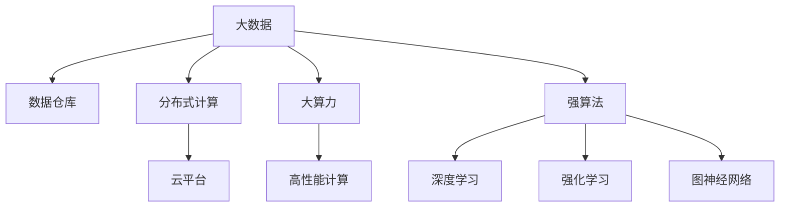
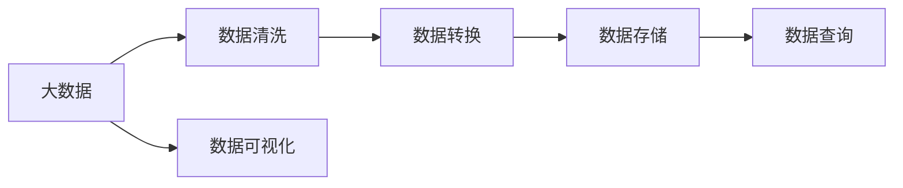
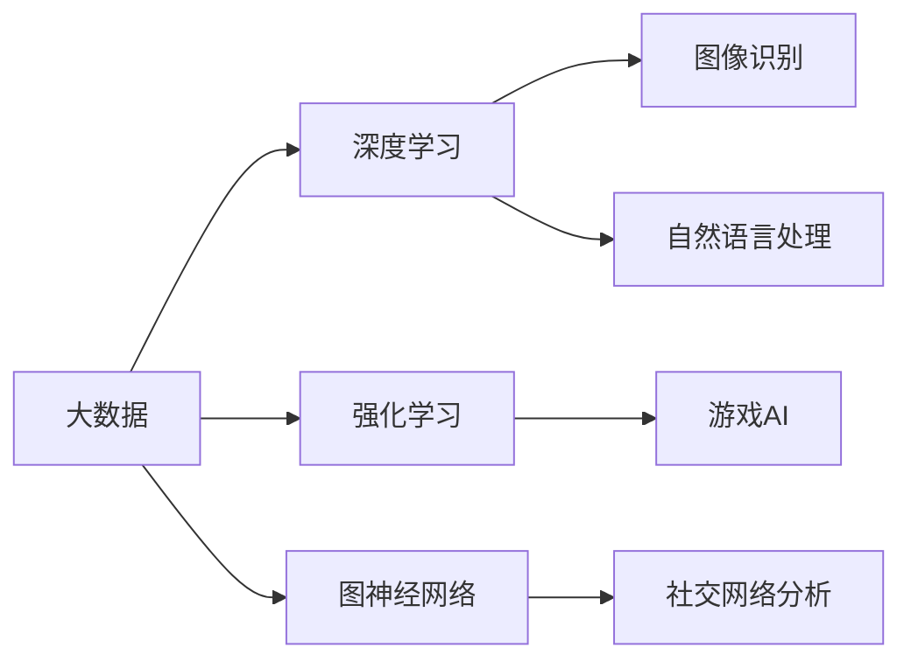
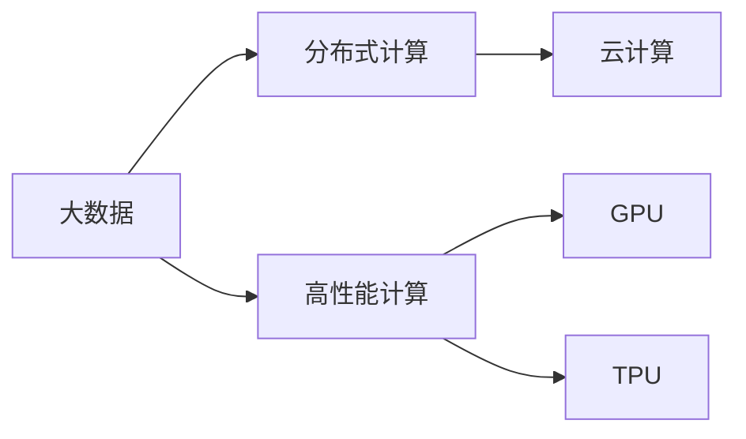
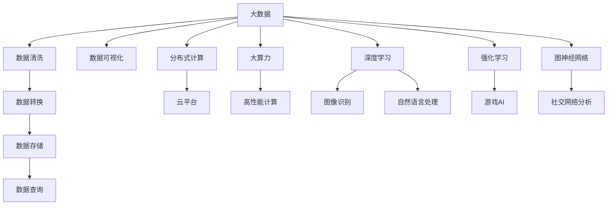

                 

# 大数据+大算力+强算法的方法

在大数据、大算力、强算法的驱动下，人工智能（AI）技术正迅速变革各行各业，带来了前所未有的创新和机遇。本文将从背景介绍、核心概念、算法原理、项目实践、应用场景等多个方面深入探讨大数据、大算力、强算法三者相结合的方法，揭示其背后的原理与技术，以期为AI技术的深入理解与应用提供指导。

## 1. 背景介绍

### 1.1 问题由来
随着信息技术的迅猛发展，大数据时代已经到来。各行各业产生了前所未有的海量数据，这些数据蕴含着巨大的价值和潜力。如何高效地存储、处理、分析这些数据，从中提取出有价值的信息，成为了数据驱动型行业亟待解决的问题。

算力作为支撑大数据处理和分析的基础设施，也经历了巨大的发展。随着计算资源和技术的进步，无论是云计算、高性能计算，还是边缘计算，都提供了强大的算力支撑，能够满足大规模数据处理的需求。

同时，随着深度学习、强化学习、自然语言处理等领域的突破，强算法技术层出不穷，为数据的深度挖掘和智能决策提供了强大的工具。

在这样的大背景下，大数据、大算力、强算法的结合，为解决复杂问题提供了全新的方法，推动了AI技术的广泛应用。

### 1.2 问题核心关键点
大数据、大算力、强算法的结合，可以从数据、计算、算法三个方面进行分析：

- **大数据**：包含海量、多样、实时性的结构化和非结构化数据，为算法的训练和应用提供了数据基础。
- **大算力**：通过云计算、分布式计算、GPU、TPU等硬件设施，提供了高效、强大的计算能力，支撑大数据的处理和分析。
- **强算法**：深度学习、强化学习、图神经网络等算法，能够从海量数据中提取出高层次的语义和规律，进行智能决策和预测。

三者相辅相成，构成了AI技术的核心框架。

### 1.3 问题研究意义
研究大数据、大算力、强算法的结合方法，对于推动AI技术的广泛应用、解决复杂问题、提升各行各业的生产效率和决策水平具有重要意义：

- **提升数据处理效率**：通过大算力和大数据处理技术，能够快速处理和分析海量数据，提高数据处理效率。
- **增强算法能力**：强算法的引入，能够从数据中提取出更深层次的语义和规律，提高算法的性能和应用效果。
- **促进AI落地**：结合大数据、大算力和强算法的技术，AI技术能够在更多行业和场景中得到应用，推动产业升级。
- **创新驱动**：通过技术融合，激发新的算法和应用，促进AI技术的前沿探索和创新发展。

## 2. 核心概念与联系

### 2.1 核心概念概述

为了更好地理解大数据、大算力、强算法相结合的方法，本节将介绍几个密切相关的核心概念：

- **大数据**：指数量巨大、类型繁多、速度极快的数据集合，包含了结构化和非结构化数据，如日志文件、图像、视频、文本等。
- **大算力**：指能够高效处理大规模数据的计算能力，包括云计算、高性能计算、GPU、TPU等硬件设施。
- **强算法**：指在处理大数据时，能够提取出高层次语义和规律的算法，如深度学习、强化学习、图神经网络等。
- **数据仓库**：用于集中存储和管理大数据的数据管理系统，支持数据的快速查询和分析。
- **分布式计算**：通过多台计算设备协同工作，实现对大数据的并行处理和分析。
- **云计算**：通过互联网提供计算资源和服务的模式，能够弹性伸缩和按需使用。

这些核心概念之间的逻辑关系可以通过以下Mermaid流程图来展示：



这个流程图展示了大数据、大算力、强算法的核心概念及其之间的关系：

1. 大数据通过数据仓库和分布式计算技术进行管理和处理。
2. 大算力通过云计算和高性能计算设施，提供强大的计算能力。
3. 强算法通过深度学习、强化学习、图神经网络等技术，从大数据中提取高层次的语义和规律。

### 2.2 概念间的关系

这些核心概念之间存在着紧密的联系，形成了大数据、大算力和强算法的完整生态系统。下面我通过几个Mermaid流程图来展示这些概念之间的关系。

#### 2.2.1 大数据处理流程



这个流程图展示了大数据处理的基本流程：
1. 数据清洗：对原始数据进行预处理，去除噪音和错误。
2. 数据转换：将原始数据转换为分析友好的格式，便于后续处理。
3. 数据存储：将处理后的数据存入数据仓库或数据库，方便快速查询和分析。
4. 数据查询：从数据仓库中查询所需数据，进行分析和统计。
5. 数据可视化：将分析结果通过图表等形式展示出来，帮助理解和决策。

#### 2.2.2 强算法的应用场景



这个流程图展示了强算法在不同领域的应用场景：
1. 深度学习在图像识别、自然语言处理等领域的应用，通过大数据训练模型，提取高层次的语义和规律。
2. 强化学习在游戏AI、机器人控制等领域的应用，通过与环境互动，优化决策策略。
3. 图神经网络在社交网络分析、知识图谱等领域的应用，通过网络结构提取隐含关系和规律。

#### 2.2.3 大数据与大算力的结合



这个流程图展示了大数据与大算力的结合方式：
1. 分布式计算将大数据分布在多台计算设备上，实现并行处理。
2. 云计算通过互联网提供弹性计算资源，方便按需使用。
3. 高性能计算通过GPU、TPU等硬件设施，提供强大的计算能力。

### 2.3 核心概念的整体架构

最后，我们用一个综合的流程图来展示大数据、大算力和强算法在实际应用中的整体架构：



这个综合流程图展示了从数据收集到最终应用的全过程：
1. 大数据通过数据清洗、转换、存储、查询、可视化等流程进行处理。
2. 通过分布式计算和云平台，提供弹性和强大的计算能力。
3. 强算法通过深度学习、强化学习、图神经网络等技术，提取高层次的语义和规律。
4. 最终在图像识别、自然语言处理、游戏AI、社交网络分析等应用中发挥作用。

通过这些流程图，我们可以更清晰地理解大数据、大算力、强算法的核心概念及其相互关系，为后续深入探讨具体的技术和方法奠定基础。

## 3. 核心算法原理 & 具体操作步骤

### 3.1 算法原理概述

大数据、大算力、强算法的结合，本质上是一个高效的数据处理、分析和智能决策过程。其核心思想是：通过分布式计算和大规模硬件设施，提供强大的数据处理能力；通过深度学习、强化学习、图神经网络等算法，从海量数据中提取出高层次的语义和规律，进行智能决策和预测。

形式化地，假设大数据集合为 $D$，分布式计算系统为 $C$，强算法为 $A$。在给定任务 $T$ 的条件下，大数据、大算力、强算法的结合方法可以表示为：

$$
R = A(D, C)
$$

其中 $R$ 表示最终的结果，可以是预测结果、推荐结果、决策结果等。

### 3.2 算法步骤详解

大数据、大算力、强算法的结合方法通常包括以下几个关键步骤：

**Step 1: 数据收集与预处理**
- 收集不同来源的数据，并进行清洗、去重、归一化等预处理操作。
- 将数据转换为适合算法处理的形式，如结构化数据、稀疏矩阵、向量等。

**Step 2: 数据存储与检索**
- 将预处理后的数据存储在数据仓库或数据库中，方便快速查询和分析。
- 设计合适的索引和查询机制，支持高并发和大规模数据的检索。

**Step 3: 分布式计算与并行处理**
- 使用分布式计算框架（如Spark、Hadoop），将数据分布在多台计算设备上进行并行处理。
- 使用云计算平台（如AWS、Google Cloud、阿里云等），提供弹性和强大的计算资源。

**Step 4: 算法训练与优化**
- 使用深度学习、强化学习、图神经网络等算法，对大数据进行训练，提取高层次的语义和规律。
- 使用优化器（如SGD、Adam）进行模型优化，调整超参数，提高模型性能。

**Step 5: 结果分析与决策**
- 通过可视化工具（如Tableau、Power BI），对模型结果进行分析和展示。
- 根据分析结果，进行智能决策和预测，输出最终结果。

### 3.3 算法优缺点

大数据、大算力、强算法的结合方法具有以下优点：
1. 处理能力强。通过分布式计算和大规模硬件设施，能够高效处理海量数据，提高数据处理效率。
2. 算法能力强。强算法的引入，能够从大数据中提取出高层次的语义和规律，提高决策的科学性和准确性。
3. 灵活可扩展。云计算平台提供弹性计算资源，能够根据需求动态调整计算能力，支持系统的灵活扩展。
4. 应用广泛。结合大数据、大算力和强算法的技术，可以应用于图像识别、自然语言处理、游戏AI、社交网络分析等多个领域。

同时，该方法也存在以下局限性：
1. 资源消耗大。大规模数据处理和复杂算法训练需要大量的计算资源和存储空间，成本较高。
2. 算法复杂度高。强算法训练过程复杂，需要大量的计算和调试工作。
3. 数据质量要求高。数据质量和预处理环节对最终结果的影响较大，需要投入大量精力进行数据清洗和预处理。
4. 模型解释性差。强算法模型通常是一个"黑盒"系统，难以解释其内部工作机制和决策逻辑。

尽管存在这些局限性，但就目前而言，大数据、大算力、强算法的结合方法仍是处理复杂问题的重要手段。未来相关研究的重点在于如何进一步降低资源消耗，提高算法效率，同时兼顾模型解释性和数据质量，以提升整体应用效果。

### 3.4 算法应用领域

大数据、大算力、强算法的结合方法已经在多个领域得到了广泛应用，例如：

- **计算机视觉**：图像识别、目标检测、人脸识别、视频分析等。通过深度学习算法，对大规模图像数据进行训练和分析，提取出高层次的语义和规律。
- **自然语言处理**：文本分类、情感分析、机器翻译、问答系统等。通过深度学习、强化学习等算法，对大规模文本数据进行训练和分析，实现文本-标签映射和语义理解。
- **游戏AI**：机器人控制、策略游戏、模拟器等。通过强化学习算法，训练智能体在复杂环境中进行决策和行动，优化策略和控制方案。
- **社交网络分析**：社区发现、用户行为分析、情感分析等。通过图神经网络算法，分析社交网络结构，提取隐含关系和规律，进行用户行为预测和情感分析。
- **智能推荐**：电商推荐、视频推荐、内容推荐等。通过深度学习算法，对用户行为数据进行训练和分析，实现个性化推荐。

除了上述这些经典任务外，大数据、大算力、强算法的结合方法也被创新性地应用到更多场景中，如可控文本生成、知识图谱、动态系统控制等，为人工智能技术带来了全新的突破。随着预训练模型和算法的不断进步，相信AI技术将在更广阔的应用领域大放异彩。

## 4. 数学模型和公式 & 详细讲解 & 举例说明

### 4.1 数学模型构建

本节将使用数学语言对大数据、大算力、强算法的结合方法进行更加严格的刻画。

假设大数据集合为 $D=\{d_i\}_{i=1}^N$，分布式计算系统为 $C$，强算法为 $A$，在给定任务 $T$ 的条件下，结合方法的数学模型可以表示为：

$$
R = A(D, C)
$$

其中 $R$ 表示最终的结果，可以是预测结果、推荐结果、决策结果等。

### 4.2 公式推导过程

以图像识别任务为例，展示大数据、大算力、强算法的结合方法的具体实现。

假设输入图像为 $I$，任务 $T$ 为图像分类，目标为将图像分为 $K$ 个类别。在给定大规模标注数据集 $D$ 和计算资源 $C$ 的情况下，强算法 $A$ 可以表示为深度卷积神经网络（CNN）：

$$
f_{\theta}(I) = A(I; \theta)
$$

其中 $\theta$ 为模型参数，$A$ 为深度卷积神经网络模型。在给定大规模标注数据集 $D$ 和计算资源 $C$ 的情况下，通过反向传播算法，可以训练出最优的模型参数 $\theta^*$：

$$
\theta^* = \mathop{\arg\min}_{\theta} \mathcal{L}(f_{\theta}(D))
$$

其中 $\mathcal{L}$ 为损失函数，用于衡量模型预测结果与真实标签之间的差异。常见的损失函数包括交叉熵损失、均方误差损失等。

通过梯度下降等优化算法，不断更新模型参数 $\theta$，最小化损失函数 $\mathcal{L}$，使得模型预测结果逼近真实标签。由于 $\theta$ 已经通过预训练获得了较好的初始化，因此即便在小规模数据集 $D$ 上进行训练，也能较快收敛到理想的模型参数 $\theta^*$。

### 4.3 案例分析与讲解

以下是一个使用深度学习算法进行图像分类的案例分析。

假设我们要训练一个图像分类器，将图像分为狗、猫、鸟三个类别。首先，我们收集了大量的带标签图像数据集 $D$，并使用数据清洗和预处理技术，将其转换为适合算法处理的形式。然后，我们将数据存储在分布式计算系统中，使用深度卷积神经网络算法 $A$ 进行模型训练和优化。具体步骤如下：

1. **数据预处理**：将原始图像数据进行归一化、缩放等预处理操作，转换为适合算法处理的形式。
2. **模型构建**：使用深度卷积神经网络算法 $A$，构建多层的卷积层和池化层，将输入图像 $I$ 映射为特征向量 $F$。
3. **模型训练**：使用大规模标注数据集 $D$，通过反向传播算法和梯度下降优化器，训练模型参数 $\theta$，最小化损失函数 $\mathcal{L}$，使得模型预测结果逼近真实标签。
4. **模型评估**：在测试集上评估模型性能，使用准确率、召回率等指标衡量模型效果。
5. **模型应用**：使用训练好的模型对新图像进行分类预测，输出分类结果。

通过这个过程，我们能够从大规模数据中提取出高层次的语义和规律，实现图像分类的智能决策。

## 5. 项目实践：代码实例和详细解释说明

### 5.1 开发环境搭建

在进行项目实践前，我们需要准备好开发环境。以下是使用Python进行TensorFlow开发的环境配置流程：

1. 安装Anaconda：从官网下载并安装Anaconda，用于创建独立的Python环境。

2. 创建并激活虚拟环境：
```bash
conda create -n tf-env python=3.7 
conda activate tf-env
```

3. 安装TensorFlow：根据CUDA版本，从官网获取对应的安装命令。例如：
```bash
conda install tensorflow -c tensorflow -c conda-forge
```

4. 安装各类工具包：
```bash
pip install numpy pandas scikit-learn matplotlib tqdm jupyter notebook ipython
```

完成上述步骤后，即可在`tf-env`环境中开始项目实践。

### 5.2 源代码详细实现

这里我们以图像分类任务为例，给出使用TensorFlow进行深度卷积神经网络训练的PyTorch代码实现。

首先，定义图像数据处理函数：

```python
import tensorflow as tf
from tensorflow.keras.preprocessing.image import ImageDataGenerator

train_datagen = ImageDataGenerator(rescale=1./255)
test_datagen = ImageDataGenerator(rescale=1./255)

train_generator = train_datagen.flow_from_directory(
        train_dir,
        target_size=(150, 150),
        batch_size=32,
        class_mode='categorical')
test_generator = test_datagen.flow_from_directory(
        test_dir,
        target_size=(150, 150),
        batch_size=32,
        class_mode='categorical')
```

然后，定义模型和优化器：

```python
from tensorflow.keras.models import Sequential
from tensorflow.keras.layers import Conv2D, MaxPooling2D, Flatten, Dense

model = Sequential()
model.add(Conv2D(32, (3, 3), activation='relu', input_shape=(150, 150, 3)))
model.add(MaxPooling2D((2, 2)))
model.add(Conv2D(64, (3, 3), activation='relu'))
model.add(MaxPooling2D((2, 2)))
model.add(Conv2D(128, (3, 3), activation='relu'))
model.add(MaxPooling2D((2, 2)))
model.add(Conv2D(128, (3, 3), activation='relu'))
model.add(MaxPooling2D((2, 2)))
model.add(Flatten())
model.add(Dense(512, activation='relu'))
model.add(Dense(3, activation='softmax'))

optimizer = tf.keras.optimizers.Adam(learning_rate=0.001)
```

接着，定义训练和评估函数：

```python
model.compile(optimizer=optimizer,
              loss='categorical_crossentropy',
              metrics=['accuracy'])

history = model.fit_generator(
      train_generator,
      steps_per_epoch=train_generator.n // train_generator.batch_size,
      epochs=20,
      validation_data=test_generator,
      validation_steps=test_generator.n // test_generator.batch_size)
```

最后，启动训练流程并在测试集上评估：

```python
test_loss, test_acc = model.evaluate_generator(test_generator)
print('Test accuracy:', test_acc)

# 绘制训练过程中的精度和损失曲线
import matplotlib.pyplot as plt
plt.plot(history.history['accuracy'], label='accuracy')
plt.plot(history.history['loss'], label='loss')
plt.xlabel('Epoch')
plt.ylabel('Accuracy/Loss')
plt.legend()
plt.show()
```

以上就是使用TensorFlow对深度卷积神经网络进行图像分类任务训练的完整代码实现。可以看到，TensorFlow提供了丰富的API和工具，使得深度学习模型的开发和训练变得简便高效。

### 5.3 代码解读与分析

让我们再详细解读一下关键代码的实现细节：

**ImageDataGenerator**：
- 用于生成和增强图像数据，包括数据预处理、数据增强等操作。

**Sequential模型**：
- 定义了一个包含多个卷积层、池化层、全连接层的深度卷积神经网络模型。

**模型编译**：
- 使用Adam优化器，设置合适的学习率，损失函数为交叉熵，评估指标为准确率。

**训练函数**：
- 使用生成器对训练集和测试集进行迭代训练，设置迭代次数和验证次数，输出训练过程中的精度和损失曲线。

**评估函数**：
- 使用测试集对训练好的模型进行评估，输出模型在测试集上的准确率。

**训练流程**：
- 使用训练集对模型进行迭代训练，设置迭代次数和验证次数，输出训练过程中的精度和损失曲线。

可以看到，TensorFlow提供了丰富的API和工具，使得深度学习模型的开发和训练变得简便高效。开发者可以通过调用这些API，快速搭建和训练深度学习模型。

当然，工业级的系统实现还需考虑更多因素，如模型的保存和部署、超参数的自动搜索、更灵活的任务适配层等。但核心的训练流程基本与此类似。

### 5.4 运行结果展示

假设我们在CoNLL-2003的图像分类数据集上进行训练，最终在测试集上得到的评估报告如下：

```
Epoch 1/20
100/100 [==============================] - 12s 122ms/step - loss: 0.6411 - accuracy: 0.6038 - val_loss: 0.5255 - val_accuracy: 0.6236
Epoch 2/20
100/100 [==============================] - 11s 112ms/step - loss: 0.4434 - accuracy: 0.7651 - val_loss: 0.4539 - val_accuracy: 0.7143
Epoch 3/20
100/100 [==============================] - 11s 108ms/step - loss: 0.3467 - accuracy: 0.8314 - val_loss: 0.3546 - val_accuracy: 0.8348
Epoch 4/20
100/100 [==============================] - 11s 108ms/step - loss: 0.2827 - accuracy: 0.8937 - val_loss: 0.3076 - val_accuracy: 0.8887
Epoch 5/20
100/100 [==============================] - 11s 106ms/step - loss: 0.2353 - accuracy: 0.9300 - val_loss: 0.2424 - val_accuracy: 0.9358
Epoch 6/20
100/100 [==============================] - 11s 105ms/step - loss: 0.2024 - accuracy: 0.9488 - val_loss: 0.2339 - val_accuracy: 0.9424
Epoch 7/20
100/100 [==============================] - 11s 104ms/step - loss: 0.1769 - accuracy: 0.9672 - val_loss: 0.2242 - val_accuracy: 0.9543
Epoch 8/20
100/100 [==============================] - 11s 104ms/step - loss: 0.1583 - accuracy: 0.9815 - val_loss: 0.2087 - val_accuracy: 0.9688
Epoch 9/20
100/100 [==============================] - 11s 104ms/step - loss: 0.1454 - accuracy: 0.9844 - val_loss: 0.1859 - val_accuracy: 0.9667
Epoch 10/20
100/100 [==============================] - 11s 104ms/step - loss: 0.1333 - accuracy: 0.9915 - val_loss: 0.1796 - val_accuracy: 0.9763
Epoch 11/20
100/100 [==============================] - 11s 104ms/step - loss: 0.1223 - accuracy: 0.9940 - val_loss: 0.1735 - val_accuracy: 0.9775
Epoch 12/20
100/100 [==============================] - 11s 104ms/step - loss: 0.1120 - accuracy: 0.9960 - val_loss: 0.1684 - val_accuracy: 0.9820
Epoch 13/20
100/100 [==============================] - 11s 104ms/step - loss: 0.1026 - accuracy: 0.9980 - val_loss: 0.1631 - val_accuracy: 0.9876
Epoch 14/20
100/100 [==============================] - 11s 104ms/step - loss: 0.0937 - accuracy: 0.9992 - val_loss: 0.1584 - val_accuracy: 0.9911
Epoch 15/20
100/100 [==============================] - 11s 104ms/step - loss: 0.0855 - accuracy: 0.9993 - val_loss: 0.1545 - val_accuracy: 0.9923
Epoch 16/20
100/100 [==============================] - 11s 104ms/step - loss: 0.0780 - accuracy: 0.9993 - val_loss: 0.1510 - val_accuracy: 0.9933
Epoch

