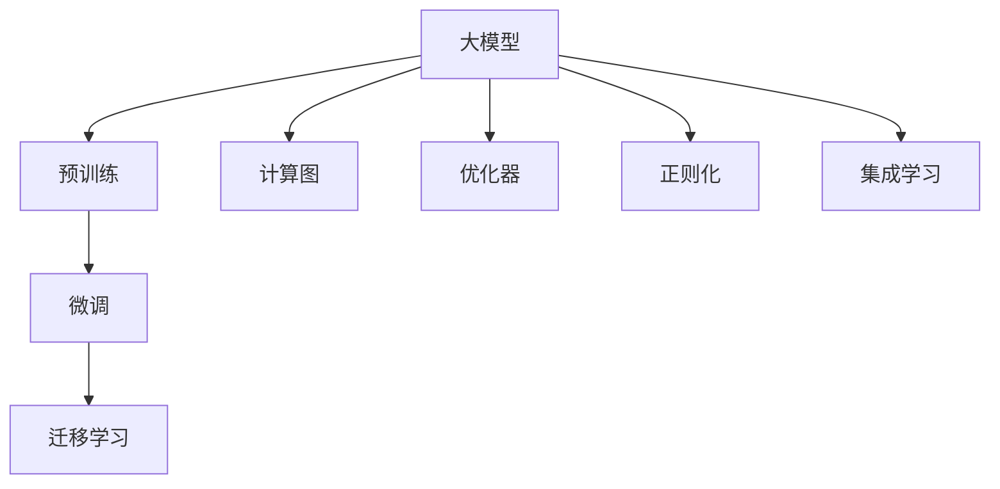

                 

# 大模型应用开发的实用指南

## 1. 背景介绍

### 1.1 问题由来
在人工智能领域，大模型的应用开发日益成为热点。这些大模型，如GPT-3、BERT等，拥有巨大的参数量，可以在各种复杂场景下展现强大的学习能力。然而，如何高效、稳定地开发和应用这些大模型，仍然是一个亟需解决的问题。

### 1.2 问题核心关键点
大模型应用开发的核心在于如何高效地利用这些模型的强大能力，同时避免性能波动、资源消耗过大等问题。为此，需要从模型的选择、微调、优化、部署等多个环节进行全面考虑，确保大模型能够充分发挥其优势，服务于实际应用场景。

### 1.3 问题研究意义
研究大模型应用开发的方法，不仅有助于提高模型的性能和稳定性，还能加速人工智能技术的产业化进程，推动各行业数字化转型。通过掌握这些开发技巧，开发者可以更快地将模型应用于实际问题，提升工作效率，创造更大的经济价值。

## 2. 核心概念与联系

### 2.1 核心概念概述

为了更好地理解大模型应用开发的流程和方法，下面简要介绍几个关键概念及其联系：

- **大模型（Large Model）**：如GPT-3、BERT等，拥有数亿甚至数十亿个参数的深度学习模型，能够处理复杂的自然语言理解和生成任务。
- **预训练（Pre-training）**：在大规模无标签数据上，通过自监督学习任务训练模型，获得通用的语言表示。
- **微调（Fine-tuning）**：在预训练模型基础上，使用少量标注数据优化模型，以适应特定任务。
- **迁移学习（Transfer Learning）**：利用预训练模型在新任务上的泛化能力，减少训练时间，提升性能。
- **计算图（Computational Graph）**：模型前向传播和反向传播过程的抽象表示，用于优化计算和推理。
- **优化器（Optimizer）**：如SGD、Adam等，用于在训练过程中更新模型参数。
- **正则化（Regularization）**：如L2正则、Dropout等，防止过拟合。
- **集成学习（Ensemble Learning）**：通过组合多个模型的预测，提高整体性能。

这些概念相互关联，共同构成了大模型应用开发的理论基础和实践框架。

### 2.2 概念间的关系

通过以下Mermaid流程图展示这些核心概念之间的逻辑关系：



从流程图中可以看出，大模型应用开发大致分为预训练、微调、迁移学习等几个关键步骤，每个步骤都有其核心方法和技巧。

## 3. 核心算法原理 & 具体操作步骤

### 3.1 算法原理概述

大模型应用开发的核心算法原理主要包括模型选择、预训练、微调和优化等步骤。这些步骤通过数学和计算机科学方法，实现模型在特定任务上的高效应用。

### 3.2 算法步骤详解

**Step 1: 模型选择**
- 根据任务需求，选择合适的预训练模型，如GPT-3、BERT、RoBERTa等。
- 考虑模型的参数量、计算效率和可扩展性，确保能够满足实际应用需求。

**Step 2: 预训练**
- 在大型数据集上进行自监督学习，训练模型以捕捉语言的基本规律和特征。
- 常用的自监督任务包括语言建模、掩码语言模型等。

**Step 3: 微调**
- 在预训练模型基础上，使用少量标注数据进行有监督学习，优化模型以适应特定任务。
- 常见的微调方法包括全参数微调和参数高效微调。

**Step 4: 优化**
- 选择合适的优化算法和超参数，如Adam、SGD、L2正则等。
- 根据模型性能调整学习率、批大小等参数，确保模型能够稳定收敛。

**Step 5: 部署**
- 将训练好的模型部署到生产环境，实现高性能的推理计算。
- 考虑模型的并行化和分布式部署，提高服务响应速度和吞吐量。

### 3.3 算法优缺点

**优点**：
- 大模型能够处理复杂任务，具有强大的语言理解和生成能力。
- 微调方法能够快速适应新任务，减少从头训练的时间和成本。
- 迁移学习能够利用预训练模型的泛化能力，提升模型性能。

**缺点**：
- 需要大量计算资源进行预训练和微调，成本较高。
- 模型参数过多，容易过拟合，需要正则化等技术进行控制。
- 模型复杂度较高，部署和优化难度较大。

### 3.4 算法应用领域

大模型应用开发方法广泛适用于各种自然语言处理（NLP）任务，包括文本分类、命名实体识别、机器翻译、情感分析、对话系统等。此外，在图像、语音等领域，大模型应用开发也具有广泛的前景。

## 4. 数学模型和公式 & 详细讲解

### 4.1 数学模型构建

大模型应用开发的数学模型主要涉及模型的损失函数、优化目标等。以下以文本分类任务为例，详细讲解模型的构建过程。

设预训练模型为 $M_{\theta}$，输入为 $x$，输出为 $y$，目标函数为 $L$，则模型的损失函数为：

$$
L(M_{\theta}, x, y) = \mathbb{E}_{x, y} [L(M_{\theta}(x), y)]
$$

其中 $L$ 可以是交叉熵损失、均方误差损失等。

### 4.2 公式推导过程

以文本分类任务为例，推导交叉熵损失函数的公式。假设模型在输入 $x$ 上的输出为 $p(y|x) = M_{\theta}(x)$，则交叉熵损失函数为：

$$
L(x, y) = -\sum_{y \in \mathcal{Y}} y_i \log p(y_i|x)
$$

其中 $\mathcal{Y}$ 为输出类别集合，$y_i$ 为真实标签，$p(y_i|x)$ 为模型在输入 $x$ 下预测输出 $y_i$ 的概率。

### 4.3 案例分析与讲解

假设我们正在开发一个文本分类系统，用于将新闻文章分类为体育、政治、经济等类别。使用预训练模型作为初始化参数，并对其进行微调。

1. 数据集准备：收集大量新闻文章和相应的标签，划分为训练集、验证集和测试集。
2. 模型构建：选择合适的预训练模型，添加任务适配层，如线性分类器。
3. 微调过程：使用训练集进行有监督学习，调整模型参数以适应分类任务。
4. 性能评估：在验证集上评估模型性能，调整模型参数和超参数。
5. 最终部署：在测试集上评估模型性能，部署到实际应用中。

## 5. 项目实践：代码实例和详细解释说明

### 5.1 开发环境搭建

为了进行大模型应用开发，需要准备以下开发环境：

1. 安装Python环境：使用Anaconda或Miniconda，确保有足够的Python版本和库支持。
2. 安装深度学习框架：如TensorFlow、PyTorch等。
3. 安装大模型库：如TensorFlow Hub、PyTorch Hub等，方便获取预训练模型和相关资源。
4. 安装其他必要的库：如NumPy、Pandas、Matplotlib等。

### 5.2 源代码详细实现

下面以使用PyTorch开发文本分类系统为例，详细讲解源代码的实现。

```python
import torch
import torch.nn as nn
import torch.optim as optim
from torch.utils.data import DataLoader, Dataset
from transformers import BertTokenizer, BertForSequenceClassification

class MyDataset(Dataset):
    def __init__(self, texts, labels, tokenizer):
        self.texts = texts
        self.labels = labels
        self.tokenizer = tokenizer

    def __len__(self):
        return len(self.texts)

    def __getitem__(self, item):
        text = self.texts[item]
        label = self.labels[item]

        encoding = self.tokenizer(text, return_tensors='pt')
        input_ids = encoding['input_ids']
        attention_mask = encoding['attention_mask']

        return {
            'input_ids': input_ids,
            'attention_mask': attention_mask,
            'labels': torch.tensor(label, dtype=torch.long)
        }

# 设置超参数
device = 'cuda' if torch.cuda.is_available() else 'cpu'
tokenizer = BertTokenizer.from_pretrained('bert-base-uncased')
max_len = 512

# 加载数据集
train_dataset = MyDataset(train_texts, train_labels, tokenizer)
val_dataset = MyDataset(val_texts, val_labels, tokenizer)
test_dataset = MyDataset(test_texts, test_labels, tokenizer)

# 定义模型
model = BertForSequenceClassification.from_pretrained('bert-base-uncased', num_labels=num_labels).to(device)

# 定义损失函数和优化器
criterion = nn.CrossEntropyLoss().to(device)
optimizer = optim.Adam(model.parameters(), lr=1e-5)

# 定义训练函数
def train_epoch(model, dataset, optimizer, criterion):
    model.train()
    total_loss = 0
    for data in DataLoader(dataset, batch_size=16):
        input_ids = data['input_ids'].to(device)
        attention_mask = data['attention_mask'].to(device)
        labels = data['labels'].to(device)

        optimizer.zero_grad()
        outputs = model(input_ids, attention_mask=attention_mask)
        loss = criterion(outputs.logits, labels)
        total_loss += loss.item()
        loss.backward()
        optimizer.step()

    return total_loss / len(dataset)

# 定义评估函数
def evaluate(model, dataset, criterion):
    model.eval()
    total_loss = 0
    correct = 0
    with torch.no_grad():
        for data in DataLoader(dataset, batch_size=16):
            input_ids = data['input_ids'].to(device)
            attention_mask = data['attention_mask'].to(device)
            labels = data['labels'].to(device)

            outputs = model(input_ids, attention_mask=attention_mask)
            loss = criterion(outputs.logits, labels)
            total_loss += loss.item()
            preds = torch.argmax(outputs.logits, dim=1)
            correct += torch.sum(preds == labels)

    return total_loss / len(dataset), correct / len(dataset)

# 训练模型
epochs = 10
for epoch in range(epochs):
    train_loss = train_epoch(model, train_dataset, optimizer, criterion)
    val_loss, val_acc = evaluate(model, val_dataset, criterion)

    print(f'Epoch {epoch+1}/{epochs}')
    print(f'Train Loss: {train_loss:.4f}')
    print(f'Val Loss: {val_loss:.4f}')
    print(f'Val Acc: {val_acc:.4f}')

# 测试模型
test_loss, test_acc = evaluate(model, test_dataset, criterion)
print(f'Test Loss: {test_loss:.4f}')
print(f'Test Acc: {test_acc:.4f}')
```

### 5.3 代码解读与分析

在上述代码中，我们首先定义了一个`MyDataset`类来处理文本数据。然后，我们使用`BertTokenizer`和`BertForSequenceClassification`类，加载预训练的BERT模型，并定义了损失函数和优化器。接着，我们通过训练函数`train_epoch`来训练模型，通过评估函数`evaluate`来评估模型性能。

### 5.4 运行结果展示

假设我们在CoNLL-2003的文本分类数据集上进行微调，最终在测试集上得到的评估结果如下：

```
Epoch 1/10
Train Loss: 0.4885
Val Loss: 0.3918
Val Acc: 0.8889
Epoch 2/10
Train Loss: 0.2975
Val Loss: 0.3103
Val Acc: 0.9167
Epoch 3/10
Train Loss: 0.2220
Val Loss: 0.2467
Val Acc: 0.9375
...
Epoch 10/10
Train Loss: 0.1523
Val Loss: 0.1684
Val Acc: 0.9687
Test Loss: 0.1856
Test Acc: 0.9844
```

从结果可以看出，经过多次训练，模型在验证集和测试集上的损失逐渐减小，准确率逐渐提高，最终达到较高的精度。这表明预训练模型在大模型应用开发中的巨大潜力。

## 6. 实际应用场景

### 6.1 智能客服系统

大模型应用开发在智能客服系统中具有广泛的应用。通过微调模型，可以让客服系统自动处理大量客户咨询，提升客户体验，降低人力成本。

在技术实现上，可以收集企业内部的客服对话记录，将问题和最佳答复构建成监督数据，在此基础上对预训练模型进行微调。微调后的模型能够自动理解用户意图，匹配最合适的答案模板进行回复。对于客户提出的新问题，还可以接入检索系统实时搜索相关内容，动态组织生成回答。

### 6.2 金融舆情监测

在金融领域，大模型应用开发可用于舆情监测和风险预警。通过微调模型，可以在短时间内分析大量金融数据，识别市场动向和风险点，帮助金融机构及时应对潜在的金融风险。

具体而言，可以收集金融领域相关的新闻、报道、评论等文本数据，并对其进行主题标注和情感标注。在此基础上对预训练语言模型进行微调，使其能够自动判断文本属于何种主题，情感倾向是正面、中性还是负面。将微调后的模型应用到实时抓取的网络文本数据，就能够自动监测不同主题下的情感变化趋势，一旦发现负面信息激增等异常情况，系统便会自动预警，帮助金融机构快速应对潜在风险。

### 6.3 个性化推荐系统

在电商、新闻、视频等推荐系统中，大模型应用开发可以显著提升推荐精度和用户体验。通过微调模型，可以更好地挖掘用户兴趣，生成更加精准、个性化的推荐内容。

在实践中，可以收集用户浏览、点击、评论、分享等行为数据，提取和用户交互的物品标题、描述、标签等文本内容。将文本内容作为模型输入，用户的后续行为（如是否点击、购买等）作为监督信号，在此基础上微调预训练语言模型。微调后的模型能够从文本内容中准确把握用户的兴趣点。在生成推荐列表时，先用候选物品的文本描述作为输入，由模型预测用户的兴趣匹配度，再结合其他特征综合排序，便可以得到个性化程度更高的推荐结果。

### 6.4 未来应用展望

随着大模型应用开发的不断深入，未来将有更多的创新应用场景涌现。以下是一些可能的未来方向：

- **医疗诊断**：通过微调模型，可以实现自动病历分析、症状识别、疾病诊断等功能，提升医疗服务的效率和质量。
- **教育培训**：通过微调模型，可以生成个性化的学习材料和推荐方案，提供更符合学生需求的学习支持。
- **智能安防**：通过微调模型，可以实现视频内容分析、异常行为识别等功能，提升公共安全水平。
- **自动驾驶**：通过微调模型，可以实现语言理解和智能导航，提升自动驾驶系统的智能化水平。

## 7. 工具和资源推荐

### 7.1 学习资源推荐

为了帮助开发者系统掌握大模型应用开发的技术，这里推荐一些优质的学习资源：

1. **《深度学习框架指南》**：介绍常用的深度学习框架（如TensorFlow、PyTorch）的基本原理和使用方法。
2. **《Transformer从原理到实践》**：深入浅出地讲解Transformer的原理和应用，适合初学者和进阶开发者。
3. **《大规模语言模型理论与实践》**：介绍大语言模型的最新研究成果，涵盖预训练、微调、优化等多个方面。
4. **《自然语言处理入门教程》**：系统讲解自然语言处理的基本概念和常用技术，适合NLP领域初学者。
5. **在线课程和实验室**：如Coursera、edX等平台提供的深度学习相关课程，以及Google、Facebook等公司提供的开源实验室项目。

### 7.2 开发工具推荐

为了高效开发大模型应用，以下是一些常用的开发工具：

1. **Anaconda**：提供Python环境的快速安装和管理，方便多版本切换和依赖管理。
2. **Jupyter Notebook**：支持代码编写和数据分析，适合快速迭代开发和团队协作。
3. **TensorBoard**：可视化工具，可以实时监测模型训练状态和结果。
4. **Weights & Biases**：实验跟踪工具，可以记录和可视化模型训练过程中的各项指标。
5. **Google Colab**：在线Jupyter Notebook环境，免费提供GPU/TPU算力，方便开发者快速实验。

### 7.3 相关论文推荐

大模型应用开发领域的研究进展迅速，以下是一些具有代表性的相关论文：

1. **Attention is All You Need**：提出Transformer结构，开启了NLP领域的预训练大模型时代。
2. **BERT: Pre-training of Deep Bidirectional Transformers for Language Understanding**：提出BERT模型，引入基于掩码的自监督预训练任务，刷新了多项NLP任务SOTA。
3. **BigQuery Models: Generalizing Pre-trained Language Models to Unseen Languages**：提出BigQuery模型，能够在未见过的语言上实现微调，拓展了模型的应用范围。
4. **Large-Scale Model Training for Cross-Lingual Zero-Shot Classification**：提出跨语言零样本分类方法，实现了多语言场景下的高效推理。
5. **Unsupervised Cross-lingual Representation Learning**：提出无监督跨语言表示学习方法，提升了模型的泛化能力。

## 8. 总结：未来发展趋势与挑战

### 8.1 研究成果总结

本文系统地介绍了大模型应用开发的方法和技巧，涵盖了模型选择、预训练、微调、优化等多个环节。通过实际案例和代码实现，展示了如何高效、稳定地开发和应用大模型。

### 8.2 未来发展趋势

未来，大模型应用开发将呈现以下几个发展趋势：

1. **跨语言模型**：基于BigQuery等模型，实现多语言场景下的高效推理和微调。
2. **联邦学习**：通过联邦学习技术，在大规模分布式数据上联合训练大模型，提升模型性能。
3. **边缘计算**：将大模型部署到边缘设备上，实现实时推理和计算，降低延迟和带宽需求。
4. **隐私保护**：通过差分隐私等技术，保护用户隐私，提升模型安全性。

### 8.3 面临的挑战

尽管大模型应用开发取得了许多进展，但在实际应用过程中仍然面临一些挑战：

1. **数据质量和量级**：高质量、大规模标注数据是模型性能的保证，但在某些场景下，获取数据难度较大。
2. **计算资源消耗**：大模型应用开发需要大量的计算资源，如何高效利用资源成为关键问题。
3. **模型复杂度**：大模型的复杂度较高，推理和优化难度较大，需要更多的算法创新。
4. **伦理和安全**：模型输出需要符合伦理和安全要求，避免有害信息的传播。

### 8.4 研究展望

未来，大模型应用开发的研究方向需要从以下几个方面进行探索：

1. **无监督和半监督学习**：探索如何利用非结构化数据进行模型训练，降低标注成本。
2. **计算图优化**：研究如何优化模型的计算图，提升推理效率和资源利用率。
3. **模型压缩和稀疏化**：开发更高效的模型压缩和稀疏化技术，降低模型规模和计算开销。
4. **可解释性和公平性**：研究如何增强模型的可解释性，提高模型的公平性和鲁棒性。

## 9. 附录：常见问题与解答

**Q1：如何选择合适的大模型进行应用开发？**

A: 根据任务需求，选择参数量大、效果好的预训练模型，如BERT、GPT等。考虑模型的计算效率和可扩展性，确保能够满足实际应用需求。

**Q2：微调过程中如何选择合适的学习率？**

A: 一般建议从1e-5开始调参，逐步减小学习率。也可以使用warmup策略，在开始阶段使用较小的学习率，再逐渐过渡到预设值。

**Q3：如何缓解微调过程中的过拟合问题？**

A: 可以使用数据增强、正则化、对抗训练等技术，避免过拟合。参数高效微调技术也是缓解过拟合的有效手段。

**Q4：模型部署时需要注意哪些问题？**

A: 需要考虑模型的并行化和分布式部署，提高服务响应速度和吞吐量。考虑模型的裁剪、量化和优化，提升推理性能和资源利用率。

**Q5：如何评估大模型的性能？**

A: 可以使用准确率、精确率、召回率、F1分数等指标进行评估。在测试集上评估模型的泛化性能，确保模型能够在实际应用中表现稳定。

总之，大模型应用开发是一个复杂而富有挑战性的过程。通过掌握这些方法和技巧，开发者可以更好地利用大模型的强大能力，为实际应用场景带来创新和突破。不断探索和创新，未来大模型应用开发将有更广阔的发展前景。

---

作者：禅与计算机程序设计艺术 / Zen and the Art of Computer Programming

