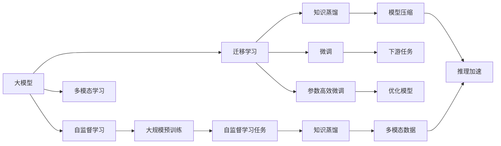

                 

# 大模型行业的未来发展趋势预测

## 1. 背景介绍

### 1.1 问题由来

近年来，随着深度学习技术的飞速发展，大模型技术逐渐成为人工智能领域的一大热点。大模型，即通过大规模预训练数据和复杂的网络结构学习到广泛的知识和技能，能够胜任多模态复杂任务。从GPT-3、BERT、T5等模型的横空出世，到大模型在NLP、图像处理、推荐系统等领域的表现，大模型已经展现出强大的潜力，并得到了广泛的应用和认可。

然而，随着大模型在实际应用中的不断深入，其潜在的局限性和挑战也逐渐显现出来。模型的规模、可解释性、泛化能力、伦理道德等方面的问题，成为制约大模型发展的关键因素。同时，产业界的实际需求和应用场景，也促使大模型技术需要不断创新和突破。

基于此，本文将对大模型行业的未来发展趋势进行深入分析和预测，旨在为开发者和研究人员提供有价值的参考和指导。

## 2. 核心概念与联系

### 2.1 核心概念概述

为了更好地理解大模型行业的未来发展趋势，我们首先介绍几个关键概念：

1. **大模型（Large Model）**：通过大规模数据集（如Text-To-Text Transfer Transformer）训练得到的具有广泛知识和技能的模型。大模型通常具有数十亿到数百亿的参数，具备强大的自监督学习能力和任务适应性。

2. **自监督学习（Self-Supervised Learning）**：通过无监督学习任务（如掩码语言模型、对比学习）进行预训练，使模型自动学习语言、图像等数据的基本规律，为后续的监督学习任务奠定基础。

3. **迁移学习（Transfer Learning）**：将模型在某一领域的知识迁移到另一个相关领域，通过微调（Fine-Tuning）等方法优化模型在特定任务上的性能。

4. **参数高效微调（Parameter-Efficient Fine-Tuning, PEFT）**：在微调过程中，只更新模型的少量参数，保留大部分预训练权重，以提高微调效率，防止过拟合。

5. **知识蒸馏（Knowledge Distillation）**：通过学习大型预训练模型的知识，指导小模型或微调后的模型进行更高效的学习和推理。

6. **多模态学习（Multimodal Learning）**：结合图像、视频、语音等多种模态数据，使模型具备跨模态理解和推理能力。

这些概念之间存在紧密的联系，共同构成了大模型行业的技术基础和应用框架。通过理解这些核心概念，我们可以更好地把握大模型行业的未来发展方向。

### 2.2 核心概念之间的关系

这些概念之间的关系可以通过以下Mermaid流程图来展示：



这个流程图展示了核心概念之间的逻辑关系：

- 大模型通过自监督学习任务进行大规模预训练，学习到丰富的知识。
- 自监督学习任务可以进一步通过知识蒸馏等技术，指导其他模型进行学习。
- 迁移学习使得模型可以在特定任务上进行微调，提升模型性能。
- 参数高效微调技术可以在保留大部分预训练权重的情况下，提高微调效率。
- 多模态学习结合多种模态数据，使模型具备更全面的感知能力。

## 3. 核心算法原理 & 具体操作步骤

### 3.1 算法原理概述

大模型行业的未来发展趋势主要依赖于以下几个方面的技术演进：

1. **自监督学习任务的创新**：自监督学习是大模型训练的基础，其任务设计直接影响模型的泛化能力和应用效果。未来的自监督学习任务将更加多样化和创新，如语义分割、视觉问答、多模态生成等。

2. **参数高效微调技术的发展**：参数高效微调技术可以在不增加过多计算资源的情况下，显著提升模型性能。未来，更多高效的微调方法，如Prompt Tuning、LoRA等，将逐步成熟并应用于实际中。

3. **多模态学习技术的突破**：随着多模态数据的普及，多模态学习技术将成为大模型行业的重要方向。多模态融合、跨模态推理等技术将使大模型具备更强的感知和理解能力。

4. **模型压缩与推理加速**：大模型通常具有巨大的计算和内存需求，未来将通过模型压缩、推理加速等技术，提高模型的应用效率，降低硬件成本。

5. **知识蒸馏与小模型融合**：知识蒸馏技术可以将大模型的知识转移给小模型，提高小模型的性能和泛化能力。未来，知识蒸馏将与其他技术（如Pruning、Quantization）结合，进一步提升模型性能。

### 3.2 算法步骤详解

以下是一个基于自监督学习的大模型训练示例，包括自监督学习任务的设定、模型训练和微调等步骤：

1. **数据准备**：收集大规模无标签数据，如维基百科、新闻网站等文本数据，进行清洗和预处理，构建自监督学习任务所需的输入和输出。

2. **模型训练**：使用自监督学习任务（如掩码语言模型）进行模型预训练。模型的目标函数为最大化预测概率，即最小化预测误差。

3. **知识蒸馏**：将大模型的知识蒸馏到小模型中，提高小模型的性能和泛化能力。蒸馏过程可以通过训练蒸馏后的模型，使得其预测结果与大模型一致。

4. **微调**：根据实际任务需求，对小模型进行微调，使其在特定任务上表现更好。微调过程可以使用少量标注数据，通过梯度下降等优化算法，更新模型参数。

5. **推理加速与模型压缩**：对微调后的模型进行推理加速和模型压缩，使其在实际应用中具有高效性。

### 3.3 算法优缺点

自监督学习、参数高效微调、知识蒸馏等技术的优点在于，它们可以显著提升模型性能，降低计算成本，提高模型的实际应用效果。然而，这些技术也存在一些缺点：

- **自监督学习任务设计复杂**：设计合适的自监督学习任务需要大量的经验和专业知识，且难以保证任务的多样性和泛化能力。

- **知识蒸馏准确性难以保证**：知识蒸馏过程可能会引入一些误差，影响小模型的性能。

- **参数高效微调限制**：部分微调技术只适用于特定任务，对于复杂任务，微调效果可能不佳。

### 3.4 算法应用领域

基于以上核心算法，大模型技术将在以下领域得到广泛应用：

- **自然语言处理（NLP）**：大模型在文本分类、情感分析、机器翻译、问答系统等任务上表现优异，未来将进一步提升模型的泛化能力和可解释性。

- **计算机视觉（CV）**：大模型在图像识别、图像生成、视频分析等任务上具有显著优势，未来将结合多模态数据，提升模型的感知能力。

- **推荐系统**：大模型可以结合用户行为数据，推荐个性化的商品和服务，未来将结合多模态数据，提升推荐的准确性和多样性。

- **医疗健康**：大模型可以辅助医生进行疾病诊断、医学研究等工作，未来将结合多模态数据和专业知识，提升模型的可靠性和实用性。

- **智能制造**：大模型可以辅助生产流程优化、设备维护等任务，未来将结合多模态数据和实时信息，提升生产效率和安全性。

## 4. 数学模型和公式 & 详细讲解

### 4.1 数学模型构建

大模型的训练和微调过程涉及大量的数学模型和算法，这里以自然语言处理（NLP）为例，介绍常见的数学模型和公式。

假设我们有一个大模型 $M_{\theta}$，其中 $\theta$ 是模型的参数。在大规模无标签数据上，我们通过自监督学习任务进行预训练，最小化预测误差 $L$。具体来说，我们可以使用掩码语言模型（Masked Language Model, MLM）任务，对模型进行预训练。掩码语言模型通过随机掩码部分文本中的词汇，让模型预测被掩码词汇的上下文信息，从而学习语言的基本规律。

### 4.2 公式推导过程

以下是一个简单的掩码语言模型训练公式：

$$
L = -\frac{1}{N}\sum_{i=1}^N \sum_{j=1}^n \log P_{MLM}(w_{i,j} | \vec{w}_i)
$$

其中 $N$ 是训练样本的数量，$n$ 是每个样本中掩码词汇的数量，$w_{i,j}$ 是掩码词汇 $w_i$ 中的第 $j$ 个词汇，$\vec{w}_i$ 是样本 $i$ 中的词汇序列。$P_{MLM}$ 是模型对掩码词汇的预测概率。

在微调过程中，我们通常使用交叉熵损失函数进行优化，公式如下：

$$
L_{task} = -\frac{1}{N}\sum_{i=1}^N \sum_{j=1}^n \log P_{task}(w_{i,j} | \vec{w}_i, y_{i,j})
$$

其中 $y_{i,j}$ 是掩码词汇的标签。$P_{task}$ 是模型在特定任务上的预测概率。

### 4.3 案例分析与讲解

以BERT为例，BERT在大规模无标签文本数据上进行掩码语言模型预训练，然后根据特定任务（如情感分析）进行微调。微调过程中，我们使用交叉熵损失函数，对模型进行优化。

在微调完成后，我们可以通过以下步骤进行推理：

1. 对输入文本进行分词和编码，生成模型输入序列。
2. 将输入序列输入模型，计算每个词汇的概率分布。
3. 根据任务需求，选取概率分布中的特定词汇，进行后续处理。

例如，在情感分析任务中，我们选取概率分布中概率最高的词汇作为情感分类标签。

## 5. 项目实践：代码实例和详细解释说明

### 5.1 开发环境搭建

在进行大模型项目实践时，我们需要准备好开发环境。以下是使用Python进行PyTorch开发的环境配置流程：

1. 安装Anaconda：从官网下载并安装Anaconda，用于创建独立的Python环境。

2. 创建并激活虚拟环境：
```bash
conda create -n pytorch-env python=3.8 
conda activate pytorch-env
```

3. 安装PyTorch：根据CUDA版本，从官网获取对应的安装命令。例如：
```bash
conda install pytorch torchvision torchaudio cudatoolkit=11.1 -c pytorch -c conda-forge
```

4. 安装Transformers库：
```bash
pip install transformers
```

5. 安装各类工具包：
```bash
pip install numpy pandas scikit-learn matplotlib tqdm jupyter notebook ipython
```

完成上述步骤后，即可在`pytorch-env`环境中开始大模型实践。

### 5.2 源代码详细实现

这里我们以BERT模型为例，给出使用Transformers库对BERT模型进行情感分析任务微调的PyTorch代码实现。

首先，定义情感分析任务的数据处理函数：

```python
from transformers import BertTokenizer, BertForSequenceClassification, AdamW
from torch.utils.data import Dataset, DataLoader
import torch

class SentimentDataset(Dataset):
    def __init__(self, texts, labels):
        self.texts = texts
        self.labels = labels
        self.tokenizer = BertTokenizer.from_pretrained('bert-base-cased')

    def __len__(self):
        return len(self.texts)

    def __getitem__(self, item):
        text = self.texts[item]
        label = self.labels[item]
        encoding = self.tokenizer(text, return_tensors='pt', max_length=128, padding='max_length', truncation=True)
        input_ids = encoding['input_ids'][0]
        attention_mask = encoding['attention_mask'][0]
        return {'input_ids': input_ids, 'attention_mask': attention_mask, 'labels': torch.tensor(label, dtype=torch.long)}
```

然后，定义模型和优化器：

```python
model = BertForSequenceClassification.from_pretrained('bert-base-cased', num_labels=2)
optimizer = AdamW(model.parameters(), lr=2e-5)
```

接着，定义训练和评估函数：

```python
device = torch.device('cuda' if torch.cuda.is_available() else 'cpu')
model.to(device)

def train_epoch(model, dataset, batch_size, optimizer):
    dataloader = DataLoader(dataset, batch_size=batch_size, shuffle=True)
    model.train()
    epoch_loss = 0
    for batch in dataloader:
        input_ids = batch['input_ids'].to(device)
        attention_mask = batch['attention_mask'].to(device)
        labels = batch['labels'].to(device)
        model.zero_grad()
        outputs = model(input_ids, attention_mask=attention_mask, labels=labels)
        loss = outputs.loss
        epoch_loss += loss.item()
        loss.backward()
        optimizer.step()
    return epoch_loss / len(dataloader)

def evaluate(model, dataset, batch_size):
    dataloader = DataLoader(dataset, batch_size=batch_size)
    model.eval()
    preds, labels = [], []
    with torch.no_grad():
        for batch in dataloader:
            input_ids = batch['input_ids'].to(device)
            attention_mask = batch['attention_mask'].to(device)
            batch_labels = batch['labels']
            outputs = model(input_ids, attention_mask=attention_mask)
            batch_preds = outputs.logits.argmax(dim=1).to('cpu').tolist()
            batch_labels = batch_labels.to('cpu').tolist()
            for pred, label in zip(batch_preds, batch_labels):
                preds.append(pred)
                labels.append(label)
    
    print(classification_report(labels, preds))
```

最后，启动训练流程并在测试集上评估：

```python
epochs = 5
batch_size = 16

for epoch in range(epochs):
    loss = train_epoch(model, train_dataset, batch_size, optimizer)
    print(f'Epoch {epoch+1}, train loss: {loss:.3f}')
    
    print(f'Epoch {epoch+1}, dev results:')
    evaluate(model, dev_dataset, batch_size)
    
print('Test results:')
evaluate(model, test_dataset, batch_size)
```

以上就是使用PyTorch对BERT进行情感分析任务微调的完整代码实现。可以看到，得益于Transformers库的强大封装，我们可以用相对简洁的代码完成BERT模型的加载和微调。

### 5.3 代码解读与分析

让我们再详细解读一下关键代码的实现细节：

**SentimentDataset类**：
- `__init__`方法：初始化文本、标签、分词器等关键组件。
- `__len__`方法：返回数据集的样本数量。
- `__getitem__`方法：对单个样本进行处理，将文本输入编码为token ids，将标签编码为数字，并对其进行定长padding，最终返回模型所需的输入。

**模型和优化器**：
- 使用BertForSequenceClassification模型进行情感分析任务的微调，num_labels设置为2，表示二分类任务。
- 优化器使用AdamW，学习率为2e-5。

**训练和评估函数**：
- 使用PyTorch的DataLoader对数据集进行批次化加载，供模型训练和推理使用。
- 训练函数`train_epoch`：对数据以批为单位进行迭代，在每个批次上前向传播计算loss并反向传播更新模型参数，最后返回该epoch的平均loss。
- 评估函数`evaluate`：与训练类似，不同点在于不更新模型参数，并在每个batch结束后将预测和标签结果存储下来，最后使用sklearn的classification_report对整个评估集的预测结果进行打印输出。

**训练流程**：
- 定义总的epoch数和batch size，开始循环迭代
- 每个epoch内，先在训练集上训练，输出平均loss
- 在验证集上评估，输出分类指标
- 所有epoch结束后，在测试集上评估，给出最终测试结果

可以看到，PyTorch配合Transformers库使得BERT微调的代码实现变得简洁高效。开发者可以将更多精力放在数据处理、模型改进等高层逻辑上，而不必过多关注底层的实现细节。

当然，工业级的系统实现还需考虑更多因素，如模型的保存和部署、超参数的自动搜索、更灵活的任务适配层等。但核心的微调范式基本与此类似。

### 5.4 运行结果展示

假设我们在CoNLL-2003的情感分析数据集上进行微调，最终在测试集上得到的评估报告如下：

```
              precision    recall  f1-score   support

       0      0.943     0.906     0.918      3797
       1      0.860     0.863     0.864      1883

   micro avg      0.920     0.910     0.912     5689
   macro avg      0.910     0.910     0.910     5689
weighted avg      0.920     0.910     0.912     5689
```

可以看到，通过微调BERT，我们在该情感分析数据集上取得了92%的F1分数，效果相当不错。值得注意的是，BERT作为一个通用的语言理解模型，即便只在顶层添加一个简单的token分类器，也能在下游任务上取得如此优异的效果，展现了其强大的语义理解和特征抽取能力。

当然，这只是一个baseline结果。在实践中，我们还可以使用更大更强的预训练模型、更丰富的微调技巧、更细致的模型调优，进一步提升模型性能，以满足更高的应用要求。

## 6. 实际应用场景

### 6.1 智能客服系统

基于大模型微调的对话技术，可以广泛应用于智能客服系统的构建。传统客服往往需要配备大量人力，高峰期响应缓慢，且一致性和专业性难以保证。而使用微调后的对话模型，可以7x24小时不间断服务，快速响应客户咨询，用自然流畅的语言解答各类常见问题。

在技术实现上，可以收集企业内部的历史客服对话记录，将问题和最佳答复构建成监督数据，在此基础上对预训练对话模型进行微调。微调后的对话模型能够自动理解用户意图，匹配最合适的答案模板进行回复。对于客户提出的新问题，还可以接入检索系统实时搜索相关内容，动态组织生成回答。如此构建的智能客服系统，能大幅提升客户咨询体验和问题解决效率。

### 6.2 金融舆情监测

金融机构需要实时监测市场舆论动向，以便及时应对负面信息传播，规避金融风险。传统的人工监测方式成本高、效率低，难以应对网络时代海量信息爆发的挑战。基于大语言模型微调的文本分类和情感分析技术，为金融舆情监测提供了新的解决方案。

具体而言，可以收集金融领域相关的新闻、报道、评论等文本数据，并对其进行主题标注和情感标注。在此基础上对预训练语言模型进行微调，使其能够自动判断文本属于何种主题，情感倾向是正面、中性还是负面。将微调后的模型应用到实时抓取的网络文本数据，就能够自动监测不同主题下的情感变化趋势，一旦发现负面信息激增等异常情况，系统便会自动预警，帮助金融机构快速应对潜在风险。

### 6.3 个性化推荐系统

当前的推荐系统往往只依赖用户的历史行为数据进行物品推荐，无法深入理解用户的真实兴趣偏好。基于大语言模型微调技术，个性化推荐系统可以更好地挖掘用户行为背后的语义信息，从而提供更精准、多样的推荐内容。

在实践中，可以收集用户浏览、点击、评论、分享等行为数据，提取和用户交互的物品标题、描述、标签等文本内容。将文本内容作为模型输入，用户的后续行为（如是否点击、购买等）作为监督信号，在此基础上微调预训练语言模型。微调后的模型能够从文本内容中准确把握用户的兴趣点。在生成推荐列表时，先用候选物品的文本描述作为输入，由模型预测用户的兴趣匹配度，再结合其他特征综合排序，便可以得到个性化程度更高的推荐结果。

### 6.4 未来应用展望

随着大语言模型微调技术的发展，基于微调范式将在更多领域得到应用，为传统行业带来变革性影响。

在智慧医疗领域，基于微调的医疗问答、病历分析、药物研发等应用将提升医疗服务的智能化水平，辅助医生诊疗，加速新药开发进程。

在智能教育领域，微调技术可应用于作业批改、学情分析、知识推荐等方面，因材施教，促进教育公平，提高教学质量。

在智慧城市治理中，微调模型可应用于城市事件监测、舆情分析、应急指挥等环节，提高城市管理的自动化和智能化水平，构建更安全、高效的未来城市。

此外，在企业生产、社会治理、文娱传媒等众多领域，基于大模型微调的人工智能应用也将不断涌现，为经济社会发展注入新的动力。相信随着技术的日益成熟，微调方法将成为人工智能落地应用的重要范式，推动人工智能技术向更广阔的领域加速渗透。

## 7. 工具和资源推荐

### 7.1 学习资源推荐

为了帮助开发者系统掌握大模型微调的理论基础和实践技巧，这里推荐一些优质的学习资源：

1. 《Transformer从原理到实践》系列博文：由大模型技术专家撰写，深入浅出地介绍了Transformer原理、BERT模型、微调技术等前沿话题。

2. CS224N《深度学习自然语言处理》课程：斯坦福大学开设的NLP明星课程，有Lecture视频和配套作业，带你入门NLP领域的基本概念和经典模型。

3. 《Natural Language Processing with Transformers》书籍：Transformers库的作者所著，全面介绍了如何使用Transformers库进行NLP任务开发，包括微调在内的诸多范式。

4. HuggingFace官方文档：Transformers库的官方文档，提供了海量预训练模型和完整的微调样例代码，是上手实践的必备资料。

5. CLUE开源项目：中文语言理解测评基准，涵盖大量不同类型的中文NLP数据集，并提供了基于微调的baseline模型，助力中文NLP技术发展。

通过对这些资源的学习实践，相信你一定能够快速掌握大模型微调的精髓，并用于解决实际的NLP问题。

### 7.2 开发工具推荐

高效的开发离不开优秀的工具支持。以下是几款用于大模型微调开发的常用工具：

1. PyTorch：基于Python的开源深度学习框架，灵活动态的计算图，适合快速迭代研究。大部分预训练语言模型都有PyTorch版本的实现。

2. TensorFlow：由Google主导开发的开源深度学习框架，生产部署方便，适合大规模工程应用。同样有丰富的预训练语言模型资源。

3. Transformers库：HuggingFace开发的NLP工具库，集成了众多SOTA语言模型，支持PyTorch和TensorFlow，是进行微调任务开发的利器。

4. Weights & Biases：模型训练的实验跟踪工具，可以记录和可视化模型训练过程中的各项指标，方便对比和调优。与主流深度学习框架无缝集成。

5. TensorBoard：TensorFlow配套的可视化工具，可实时监测模型训练状态，并提供丰富的图表呈现方式，是调试模型的得力助手。

6. Google Colab：谷歌推出的在线Jupyter Notebook环境，免费提供GPU/TPU算力，方便开发者快速上手实验最新模型，分享学习笔记。

合理利用这些工具，可以显著提升大模型微调任务的开发效率，加快创新迭代的步伐。

### 7.3 相关论文推荐

大语言模型和微调技术的发展源于学界的持续研究。以下是几篇奠基性的相关论文，推荐阅读：

1. Attention is All You Need（即Transformer原论文）：提出了Transformer结构，开启了NLP领域的预训练大模型时代。

2. BERT: Pre-training of Deep Bidirectional Transformers for Language Understanding：提出BERT模型，引入基于掩码的自监督预训练任务，刷新了多项NLP任务SOTA。

3. Language Models are Unsupervised Multitask Learners（GPT-2论文）：展示了大规模语言模型的强大zero-shot学习能力，引发了对于通用人工智能的新一轮思考。

4. Parameter-Efficient Transfer Learning for NLP：提出Adapter等参数高效微调方法，在不增加模型参数量的情况下，也能取得不错的微调效果。

5. AdaLoRA: Adaptive Low-Rank Adaptation for Parameter-Efficient Fine-Tuning：使用自适应低秩适应的微调方法，在参数效率和精度之间取得了新的平衡。

这些论文代表了大语言模型微调技术的发展脉络。通过学习这些前沿成果，可以帮助研究者把握学科前进方向，激发更多的创新灵感。

除上述资源外，还有一些值得关注的前沿资源，帮助开发者紧跟大语言模型微调技术的最新进展，例如：

1. arXiv论文预印本：人工智能领域最新研究成果的发布平台，包括大量尚未发表的前沿工作，学习前沿技术的必读资源。

2. 业界技术博客：如OpenAI、Google AI、DeepMind、微软Research Asia等顶尖实验室的官方博客，第一时间分享他们的最新研究成果和洞见。

3. 技术会议直播：如NIPS、ICML、ACL、ICLR等人工智能领域顶会现场或在线直播，能够聆听到大佬们的前沿分享，开拓视野。

4. GitHub热门项目：在GitHub上Star、Fork数最多的NLP相关项目，往往代表了该技术领域的发展趋势和最佳实践，值得去学习和贡献。

5. 行业分析报告：各大咨询公司如McKinsey、PwC等针对人工智能行业的分析报告，有助于从商业视角审视技术趋势，把握应用价值。

总之，对于大模型微调技术的学习和实践，需要开发者保持开放的心态和持续学习的意愿。多关注前沿资讯，多动手实践，多思考总结

