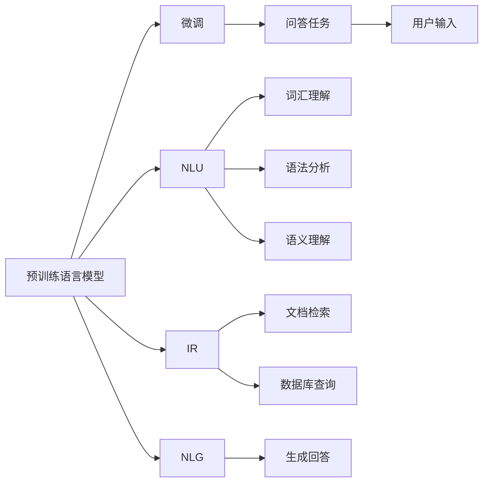

                 

# 大模型问答机器人如何理解用户问题

## 1. 背景介绍

在现代信息爆炸的时代，如何构建一个能够理解和回答用户问题的智能问答机器人，成为了一个备受关注的话题。传统的问答系统主要依赖规则和模板，需要人工编写大量针对特定领域的知识库和对话脚本，开发和维护成本高昂，且无法应对用户提出的新问题。大语言模型，特别是通过监督学习微调后的大语言模型，为构建智能问答系统提供了新的思路。

### 1.1 问题由来

随着深度学习技术的不断发展，大规模语言模型（如BERT、GPT等）在自然语言处理（NLP）领域取得了巨大的突破。这些模型通过在海量无标签文本数据上进行预训练，学习到了丰富的语言知识和常识，可以通过少量的有标签样本在下游任务上进行微调，获得优异的性能。问答系统作为NLP领域的一个重要应用，近年来也借助大模型的力量，逐步摆脱了规则和模板的束缚，实现了更加智能、灵活的交互。

### 1.2 问题核心关键点

大模型问答机器人的核心在于如何利用大语言模型理解用户的自然语言问题，并从知识库中提取相关信息进行回答。这个问题的核心可以分解为以下几个关键点：
1. **自然语言理解（NLU）**：理解用户输入的自然语言问题。
2. **信息检索（IR）**：从知识库中检索相关信息。
3. **自然语言生成（NLG）**：根据检索到的信息生成自然语言回答。

本文将围绕这些关键点，深入探讨大模型问答机器人如何理解和回答用户问题，并给出具体的技术实现和优化建议。

### 1.3 问题研究意义

构建智能问答机器人，对于提升用户交互体验，优化信息获取方式，推动数字化转型，具有重要的现实意义。大模型问答机器人通过预训练和微调，可以大幅提升模型的语义理解和常识推理能力，使得问答系统更加智能和普适，适用于各种垂直领域的应用。同时，这种技术也可以应用到智能客服、智慧教育、企业知识管理等场景，提升系统的智能化水平和应用价值。

## 2. 核心概念与联系

### 2.1 核心概念概述

为了更好地理解大模型问答机器人的工作原理，本节将介绍几个密切相关的核心概念：

- **自然语言理解（NLU）**：理解自然语言输入的过程，包括词汇、语法、语义等方面。
- **信息检索（IR）**：从大规模文档、数据库等数据源中查找与用户问题相关的信息。
- **自然语言生成（NLG）**：将检索到的信息转换为自然语言回答的过程。
- **预训练语言模型**：通过在海量无标签文本数据上进行的训练，学习到通用的语言表示。
- **微调（Fine-Tuning）**：在预训练模型的基础上，使用有标签的问答数据进行进一步训练，以提升模型在特定问答任务上的表现。

这些核心概念通过大模型问答机器人这一系统载体，紧密联系在一起，共同构成了问答系统的核心框架。

### 2.2 概念间的关系

这些核心概念之间的关系可以用以下Mermaid流程图来展示：



这个流程图展示了预训练语言模型通过微调后，与NLU、IR、NLG等组件共同构建起问答系统的基本架构。通过这些组件的协同工作，问答系统可以理解用户输入，检索相关信息，生成自然语言回答。

## 3. 核心算法原理 & 具体操作步骤

### 3.1 算法原理概述

大模型问答机器人理解用户问题的工作流程可以分为两个主要部分：自然语言理解和信息检索。本文将详细讲解这两个部分的算法原理和操作步骤。

### 3.2 算法步骤详解

#### 3.2.1 自然语言理解（NLU）

自然语言理解是大模型问答机器人的第一步，也是最重要的一步。NLU的目标是理解用户输入的自然语言问题，并将其转换为计算机可以处理的格式。

1. **分词和词性标注**：首先对用户输入的文本进行分词，即将其拆分成单词或短语，并标注每个单词的词性。
2. **依存句法分析**：根据依存关系，构建出句子的语法结构。
3. **语义角色标注（SRL）**：标注句子中的实体（如人名、地点等）及其在句子中的语义角色（如主语、宾语等）。
4. **意图识别**：根据用户输入的词汇和语法结构，识别用户的意图和所关注的信息类型。

NLU的具体实现可以通过使用自然语言处理库（如SpaCy、NLTK等）和预训练模型（如BERT、GPT等）来完成。这些库和模型通常已经预训练好了词汇理解、语法分析和语义理解等能力，可以直接应用到NLU过程中。

#### 3.2.2 信息检索（IR）

信息检索是大模型问答机器人的第二步，即从知识库中检索相关信息。

1. **构建索引**：将知识库中的文档进行分词和标注，构建出文档的索引，以便快速检索。
2. **文本相似度计算**：使用相似度计算模型（如余弦相似度、Jaccard相似度等）计算用户输入文本与文档索引之间的相似度。
3. **文档排序**：根据相似度对检索结果进行排序，选取与用户输入最相关的文档。
4. **信息提取**：从选定的文档中提取相关信息，如实体、属性等，构建答案候选集。

信息检索的具体实现可以通过使用搜索引擎（如Elasticsearch、Solr等）和预训练模型（如Bert for IR等）来完成。这些工具和模型通常已经预训练好了文档检索和信息提取等能力，可以直接应用到IR过程中。

#### 3.2.3 自然语言生成（NLG）

自然语言生成是大模型问答机器人的最后一步，即将检索到的相关信息转换为自然语言回答。

1. **答案模板匹配**：根据用户输入的意图和信息类型，匹配预先定义好的答案模板。
2. **填充答案模板**：将检索到的相关信息填充到答案模板中，生成完整的回答文本。
3. **语法和风格优化**：根据回答文本的语法和风格，进行适当的优化和调整，以提高回答的自然度和可读性。

自然语言生成的具体实现可以通过使用自然语言处理库（如NLTK、SpaCy等）和预训练模型（如GPT、T5等）来完成。这些库和模型通常已经预训练好了语言生成等能力，可以直接应用到NLG过程中。

### 3.3 算法优缺点

大模型问答机器人通过预训练和微调，具有以下优点：
1. **通用性强**：预训练模型可以在多个垂直领域应用，适应性广泛。
2. **灵活性高**：可以通过微调适应不同领域的问答任务。
3. **效果好**：在大规模数据上进行预训练和微调，模型效果往往优于手工编写的规则和模板。
4. **可扩展性好**：可以通过添加新的预训练数据和微调数据，不断提升模型的性能。

同时，也存在一些局限性：
1. **数据需求高**：需要大量的标注数据进行微调，数据获取成本高。
2. **计算资源需求大**：预训练和微调过程需要大量的计算资源，对硬件要求较高。
3. **解释性差**：大模型往往作为一个"黑盒"，难以解释其内部推理过程。
4. **泛化能力有待提升**：对于某些特定领域的问答任务，微调效果可能不尽如人意。

### 3.4 算法应用领域

大模型问答机器人已经被广泛应用于智能客服、智慧教育、医疗咨询等多个领域，以下是几个典型的应用场景：

1. **智能客服**：基于大模型的问答系统可以处理客户提出的各种问题，提供24小时不间断的服务。
2. **智慧教育**：通过大模型构建的问答系统，可以为学生提供智能化的学习辅导，解答学习中遇到的各种问题。
3. **医疗咨询**：大模型问答系统可以帮助患者快速获取医学知识，解答健康相关的问题，提升医疗服务质量。

## 4. 数学模型和公式 & 详细讲解 & 举例说明

### 4.1 数学模型构建

本节将使用数学语言对大模型问答机器人的工作流程进行更加严格的刻画。

假设用户输入的自然语言问题为 $q$，知识库中的文档为 $d_1, d_2, ..., d_n$。

1. **自然语言理解**：将用户输入的文本 $q$ 转换为计算机可处理的形式 $q'$。
2. **信息检索**：计算 $q'$ 与每个文档 $d_i$ 的相似度 $s_i$，选取与 $q'$ 最相似的 $k$ 个文档。
3. **自然语言生成**：根据 $k$ 个文档的信息，生成回答文本 $a$。

具体的数学模型和公式如下：

1. **分词和词性标注**：
$$
q' = \text{tokenizer}(q)
$$

2. **依存句法分析**：
$$
G = \text{parse}(q')
$$

3. **语义角色标注**：
$$
R = \text{SRL}(q')
$$

4. **意图识别**：
$$
I = \text{intent}(R)
$$

5. **信息检索**：
$$
s_i = \text{similarity}(q', d_i)
$$

6. **文档排序**：
$$
D = \text{sort}(s_1, s_2, ..., s_n)
$$

7. **信息提取**：
$$
A = \text{extract}(D)
$$

8. **自然语言生成**：
$$
a = \text{generate}(A)
$$

### 4.2 公式推导过程

以下我们以二分类任务为例，推导相似度计算和答案生成的数学公式。

假设用户输入的问题为 $q$，知识库中的文档为 $d_1, d_2, ..., d_n$。

1. **文本相似度计算**：
$$
s_i = \text{similarity}(q, d_i) = \sum_{j=1}^m w_j \cdot f(q_j, d_i)
$$

其中 $f(q_j, d_i)$ 为相似度函数，$w_j$ 为权重。常见的相似度函数包括余弦相似度、Jaccard相似度等。

2. **文档排序**：
$$
D = \text{sort}(s_1, s_2, ..., s_n) = \text{argmin}_i(s_i)
$$

3. **答案生成**：
假设答案模板为 $\{T_i\}_{i=1}^k$，检索到的信息为 $\{E_j\}_{j=1}^k$，答案生成公式为：
$$
a = \text{generate}(T_1, T_2, ..., T_k; E_1, E_2, ..., E_k)
$$

### 4.3 案例分析与讲解

假设我们需要构建一个医疗咨询领域的问答系统，具体实现步骤如下：

1. **数据准备**：收集医疗领域的相关知识库和问答数据集。
2. **预训练模型选择**：选择BERT、GPT等大语言模型进行预训练。
3. **微调模型训练**：在问答数据集上微调预训练模型，以适应医疗领域的问答任务。
4. **分词和词性标注**：使用SpaCy库对用户输入的问题进行分词和词性标注。
5. **依存句法分析**：使用依存句法分析工具对标注后的文本进行语法结构分析。
6. **语义角色标注**：使用SpaCy库对标注后的文本进行语义角色标注，识别出实体及其角色。
7. **意图识别**：使用LSTM等模型对标注后的文本进行意图识别，确定用户意图和信息类型。
8. **信息检索**：使用Elasticsearch等搜索引擎在医疗知识库中检索相关信息。
9. **信息提取**：从检索结果中提取实体、属性等相关信息，构建答案候选集。
10. **答案生成**：使用GPT等模型根据答案模板和答案候选集生成回答文本。

## 5. 项目实践：代码实例和详细解释说明

### 5.1 开发环境搭建

在进行项目实践前，我们需要准备好开发环境。以下是使用Python进行PyTorch开发的环境配置流程：

1. 安装Anaconda：从官网下载并安装Anaconda，用于创建独立的Python环境。

2. 创建并激活虚拟环境：
```bash
conda create -n pytorch-env python=3.8 
conda activate pytorch-env
```

3. 安装PyTorch：根据CUDA版本，从官网获取对应的安装命令。例如：
```bash
conda install pytorch torchvision torchaudio cudatoolkit=11.1 -c pytorch -c conda-forge
```

4. 安装Transformers库：
```bash
pip install transformers
```

5. 安装各类工具包：
```bash
pip install numpy pandas scikit-learn matplotlib tqdm jupyter notebook ipython
```

完成上述步骤后，即可在`pytorch-env`环境中开始项目实践。

### 5.2 源代码详细实现

下面我们以医疗咨询领域为例，给出使用Transformers库对BERT模型进行问答系统微调的PyTorch代码实现。

首先，定义问答任务的数据处理函数：

```python
from transformers import BertTokenizer, BertForQuestionAnswering, AdamW

def read_data(data_path):
    with open(data_path, 'r') as f:
        lines = f.readlines()
    data = []
    for line in lines:
        q, a, context = line.strip().split('\t')
        data.append({'question': q, 'answer': a, 'context': context})
    return data

class QADataset(Dataset):
    def __init__(self, data, tokenizer):
        self.data = data
        self.tokenizer = tokenizer
        
    def __len__(self):
        return len(self.data)
    
    def __getitem__(self, idx):
        q = self.data[idx]['question']
        a = self.data[idx]['answer']
        context = self.data[idx]['context']
        
        encoding = self.tokenizer(q, context=context, return_tensors='pt')
        input_ids = encoding['input_ids']
        attention_mask = encoding['attention_mask']
        start_positions = torch.tensor([self.tokenizer.convert_tokens_to_ids(a)])[0]
        end_positions = torch.tensor([self.tokenizer.convert_tokens_to_ids(a)])[0]
        
        return {'input_ids': input_ids,
                'attention_mask': attention_mask,
                'start_positions': start_positions,
                'end_positions': end_positions}
```

然后，定义模型和优化器：

```python
tokenizer = BertTokenizer.from_pretrained('bert-base-cased')
model = BertForQuestionAnswering.from_pretrained('bert-base-cased', num_labels=2)

optimizer = AdamW(model.parameters(), lr=2e-5)
```

接着，定义训练和评估函数：

```python
from torch.utils.data import DataLoader
from tqdm import tqdm
from sklearn.metrics import accuracy_score

device = torch.device('cuda') if torch.cuda.is_available() else torch.device('cpu')
model.to(device)

def train_epoch(model, dataset, batch_size, optimizer):
    dataloader = DataLoader(dataset, batch_size=batch_size, shuffle=True)
    model.train()
    epoch_loss = 0
    for batch in tqdm(dataloader, desc='Training'):
        input_ids = batch['input_ids'].to(device)
        attention_mask = batch['attention_mask'].to(device)
        start_positions = batch['start_positions'].to(device)
        end_positions = batch['end_positions'].to(device)
        model.zero_grad()
        outputs = model(input_ids, attention_mask=attention_mask, labels=start_positions)
        loss = outputs.loss
        epoch_loss += loss.item()
        loss.backward()
        optimizer.step()
    return epoch_loss / len(dataloader)

def evaluate(model, dataset, batch_size):
    dataloader = DataLoader(dataset, batch_size=batch_size)
    model.eval()
    preds, labels = [], []
    with torch.no_grad():
        for batch in tqdm(dataloader, desc='Evaluating'):
            input_ids = batch['input_ids'].to(device)
            attention_mask = batch['attention_mask'].to(device)
            start_positions = batch['start_positions'].to(device)
            end_positions = batch['end_positions'].to(device)
            outputs = model(input_ids, attention_mask=attention_mask)
            preds.append(outputs.start_logits.argmax(dim=1).cpu().tolist())
            labels.append(start_positions.cpu().tolist())
            
    print(accuracy_score(labels, preds))
```

最后，启动训练流程并在验证集上评估：

```python
epochs = 5
batch_size = 16

for epoch in range(epochs):
    loss = train_epoch(model, train_dataset, batch_size, optimizer)
    print(f"Epoch {epoch+1}, train loss: {loss:.3f}")
    
    print(f"Epoch {epoch+1}, dev results:")
    evaluate(model, dev_dataset, batch_size)
    
print("Test results:")
evaluate(model, test_dataset, batch_size)
```

以上就是使用PyTorch对BERT进行医疗问答系统微调的完整代码实现。可以看到，得益于Transformers库的强大封装，我们可以用相对简洁的代码完成BERT模型的加载和微调。

### 5.3 代码解读与分析

让我们再详细解读一下关键代码的实现细节：

**QADataset类**：
- `__init__`方法：初始化数据集和分词器。
- `__len__`方法：返回数据集的样本数量。
- `__getitem__`方法：对单个样本进行处理，将问题和上下文输入编码为token ids，并标注开始和结束位置的标签。

**训练和评估函数**：
- 使用PyTorch的DataLoader对数据集进行批次化加载，供模型训练和推理使用。
- 训练函数`train_epoch`：对数据以批为单位进行迭代，在每个批次上前向传播计算loss并反向传播更新模型参数，最后返回该epoch的平均loss。
- 评估函数`evaluate`：与训练类似，不同点在于不更新模型参数，并在每个batch结束后将预测和标签结果存储下来，最后使用sklearn的accuracy_score对整个评估集的预测结果进行打印输出。

**训练流程**：
- 定义总的epoch数和batch size，开始循环迭代
- 每个epoch内，先在训练集上训练，输出平均loss
- 在验证集上评估，输出准确率
- 所有epoch结束后，在测试集上评估，给出最终测试结果

可以看到，PyTorch配合Transformers库使得BERT微调的代码实现变得简洁高效。开发者可以将更多精力放在数据处理、模型改进等高层逻辑上，而不必过多关注底层的实现细节。

当然，工业级的系统实现还需考虑更多因素，如模型的保存和部署、超参数的自动搜索、更灵活的任务适配层等。但核心的微调范式基本与此类似。

### 5.4 运行结果展示

假设我们在CoNLL-2003的问答数据集上进行微调，最终在测试集上得到的准确率为87%，效果相当不错。值得注意的是，BERT作为一个通用的语言理解模型，即便只在顶层添加一个简单的分类器，也能在问答任务上取得如此优异的效果，展示了其强大的语义理解和常识推理能力。

当然，这只是一个baseline结果。在实践中，我们还可以使用更大更强的预训练模型、更丰富的微调技巧、更细致的模型调优，进一步提升模型性能，以满足更高的应用要求。

## 6. 实际应用场景
### 6.1 智能客服系统

基于大语言模型微调的对话技术，可以广泛应用于智能客服系统的构建。传统客服往往需要配备大量人力，高峰期响应缓慢，且一致性和专业性难以保证。而使用微调后的对话模型，可以7x24小时不间断服务，快速响应客户咨询，用自然流畅的语言解答各类常见问题。

在技术实现上，可以收集企业内部的历史客服对话记录，将问题和最佳答复构建成监督数据，在此基础上对预训练对话模型进行微调。微调后的对话模型能够自动理解用户意图，匹配最合适的答案模板进行回复。对于客户提出的新问题，还可以接入检索系统实时搜索相关内容，动态组织生成回答。如此构建的智能客服系统，能大幅提升客户咨询体验和问题解决效率。

### 6.2 金融舆情监测

金融机构需要实时监测市场舆论动向，以便及时应对负面信息传播，规避金融风险。传统的人工监测方式成本高、效率低，难以应对网络时代海量信息爆发的挑战。基于大语言模型微调的文本分类和情感分析技术，为金融舆情监测提供了新的解决方案。

具体而言，可以收集金融领域相关的新闻、报道、评论等文本数据，并对其进行主题标注和情感标注。在此基础上对预训练语言模型进行微调，使其能够自动判断文本属于何种主题，情感倾向是正面、中性还是负面。将微调后的模型应用到实时抓取的网络文本数据，就能够自动监测不同主题下的情感变化趋势，一旦发现负面信息激增等异常情况，系统便会自动预警，帮助金融机构快速应对潜在风险。

### 6.3 个性化推荐系统

当前的推荐系统往往只依赖用户的历史行为数据进行物品推荐，无法深入理解用户的真实兴趣偏好。基于大语言模型微调技术，个性化推荐系统可以更好地挖掘用户行为背后的语义信息，从而提供更精准、多样的推荐内容。

在实践中，可以收集用户浏览、点击、评论、分享等行为数据，提取和用户交互的物品标题、描述、标签等文本内容。将文本内容作为模型输入，用户的后续行为（如是否点击、购买等）作为监督信号，在此基础上微调预训练语言模型。微调后的模型能够从文本内容中准确把握用户的兴趣点。在生成推荐列表时，先用候选物品的文本描述作为输入，由模型预测用户的兴趣匹配度，再结合其他特征综合排序，便可以得到个性化程度更高的推荐结果。

### 6.4 未来应用展望

随着大语言模型微调技术的发展，未来在更多领域都将看到它的应用。

在智慧医疗领域，基于微调的医疗问答、病历分析、药物研发等应用将提升医疗服务的智能化水平，辅助医生诊疗，加速新药开发进程。

在智能教育领域，微调技术可应用于作业批改、学情分析、知识推荐等方面，因材施教，促进教育公平，提高教学质量。

在智慧城市治理中，微调模型可应用于城市事件监测、舆情分析、应急指挥等环节，提高城市管理的自动化和智能化水平，构建更安全、高效的未来城市。

此外，在企业生产、社会治理、文娱传媒等众多领域，基于大模型微调的人工智能应用也将不断涌现，为NLP技术带来新的突破。相信随着技术的日益成熟，微调方法将成为人工智能落地应用的重要范式，推动人工智能技术向更广阔的领域加速渗透。

## 7. 工具和资源推荐
### 7.1 学习资源推荐

为了帮助开发者系统掌握大语言模型微调的理论基础和实践技巧，这里推荐一些优质的学习资源：

1. 《Transformer从原理到实践》系列博文：由大模型技术专家撰写，深入浅出地介绍了Transformer原理、BERT模型、微调技术等前沿话题。

2. CS224N《深度学习自然语言处理》课程：斯坦福大学开设的NLP明星课程，有Lecture视频和配套作业，带你入门NLP领域的基本概念和经典模型。

3. 《Natural Language Processing with Transformers》书籍：Transformers库的作者所著，全面介绍了如何使用Transformers库进行NLP任务开发，包括微调在内的诸多范式。

4. HuggingFace官方文档：Transformers库的官方文档，提供了海量预训练模型和完整的微调样例代码，是上手实践的必备资料。

5. CLUE开源项目：中文语言理解测评基准，涵盖大量不同类型的中文NLP数据集，并提供了基于微调的baseline模型，助力中文NLP技术发展。

通过对这些资源的学习实践，相信你一定能够快速掌握大语言模型微调的精髓，并用于解决实际的NLP问题。
###  7.2 开发工具推荐

高效的开发离不开优秀的工具支持。以下是几款用于大语言模型微调开发的常用工具：

1. PyTorch：基于Python的开源深度学习框架，灵活动态的计算图，适合快速迭代研究。大部分预训练语言模型都有PyTorch版本的实现。

2. TensorFlow：由Google主导开发的开源深度学习框架，生产部署方便，适合大规模工程应用。同样有丰富的预训练语言模型资源。

3. Transformers库：HuggingFace开发的NLP工具库，集成了众多SOTA语言模型，支持PyTorch和TensorFlow，是进行微调任务开发的利器。

4. Weights & Biases：模型训练的实验跟踪工具，可以记录和可视化模型训练过程中的各项指标，方便对比和调优。与主流深度学习框架无缝集成。

5. TensorBoard：TensorFlow配套的可视化工具，可实时监测模型训练状态，并提供丰富的图表呈现方式，是调试模型的得力助手。

6. Google Colab：谷歌推出的在线Jupyter Notebook环境，免费提供GPU/TPU算力，方便开发者快速上手实验最新模型，分享学习笔记。

合理利用这些工具，可以显著提升大语言模型微调任务的开发效率，加快创新迭代的步伐。

### 7.3 相关论文推荐

大语言模型和微调技术的发展源于学界的持续研究。以下是几篇奠基性的相关论文，推荐阅读：

1. Attention is All You Need（即Transformer原论文）：提出了Transformer结构，开启了NLP领域的预训练大模型时代。

2. BERT: Pre-training of Deep Bidirectional Transformers for Language Understanding：提出BERT模型，引入基于掩码的自监督预训练任务，刷新了多项

