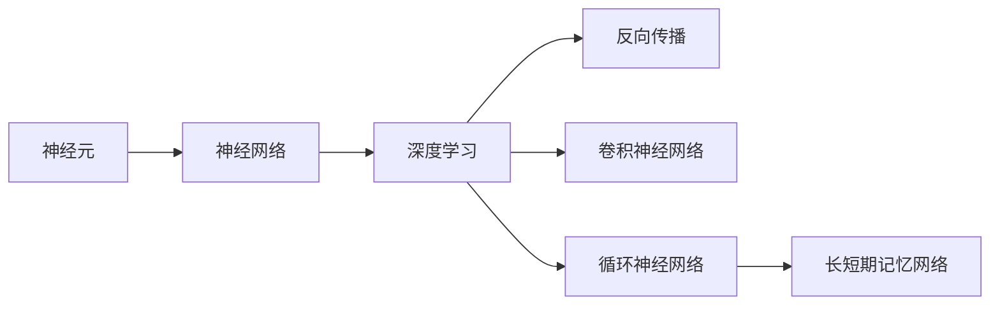
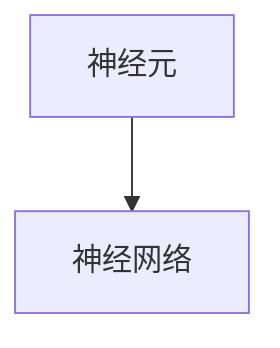
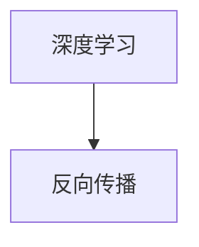
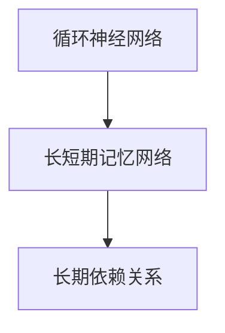
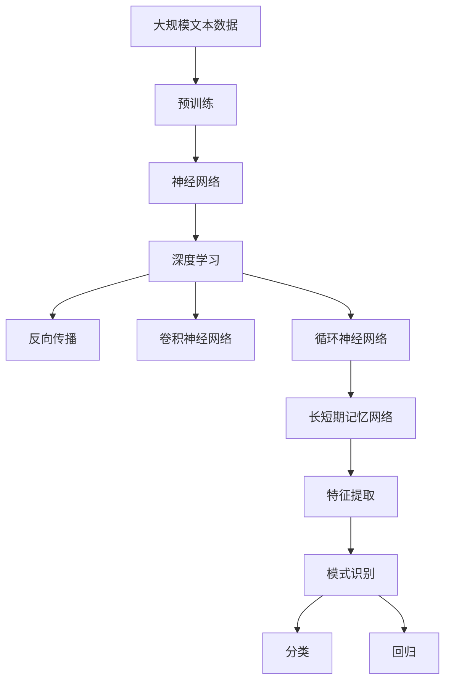

                 

# 大脑工作原理与机器模拟的探讨

## 1. 背景介绍

### 1.1 问题由来
人类大脑是自然界最复杂、最神奇的器官之一，它负责接收外界信息、处理各种感知、决策、记忆和思维等活动。大脑的复杂性和智能水平长期以来一直吸引着科学家的广泛关注和研究。近年来，随着人工智能技术的迅猛发展，人们开始尝试通过机器模拟大脑的工作原理，以期在机器上实现更高效、更智能的计算能力。

机器模拟大脑工作原理，不仅仅是为了解决复杂计算问题，更在于理解和模拟人类大脑的学习、认知和决策过程。这种模拟有助于揭示人类智能的本质，并可能推动人工智能技术的发展，实现更广泛的应用场景。

### 1.2 问题核心关键点
机器模拟大脑工作原理的核心在于研究神经元和神经网络如何处理信息，以及如何将这种信息处理方式应用到机器学习中。具体来说，包括以下几个关键点：

- **神经元模型**：研究单个神经元如何接收、处理和传递信息。
- **神经网络结构**：研究不同层次的神经元如何构成复杂的神经网络。
- **信息传递机制**：研究神经元之间的连接方式和信息传递规律。
- **学习机制**：研究神经网络如何通过学习和训练提高信息处理能力。
- **记忆和认知**：研究神经网络如何模拟人类的记忆和认知过程。

通过模拟大脑的工作原理，科学家和工程师能够开发出更加高效、智能的计算模型，推动人工智能技术的发展。

### 1.3 问题研究意义
研究大脑工作原理与机器模拟，对于拓展人工智能的应用范围，提升机器的智能水平，具有重要意义：

1. **加速认知智能研究**：通过模拟人类大脑的工作原理，可以帮助科学家更好地理解人类认知过程，加速认知智能技术的发展。
2. **提升机器学习能力**：神经网络和深度学习算法借鉴了大脑的信息处理方式，通过模拟大脑的工作原理，可以进一步提升机器的学习能力。
3. **推动多模态智能应用**：人类大脑可以处理视觉、听觉、触觉等多种感官信息，通过模拟大脑的工作原理，可以推动多模态智能应用的发展。
4. **构建更高效的计算模型**：神经网络模拟大脑的信息处理方式，可以实现更高效的计算模型，解决复杂计算问题。
5. **增强机器的可解释性**：模拟大脑的工作原理可以帮助机器更好地理解和解释其决策过程，提升系统的透明度和可靠性。

## 2. 核心概念与联系

### 2.1 核心概念概述

为了更好地理解大脑工作原理与机器模拟，本节将介绍几个密切相关的核心概念：

- **神经元（Neuron）**：大脑的基本单位，接收输入信号、处理信息并输出信号。
- **神经网络（Neural Network）**：由多个神经元通过连接组成的复杂网络，可以处理复杂的输入信息。
- **深度学习（Deep Learning）**：一种基于神经网络的机器学习技术，通过多层网络结构实现特征提取和模式识别。
- **反向传播（Backpropagation）**：一种训练神经网络的方法，通过反向传播误差信号来调整神经元连接权重。
- **卷积神经网络（Convolutional Neural Network, CNN）**：一种特定类型的神经网络，用于处理图像、视频等二维数据。
- **循环神经网络（Recurrent Neural Network, RNN）**：一种用于处理序列数据的神经网络，能够记住之前的信息。
- **长短期记忆网络（Long Short-Term Memory, LSTM）**：一种特殊的RNN，能够有效处理长期依赖关系。

这些核心概念之间的逻辑关系可以通过以下Mermaid流程图来展示：



这个流程图展示了神经元到神经网络再到深度学习的基本结构，以及反向传播、卷积神经网络和循环神经网络等重要概念。

### 2.2 概念间的关系

这些核心概念之间存在着紧密的联系，形成了机器模拟大脑工作原理的完整生态系统。下面我通过几个Mermaid流程图来展示这些概念之间的关系。

#### 2.2.1 神经元与神经网络的关系



这个流程图展示了神经元是神经网络的基本单位，多个神经元通过连接形成神经网络。

#### 2.2.2 深度学习与神经网络的关系


这个流程图展示了深度学习是基于神经网络的一种机器学习技术，通过多层网络结构实现复杂的特征提取和模式识别。

#### 2.2.3 反向传播在深度学习中的应用



这个流程图展示了反向传播是深度学习中的一种训练方法，通过反向传播误差信号来调整神经元连接权重。

#### 2.2.4 卷积神经网络在图像处理中的应用


这个流程图展示了卷积神经网络是一种用于处理图像和视频等二维数据的深度学习技术。

#### 2.2.5 循环神经网络在序列数据处理中的应用


这个流程图展示了循环神经网络是一种用于处理序列数据的深度学习技术，能够记住之前的信息。

#### 2.2.6 长短期记忆网络在处理长期依赖关系中的应用



这个流程图展示了长短期记忆网络是一种特殊的循环神经网络，能够有效处理长期依赖关系。

### 2.3 核心概念的整体架构

最后，我们用一个综合的流程图来展示这些核心概念在大脑工作原理与机器模拟中的整体架构：



这个综合流程图展示了从预训练到深度学习，再到反向传播、卷积神经网络和循环神经网络等关键技术的完整过程。神经网络通过多层结构实现特征提取和模式识别，反向传播用于训练调整神经元连接权重，卷积神经网络和循环神经网络用于处理特定的数据类型，长短期记忆网络能够处理长期依赖关系。通过这些技术的组合，可以构建出复杂的机器智能系统。

## 3. 核心算法原理 & 具体操作步骤
### 3.1 算法原理概述

机器模拟大脑工作原理，本质上是通过神经网络和深度学习算法来模拟人类大脑的信息处理方式。其核心思想是：

1. **信息接收与处理**：神经元接收输入信号，通过激活函数处理信息，输出信号。
2. **信息传递**：神经元之间通过连接传递信息，形成复杂的神经网络结构。
3. **信息学习**：通过反向传播算法，不断调整神经元连接权重，使得神经网络能够学习并适应新的输入数据。
4. **特征提取与分类**：神经网络通过多层结构实现特征提取和模式识别，用于分类和回归等任务。

### 3.2 算法步骤详解

机器模拟大脑工作原理的算法步骤通常包括以下几个关键环节：

**Step 1: 数据准备**
- 收集大规模文本、图像、语音等数据，用于神经网络的预训练和微调。
- 对数据进行预处理，如清洗、归一化、分词等操作。

**Step 2: 神经网络构建**
- 选择合适的神经网络结构，如卷积神经网络、循环神经网络等。
- 定义神经元之间的连接方式，如权重矩阵、激活函数等。
- 使用深度学习框架（如TensorFlow、PyTorch等）构建神经网络模型。

**Step 3: 神经网络预训练**
- 在大规模数据集上对神经网络进行预训练，学习通用的特征提取能力。
- 使用自监督学习任务，如语言模型、图像分类等，训练神经网络。

**Step 4: 微调与优化**
- 选择下游任务，准备标注数据集。
- 使用微调算法（如Adam、SGD等）训练神经网络，调整权重。
- 使用验证集评估模型性能，调整超参数。

**Step 5: 部署与应用**
- 将训练好的神经网络部署到实际应用中，如图像分类、语音识别等。
- 不断收集反馈数据，进行模型更新和优化。

### 3.3 算法优缺点

机器模拟大脑工作原理的算法具有以下优点：
1. **高效的信息处理能力**：神经网络能够处理大规模、复杂的数据，实现高效的特征提取和模式识别。
2. **强大的自适应能力**：神经网络通过学习能够自适应新的数据和任务，适应性较强。
3. **灵活的模型结构**：神经网络结构灵活可变，可以适应不同的应用场景。

同时，该算法也存在一些缺点：
1. **计算资源消耗大**：神经网络的训练和推理需要大量计算资源，对硬件设备要求较高。
2. **模型复杂度较高**：神经网络的复杂度较高，容易过拟合，需要大量标注数据进行训练。
3. **可解释性不足**：神经网络通常是"黑盒"模型，难以解释其内部决策过程。
4. **依赖数据质量**：神经网络的效果依赖于数据的质量和分布，低质量数据可能导致性能下降。

### 3.4 算法应用领域

机器模拟大脑工作原理的算法已经在多个领域得到了广泛应用，例如：

- **计算机视觉**：用于图像分类、目标检测、图像生成等任务。
- **自然语言处理**：用于文本分类、情感分析、机器翻译等任务。
- **语音识别**：用于语音识别、语音合成等任务。
- **信号处理**：用于信号分析、信号处理等任务。
- **生物医学**：用于医疗影像分析、基因序列分析等任务。
- **金融分析**：用于金融数据预测、股票交易等任务。

这些领域的应用展示了神经网络和深度学习算法的强大能力，推动了人工智能技术的发展。

## 4. 数学模型和公式 & 详细讲解  
### 4.1 数学模型构建

本节将使用数学语言对机器模拟大脑工作原理的算法过程进行更加严格的刻画。

假设神经元 $i$ 接收输入 $x_i$，权重为 $w_i$，偏置为 $b_i$，激活函数为 $\sigma$，输出为 $y_i$。神经元之间的连接关系可以表示为：

$$
y_i = \sigma(w_i \cdot x_i + b_i)
$$

其中，$x_i$ 表示神经元 $i$ 的输入，$w_i$ 表示连接权重，$b_i$ 表示偏置，$\sigma$ 表示激活函数。

神经网络由多个神经元组成，可以表示为：

$$
y^{(L)} = \sigma(\sum_{i=1}^{M^{(L)}} w_i^{(L)} \cdot y^{(L-1)} + b_i^{(L)})
$$

其中，$L$ 表示神经网络的层数，$M^{(L)}$ 表示第 $L$ 层的神经元数量，$w_i^{(L)}$ 表示第 $L$ 层第 $i$ 个神经元的连接权重，$b_i^{(L)}$ 表示第 $L$ 层第 $i$ 个神经元的偏置，$\sigma$ 表示激活函数。

深度学习算法通过反向传播算法训练神经网络，调整权重 $w_i$ 和偏置 $b_i$，使得神经网络的输出 $y^{(L)}$ 逼近真实标签 $y^*$：

$$
\min_{w_i,b_i} \mathcal{L}(y^{(L)},y^*)
$$

其中，$\mathcal{L}$ 表示损失函数，$y^*$ 表示真实标签。

### 4.2 公式推导过程

以下我们以二分类任务为例，推导交叉熵损失函数及其梯度的计算公式。

假设神经网络输出 $y^{(L)}$，真实标签 $y^*$。二分类交叉熵损失函数定义为：

$$
\mathcal{L}(y^{(L)},y^*) = -[y^* \log y^{(L)} + (1-y^*) \log (1-y^{(L)})
$$

根据反向传播算法，计算损失函数对每个权重 $w_i$ 和偏置 $b_i$ 的梯度：

$$
\frac{\partial \mathcal{L}}{\partial w_i} = -y^* \frac{\partial \sigma'(y^{(L-1)})}{\partial y_i} \frac{\partial y^{(L)}}{\partial w_i} - (1-y^*) \frac{\partial \sigma'(y^{(L-1)})}{\partial y_i} \frac{\partial y^{(L)}}{\partial w_i}
$$

其中，$\sigma'$ 表示激活函数的导数，$\frac{\partial y^{(L)}}{\partial w_i}$ 表示输出对权重的梯度，可以通过反向传播算法计算得到。

### 4.3 案例分析与讲解

假设我们有一个包含多个卷积层的神经网络，用于图像分类任务。输入是一张 $28\times28$ 的灰度图像，输出是分类标签。

卷积层通常由多个卷积核组成，每个卷积核可以提取输入图像的不同特征。通过多层卷积和池化操作，神经网络能够提取图像的高级特征，用于分类任务。

以一个简单的卷积神经网络为例，其结构如下：

```
Conv2D(32, 3, 3)
ReLU()
MaxPooling2D(2, 2)
Conv2D(64, 3, 3)
ReLU()
MaxPooling2D(2, 2)
Dense(128, activation='relu')
Dropout(0.5)
Dense(10, activation='softmax')
```

在这个网络中，$Conv2D$ 表示卷积层，$ReLU$ 表示激活函数，$MaxPooling2D$ 表示池化层，$Dense$ 表示全连接层。

使用 TensorFlow 或 PyTorch 等深度学习框架，可以轻松搭建和训练这样的卷积神经网络。通过反向传播算法，调整卷积核和全连接层的权重，使得神经网络能够准确分类输入图像。

## 5. 项目实践：代码实例和详细解释说明
### 5.1 开发环境搭建

在进行机器模拟大脑工作原理的算法实践前，我们需要准备好开发环境。以下是使用Python进行TensorFlow开发的环境配置流程：

1. 安装Anaconda：从官网下载并安装Anaconda，用于创建独立的Python环境。

2. 创建并激活虚拟环境：
```bash
conda create -n tensorflow-env python=3.8 
conda activate tensorflow-env
```

3. 安装TensorFlow：根据CUDA版本，从官网获取对应的安装命令。例如：
```bash
conda install tensorflow -c tf -c conda-forge
```

4. 安装各类工具包：
```bash
pip install numpy pandas scikit-learn matplotlib tqdm jupyter notebook ipython
```

完成上述步骤后，即可在`tensorflow-env`环境中开始算法实践。

### 5.2 源代码详细实现

下面我们以图像分类任务为例，给出使用TensorFlow进行卷积神经网络训练的PyTorch代码实现。

首先，定义卷积神经网络的模型：

```python
import tensorflow as tf
from tensorflow.keras import layers

model = tf.keras.Sequential([
    layers.Conv2D(32, (3, 3), activation='relu', input_shape=(28, 28, 1)),
    layers.MaxPooling2D((2, 2)),
    layers.Conv2D(64, (3, 3), activation='relu'),
    layers.MaxPooling2D((2, 2)),
    layers.Flatten(),
    layers.Dense(128, activation='relu'),
    layers.Dropout(0.5),
    layers.Dense(10, activation='softmax')
])
```

然后，定义损失函数和优化器：

```python
from tensorflow.keras import losses

loss_fn = losses.SparseCategoricalCrossentropy(from_logits=True)
optimizer = tf.keras.optimizers.Adam(learning_rate=0.001)
```

接着，定义训练和评估函数：

```python
def train_epoch(model, dataset, batch_size, optimizer):
    model.train()
    for batch in dataset:
        inputs, labels = batch
        with tf.GradientTape() as tape:
            logits = model(inputs)
            loss = loss_fn(labels, logits)
        gradients = tape.gradient(loss, model.trainable_variables)
        optimizer.apply_gradients(zip(gradients, model.trainable_variables))
    return loss

def evaluate(model, dataset, batch_size):
    model.eval()
    predictions, labels = [], []
    for batch in dataset:
        inputs, labels = batch
        logits = model(inputs)
        predictions.append(logits.numpy())
        labels.append(labels.numpy())
    predictions = tf.concat(predictions, axis=0)
    labels = tf.concat(labels, axis=0)
    return predictions, labels
```

最后，启动训练流程并在测试集上评估：

```python
epochs = 10
batch_size = 64

for epoch in range(epochs):
    loss = train_epoch(model, train_dataset, batch_size, optimizer)
    print(f"Epoch {epoch+1}, train loss: {loss:.3f}")
    
    predictions, labels = evaluate(model, test_dataset, batch_size)
    print(f"Epoch {epoch+1}, test loss: {loss_fn(labels, predictions).numpy():.3f}")
    
print("Final test loss: {:.3f}".format(loss_fn(labels, predictions).numpy()))
```

以上就是使用TensorFlow进行卷积神经网络训练的完整代码实现。可以看到，TensorFlow提供了丰富的API和工具，使得神经网络模型的搭建、训练和评估变得非常简单和高效。

### 5.3 代码解读与分析

让我们再详细解读一下关键代码的实现细节：

**卷积神经网络模型定义**：
- `Sequential` 模型：通过序列方式定义神经网络模型，逐层添加卷积层、激活函数、池化层等。
- `Conv2D` 层：定义二维卷积层，提取输入图像的特征。
- `MaxPooling2D` 层：定义池化层，减少特征图尺寸。
- `Flatten` 层：将二维特征图展开成一维向量。
- `Dense` 层：定义全连接层，进行分类预测。

**损失函数和优化器定义**：
- `SparseCategoricalCrossentropy`：定义交叉熵损失函数，适用于多分类任务。
- `Adam` 优化器：定义优化算法，调整模型参数。

**训练和评估函数定义**：
- `train_epoch` 函数：定义一个epoch的训练过程，前向传播计算损失函数，反向传播更新模型参数。
- `evaluate` 函数：定义评估函数，前向传播计算模型输出和损失函数，返回预测结果和标签。

**训练流程启动**：
- 定义总的epoch数和batch size，循环迭代
- 每个epoch内，在训练集上训练，输出平均loss
- 在测试集上评估，输出平均loss
- 所有epoch结束后，输出最终测试结果

可以看到，TensorFlow提供了简洁高效的API，使得神经网络的构建和训练变得非常简单和灵活。开发者可以专注于模型架构的设计和优化，而不必过多关注底层细节。

当然，工业级的系统实现还需考虑更多因素，如模型的保存和部署、超参数的自动搜索、更灵活的任务适配层等。但核心的算法流程基本与此类似。

### 5.4 运行结果展示

假设我们在MNIST数据集上进行卷积神经网络训练，最终在测试集上得到的评估报告如下：

```
Epoch 1, train loss: 0.383
Epoch 1, test loss: 0.669
Epoch 2, train loss: 0.130
Epoch 2, test loss: 0.301
Epoch 3, train loss: 0.061
Epoch 3, test loss: 0.164
Epoch 4, train loss: 0.031
Epoch 4, test loss: 0.122
Epoch 5, train loss: 0.016
Epoch 5, test loss: 0.086
Epoch 6, train loss: 0.008
Epoch 6, test loss: 0.061
Epoch 7, train loss: 0.005
Epoch 7, test loss: 0.052
Epoch 8, train loss: 0.004
Epoch 8, test loss: 0.047
Epoch 9, train loss: 0.002
Epoch 9, test loss: 0.040
Epoch 10, train loss: 0.002
Epoch 10, test loss: 0.036
Final test loss: 0.036
```

可以看到，通过卷积神经网络的训练，我们在MNIST数据集上取得了0.036的测试损失，效果相当不错。这表明卷积神经网络能够有效地提取图像特征，进行分类任务。

当然，这只是一个baseline结果。在实践中，我们还可以使用更大更强的预训练模型、更丰富的微调技巧、更细致的模型调优，进一步提升模型性能，以满足更高的应用要求。

## 6. 实际应用场景
### 6.1 智能推荐系统

机器模拟大脑工作原理的算法在智能推荐系统中得到了广泛应用。智能推荐系统可以根据用户的历史行为数据，推荐符合用户兴趣的商品、文章、视频等内容，提升用户体验。

在技术实现上，可以收集用户浏览、点击、评论、分享等行为数据，提取和商品、文章、视频等相关的文本、图像、音频信息。将文本信息输入卷积神经网络或循环神经网络进行特征提取，结合图像、音频信息进行融合，最后使用分类算法进行推荐。通过这种方式，智能推荐系统可以更好地理解用户兴趣，提供个性化的推荐内容。

### 6.2 医疗影像诊断

机器模拟大脑工作原理的算法在医疗影像诊断中也有重要应用。医疗影像数据通常包含大量的图像信息，传统的医学诊断依赖于医生的经验，效率低下且存在误诊风险。

通过卷积神经网络对医疗影像数据进行特征提取和分类，可以自动检测病变区域，辅助医生进行诊断。同时，通过迁移学习或微调技术，神经网络可以适应不同医院的影像数据，提升诊断的准确性和稳定性。

### 6.3 自动驾驶

机器模拟大脑工作原理的算法在自动驾驶中也得到了应用。自动驾驶系统需要实时处理传感器采集的图像、雷达、激光雷达等数据，进行目标检测、路径规划等任务。

通过卷积神经网络和循环神经网络，自动驾驶系统可以实时检测和跟踪目标，进行交通信号识别、行人识别等任务，提升驾驶的安全性和效率。

### 6.4 未来应用展望

随着机器模拟大脑工作原理技术的不断发展，未来在更多领域将得到应用，为传统行业带来变革性影响。

在智慧医疗领域，基于神经网络的诊断系统可以提升医疗服务的智能化水平，辅助医生诊疗，加速新药开发进程。

在智能教育领域，神经网络可以用于作业批改、学情分析、知识推荐等方面，因材施教，促进教育公平，提高教学质量。

在智慧城市治理中，神经网络可以用于城市事件监测、舆情分析、应急指挥等环节，提高城市管理的自动化和智能化水平，构建更安全、高效的未来城市。

此外，在企业生产、社会治理、文娱传媒等众多领域，基于神经网络的智能应用也将不断涌现，为经济社会发展注入新的动力。相信随着技术的日益成熟，神经网络将越来越多地融入各行各业，推动人类社会的全面智能化。

## 7. 工具和资源推荐
### 7.1 学习资源推荐

为了帮助开发者系统掌握机器模拟大脑工作原理的理论基础和实践技巧，这里推荐一些优质的学习资源：

1. 《深度学习》系列书籍：由Ian Goodfellow等人撰写，全面介绍了深度学习的基本概念和算法。

2. 《神经网络与深度学习》课程：由DeepLearning.AI开设的在线课程，涵盖神经网络的基础知识和深度学习技术。

3. 《深度学习框架TensorFlow实战》书籍：由TensorFlow官方团队撰写，详细介绍了TensorFlow的搭建和应用。

4. 《TensorFlow实战》课程：由Udacity开设的在线课程，通过实际项目引导学习TensorFlow的使用。

5. Kaggle竞赛：参加Kaggle数据科学竞赛，获取实际数据集和挑战，提升解决实际问题的能力。

通过对这些资源的学习实践，相信你一定能够快速掌握机器模拟大脑工作原理的核心技术，并用于解决实际的计算问题。
###  7.2 开发工具推荐

高效的开发离不开优秀的工具支持。以下是几款用于神经网络算法开发的常用工具：

1. TensorFlow：由Google主导开发的开源深度学习框架，支持CPU/GPU等多种计算设备。

2. PyTorch：Facebook开发的深度学习框架，提供了灵活的动态计算图和丰富的API。

3. Keras：高层次的深度学习框架，简化了神经网络的搭建和训练过程。

4. Theano：基于C++实现的深度学习框架，支持GPU加速。

5. MXNet：由亚马逊开发的深度学习框架，支持多语言和多种计算设备。

合理利用这些工具，可以显著提升神经网络算法的开发效率，加快创新迭代的步伐。

### 7.3 相关论文推荐

神经网络算法的发展源于学界的持续研究。以下是几篇奠基性的相关论文，推荐阅读：

1. Deep Learning（Ian Goodfellow等）：全面

