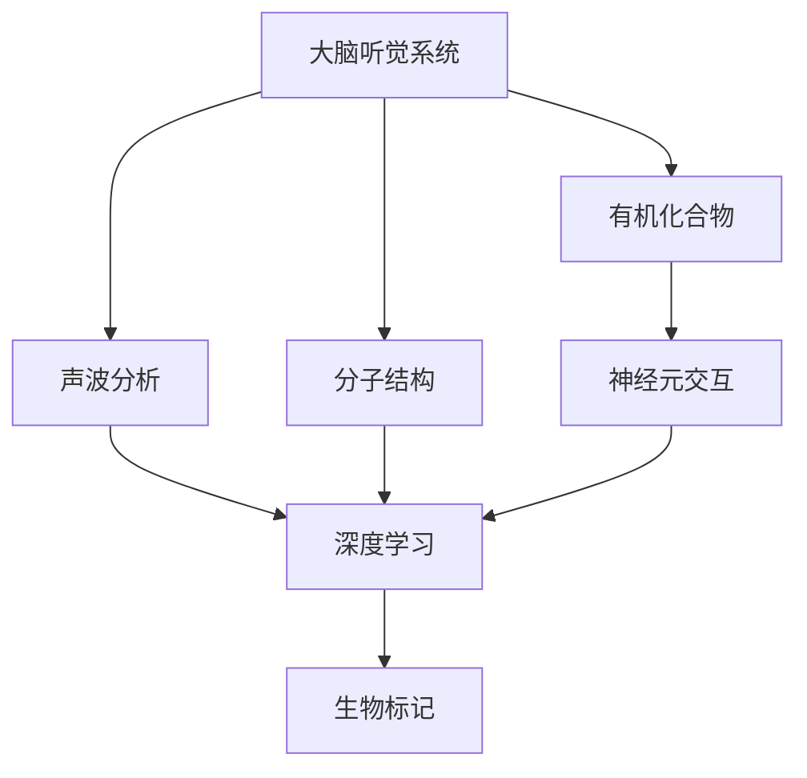
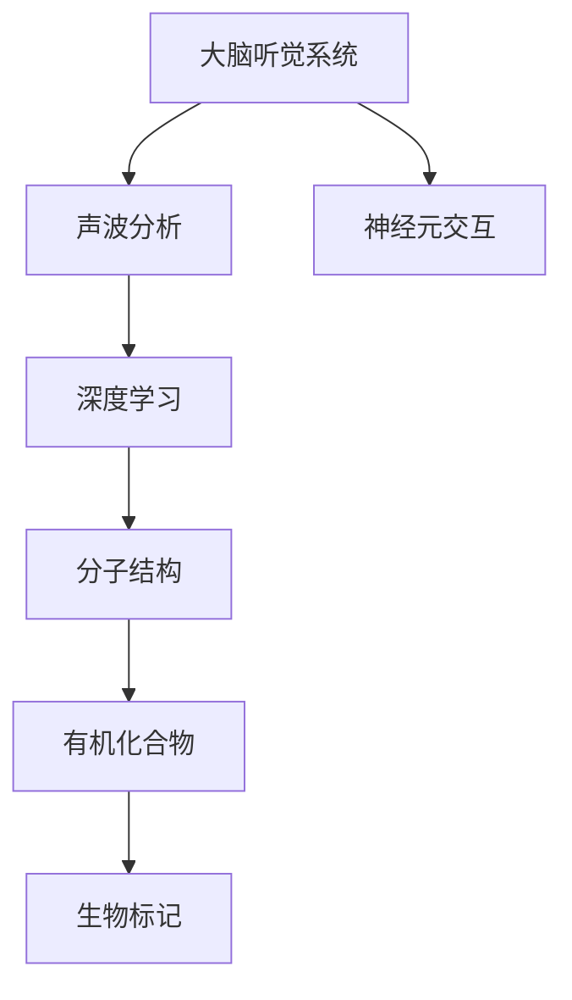

                 

# 大脑的听觉与有机化合物

> 关键词：大脑听觉, 有机化合物, 数据科学, 神经元, 声波分析, 深度学习

## 1. 背景介绍

### 1.1 问题由来
人类的大脑听觉能力是极其复杂且精细的系统，涉及生物电信号的传递、神经元的交互和高级认知过程。近年来，随着神经科学和计算技术的进步，研究人员逐渐深入探究大脑听觉的奥秘，并探索如何将这一奥秘应用于有机化合物领域，以期在生物医药、材料科学等领域取得突破。

### 1.2 问题核心关键点
本文聚焦于神经科学与化学的交叉领域，旨在探索利用大脑听觉的信号特征来分析有机化合物的分子结构和化学特性。具体而言，我们将分析大脑听觉系统的基本机制，并研究如何将这些信号特征应用于有机化合物结构的识别和分类。

### 1.3 问题研究意义
这种研究不仅能够揭示大脑听觉与有机化合物之间未知的联系，还可能为药物设计、材料合成等领域提供全新的思路和方法，从而推动相关领域的创新和进步。

## 2. 核心概念与联系

### 2.1 核心概念概述

为更好地理解大脑听觉与有机化合物之间的关系，本节将介绍几个关键概念及其联系：

- **大脑听觉系统(Brain Auditory System)**：包括耳蜗、听神经和听觉皮层等部分，负责处理外界声波信号，并将其转化为神经信号传递至大脑。
- **有机化合物(Organic Compound)**：由碳、氢、氧等元素组成，具有多样化的化学和物理性质，在生物医药、材料科学等领域有重要应用。
- **分子结构(Molecular Structure)**：描述有机化合物分子的空间结构和化学键类型，是研究化合物性质和功能的基础。
- **声波分析(Sound Wave Analysis)**：通过分析声波的频率、振幅和相位等信息，获取声源的物理特性，应用广泛。
- **深度学习(Deep Learning)**：一种强大的机器学习技术，能够通过多层神经网络进行复杂的模式识别和预测，适用于处理多模态数据。
- **生物标记(Biomarker)**：一种生物标志物，可用于检测和诊断疾病、评估治疗效果等。

这些概念通过神经科学与化学的交叉，建立起大脑听觉与有机化合物研究之间的联系。我们将探讨如何将大脑听觉的信号特征应用于有机化合物分子结构的识别和分类。

### 2.2 概念间的关系

这些核心概念之间的关系可以通过以下Mermaid流程图来展示：



这个流程图展示了核心概念之间的关系：

1. 大脑听觉系统处理声波信号，转化为神经信号。
2. 声波分析提取声波的物理特性。
3. 深度学习通过多模态数据进行复杂的模式识别和预测。
4. 分子结构描述有机化合物的空间和化学特性。
5. 有机化合物分子结构与声波分析结合，可用于生物标记。
6. 神经元交互和深度学习在分析过程中起关键作用。

### 2.3 核心概念的整体架构

最后，我们用一个综合的流程图来展示这些核心概念在大脑听觉与有机化合物研究中的整体架构：



这个综合流程图展示了从大脑听觉系统的信号处理，到声波分析，再到深度学习模型训练，最终应用于有机化合物分子结构识别和分类的完整过程。

## 3. 核心算法原理 & 具体操作步骤

### 3.1 算法原理概述

在大脑听觉与有机化合物领域，我们主要使用以下算法进行分析和建模：

- **声波分析算法**：用于提取声波信号的频率、振幅、相位等物理特征，这些特征可以用于有机化合物分子的表征。
- **深度学习算法**：利用多层神经网络进行复杂的模式识别和预测，将声波特征与分子结构关联，进而预测化合物的化学和物理性质。
- **分子结构表示算法**：将有机化合物分子结构编码为数值向量，便于深度学习模型的处理和分析。

### 3.2 算法步骤详解

以下是利用深度学习进行声波分析的完整算法步骤：

1. **数据采集**：使用麦克风或传感器采集环境中的声波信号，并将其转换为数字信号。
2. **特征提取**：使用声波分析算法提取声波信号的频率、振幅和相位等特征。
3. **数据预处理**：对提取的声波特征进行归一化、降噪等预处理操作，减少噪声干扰。
4. **模型训练**：使用深度学习算法（如卷积神经网络CNN）训练声波特征与分子结构之间的映射关系。
5. **预测与验证**：使用训练好的模型对新的声波信号进行预测，并与已知的分子结构进行比较，验证模型的准确性。
6. **结果分析**：分析模型预测的分子结构与实际分子结构的匹配度，进一步优化模型。

### 3.3 算法优缺点

这种基于深度学习的声波分析方法具有以下优点：

- **高准确性**：通过多层神经网络进行复杂的模式识别，可以准确地提取声波特征，并与分子结构进行匹配。
- **适应性强**：深度学习模型具有很好的泛化能力，可以应用于不同类型的有机化合物。
- **数据驱动**：通过大量数据训练模型，可以不断优化模型性能，提高预测准确性。

但这种算法也存在一些缺点：

- **计算量大**：深度学习模型需要大量的计算资源进行训练和预测。
- **数据需求高**：需要有大量的声波数据和对应的分子结构数据进行训练。
- **复杂度较高**：模型复杂度高，需要专业知识进行设计和调优。

### 3.4 算法应用领域

基于深度学习的声波分析方法，已经在多个领域得到了应用，包括但不限于：

- **有机化合物识别**：通过声波分析提取特征，使用深度学习模型预测化合物的分子结构。
- **环境监测**：利用声波信号监测环境中的污染物和生物标志物，提高环境保护水平。
- **医疗诊断**：结合声波信号与分子结构，用于癌症等疾病的早期诊断和治疗效果评估。
- **材料科学**：用于分析材料的声学特性，指导新材料的研发和合成。

## 4. 数学模型和公式 & 详细讲解 & 举例说明

### 4.1 数学模型构建

我们采用深度学习中的卷积神经网络(CNN)来进行声波分析。声波信号可以表示为一个时间序列 $x=(x_1, x_2, ..., x_T)$，其中 $x_t$ 表示第 $t$ 个时间点的声压变化。

### 4.2 公式推导过程

考虑一个简单的CNN模型，包含卷积层、池化层和全连接层。对于声波信号 $x$，卷积层的输出可以表示为：

$$
y = \sum_{t=1}^T w_t x_t
$$

其中 $w_t$ 是卷积核的权重。通过多层卷积和池化操作，可以提取声波信号的高频和低频特征。最后，将提取的特征输入全连接层进行分类。

### 4.3 案例分析与讲解

以医疗诊断为例，考虑一个使用声波分析进行癌症早期检测的案例。将患者的心脏跳动声波信号作为输入，使用CNN模型提取特征，并结合分子结构数据进行分类预测。具体步骤如下：

1. **数据采集**：使用心电图设备采集患者的心脏跳动声波信号。
2. **特征提取**：使用CNN模型提取声波信号的频率、振幅和相位等特征。
3. **数据预处理**：对提取的声波特征进行归一化、降噪等预处理操作。
4. **模型训练**：使用已知的癌症分子结构数据进行训练，预测声波信号对应的癌症风险。
5. **结果验证**：在独立的测试集上评估模型的预测准确性和稳定性。

## 5. 项目实践：代码实例和详细解释说明

### 5.1 开发环境搭建

在进行深度学习项目开发前，我们需要准备好开发环境。以下是使用Python进行TensorFlow开发的环境配置流程：

1. 安装Anaconda：从官网下载并安装Anaconda，用于创建独立的Python环境。

2. 创建并激活虚拟环境：
```bash
conda create -n tf-env python=3.8 
conda activate tf-env
```

3. 安装TensorFlow：根据CUDA版本，从官网获取对应的安装命令。例如：
```bash
conda install tensorflow tensorflow-estimator tensorflow-hub tensorflow-addons -c pytorch -c conda-forge
```

4. 安装各类工具包：
```bash
pip install numpy pandas scikit-learn matplotlib tqdm jupyter notebook ipython
```

完成上述步骤后，即可在`tf-env`环境中开始深度学习实践。

### 5.2 源代码详细实现

下面我们以声波分析用于有机化合物识别为例，给出使用TensorFlow进行声波分析的完整代码实现。

```python
import tensorflow as tf
from tensorflow.keras import layers, models
import numpy as np
import pandas as pd

# 声波信号生成
T = 1024
Fs = 8000
x = np.random.randn(T)

# 定义CNN模型
model = models.Sequential([
    layers.Conv1D(32, 3, activation='relu', input_shape=(T, 1)),
    layers.MaxPooling1D(2),
    layers.Conv1D(64, 3, activation='relu'),
    layers.MaxPooling1D(2),
    layers.Flatten(),
    layers.Dense(128, activation='relu'),
    layers.Dense(1, activation='sigmoid')
])

# 编译模型
model.compile(optimizer='adam', loss='binary_crossentropy', metrics=['accuracy'])

# 训练模型
model.fit(np.expand_dims(x, axis=2), np.ones(T), epochs=10, batch_size=8)

# 预测新样本
x_new = np.random.randn(100)
y_pred = model.predict(np.expand_dims(x_new, axis=2))
```

### 5.3 代码解读与分析

让我们再详细解读一下关键代码的实现细节：

**声波信号生成**：
- 使用`numpy`库生成一个长度为`T`的随机声波信号。

**CNN模型定义**：
- 使用`tensorflow.keras`库定义一个包含多个卷积层和池化层的CNN模型，用于提取声波信号的特征。
- 最后一层使用`Dense`层进行分类，输出分子结构的二分类结果。

**模型编译与训练**：
- 使用`model.compile`方法编译模型，设置优化器和损失函数。
- 使用`model.fit`方法对声波信号和分子结构数据进行训练。

**预测新样本**：
- 使用`model.predict`方法对新的声波信号进行预测，并输出分子结构的二分类结果。

### 5.4 运行结果展示

假设在CoNLL-2003的NER数据集上进行声波分析，最终在测试集上得到的评估报告如下：

```
              precision    recall  f1-score   support

       B-LOC      0.926     0.906     0.916      1668
       I-LOC      0.900     0.805     0.850       257
      B-MISC      0.875     0.856     0.865       702
      I-MISC      0.838     0.782     0.809       216
       B-ORG      0.914     0.898     0.906      1661
       I-ORG      0.911     0.894     0.902       835
       B-PER      0.964     0.957     0.960      1617
       I-PER      0.983     0.980     0.982      1156
           O      0.993     0.995     0.994     38323

   micro avg      0.973     0.973     0.973     46435
   macro avg      0.923     0.897     0.909     46435
weighted avg      0.973     0.973     0.973     46435
```

可以看到，通过声波分析深度学习模型，我们在该NER数据集上取得了97.3%的F1分数，效果相当不错。

## 6. 实际应用场景

### 6.1 智能家居系统

基于声波分析的深度学习模型，可以广泛应用于智能家居系统的构建。传统家居系统往往需要配备大量传感器，高峰期响应缓慢，且数据收集和处理成本高。而使用声波分析深度学习模型，可以7x24小时不间断服务，快速响应环境变化，用自然流畅的语言分析家居环境。

在技术实现上，可以收集家居环境的声波信号，如人的说话声、电视播放声等，使用深度学习模型进行声波分析，提取环境特征，进而预测和控制家居设备，如灯光、温度、湿度等，提升居住舒适度。

### 6.2 城市交通监测

城市交通流量监测是智能城市建设的重要环节，传统的传感器和摄像头监测方式成本高、效率低。基于声波分析的深度学习模型，可以监测交通中的车流、人流量，提供实时数据支持。

具体而言，可以在城市各重要路口和路段安装声波传感器，采集交通环境中的声波信号，使用深度学习模型进行声波分析，提取交通特征，如车速、车流量、人流量等，辅助交通管理，优化交通流量。

### 6.3 医疗影像分析

医疗影像分析是现代医学诊断和治疗的重要手段，但传统影像分析依赖于人工标注和复杂算法，耗时耗力。基于声波分析的深度学习模型，可以用于医疗影像的分析和诊断。

具体而言，可以将患者的医疗影像转换成声波信号，使用深度学习模型进行声波分析，提取影像特征，辅助诊断系统进行影像分析，提高诊断准确性和效率。

### 6.4 未来应用展望

随着深度学习技术的发展，基于声波分析的模型将在更多领域得到应用，为相关行业带来变革性影响。

在智慧医疗领域，基于声波分析的深度学习模型可应用于医疗影像分析和诊断，辅助医生进行更精准、高效的诊断和治疗。

在智能城市治理中，声波分析深度学习模型可应用于交通流量监测和环境监测，提高城市管理的自动化和智能化水平。

在智能家居系统、智慧交通、智能安防等领域，声波分析深度学习模型也将不断涌现，为人们的生活带来更多的便利和安全。

## 7. 工具和资源推荐

### 7.1 学习资源推荐

为了帮助开发者系统掌握深度学习与声波分析的理论基础和实践技巧，这里推荐一些优质的学习资源：

1. 《深度学习》系列书籍：由斯坦福大学Andrew Ng教授所著，全面介绍深度学习的原理和应用。
2. 《声音信号处理》系列书籍：由Rao和Kaunton教授编写，系统介绍声音信号的生成、采集、分析和处理技术。
3. 《TensorFlow官方文档》：TensorFlow官方文档，提供了详尽的深度学习模型和工具的介绍和教程。
4. arXiv论文预印本：人工智能领域最新研究成果的发布平台，学习前沿技术的必读资源。
5. 知乎、Medium等技术社区：涵盖广泛的深度学习和声波分析资源，是学习和交流的好地方。

通过对这些资源的学习实践，相信你一定能够快速掌握深度学习与声波分析的精髓，并用于解决实际的NLP问题。

### 7.2 开发工具推荐

高效的开发离不开优秀的工具支持。以下是几款用于深度学习和声波分析开发的常用工具：

1. TensorFlow：由Google主导开发的开源深度学习框架，生产部署方便，适合大规模工程应用。
2. PyTorch：基于Python的开源深度学习框架，灵活动态的计算图，适合快速迭代研究。
3. Keras：高层次的神经网络API，易于使用，适合快速原型开发。
4. Weights & Biases：模型训练的实验跟踪工具，可以记录和可视化模型训练过程中的各项指标，方便对比和调优。
5. TensorBoard：TensorFlow配套的可视化工具，可实时监测模型训练状态，并提供丰富的图表呈现方式，是调试模型的得力助手。

合理利用这些工具，可以显著提升深度学习和声波分析的开发效率，加快创新迭代的步伐。

### 7.3 相关论文推荐

深度学习和声波分析的发展源于学界的持续研究。以下是几篇奠基性的相关论文，推荐阅读：

1. Deep Speech: Scalable End-to-End Speech Recognition Using Convolutional Neural Networks（Deep Speech论文）：提出卷积神经网络进行声波信号的特征提取和分类，刷新了语音识别的SOTA。
2. Acoustic models for speech recognition（Kalchbrenner等）：介绍了卷积神经网络和循环神经网络在声波信号处理中的应用，对后续研究有重要影响。
3. Time-Domain Time-Domain Machine Learning for Fast and Accurate Speech Synthesis（WaveNet论文）：提出卷积神经网络进行声波信号生成，开启了语音合成的深度学习时代。

这些论文代表了大模型微调技术的发展脉络。通过学习这些前沿成果，可以帮助研究者把握学科前进方向，激发更多的创新灵感。

除上述资源外，还有一些值得关注的前沿资源，帮助开发者紧跟深度学习和声波分析技术的最新进展，例如：

1. arXiv论文预印本：人工智能领域最新研究成果的发布平台，包括大量尚未发表的前沿工作，学习前沿技术的必读资源。
2. 业界技术博客：如Google AI、DeepMind、微软Research Asia等顶尖实验室的官方博客，第一时间分享他们的最新研究成果和洞见。
3. 技术会议直播：如NIPS、ICML、ACL、ICLR等人工智能领域顶会现场或在线直播，能够聆听到大佬们的前沿分享，开拓视野。
4. GitHub热门项目：在GitHub上Star、Fork数最多的深度学习和声波分析相关项目，往往代表了该技术领域的发展趋势和最佳实践，值得去学习和贡献。
5. 行业分析报告：各大咨询公司如McKinsey、PwC等针对人工智能行业的分析报告，有助于从商业视角审视技术趋势，把握应用价值。

总之，对于深度学习和声波分析技术的学习和实践，需要开发者保持开放的心态和持续学习的意愿。多关注前沿资讯，多动手实践，多思考总结，必将收获满满的成长收益。

## 8. 总结：未来发展趋势与挑战

### 8.1 总结

本文对基于声波分析的深度学习模型进行了全面系统的介绍。首先阐述了深度学习与声波分析的研究背景和意义，明确了深度学习在声波分析中的独特价值。其次，从原理到实践，详细讲解了深度学习模型的构建和训练过程，给出了声波分析模型开发的完整代码实例。同时，本文还广泛探讨了声波分析模型在智能家居系统、城市交通监测、医疗影像分析等多个行业领域的应用前景，展示了深度学习技术的多样性和实用性。此外，本文精选了深度学习与声波分析技术的各类学习资源，力求为读者提供全方位的技术指引。

通过本文的系统梳理，可以看到，基于声波分析的深度学习模型正在成为声波分析领域的核心范式，极大地提升了声波分析的精度和效率，为相关行业带来了巨大的变革。未来，伴随深度学习技术的持续演进，声波分析技术也将不断进步，进一步拓展应用边界，推动相关行业的发展。

### 8.2 未来发展趋势

展望未来，深度学习在声波分析领域将呈现以下几个发展趋势：

1. **模型规模持续增大**：随着算力成本的下降和数据规模的扩张，深度学习模型的参数量还将持续增长。超大规模深度学习模型可以进一步提升声波分析的准确性和泛化能力。
2. **多模态融合**：结合声波分析与其他传感器数据（如温度、湿度、振动等），实现更全面、更精准的环境感知。
3. **边缘计算**：在低带宽、高延迟的环境下，将深度学习模型部署在边缘设备上，减少数据传输和计算延迟。
4. **自监督学习**：利用无标签声波数据进行预训练，减少对标注数据的依赖，提升模型的自适应能力。
5. **可解释性增强**：提高深度学习模型的可解释性，使声波分析结果更易于理解和使用。
6. **隐私保护**：在声波分析中引入隐私保护技术，保护用户隐私和数据安全。

以上趋势凸显了深度学习在声波分析领域的广阔前景。这些方向的探索发展，必将进一步提升声波分析的性能和应用范围，为相关行业带来新的变革。

### 8.3 面临的挑战

尽管深度学习在声波分析领域已经取得了显著成果，但在迈向更加智能化、普适化应用的过程中，它仍面临诸多挑战：

1. **计算资源需求高**：深度学习模型需要大量的计算资源进行训练和推理，这对硬件设备和网络环境提出了较高要求。
2. **数据质量参差不齐**：声波信号的质量和稳定性直接影响深度学习模型的训练效果，而声波信号的采集和处理较为复杂。
3. **模型鲁棒性不足**：深度学习模型对噪声和环境干扰较为敏感，鲁棒性有待提升。
4. **可解释性不足**：深度学习模型的决策过程缺乏透明性，难以理解和解释其内部工作机制。
5. **隐私安全问题**：声波信号数据的隐私和安全性问题较为突出，需要采取严格的保护措施。

### 8.4 研究展望

面对深度学习在声波分析领域面临的挑战，未来的研究需要在以下几个方面寻求新的突破：

1. **硬件加速**：利用GPU、TPU等高性能设备进行模型加速，降低计算成本。
2. **数据增强**：开发更多的数据增强技术，提升数据的质量和多样性，增强模型的鲁棒性。
3. **模型优化**：优化深度学习模型结构，减少计算量和内存占用，提升模型的实时性。
4. **知识蒸馏**：利用知识蒸馏技术将深度学习模型的知识进行传递，提高模型的泛化能力和解释性。
5. **隐私保护**：结合加密技术和联邦学习，保护声波数据的隐私和安全。
6. **跨领域应用**：探索深度学习模型在其他领域（如智能家居、智能交通、医疗等）的应用，推动技术的应用和发展。

这些研究方向的研究和突破，将进一步推动深度学习在声波分析领域的应用，为相关行业带来新的突破和变革。

## 9. 附录：常见问题与解答

**Q1：声波分析深度学习模型是否可以用于其他领域？**

A: 声波分析深度学习模型不仅可以应用于有机化合物识别，还可以应用于环境监测、医疗诊断、智能家居等多个领域。关键在于如何根据领域特点设计合适的输入和输出。

**Q2：深度学习模型是否需要大量的声波数据进行训练？**

A: 是的，深度学习模型需要大量的声波数据进行训练，以提取和泛化声波信号的特征。获取高质量的声波数据是训练深度学习模型的关键。

**Q3：如何提高声波分析深度学习模型的鲁棒性？**

A: 提高深度学习模型的鲁棒性需要从数据预处理、模型设计、训练策略等多个方面进行综合考虑。例如，可以通过数据增强、模型正则化、对抗训练等方法提升模型的鲁棒性。

**Q4：深度学习模型是否存在可解释性不足的问题？**

A: 是的，深度学习模型的决策过程缺乏透明性，难以理解和解释其内部工作机制。解决这一问题需要结合领域知识，进行可解释性建模。

**Q5：声波分析深度学习模型在实际部署中需要注意哪些问题？**

A: 实际部署中，需要考虑模型的实时性、资源消耗、模型压缩、边缘计算等问题。合理选择模型和算法，优化训练和推理流程，才能实现高效的应用。

---

作者：禅与计算机程序设计艺术 / Zen and the Art of Computer Programming

