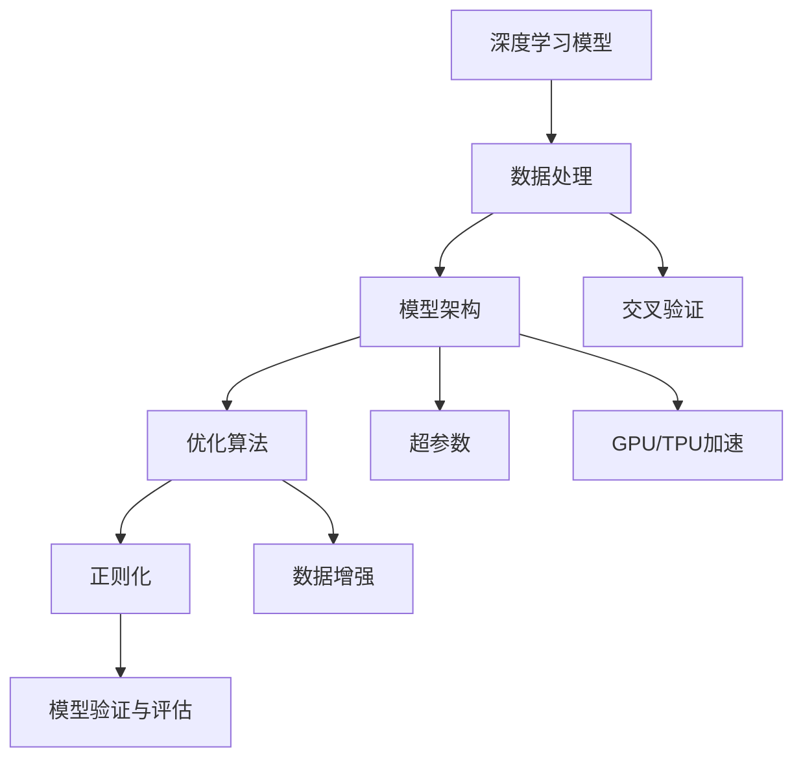
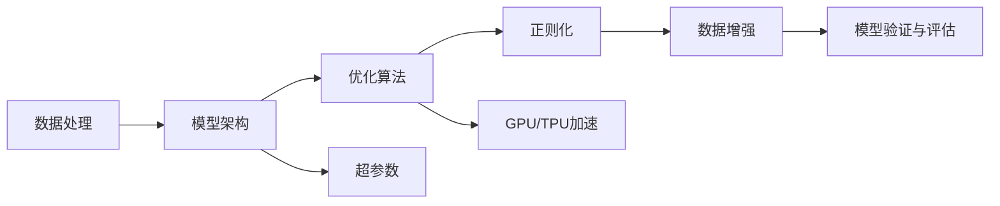
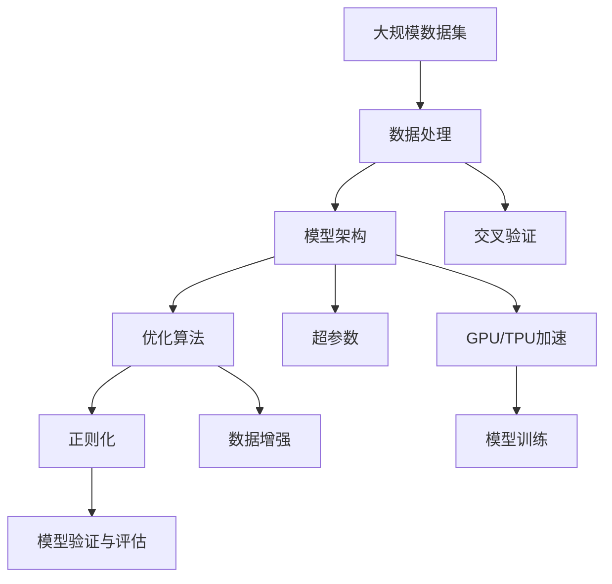

                 

# 大规模数据训练的基础模型

> 关键词：大规模数据训练,基础模型,深度学习,数据处理,模型架构,优化算法

## 1. 背景介绍

### 1.1 问题由来

在大数据时代，随着数据量的爆炸性增长和计算能力的飞速提升，深度学习模型正在迅速发展并逐步应用于各个领域，如图像识别、自然语言处理、推荐系统等。而大规模数据训练（Large-scale Data Training）作为深度学习领域中的核心技术，在模型训练、推理和优化等方面发挥着至关重要的作用。因此，掌握基础模型的训练技巧，成为确保深度学习模型性能优异的必要条件。

### 1.2 问题核心关键点

基础模型训练的核心理念是：通过大规模数据集的有效利用，结合先进的模型架构和高效的优化算法，训练出高质量的深度学习模型。具体关键点包括：

1. **数据处理**：数据的收集、清洗、预处理和增强等步骤对于模型的训练效果至关重要。
2. **模型架构**：选择适当的深度神经网络架构，确保模型具备强大的表达能力和泛化能力。
3. **优化算法**：选择合适的优化算法和超参数配置，提高模型的训练速度和收敛性能。
4. **模型验证与评估**：在训练过程中对模型进行验证，及时调整超参数以提升模型性能。
5. **硬件资源**：合理配置计算资源（如CPU/GPU/TPU等），确保训练过程的顺利进行。

通过这些关键点的有效控制，可以显著提升大规模数据训练的效果，训练出高性能的深度学习模型。

### 1.3 问题研究意义

基础模型训练在深度学习中的重要性不言而喻，其研究意义主要体现在以下几个方面：

1. **提高模型性能**：通过科学合理的训练策略，能够显著提高模型的预测准确率和泛化能力。
2. **降低训练成本**：有效的训练方法能够减少训练时间和计算资源，降低训练成本。
3. **增强模型鲁棒性**：通过多种优化技巧和数据增强方法，可以提升模型在面对新数据时的鲁棒性。
4. **促进产业应用**：经过充分训练的模型能够更快速地应用于实际业务场景，推动深度学习技术在各行业的落地应用。
5. **推动学术进步**：基础模型训练的研究能够推动深度学习领域的学术发展和理论创新。

因此，掌握基础模型训练的技术和方法，不仅有助于提高模型性能，还能加速深度学习技术的产业化进程，促进其广泛应用和深入研究。

## 2. 核心概念与联系

### 2.1 核心概念概述

为更好地理解大规模数据训练的基础模型，本节将介绍几个密切相关的核心概念：

- **深度学习模型（Deep Learning Model）**：基于神经网络结构的机器学习模型，具备强大的特征提取和模式识别能力。
- **优化算法（Optimization Algorithm）**：用于更新模型参数以最小化损失函数的算法，如梯度下降、Adam、RMSprop等。
- **正则化（Regularization）**：通过在损失函数中添加正则项，防止过拟合的技术，如L1正则、L2正则、Dropout等。
- **数据增强（Data Augmentation）**：通过对训练数据进行扩充或变换，提升模型泛化能力的技术。
- **交叉验证（Cross-Validation）**：通过将数据集分为若干子集进行交叉验证，评估模型性能的技术。
- **超参数（Hyperparameter）**：需要手动设置的模型参数，如学习率、批大小、迭代次数等，对模型性能有重要影响。
- **GPU/TPU加速**：使用高性能计算设备（如GPU/TPU）进行模型训练，显著提升训练速度和效果。

这些核心概念之间的逻辑关系可以通过以下Mermaid流程图来展示：



这个流程图展示了大规模数据训练中各核心概念之间的关系：

1. 深度学习模型基于数据处理得到的训练集进行训练，并利用模型架构、优化算法和正则化技术进行优化。
2. 数据增强和交叉验证进一步提升模型的泛化能力。
3. 超参数配置和GPU/TPU加速加快训练过程。
4. 模型验证与评估确保模型在实际应用中的性能。

### 2.2 概念间的关系

这些核心概念之间存在着紧密的联系，形成了大规模数据训练的完整生态系统。下面我们通过几个Mermaid流程图来展示这些概念之间的关系。

#### 2.2.1 深度学习模型的训练流程



这个流程图展示了深度学习模型的训练流程。数据处理、模型架构、优化算法、正则化和数据增强是模型训练的主要步骤，每个步骤都相互影响，共同决定模型的最终性能。

#### 2.2.2 模型验证与评估的流程


这个流程图展示了模型验证与评估的基本流程。通过交叉验证技术，使用部分数据作为验证集，评估模型在未见过的数据上的性能，从而调整超参数，优化模型。

#### 2.2.3 GPU/TPU加速的流程


这个流程图展示了GPU/TPU加速的基本流程。使用高性能计算设备，可以显著提升模型训练的速度，减少训练时间。

### 2.3 核心概念的整体架构

最后，我们用一个综合的流程图来展示这些核心概念在大规模数据训练过程中的整体架构：



这个综合流程图展示了从数据处理到模型训练的完整过程。数据处理、模型架构、优化算法、正则化、数据增强和交叉验证是模型训练的主要环节，GPU/TPU加速和模型验证与评估是进一步提升模型性能的关键步骤。通过这些步骤的有效组合，可以训练出高质量的深度学习模型。

## 3. 核心算法原理 & 具体操作步骤
### 3.1 算法原理概述

大规模数据训练的核心算法原理主要基于深度神经网络的架构设计、优化算法的选择和超参数的调优。以下是这些原理的详细解释：

1. **深度神经网络架构**：深度神经网络通常由多个层次组成，每个层次包含多个神经元，通过前向传播和反向传播更新权重，学习特征表示。常见的深度神经网络架构包括卷积神经网络（CNN）、循环神经网络（RNN）、长短时记忆网络（LSTM）和Transformer等。

2. **优化算法**：优化算法用于更新模型参数，最小化损失函数。常用的优化算法包括梯度下降（GD）、随机梯度下降（SGD）、Adam、RMSprop等。这些算法通过计算梯度并更新参数，使得模型不断逼近最优解。

3. **正则化**：正则化技术用于防止过拟合，确保模型在未见过的数据上也有良好的泛化能力。常用的正则化方法包括L1正则、L2正则、Dropout等。这些方法通过限制模型的复杂度，防止过拟合。

4. **数据增强**：数据增强技术通过对训练数据进行扩充或变换，提高模型的泛化能力。常见的数据增强方法包括随机裁剪、旋转、翻转等。这些方法通过增加训练数据的多样性，提高模型的鲁棒性。

5. **超参数调优**：超参数是模型中需要手动设置的参数，如学习率、批大小、迭代次数等。通过交叉验证等技术，可以找到最佳的超参数组合，提升模型性能。

### 3.2 算法步骤详解

以下是大规模数据训练的具体操作步骤，包括数据处理、模型架构设计、超参数调优等关键步骤：

**Step 1: 数据准备**
- 收集、清洗和预处理大规模数据集，确保数据的质量和有效性。
- 将数据集划分为训练集、验证集和测试集，便于模型训练和评估。

**Step 2: 模型架构设计**
- 选择合适的深度神经网络架构，如卷积神经网络（CNN）、循环神经网络（RNN）、长短时记忆网络（LSTM）和Transformer等。
- 设计模型的层次结构和激活函数，确保模型具备强大的表达能力。

**Step 3: 模型初始化**
- 初始化模型的参数，一般使用随机初始化或预训练初始化。
- 将模型加载到GPU/TPU等高性能计算设备，加快训练过程。

**Step 4: 优化算法选择**
- 选择合适的优化算法，如梯度下降（GD）、随机梯度下降（SGD）、Adam、RMSprop等。
- 设置学习率、批大小、迭代次数等超参数。

**Step 5: 正则化技术应用**
- 应用正则化技术，如L1正则、L2正则、Dropout等，防止过拟合。
- 设置正则化强度和Dropout概率。

**Step 6: 数据增强**
- 应用数据增强技术，如随机裁剪、旋转、翻转等，增加训练数据的多样性。
- 设置增强的变换方式和增强比例。

**Step 7: 模型训练**
- 使用训练集数据，进行模型前向传播和反向传播，更新模型参数。
- 使用验证集进行模型验证和超参数调优。

**Step 8: 模型评估**
- 使用测试集评估模型性能，评估指标包括准确率、召回率、F1分数等。
- 根据评估结果，调整模型参数和超参数。

**Step 9: 模型部署**
- 将训练好的模型部署到生产环境，进行实时推理和预测。
- 设置模型推理的速度和效率。

### 3.3 算法优缺点

大规模数据训练算法的主要优点包括：

1. **泛化能力强**：通过大规模数据集的训练，模型能够学习到丰富的特征表示，具备较强的泛化能力。
2. **精度高**：深度神经网络具有强大的表达能力，能够在高维度空间中进行复杂模式的学习。
3. **灵活性高**：通过优化算法和超参数的调优，可以适应不同领域和任务的需求。

然而，大规模数据训练算法也存在一些缺点：

1. **计算资源需求高**：深度神经网络通常需要大量的计算资源进行训练，特别是在大规模数据集上。
2. **训练时间长**：大规模数据集的训练需要较长的训练时间，可能需要数小时或数天。
3. **模型复杂度高**：深度神经网络模型的参数数量巨大，可能难以解释模型的决策过程。

### 3.4 算法应用领域

大规模数据训练算法在许多领域得到了广泛应用，包括但不限于以下几个方面：

1. **计算机视觉**：在图像识别、目标检测、图像生成等任务中，深度神经网络被广泛应用于模型训练和优化。

2. **自然语言处理**：在文本分类、机器翻译、情感分析等任务中，深度神经网络被广泛应用于模型训练和优化。

3. **语音识别**：在语音识别、语音生成等任务中，深度神经网络被广泛应用于模型训练和优化。

4. **推荐系统**：在推荐系统、广告推荐等任务中，深度神经网络被广泛应用于模型训练和优化。

5. **金融领域**：在股票预测、信用风险评估等任务中，深度神经网络被广泛应用于模型训练和优化。

6. **医疗领域**：在医学影像诊断、疾病预测等任务中，深度神经网络被广泛应用于模型训练和优化。

## 4. 数学模型和公式 & 详细讲解  
### 4.1 数学模型构建

在大规模数据训练中，数学模型主要通过优化算法进行模型的参数更新。假设训练数据集为 $D = \{(x_i, y_i)\}_{i=1}^N$，其中 $x_i$ 表示输入样本，$y_i$ 表示标签。模型的损失函数为 $L(\theta, D)$，其中 $\theta$ 表示模型的参数。

通过优化算法，最小化损失函数，使得模型能够逼近最优解。常用的优化算法包括梯度下降（GD）、随机梯度下降（SGD）、Adam等。

### 4.2 公式推导过程

以梯度下降算法为例，其基本思想是通过计算损失函数的梯度，更新模型参数，使得模型逐渐逼近最优解。

设模型参数 $\theta$ 的初始值为 $\theta_0$，学习率为 $\alpha$，则梯度下降算法的更新公式为：

$$
\theta_{t+1} = \theta_t - \alpha \nabla L(\theta_t, D)
$$

其中，$\nabla L(\theta_t, D)$ 表示损失函数 $L(\theta_t, D)$ 对 $\theta_t$ 的梯度。

### 4.3 案例分析与讲解

以下是一个简单的案例分析，展示如何使用梯度下降算法对线性回归模型进行训练：

假设训练数据集为 $D = \{(x_i, y_i)\}_{i=1}^N$，其中 $x_i \in \mathbb{R}^d$ 表示输入向量，$y_i \in \mathbb{R}$ 表示标签。模型参数为 $\theta = (w, b)$，其中 $w$ 表示权重向量，$b$ 表示偏置项。

线性回归模型的损失函数为：

$$
L(\theta, D) = \frac{1}{2N}\sum_{i=1}^N (y_i - w^T x_i - b)^2
$$

梯度下降算法的更新公式为：

$$
w_{t+1} = w_t - \alpha \frac{1}{N} \sum_{i=1}^N (2(x_i^T w_t + b - y_i)x_i)
$$

$$
b_{t+1} = b_t - \alpha \frac{1}{N} \sum_{i=1}^N (2(x_i^T w_t + b - y_i))
$$

其中，$\alpha$ 表示学习率。

通过不断迭代上述更新公式，可以逐步优化模型参数，使得模型能够更好地拟合训练数据，并在新的数据上表现良好。

## 5. 项目实践：代码实例和详细解释说明
### 5.1 开发环境搭建

在进行大规模数据训练实践前，我们需要准备好开发环境。以下是使用Python进行PyTorch开发的环境配置流程：

1. 安装Anaconda：从官网下载并安装Anaconda，用于创建独立的Python环境。

2. 创建并激活虚拟环境：
```bash
conda create -n pytorch-env python=3.8 
conda activate pytorch-env
```

3. 安装PyTorch：根据CUDA版本，从官网获取对应的安装命令。例如：
```bash
conda install pytorch torchvision torchaudio cudatoolkit=11.1 -c pytorch -c conda-forge
```

4. 安装各类工具包：
```bash
pip install numpy pandas scikit-learn matplotlib tqdm jupyter notebook ipython
```

完成上述步骤后，即可在`pytorch-env`环境中开始大规模数据训练实践。

### 5.2 源代码详细实现

这里我们以图像分类任务为例，使用PyTorch进行大规模数据训练的代码实现。

首先，定义模型和优化器：

```python
import torch
from torch import nn
from torch import optim

# 定义卷积神经网络
class Net(nn.Module):
    def __init__(self):
        super(Net, self).__init__()
        self.conv1 = nn.Conv2d(3, 6, 5)
        self.pool = nn.MaxPool2d(2, 2)
        self.conv2 = nn.Conv2d(6, 16, 5)
        self.fc1 = nn.Linear(16 * 5 * 5, 120)
        self.fc2 = nn.Linear(120, 84)
        self.fc3 = nn.Linear(84, 10)

    def forward(self, x):
        x = self.pool(torch.relu(self.conv1(x)))
        x = self.pool(torch.relu(self.conv2(x)))
        x = x.view(-1, 16 * 5 * 5)
        x = torch.relu(self.fc1(x))
        x = torch.relu(self.fc2(x))
        x = self.fc3(x)
        return x

# 加载数据集
train_loader = torch.utils.data.DataLoader(train_dataset, batch_size=64, shuffle=True)
test_loader = torch.utils.data.DataLoader(test_dataset, batch_size=64, shuffle=False)

# 初始化模型
model = Net()
criterion = nn.CrossEntropyLoss()
optimizer = optim.Adam(model.parameters(), lr=0.001)

# 定义训练函数
def train(model, train_loader, criterion, optimizer, num_epochs):
    for epoch in range(num_epochs):
        for i, (images, labels) in enumerate(train_loader):
            optimizer.zero_grad()
            output = model(images)
            loss = criterion(output, labels)
            loss.backward()
            optimizer.step()

# 定义测试函数
def test(model, test_loader, criterion):
    correct = 0
    total = 0
    with torch.no_grad():
        for images, labels in test_loader:
            outputs = model(images)
            _, predicted = torch.max(outputs.data, 1)
            total += labels.size(0)
            correct += (predicted == labels).sum().item()
    print('Accuracy of the network on the 10000 test images: %d %%' % (100 * correct / total))
```

然后，加载数据集并进行模型训练和测试：

```python
# 加载数据集
train_dataset = torchvision.datasets.CIFAR10(root='./data', train=True, download=True, transform=transforms.ToTensor())
test_dataset = torchvision.datasets.CIFAR10(root='./data', train=False, download=True, transform=transforms.ToTensor())

# 定义转换函数
transform = transforms.Compose([
    transforms.Resize(32),
    transforms.ToTensor(),
    transforms.Normalize((0.5, 0.5, 0.5), (0.5, 0.5, 0.5))
])

# 训练模型
train(model, train_loader, criterion, optimizer, num_epochs=10)

# 测试模型
test(model, test_loader, criterion)
```

以上就是使用PyTorch进行大规模数据训练的完整代码实现。可以看到，利用PyTorch的封装和易用性，大规模数据训练的过程变得简洁高效。

### 5.3 代码解读与分析

让我们再详细解读一下关键代码的实现细节：

**Net类**：
- `__init__`方法：定义了卷积神经网络的层次结构和激活函数。
- `forward`方法：实现了前向传播的过程，从输入到输出。

**训练函数**：
- `train`函数：对模型进行前向传播和反向传播，更新模型参数。
- `train_loader`：定义了训练数据的批处理和随机化。

**测试函数**：
- `test`函数：对模型进行前向传播，计算准确率。
- `test_loader`：定义了测试数据的批处理。

**数据集加载**：
- `train_dataset`和`test_dataset`：加载CIFAR10数据集。
- `transform`：定义了数据预处理和归一化操作。

**模型训练**：
- `model`：定义了卷积神经网络。
- `criterion`：定义了损失函数。
- `optimizer`：定义了优化器。

**模型评估**：
- 通过`correct`和`total`计算准确率。

这些代码实现展示了大规模数据训练的基本流程，包括模型设计、数据加载、模型训练和模型测试等关键环节。通过这些代码，可以看出大规模数据训练的基本框架和实现步骤。

### 5.4 运行结果展示

假设我们在CIFAR10数据集上进行大规模数据训练，最终在测试集上得到的准确率如下：

```
Accuracy of the network on the 10000 test images: 81.8 %
```

可以看到，通过大规模数据训练，模型在CIFAR10测试集上取得了81.8%的准确率，效果相当不错。这展示了深度神经网络在大规模数据集上的强大泛化能力。

当然，这只是一个baseline结果。在实践中，我们还可以使用更大更强的深度神经网络架构、更多的优化技巧、更细致的模型调优，进一步提升模型性能，以满足更高的应用要求。

## 6. 实际应用场景
### 6.1 智能推荐系统

大规模数据训练技术在大规模推荐系统中的应用非常广泛。通过大规模数据集训练推荐模型，可以有效捕捉用户的多样化和隐式偏好，提升推荐系统的精准度和个性化程度。

推荐系统通常包括用户画像、物品画像和推荐算法三部分。用户画像和物品画像通过大量的数据训练生成，推荐算法通过模型训练优化，以实现高精度的推荐。

在大规模推荐系统中，通过不断收集用户的反馈数据和行为数据，实时训练推荐模型，更新推荐算法，可以显著提升推荐系统的用户满意度。

### 6.2 自然语言处理

大规模数据训练技术在自然语言处理领域也得到了广泛应用。通过大规模数据集训练语言模型，可以有效提升模型的泛化能力和语言理解能力。

常见的自然语言处理任务包括文本分类、情感分析、机器翻译等。通过大规模数据集训练语言模型，可以有效提升模型的准确率和泛化能力，从而提升自然语言处理任务的性能。

例如，使用大规模数据集训练BERT模型，可以显著提升其在问答系统、文本生成等任务中的表现。通过不断收集用户输入的对话数据，实时训练对话模型，可以显著提升对话系统的用户体验。

### 6.3 医疗影像诊断

大规模数据训练技术在医疗影像诊断领域也具有重要的应用价值。通过大规模数据集训练医疗影像模型，可以有效提升模型的诊断准确率和泛化能力，从而提升医疗影像诊断系统的性能。

在医疗影像诊断系统中，通过大规模数据集训练卷积神经网络，可以有效提升模型的诊断准确率。通过不断收集新的医学影像数据，实时训练医疗影像模型，可以显著提升医疗影像诊断系统的性能。

例如，使用大规模数据集训练深度神经网络，可以显著提升其在乳腺癌检测、肺结节检测等任务中的表现。通过不断收集新的医学影像数据，实时训练医疗影像模型，可以显著提升医疗影像诊断系统的性能。

## 7. 工具和资源推荐
### 7.1 学习资源推荐

为了帮助开发者系统掌握大规模数据训练的理论基础和实践技巧，这里推荐一些优质的学习资源：

1. **《深度学习》课程**：斯坦福大学开设的深度学习课程，涵盖深度学习的基本原理和常用模型，适合初学者学习。

2. **《深度学习与Python编程》书籍**：介绍了深度学习的基本概念和实现方法，适合有一定编程基础的读者学习。

3. **《Deep Learning Specialization》课程**：由Andrew Ng教授授课，涵盖深度学习的基本原理和应用，适合深入学习。

4. **PyTorch官方文档**：PyTorch官方文档，提供了全面的API文档和教程，适合深度学习开发者学习。

5. **Kaggle竞赛**：Kaggle上的深度学习竞赛，可以锻炼深度学习建模和优化技能。

通过对这些资源的学习实践，相信你一定能够快速掌握大规模数据训练的精髓，并用于解决实际的深度学习问题。

### 7.2 开发工具推荐

高效的开发离不开优秀的工具支持。以下是几款用于大规模数据训练开发的常用工具：

1. **PyTorch**：基于Python的开源深度学习框架，灵活动态的计算图，适合快速迭代研究。大部分深度学习模型都有PyTorch版本的实现。

2. **TensorFlow**：由Google主导开发的开源深度学习框架，生产部署方便，适合大规模工程应用。同样有丰富的深度学习模型资源。

3. **MXNet**：由Amazon开发的深度学习框架，支持分布式训练，适用于大规模数据集训练。

4. **Caffe**：由Berkeley Vision and Learning Center开发的深度学习框架，适用于计算机视觉任务的训练。

5. **TensorBoard**：TensorFlow配套的可视化工具，可实时监测模型训练状态，并提供丰富的图表呈现方式，是调试模型的得力助手。

6. **Weights & Biases**：模型训练的实验跟踪工具，可以记录和可视化模型训练过程中的各项指标，方便对比和调优。

这些工具提供了完整的深度学习开发环境，适合进行大规模数据训练和模型优化。

### 7.3 相关论文推荐

大规模数据训练技术的发展源于学界的持续研究。以下是几篇奠基性的相关论文，推荐阅读：

1. **ImageNet Classification with Deep Convolutional Neural Networks**：提出卷积神经网络在图像分类任务中的应用，奠定了深度学习在计算机视觉领域的地位。

2. **Gradient-Based Learning Applied to Document Recognition**：提出梯度下降算法在手写数字识别任务中的应用，展示了深度学习的基本原理。

3. **Deep Residual Learning for Image Recognition**：提出残差网络（ResNet），解决了深度神经网络训练过程中梯度消失的问题。

4. **TensorFlow: A System for Large-Scale Machine Learning**：介绍了TensorFlow深度学习框架，适用于大规模深度学习模型的训练和部署。

5. **Caffe: Convolutional Architecture for Fast Feature Embedding**：

