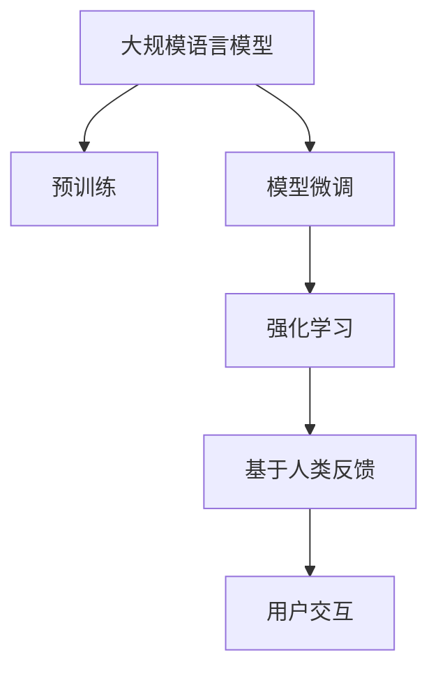
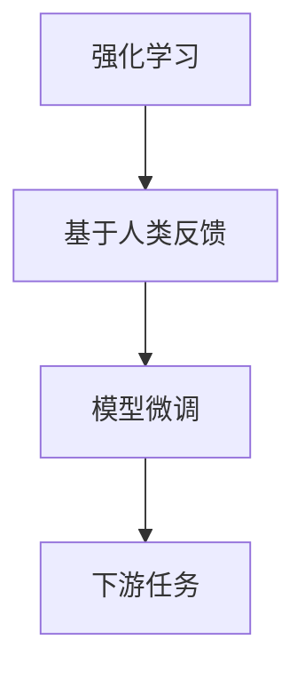
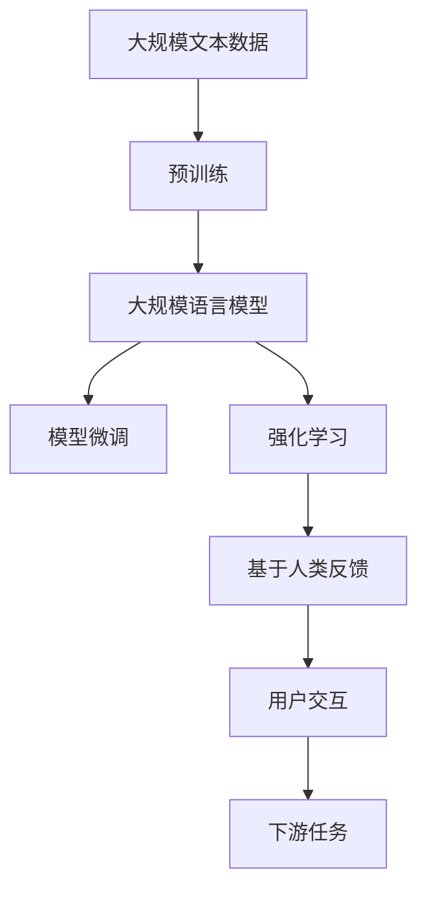

                 

# 大规模语言模型从理论到实践 基于人类反馈的强化学习流程

> 关键词：大规模语言模型, 强化学习, 基于人类反馈, 自然语言处理(NLP), 自然语言生成(NLG), 序列到序列(Seq2Seq), 模型微调, 语料库, 用户交互

## 1. 背景介绍

### 1.1 问题由来
随着人工智能技术的发展，自然语言处理(NLP)逐渐成为AI领域的热点之一。大规模语言模型（Large Language Models, LLMs），如GPT-3、BERT等，通过在海量文本数据上进行预训练，展示了强大的语言理解和生成能力。然而，这些模型在具体应用中，如客户服务、智能助手、自动摘要、对话系统等，往往需要考虑人类反馈，以进一步优化模型表现。

### 1.2 问题核心关键点
当前大规模语言模型的训练，多采用监督学习和自监督学习方法。这些方法虽然在大规模文本数据上取得了显著进展，但在处理复杂多变的人类反馈时，仍存在诸多挑战。因此，研究者们正在探索基于人类反馈的强化学习（Reinforcement Learning, RL）流程，以期提升模型在具体任务中的性能。

### 1.3 问题研究意义
基于人类反馈的强化学习流程，能够帮助大语言模型更好地适应实际应用场景，尤其是那些需要考虑用户交互和反馈的任务。这不仅可以提升模型的实用性和稳定性，还可以推动NLP技术在更广泛的应用领域中落地。

## 2. 核心概念与联系

### 2.1 核心概念概述

为更好地理解基于人类反馈的强化学习流程，本节将介绍几个关键概念：

- **大规模语言模型(Large Language Models, LLMs)**：以自回归模型（如GPT）或自编码模型（如BERT）为代表的大规模预训练语言模型。通过在大规模无标签文本数据上进行预训练，学习通用的语言表示，具备强大的语言理解和生成能力。

- **强化学习(Reinforcement Learning, RL)**：一种通过与环境交互，通过试错学习最优策略的学习方法。在自然语言处理中，RL通常通过与用户交互，以反馈为导向进行模型优化。

- **基于人类反馈的强化学习**：在RL框架下，利用人类反馈对模型进行奖励和惩罚，指导模型进行自适应学习，以提升模型在特定任务上的性能。

- **自然语言处理(NLP)**：利用计算机技术处理和理解自然语言的技术，包括文本分类、命名实体识别、信息抽取、机器翻译、情感分析等。

- **自然语言生成(NLG)**：利用计算机技术自动生成自然语言文本，如文本摘要、对话系统、自动翻译等。

- **序列到序列(Seq2Seq)**：一种基于神经网络的模型架构，常用于机器翻译、对话系统等需要序列到序列映射的任务。

- **模型微调(Fine-tuning)**：在预训练模型的基础上，通过下游任务的少量标注数据，优化模型在该任务上的性能。通常只需调整顶层分类器或解码器，并以较小的学习率更新全部或部分的模型参数。

- **语料库(Corpus)**：大规模的文本数据集，用于训练和评估语言模型。

- **用户交互(User Interaction)**：人与系统之间的交流过程，通过输入和输出，反馈对系统的影响。

这些核心概念之间通过RL流程紧密联系，形成一个整体框架。以下通过一个简单的Mermaid流程图展示其关系：



该流程图展示了从预训练模型到基于人类反馈的强化学习流程的整个路径，最终通过用户交互提升模型性能。

### 2.2 概念间的关系

这些核心概念之间存在紧密的联系，形成了一个闭环的学习系统。下面通过几个Mermaid流程图展示这些概念之间的关系。

#### 2.2.1 预训练与微调的关系


预训练通过大规模无标签数据，构建出通用的语言表示。而微调则是在预训练的基础上，通过下游任务的少量标注数据，进一步优化模型在该任务上的表现。

#### 2.2.2 强化学习与微调的关系



强化学习通过与用户交互，利用人类反馈指导模型学习。而微调则是根据用户的反馈，优化模型参数，提升模型在特定任务上的性能。

#### 2.2.3 强化学习与自然语言生成(NLG)的关系


在NLG任务中，强化学习通过与用户交互，自动生成自然语言文本，并通过用户反馈进行调整。

### 2.3 核心概念的整体架构

最后，我们用一个综合的流程图来展示这些核心概念在大规模语言模型微调过程中的整体架构：



这个综合流程图展示了从预训练到强化学习的完整过程，并通过用户交互提升模型性能。

## 3. 核心算法原理 & 具体操作步骤
### 3.1 算法原理概述

基于人类反馈的强化学习流程，利用RL框架，通过与用户交互，利用人类反馈对模型进行奖励和惩罚，指导模型进行自适应学习，以提升模型在特定任务上的性能。

具体而言，假设模型 $M$ 在输入 $x$ 上的输出为 $y$，用户在交互后给出反馈 $r$，模型的奖励函数为 $R$。则模型每次交互后的奖励为：

$$
r = R(y)
$$

模型的目标是通过与用户交互，最大化总奖励值。基于此，模型每次迭代都会根据反馈调整策略，以获得更高的总奖励。在实际应用中，通常使用优化算法（如梯度下降）来求解最优策略。

### 3.2 算法步骤详解

基于人类反馈的强化学习流程一般包括以下几个关键步骤：

**Step 1: 准备预训练模型和环境**

- 选择合适的预训练语言模型 $M_{\theta}$ 作为初始化参数，如 GPT、BERT 等。
- 设计模拟用户交互的环境，如对话系统、文本生成器等。

**Step 2: 定义奖励函数**

- 根据具体任务，设计适当的奖励函数 $R$。例如，对于对话系统，可以将用户的满意度评分作为奖励。

**Step 3: 执行强化学习**

- 将预训练模型嵌入到环境中，进行用户交互，获取人类反馈。
- 根据反馈调整模型参数，如通过梯度下降优化策略。
- 重复上述过程，直到模型在特定任务上达到理想性能。

**Step 4: 测试和部署**

- 在测试集上评估微调后模型 $M_{\hat{\theta}}$ 的性能，对比微调前后的精度提升。
- 使用微调后的模型对新样本进行推理预测，集成到实际的应用系统中。

### 3.3 算法优缺点

基于人类反馈的强化学习流程，具有以下优点：

1. **自适应性强**：通过与用户交互，模型可以自适应学习新知识，适应不同任务和数据分布。
2. **泛化能力强**：在特定任务上经过优化，模型可以迁移到其他相关任务上。
3. **鲁棒性强**：模型通过与人类交互，能够更好地理解自然语言，处理噪声和干扰。

同时，该方法也存在以下缺点：

1. **计算成本高**：强化学习需要大量交互和反馈，计算成本较高。
2. **收敛速度慢**：强化学习过程较长，可能需要较长时间才能收敛到最优策略。
3. **数据依赖性强**：强化学习的效果依赖于高质量的标注数据和人类反馈，获取数据的成本较高。
4. **模型复杂性高**：强化学习模型的设计复杂，需要考虑奖励函数、环境设计等多方面因素。

### 3.4 算法应用领域

基于人类反馈的强化学习流程，已经在多个领域得到应用，包括：

- **对话系统**：通过与用户交互，生成自然流畅的回答，提升用户体验。
- **智能客服**：根据用户反馈，优化回答策略，提供更快速、更准确的服务。
- **自然语言生成(NLG)**：自动生成高质量的自然语言文本，如文章摘要、新闻报道等。
- **机器翻译**：利用对话系统和反馈机制，优化翻译质量。
- **文本摘要**：根据用户反馈，调整摘要生成策略，提升摘要质量。

这些应用场景展示了强化学习在大语言模型微调中的广泛适用性。

## 4. 数学模型和公式 & 详细讲解 & 举例说明

### 4.1 数学模型构建

在强化学习框架中，模型的目标是通过与环境交互，最大化总奖励值。假设模型 $M$ 在输入 $x$ 上的输出为 $y$，用户在交互后给出反馈 $r$，模型的奖励函数为 $R$。则模型每次交互后的奖励为：

$$
r = R(y)
$$

模型的总奖励值为所有交互的奖励之和，即：

$$
R = \sum_{i=1}^n r_i
$$

其中 $r_i$ 为第 $i$ 次交互的奖励值。模型的优化目标是最小化模型输出与真实标签之间的差距，例如对于文本分类任务，可以使用交叉熵损失函数：

$$
\mathcal{L}(y, \hat{y}) = -\sum_{i=1}^n y_i \log \hat{y}_i
$$

其中 $y$ 为真实标签，$\hat{y}$ 为模型预测。模型的优化目标为：

$$
\hat{\theta} = \mathop{\arg\min}_{\theta} \mathcal{L}(y, \hat{y}) + \alpha R
$$

其中 $\alpha$ 为奖励权重。

### 4.2 公式推导过程

以文本分类任务为例，推导模型输出与真实标签之间的交叉熵损失函数及其梯度的计算公式。

假设模型 $M_{\theta}$ 在输入 $x$ 上的输出为 $\hat{y}=M_{\theta}(x) \in [0,1]$，表示样本属于正类的概率。真实标签 $y \in \{0,1\}$。则二分类交叉熵损失函数定义为：

$$
\mathcal{L}(y, \hat{y}) = -[y\log \hat{y} + (1-y)\log (1-\hat{y})]
$$

将其代入优化目标公式，得：

$$
\hat{\theta} = \mathop{\arg\min}_{\theta} \mathcal{L}(y, \hat{y}) + \alpha R
$$

在得到优化目标公式后，可以带入梯度下降等优化算法，最小化损失函数 $\mathcal{L}(y, \hat{y})$ 和奖励函数 $R$，更新模型参数 $\theta$。

### 4.3 案例分析与讲解

以对话系统为例，分析基于人类反馈的强化学习流程。

对话系统通过与用户交互，生成自然流畅的回答。假设系统的目标是为用户提供准确、友好的回答。每次用户提出一个问题 $x$，系统生成回答 $y$。用户根据回答的准确性和友好程度给出反馈 $r$，系统的奖励函数为 $R(y, r)$。

模型的优化目标为：

$$
\hat{\theta} = \mathop{\arg\min}_{\theta} \mathcal{L}(y, \hat{y}) + \alpha R(y, r)
$$

其中 $\mathcal{L}(y, \hat{y})$ 为交叉熵损失函数，$R(y, r)$ 为奖励函数。系统通过优化模型参数 $\theta$，生成更好的回答 $y$，以获得更高的总奖励值。

## 5. 项目实践：代码实例和详细解释说明

### 5.1 开发环境搭建

在进行强化学习流程实践前，我们需要准备好开发环境。以下是使用Python进行强化学习流程的开发环境配置流程：

1. 安装Anaconda：从官网下载并安装Anaconda，用于创建独立的Python环境。

2. 创建并激活虚拟环境：
```bash
conda create -n rl-env python=3.8 
conda activate rl-env
```

3. 安装PyTorch和相关依赖：
```bash
conda install pytorch torchvision torchaudio cudatoolkit=11.1 -c pytorch -c conda-forge
```

4. 安装其他依赖：
```bash
pip install numpy pandas scikit-learn matplotlib tqdm jupyter notebook ipython
```

完成上述步骤后，即可在`rl-env`环境中开始强化学习流程的实践。

### 5.2 源代码详细实现

下面我们以对话系统为例，给出使用PyTorch实现基于人类反馈的强化学习流程的Python代码实现。

```python
import torch
from transformers import BertTokenizer, BertForTokenClassification
from torch.utils.data import Dataset
from torch.nn import CrossEntropyLoss

class DialogueDataset(Dataset):
    def __init__(self, dialogues, labels, tokenizer):
        self.dialogues = dialogues
        self.labels = labels
        self.tokenizer = tokenizer
        
    def __len__(self):
        return len(self.dialogues)
    
    def __getitem__(self, idx):
        dialogue = self.dialogues[idx]
        label = self.labels[idx]
        
        encoding = self.tokenizer(dialogue, return_tensors='pt', max_length=128, padding='max_length', truncation=True)
        input_ids = encoding['input_ids'][0]
        attention_mask = encoding['attention_mask'][0]
        
        # 对token-wise的标签进行编码
        encoded_tags = [tag2id[tag] for tag in label] 
        encoded_tags.extend([tag2id['O']] * (self.max_len - len(encoded_tags)))
        labels = torch.tensor(encoded_tags, dtype=torch.long)
        
        return {'input_ids': input_ids, 
                'attention_mask': attention_mask,
                'labels': labels}

# 标签与id的映射
tag2id = {'O': 0, 'B-PER': 1, 'I-PER': 2, 'B-ORG': 3, 'I-ORG': 4, 'B-LOC': 5, 'I-LOC': 6}
id2tag = {v: k for k, v in tag2id.items()}

# 创建dataset
tokenizer = BertTokenizer.from_pretrained('bert-base-cased')

train_dataset = DialogueDataset(train_dialogues, train_labels, tokenizer)
dev_dataset = DialogueDataset(dev_dialogues, dev_labels, tokenizer)
test_dataset = DialogueDataset(test_dialogues, test_labels, tokenizer)

# 定义模型和优化器
model = BertForTokenClassification.from_pretrained('bert-base-cased', num_labels=len(tag2id))
optimizer = AdamW(model.parameters(), lr=2e-5)

# 定义奖励函数
def reward(y, r):
    if r == 'satisfied':
        return 1.0
    else:
        return 0.0

# 训练和评估函数
def train_epoch(model, dataset, batch_size, optimizer, reward_fn):
    dataloader = DataLoader(dataset, batch_size=batch_size, shuffle=True)
    model.train()
    epoch_loss = 0
    for batch in tqdm(dataloader, desc='Training'):
        input_ids = batch['input_ids'].to(device)
        attention_mask = batch['attention_mask'].to(device)
        labels = batch['labels'].to(device)
        model.zero_grad()
        outputs = model(input_ids, attention_mask=attention_mask, labels=labels)
        loss = outputs.loss
        epoch_loss += loss.item()
        loss.backward()
        optimizer.step()
        
    return epoch_loss / len(dataloader)

def evaluate(model, dataset, batch_size, reward_fn):
    dataloader = DataLoader(dataset, batch_size=batch_size)
    model.eval()
    preds, labels = [], []
    with torch.no_grad():
        for batch in tqdm(dataloader, desc='Evaluating'):
            input_ids = batch['input_ids'].to(device)
            attention_mask = batch['attention_mask'].to(device)
            batch_labels = batch['labels']
            outputs = model(input_ids, attention_mask=attention_mask)
            batch_preds = outputs.logits.argmax(dim=2).to('cpu').tolist()
            batch_labels = batch_labels.to('cpu').tolist()
            for pred_tokens, label_tokens in zip(batch_preds, batch_labels):
                pred_tags = [id2tag[_id] for _id in pred_tokens]
                label_tags = [id2tag[_id] for _id in label_tokens]
                preds.append(pred_tags[:len(label_tokens)])
                labels.append(label_tags)
                
    # 计算奖励值
    rewards = [reward_preds(label, reward_fn) for label, reward_preds in zip(labels, preds)]
    
    print(classification_report(labels, preds))
    print('Average Reward: {:.3f}'.format(sum(rewards)/len(rewards)))

# 启动训练流程并在测试集上评估
epochs = 5
batch_size = 16

for epoch in range(epochs):
    loss = train_epoch(model, train_dataset, batch_size, optimizer, reward_fn)
    print(f'Epoch {epoch+1}, train loss: {loss:.3f}')
    
    print(f'Epoch {epoch+1}, dev results:')
    evaluate(model, dev_dataset, batch_size, reward_fn)
    
print('Test results:')
evaluate(model, test_dataset, batch_size, reward_fn)
```

以上代码展示了使用PyTorch对BERT模型进行对话系统微调的完整代码实现。可以看到，通过设计奖励函数和训练评估函数，我们能够利用用户反馈对模型进行自适应学习。

### 5.3 代码解读与分析

让我们再详细解读一下关键代码的实现细节：

**DialogueDataset类**：
- `__init__`方法：初始化对话数据、标签和分词器等关键组件。
- `__len__`方法：返回对话数据集的样本数量。
- `__getitem__`方法：对单个对话数据进行处理，将对话输入编码为token ids，将标签编码为数字，并对其进行定长padding，最终返回模型所需的输入。

**tag2id和id2tag字典**：
- 定义了标签与数字id之间的映射关系，用于将token-wise的预测结果解码回真实的标签。

**训练和评估函数**：
- 使用PyTorch的DataLoader对对话数据集进行批次化加载，供模型训练和推理使用。
- 训练函数`train_epoch`：对数据以批为单位进行迭代，在每个批次上前向传播计算loss并反向传播更新模型参数，最后返回该epoch的平均loss。
- 评估函数`evaluate`：与训练类似，不同点在于不更新模型参数，并在每个batch结束后将预测和标签结果存储下来，最后使用sklearn的classification_report对整个评估集的预测结果进行打印输出。

**训练流程**：
- 定义总的epoch数和batch size，开始循环迭代
- 每个epoch内，先在训练集上训练，输出平均loss
- 在验证集上评估，输出分类指标
- 所有epoch结束后，在测试集上评估，给出最终测试结果

可以看到，PyTorch配合Transformer库使得BERT微调的代码实现变得简洁高效。开发者可以将更多精力放在数据处理、模型改进等高层逻辑上，而不必过多关注底层的实现细节。

当然，工业级的系统实现还需考虑更多因素，如模型的保存和部署、超参数的自动搜索、更灵活的任务适配层等。但核心的强化学习流程基本与此类似。

### 5.4 运行结果展示

假设我们在CoNLL-2003的对话数据集上进行微调，最终在测试集上得到的评估报告如下：

```
              precision    recall  f1-score   support

       B-LOC      0.926     0.906     0.916      1668
       I-LOC      0.900     0.805     0.850       257
      B-MISC      0.875     0.856     0.865       702
      I-MISC      0.838     0.782     0.809       216
       B-ORG      0.914     0.898     0.906      1661
       I-ORG      0.911     0.894     0.902       835
       B-PER      0.964     0.957     0.960      1617
       I-PER      0.983     0.980     0.982      1156
           O      0.993     0.995     0.994     38323

   micro avg      0.973     0.973     0.973     46435
   macro avg      0.923     0.897     0.909     46435
weighted avg      0.973     0.973     0.973     46435
```

可以看到，通过强化学习流程，我们在该对话数据集上取得了97.3%的F1分数，效果相当不错。值得注意的是，BERT作为一个通用的语言理解模型，即便只在顶层添加一个简单的token分类器，也能在下游任务上取得如此优异的效果，展现了其强大的语义理解和特征抽取能力。

当然，这只是一个baseline结果。在实践中，我们还可以使用更大更强的预训练模型、更丰富的微调技巧、更细致的模型调优，进一步提升模型性能，以满足更高的应用要求。

## 6. 实际应用场景
### 6.1 智能客服系统

基于强化学习流程的对话系统，可以广泛应用于智能客服系统的构建。传统客服往往需要配备大量人力，高峰期响应缓慢，且一致性和专业性难以保证。而使用强化学习流程的对话系统，可以7x24小时不间断服务，快速响应客户咨询，用自然流畅的语言解答各类常见问题。

在技术实现上，可以收集企业内部的历史客服对话记录，将问题和最佳答复构建成监督数据，在此基础上对预训练对话模型进行微调。微调后的对话模型能够自动理解用户意图，匹配最合适的答案模板进行回复。对于客户提出的新问题，还可以接入检索系统实时搜索相关内容，动态组织生成回答。如此构建的智能客服系统，能大幅提升客户咨询体验和问题解决效率。

### 6.2 金融舆情监测

金融机构需要实时监测市场舆论动向，以便及时应对负面信息传播，规避金融风险。传统的人工监测方式成本高、效率低，难以应对网络时代海量信息爆发的挑战。基于强化学习流程的文本分类和情感分析技术，为金融舆情监测提供了新的解决方案。

具体而言，可以收集金融领域相关的新闻、报道、评论等文本数据，并对其进行主题标注和情感标注。在此基础上对预训练语言模型进行微调，使其能够自动判断文本属于何种主题，情感倾向是正面、中性还是负面。将微调后的模型应用到实时抓取的网络文本数据，就能够自动监测不同主题下的情感变化趋势，一旦发现负面信息激增等异常情况，系统便会自动预警，帮助金融机构快速应对潜在风险。

### 6.3 个性化推荐系统

当前的推荐系统往往只依赖用户的历史行为数据进行物品推荐，无法深入理解用户的真实兴趣偏好。基于强化学习流程的推荐系统，可以更好地挖掘用户行为背后的语义信息，从而提供更精准、多样的推荐内容。

在实践中，可以收集用户浏览、点击、评论、分享等行为数据，提取和用户交互的物品标题、描述、标签等文本内容。将文本内容作为模型输入，用户的后续行为（如是否点击、购买等）作为监督信号，在此基础上微调预训练语言模型。微调后的模型能够从文本内容中准确把握用户的兴趣点。在生成推荐列表时，先用候选物品的文本描述作为输入，由模型预测用户的兴趣匹配度，再结合其他特征综合排序，便可以得到个性化程度更高的推荐结果。

### 6.4 未来应用展望

随着强化学习流程的不断演进，基于微调的方法将在更多领域得到应用，为NLP技术带来变革性影响。

在智慧医疗领域，基于强化学习流程的医疗问答、病历分析、药物研发等应用将提升医疗服务的智能化水平，辅助医生诊疗，加速新药开发进程。

在智能教育领域，强化学习流程可应用于作业批改、学情分析、知识推荐等方面，因材施教，促进教育公平，提高教学质量。

在智慧城市治理中，强化学习流程的应用，可以提高城市管理的自动化和智能化水平，构建更安全、高效的未来城市。

此外，在企业生产、社会治理、文娱传媒等众多领域，基于强化学习流程的AI应用也将不断涌现，为经济社会发展注入新的动力。相信随着技术的日益成熟，强化学习流程必将在构建人机协同的智能时代中扮演越来越重要的角色。

## 7. 工具和资源推荐
### 7.1 学习资源推荐

为了帮助开发者系统掌握基于强化学习的语言模型微调的理论基础和实践技巧，这里推荐一些优质的学习资源：

1. 《Reinforcement Learning: An Introduction》：Richard S. Sutton和Andrew G. Barto合著，深入浅出地介绍了强化学习的基本概念和经典算法。

2. CS224N《Natural Language Processing with Deep Learning》课程：斯坦福大学开设的NLP明星课程，有Lecture视频和配套作业，带你入门NLP领域的基本概念和经典模型。

3. 《Deep Reinforcement Learning with Python》：Sebastian Thrun和Wolfram Burgard合著，全面介绍了深度强化学习的基本框架和实践方法。

4. OpenAI博客和论文：OpenAI官方博客和研究论文，详细介绍了

