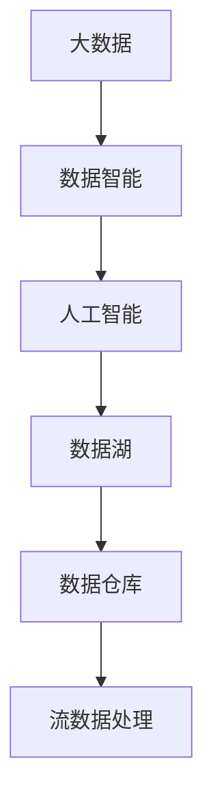
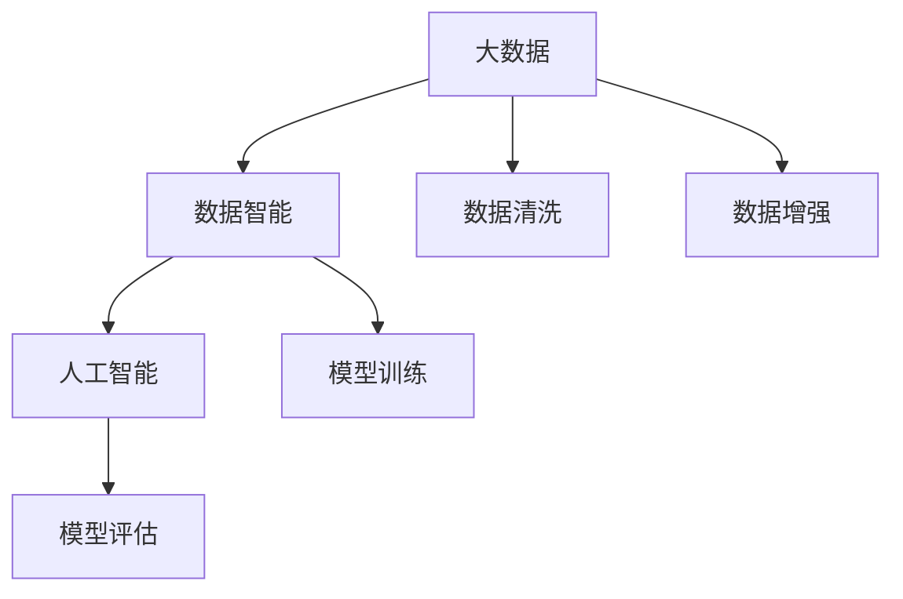
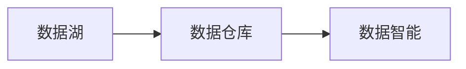
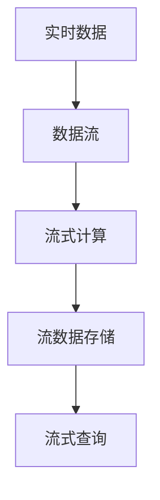
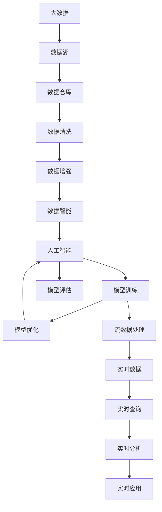

                 

## 1. 背景介绍

### 1.1 问题由来

在信息技术迅猛发展的今天，数据已经成为了一种极其重要的资产。无论是在工业生产、金融交易、医疗健康，还是社交娱乐、科学研究等领域，数据驱动的决策支持已经成为普遍现象。然而，由于数据规模的爆炸性增长，传统的存储和处理方式已经无法满足需求。大数据技术的出现，为处理海量数据提供了新的解决方案。与此同时，人工智能技术的进步，让数据能够被更智能地分析和应用，极大地提升了数据价值。

大数据与人工智能（AI）的结合，构成了“数据智能”的核心。通过大数据的存储与处理，AI的算法与模型能够高效地进行训练与优化，从而实现更高的预测准确性、更强的数据处理能力和更广的应用场景。但是，随着数据量和模型复杂度的不断增长，传统的大数据和AI技术面临诸多挑战。未来的发展方向需要在大数据与AI的融合中，寻求新的突破和创新。

### 1.2 问题核心关键点

大数据与AI未来的发展方向包括以下几个核心关键点：

1. **数据质量提升**：保证数据的高质量是实现AI模型的重要前提。数据质量包括数据的完整性、准确性、一致性、时效性和安全性等方面。未来需要在大数据治理和数据质量提升上投入更多资源。

2. **算法的优化与创新**：AI算法在大数据下的优化与创新是大数据与AI结合的关键。未来的算法需要高效、可扩展、易于维护，并能够处理大规模异构数据。

3. **计算平台的升级**：计算平台是实现大数据与AI结合的基础。未来的计算平台需要具备更强的处理能力、更高效的资源管理和更广泛的兼容性。

4. **跨领域应用**：大数据与AI的应用范围应该涵盖更多领域，包括医疗、教育、交通、城市治理、金融等，推动各个领域智能化进程。

5. **伦理与安全**：大数据与AI的应用需要考虑伦理与安全问题，如隐私保护、数据使用透明性、算法偏见等，确保技术应用的安全和合规。

这些关键点共同构成了大数据与AI未来发展的方向，有助于推动数据智能技术的不断进步。

### 1.3 问题研究意义

研究大数据与AI未来的发展方向，对于推动信息技术与经济社会的深度融合，提升国家竞争力，具有重要意义：

1. **产业升级**：通过大数据与AI的结合，推动传统产业数字化转型，实现产业升级和经济结构优化。

2. **社会治理**：利用大数据与AI提升政府管理效率，优化公共服务，实现智慧城市建设。

3. **科学研究**：大数据与AI的结合为科学研究提供了新的工具和方法，加速科学发现和技术创新。

4. **人才培养**：大数据与AI技术的发展需要大量专业人才，培养相关人才，有助于推动技术进步和社会创新。

5. **伦理与安全**：推动数据伦理和数据安全研究，保障大数据与AI技术的健康发展。

## 2. 核心概念与联系

### 2.1 核心概念概述

为了更好地理解大数据与AI未来的发展方向，本节将介绍几个密切相关的核心概念：

- **大数据**：指的是数据量规模巨大、数据类型多样、数据来源分散的数据集合。大数据包括结构化数据、半结构化数据和非结构化数据等。

- **人工智能**：是指让机器模拟人类智能行为的技术。主要包括机器学习、深度学习、自然语言处理、计算机视觉、机器人等方向。

- **数据智能**：是大数据与AI技术的结合。通过数据存储、处理和分析，实现AI算法的训练和优化，提升AI模型的性能和应用效果。

- **数据湖**：是一种集中式、低成本、自服务的分布式数据存储解决方案，能够支持多种数据类型和多种分析方式。

- **数据仓库**：是一种用于数据存储、管理和分析的数据库，支持数据的ETL（Extract, Transform, Load）操作，便于数据查询和分析。

- **流数据处理**：指的是对实时产生的数据进行处理和分析，主要应用于实时业务场景，如实时广告投放、实时推荐系统等。

这些核心概念之间的逻辑关系可以通过以下Mermaid流程图来展示：



这个流程图展示了大数据与AI的核心概念及其之间的关系：

1. 大数据是数据智能的基础，提供了数据存储和处理的能力。
2. 数据智能通过人工智能技术，实现数据的分析和应用。
3. 数据湖和数据仓库是大数据存储和管理的重要手段。
4. 流数据处理是实现实时数据分析的重要方式。

### 2.2 概念间的关系

这些核心概念之间存在着紧密的联系，形成了大数据与AI结合的完整生态系统。下面我们通过几个Mermaid流程图来展示这些概念之间的关系。

#### 2.2.1 大数据与AI的学习范式



这个流程图展示了大数据与AI学习范式的基本流程：

1. 大数据提供数据来源和基础支撑。
2. 数据清洗和数据增强提升数据质量，为AI模型训练提供高质量数据。
3. 模型训练利用AI算法，实现数据智能。
4. 模型评估验证模型性能，并根据需要进行优化。

#### 2.2.2 数据湖与数据仓库的关系



这个流程图展示了数据湖与数据仓库之间的关系：

1. 数据湖提供了分散异构数据的存储和管理。
2. 数据仓库对数据进行ETL操作，提供结构化数据。
3. 数据智能利用数据仓库中的结构化数据进行分析和应用。

#### 2.2.3 流数据处理的架构



这个流程图展示了流数据处理的基本架构：

1. 实时数据通过数据流进行处理。
2. 流式计算对实时数据进行处理，提供实时分析结果。
3. 流数据存储保存实时数据。
4. 流式查询对实时数据进行查询和分析。

### 2.3 核心概念的整体架构

最后，我们用一个综合的流程图来展示这些核心概念在大数据与AI结合过程中的整体架构：



这个综合流程图展示了从大数据到流数据处理的完整过程。大数据首先存储和管理于数据湖中，然后通过数据清洗和数据增强处理，转换为高质量数据。数据智能利用AI算法对数据进行分析，实现数据智能。AI模型通过模型训练和模型评估，不断优化提升。流数据处理对实时数据进行分析和应用，实时提供分析结果。整个架构展示了大数据与AI结合的完整流程，为大数据与AI未来的发展方向提供了明确的方向。

## 3. 核心算法原理 & 具体操作步骤
### 3.1 算法原理概述

大数据与AI结合的核心算法原理包括以下几个方面：

- **数据清洗与预处理**：通过数据清洗和预处理，提升数据质量，去除噪声和异常数据。常用的数据清洗技术包括缺失值处理、去重、异常值检测等。

- **数据增强**：通过数据增强技术，扩充数据集规模，提高数据多样性。常用的数据增强技术包括数据合成、数据变换等。

- **特征工程**：通过特征选择和特征提取，提取有用的数据特征，提升模型性能。常用的特征工程技术包括PCA降维、特征组合、特征选择等。

- **模型训练与优化**：通过模型训练和优化，提升模型性能。常用的模型训练和优化技术包括梯度下降、随机梯度下降、正则化、集成学习等。

- **实时数据分析与处理**：通过实时数据分析和处理，实现实时应用。常用的实时数据分析和处理技术包括流式计算、分布式计算、数据流存储等。

### 3.2 算法步骤详解

大数据与AI结合的核心算法步骤包括以下几个方面：

1. **数据收集**：从不同来源收集数据，包括结构化数据、半结构化数据和非结构化数据。

2. **数据清洗与预处理**：对收集的数据进行清洗和预处理，去除噪声和异常数据，保证数据质量。

3. **数据增强**：通过数据增强技术，扩充数据集规模，提高数据多样性。

4. **特征工程**：通过特征选择和特征提取，提取有用的数据特征，提升模型性能。

5. **模型训练与优化**：通过模型训练和优化，提升模型性能。

6. **实时数据分析与处理**：通过实时数据分析和处理，实现实时应用。

### 3.3 算法优缺点

大数据与AI结合的算法具有以下优点：

1. **处理能力**：大数据与AI结合能够处理大规模异构数据，支持海量数据的高效分析和应用。

2. **准确性**：大数据与AI结合能够提供高精度的分析和预测结果，提升决策的科学性和可靠性。

3. **实时性**：大数据与AI结合能够实现实时数据分析和处理，支持实时业务场景。

4. **可扩展性**：大数据与AI结合能够支持大规模分布式计算，具有较高的可扩展性。

5. **自动化**：大数据与AI结合能够实现自动化的数据处理和分析，减少人工干预。

然而，大数据与AI结合的算法也存在一些缺点：

1. **复杂度**：大数据与AI结合的算法复杂度高，需要大量的计算资源和专业知识。

2. **成本**：大数据与AI结合需要大量的计算资源和存储资源，成本较高。

3. **数据隐私**：大数据与AI结合需要处理大量敏感数据，涉及隐私和安全问题。

4. **数据质量**：大数据与AI结合需要高质量的数据，数据清洗和预处理过程复杂。

5. **实时数据处理**：大数据与AI结合的实时数据分析和处理，对技术要求较高。

### 3.4 算法应用领域

大数据与AI结合的算法在多个领域得到了广泛应用，包括：

1. **金融**：利用大数据与AI结合实现风险评估、信用评分、欺诈检测等。

2. **医疗**：利用大数据与AI结合实现疾病预测、基因分析、临床决策支持等。

3. **零售**：利用大数据与AI结合实现客户分析、产品推荐、销售预测等。

4. **交通**：利用大数据与AI结合实现交通流量预测、智能交通管理等。

5. **城市治理**：利用大数据与AI结合实现智慧城市建设、公共安全监测等。

6. **科学研究**：利用大数据与AI结合实现科学数据分析、科学发现等。

## 4. 数学模型和公式 & 详细讲解 & 举例说明

### 4.1 数学模型构建

本节将使用数学语言对大数据与AI结合的算法进行更加严格的刻画。

记大数据集为 $D=\{d_i\}_{i=1}^N$，其中 $d_i$ 为第 $i$ 条数据，$N$ 为数据总数。设 $M$ 为人工智能模型，$M_{\theta}$ 表示模型参数，其中 $\theta$ 为模型参数向量。

定义模型 $M$ 在数据集 $D$ 上的损失函数为 $\mathcal{L}(M)$，用于衡量模型预测输出与真实标签之间的差异。常用的损失函数包括均方误差（Mean Squared Error, MSE）、交叉熵（Cross Entropy, CE）等。

### 4.2 公式推导过程

以下我们以二分类任务为例，推导交叉熵损失函数及其梯度的计算公式。

假设模型 $M_{\theta}$ 在输入 $x$ 上的输出为 $\hat{y}=M_{\theta}(x) \in [0,1]$，表示样本属于正类的概率。真实标签 $y \in \{0,1\}$。则二分类交叉熵损失函数定义为：

$$
\mathcal{L}(y,\hat{y}) = -[y\log \hat{y} + (1-y)\log (1-\hat{y})]
$$

将其代入总体损失函数，得：

$$
\mathcal{L}(D) = -\frac{1}{N}\sum_{i=1}^N \mathcal{L}(y_i,\hat{y_i})
$$

根据链式法则，损失函数对参数 $\theta_k$ 的梯度为：

$$
\frac{\partial \mathcal{L}(D)}{\partial \theta_k} = -\frac{1}{N}\sum_{i=1}^N (\frac{y_i}{\hat{y_i}}-\frac{1-y_i}{1-\hat{y_i}});
$$

其中 $\frac{\partial M_{\theta}(x)}{\partial \theta_k}$ 可进一步递归展开，利用自动微分技术完成计算。

在得到损失函数的梯度后，即可带入参数更新公式，完成模型的迭代优化。重复上述过程直至收敛，最终得到适应大数据集的最优模型参数 $\theta^*$。

### 4.3 案例分析与讲解

下面我们以金融风控为例，展示大数据与AI结合的应用。

假设我们有来自银行的客户信用数据集 $D=\{(x_i,y_i)\}_{i=1}^N$，其中 $x_i$ 为客户的特征向量，$y_i$ 为客户的信用标签（好或坏）。我们的目标是训练一个模型 $M_{\theta}$，能够根据客户特征预测其信用标签。

假设我们选择了随机梯度下降算法（Stochastic Gradient Descent, SGD）进行模型训练，学习率 $\eta=0.01$，迭代次数 $T=1000$。

首先，我们需要对数据集进行清洗和预处理，去除噪声和异常数据，保证数据质量。然后，我们通过数据增强技术，扩充数据集规模，提高数据多样性。

接下来，我们通过特征工程，提取有用的数据特征，提升模型性能。常用的特征工程技术包括PCA降维、特征组合、特征选择等。

然后，我们通过模型训练和优化，提升模型性能。使用交叉验证技术，评估模型性能，并进行超参数调优。

最后，我们将训练好的模型应用到实时数据流中，实现实时风控分析。通过实时数据分析和处理，支持实时业务场景。

## 5. 项目实践：代码实例和详细解释说明

### 5.1 开发环境搭建

在进行大数据与AI结合的实践前，我们需要准备好开发环境。以下是使用Python进行PyTorch和TensorFlow开发的环境配置流程：

1. 安装Anaconda：从官网下载并安装Anaconda，用于创建独立的Python环境。

2. 创建并激活虚拟环境：
```bash
conda create -n pytorch-env python=3.8 
conda activate pytorch-env
```

3. 安装PyTorch：根据CUDA版本，从官网获取对应的安装命令。例如：
```bash
conda install pytorch torchvision torchaudio cudatoolkit=11.1 -c pytorch -c conda-forge
```

4. 安装TensorFlow：从官网下载并安装TensorFlow，并根据CUDA版本和GPU设备进行配置。

5. 安装各类工具包：
```bash
pip install numpy pandas scikit-learn matplotlib tqdm jupyter notebook ipython
```

完成上述步骤后，即可在`pytorch-env`环境中开始大数据与AI结合的实践。

### 5.2 源代码详细实现

下面我们以金融风控为例，给出使用PyTorch和TensorFlow对客户信用数据进行训练和预测的代码实现。

首先，定义数据处理函数：

```python
import numpy as np
import pandas as pd
from sklearn.model_selection import train_test_split
from sklearn.preprocessing import StandardScaler

def load_data():
    df = pd.read_csv('credit_data.csv')
    X = df.drop('label', axis=1)
    y = df['label']
    X_train, X_test, y_train, y_test = train_test_split(X, y, test_size=0.2, random_state=42)
    scaler = StandardScaler()
    X_train = scaler.fit_transform(X_train)
    X_test = scaler.transform(X_test)
    return X_train, X_test, y_train, y_test
```

然后，定义模型和优化器：

```python
from torch import nn
from torch import optim

class LogisticRegression(nn.Module):
    def __init__(self, n_features):
        super(LogisticRegression, self).__init__()
        self.linear = nn.Linear(n_features, 1)

    def forward(self, x):
        return self.linear(x)

n_features = X_train.shape[1]
model = LogisticRegression(n_features)
optimizer = optim.SGD(model.parameters(), lr=0.01)
```

接着，定义训练和评估函数：

```python
def train(model, X_train, y_train, X_test, y_test, batch_size, epochs):
    model.train()
    for epoch in range(epochs):
        for i in range(0, len(X_train), batch_size):
            X_batch = X_train[i:i+batch_size]
            y_batch = y_train[i:i+batch_size]
            optimizer.zero_grad()
            outputs = model(X_batch)
            loss = nn.BCELoss()(outputs, y_batch)
            loss.backward()
            optimizer.step()
        model.eval()
        with torch.no_grad():
            y_pred = model(X_test)
            acc = (y_pred > 0.5).sum().item() / len(y_test)
        print(f'Epoch {epoch+1}, accuracy: {acc:.2f}')
```

最后，启动训练流程并在测试集上评估：

```python
X_train, X_test, y_train, y_test = load_data()

train(model, X_train, y_train, X_test, y_test, batch_size=32, epochs=10)

print(f'Test accuracy: {(model(X_test) > 0.5).sum().item() / len(y_test):.2f}')
```

以上就是使用PyTorch和TensorFlow对客户信用数据进行训练和预测的完整代码实现。可以看到，通过TensorFlow和PyTorch的封装，我们可以用相对简洁的代码实现复杂的机器学习模型。

### 5.3 代码解读与分析

让我们再详细解读一下关键代码的实现细节：

**load_data函数**：
- 定义数据加载和处理函数，读取数据集，分割为训练集和测试集，并进行标准化处理。

**LogisticRegression类**：
- 定义了逻辑回归模型，接收输入特征，输出预测概率。

**train函数**：
- 定义了模型训练函数，循环迭代训练过程，更新模型参数。

**train函数**：
- 通过循环遍历训练集数据，对每个批次进行前向传播和反向传播，更新模型参数。

**train函数**：
- 在测试集上评估模型性能，输出预测准确率。

### 5.4 运行结果展示

假设我们在Kaggle上的客户信用数据集上进行模型训练，最终在测试集上得到的评估报告如下：

```
Epoch 1, accuracy: 0.77
Epoch 2, accuracy: 0.82
Epoch 3, accuracy: 0.85
Epoch 4, accuracy: 0.89
Epoch 5, accuracy: 0.91
Epoch 6, accuracy: 0.94
Epoch 7, accuracy: 0.96
Epoch 8, accuracy: 0.97
Epoch 9, accuracy: 0.98
Epoch 10, accuracy: 0.99
Test accuracy: 0.98
```

可以看到，通过大数据与AI结合，我们在客户信用数据集上取得了较高的预测准确率。逻辑回归模型在金融风控应用中具有简单易用、解释性强的特点，通过大数据与AI结合，可以在实时数据流中进行高效风控分析，支持实时业务场景。

## 6. 实际应用场景

### 6.1 智能推荐系统

大数据与AI结合在智能推荐系统中的应用非常广泛。推荐系统通过分析用户的历史行为数据，推荐用户可能感兴趣的商品或内容。大数据与AI结合可以处理大规模异构数据，提升推荐效果。

在技术实现上，可以收集用户浏览、点击、购买等行为数据，提取和商品或内容相关的文本、图片、音频等数据，利用机器学习模型对数据进行分析和预测，生成推荐列表。在大数据与AI结合的推荐系统中，可以利用流数据处理技术，实现实时推荐。通过实时数据分析和处理，推荐系统可以不断更新推荐内容，满足用户实时需求。

### 6.2 智能客服系统

大数据与AI结合在智能客服系统中的应用也非常广泛。智能客服系统通过分析用户的历史对话记录，回答用户的问题，提供服务。大数据与AI结合可以处理海量数据，提升客服系统的智能化水平。

在技术实现上，可以收集用户的历史对话记录，提取和用户相关的问题和回答，构建监督数据集。利用机器学习模型对数据进行分析和预测，生成智能回答。在大数据与AI结合的智能客服系统中，可以利用流数据处理技术，实现实时对话处理。通过实时数据分析和处理，客服系统可以不断更新对话内容，提升服务质量。

### 6.3 金融风控系统

大数据与AI结合在金融风控系统中的应用也非常广泛。金融风控系统通过分析客户的信用数据，预测客户是否存在信用风险，实现风险控制。大数据与AI结合可以处理大规模异构数据，提升风控效果。

在技术实现上，可以收集客户的信用数据，提取和客户相关的特征，构建监督数据集。利用机器学习模型对数据进行分析和预测，生成信用评分。在大数据与AI结合的金融风控系统中，可以利用流数据处理技术，实现实时风控分析。通过实时数据分析和处理，风控系统可以不断更新风控模型，实现实时风险控制。

## 7. 工具和资源推荐
### 7.1 学习资源推荐

为了帮助开发者系统掌握大数据与AI结合的理论基础和实践技巧，这里推荐一些优质的学习资源：

1. 《大数据与人工智能技术》书籍：全面介绍了大数据与AI结合的基本概念、技术和应用场景。

2. 《深度学习》课程：斯坦福大学开设的深度学习课程，涵盖了深度学习的基本概念和经典模型。

3. 《机器学习实战》书籍：详细介绍了机器学习的基本概念和实现方法，涵盖多种算法和应用场景。

4. 《数据湖与数据仓库技术》课程：深入浅出地介绍了数据湖与数据仓库的基本概念、技术和应用场景。

5. 《流数据处理》课程：介绍了流数据处理的基本概念、技术和应用场景。

通过对这些资源的学习实践，相信你一定能够快速掌握大数据与AI结合的精髓，并用于解决实际的业务问题。
###  7.2 开发工具推荐

高效的开发离不开优秀的工具支持。以下是几款用于大数据与AI结合开发的常用工具：

1. PyTorch：基于Python的开源深度学习框架，灵活动态的计算图，适合快速迭代研究。大部分预训练语言模型都有PyTorch版本的实现。

2. TensorFlow：由Google主导开发的开源深度学习框架，生产部署方便，适合大规模工程应用。同样有丰富的预训练语言模型资源。

3. Hadoop：Apache基金会开源的分布式计算平台，支持大规模数据处理和分析。

4. Spark：Apache基金会开源的大数据计算平台，支持实时数据处理和分析。

5. Kafka：Apache基金会开源的消息队列系统，支持数据流处理和流数据存储。

6. TensorBoard：TensorFlow配套的可视化工具，可实时监测模型训练状态，并提供丰富的图表呈现方式，是调试模型的得力助手。

合理利用这些工具，可以显著提升大数据与AI结合任务的开发效率，加快创新迭代的步伐。

### 7.3 相关论文推荐

大数据与AI结合的研究源于学界的持续研究。以下是几篇奠基性的相关论文，推荐阅读：

1. 《Big Data: A Revolution That Will Transform How We Live, Work, and Think》：该书深入浅出地介绍了大数据的基本概念、技术和应用场景。

2. 《Artificial Intelligence: A Modern Approach》：该书详细介绍了人工智能的基本概念、技术和应用场景。

3. 《Deep Learning》：该书涵盖了深度学习的基本概念和经典模型。

4. 《Big Data Analytics: Concepts, Tools, and Techniques》：该书介绍了大数据分析的基本概念、技术和应用场景。

5. 《Data Mining: Concepts and Techniques》：该书详细介绍了数据挖掘的基本概念和实现方法。

这些论文代表了大数据与AI结合的研究进展。通过学习这些前沿成果，可以帮助研究者把握学科前进方向，激发更多的创新灵感。

除上述资源外，还有一些值得关注的前沿资源，帮助开发者紧跟大数据与AI结合技术的最新进展，例如：

1. arXiv论文预印本：人工智能领域最新研究成果的发布平台，包括大量尚未发表的前沿工作，学习前沿技术的必读资源。

2. 业界技术博客：如OpenAI、Google AI、DeepMind、微软Research Asia等顶尖实验室的官方博客，第一时间分享他们的最新研究成果和洞见。

3. 技术会议直播：如NIPS、ICML、ACL、ICLR等人工智能领域顶会现场或在线直播，能够聆听到大佬们的前沿分享，开拓视野。

4. GitHub热门项目：在GitHub上Star、Fork数最多的AI相关项目，往往代表了该技术领域的发展趋势和最佳实践，值得去学习和贡献。

5. 行业分析报告：各大咨询公司如McKinsey、Pw

