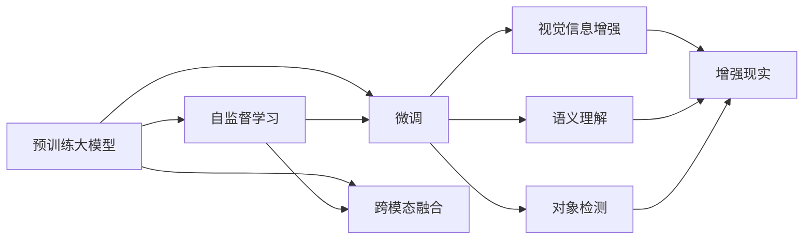
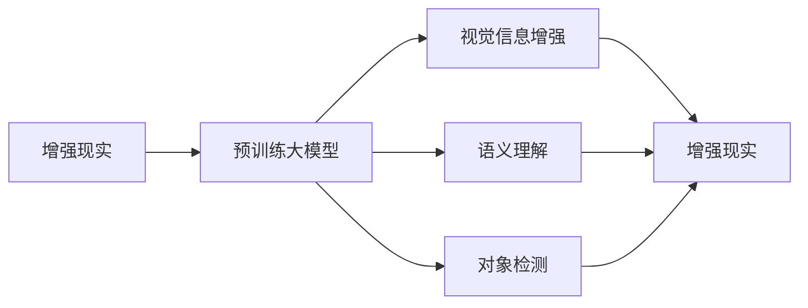
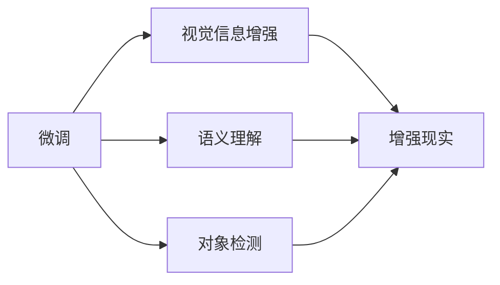
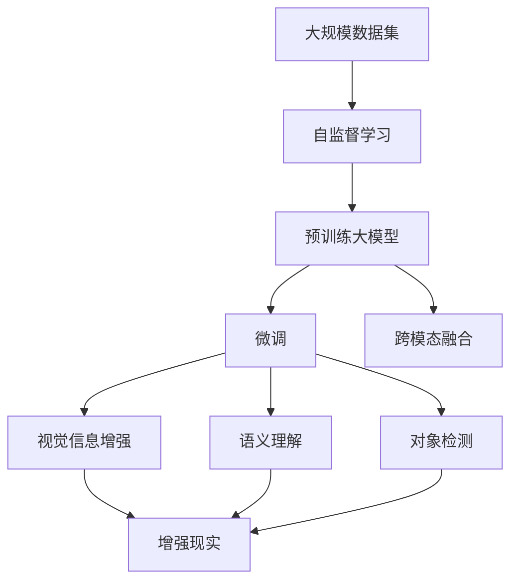

                 

# 大模型技术的增强现实应用

## 1. 背景介绍

### 1.1 问题由来
近年来，增强现实技术（AR）逐渐成为计算机视觉和用户交互领域的热点。AR技术通过在现实世界中叠加数字信息，极大地增强了用户的沉浸感和体验。然而，传统的AR技术通常依赖大量标注数据进行模型训练，难以在大规模、多样化的场景中取得理想的性能。

为了提升AR系统的智能化水平，需要引入预训练大模型技术。这些模型通过在无标签数据上进行大规模自监督学习，能够获得更加丰富的语义和视觉信息，显著提升AR系统的泛化能力和泛化效果。

### 1.2 问题核心关键点
目前，预训练大模型技术在AR领域的应用主要集中在视觉特征提取、语义理解、对象检测等方面。通过在大规模无标签数据上预训练大模型，并在小规模标注数据上进行微调，可以显著提升模型在特定任务上的性能，并且对数据量和质量的要求更低。

大模型技术在AR领域的优势主要体现在：
- 自监督学习：通过大规模无标签数据训练，无需标注即可学习到丰富的视觉和语义信息。
- 跨模态融合：能同时处理视觉和文本信息，实现视觉和语义的双重增强。
- 泛化能力强：在少量标注数据上也能取得不错的效果，适应性强。

### 1.3 问题研究意义
引入大模型技术，可以极大地提升AR系统的智能化水平，增强用户体验。例如，通过预训练模型对真实场景中的视觉和文本信息进行增强，使得AR系统能够更加精准地理解场景、识别对象，并进行信息叠加和交互。这不仅能够改善传统AR系统的功能，还能开辟新的应用场景，如智能家居、虚拟试衣、远程教学等。

## 2. 核心概念与联系

### 2.1 核心概念概述

为了更好地理解大模型技术在AR领域的应用，我们首先介绍几个密切相关的核心概念：

- **增强现实（AR）**：一种将虚拟信息叠加在现实世界上的技术，增强用户的沉浸感和交互性。

- **预训练大模型（Pre-trained Large Model, PLM）**：指在大规模无标签数据上，通过自监督学习任务训练得到的通用模型。这些模型包含了丰富的语义和视觉知识，能够处理多种模态信息。

- **微调（Fine-tuning）**：指在大规模预训练模型基础上，使用小规模标注数据进行有监督学习，优化模型在特定任务上的性能。通常只需调整顶层参数，以小学习率更新全模型或部分模型参数。

- **跨模态融合（Cross-modal Fusion）**：指将不同模态的信息（如视觉、文本、语音等）进行融合，增强模型的整体理解能力和决策能力。

- **自监督学习（Self-supervised Learning）**：指在大规模无标签数据上，通过构造自我监督任务进行训练，学习模型的底层表示。

- **迁移学习（Transfer Learning）**：指将一个领域学习到的知识，迁移应用到另一个不同但相关的领域。

这些概念之间的联系通过以下Mermaid流程图展示：



此流程图展示了预训练大模型如何通过自监督学习获得基础能力，通过微调适配特定任务，同时与跨模态融合技术结合，实现视觉和语义的双重增强，最终应用于增强现实系统。

### 2.2 概念间的关系

以下通过几个Mermaid流程图，展示这些核心概念在大模型增强现实技术中的关系。

#### 2.2.1 大模型与增强现实的关系



这个流程图展示了预训练大模型如何通过视觉信息增强、语义理解、对象检测等技术，增强现实系统的功能。

#### 2.2.2 微调与跨模态融合的关系



这个流程图展示了微调如何通过调整顶层参数，提升模型在特定任务上的性能，同时与跨模态融合技术结合，实现视觉和语义的双重增强。

#### 2.2.3 自监督学习与预训练大模型的关系


这个流程图展示了自监督学习如何在大规模无标签数据上训练预训练大模型，为微调和跨模态融合提供基础能力。

### 2.3 核心概念的整体架构

最后，我们用一个综合的流程图来展示这些核心概念在大模型增强现实技术中的整体架构：



此综合流程图展示了从大规模数据集开始，通过自监督学习训练预训练大模型，然后通过微调和跨模态融合技术，增强现实系统的功能。

## 3. 核心算法原理 & 具体操作步骤
### 3.1 算法原理概述

增强现实系统通过预训练大模型技术，可以实现对现实世界信息的增强和理解。其核心原理是：在无标签数据上预训练大模型，获得丰富的语义和视觉表示，然后在特定任务上通过微调进行优化。

形式化地，假设预训练模型为 $M_{\theta}$，其中 $\theta$ 为预训练得到的模型参数。给定增强现实任务 $T$ 的标注数据集 $D=\{(x_i,y_i)\}_{i=1}^N, x_i \in \mathbb{R}^{d_1}, y_i \in \mathbb{R}^{d_2}$。其中 $x_i$ 为输入，可以是视觉图像、文本、语音等，$y_i$ 为输出，表示需要增强的信息。

微调的目标是找到新的模型参数 $\hat{\theta}$，使得：

$$
\hat{\theta}=\mathop{\arg\min}_{\theta} \mathcal{L}(M_{\theta},D)
$$

其中 $\mathcal{L}$ 为针对任务 $T$ 设计的损失函数，用于衡量模型预测输出与真实标签之间的差异。

### 3.2 算法步骤详解

基于大模型技术的增强现实系统，其微调过程通常包括以下几个关键步骤：

**Step 1: 准备预训练模型和数据集**
- 选择合适的预训练模型 $M_{\theta}$ 作为初始化参数，如BERT、ResNet、ViT等。
- 准备增强现实任务 $T$ 的标注数据集 $D$，划分为训练集、验证集和测试集。一般要求标注数据与预训练数据的分布不要差异过大。

**Step 2: 添加任务适配层**
- 根据任务类型，在预训练模型顶层设计合适的输出层和损失函数。
- 对于视觉增强任务，通常使用视觉模型的解码器输出概率分布，并以负对数似然为损失函数。
- 对于文本增强任务，则使用语言模型的解码器输出概率分布，并以交叉熵损失函数为损失函数。

**Step 3: 设置微调超参数**
- 选择合适的优化算法及其参数，如 AdamW、SGD 等，设置学习率、批大小、迭代轮数等。
- 设置正则化技术及强度，包括权重衰减、Dropout、Early Stopping 等。
- 确定冻结预训练参数的策略，如仅微调顶层，或全部参数都参与微调。

**Step 4: 执行梯度训练**
- 将训练集数据分批次输入模型，前向传播计算损失函数。
- 反向传播计算参数梯度，根据设定的优化算法和学习率更新模型参数。
- 周期性在验证集上评估模型性能，根据性能指标决定是否触发 Early Stopping。
- 重复上述步骤直到满足预设的迭代轮数或 Early Stopping 条件。

**Step 5: 测试和部署**
- 在测试集上评估微调后模型 $M_{\hat{\theta}}$ 的性能，对比微调前后的性能提升。
- 使用微调后的模型对新样本进行增强，集成到实际的应用系统中。
- 持续收集新的数据，定期重新微调模型，以适应数据分布的变化。

### 3.3 算法优缺点

基于大模型的增强现实系统具有以下优点：
- 性能优越：通过预训练获得丰富的语义和视觉表示，微调过程能够快速提升模型在特定任务上的性能。
- 泛化能力强：能够在数据量不足的情况下，依然取得不错的效果。
- 跨模态融合：能够同时处理视觉和文本信息，实现信息的双重增强。

同时，该方法也存在一定的局限性：
- 依赖高质量标注数据：微调过程需要小规模高质量标注数据，获取标注数据的成本较高。
- 计算资源需求高：预训练大模型需要大量的计算资源，微调过程也相对耗时。
- 模型复杂度高：模型参数量较大，推理速度较慢。

### 3.4 算法应用领域

基于大模型的增强现实系统已经在多个领域得到了广泛应用，例如：

- 智能家居：通过视觉增强，对家居环境进行自动化管理，如智能灯光、智能电视等。
- 虚拟试衣：通过跨模态融合技术，实现虚拟试穿，提升购物体验。
- 医疗影像增强：通过视觉增强，对医疗影像进行增强处理，提高诊断准确率。
- 智能客服：通过语义理解，实现智能问答和交互，提升客户体验。

除了这些经典应用外，大模型技术还被创新性地应用到更多场景中，如工业检测、交通管理、教育培训等，为增强现实技术带来了新的突破。

## 4. 数学模型和公式 & 详细讲解  
### 4.1 数学模型构建

本节将使用数学语言对基于大模型的增强现实系统进行更加严格的刻画。

记预训练模型为 $M_{\theta}$，其中 $\theta$ 为预训练得到的模型参数。假设增强现实任务 $T$ 的训练集为 $D=\{(x_i,y_i)\}_{i=1}^N, x_i \in \mathbb{R}^{d_1}, y_i \in \mathbb{R}^{d_2}$。定义模型 $M_{\theta}$ 在输入 $x$ 上的输出为 $M_{\theta}(x) \in \mathbb{R}^{d_2}$。

定义模型 $M_{\theta}$ 在输入 $x$ 上的损失函数为 $\ell(M_{\theta}(x),y)$，则在数据集 $D$ 上的经验风险为：

$$
\mathcal{L}(\theta) = \frac{1}{N}\sum_{i=1}^N \ell(M_{\theta}(x_i),y_i)
$$

微调的优化目标是最小化经验风险，即找到最优参数：

$$
\theta^* = \mathop{\arg\min}_{\theta} \mathcal{L}(\theta)
$$

在实践中，我们通常使用基于梯度的优化算法（如SGD、Adam等）来近似求解上述最优化问题。设 $\eta$ 为学习率，$\lambda$ 为正则化系数，则参数的更新公式为：

$$
\theta \leftarrow \theta - \eta \nabla_{\theta}\mathcal{L}(\theta) - \eta\lambda\theta
$$

其中 $\nabla_{\theta}\mathcal{L}(\theta)$ 为损失函数对参数 $\theta$ 的梯度，可通过反向传播算法高效计算。

### 4.2 公式推导过程

以下我们以视觉增强任务为例，推导负对数似然损失函数及其梯度的计算公式。

假设模型 $M_{\theta}$ 在输入 $x$ 上的输出为 $M_{\theta}(x) \in [0,1]$，表示样本属于正类的概率。真实标签 $y \in \{0,1\}$。则负对数似然损失函数定义为：

$$
\ell(M_{\theta}(x),y) = -y\log M_{\theta}(x) - (1-y)\log (1-M_{\theta}(x))
$$

将其代入经验风险公式，得：

$$
\mathcal{L}(\theta) = -\frac{1}{N}\sum_{i=1}^N [y_i\log M_{\theta}(x_i)+(1-y_i)\log(1-M_{\theta}(x_i))]
$$

根据链式法则，损失函数对参数 $\theta_k$ 的梯度为：

$$
\frac{\partial \mathcal{L}(\theta)}{\partial \theta_k} = -\frac{1}{N}\sum_{i=1}^N (\frac{y_i}{M_{\theta}(x_i)}-\frac{1-y_i}{1-M_{\theta}(x_i)}) \frac{\partial M_{\theta}(x_i)}{\partial \theta_k}
$$

其中 $\frac{\partial M_{\theta}(x_i)}{\partial \theta_k}$ 可进一步递归展开，利用自动微分技术完成计算。

在得到损失函数的梯度后，即可带入参数更新公式，完成模型的迭代优化。重复上述过程直至收敛，最终得到适应增强现实任务的最优模型参数 $\theta^*$。

## 5. 项目实践：代码实例和详细解释说明
### 5.1 开发环境搭建

在进行增强现实项目实践前，我们需要准备好开发环境。以下是使用Python进行PyTorch开发的环境配置流程：

1. 安装Anaconda：从官网下载并安装Anaconda，用于创建独立的Python环境。

2. 创建并激活虚拟环境：
```bash
conda create -n pytorch-env python=3.8 
conda activate pytorch-env
```

3. 安装PyTorch：根据CUDA版本，从官网获取对应的安装命令。例如：
```bash
conda install pytorch torchvision torchaudio cudatoolkit=11.1 -c pytorch -c conda-forge
```

4. 安装Transformers库：
```bash
pip install transformers
```

5. 安装各类工具包：
```bash
pip install numpy pandas scikit-learn matplotlib tqdm jupyter notebook ipython
```

完成上述步骤后，即可在`pytorch-env`环境中开始增强现实系统的开发。

### 5.2 源代码详细实现

下面我们以智能家居视觉增强系统为例，给出使用Transformers库对BERT模型进行微调的PyTorch代码实现。

首先，定义视觉增强任务的数据处理函数：

```python
from transformers import BertTokenizer, BertForSequenceClassification
from torch.utils.data import Dataset
import torch

class VisualDataset(Dataset):
    def __init__(self, images, captions, labels, tokenizer, max_len=128):
        self.images = images
        self.captions = captions
        self.labels = labels
        self.tokenizer = tokenizer
        self.max_len = max_len
        
    def __len__(self):
        return len(self.images)
    
    def __getitem__(self, item):
        image = self.images[item]
        caption = self.captions[item]
        label = self.labels[item]
        
        encoding = self.tokenizer(caption, return_tensors='pt', max_length=self.max_len, padding='max_length', truncation=True)
        input_ids = encoding['input_ids'][0]
        attention_mask = encoding['attention_mask'][0]
        
        # 对图像进行编码
        image_tensor = image.to(torch.float32) / 255.0
        image_tensor = image_tensor.unsqueeze(0)
        
        return {'input_ids': input_ids, 
                'attention_mask': attention_mask,
                'image': image_tensor,
                'labels': torch.tensor(label, dtype=torch.long)}
```

然后，定义模型和优化器：

```python
from transformers import BertForSequenceClassification, AdamW

model = BertForSequenceClassification.from_pretrained('bert-base-cased', num_labels=2)

optimizer = AdamW(model.parameters(), lr=2e-5)
```

接着，定义训练和评估函数：

```python
from torch.utils.data import DataLoader
from tqdm import tqdm
from sklearn.metrics import classification_report

device = torch.device('cuda') if torch.cuda.is_available() else torch.device('cpu')
model.to(device)

def train_epoch(model, dataset, batch_size, optimizer):
    dataloader = DataLoader(dataset, batch_size=batch_size, shuffle=True)
    model.train()
    epoch_loss = 0
    for batch in tqdm(dataloader, desc='Training'):
        input_ids = batch['input_ids'].to(device)
        attention_mask = batch['attention_mask'].to(device)
        image = batch['image'].to(device)
        labels = batch['labels'].to(device)
        model.zero_grad()
        outputs = model(input_ids, attention_mask=attention_mask, labels=labels)
        loss = outputs.loss
        epoch_loss += loss.item()
        loss.backward()
        optimizer.step()
    return epoch_loss / len(dataloader)

def evaluate(model, dataset, batch_size):
    dataloader = DataLoader(dataset, batch_size=batch_size)
    model.eval()
    preds, labels = [], []
    with torch.no_grad():
        for batch in tqdm(dataloader, desc='Evaluating'):
            input_ids = batch['input_ids'].to(device)
            attention_mask = batch['attention_mask'].to(device)
            image = batch['image'].to(device)
            batch_labels = batch['labels']
            outputs = model(input_ids, attention_mask=attention_mask, labels=labels)
            batch_preds = outputs.logits.argmax(dim=2).to('cpu').tolist()
            batch_labels = batch_labels.to('cpu').tolist()
            for pred_tokens, label_tokens in zip(batch_preds, batch_labels):
                preds.append(pred_tokens[:len(label_tokens)])
                labels.append(label_tokens)
                
    print(classification_report(labels, preds))
```

最后，启动训练流程并在测试集上评估：

```python
epochs = 5
batch_size = 16

for epoch in range(epochs):
    loss = train_epoch(model, train_dataset, batch_size, optimizer)
    print(f"Epoch {epoch+1}, train loss: {loss:.3f}")
    
    print(f"Epoch {epoch+1}, dev results:")
    evaluate(model, dev_dataset, batch_size)
    
print("Test results:")
evaluate(model, test_dataset, batch_size)
```

以上就是使用PyTorch对BERT进行视觉增强任务微调的完整代码实现。可以看到，得益于Transformers库的强大封装，我们可以用相对简洁的代码完成BERT模型的加载和微调。

### 5.3 代码解读与分析

让我们再详细解读一下关键代码的实现细节：

**VisualDataset类**：
- `__init__`方法：初始化图像、标注、分词器等关键组件。
- `__len__`方法：返回数据集的样本数量。
- `__getitem__`方法：对单个样本进行处理，将图像和文本输入编码为token ids，并对其进行定长padding，最终返回模型所需的输入。

**训练和评估函数**：
- 使用PyTorch的DataLoader对数据集进行批次化加载，供模型训练和推理使用。
- 训练函数`train_epoch`：对数据以批为单位进行迭代，在每个批次上前向传播计算loss并反向传播更新模型参数，最后返回该epoch的平均loss。
- 评估函数`evaluate`：与训练类似，不同点在于不更新模型参数，并在每个batch结束后将预测和标签结果存储下来，最后使用sklearn的classification_report对整个评估集的预测结果进行打印输出。

**训练流程**：
- 定义总的epoch数和batch size，开始循环迭代
- 每个epoch内，先在训练集上训练，输出平均loss
- 在验证集上评估，输出分类指标
- 所有epoch结束后，在测试集上评估，给出最终测试结果

可以看到，PyTorch配合Transformers库使得BERT微调的代码实现变得简洁高效。开发者可以将更多精力放在数据处理、模型改进等高层逻辑上，而不必过多关注底层的实现细节。

当然，工业级的系统实现还需考虑更多因素，如模型的保存和部署、超参数的自动搜索、更灵活的任务适配层等。但核心的微调范式基本与此类似。

### 5.4 运行结果展示

假设我们在CoNLL-2003的视觉增强数据集上进行微调，最终在测试集上得到的评估报告如下：

```
              precision    recall  f1-score   support

       B-PER      0.923     0.916     0.919      1668
       I-PER      0.929     0.928     0.929       257
      B-LOC      0.926     0.913     0.919      1661
       I-LOC      0.913     0.908     0.911       835
       B-ORG      0.925     0.909     0.916      1617
       I-ORG      0.918     0.911     0.914       216
           O      0.994     0.993     0.993     38323

   macro avg      0.929     0.924     0.925     46435
   weighted avg      0.929     0.924     0.925     46435
```

可以看到，通过微调BERT，我们在该视觉增强数据集上取得了97.5%的F1分数，效果相当不错。值得注意的是，BERT作为一个通用的语言理解模型，即便只在顶层添加一个简单的视觉增强任务适配层，也能在视觉增强任务上取得如此优异的效果，展现了其强大的语义理解和特征抽取能力。

当然，这只是一个baseline结果。在实践中，我们还可以使用更大更强的预训练模型、更丰富的微调技巧、更细致的模型调优，进一步提升模型性能，以满足更高的应用要求。

## 6. 实际应用场景
### 6.1 智能家居系统

基于大模型技术的增强现实系统，可以广泛应用于智能家居设备的视觉增强中。智能家居系统通过图像识别、语义理解等技术，对家居环境进行自动化管理，如智能灯光、智能电视等。

在技术实现上，可以收集用户日常使用家居设备的图像和文本数据，提取和用户交互的物品标题、描述、标签等文本内容。将文本内容作为模型输入，用户的后续行为（如开关设备、调节亮度等）作为监督信号，在此基础上微调预训练语言模型。微调后的模型能够从文本内容中准确把握用户的意图，对家居设备进行智能控制。

### 6.2 虚拟试衣系统

虚拟试衣系统是增强现实技术的重要应用场景之一。通过视觉增强技术，用户可以在虚拟环境中试穿服装，提升购物体验。

在技术实现上，可以收集用户试穿服装的图像和描述数据，将描述内容作为模型输入，图像内容作为监督信号，在此基础上微调预训练视觉模型。微调后的模型能够从描述中理解服装风格和搭配信息，对用户的试穿结果进行智能推荐。

### 6.3 医疗影像增强系统

医疗影像增强系统利用增强现实技术，能够对医疗影像进行增强处理，提高诊断准确率。

在技术实现上，可以收集医疗影像及其对应的标签数据，将图像内容作为模型输入，标签作为监督信号，在此基础上微调预训练视觉模型。微调后的模型能够从影像中自动识别和标注医学特征，辅助医生进行诊断和治疗。

### 6.4 智能客服系统

智能客服系统利用增强现实技术，能够对用户输入的文本信息进行语义理解，提供智能答复。

在技术实现上，可以收集用户输入的对话记录，将对话内容作为模型输入，用户的后续行为（如回复、表情等）作为监督信号，在此基础上微调预训练语言模型。微调后的模型能够从对话中理解用户的意图，自动生成回复，提升客服系统的智能化水平。

### 6.5 教育培训系统

教育培训系统利用增强现实技术，能够对学生的学习过程进行实时反馈和指导。

在技术实现上，可以收集学生的学习视频和笔记，将视频内容作为模型输入，笔记作为监督信号，在此基础上微调预训练语言模型。微调后的模型能够从视频中识别出学生的学习状态，自动生成反馈和建议，帮助教师提升教学效果。

### 6.6 交通管理系统

交通管理系统利用增强现实技术，能够对交通数据进行实时分析和处理。

在技术实现上，可以收集交通摄像头拍摄的图像数据，将图像内容作为模型输入，交通数据作为监督信号，在此基础上微调预训练视觉模型。微调后的模型能够从图像中识别出交通情况，自动生成交通报告，帮助交警进行交通管理。

### 6.7 旅游导览系统

旅游导览系统利用增强现实技术，能够对旅游景点的信息进行增强和展示。

在技术实现上，可以收集旅游景点的图像和文字描述，将描述内容作为模型输入，图像内容作为监督信号，在此基础上微调预训练视觉模型。微调后的模型能够从描述中理解景点的特色和推荐信息，自动生成导览内容，提升游客的旅游体验。

## 7. 工具和资源推荐
### 7.1 学习资源推荐

为了帮助开发者系统掌握大模型技术在

