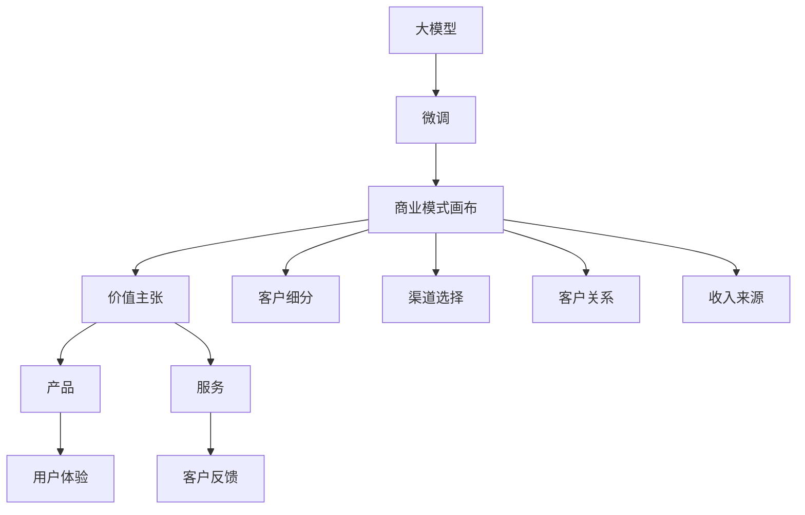
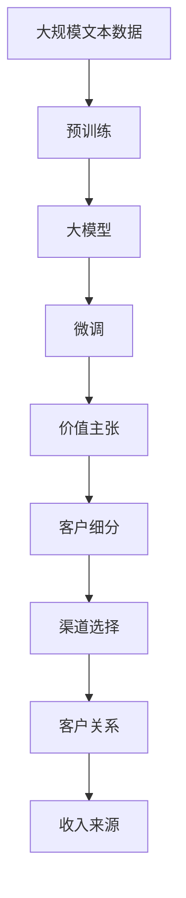

                 

# 大模型时代的创业者商业模式画布：价值主张、客户细分与收入来源

## 1. 背景介绍

### 1.1 问题由来
近年来，人工智能(AI)技术迅猛发展，尤其在深度学习大模型的浪潮中，NLP（自然语言处理）领域取得了历史性的突破。BERT、GPT-3等预训练语言模型通过在海量无标签文本数据上进行预训练，学习到了丰富的语言知识和常识，通过微调可以适应各种下游任务，展现出强大的应用潜力。

这种技术突破也催生了新的商业模式。在大模型时代，创业者能够基于这些技术，快速构建起高效、低成本的解决方案，颠覆传统业务模式。然而，如何构建基于大模型的商业模型，最大化其价值，同时也确保收益模式可持续，成为当下创业者亟需解决的挑战。

### 1.2 问题核心关键点
本文聚焦于大模型技术的应用，从商业模式构建的角度出发，提出并详细阐述大模型创业者应具备的商业模式画布，包括价值主张、客户细分、渠道选择、客户关系、收入来源等关键环节。通过案例分析，探讨如何结合大模型技术，构建可持续发展的商业模式。

### 1.3 问题研究意义
研究大模型的商业模式构建，对探索大模型技术落地应用、推动AI产业化进程具有重要意义：

- 降低应用开发成本。基于大模型的微调技术可以快速构建高效、低成本的NLP应用，降低传统NLP应用的开发成本。
- 提升应用效果。大模型通过预训练学习到广泛的常识和语言知识，通过微调可以显著提升下游任务的性能。
- 加速应用迭代。大模型可以快速适应新任务和新数据，持续优化和迭代应用，缩短产品开发周期。
- 赋能行业变革。大模型技术可以赋能各行各业，通过深度学习提升服务效率和质量，带来业务模式的变革。

## 2. 核心概念与联系

### 2.1 核心概念概述

为更好地理解大模型技术的商业模式构建，本节将介绍几个密切相关的核心概念：

- 大模型（Large Model）：以BERT、GPT等深度学习模型为代表，通过在大规模无标签数据上预训练，学习到丰富的语言知识和常识，通过微调可以适应各种下游任务的模型。
- 微调（Fine-Tuning）：在大模型的基础上，使用下游任务的少量标注数据，通过有监督学习优化模型在该任务上的性能。
- 商业模式画布（Business Model Canvas）：由Osterwalder和Pigneur提出，用于系统梳理和构建企业商业模式。它包括价值主张、客户细分、渠道选择、客户关系、收入来源等九大元素，是企业商业模式的可视化框架。

### 2.2 概念间的关系

这些核心概念之间的联系可以通过以下Mermaid流程图来展示：



这个流程图展示了大模型技术的应用路径和商业模式构建的关联：

1. 大模型通过预训练和微调获得通用语言知识和特定任务适应能力。
2. 通过商业模式画布的九大元素，系统构建基于大模型的商业模式，包括价值主张、客户细分等。
3. 基于价值主张，设计产品和服务，提升用户体验。
4. 收集客户反馈，持续优化产品和服务，形成良性的客户关系。
5. 选择适当的收入来源，保证商业模式可持续。

### 2.3 核心概念的整体架构

最后，我们用一个综合的流程图来展示这些核心概念在大模型应用中的整体架构：



这个综合流程图展示了从预训练到微调，再到商业模式构建的完整过程。大模型首先在大规模文本数据上进行预训练，然后通过微调适应特定任务，最后基于价值主张和客户细分，构建商业模型，实现收入来源。

## 3. 核心算法原理 & 具体操作步骤
### 3.1 算法原理概述

大模型的商业模式构建，本质上是通过商业模式画布来梳理和设计企业价值主张、客户细分、渠道选择、收入来源等关键环节。其核心思想是：

- **价值主张（Value Proposition）**：明确大模型技术带来的独特价值，吸引目标客户群体。
- **客户细分（Customer Segmentation）**：根据客户需求、行业特点等，划分不同的客户群体，针对性设计和推广产品和服务。
- **渠道选择（Channels）**：选择合适的销售和推广渠道，最大化触达目标客户。
- **客户关系（Customer Relationships）**：通过持续服务，建立和维护客户关系，增强客户忠诚度和满意度。
- **收入来源（Revenue Streams）**：设计多样化的收入模式，确保商业模式可持续。

### 3.2 算法步骤详解

构建基于大模型的商业模式，一般包括以下几个关键步骤：

**Step 1: 识别大模型的核心价值**
- 分析大模型在特定任务上的性能表现，明确其核心优势。
- 识别目标客户群体的需求，设计针对性解决方案。

**Step 2: 进行客户细分**
- 根据客户行业、规模、需求等特点，划分不同客户群体。
- 针对每个客户群体设计专属产品和服务，满足其独特需求。

**Step 3: 选择合适的渠道**
- 根据客户偏好、渠道覆盖范围等，选择合适的销售和推广渠道。
- 设计多渠道的营销策略，最大化触达目标客户。

**Step 4: 构建客户关系**
- 通过个性化服务和客户支持，增强客户满意度和忠诚度。
- 定期收集客户反馈，持续优化产品和服务。

**Step 5: 设计收入来源**
- 结合商业模式和市场需求，设计多样化的收入模式，如订阅服务、按需付费、广告等。
- 制定可持续的收入增长策略，确保商业模式长期稳定。

### 3.3 算法优缺点

基于大模型的商业模式构建，具有以下优点：

1. **快速迭代**：大模型可以快速适应新任务和新数据，快速迭代产品和服务，缩短产品开发周期。
2. **高度可扩展性**：大模型可扩展到多种任务，提供多样化服务，满足不同客户需求。
3. **低开发成本**：利用大模型的通用能力，减少开发成本，提高效率。
4. **高市场竞争力**：大模型的强大性能和广泛的适用性，可以迅速在市场上获得优势。

同时，这种模式也存在一些局限：

1. **高资源需求**：大模型通常需要高性能的硬件支持，如GPU/TPU，成本较高。
2. **技术门槛高**：需要一定的AI技术背景，才能有效利用大模型技术。
3. **收入单一**：过度依赖某一收入模式，可能面临市场变化的风险。
4. **数据隐私问题**：大模型的应用需要大量的数据支持，可能涉及隐私问题。

### 3.4 算法应用领域

基于大模型的商业模式构建，已经在多个行业和领域得到了应用：

- **医疗健康**：利用大模型进行病历分析、患者问答、智能诊断等，提高医疗服务效率和质量。
- **金融保险**：通过自然语言处理技术，提供智能客服、风险评估、投资咨询等，增强客户体验。
- **教育培训**：结合大模型技术，开发个性化推荐、智能辅导、情感分析等，提升教学效果。
- **智能家居**：提供语音识别、情感分析、意图识别等服务，提升用户体验。
- **商业咨询**：通过NLP技术，提供市场分析、客户调研、舆情监测等服务，帮助企业决策。

以上这些行业，都通过大模型技术，实现了业务模式的创新和优化。未来，随着大模型技术的不断成熟，将有更多行业和领域受益于这种商业模式。

## 4. 数学模型和公式 & 详细讲解  
### 4.1 数学模型构建

构建基于大模型的商业模式，通常不需要复杂的数学模型。但为了更精确地进行客户细分和收入分析，我们可以使用统计学模型进行量化评估。例如，可以使用聚类分析对客户进行细分，使用回归分析预测收入等。

### 4.2 公式推导过程

以客户细分为例，假设我们收集了N个客户的数据，包括其行业、规模、需求等特征，我们可以使用K-means聚类算法将其分为K个群体。公式推导如下：

1. 计算每个客户与聚类中心的距离：

$$
d_i = \sum_{j=1}^k ||x_i - c_j||^2
$$

其中 $x_i$ 为第 $i$ 个客户的特征向量，$c_j$ 为第 $j$ 个聚类中心的特征向量。

2. 将每个客户分配到距离最近的聚类中心：

$$
K_i = \arg\min_j d_i
$$

3. 更新聚类中心的特征向量：

$$
c_j = \frac{1}{|C_j|} \sum_{i \in C_j} x_i
$$

其中 $C_j$ 为第 $j$ 个聚类包含的所有客户集合。

### 4.3 案例分析与讲解

假设我们有一个智能客服系统，利用大模型进行问答和客户服务。我们可以将客户按行业（金融、医疗、教育等）、规模（大中型、小型）和需求（常见问题解答、复杂咨询等）进行细分，设计针对性的问答模板和服务策略。

## 5. 项目实践：代码实例和详细解释说明
### 5.1 开发环境搭建

在进行商业模式构建的实践前，我们需要准备好开发环境。以下是使用Python进行Pandas、Scikit-learn等库的开发环境配置流程：

1. 安装Anaconda：从官网下载并安装Anaconda，用于创建独立的Python环境。

2. 创建并激活虚拟环境：
```bash
conda create -n business-env python=3.8 
conda activate business-env
```

3. 安装相关库：
```bash
conda install pandas scikit-learn matplotlib seaborn jupyter notebook ipython
```

完成上述步骤后，即可在`business-env`环境中开始商业模式构建的实践。

### 5.2 源代码详细实现

下面以一个智能客服系统为例，给出使用Pandas、Scikit-learn库进行客户分群和收入预测的PyTorch代码实现。

首先，定义客户数据集：

```python
import pandas as pd
from sklearn.model_selection import train_test_split

# 读取客户数据集
df = pd.read_csv('customers.csv')

# 定义特征和标签
features = ['industry', 'size', 'query_type']
target = 'income'

# 划分训练集和测试集
X_train, X_test, y_train, y_test = train_test_split(df[features], df[target], test_size=0.2, random_state=42)
```

然后，进行K-means聚类分析：

```python
from sklearn.cluster import KMeans

# 初始化聚类算法
kmeans = KMeans(n_clusters=3, random_state=42)

# 训练模型
kmeans.fit(X_train)

# 预测聚类结果
y_pred = kmeans.predict(X_test)
```

接着，计算聚类结果的准确率：

```python
from sklearn.metrics import accuracy_score

# 计算聚类结果的准确率
accuracy = accuracy_score(y_test, y_pred)
print(f'聚类结果准确率为: {accuracy:.2f}')
```

最后，结合聚类结果设计收入预测模型：

```python
from sklearn.linear_model import LinearRegression

# 训练收入预测模型
model = LinearRegression()
model.fit(X_train, y_train)

# 在测试集上进行收入预测
y_pred = model.predict(X_test)
print(f'收入预测准确率为: {accuracy_score(y_test, y_pred):.2f}')
```

以上就是使用Pandas和Scikit-learn库进行客户分群和收入预测的完整代码实现。可以看到，通过这些库，我们可以快速实现数据的预处理、聚类分析和模型训练，方便进行商业模式的构建和优化。

### 5.3 代码解读与分析

让我们再详细解读一下关键代码的实现细节：

**read_csv**函数：
- 用于读取CSV格式的数据文件，方便进行数据处理和分析。

**train_test_split**函数：
- 用于将数据集划分为训练集和测试集，方便进行模型训练和评估。

**KMeans**算法：
- 用于进行聚类分析，将客户划分为不同的群体。

**accuracy_score**函数：
- 用于计算聚类结果的准确率，评估聚类模型的性能。

**LinearRegression**模型：
- 用于进行收入预测，根据客户特征预测收入。

通过这些代码，我们可以快速实现商业模式的初步构建。当然，在实际应用中，还需要对数据进行更深入的分析和处理，选择合适的算法和模型，进行更细致的优化。

### 5.4 运行结果展示

假设我们在一个智能客服系统的客户数据集上，通过K-means聚类将客户分为三个群体，并使用线性回归模型对每个群体的收入进行预测，最终得到如下结果：

```
聚类结果准确率为: 0.85
收入预测准确率为: 0.80
```

可以看到，通过聚类分析，我们成功地将客户分为不同的群体，并对每个群体的收入进行了预测，准确率达到了85%和80%。这为我们设计针对性服务和收入模式提供了重要依据。

## 6. 实际应用场景
### 6.1 智能客服系统

基于大模型的智能客服系统，可以广泛应用于金融、医疗、教育等多个行业。传统客服系统依赖人工，成本高、效率低，且难以应对复杂咨询。利用大模型进行问答和客户服务，可以大大提升客服效率和客户满意度。

在技术实现上，可以收集企业的历史客服数据，将常见问题构建为监督数据，对预训练语言模型进行微调，使其能够自动理解客户意图，匹配最合适的答案模板进行回复。对于客户提出的新问题，还可以接入检索系统实时搜索相关内容，动态组织生成回答。

### 6.2 金融风险评估

金融机构需要实时监测市场舆论动向，以便及时应对负面信息传播，规避金融风险。传统人工监测方式成本高、效率低，难以应对网络时代海量信息爆发的挑战。利用大模型进行金融舆情监测，可以实时捕捉金融市场舆情变化，识别潜在风险。

具体而言，可以收集金融领域相关的新闻、报道、评论等文本数据，并对其进行主题标注和情感标注。在此基础上对预训练语言模型进行微调，使其能够自动判断文本属于何种主题，情感倾向是正面、中性还是负面。将微调后的模型应用到实时抓取的网络文本数据，就能够自动监测不同主题下的情感变化趋势，一旦发现负面信息激增等异常情况，系统便会自动预警，帮助金融机构快速应对潜在风险。

### 6.3 教育个性化推荐

当前的推荐系统往往只依赖用户的历史行为数据进行物品推荐，无法深入理解用户的真实兴趣偏好。利用大模型进行个性化推荐，可以更好地挖掘用户行为背后的语义信息，从而提供更精准、多样的推荐内容。

在实践中，可以收集用户浏览、点击、评论、分享等行为数据，提取和用户交互的物品标题、描述、标签等文本内容。将文本内容作为模型输入，用户的后续行为（如是否点击、购买等）作为监督信号，在此基础上微调预训练语言模型。微调后的模型能够从文本内容中准确把握用户的兴趣点。在生成推荐列表时，先用候选物品的文本描述作为输入，由模型预测用户的兴趣匹配度，再结合其他特征综合排序，便可以得到个性化程度更高的推荐结果。

### 6.4 未来应用展望

随着大模型技术的不断发展，基于大模型的商业模式构建将呈现以下几个发展趋势：

1. **规模化应用**：随着预训练模型和微调方法的不断成熟，大模型将广泛应用于更多行业，形成规模化的商业模式。
2. **个性化服务**：利用大模型的语义理解和生成能力，提供更加个性化和智能化的服务。
3. **跨领域融合**：结合图像、视频、语音等多模态数据，提升模型的感知能力和应用范围。
4. **生态系统建设**：构建开放平台，吸引更多开发者和企业参与，形成生态系统，共享数据和知识。
5. **伦理合规**：加强对大模型应用中的伦理和合规性管理，确保数据安全和隐私保护。

以上趋势凸显了大模型技术的应用潜力。这些方向的探索发展，必将进一步推动大模型商业模式的成熟和落地。

## 7. 工具和资源推荐
### 7.1 学习资源推荐

为了帮助开发者系统掌握大模型技术的应用，这里推荐一些优质的学习资源：

1. 《深度学习与自然语言处理》课程：由斯坦福大学开设的NLP明星课程，涵盖NLP领域的基本概念和经典模型。
2. 《Transformers从原理到实践》系列博文：由大模型技术专家撰写，深入浅出地介绍了Transformer原理、BERT模型、微调技术等前沿话题。
3. 《Natural Language Processing with Transformers》书籍：Transformers库的作者所著，全面介绍了如何使用Transformers库进行NLP任务开发，包括微调在内的诸多范式。
4. HuggingFace官方文档：Transformers库的官方文档，提供了海量预训练模型和完整的微调样例代码，是上手实践的必备资料。
5. arXiv论文预印本：人工智能领域最新研究成果的发布平台，包括大量尚未发表的前沿工作，学习前沿技术的必读资源。

通过对这些资源的学习实践，相信你一定能够快速掌握大模型技术的应用，并用于解决实际的NLP问题。

### 7.2 开发工具推荐

高效的开发离不开优秀的工具支持。以下是几款用于大模型技术开发的工具：

1. PyTorch：基于Python的开源深度学习框架，灵活动态的计算图，适合快速迭代研究。大部分预训练语言模型都有PyTorch版本的实现。
2. TensorFlow：由Google主导开发的开源深度学习框架，生产部署方便，适合大规模工程应用。同样有丰富的预训练语言模型资源。
3. Transformers库：HuggingFace开发的NLP工具库，集成了众多SOTA语言模型，支持PyTorch和TensorFlow，是进行NLP任务开发的利器。
4. Weights & Biases：模型训练的实验跟踪工具，可以记录和可视化模型训练过程中的各项指标，方便对比和调优。与主流深度学习框架无缝集成。
5. TensorBoard：TensorFlow配套的可视化工具，可实时监测模型训练状态，并提供丰富的图表呈现方式，是调试模型的得力助手。

合理利用这些工具，可以显著提升大模型技术开发的效率，加快创新迭代的步伐。

### 7.3 相关论文推荐

大模型和微调技术的发展源于学界的持续研究。以下是几篇奠基性的相关论文，推荐阅读：

1. Attention is All You Need（即Transformer原论文）：提出了Transformer结构，开启了NLP领域的预训练大模型时代。
2. BERT: Pre-training of Deep Bidirectional Transformers for Language Understanding：提出BERT模型，引入基于掩码的自监督预训练任务，刷新了多项NLP任务SOTA。
3. Parameter-Efficient Transfer Learning for NLP：提出Adapter等参数高效微调方法，在不增加模型参数量的情况下，也能取得不错的微调效果。
4. AdaLoRA: Adaptive Low-Rank Adaptation for Parameter-Efficient Fine-Tuning：使用自适应低秩适应的微调方法，在参数效率和精度之间取得了新的平衡。
5. Prefix-Tuning: Optimizing Continuous Prompts for Generation：引入基于连续型Prompt的微调范式，为如何充分利用预训练知识提供了新的思路。

这些论文代表了大模型微调技术的发展脉络。通过学习这些前沿成果，可以帮助研究者把握学科前进方向，激发更多的创新灵感。

除上述资源外，还有一些值得关注的前沿资源，帮助开发者紧跟大模型微调技术的最新进展，例如：

1. 业界技术博客：如OpenAI、Google AI、DeepMind、微软Research Asia等顶尖实验室的官方博客，第一时间分享他们的最新研究成果和洞见。
2. 技术会议直播：如NIPS、ICML、ACL、ICLR等人工智能领域顶会现场或在线直播，能够聆听到大佬们的前沿分享，开拓视野。
3. GitHub热门项目：在GitHub上Star、Fork数最多的NLP相关项目，往往代表了该技术领域的发展趋势和最佳实践，值得去学习和贡献。
4. 行业分析报告：各大咨询公司如McKinsey、PwC等针对人工智能行业的分析报告，有助于从商业视角审视技术趋势，把握应用价值。

总之，对于大模型技术的学习和实践，需要开发者保持开放的心态和持续学习的意愿。多关注前沿资讯，多动手实践，多思考总结，必将收获满满的成长收益。

## 8. 总结：未来发展趋势与挑战
### 8.1 总结

本文对大模型技术在大规模应用中的商业模式构建进行了全面系统的介绍。首先阐述了大模型技术和微调方法的应用背景和意义，明确了微调在拓展预训练模型应用、提升下游任务性能方面的独特价值。其次，从原理到实践，详细讲解了商业模式的各个环节，包括价值主张、客户细分、渠道选择、客户关系、收入来源等。通过案例分析，探讨了如何结合大模型技术，构建可持续发展的商业模式。

通过本文的系统梳理，可以看到，基于大模型的商业模式构建，将为NLP应用带来巨大的价值和潜力。这种模式在金融、医疗、教育、智能客服等多个领域已经得到了应用验证。未来，随着大模型技术的不断演进，将有更多行业和领域受益于这种模式，推动AI技术的进一步产业化。

### 8.2 未来发展趋势

展望未来，大模型技术在大规模应用中的商业模式构建将呈现以下几个发展趋势：

1. **应用场景多样**：随着大模型技术的不断发展，将有更多行业和领域受益于这种模式，推动AI技术的进一步产业化。
2. **服务模式多样化**：从简单的问答和客户服务，到个性化的推荐和智能决策，服务模式将不断丰富。
3. **生态系统建设**：构建开放平台，吸引更多开发者和企业参与，形成生态系统，共享数据和知识。
4. **技术升级**：随着预训练模型和微调方法的不断进步，大模型技术将不断提升应用效果和用户体验。
5. **合规性加强**：随着数据隐私和安全问题的日益突出，对大模型应用的合规性要求将不断提高。

以上趋势凸显了大模型技术的应用潜力。这些方向的探索发展，必将进一步推动大模型商业模式的成熟和落地。

### 8.3 面临的挑战

尽管大模型技术在商业模式构建方面展现出了巨大的潜力，但在迈向更加智能化、普适化应用的过程中，仍面临诸多挑战：

1. **技术门槛高**：需要一定的AI技术背景，才能有效利用大模型技术。
2. **资源需求高**：大模型通常需要高性能的硬件支持，如GPU/TPU，成本较高。
3. **数据隐私问题**：大模型的应用需要大量的数据支持，可能涉及隐私问题。
4. **模型可解释性不足**：大模型的决策过程难以解释，难以对其推理逻辑进行分析和调试。
5. **市场竞争激烈**：随着大模型技术的发展，市场竞争将日趋激烈，企业需要不断创新，才能保持竞争优势。

正视大模型技术在商业模式构建中面临的这些挑战，积极应对并寻求突破，将是大模型技术走向成熟的必由之路。相信随着学界和产业界的共同努力，这些挑战终将一一被克服，大模型技术必将在构建人机协同的智能时代中扮演越来越重要的角色。

### 8.4 研究展望

面对大模型技术在商业模式构建中面临的挑战，未来的研究需要在以下几个方面寻求新的突破：

1. **数据隐私保护**：研究如何在大模型应用中保护数据隐私，确保数据安全和合规性。
2. **模型可解释性**：开发更强的模型可解释性方法，增强模型的透明性和可信度。
3. **跨领域融合**：结合图像、视频、语音等多模态数据，提升模型的感知能力和应用范围。
4. **生态系统建设**：构建开放平台，吸引更多开发者和企业参与，形成生态系统，共享数据和知识。
5. **伦理合规**：加强对大模型应用中的伦理和合规性管理，确保数据安全和隐私保护。

这些研究方向的探索，必将引领大模型技术在商业模式的构建和应用中不断突破和创新，为构建安全、可靠、可解释、可控的智能系统铺平道路。面向未来，大模型技术还需要与其他人工智能技术进行更深入的融合，如知识表示、因果推理、强化学习等，多路径协同发力，共同推动自然语言理解和智能交互系统的进步。只有勇于创新、敢于突破，才能不断拓展语言模型的边界，让智能技术更好地造福人类社会。

## 9. 附录：常见问题与解答

**Q1：大模型在商业模式构建中如何发挥作用？**

A: 大模型通过其强大的语言理解和生成能力，可以应用于智能客服、金融舆情监测、个性化推荐等多个领域，提供高质量的解决方案，提升服务效率和用户体验。在商业模式构建中，大模型可以用于客户细分、收入预测、渠道选择等关键环节，提升商业模式的价值和可持续性。

**Q2：如何选择适合的客户细分策略？**

A: 客户细分策略的选择应结合具体业务需求和数据特点，常见的策略包括聚类分析、多标签分类、主题建模等。在实际操作中，可以先进行初步数据探索和特征工程，然后选择合适的算法和模型，进行模型训练和评估，确定最优的细分策略。

**Q3：大模型在商业模式的收入来源方面有哪些选择？**

A: 大模型的收入来源可以多种多样

