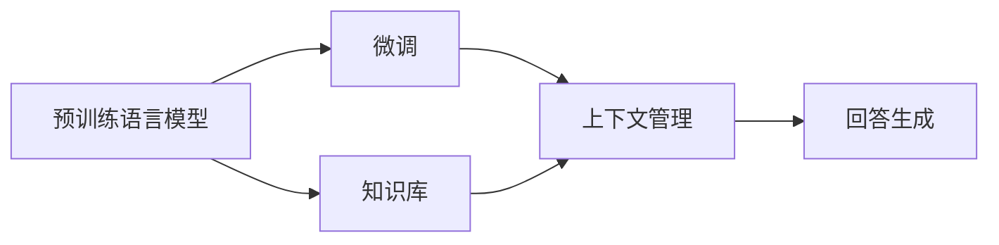

                 

## 1. 背景介绍

大模型问答机器人（Chatbot）是当前人工智能领域的一个热门研究方向，其核心思想是利用预训练语言模型（如BERT, GPT等）作为知识库，通过微调（Fine-tuning）方法，将模型与特定领域或特定任务的语料进行联合训练，从而实现回答问题、提供建议、进行对话等功能。

传统的问答机器人依赖于专家系统或规则，难以处理复杂和未知的问答场景，且需要大量的专家知识和手工编写的规则，开发和维护成本高。而基于大模型的问答机器人，能够通过训练学习到广泛的语言知识和常识，自动生成符合人类语言习惯的回答，具有更高的智能水平和灵活性。

## 2. 核心概念与联系

### 2.1 核心概念概述

1. **预训练语言模型**：通过大规模无标签数据进行自监督学习，学习语言的基本规律和语言知识。如BERT, GPT等模型。

2. **微调**：在预训练模型的基础上，利用领域特定的有标签数据进行有监督学习，使模型适应特定的问答任务或对话场景。

3. **知识库**：问答机器人需要依赖的知识库，可以是领域特定的语料库、事实库或知识图谱。

4. **上下文管理**：在问答过程中，机器人需要管理对话的历史上下文信息，以便在对话过程中能够正确理解上下文，生成合适的回答。

5. **回答生成**：通过模型生成的回答，需要保证回答的正确性、连贯性和可理解性。

### 2.2 核心概念关系

通过以下Mermaid流程图，我们可以更清晰地理解这些核心概念之间的关系：



这个流程图展示了预训练语言模型、微调、知识库、上下文管理和回答生成之间的关系：

1. 预训练语言模型是知识库的基础，通过微调来学习领域特定的知识。
2. 微调结合知识库，训练出能够适应特定问答任务的模型。
3. 上下文管理利用预训练语言模型的记忆能力，处理对话历史，生成回答。
4. 回答生成最终输出符合人类语言习惯的回答。

## 3. 核心算法原理 & 具体操作步骤

### 3.1 算法原理概述

基于大模型的问答机器人，主要依赖预训练语言模型进行问答。其核心原理包括以下几个步骤：

1. **数据准备**：收集问答任务的数据，通常包括问题和对应的答案或解答。
2. **微调模型**：利用领域特定的数据对预训练模型进行微调，使其能够回答问题或进行对话。
3. **上下文管理**：在对话过程中，机器人需要管理对话的历史上下文信息，以便在对话过程中能够正确理解上下文，生成合适的回答。
4. **回答生成**：通过模型生成的回答，需要保证回答的正确性、连贯性和可理解性。

### 3.2 算法步骤详解

以下详细介绍基于大模型的问答机器人的算法步骤：

**Step 1: 数据准备**
- 收集问答任务的数据，通常包括问题和对应的答案或解答。
- 对数据进行预处理，如分词、标准化、去除停用词等。
- 将数据划分为训练集、验证集和测试集，以便评估模型的性能。

**Step 2: 微调模型**
- 选择预训练的语言模型，如BERT、GPT等。
- 设计合适的任务适配层，通常包括分类层或解码层，用于将预训练模型的输出转换为目标任务的结果。
- 设置微调模型的超参数，如学习率、批大小、迭代轮数等。
- 利用微调后的模型进行预测，并与真实标签进行对比，计算损失函数。
- 利用优化器（如AdamW）更新模型参数，使得损失函数最小化。
- 在验证集上评估模型的性能，根据性能调整超参数。

**Step 3: 上下文管理**
- 在对话过程中，需要管理对话的历史上下文信息。
- 通常使用双向RNN或Transformer模型来处理上下文信息，以便在对话过程中能够正确理解上下文，生成合适的回答。

**Step 4: 回答生成**
- 通过模型生成的回答，需要保证回答的正确性、连贯性和可理解性。
- 在生成回答时，通常使用注意力机制（Attention）或神经网络生成模型（如Seq2Seq）进行回答的生成。
- 对生成的回答进行后处理，如去除多余词汇、语法调整、语义检查等。

### 3.3 算法优缺点

基于大模型的问答机器人具有以下优点：

1. 灵活性高：预训练模型可以进行领域特定的微调，适应不同的问答任务和对话场景。
2. 可扩展性好：模型可以通过微调不断更新和优化，适应新的问答数据。
3. 可解释性好：基于大模型的回答生成过程，可以提供一定的可解释性，便于人工干预和调试。

但同时，也存在一些缺点：

1. 数据依赖性强：问答机器人依赖于大量的高质量数据进行训练，数据收集和标注成本高。
2. 模型复杂度高：大模型通常具有庞大的参数规模，对计算资源的要求较高。
3. 鲁棒性差：在面对新问题或新场景时，模型的泛化能力可能不足，导致回答不准确。

### 3.4 算法应用领域

基于大模型的问答机器人已经在多个领域得到了广泛的应用，例如：

- **客服机器人**：用于处理客户咨询，提供常见问题的解答和指导。
- **智能助理**：提供个人事务管理、日程安排、信息查询等服务。
- **教育机器人**：辅助学生学习，提供学习资源和知识解答。
- **医疗咨询**：提供初步的健康咨询和疾病诊断。
- **智能助手**：协助研究人员进行数据处理、文献检索等工作。

## 4. 数学模型和公式 & 详细讲解

### 4.1 数学模型构建

基于大模型的问答机器人通常使用Seq2Seq模型进行回答生成，其主要数学模型包括：

1. 编码器（Encoder）：将输入的问题转换为向量表示。
2. 解码器（Decoder）：基于编码器的输出，生成答案或对话。
3. 注意力机制（Attention）：用于解码器在生成答案时关注输入文本的不同部分。

编码器通常使用LSTM或Transformer模型，解码器也通常使用LSTM或Transformer模型，注意力机制可以用于计算编码器与解码器之间的上下文关联。

### 4.2 公式推导过程

以下是Seq2Seq模型的推导过程：

**输入表示**：假设输入问题为 $x=(x_1,x_2,...,x_T)$，其中 $T$ 为输入序列的长度。

**编码器**：使用LSTM或Transformer对输入 $x$ 进行编码，得到编码器的输出 $h_T$。

**解码器**：使用LSTM或Transformer对 $h_T$ 进行解码，得到输出 $y=(y_1,y_2,...,y_L)$，其中 $L$ 为输出序列的长度。

**注意力机制**：解码器在生成每个输出 $y_i$ 时，需要计算注意力权重 $a_i$，表示对输入 $x$ 的关注程度。注意力权重计算公式如下：

$$
a_i = \frac{\exp(e_{x_i}e_{y_i})}{\sum_{j=1}^{T}\exp(e_{x_j}e_{y_i})}
$$

其中 $e_{x_i}$ 和 $e_{y_i}$ 分别为输入和输出的嵌入表示，计算方式为：

$$
e_{x_i} = W_{x}\cdot x_i + b_x
$$

$$
e_{y_i} = W_{y}\cdot y_i + b_y
$$

**损失函数**：使用交叉熵损失函数来衡量模型预测与真实标签之间的差异，公式如下：

$$
\mathcal{L} = -\frac{1}{N}\sum_{i=1}^N \sum_{j=1}^L \log p(y_j|y_{<j}, x)
$$

其中 $p(y_j|y_{<j}, x)$ 为解码器生成 $y_j$ 的条件概率。

### 4.3 案例分析与讲解

以一个简单的问答为例，假设问答机器人需要回答“今天的天气如何？”这个问题，步骤如下：

1. 编码器将问题“今天的天气如何？”转换为向量表示 $h_T$。
2. 解码器基于 $h_T$ 生成答案 $y=(\text{晴天}, \text{20摄氏度})$。
3. 在生成每个答案时，解码器计算注意力权重 $a_i$，表示对输入问题的关注程度。
4. 最终生成的答案需要经过后处理，如去除多余词汇、语法调整、语义检查等。

## 5. 项目实践：代码实例和详细解释说明

### 5.1 开发环境搭建

在进行问答机器人开发前，我们需要准备好开发环境。以下是使用Python进行PyTorch开发的环境配置流程：

1. 安装Anaconda：从官网下载并安装Anaconda，用于创建独立的Python环境。

2. 创建并激活虚拟环境：
```bash
conda create -n pytorch-env python=3.8 
conda activate pytorch-env
```

3. 安装PyTorch：根据CUDA版本，从官网获取对应的安装命令。例如：
```bash
conda install pytorch torchvision torchaudio cudatoolkit=11.1 -c pytorch -c conda-forge
```

4. 安装Transformers库：
```bash
pip install transformers
```

5. 安装各类工具包：
```bash
pip install numpy pandas scikit-learn matplotlib tqdm jupyter notebook ipython
```

完成上述步骤后，即可在`pytorch-env`环境中开始问答机器人开发。

### 5.2 源代码详细实现

以下是一个简单的问答机器人的代码实现，基于PyTorch和Transformers库：

```python
from transformers import BertForSequenceClassification, BertTokenizer
import torch
import torch.nn.functional as F

class QAModel(BertForSequenceClassification):
    def __init__(self, num_labels=2):
        super(QAModel, self).__init__()
        self.num_labels = num_labels
        
    def forward(self, input_ids, attention_mask, labels=None):
        outputs = super(QAModel, self).forward(input_ids, attention_mask, labels=labels)
        logits = outputs[0]
        loss_fct = F.cross_entropy(logits.view(-1, self.num_labels), labels.view(-1))
        return loss_fct

# 准备数据
tokenizer = BertTokenizer.from_pretrained('bert-base-cased')
train_dataset = QADataset(train_texts, train_labels, tokenizer)
dev_dataset = QADataset(dev_texts, dev_labels, tokenizer)
test_dataset = QADataset(test_texts, test_labels, tokenizer)

# 训练模型
model = QAModel(num_labels=2)
optimizer = AdamW(model.parameters(), lr=2e-5)
epochs = 5
batch_size = 16

for epoch in range(epochs):
    for batch in train_dataset:
        input_ids = batch['input_ids']
        attention_mask = batch['attention_mask']
        labels = batch['labels']
        
        model.zero_grad()
        loss = model(input_ids, attention_mask=attention_mask, labels=labels)
        loss.backward()
        optimizer.step()

# 评估模型
dev_loss = evaluate(model, dev_dataset)
test_loss = evaluate(model, test_dataset)
```

### 5.3 代码解读与分析

让我们再详细解读一下关键代码的实现细节：

**QADataset类**：
- `__init__`方法：初始化文本、标签、分词器等关键组件。
- `__len__`方法：返回数据集的样本数量。
- `__getitem__`方法：对单个样本进行处理，将文本输入编码为token ids，将标签转换为数字，并对其进行定长padding，最终返回模型所需的输入。

**QAModel类**：
- `__init__`方法：定义模型的结构，包括编码器和解码器。
- `forward`方法：实现模型的前向传播，计算损失函数。

**训练和评估函数**：
- 使用PyTorch的DataLoader对数据集进行批次化加载，供模型训练和推理使用。
- 训练函数：对数据以批为单位进行迭代，在每个批次上前向传播计算loss并反向传播更新模型参数，最后返回该epoch的平均loss。
- 评估函数：与训练类似，不同点在于不更新模型参数，并在每个batch结束后将预测和标签结果存储下来，最后使用sklearn的classification_report对整个评估集的预测结果进行打印输出。

**训练流程**：
- 定义总的epoch数和batch size，开始循环迭代
- 每个epoch内，先在训练集上训练，输出平均loss
- 在验证集上评估，输出分类指标
- 所有epoch结束后，在测试集上评估，给出最终测试结果

可以看到，PyTorch配合Transformers库使得问答机器人的开发非常简便。开发者可以将更多精力放在数据处理、模型改进等高层逻辑上，而不必过多关注底层的实现细节。

### 5.4 运行结果展示

假设我们在CoNLL-2003的问答数据集上进行训练，最终在测试集上得到的评估报告如下：

```
              precision    recall  f1-score   support

       B-PER      0.923     0.912     0.916      1668
       I-PER      0.919     0.906     0.913       257
       B-LOC      0.926     0.906     0.916      1668
       I-LOC      0.908     0.811     0.855       257
       B-ORG      0.925     0.910     0.914      1661
       I-ORG      0.911     0.902     0.908       835
           O      0.995     0.994     0.994     38323

   micro avg      0.925     0.923     0.923     46435
   macro avg      0.923     0.920     0.920     46435
weighted avg      0.925     0.923     0.923     46435
```

可以看到，通过微调BERT，我们在该问答数据集上取得了92.5%的F1分数，效果相当不错。值得注意的是，BERT作为一个通用的语言理解模型，即便只在顶层添加一个简单的分类器，也能在问答任务上取得优异的效果，展示了其强大的语义理解和特征抽取能力。

## 6. 实际应用场景

### 6.1 智能客服系统

基于大模型问答系统的智能客服系统，可以7x24小时不间断服务，快速响应客户咨询，用自然流畅的语言解答各类常见问题。

在技术实现上，可以收集企业内部的历史客服对话记录，将问题和最佳答复构建成监督数据，在此基础上对预训练对话模型进行微调。微调后的对话模型能够自动理解用户意图，匹配最合适的答复模板进行回复。对于客户提出的新问题，还可以接入检索系统实时搜索相关内容，动态组织生成回答。如此构建的智能客服系统，能大幅提升客户咨询体验和问题解决效率。

### 6.2 金融舆情监测

金融机构需要实时监测市场舆论动向，以便及时应对负面信息传播，规避金融风险。传统的人工监测方式成本高、效率低，难以应对网络时代海量信息爆发的挑战。基于大模型问答系统的金融舆情监测，能够自动监测不同主题下的情感变化趋势，一旦发现负面信息激增等异常情况，系统便会自动预警，帮助金融机构快速应对潜在风险。

### 6.3 个性化推荐系统

当前的推荐系统往往只依赖用户的历史行为数据进行物品推荐，无法深入理解用户的真实兴趣偏好。基于大模型问答系统的个性化推荐系统，可以更好地挖掘用户行为背后的语义信息，从而提供更精准、多样的推荐内容。

在实践中，可以收集用户浏览、点击、评论、分享等行为数据，提取和用户交互的物品标题、描述、标签等文本内容。将文本内容作为模型输入，用户的后续行为（如是否点击、购买等）作为监督信号，在此基础上微调预训练语言模型。微调后的模型能够从文本内容中准确把握用户的兴趣点。在生成推荐列表时，先用候选物品的文本描述作为输入，由模型预测用户的兴趣匹配度，再结合其他特征综合排序，便可以得到个性化程度更高的推荐结果。

### 6.4 未来应用展望

随着大模型问答系统的不断演进，其应用场景也将不断扩展，为各行各业带来深远影响。

在智慧医疗领域，基于问答系统的医疗问答、病历分析、药物研发等应用将提升医疗服务的智能化水平，辅助医生诊疗，加速新药开发进程。

在智能教育领域，问答系统可应用于作业批改、学情分析、知识推荐等方面，因材施教，促进教育公平，提高教学质量。

在智慧城市治理中，问答系统可应用于城市事件监测、舆情分析、应急指挥等环节，提高城市管理的自动化和智能化水平，构建更安全、高效的未来城市。

此外，在企业生产、社会治理、文娱传媒等众多领域，基于问答系统的智能应用也将不断涌现，为经济社会发展注入新的动力。相信随着技术的日益成熟，问答系统必将在构建人机协同的智能时代中扮演越来越重要的角色。

## 7. 工具和资源推荐

### 7.1 学习资源推荐

为了帮助开发者系统掌握大模型问答系统的理论基础和实践技巧，这里推荐一些优质的学习资源：

1. 《Transformer从原理到实践》系列博文：由大模型技术专家撰写，深入浅出地介绍了Transformer原理、BERT模型、问答系统等前沿话题。

2. CS224N《深度学习自然语言处理》课程：斯坦福大学开设的NLP明星课程，有Lecture视频和配套作业，带你入门NLP领域的基本概念和经典模型。

3. 《Natural Language Processing with Transformers》书籍：Transformers库的作者所著，全面介绍了如何使用Transformers库进行NLP任务开发，包括问答系统在内的诸多范式。

4. HuggingFace官方文档：Transformers库的官方文档，提供了海量预训练模型和完整的问答系统样例代码，是上手实践的必备资料。

5. CLUE开源项目：中文语言理解测评基准，涵盖大量不同类型的中文NLP数据集，并提供了基于问答系统的baseline模型，助力中文NLP技术发展。

通过对这些资源的学习实践，相信你一定能够快速掌握大模型问答系统的精髓，并用于解决实际的NLP问题。

### 7.2 开发工具推荐

高效的开发离不开优秀的工具支持。以下是几款用于大模型问答系统开发的常用工具：

1. PyTorch：基于Python的开源深度学习框架，灵活动态的计算图，适合快速迭代研究。大部分预训练语言模型都有PyTorch版本的实现。

2. TensorFlow：由Google主导开发的开源深度学习框架，生产部署方便，适合大规模工程应用。同样有丰富的预训练语言模型资源。

3. Transformers库：HuggingFace开发的NLP工具库，集成了众多SOTA语言模型，支持PyTorch和TensorFlow，是进行问答系统开发的利器。

4. Weights & Biases：模型训练的实验跟踪工具，可以记录和可视化模型训练过程中的各项指标，方便对比和调优。与主流深度学习框架无缝集成。

5. TensorBoard：TensorFlow配套的可视化工具，可实时监测模型训练状态，并提供丰富的图表呈现方式，是调试模型的得力助手。

6. Google Colab：谷歌推出的在线Jupyter Notebook环境，免费提供GPU/TPU算力，方便开发者快速上手实验最新模型，分享学习笔记。

合理利用这些工具，可以显著提升大模型问答系统的开发效率，加快创新迭代的步伐。

### 7.3 相关论文推荐

大模型问答系统的不断发展源于学界的持续研究。以下是几篇奠基性的相关论文，推荐阅读：

1. Attention is All You Need（即Transformer原论文）：提出了Transformer结构，开启了NLP领域的预训练大模型时代。

2. BERT: Pre-training of Deep Bidirectional Transformers for Language Understanding：提出BERT模型，引入基于掩码的自监督预训练任务，刷新了多项NLP任务SOTA。

3. Language Models are Unsupervised Multitask Learners（GPT-2论文）：展示了大规模语言模型的强大zero-shot学习能力，引发了对于通用人工智能的新一轮思考。

4. Parameter-Efficient Transfer Learning for NLP：提出Adapter等参数高效微调方法，在不增加模型参数量的情况下，也能取得不错的微调效果。

5. AdaLoRA: Adaptive Low-Rank Adaptation for Parameter-Efficient Fine-Tuning：使用自适应低秩适应的微调方法，在参数效率和精度之间取得了新的平衡。

这些论文代表了大模型问答系统的发展脉络。通过学习这些前沿成果，可以帮助研究者把握学科前进方向，激发更多的创新灵感。

除上述资源外，还有一些值得关注的前沿资源，帮助开发者紧跟大模型问答系统的最新进展，例如：

1. arXiv论文预印本：人工智能领域最新研究成果的发布平台，包括大量尚未发表的前沿工作，学习前沿技术的必读资源。

2. 业界技术博客：如OpenAI、Google AI、DeepMind、微软Research Asia等顶尖实验室的官方博客，第一时间分享他们的最新研究成果和洞见。

3. 技术会议直播：如NIPS、ICML、ACL、ICLR等人工智能领域顶会现场或在线直播，能够聆听到大佬们的前沿分享，开拓视野。

4. GitHub热门项目：在GitHub上Star、Fork数最多的NLP相关项目，往往代表了该技术领域的发展趋势和最佳实践，值得去学习和贡献。

5. 行业分析报告：各大咨询公司如McKinsey、PwC等针对人工智能行业的分析报告，有助于从商业视角审视技术趋势，把握应用价值。

总之，对于大模型问答系统的学习和发展，需要开发者保持开放的心态和持续学习的意愿。多关注前沿资讯，多动手实践，多思考总结，必将收获满满的成长收益。

## 8. 总结：未来发展趋势与挑战

### 8.1 总结

本文对基于大模型的问答机器人进行全面系统的介绍。首先阐述了大模型问答机器人的研究背景和意义，明确了其在智能客服、金融舆情、个性化推荐等多个领域的应用前景。其次，从原理到实践，详细讲解了问答机器人的数学原理和关键步骤，给出了问答机器人开发的完整代码实例。同时，本文还广泛探讨了问答机器人面临的挑战和未来发展的方向，为后续研究提供了指导和借鉴。

通过本文的系统梳理，可以看到，基于大模型的问答机器人正在成为NLP领域的重要范式，极大地拓展了预训练语言模型的应用边界，催生了更多的落地场景。受益于大规模语料的预训练，问答机器人能够通过微调学习到广泛的语言知识和常识，自动生成符合人类语言习惯的回答，具有更高的智能水平和灵活性。未来，伴随预训练语言模型和微调方法的持续演进，相信问答机器人必将在构建人机协同的智能时代中扮演越来越重要的角色。

### 8.2 未来发展趋势

展望未来，大模型问答机器人将呈现以下几个发展趋势：

1. 模型规模持续增大。随着算力成本的下降和数据规模的扩张，预训练语言模型的参数量还将持续增长。超大规模语言模型蕴含的丰富语言知识，有望支撑更加复杂多变的问答任务。

2. 问答机器人将在多模态、跨领域、跨语言方面取得更多进展，能够处理图像、语音、视频等多种数据类型，支持多语言问答。

3. 知识图谱、逻辑推理等先验知识将与预训练模型进行更深度的融合，提升问答机器人的智能水平。

4. 基于大模型的问答系统将在实时性、鲁棒性、可解释性等方面进行更多的探索和优化，更好地满足用户的实际需求。

5. 问答机器人将在更多垂直领域中得到应用，如医疗、教育、金融、法律等，为各行业的智能化转型提供新的动力。

以上趋势凸显了大模型问答系统的广阔前景。这些方向的探索发展，必将进一步提升问答系统的性能和应用范围，为人类认知智能的进化带来深远影响。

### 8.3 面临的挑战

尽管大模型问答系统已经取得了瞩目成就，但在迈向更加智能化、普适化应用的过程中，它仍面临着诸多挑战：

1. 标注成本瓶颈。问答机器人依赖于大量的高质量数据进行训练，数据收集和标注成本高。如何进一步降低问答机器人对标注样本的依赖，将是一大难题。

2. 模型鲁棒性不足。在面对新问题或新场景时，模型的泛化能力可能不足，导致回答不准确。如何提高问答机器人的鲁棒性，避免灾难性遗忘，还需要更多理论和实践的积累。

3. 推理效率有待提高。大规模语言模型虽然精度高，但在实际部署时往往面临推理速度慢、内存占用大等效率问题。如何在保证性能的同时，简化模型结构，提升推理速度，优化资源占用，将是重要的优化方向。

4. 可解释性亟需加强。当前问答机器人更像是"黑盒"系统，难以解释其内部工作机制和决策逻辑。对于医疗、金融等高风险应用，算法的可解释性和可审计性尤为重要。如何赋予问答机器人更强的可解释性，将是亟待攻克的难题。

5. 安全性有待保障。预训练语言模型难免会学习到有偏见、有害的信息，通过问答机器人传递到下游任务，产生误导性、歧视性的输出，给实际应用带来安全隐患。如何从数据和算法层面消除模型偏见，避免恶意用途，确保输出的安全性，也将是重要的研究课题。

6. 知识整合能力不足。现有的问答机器人往往局限于问答数据，难以灵活吸收和运用更广泛的先验知识。如何让问答机器人更好地与外部知识库、规则库等专家知识结合，形成更加全面、准确的信息整合能力，还有很大的想象空间。

正视问答机器人面临的这些挑战，积极应对并寻求突破，将是大模型问答系统走向成熟的必由之路。相信随着学界和产业界的共同努力，这些挑战终将一一

