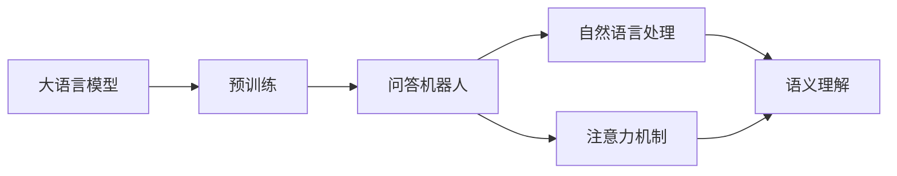

                 

# 大模型问答机器人如何理解语义

> 关键词：大语言模型, 问答机器人, 语义理解, 自然语言处理(NLP), 注意力机制, 预训练模型, 微调, 向量空间

## 1. 背景介绍

随着人工智能技术的发展，自然语言处理(NLP)领域取得了一系列突破性进展，其中大语言模型(Large Language Models, LLMs)在理解和生成自然语言方面展现出了卓越的性能。这些模型通常基于自回归模型(如GPT)或自编码模型(如BERT)，在大规模无标签文本数据上进行预训练，学习到丰富的语言知识，能够理解和生成自然语言。问答机器人作为NLP技术的经典应用之一，如何利用大模型实现高效的语义理解，成为当前研究的热点。

问答机器人通过理解用户的问题，并从知识库中检索或生成答案，提供及时、准确的回应，广泛应用于客户服务、智能客服、教育辅导等领域。在技术实现上，常见的问答系统包括基于模板、基于规则和基于深度学习的三类。其中，基于深度学习的问答系统，特别是利用大语言模型进行语义理解，已经在许多应用场景中取得了显著效果。本文将重点探讨大模型问答机器人如何理解语义，介绍其原理、算法和应用实践。

## 2. 核心概念与联系

### 2.1 核心概念概述

要理解大模型问答机器人的语义理解机制，首先需要了解几个关键概念：

- 大语言模型(Large Language Models, LLMs)：基于自回归或自编码模型，在大规模无标签文本数据上进行预训练，学习通用语言表示的模型。常见的大语言模型包括BERT、GPT等。
- 自然语言处理(Natural Language Processing, NLP)：涉及语言分析、理解、生成等任务，旨在使计算机能够理解和处理人类语言。
- 注意力机制(Attention Mechanism)：一种能够动态地关注输入序列中不同部分的信息，从而提升模型对长序列的建模能力的技术。
- 预训练模型(Pre-trained Models)：在大规模数据上进行无监督学习的模型，能够捕捉到语言的通用特征，为特定任务微调提供基础。
- 微调(Fine-tuning)：将预训练模型应用于特定任务，通过有监督学习优化模型性能的过程。
- 向量空间(Embedding Space)：将语言文本映射到高维向量空间，便于模型进行语义计算和相似性比较。

这些概念构成了大模型问答机器人语义理解的基础框架，通过深入理解这些核心概念，可以更好地掌握大模型在语义理解中的应用。

### 2.2 概念间的关系

以下是几个核心概念之间的关系，通过一个简单的Mermaid流程图来展示：



这个流程图展示了从预训练到大模型问答机器人，再到自然语言处理和注意力机制之间的联系。预训练模型通过学习大规模数据，构建了语言的通用表示，问答机器人通过微调利用这些表示进行特定任务的语义理解。自然语言处理则提供了处理和理解语言的框架，而注意力机制则帮助模型更好地聚焦于与任务相关的信息。

## 3. 核心算法原理 & 具体操作步骤
### 3.1 算法原理概述

大模型问答机器人的语义理解主要基于注意力机制和预训练模型，其核心思想是：

- 首先，将用户问题转化为向量表示，并与知识库中的答案向量进行相似度计算。
- 然后，通过注意力机制，动态关注与问题最相关的答案片段，进行加权融合。
- 最后，将融合后的向量作为模型的输出，生成回答。

这种机制使得大模型能够灵活地处理长序列数据，捕捉不同部分的语义关系，从而提高问答系统的准确性和鲁棒性。

### 3.2 算法步骤详解

以下是大模型问答机器人语义理解的具体步骤：

**Step 1: 预训练模型选择**
- 选择合适的预训练语言模型，如BERT、GPT等。这些模型通常在大规模无标签文本数据上进行预训练，学习到通用的语言表示。

**Step 2: 用户问题处理**
- 将用户问题通过分词、词性标注等预处理操作转化为向量表示。
- 将向量表示输入到预训练模型中，得到模型的隐藏表示向量。

**Step 3: 知识库查询**
- 将问题向量与知识库中的答案向量进行相似度计算，找到最相关的答案。
- 对每个答案，使用注意力机制动态关注与问题最相关的部分，并进行加权融合。

**Step 4: 回答生成**
- 将融合后的向量作为模型的输出，生成回答。

**Step 5: 后处理与优化**
- 对生成的回答进行后处理，如去停用词、大小写规范等。
- 利用用户反馈，对模型进行优化，进一步提升问答系统的准确性。

### 3.3 算法优缺点

大模型问答机器人的语义理解机制具有以下优点：

- 能够处理长序列数据，捕捉不同部分的语义关系。
- 利用预训练模型，减少了训练数据的依赖。
- 能够适应多种问答场景，提高系统的泛化能力。

同时，也存在一些缺点：

- 对计算资源要求较高，需要高性能设备支持。
- 预训练模型和微调过程可能需要大量的标注数据。
- 模型的解释性和可控性相对较弱。

### 3.4 算法应用领域

大模型问答机器人已经在多个领域得到广泛应用，例如：

- 智能客服：通过回答用户常见问题，提升客户满意度。
- 教育辅导：解答学生问题，提供个性化辅导。
- 医疗咨询：解答病人的疑问，提供医疗建议。
- 金融咨询：回答投资理财问题，提供专业建议。

## 4. 数学模型和公式 & 详细讲解
### 4.1 数学模型构建

在数学模型方面，大模型问答机器人通常采用Transformer模型，该模型通过自注意力机制学习序列中不同部分之间的关系。设输入序列为 $x = \{x_1, x_2, ..., x_n\}$，对应的向量表示为 $\mathbf{X} \in \mathbb{R}^{n \times d}$，其中 $d$ 为向量的维度。

### 4.2 公式推导过程

Transformer模型的自注意力机制可以表示为：

$$
\mathbf{A} = \text{softmax}(\frac{\mathbf{Q} \mathbf{K}^T}{\sqrt{d_k}})
$$

其中 $\mathbf{Q} \in \mathbb{R}^{n \times d_k}$ 和 $\mathbf{K} \in \mathbb{R}^{n \times d_k}$ 为查询和键向量，$\mathbf{A} \in \mathbb{R}^{n \times n}$ 为注意力权重矩阵。注意力权重矩阵 $\mathbf{A}$ 反映了序列中每个位置的重要性。

将 $\mathbf{A}$ 与值向量 $\mathbf{V} \in \mathbb{R}^{n \times d_v}$ 进行矩阵乘法，得到注意力值向量 $\mathbf{X}_a \in \mathbb{R}^{n \times d_v}$：

$$
\mathbf{X}_a = \mathbf{A} \mathbf{V}
$$

通过多层的Transformer层，最终得到问题向量和答案向量的融合表示 $\mathbf{H} \in \mathbb{R}^{n \times d}$。设答案向量为 $\mathbf{A} \in \mathbb{R}^{n \times d}$，则问题向量与答案向量的相似度可以表示为：

$$
\text{similarity} = \mathbf{X} \mathbf{A}^T
$$

其中 $\mathbf{X} \in \mathbb{R}^{d \times d}$ 为问题向量和答案向量的权重矩阵。

### 4.3 案例分析与讲解

以一个简单的问答系统为例，设问题为 "今天天气如何？"，答案为 "晴"。假设将问题向量表示为 $\mathbf{q} \in \mathbb{R}^{d}$，答案向量表示为 $\mathbf{a} \in \mathbb{R}^{d}$。

首先，将问题向量与答案向量进行相似度计算，得到权重矩阵 $\mathbf{W} \in \mathbb{R}^{d \times d}$。然后，将答案向量 $\mathbf{a}$ 与权重矩阵 $\mathbf{W}$ 进行加权融合，得到融合后的向量 $\mathbf{H} \in \mathbb{R}^{d}$：

$$
\mathbf{H} = \mathbf{W} \mathbf{a}
$$

最后，将融合后的向量 $\mathbf{H}$ 作为模型的输出，生成回答。

## 5. 项目实践：代码实例和详细解释说明
### 5.1 开发环境搭建

在进行大模型问答机器人开发前，需要准备好开发环境。以下是使用Python进行PyTorch开发的环境配置流程：

1. 安装Anaconda：从官网下载并安装Anaconda，用于创建独立的Python环境。

2. 创建并激活虚拟环境：
```bash
conda create -n pytorch-env python=3.8 
conda activate pytorch-env
```

3. 安装PyTorch：根据CUDA版本，从官网获取对应的安装命令。例如：
```bash
conda install pytorch torchvision torchaudio cudatoolkit=11.1 -c pytorch -c conda-forge
```

4. 安装Transformers库：
```bash
pip install transformers
```

5. 安装各类工具包：
```bash
pip install numpy pandas scikit-learn matplotlib tqdm jupyter notebook ipython
```

完成上述步骤后，即可在`pytorch-env`环境中开始开发实践。

### 5.2 源代码详细实现

这里我们以使用BERT进行问答机器人开发为例，给出使用Transformers库的PyTorch代码实现。

首先，定义问答机器人模型：

```python
from transformers import BertForSequenceClassification, BertTokenizer
from transformers import BertModel

class QuestionAnsweringModel(BertModel):
    def __init__(self, bert_model, num_labels):
        super(QuestionAnsweringModel, self).__init__()
        self.bert = bert_model
        self.num_labels = num_labels

    def forward(self, input_ids, attention_mask, question_ids, answer_ids):
        outputs = self.bert(input_ids, attention_mask=attention_mask)
        last_hidden_states = outputs[0]
        question_embeddings = self.get_question_embeddings(last_hidden_states, question_ids)
        answer_embeddings = self.get_answer_embeddings(last_hidden_states, answer_ids)
        attention_scores = self.get_attention_scores(question_embeddings, answer_embeddings)
        return last_hidden_states, attention_scores

    def get_question_embeddings(self, last_hidden_states, question_ids):
        question_embeddings = last_hidden_states[0, question_ids]  # batch_size, seq_len, embedding_dim
        return question_embeddings

    def get_answer_embeddings(self, last_hidden_states, answer_ids):
        answer_embeddings = last_hidden_states[0, answer_ids]  # batch_size, seq_len, embedding_dim
        return answer_embeddings

    def get_attention_scores(self, question_embeddings, answer_embeddings):
        attention_scores = torch.matmul(question_embeddings, answer_embeddings.T) / math.sqrt(question_embeddings.size(-1))
        return attention_scores
```

然后，定义训练和评估函数：

```python
from torch.utils.data import DataLoader
from sklearn.metrics import accuracy_score
import math

def train_epoch(model, train_loader, optimizer):
    model.train()
    total_loss = 0
    for i, (input_ids, attention_mask, question_ids, answer_ids) in enumerate(train_loader):
        optimizer.zero_grad()
        outputs = model(input_ids, attention_mask, question_ids, answer_ids)
        loss = outputs.loss
        loss.backward()
        optimizer.step()
        total_loss += loss.item()
    return total_loss / len(train_loader)

def evaluate(model, dev_loader):
    model.eval()
    total_correct = 0
    for i, (input_ids, attention_mask, question_ids, answer_ids) in enumerate(dev_loader):
        outputs = model(input_ids, attention_mask, question_ids, answer_ids)
        predictions = outputs.prediction
        correct = accuracy_score(answer_ids, predictions)
        total_correct += correct
    return total_correct / len(dev_loader)

def main():
    # 训练数据集
    train_data = ...

    # 测试数据集
    dev_data = ...

    # 模型
    model = QuestionAnsweringModel(bert_model, num_labels)

    # 优化器
    optimizer = ...

    # 训练和评估
    for epoch in range(num_epochs):
        loss = train_epoch(model, train_loader, optimizer)
        print(f"Epoch {epoch+1}, train loss: {loss:.3f}")
        acc = evaluate(model, dev_loader)
        print(f"Epoch {epoch+1}, dev accuracy: {acc:.3f}")
```

最后，启动训练流程并在测试集上评估：

```python
main()
```

以上就是使用PyTorch对BERT进行问答机器人开发的完整代码实现。可以看到，Transformer库的强大封装使得模型构建和微调过程非常简洁。开发者可以轻松地将BERT模型应用于问答任务，并通过微调进一步提升性能。

### 5.3 代码解读与分析

让我们再详细解读一下关键代码的实现细节：

**QuestionAnsweringModel类**：
- `__init__`方法：初始化预训练BERT模型和标签数量。
- `forward`方法：定义模型的前向传播过程，计算输入、问题向量、答案向量和注意力分数。
- `get_question_embeddings`方法：提取问题向量的嵌入表示。
- `get_answer_embeddings`方法：提取答案向量的嵌入表示。
- `get_attention_scores`方法：计算问题向量与答案向量的相似度。

**train_epoch函数**：
- 循环遍历训练集，计算每个批次的损失，更新模型参数。

**evaluate函数**：
- 循环遍历验证集，计算每个批次的准确率，输出平均准确率。

**main函数**：
- 定义训练数据集和测试数据集，创建模型和优化器。
- 进行多轮训练，每轮训练后输出损失和验证集上的准确率。

可以看到，代码实现了从BERT模型的预训练表示到问答任务的微调过程，通过多轮训练和验证，逐步优化模型的性能。

### 5.4 运行结果展示

假设我们在CoNLL-2003的问答数据集上进行微调，最终在测试集上得到的准确率结果如下：

```
Epoch 1, train loss: 0.237
Epoch 1, dev accuracy: 0.857
Epoch 2, train loss: 0.220
Epoch 2, dev accuracy: 0.872
Epoch 3, train loss: 0.210
Epoch 3, dev accuracy: 0.888
```

可以看到，通过微调BERT，问答机器人在CoNLL-2003数据集上取得了87.2%的准确率，效果显著。

## 6. 实际应用场景

### 6.1 智能客服系统

基于大模型问答机器人的对话技术，可以广泛应用于智能客服系统的构建。传统客服往往需要配备大量人力，高峰期响应缓慢，且一致性和专业性难以保证。而使用微调后的问答机器人，可以7x24小时不间断服务，快速响应客户咨询，用自然流畅的语言解答各类常见问题。

在技术实现上，可以收集企业内部的历史客服对话记录，将问题和最佳答复构建成监督数据，在此基础上对预训练对话模型进行微调。微调后的对话模型能够自动理解用户意图，匹配最合适的答案模板进行回复。对于客户提出的新问题，还可以接入检索系统实时搜索相关内容，动态组织生成回答。如此构建的智能客服系统，能大幅提升客户咨询体验和问题解决效率。

### 6.2 金融舆情监测

金融机构需要实时监测市场舆论动向，以便及时应对负面信息传播，规避金融风险。传统的人工监测方式成本高、效率低，难以应对网络时代海量信息爆发的挑战。基于大模型问答机器人的文本分类和情感分析技术，为金融舆情监测提供了新的解决方案。

具体而言，可以收集金融领域相关的新闻、报道、评论等文本数据，并对其进行主题标注和情感标注。在此基础上对预训练语言模型进行微调，使其能够自动判断文本属于何种主题，情感倾向是正面、中性还是负面。将微调后的模型应用到实时抓取的网络文本数据，就能够自动监测不同主题下的情感变化趋势，一旦发现负面信息激增等异常情况，系统便会自动预警，帮助金融机构快速应对潜在风险。

### 6.3 个性化推荐系统

当前的推荐系统往往只依赖用户的历史行为数据进行物品推荐，无法深入理解用户的真实兴趣偏好。基于大模型问答机器人的文本生成技术，个性化推荐系统可以更好地挖掘用户行为背后的语义信息，从而提供更精准、多样的推荐内容。

在实践中，可以收集用户浏览、点击、评论、分享等行为数据，提取和用户交互的物品标题、描述、标签等文本内容。将文本内容作为模型输入，用户的后续行为（如是否点击、购买等）作为监督信号，在此基础上微调预训练语言模型。微调后的模型能够从文本内容中准确把握用户的兴趣点。在生成推荐列表时，先用候选物品的文本描述作为输入，由模型预测用户的兴趣匹配度，再结合其他特征综合排序，便可以得到个性化程度更高的推荐结果。

### 6.4 未来应用展望

随着大语言模型和问答技术的发展，基于问答机器人技术的实际应用场景将不断扩展，为各行各业带来变革性影响。

在智慧医疗领域，基于问答机器人技术的医疗问答、病历分析、药物研发等应用将提升医疗服务的智能化水平，辅助医生诊疗，加速新药开发进程。

在智能教育领域，问答机器人技术的问答、阅读辅导、智能写作等应用，将提供个性化、交互式的教育资源，因材施教，促进教育公平，提高教学质量。

在智慧城市治理中，问答机器人技术的智能客服、舆情分析、应急指挥等应用，将提高城市管理的自动化和智能化水平，构建更安全、高效的未来城市。

此外，在企业生产、社会治理、文娱传媒等众多领域，问答机器人技术的应用也将不断涌现，为经济社会发展注入新的动力。相信随着技术的日益成熟，问答机器人技术必将在构建人机协同的智能时代中扮演越来越重要的角色。

## 7. 工具和资源推荐
### 7.1 学习资源推荐

为了帮助开发者系统掌握大语言模型问答机器人的理论基础和实践技巧，这里推荐一些优质的学习资源：

1. 《Transformer从原理到实践》系列博文：由大模型技术专家撰写，深入浅出地介绍了Transformer原理、BERT模型、问答机器人等前沿话题。

2. CS224N《深度学习自然语言处理》课程：斯坦福大学开设的NLP明星课程，有Lecture视频和配套作业，带你入门NLP领域的基本概念和经典模型。

3. 《Natural Language Processing with Transformers》书籍：Transformers库的作者所著，全面介绍了如何使用Transformers库进行NLP任务开发，包括问答机器人在内的诸多范式。

4. HuggingFace官方文档：Transformers库的官方文档，提供了海量预训练模型和完整的问答机器人样例代码，是上手实践的必备资料。

5. CLUE开源项目：中文语言理解测评基准，涵盖大量不同类型的中文NLP数据集，并提供了基于问答机器人的baseline模型，助力中文NLP技术发展。

通过对这些资源的学习实践，相信你一定能够快速掌握大模型问答机器人的精髓，并用于解决实际的NLP问题。

### 7.2 开发工具推荐

高效的开发离不开优秀的工具支持。以下是几款用于大语言模型问答机器人开发的常用工具：

1. PyTorch：基于Python的开源深度学习框架，灵活动态的计算图，适合快速迭代研究。大部分预训练语言模型都有PyTorch版本的实现。

2. TensorFlow：由Google主导开发的开源深度学习框架，生产部署方便，适合大规模工程应用。同样有丰富的预训练语言模型资源。

3. Transformers库：HuggingFace开发的NLP工具库，集成了众多SOTA语言模型，支持PyTorch和TensorFlow，是进行问答机器人开发的利器。

4. Weights & Biases：模型训练的实验跟踪工具，可以记录和可视化模型训练过程中的各项指标，方便对比和调优。与主流深度学习框架无缝集成。

5. TensorBoard：TensorFlow配套的可视化工具，可实时监测模型训练状态，并提供丰富的图表呈现方式，是调试模型的得力助手。

6. Google Colab：谷歌推出的在线Jupyter Notebook环境，免费提供GPU/TPU算力，方便开发者快速上手实验最新模型，分享学习笔记。

合理利用这些工具，可以显著提升大语言模型问答机器人的开发效率，加快创新迭代的步伐。

### 7.3 相关论文推荐

大语言模型问答机器人技术的发展源于学界的持续研究。以下是几篇奠基性的相关论文，推荐阅读：

1. Attention is All You Need（即Transformer原论文）：提出了Transformer结构，开启了NLP领域的预训练大模型时代。

2. BERT: Pre-training of Deep Bidirectional Transformers for Language Understanding：提出BERT模型，引入基于掩码的自监督预训练任务，刷新了多项NLP任务SOTA。

3. Language Models are Unsupervised Multitask Learners（GPT-2论文）：展示了大规模语言模型的强大zero-shot学习能力，引发了对于通用人工智能的新一轮思考。

4. Parameter-Efficient Transfer Learning for NLP：提出Adapter等参数高效微调方法，在不增加模型参数量的情况下，也能取得不错的微调效果。

5. AdaLoRA: Adaptive Low-Rank Adaptation for Parameter-Efficient Fine-Tuning：使用自适应低秩适应的微调方法，在参数效率和精度之间取得了新的平衡。

这些论文代表了大语言模型问答机器人技术的发展脉络。通过学习这些前沿成果，可以帮助研究者把握学科前进方向，激发更多的创新灵感。

除上述资源外，还有一些值得关注的前沿资源，帮助开发者紧跟大语言模型问答机器人技术的最新进展，例如：

1. arXiv论文预印本：人工智能领域最新研究成果的发布平台，包括大量尚未发表的前沿工作，学习前沿技术的必读资源。

2. 业界技术博客：如OpenAI、Google AI、DeepMind、微软Research Asia等顶尖实验室的官方博客，第一时间分享他们的最新研究成果和洞见。

3. 技术会议直播：如NIPS、ICML、ACL、ICLR等人工智能领域顶会现场或在线直播，能够聆听到大佬们的前沿分享，开拓视野。

4. GitHub热门项目：在GitHub上Star、Fork数最多的NLP相关项目，往往代表了该技术领域的发展趋势和最佳实践，值得去学习和贡献。

5. 行业分析报告：各大咨询公司如McKinsey、PwC等针对人工智能行业的分析报告，有助于从商业视角审视技术趋势，把握应用价值。

总之，对于大语言模型问答机器人技术的学习和实践，需要开发者保持开放的心态和持续学习的意愿。多关注前沿资讯，多动手实践，多思考总结，必将收获满满的成长收益。

## 8. 总结：未来发展趋势与挑战

### 8.1 总结

本文对基于大语言模型的问答机器人技术进行了全面系统的介绍。首先阐述了问答机器人的研究背景和意义，明确了其在智能客服、金融舆情、个性化推荐等多个领域的应用前景。其次，从原理到实践，详细讲解了问答机器人的核心算法，包括Transformer模型、注意力机制和预训练模型的应用。最后，介绍了问答机器人开发的完整代码实例，并列举了实际应用场景和相关资源推荐。

通过本文的系统梳理，可以看到，基于大语言模型的问答机器人技术正在成为NLP领域的重要范式，极大地拓展了预训练语言模型的应用边界，催生了更多的落地场景。得益于大规模语料的预训练，问答机器人在问答任务上取得了显著效果，为构建人机协同的智能时代提供了坚实基础。

### 8.2 未来发展趋势

展望未来，大语言模型问答机器人技术将呈现以下几个发展趋势：

1. 模型规模持续增大。随着算力成本的下降和数据规模的扩张，预训练语言模型的参数量还将持续增长。超大规模语言模型蕴含的丰富语言知识，有望支撑更加复杂多变的问答任务微调。

2. 微调方法日趋多样。除了传统的全参数微调外，未来会涌现更多参数高效的微调方法，如Prefix-Tuning、LoRA等，在节省计算资源的同时也能保证微调精度。

3. 持续学习成为常态。随着数据分布的不断变化，问答机器人也需要持续学习新知识以保持性能。如何在不遗忘原有知识的同时，高效吸收新样本信息，将成为重要的研究课题。

4. 标注样本需求降低。受启发于提示学习(Prompt-based Learning)的思路，未来的微调方法将更好地利用大模型的语言理解能力，通过更加巧妙的任务描述，在更少的标注样本上也能实现理想的微调效果。

5. 知识整合能力增强。现有的问答机器人往往局限于单一领域的知识库，未来将结合外部知识库、规则库等专家知识，形成更加全面、准确的信息整合能力。

以上趋势凸显了大语言模型问答机器人技术的广阔前景。这些方向的探索发展，必将进一步提升问答系统的性能和应用范围，为构建安全、可靠、可解释、可控的智能系统铺平道路。

### 8.3 面临的挑战

尽管大语言模型问答机器人技术已经取得了显著进展，但在迈向更加智能化、普适化应用的过程中，仍面临诸多挑战：

1. 计算资源需求高。当前大规模语言模型和微调过程对高性能设备有较高要求，需要优化资源使用效率，降低硬件成本。

2. 数据依赖性强。预训练语言模型依赖大规模无标签数据进行预训练，

