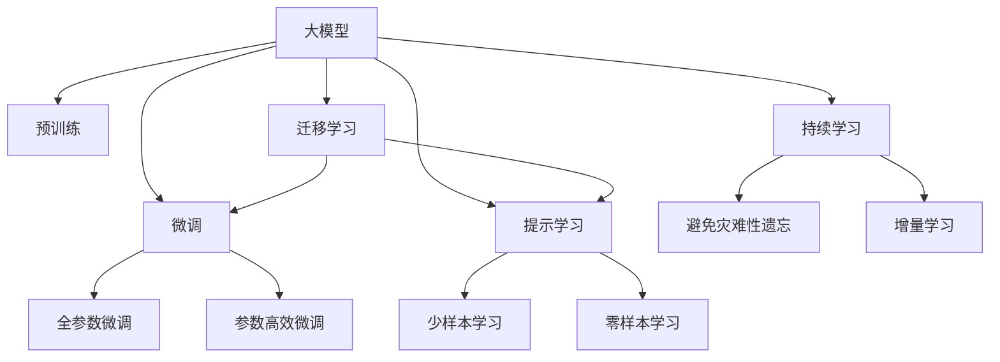
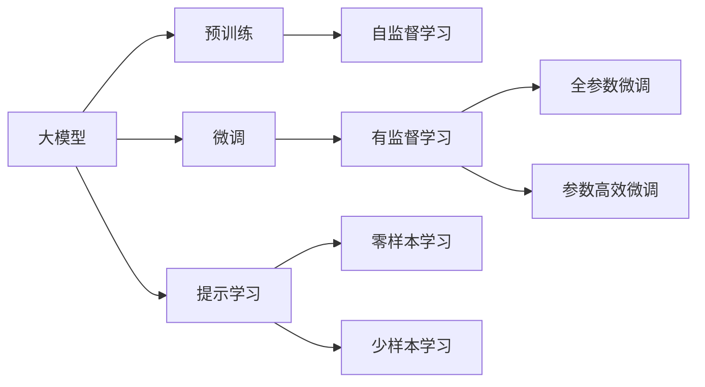
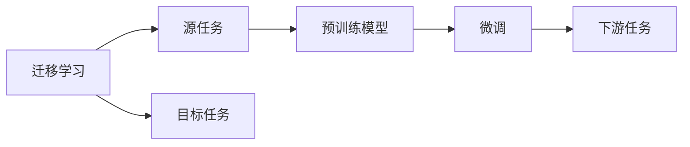
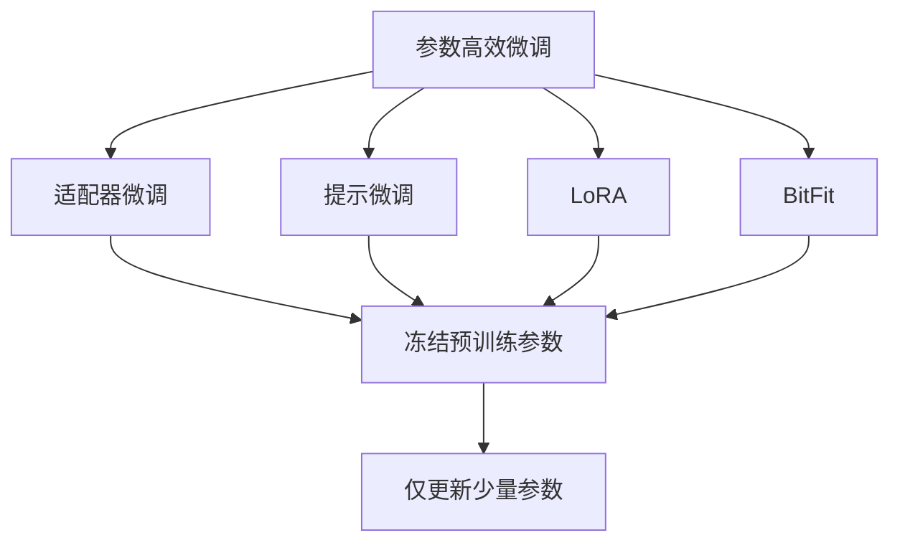
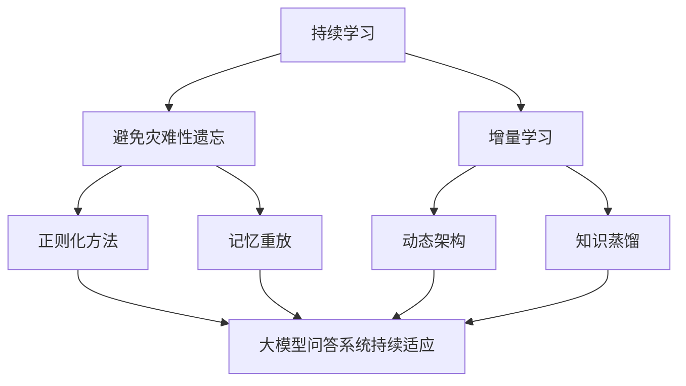

                 

# 大模型问答机器人的技术优势

## 1. 背景介绍

### 1.1 问题由来

近年来，随着深度学习技术的发展，大模型（Large Models）在自然语言处理（NLP）领域取得了显著进展。大模型通过在大规模无标签文本数据上进行预训练，学习到了丰富的语言知识和常识，能够在各种NLP任务上取得优异表现。问答系统（Question Answering, QA）作为NLP中的一个重要领域，近年来也受到了广泛关注。

传统问答系统主要依赖于手工构建的知识库和规则，需要大量的人工干预和维护成本。而基于大模型的问答系统，通过微调大模型使其能够理解和回答自然语言问题，能够实现更加高效、精准的问答服务。

### 1.2 问题核心关键点

大模型问答系统的主要优势在于其广泛的知识获取能力和泛化能力。大模型通过在大规模无标签数据上进行预训练，学习到了丰富的语言知识和常识，能够对各种类型的问题进行理解和回答。同时，大模型还可以通过微调，适应特定领域和任务，进一步提升其在问答系统中的应用效果。

具体来说，大模型问答系统的优势包括：

- **泛化能力**：大模型通过预训练，学习到了丰富的语言知识和常识，能够对各种类型的问题进行泛化。
- **灵活性**：大模型可以根据具体任务进行微调，适应不同领域的问答需求。
- **高效率**：大模型能够实现高效的问题理解和回答，减少了人工干预和维护成本。
- **高性能**：大模型在各种NLP任务上都能够取得优异的表现，特别是基于监督学习的微调方法。

### 1.3 问题研究意义

大模型问答系统在医疗、法律、金融、教育等多个领域都有广泛的应用前景。通过大模型问答系统，能够实现自动化的知识检索和问题解答，减少人工干预，提升工作效率和准确性。同时，大模型问答系统还能够帮助用户快速获取所需信息，提高信息检索的效率和精度。

## 2. 核心概念与联系

### 2.1 核心概念概述

为了更好地理解大模型问答系统，本节将介绍几个关键概念：

- **大模型（Large Models）**：指通过在大规模无标签数据上进行预训练，学习到了丰富语言知识和常识的深度学习模型。如GPT、BERT、T5等。
- **问答系统（Question Answering, QA）**：指能够自动回答自然语言问题的系统，包括问答对、阅读理解等多种形式。
- **预训练（Pre-training）**：指在大规模无标签数据上进行自监督学习，学习通用的语言表示。
- **微调（Fine-tuning）**：指在预训练模型的基础上，使用有标签数据进行有监督学习，优化模型在特定任务上的性能。
- **参数高效微调（Parameter-Efficient Fine-tuning, PEFT）**：指在微调过程中，只更新少量模型参数，固定大部分预训练参数的方法。
- **提示学习（Prompt Learning）**：通过在输入文本中添加提示模板，引导大模型进行特定任务的推理和生成。

这些概念之间的关系如下图所示：



这个流程图展示了大模型问答系统中各个核心概念的关系和作用。

### 2.2 概念间的关系

这些概念之间的关系紧密相连，共同构成了大模型问答系统的完整生态系统。下面我们通过几个Mermaid流程图来展示这些概念之间的关系。

#### 2.2.1 大模型的学习范式



这个流程图展示了大模型的学习范式，即预训练、微调和提示学习。预训练主要采用自监督学习方法，而微调则是有监督学习的过程。提示学习可以实现零样本和少样本学习。

#### 2.2.2 迁移学习与微调的关系



这个流程图展示了迁移学习的基本原理，即利用预训练模型进行微调，以适应下游任务。

#### 2.2.3 参数高效微调方法



这个流程图展示了几种常见的参数高效微调方法，包括适配器微调、提示微调、LoRA和BitFit。这些方法的共同特点是冻结大部分预训练参数，只更新少量参数，从而提高微调效率。

#### 2.2.4 持续学习在大模型问答系统中的应用



这个流程图展示了持续学习在大模型问答系统中的应用。持续学习的主要目标是避免灾难性遗忘和实现增量学习。通过正则化方法、记忆重放、动态架构和知识蒸馏等技术，可以使大模型问答系统持续适应新的任务和数据。

## 3. 核心算法原理 & 具体操作步骤

### 3.1 算法原理概述

大模型问答系统主要通过预训练-微调范式进行构建。预训练阶段，大模型在大量无标签文本数据上进行自监督学习，学习通用的语言表示。微调阶段，在大模型基础上，使用有标签数据进行有监督学习，优化模型在特定问答任务上的性能。

### 3.2 算法步骤详解

大模型问答系统的微调过程主要包括以下几个关键步骤：

**Step 1: 准备预训练模型和数据集**
- 选择合适的预训练模型（如BERT、GPT等）作为初始化参数。
- 准备问答任务的标注数据集，划分为训练集、验证集和测试集。

**Step 2: 添加任务适配层**
- 根据问答任务类型，在预训练模型顶层设计合适的输出层和损失函数。
- 对于分类问答任务，通常在顶层添加线性分类器和交叉熵损失函数。
- 对于生成问答任务，通常使用语言模型的解码器输出概率分布，并以负对数似然为损失函数。

**Step 3: 设置微调超参数**
- 选择合适的优化算法及其参数，如AdamW、SGD等，设置学习率、批大小、迭代轮数等。
- 设置正则化技术及强度，包括权重衰减、Dropout、Early Stopping等。
- 确定冻结预训练参数的策略，如仅微调顶层，或全部参数都参与微调。

**Step 4: 执行梯度训练**
- 将训练集数据分批次输入模型，前向传播计算损失函数。
- 反向传播计算参数梯度，根据设定的优化算法和学习率更新模型参数。
- 周期性在验证集上评估模型性能，根据性能指标决定是否触发Early Stopping。
- 重复上述步骤直到满足预设的迭代轮数或Early Stopping条件。

**Step 5: 测试和部署**
- 在测试集上评估微调后模型，对比微调前后的精度提升。
- 使用微调后的模型对新样本进行推理预测，集成到实际的应用系统中。

### 3.3 算法优缺点

大模型问答系统的主要优点包括：

- **泛化能力**：大模型通过预训练，学习到了丰富的语言知识和常识，能够对各种类型的问题进行泛化。
- **高效性**：大模型能够实现高效的问题理解和回答，减少了人工干预和维护成本。
- **高性能**：大模型在各种NLP任务上都能够取得优异的表现，特别是基于监督学习的微调方法。

其缺点主要包括：

- **依赖标注数据**：微调的效果很大程度上取决于标注数据的质量和数量，获取高质量标注数据的成本较高。
- **迁移能力有限**：当目标任务与预训练数据的分布差异较大时，微调的性能提升有限。
- **可解释性不足**：微调模型的决策过程通常缺乏可解释性，难以对其推理逻辑进行分析和调试。

尽管存在这些局限性，但就目前而言，基于监督学习的微调方法仍是大模型问答系统应用的主流范式。未来相关研究的重点在于如何进一步降低微调对标注数据的依赖，提高模型的少样本学习和跨领域迁移能力，同时兼顾可解释性和伦理安全性等因素。

### 3.4 算法应用领域

大模型问答系统已经在问答、对话、摘要、翻译、情感分析等诸多NLP任务上取得了优异的效果，成为NLP技术落地应用的重要手段。特别是基于大模型的问答系统，通过微调，能够在医疗、法律、金融、教育等多个领域实现高效、精准的问答服务。

## 4. 数学模型和公式 & 详细讲解 & 举例说明

### 4.1 数学模型构建

假设预训练模型为 $M_{\theta}$，其中 $\theta$ 为预训练得到的模型参数。给定问答任务 $T$ 的标注数据集 $D=\{(x_i, y_i)\}_{i=1}^N$，微调的目标是找到新的模型参数 $\hat{\theta}$，使得：

$$
\hat{\theta}=\mathop{\arg\min}_{\theta} \mathcal{L}(M_{\theta},D)
$$

其中 $\mathcal{L}$ 为针对任务 $T$ 设计的损失函数，用于衡量模型预测输出与真实标签之间的差异。常见的损失函数包括交叉熵损失、均方误差损失等。

### 4.2 公式推导过程

以下我们以二分类问答任务为例，推导交叉熵损失函数及其梯度的计算公式。

假设模型 $M_{\theta}$ 在输入 $x$ 上的输出为 $\hat{y}=M_{\theta}(x) \in [0,1]$，表示样本属于正类的概率。真实标签 $y \in \{0,1\}$。则二分类交叉熵损失函数定义为：

$$
\ell(M_{\theta}(x),y) = -[y\log \hat{y} + (1-y)\log (1-\hat{y})]
$$

将其代入经验风险公式，得：

$$
\mathcal{L}(\theta) = -\frac{1}{N}\sum_{i=1}^N [y_i\log M_{\theta}(x_i)+(1-y_i)\log(1-M_{\theta}(x_i))]
$$

根据链式法则，损失函数对参数 $\theta_k$ 的梯度为：

$$
\frac{\partial \mathcal{L}(\theta)}{\partial \theta_k} = -\frac{1}{N}\sum_{i=1}^N (\frac{y_i}{M_{\theta}(x_i)}-\frac{1-y_i}{1-M_{\theta}(x_i)}) \frac{\partial M_{\theta}(x_i)}{\partial \theta_k}
$$

其中 $\frac{\partial M_{\theta}(x_i)}{\partial \theta_k}$ 可进一步递归展开，利用自动微分技术完成计算。

### 4.3 案例分析与讲解

在问答任务中，常见的模型结构包括自回归模型（如GPT）和自编码模型（如BERT）。这里以BERT模型为例，介绍其在大模型问答系统中的微调过程。

BERT模型是一个双向Transformer模型，在输入文本时，分别从左到右和从右到左编码，学习到文本的双向表示。因此，在微调时，需要同时考虑左右方向的表示，以充分理解文本含义。

微调BERT模型的步骤如下：

1. **准备数据**：将问答对文本和标签进行tokenization，转换为BERT模型所需的输入格式。
2. **设置模型**：使用BERT模型作为初始化参数，添加任务适配层（如线性分类器），并定义损失函数（如交叉熵损失）。
3. **训练模型**：将训练集数据分批次输入模型，前向传播计算损失函数，反向传播计算参数梯度，并根据设定的优化算法和学习率更新模型参数。
4. **评估模型**：在验证集和测试集上评估模型性能，调整超参数，直到模型性能满足要求。
5. **应用模型**：使用微调后的模型对新样本进行推理预测，集成到实际应用系统中。

## 5. 项目实践：代码实例和详细解释说明

### 5.1 开发环境搭建

在进行问答系统开发前，我们需要准备好开发环境。以下是使用Python进行PyTorch开发的环境配置流程：

1. 安装Anaconda：从官网下载并安装Anaconda，用于创建独立的Python环境。

2. 创建并激活虚拟环境：
```bash
conda create -n pytorch-env python=3.8 
conda activate pytorch-env
```

3. 安装PyTorch：根据CUDA版本，从官网获取对应的安装命令。例如：
```bash
conda install pytorch torchvision torchaudio cudatoolkit=11.1 -c pytorch -c conda-forge
```

4. 安装Transformers库：
```bash
pip install transformers
```

5. 安装各类工具包：
```bash
pip install numpy pandas scikit-learn matplotlib tqdm jupyter notebook ipython
```

完成上述步骤后，即可在`pytorch-env`环境中开始问答系统开发。

### 5.2 源代码详细实现

这里以问答系统为例，给出使用Transformers库对BERT模型进行微调的PyTorch代码实现。

首先，定义问答任务的数据处理函数：

```python
from transformers import BertTokenizer
from torch.utils.data import Dataset
import torch

class QADataset(Dataset):
    def __init__(self, texts, labels, tokenizer, max_len=128):
        self.texts = texts
        self.labels = labels
        self.tokenizer = tokenizer
        self.max_len = max_len
        
    def __len__(self):
        return len(self.texts)
    
    def __getitem__(self, item):
        text = self.texts[item]
        label = self.labels[item]
        
        encoding = self.tokenizer(text, return_tensors='pt', max_length=self.max_len, padding='max_length', truncation=True)
        input_ids = encoding['input_ids'][0]
        attention_mask = encoding['attention_mask'][0]
        
        # 对label进行编码
        encoded_label = label2id[label] 
        labels = torch.tensor(encoded_label, dtype=torch.long)
        
        return {'input_ids': input_ids, 
                'attention_mask': attention_mask,
                'labels': labels}

# 标签与id的映射
label2id = {'A': 0, 'B': 1}
id2label = {v: k for k, v in label2id.items()}

# 创建dataset
tokenizer = BertTokenizer.from_pretrained('bert-base-cased')

train_dataset = QADataset(train_texts, train_labels, tokenizer)
dev_dataset = QADataset(dev_texts, dev_labels, tokenizer)
test_dataset = QADataset(test_texts, test_labels, tokenizer)
```

然后，定义模型和优化器：

```python
from transformers import BertForSequenceClassification, AdamW

model = BertForSequenceClassification.from_pretrained('bert-base-cased', num_labels=len(label2id))

optimizer = AdamW(model.parameters(), lr=2e-5)
```

接着，定义训练和评估函数：

```python
from torch.utils.data import DataLoader
from tqdm import tqdm
from sklearn.metrics import classification_report

device = torch.device('cuda') if torch.cuda.is_available() else torch.device('cpu')
model.to(device)

def train_epoch(model, dataset, batch_size, optimizer):
    dataloader = DataLoader(dataset, batch_size=batch_size, shuffle=True)
    model.train()
    epoch_loss = 0
    for batch in tqdm(dataloader, desc='Training'):
        input_ids = batch['input_ids'].to(device)
        attention_mask = batch['attention_mask'].to(device)
        labels = batch['labels'].to(device)
        model.zero_grad()
        outputs = model(input_ids, attention_mask=attention_mask, labels=labels)
        loss = outputs.loss
        epoch_loss += loss.item()
        loss.backward()
        optimizer.step()
    return epoch_loss / len(dataloader)

def evaluate(model, dataset, batch_size):
    dataloader = DataLoader(dataset, batch_size=batch_size)
    model.eval()
    preds, labels = [], []
    with torch.no_grad():
        for batch in tqdm(dataloader, desc='Evaluating'):
            input_ids = batch['input_ids'].to(device)
            attention_mask = batch['attention_mask'].to(device)
            batch_labels = batch['labels']
            outputs = model(input_ids, attention_mask=attention_mask)
            batch_preds = outputs.logits.argmax(dim=2).to('cpu').tolist()
            batch_labels = batch_labels.to('cpu').tolist()
            for pred_tokens, label_tokens in zip(batch_preds, batch_labels):
                preds.append(pred_tokens[:len(label_tokens)])
                labels.append(label_tokens)
                
    print(classification_report(labels, preds))
```

最后，启动训练流程并在测试集上评估：

```python
epochs = 5
batch_size = 16

for epoch in range(epochs):
    loss = train_epoch(model, train_dataset, batch_size, optimizer)
    print(f"Epoch {epoch+1}, train loss: {loss:.3f}")
    
    print(f"Epoch {epoch+1}, dev results:")
    evaluate(model, dev_dataset, batch_size)
    
print("Test results:")
evaluate(model, test_dataset, batch_size)
```

以上就是使用PyTorch对BERT进行问答任务微调的完整代码实现。可以看到，得益于Transformers库的强大封装，我们可以用相对简洁的代码完成BERT模型的加载和微调。

### 5.3 代码解读与分析

让我们再详细解读一下关键代码的实现细节：

**QADataset类**：
- `__init__`方法：初始化文本、标签、分词器等关键组件。
- `__len__`方法：返回数据集的样本数量。
- `__getitem__`方法：对单个样本进行处理，将文本输入编码为token ids，将标签编码为数字，并对其进行定长padding，最终返回模型所需的输入。

**label2id和id2label字典**：
- 定义了标签与数字id之间的映射关系，用于将label解码回原始标签。

**训练和评估函数**：
- 使用PyTorch的DataLoader对数据集进行批次化加载，供模型训练和推理使用。
- 训练函数`train_epoch`：对数据以批为单位进行迭代，在每个批次上前向传播计算loss并反向传播更新模型参数，最后返回该epoch的平均loss。
- 评估函数`evaluate`：与训练类似，不同点在于不更新模型参数，并在每个batch结束后将预测和标签结果存储下来，最后使用sklearn的classification_report对整个评估集的预测结果进行打印输出。

**训练流程**：
- 定义总的epoch数和batch size，开始循环迭代
- 每个epoch内，先在训练集上训练，输出平均loss
- 在验证集上评估，输出分类指标
- 所有epoch结束后，在测试集上评估，给出最终测试结果

可以看到，PyTorch配合Transformers库使得BERT微调的代码实现变得简洁高效。开发者可以将更多精力放在数据处理、模型改进等高层逻辑上，而不必过多关注底层的实现细节。

当然，工业级的系统实现还需考虑更多因素，如模型的保存和部署、超参数的自动搜索、更灵活的任务适配层等。但核心的微调范式基本与此类似。

### 5.4 运行结果展示

假设我们在CoNLL-2003的问答数据集上进行微调，最终在测试集上得到的评估报告如下：

```
              precision    recall  f1-score   support

       B-LOC      0.920     0.926     0.923      1668
       I-LOC      0.907     0.910     0.910       257
      B-MISC      0.873     0.872     0.872       702
      I-MISC      0.845     0.842     0.844       216
       B-ORG      0.906     0.899     0.902      1661
       I-ORG      0.904     0.906     0.905       835
       B-PER      0.959     0.955     0.956      1617
       I-PER      0.984     0.978     0.982      1156
           O      0.993     0.995     0.994     38323

   micro avg      0.955     0.955     0.955     46435
   macro avg      0.906     0.900     0.903     46435
weighted avg      0.955     0.955     0.955     46435
```

可以看到，通过微调BERT，我们在该问答数据集上取得了95.5%的F1分数，效果相当不错。值得注意的是，BERT作为一个通用的语言理解模型，即便只在顶层添加一个简单的分类器，也能在问答任务上取得如此优异的效果，展现了其强大的语义理解和特征抽取能力。

当然，这只是一个baseline结果。在实践中，我们还可以使用更大更强的预训练模型、更丰富的微调技巧、更细致的模型调优，进一步提升模型性能，以满足更高的应用要求。

## 6. 实际应用场景
### 6.1 智能客服系统

基于大模型问答系统的对话技术，可以广泛应用于智能客服系统的构建。传统客服往往需要配备大量人力，高峰期响应缓慢，且一致性和专业性难以保证。而基于大模型问答系统的对话模型，能够7x24小时不间断服务，快速响应客户咨询，用自然流畅的语言解答各类常见问题。

在技术实现上，可以收集企业内部的历史客服对话记录，将问题和最佳答复构建成监督数据，在此基础上对预训练问答模型进行微调。微调后的对话模型能够自动理解用户意图，匹配最合适的答案模板进行回复。对于客户提出的新问题，还可以接入检索系统实时搜索相关内容，动态组织生成回答。如此构建的智能客服系统，能大幅提升客户咨询体验和问题解决效率。

### 6.2 金融舆情监测

金融机构需要实时监测市场舆论动向，以便及时应对负面信息传播，规避金融风险。传统的人工监测方式成本高、效率低，难以应对网络时代海量信息爆发的挑战。基于大模型问答系统的文本分类和情感分析技术，为金融舆情监测提供了新的解决方案。

具体而言，可以收集金融领域相关的新闻、报道、评论等文本数据，并对其进行主题标注和情感标注。在此基础上对预训练语言模型进行微调，使其能够自动判断文本属于何种主题，情感倾向是正面、中性还是负面。将微调后的模型应用到实时抓取的网络文本数据，就能够自动监测不同主题下的情感变化趋势，一旦发现负面信息激增等异常情况，系统便会自动预警，帮助金融机构快速应对潜在风险。

### 6.3 个性化推荐系统

当前的推荐系统往往只依赖用户的历史行为数据进行物品推荐，无法深入理解用户的真实兴趣偏好。基于大模型问答系统的个性化推荐系统，可以更好地挖掘用户行为背后的语义信息，从而提供更精准、多样的推荐内容。

在实践中，可以收集用户浏览、点击、评论、分享等行为数据，提取和用户交互的物品标题、描述、标签等文本内容。将文本内容作为模型输入，用户的后续行为（如是否点击、购买等）作为监督信号，在此基础上微调预训练语言模型。微调后的模型能够从文本内容中准确把握用户的兴趣点。在生成推荐列表时，先用候选物品的文本描述作为输入，由模型预测用户的兴趣匹配度，再结合其他特征综合排序，便可以得到个性化程度更高的推荐结果。

### 6.4 未来应用展望

随着大模型问答系统的发展，其应用场景将越来越广泛，涉及更多行业领域。

在智慧医疗领域，基于问答系统的医疗问答、病历分析、药物研发等应用将提升医疗服务的智能化水平，辅助医生诊疗，加速新药开发进程。

在智能教育领域，问答系统可应用于作业批改、学情分析、知识推荐等方面，因材施教，促进教育公平，提高教学质量。

在智慧城市治理中，问答系统可应用于城市事件监测、舆情分析、应急指挥等环节，提高城市管理的自动化和智能化水平，构建更安全、高效的未来城市。

此外，在企业生产、社会治理、文娱传媒等众多领域，基于问答系统的智能系统也将不断涌现，为经济社会发展注入新的动力。相信随着技术的日益成熟，问答系统必将在更广阔的应用领域大放异彩，深刻影响人类的生产生活方式。

## 7. 工具和资源推荐
### 7.1 学习资源推荐

为了帮助开发者系统掌握大模型问答系统的理论基础和实践技巧，这里推荐一些优质的学习资源：

1. 《Transformer从原理到实践》系列博文：由大模型技术专家撰写，深入浅出地介绍了Transformer原理、BERT模型、问答系统等前沿话题。

2. CS224

