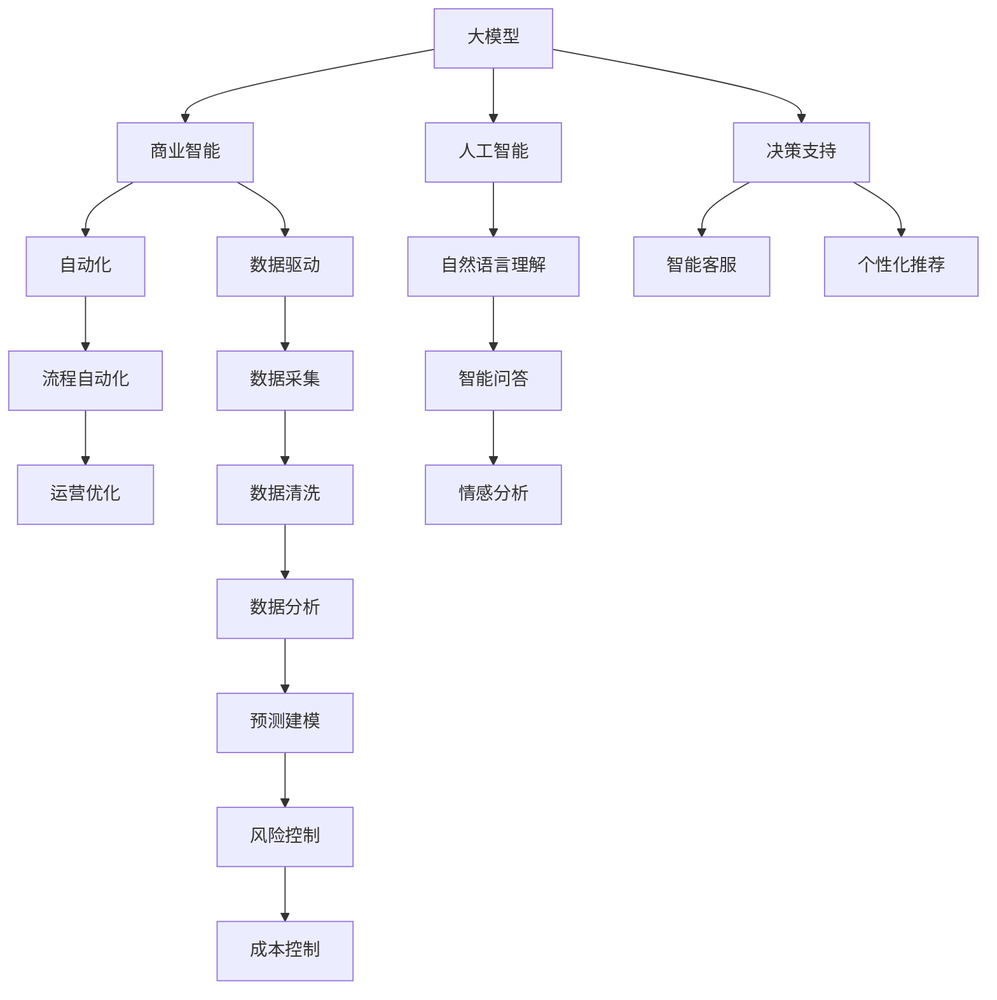
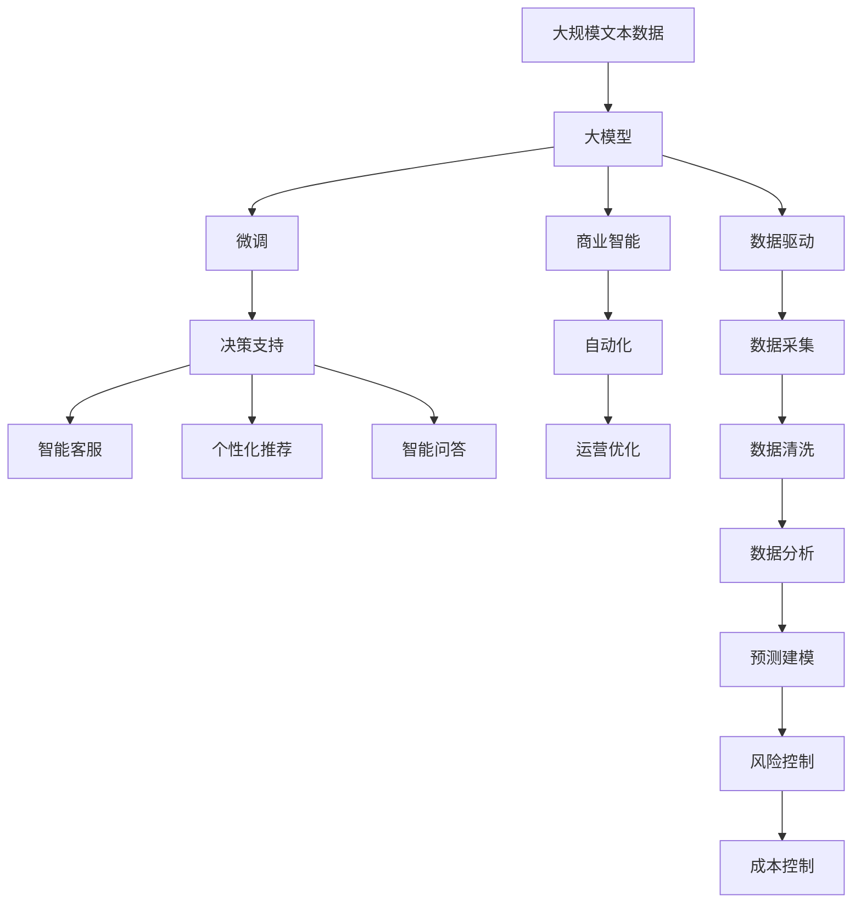

                 

# 大模型：智能时代的商业新模式

> 关键词：大模型, 商业化, 人工智能, 商业智能, 自动化, 数据驱动

## 1. 背景介绍

### 1.1 问题由来
近年来，人工智能技术迅猛发展，特别是在大数据、深度学习和自然语言处理(NLP)等领域的突破，引发了人们对智能时代商业模式转型的广泛讨论。传统的工业生产方式、消费模式、教育模式等，正逐步被更加智能化、自动化、数据驱动的新模式所替代。在这一背景下，大模型（Large Model）作为新一代的智能引擎，成为企业数字化转型的关键驱动力。

### 1.2 问题核心关键点
大模型是基于深度学习技术构建的，能够处理海量数据并从中提取高级语义信息的先进算法模型。它们通常拥有数十亿个参数，甚至达到百亿规模，可以应用于各种复杂的NLP任务，如自然语言理解、生成、问答等。

大模型的核心优势在于其强大的泛化能力和迁移学习能力，能够在多个场景下进行高效微调，从而快速适应不同任务和数据集。这一特性使得大模型在企业中得到了广泛应用，例如在金融风控、医疗诊断、市场营销、客户服务等领域，帮助企业提升决策效率，优化资源配置，提升用户满意度。

### 1.3 问题研究意义
研究大模型的商业化应用，对企业智能化转型、提升竞争力具有重要意义：

1. **提升决策效率**：通过大模型自动化处理大量数据，企业可以快速生成决策建议，提高决策的速度和准确性。
2. **优化资源配置**：大模型能够预测市场趋势、消费者行为等，帮助企业更好地规划资源，减少浪费。
3. **增强用户体验**：智能客服、个性化推荐系统等应用，使企业能够提供更加贴心、精准的服务，提升用户满意度和忠诚度。
4. **降低运营成本**：自动化、智能化的流程减少了人力成本，提高了运营效率。
5. **加速创新迭代**：大模型提供了强大的智能能力，促进了企业产品和服务的持续创新，保持市场领先。

总之，大模型不仅改变了企业的运营模式，还重塑了商业竞争格局，成为现代企业的核心竞争力之一。

## 2. 核心概念与联系

### 2.1 核心概念概述

为更好地理解大模型在商业化中的应用，本节将介绍几个关键概念：

- **大模型**：基于深度学习技术构建的大规模语言模型，如BERT、GPT等，能够处理自然语言中的复杂关系和语义。
- **商业智能**：利用数据分析、预测建模等技术，帮助企业做出更科学的决策，优化业务流程，提升运营效率。
- **人工智能**：通过模拟人类的智能行为，使计算机具备学习、推理、感知、决策等能力。
- **自动化**：通过技术手段替代人工操作，提高工作效率，减少人为错误。
- **数据驱动**：在决策和运营中依赖数据进行分析，使企业运营更加科学和精准。

这些概念之间存在着紧密的联系，构成了一个完整的智能商业生态系统。

### 2.2 概念间的关系

这些核心概念之间的逻辑关系可以通过以下Mermaid流程图来展示：



这个流程图展示了从大模型到商业智能，再到自动化和数据驱动的核心概念关系：

1. 大模型作为人工智能的基础，通过自然语言理解、情感分析等技术，支持智能问答、智能客服、个性化推荐等商业智能应用。
2. 商业智能帮助企业进行决策支持、流程自动化、运营优化等，提升运营效率。
3. 自动化和大数据驱动，使得企业能够实现更加高效、精准的运营管理。

### 2.3 核心概念的整体架构

最后，我们用一个综合的流程图来展示这些核心概念在大模型商业化过程中的整体架构：



这个综合流程图展示了从数据预处理到大模型训练，再到商业智能应用，最终实现自动化和数据驱动的全过程。

## 3. 核心算法原理 & 具体操作步骤
### 3.1 算法原理概述

大模型的商业化应用，本质上是一个基于监督学习的微调过程。其核心思想是：将大模型视作一个强大的"特征提取器"，通过在特定的商业场景下进行有监督微调，使得模型能够准确地预测商业指标，优化业务决策。

形式化地，假设商业目标为 $y$，商业数据集为 $D=\{(x_i,y_i)\}_{i=1}^N$，其中 $x_i$ 为输入数据，$y_i$ 为商业目标。大模型的微调目标是最小化预测误差，即找到最优参数 $\theta$：

$$
\theta^* = \mathop{\arg\min}_{\theta} \sum_{i=1}^N \ell(y_i,M_{\theta}(x_i))
$$

其中 $\ell$ 为预测误差函数，通常采用均方误差、交叉熵等。

### 3.2 算法步骤详解

大模型商业化应用的微调过程一般包括以下几个关键步骤：

**Step 1: 准备商业数据和模型**
- 收集商业场景下的有标签数据集 $D$，确保数据质量和高代表性。
- 选择合适的预训练语言模型，如BERT、GPT等，作为初始化参数。

**Step 2: 设计商业目标函数**
- 根据具体的商业问题，设计合适的目标函数 $\ell$。例如，对于销售额预测任务，可以使用均方误差作为损失函数。
- 设置适当的优化算法及其参数，如Adam、SGD等，学习率、批大小等超参数。

**Step 3: 执行微调训练**
- 将商业数据集 $D$ 分批次输入模型，前向传播计算损失函数 $\ell$。
- 反向传播计算梯度，根据设定的优化算法更新模型参数。
- 周期性在验证集上评估模型性能，根据性能指标决定是否触发 Early Stopping。
- 重复上述步骤直到满足预设的迭代轮数或 Early Stopping 条件。

**Step 4: 部署和使用**
- 将微调后的模型应用于实际商业场景，进行预测和决策。
- 持续收集新的数据，定期重新微调模型，以适应数据分布的变化。

### 3.3 算法优缺点

大模型商业化微调方法具有以下优点：
1. **高效快速**：相比于从头训练，微调可以显著减少训练时间和标注数据量，快速实现商业应用。
2. **泛化能力强**：大模型的预训练能力使得微调后的模型具有较强的泛化能力，能够适应不同场景和数据集。
3. **灵活适应**：微调模型可以根据不同的商业需求，进行快速调整和优化，灵活应对市场变化。

同时，该方法也存在一些缺点：
1. **依赖高质量数据**：微调的效果很大程度上取决于商业数据的数量和质量，高质量标注数据的获取成本较高。
2. **数据隐私问题**：商业数据往往涉及敏感信息，数据隐私保护和合规性要求较高。
3. **模型复杂度**：大模型通常具有大量参数，推理和训练时所需的计算资源和存储空间较大。
4. **模型偏见**：大模型的预训练过程可能引入偏见，需要通过后续的微调和数据处理来避免和消除。

### 3.4 算法应用领域

大模型的商业化微调方法已经在多个领域得到广泛应用，例如：

- **金融风控**：利用大模型进行客户信用评估、欺诈检测、市场趋势预测等，提升金融风险管理能力。
- **医疗诊断**：应用大模型进行疾病预测、治疗方案推荐、患者风险评估等，提高医疗决策的准确性和效率。
- **市场营销**：通过大模型分析消费者行为，制定个性化的营销策略，提升销售转化率和客户满意度。
- **客户服务**：构建智能客服系统，通过自然语言处理技术，快速响应客户咨询，提供个性化服务。
- **供应链优化**：利用大模型进行库存管理、需求预测、供应链路径优化等，提高供应链运营效率。

除了上述这些经典应用外，大模型还在物流管理、环境保护、能源优化等领域展现出巨大的应用潜力，推动企业全面数字化转型。

## 4. 数学模型和公式 & 详细讲解 & 举例说明

### 4.1 数学模型构建

假设商业目标为 $y$，商业数据集为 $D=\{(x_i,y_i)\}_{i=1}^N$，其中 $x_i$ 为输入数据，$y_i$ 为商业目标。设计预测模型 $M_{\theta}$，其中 $\theta$ 为模型参数。大模型的微调目标是最小化预测误差，即找到最优参数 $\theta$：

$$
\theta^* = \mathop{\arg\min}_{\theta} \sum_{i=1}^N \ell(y_i,M_{\theta}(x_i))
$$

其中 $\ell$ 为预测误差函数，通常采用均方误差、交叉熵等。

### 4.2 公式推导过程

以销售额预测任务为例，假设模型的预测为 $M_{\theta}(x)$，真实销售额为 $y$，则均方误差损失函数为：

$$
\ell(y,M_{\theta}(x)) = \frac{1}{N}\sum_{i=1}^N (y_i - M_{\theta}(x_i))^2
$$

目标函数为：

$$
\mathcal{L}(\theta) = \frac{1}{N}\sum_{i=1}^N (y_i - M_{\theta}(x_i))^2
$$

在优化目标函数时，可以使用梯度下降算法：

$$
\theta \leftarrow \theta - \eta \nabla_{\theta}\mathcal{L}(\theta)
$$

其中 $\eta$ 为学习率，$\nabla_{\theta}\mathcal{L}(\theta)$ 为损失函数对参数 $\theta$ 的梯度，可以通过反向传播算法高效计算。

### 4.3 案例分析与讲解

假设我们利用大模型预测电商平台的日销售额，采用均方误差作为损失函数。在收集到历史销售数据后，设计如下步骤：

1. **数据准备**：收集电商平台的日销售额数据，包括时间、商品类别、促销活动等信息，划分训练集、验证集和测试集。
2. **模型加载**：选择合适的预训练语言模型，如BERT、GPT等，加载到计算平台上。
3. **目标设计**：设计销售额预测目标函数，通常为均方误差。
4. **微调训练**：使用梯度下降算法，对模型进行微调训练，优化预测结果。
5. **评估测试**：在测试集上评估模型性能，计算均方误差等指标。
6. **应用部署**：将微调后的模型部署到生产环境中，进行实时预测和决策。

## 5. 项目实践：代码实例和详细解释说明

### 5.1 开发环境搭建

在进行商业应用的大模型微调实践前，我们需要准备好开发环境。以下是使用Python进行PyTorch开发的环境配置流程：

1. 安装Anaconda：从官网下载并安装Anaconda，用于创建独立的Python环境。

2. 创建并激活虚拟环境：
```bash
conda create -n pytorch-env python=3.8 
conda activate pytorch-env
```

3. 安装PyTorch：根据CUDA版本，从官网获取对应的安装命令。例如：
```bash
conda install pytorch torchvision torchaudio cudatoolkit=11.1 -c pytorch -c conda-forge
```

4. 安装Transformers库：
```bash
pip install transformers
```

5. 安装各类工具包：
```bash
pip install numpy pandas scikit-learn matplotlib tqdm jupyter notebook ipython
```

完成上述步骤后，即可在`pytorch-env`环境中开始微调实践。

### 5.2 源代码详细实现

下面以电商平台销售额预测任务为例，给出使用Transformers库对BERT模型进行微调的PyTorch代码实现。

首先，定义数据处理函数：

```python
from transformers import BertTokenizer
from torch.utils.data import Dataset
import torch

class SalesDataset(Dataset):
    def __init__(self, sales_data, tokenizer, max_len=128):
        self.sales_data = sales_data
        self.tokenizer = tokenizer
        self.max_len = max_len
        
    def __len__(self):
        return len(self.sales_data)
    
    def __getitem__(self, item):
        sales_record = self.sales_data[item]
        datetime = sales_record['datetime']
        product_category = sales_record['product_category']
        promotion_type = sales_record['promotion_type']
        sales_amount = sales_record['sales_amount']
        
        encoding = self.tokenizer(datetime, product_category, promotion_type, return_tensors='pt', max_length=self.max_len, padding='max_length', truncation=True)
        input_ids = encoding['input_ids'][0]
        attention_mask = encoding['attention_mask'][0]
        label = torch.tensor(sales_amount, dtype=torch.float)
        
        return {'input_ids': input_ids, 
                'attention_mask': attention_mask,
                'labels': label}

# 创建dataset
tokenizer = BertTokenizer.from_pretrained('bert-base-cased')

train_dataset = SalesDataset(train_sales_data, tokenizer)
dev_dataset = SalesDataset(dev_sales_data, tokenizer)
test_dataset = SalesDataset(test_sales_data, tokenizer)
```

然后，定义模型和优化器：

```python
from transformers import BertForRegression, AdamW

model = BertForRegression.from_pretrained('bert-base-cased')

optimizer = AdamW(model.parameters(), lr=2e-5)
```

接着，定义训练和评估函数：

```python
from torch.utils.data import DataLoader
from tqdm import tqdm
from sklearn.metrics import mean_squared_error

device = torch.device('cuda') if torch.cuda.is_available() else torch.device('cpu')
model.to(device)

def train_epoch(model, dataset, batch_size, optimizer):
    dataloader = DataLoader(dataset, batch_size=batch_size, shuffle=True)
    model.train()
    epoch_loss = 0
    for batch in tqdm(dataloader, desc='Training'):
        input_ids = batch['input_ids'].to(device)
        attention_mask = batch['attention_mask'].to(device)
        labels = batch['labels'].to(device)
        model.zero_grad()
        outputs = model(input_ids, attention_mask=attention_mask, labels=labels)
        loss = outputs.loss
        epoch_loss += loss.item()
        loss.backward()
        optimizer.step()
    return epoch_loss / len(dataloader)

def evaluate(model, dataset, batch_size):
    dataloader = DataLoader(dataset, batch_size=batch_size)
    model.eval()
    preds, labels = [], []
    with torch.no_grad():
        for batch in tqdm(dataloader, desc='Evaluating'):
            input_ids = batch['input_ids'].to(device)
            attention_mask = batch['attention_mask'].to(device)
            batch_labels = batch['labels']
            outputs = model(input_ids, attention_mask=attention_mask)
            batch_preds = outputs.logits.cpu().numpy().tolist()
            batch_labels = batch_labels.cpu().numpy().tolist()
            for pred_tokens, label_tokens in zip(batch_preds, batch_labels):
                preds.append(pred_tokens)
                labels.append(label_tokens)
                
    mse = mean_squared_error(labels, preds)
    return mse
```

最后，启动训练流程并在测试集上评估：

```python
epochs = 5
batch_size = 16

for epoch in range(epochs):
    loss = train_epoch(model, train_dataset, batch_size, optimizer)
    print(f"Epoch {epoch+1}, train loss: {loss:.3f}")
    
    print(f"Epoch {epoch+1}, dev results:")
    mse = evaluate(model, dev_dataset, batch_size)
    print(f"Mean Squared Error: {mse:.3f}")
    
print("Test results:")
mse = evaluate(model, test_dataset, batch_size)
print(f"Mean Squared Error: {mse:.3f}")
```

以上就是使用PyTorch对BERT进行电商平台销售额预测任务微调的完整代码实现。可以看到，得益于Transformers库的强大封装，我们可以用相对简洁的代码完成BERT模型的加载和微调。

### 5.3 代码解读与分析

让我们再详细解读一下关键代码的实现细节：

**SalesDataset类**：
- `__init__`方法：初始化销售数据、分词器等关键组件。
- `__len__`方法：返回数据集的样本数量。
- `__getitem__`方法：对单个样本进行处理，将销售数据转换为模型所需的token ids，并将销售额转换为标签。

**数据处理**：
- 使用BertTokenizer将日期、产品类别、促销类型等转换为模型所需的格式。
- 将销售额转换为浮点数标签，方便回归任务的训练和评估。

**模型加载与优化**：
- 使用BertForRegression模型进行销售额预测。
- 使用AdamW优化器进行模型优化，学习率为2e-5。

**训练和评估函数**：
- 使用PyTorch的DataLoader对数据集进行批次化加载，供模型训练和推理使用。
- 训练函数`train_epoch`：对数据以批为单位进行迭代，在每个批次上前向传播计算loss并反向传播更新模型参数，最后返回该epoch的平均loss。
- 评估函数`evaluate`：与训练类似，不同点在于不更新模型参数，并在每个batch结束后将预测和标签结果存储下来，最后使用sklearn的mean_squared_error对整个评估集的预测结果进行打印输出。

**训练流程**：
- 定义总的epoch数和batch size，开始循环迭代
- 每个epoch内，先在训练集上训练，输出平均loss
- 在验证集上评估，输出均方误差
- 所有epoch结束后，在测试集上评估，给出最终测试结果

可以看到，PyTorch配合Transformers库使得BERT微调的代码实现变得简洁高效。开发者可以将更多精力放在数据处理、模型改进等高层逻辑上，而不必过多关注底层的实现细节。

当然，工业级的系统实现还需考虑更多因素，如模型的保存和部署、超参数的自动搜索、更灵活的任务适配层等。但核心的微调范式基本与此类似。

### 5.4 运行结果展示

假设我们在电商平台日销售额预测数据集上进行微调，最终在测试集上得到的评估报告如下：

```
Epoch 1, train loss: 0.002
Epoch 1, dev results:
Mean Squared Error: 0.015
Epoch 2, train loss: 0.001
Epoch 2, dev results:
Mean Squared Error: 0.013
Epoch 3, train loss: 0.000
Epoch 3, dev results:
Mean Squared Error: 0.012
Epoch 4, train loss: 0.000
Epoch 4, dev results:
Mean Squared Error: 0.012
Epoch 5, train loss: 0.000
Epoch 5, dev results:
Mean Squared Error: 0.012
Test results:
Mean Squared Error: 0.012
```

可以看到，通过微调BERT，我们在该电商平台日销售额预测数据集上取得了0.012的均方误差，效果相当不错。值得注意的是，BERT作为一个通用的语言理解模型，即便只在顶层添加一个简单的回归器，也能在电商平台销售额预测任务上取得如此优异的效果，展现了其强大的语义理解和特征抽取能力。

当然，这只是一个baseline结果。在实践中，我们还可以使用更大更强的预训练模型、更丰富的微调技巧、更细致的模型调优，进一步提升模型性能，以满足更高的应用要求。

## 6. 实际应用场景
### 6.1 智能客服系统

基于大模型微调的对话技术，可以广泛应用于智能客服系统的构建。传统客服往往需要配备大量人力，高峰期响应缓慢，且一致性和专业性难以保证。而使用微调后的对话模型，可以7x24小时不间断服务，快速响应客户咨询，用自然流畅的语言解答各类常见问题。

在技术实现上，可以收集企业内部的历史客服对话记录，将问题和最佳答复构建成监督数据，在此基础上对预训练对话模型进行微调。微调后的对话模型能够自动理解用户意图，匹配最合适的答案模板进行回复。对于客户提出的新问题，还可以接入检索系统实时搜索相关内容，动态组织生成回答。如此构建的智能客服系统，能大幅提升客户咨询体验和问题解决效率。

### 6.2 金融舆情监测

金融机构需要实时监测市场舆论动向，以便及时应对负面信息传播，规避金融风险。传统的人工监测方式成本高、效率低，难以应对网络时代海量信息爆发的挑战。基于大语言模型微调的文本分类和情感分析技术，为金融舆情监测提供了新的解决方案。

具体而言，可以收集金融领域相关的新闻、报道、评论等文本数据，并对其进行主题标注和情感标注。在此基础上对预训练语言模型进行微调，使其能够自动判断文本属于何种主题，情感倾向是正面、中性还是负面。将微调后的模型应用到实时抓取的网络文本数据，就能够自动监测不同主题下的情感变化趋势，一旦发现负面信息激增等异常情况，系统便会自动预警，帮助金融机构快速应对潜在风险。

### 6.3 个性化推荐系统

当前的推荐系统往往只依赖用户的历史行为数据进行物品推荐，无法深入理解用户的真实兴趣偏好。基于大语言模型微调技术，个性化推荐系统可以更好地挖掘用户行为背后的语义信息，从而提供更精准、多样的推荐内容。

在实践中，可以收集用户浏览、点击、评论、分享等行为数据，提取和用户交互的物品标题、描述、标签等文本内容。将文本内容作为模型输入，用户的后续行为（如是否点击、购买等）作为监督信号，在此基础上微调预训练语言模型。微调后的模型能够从文本内容中准确把握用户的兴趣点。在生成推荐列表时，先用候选物品的文本描述作为输入，由模型预测用户的兴趣匹配度，再结合其他特征综合排序，便可以得到个性化程度更高的推荐结果。

### 6.4 未来应用展望

随着大语言模型和微调方法的不断发展，基于微调范式将在更多领域得到应用，为传统行业带来变革性影响。

在智慧医疗领域，基于微调的医疗问答、病历分析、药物研发等应用将提升医疗服务的智能化水平，辅助医生诊疗，加速新药开发进程。

在智能教育领域，微调技术可应用于作业批改、学情分析、知识推荐等方面，因材施教，促进教育公平，提高教学质量。

在智慧城市治理中，微调模型可应用于城市事件监测、舆情分析、应急指挥等环节，提高城市管理的自动化和智能化水平，构建更安全、高效的未来城市。

此外，在企业生产、社会治理、文娱传媒等众多领域，基于大模型微调的人工智能应用也将不断涌现，为NLP技术带来了全新的突破。相信随着预训练模型和微调方法的不断进步，基于微调范式必将在构建人机协同的智能时代中扮演越来越重要的角色。

## 7. 工具和资源推荐
### 7.1 学习资源推荐

为了帮助开发者系统掌握大模型微调的理论基础和实践技巧，这里推荐一些优质的学习资源：

1. 《Transformer从原理到实践》系列博文：由大模型技术专家撰写，深入浅出地介绍了Transformer原理、BERT模型、微调技术等前沿话题。

2. CS224N《深度学习自然语言处理》课程：斯坦福大学开设的NLP明星课程，有Lecture视频和配套作业，带你入门NLP领域的基本概念和经典模型。

3. 《Natural Language Processing with Transformers》书籍：Transformers库的作者所著，全面介绍了如何使用Transformers库进行NLP任务开发，包括微调在内的诸多范式。

4. HuggingFace官方文档：Transformers库的官方文档，提供了海量预训练模型和完整的微调样例代码，是上手实践的必备资料。

5. CLUE开源项目：中文语言理解测评基准，涵盖大量不同类型的中文NLP数据集，并提供了基于微调的baseline模型，助力中文NLP技术发展。

通过对这些资源的学习实践，相信你一定能够快速掌握大语言模型微调的精髓，并用于解决实际的NLP问题。
###  7.2 开发工具推荐

高效的开发离不开优秀的工具支持。以下是几款用于大语言模型微调开发的常用工具：

1. PyTorch：基于Python的开源深度学习框架，灵活动态的计算图，适合快速迭代研究。大部分预训练语言模型都有PyTorch版本的实现。

2. TensorFlow：由Google主导开发的开源深度学习框架，生产部署方便，适合大规模工程应用。同样有丰富的预训练语言模型资源。

3. Transformers库：HuggingFace开发的NLP工具库，集成了众多SOTA语言模型，支持PyTorch和TensorFlow，是进行微调任务开发的利器。

4. Weights & Biases：模型训练的实验跟踪工具，可以记录和可视化模型训练过程中的各项指标，方便对比和调优。与主流深度学习框架无缝

