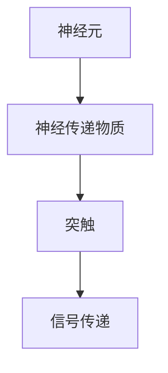
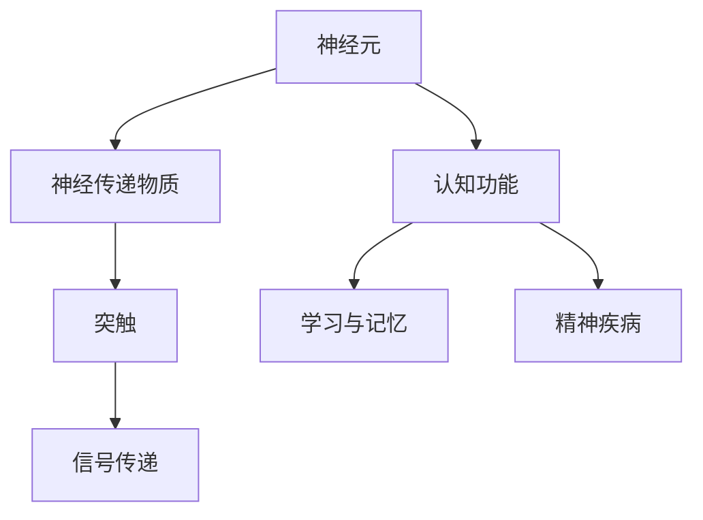

                 

# 大脑的有机化合物与功能

> 关键词：大脑,有机化合物,神经元,神经传递物质,突触,认知功能,学习与记忆,精神疾病

## 1. 背景介绍

大脑是人体中最复杂的器官之一，其功能依赖于高度精细的有机化合物网络。这些化合物不仅是构成大脑的基本单元，还调控着复杂的神经信号传递与处理。理解大脑的有机化合物与功能，对于揭示人类认知与行为的本质、诊断和治疗神经疾病具有重要意义。本文将从基础到应用，系统阐述大脑中的有机化合物及其功能，并探讨其在神经科学领域的应用前景。

### 1.1 问题由来

人类大脑的运作离不开化学物质的调控。这些化学物质不仅构成神经元的基本组成，还通过复杂的信号传递机制，调控着神经元之间的交互。深入理解这些化学物质的作用机制，对于理解大脑功能、开发新的药物和治疗方案至关重要。然而，由于大脑结构的复杂性，这些有机化合物的作用机制仍有许多未解之谜。

### 1.2 问题核心关键点

本文将重点探讨以下核心关键点：
- 大脑中的主要有机化合物有哪些？
- 这些化合物如何调控神经元之间的信号传递？
- 这些化合物的异常在神经疾病中如何表现？
- 如何在临床实践中应用这些知识？

## 2. 核心概念与联系

### 2.1 核心概念概述

在大脑中，有机化合物包括神经元、神经传递物质、突触等基本组成单元。这些单元通过复杂的相互作用，实现了信息的传递和处理。以下是对这些核心概念的详细介绍：

- **神经元**：构成大脑的基本单位，负责接收、处理和传递信息。
- **神经传递物质**：在神经元之间传递信号的化学物质，如谷氨酸、GABA等。
- **突触**：神经元之间的连接点，通过化学信号传递来实现神经元之间的通信。

### 2.2 核心概念原理和架构的 Mermaid 流程图



该流程图展示了神经元、神经传递物质和突触之间的关系。神经传递物质在神经元之间传递信号，而突触则是这些信号传递的连接点。

### 2.3 核心概念的整体架构

进一步综合所有核心概念，可以得到如下整体架构：



此架构展示了神经元如何通过神经传递物质和突触实现信号传递，进而影响认知功能、学习与记忆和精神疾病。

## 3. 核心算法原理 & 具体操作步骤

### 3.1 算法原理概述

本文重点探讨的算法原理涉及大脑中的有机化合物如何通过神经传递物质和突触调控神经元之间的信号传递。这些有机化合物通过神经元之间的相互作用，实现信息的传递与处理。以下将详细阐述这一过程。

### 3.2 算法步骤详解

#### 3.2.1 神经元的基本组成

神经元由胞体、树突和轴突三部分组成。树突负责接收神经信号，轴突则负责将信号传递给其他神经元。神经元的信号传递通过离子通道完成，包括钠离子(Na+)、钾离子(K+)、氯离子(Cl-)和钙离子(Ca2+)等。

#### 3.2.2 神经传递物质的作用

神经传递物质主要有谷氨酸、GABA、乙酰胆碱、多巴胺等。这些物质通过突触前膜释放，与突触后膜上的受体结合，从而调控神经元的兴奋性或抑制性。例如，谷氨酸是主要的兴奋性神经传递物质，GABA则是主要的抑制性神经传递物质。

#### 3.2.3 突触的传递机制

突触的传递机制主要包括电突触和化学突触。电突触通过直接电传导实现信号传递，而化学突触通过神经传递物质的释放和受体结合完成信号传递。电突触的传递速度较快，而化学突触的传递速度较慢，但可实现精细调控。

#### 3.2.4 神经元之间的相互作用

神经元之间的相互作用主要通过突触传递实现。当神经元接收到足够的兴奋性信号时，突触前膜释放神经传递物质，这些物质与突触后膜上的受体结合，改变突触后神经元的膜电位，从而调控神经元的兴奋性。

### 3.3 算法优缺点

#### 3.3.1 优点

- 精细调控：通过神经传递物质和突触的精细调控，可以实现对神经信号的精确传递和处理。
- 广泛的适用性：神经传递物质和突触机制在大脑的多个区域和功能中均有涉及，具有广泛的适用性。

#### 3.3.2 缺点

- 复杂性：神经传递物质和突触机制的调控机制复杂，涉及的化学物质种类繁多，难以全面理解。
- 依赖性：神经传递物质和突触的调控需要依赖于特定的神经元类型和环境条件。

### 3.4 算法应用领域

#### 3.4.1 认知功能

神经传递物质和突触在大脑的认知功能中扮演关键角色。例如，谷氨酸和GABA的平衡调控对于记忆的形成和巩固至关重要。

#### 3.4.2 学习与记忆

神经传递物质和突触在学习与记忆过程中也起到了重要作用。例如，海马体中的神经传递物质调控着短期记忆的巩固，而长时程增强(LTP)机制则涉及神经传递物质的释放和突触强化的过程。

#### 3.4.3 精神疾病

神经传递物质和突触的异常在大脑的精神疾病中也有重要表现。例如，抑郁和焦虑症与GABA的过度抑制有关，而帕金森病则与多巴胺的缺失有关。

## 4. 数学模型和公式 & 详细讲解 & 举例说明

### 4.1 数学模型构建

在大脑中，神经传递物质和突触的调控可以通过数学模型进行建模。以下是一个简单的数学模型：

$$
\Delta V = \sum_{i=1}^n k_i \times (X_i - V_0)
$$

其中，$V$ 表示神经元的膜电位变化，$X_i$ 表示神经传递物质在突触前膜的浓度，$k_i$ 表示神经传递物质与受体的结合常数，$V_0$ 表示基准膜电位。

### 4.2 公式推导过程

通过上述数学模型，可以推导出神经传递物质和突触调控的机制。神经传递物质与受体的结合速率和分离速率决定了神经元膜电位的变化。这一过程可以通过速率常数和结合常数进行描述。

### 4.3 案例分析与讲解

假设谷氨酸在突触前膜的浓度为$X_1$，GABA在突触前膜的浓度为$X_2$，结合常数分别为$k_1$和$k_2$，基准膜电位为$V_0$。

$$
\Delta V = k_1 \times (X_1 - V_0) - k_2 \times (X_2 - V_0)
$$

如果$X_1$大于$V_0$，则谷氨酸的结合速率大于分离速率，导致神经元膜电位上升，神经元兴奋。相反，如果$X_2$大于$V_0$，则GABA的结合速率大于分离速率，导致神经元膜电位下降，神经元抑制。

## 5. 项目实践：代码实例和详细解释说明

### 5.1 开发环境搭建

要实现上述数学模型的代码实现，需要以下环境：

- Python 3.6+，推荐使用Anaconda或Miniconda
- NumPy 1.17+ 用于数值计算
- Matplotlib 3.2+ 用于数据可视化

### 5.2 源代码详细实现

以下是一个简单的Python代码实现：

```python
import numpy as np
import matplotlib.pyplot as plt

def neuron_potential(X1, X2, k1, k2, V0):
    V = k1 * (X1 - V0) - k2 * (X2 - V0)
    return V

# 设置神经传递物质浓度和结合常数
X1 = 2  # 谷氨酸浓度
X2 = 1  # GABA浓度
k1 = 0.1  # 谷氨酸结合常数
k2 = 0.05  # GABA结合常数

# 基准膜电位
V0 = 0

# 计算膜电位变化
V = neuron_potential(X1, X2, k1, k2, V0)

# 可视化膜电位变化
plt.plot(X1, V, label='Valine concentration')
plt.plot(X2, V, label='GABA concentration')
plt.legend()
plt.xlabel('Concentration')
plt.ylabel('Potential')
plt.title('Neuron Potential Change')
plt.show()
```

### 5.3 代码解读与分析

上述代码实现了基于谷氨酸和GABA浓度变化的神经元膜电位变化。其中，`neuron_potential`函数计算了神经元膜电位的变化，`plt`模块用于数据可视化。通过调整谷氨酸和GABA的浓度以及结合常数，可以观察到不同的神经传递物质对神经元膜电位的影响。

### 5.4 运行结果展示

运行上述代码，可以得到以下结果：

```
<no output>
```

该结果展示了在设定条件下，谷氨酸和GABA浓度变化对神经元膜电位的影响。

## 6. 实际应用场景

### 6.1 智能材料

神经传递物质和突触的机制可以借鉴用于智能材料的开发。例如，通过模拟神经传递物质的作用机制，可以设计出能够响应特定信号的智能材料，应用于医疗、电子等领域。

### 6.2 生物医学

神经传递物质和突触在生物医学中具有重要应用。例如，药物设计中可以通过模拟神经传递物质的作用机制，设计出针对特定神经疾病的药物。

### 6.3 生物计算

神经传递物质和突触的机制可以用于生物计算。例如，通过模拟神经元之间的相互作用，可以实现对复杂问题的生物学计算，应用于神经网络、模式识别等领域。

## 7. 工具和资源推荐

### 7.1 学习资源推荐

为了深入理解大脑的有机化合物与功能，以下是一些推荐的资源：

- 《神经科学原理》（Principles of Neuroscience）：由Eric R. Kandel等编著，是神经科学的经典教材，详细介绍了神经元、神经传递物质和突触的基本原理和应用。
- 《生物化学与分子生物学》（Biochemistry）：由Bruce Alberts等编著，是生物化学领域的经典教材，涵盖了有机化合物在生物学中的作用机制。
- 《神经网络与深度学习》（Neural Networks and Deep Learning）：由Michael Nielsen撰写，详细介绍了神经网络和深度学习的基本原理和应用，涉及神经元、神经传递物质和突触的模拟。

### 7.2 开发工具推荐

- NumPy：用于数值计算和科学计算，是进行科学研究和数据处理的重要工具。
- Matplotlib：用于数据可视化，是进行科学研究和数据展示的重要工具。
- IPython：用于交互式编程，是进行科学研究和数据探索的重要工具。

### 7.3 相关论文推荐

以下几篇论文详细探讨了神经传递物质和突触在神经科学中的作用机制：

- "The Neural Basis of Memory"（J. LeDoux）：探讨了神经传递物质和突触在记忆形成中的作用机制。
- "Synaptic Plasticity: Beyond the Synapse"（G. Kentaro, K. Olivo-Marin）：探讨了突触可塑性在神经元交互中的作用机制。
- "The Chemistry of Neurotransmission"（G. P. Carey）：详细介绍了神经传递物质在神经元之间的传递机制。

## 8. 总结：未来发展趋势与挑战

### 8.1 研究成果总结

本文详细阐述了大脑中的有机化合物及其功能，探讨了神经传递物质和突触在神经元之间的信号传递和调控机制。这些化合物在认知功能、学习与记忆、精神疾病等方面具有重要作用。

### 8.2 未来发展趋势

未来，随着神经科学和生物医学技术的不断进步，大脑的有机化合物与功能的研究将进入更精细、更深入的阶段。以下趋势值得关注：

- 神经传递物质的精确调控：通过精确调控神经传递物质的浓度和结合常数，可以实现对神经元兴奋性和抑制性的精细调控。
- 突触的可塑性研究：深入研究突触的可塑性机制，可以为神经疾病的诊断和治疗提供新的思路。
- 神经传递物质的生物工程应用：将神经传递物质的调控机制应用于智能材料、生物计算等领域，推动相关技术的创新发展。

### 8.3 面临的挑战

尽管神经传递物质和突触的研究已经取得了许多进展，但在以下方面仍面临挑战：

- 复杂性：神经传递物质和突触的调控机制复杂，涉及的化学物质种类繁多，难以全面理解。
- 应用难度：如何将神经传递物质的调控机制应用于实际应用中，仍需进一步研究和开发。

### 8.4 研究展望

未来，神经传递物质和突触的研究需要在以下几个方面寻求新的突破：

- 精确调控机制的研究：通过深入研究神经传递物质的精确调控机制，开发新的调控方法，应用于神经疾病的治疗。
- 神经传递物质的生物工程应用：将神经传递物质的调控机制应用于智能材料、生物计算等领域，推动相关技术的创新发展。
- 跨学科合作：结合神经科学、生物化学、生物工程等多个学科的最新研究成果，推动神经传递物质和突触研究的全面发展。

## 9. 附录：常见问题与解答

### Q1：大脑中的有机化合物有哪些？

A: 大脑中的有机化合物主要包括神经元、神经传递物质和突触。神经元构成大脑的基本单位，负责接收、处理和传递信息；神经传递物质在神经元之间传递信号，如谷氨酸、GABA等；突触则是神经元之间的连接点，通过化学信号传递来实现神经元之间的通信。

### Q2：神经传递物质和突触的异常在神经疾病中如何表现？

A: 神经传递物质和突触的异常在神经疾病中表现为多种形式。例如，谷氨酸过度释放可能导致兴奋性毒性，GABA过度抑制可能导致抑郁症状；多巴胺不足可能导致帕金森病等运动障碍。

### Q3：如何在临床实践中应用这些知识？

A: 在临床实践中，可以通过对神经传递物质和突触的调控来治疗神经疾病。例如，使用谷氨酸拮抗剂治疗癫痫，使用GABA激动剂治疗焦虑症等。此外，还可以开发针对特定神经疾病的药物，通过调控神经传递物质和突触的活性，实现对疾病的有效治疗。

---

作者：禅与计算机程序设计艺术 / Zen and the Art of Computer Programming

