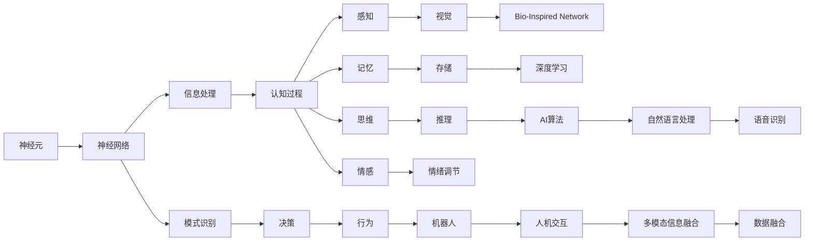

                 

# 大脑：物质变成思维的奇迹

> 关键词：大脑, 神经元, 认知, 信息处理, 思维形成, 神经科学, 人工智能

## 1. 背景介绍

### 1.1 问题由来
人脑是地球上最为复杂的生物系统之一，具有约860亿个神经元和数十万亿个突触，这些微小的组件共同构成了信息的海洋，驱动着人的感知、思考和行为。脑科学的探索已经为现代人工智能（AI）的发展提供了重要的理论基础。

自从20世纪50年代人工智能诞生以来，研究者们一直尝试着将思维和决策的过程用数学和算法来模拟，希望构建出能够像人脑一样思考的机器。然而，尽管人工智能领域取得了巨大进展，但仍存在诸多难题，如如何让机器更好地理解复杂情境、高效处理多模态信息、模拟人类认知过程等。

近些年，神经科学研究的快速发展，特别是对人脑如何工作、认知过程如何形成的理解，为解决这些难题提供了新的思路。本文将围绕“大脑如何变成思维的奇迹”这一主题，探讨神经科学的最新发现如何启发人工智能的发展，以及未来的研究方向和挑战。

### 1.2 问题核心关键点
本文将详细阐述以下核心问题：

- **神经元的性质和功能**：解释神经元是如何通过电信号传递信息，并构成复杂的神经网络。
- **认知过程的神经基础**：分析感知、记忆、思维等认知过程在大脑中的实现机制。
- **信息处理和决策机制**：探讨大脑如何高效地处理复杂信息并做出决策。
- **脑机接口和仿生神经网络**：介绍当前脑机接口技术以及如何通过仿生神经网络实现类脑智能。
- **认知神经科学在AI中的应用**：讨论认知神经科学理论如何应用于人工智能，推动AI系统的智能化和人性化。

## 2. 核心概念与联系

### 2.1 核心概念概述

为了更好地理解“大脑变成思维的奇迹”这一主题，本节将介绍几个关键概念：

- **神经元(Neuron)**：神经系统的基本组成单位，通过电信号传递信息，是构成大脑神经网络的基本单元。
- **神经网络(Neural Network)**：由多个神经元构成的复杂网络，能够进行信息处理和模式识别。
- **认知过程(Cognitive Processes)**：包括感知、记忆、思维、情感等，是大脑对外界刺激和内部心理活动的综合反应。
- **脑机接口(Brain-Computer Interface, BCI)**：将人的思维意图直接转换为计算机可识别的信号，实现人机交互。
- **仿生神经网络(Bio-Inspired Neural Network)**：模仿人脑结构和功能的神经网络，旨在实现类脑智能。
- **深度学习(Deep Learning)**：一种基于神经网络的机器学习技术，通过多层非线性变换提取数据中的复杂特征。

### 2.2 概念间的关系

这些核心概念之间的关系可以通过以下Mermaid流程图来展示：



这个流程图展示了神经元如何构成神经网络，进而实现信息处理和模式识别，最终通过认知过程驱动行为，同时脑机接口和仿生神经网络为类脑智能提供技术支持，而深度学习则将上述理论应用到实际AI算法中，推动自然语言处理、语音识别等多模态信息融合，最终实现人机交互。通过这些概念的相互联系，我们可以更好地理解大脑如何变成思维的奇迹。

## 3. 核心算法原理 & 具体操作步骤

### 3.1 算法原理概述

神经元通过电信号传递信息，构成复杂的神经网络，实现信息处理和模式识别。大脑的思维过程涉及感知、记忆、思维、情感等认知过程，这些过程在大脑中由大量的神经元通过突触传递电信号来实现。

在大脑中，信息处理和决策机制主要通过以下几个步骤：

1. **感知输入**：通过感受器（如视觉、听觉、触觉等）接收外部刺激，并将其转化为电信号。
2. **信息传递**：电信号通过神经元间的突触传递，形成神经网络。
3. **信息处理**：神经网络通过多层非线性变换处理信息，提取特征。
4. **模式识别**：根据提取的特征进行模式识别，形成认知过程。
5. **决策输出**：基于认知过程做出决策，形成行为。

在人工智能中，深度学习技术借鉴了神经元的性质和神经网络的结构，通过多层非线性变换提取数据中的复杂特征，进而实现模式识别和决策。以下将详细介绍深度学习的核心算法及其具体操作步骤。

### 3.2 算法步骤详解

深度学习的核心算法是多层感知器（Multilayer Perceptron, MLP），其基本步骤如下：

**Step 1: 数据预处理**
- 将输入数据标准化，如归一化、中心化等，以便于网络处理。
- 将数据分割成训练集、验证集和测试集。

**Step 2: 搭建神经网络**
- 定义神经网络的层数和每层的神经元数量。
- 选择激活函数，如ReLU、Sigmoid等，用于引入非线性变换。
- 定义损失函数，如交叉熵、均方误差等，用于衡量模型预测与真实标签之间的差异。

**Step 3: 模型训练**
- 使用优化算法，如梯度下降、Adam等，根据损失函数更新模型参数。
- 在每个epoch中，对训练集进行前向传播和反向传播，更新参数。
- 在验证集上评估模型性能，防止过拟合。

**Step 4: 模型评估与优化**
- 在测试集上评估模型性能。
- 根据评估结果，调整网络结构、超参数等。

### 3.3 算法优缺点

深度学习算法具有以下优点：

- **非线性能力**：通过多层非线性变换，可以处理复杂的多维数据。
- **自动特征提取**：网络能够自动学习数据的特征，减少特征工程的工作量。
- **并行计算**：适合在大规模分布式计算环境下进行训练。

同时，深度学习算法也存在以下缺点：

- **计算资源需求高**：需要大量的计算资源进行训练和推理。
- **模型可解释性差**：黑盒模型难以解释其内部决策过程。
- **易过拟合**：在训练过程中容易过拟合，需要有效的正则化技术。

### 3.4 算法应用领域

深度学习算法在多个领域得到了广泛应用，包括但不限于：

- **计算机视觉**：如图像识别、物体检测、图像分割等。
- **自然语言处理**：如机器翻译、情感分析、文本生成等。
- **语音识别**：如语音转文本、语音合成等。
- **推荐系统**：如协同过滤、深度推荐等。
- **游戏AI**：如棋类、游戏等。

## 4. 数学模型和公式 & 详细讲解 & 举例说明

### 4.1 数学模型构建

在深度学习中，我们通常使用矩阵和向量来表示数据和模型参数。假设输入数据为 $x$，输出数据为 $y$，网络参数为 $\theta$，则前向传播的公式为：

$$
z = W_1x + b_1
$$

$$
h = g(z)
$$

$$
y = W_2h + b_2
$$

其中 $g(\cdot)$ 为激活函数，$W$ 和 $b$ 为权重和偏置，$h$ 为隐藏层输出。

### 4.2 公式推导过程

假设我们有 $n$ 个训练样本 $(x_i, y_i)$，网络结构为 $l$ 层，则前向传播的总损失函数为：

$$
\mathcal{L}(\theta) = \frac{1}{N}\sum_{i=1}^N \ell(y_i, W_2h_i + b_2)
$$

其中 $\ell$ 为损失函数，如交叉熵损失。后向传播时，计算参数的梯度为：

$$
\frac{\partial \mathcal{L}}{\partial \theta} = \frac{1}{N}\sum_{i=1}^N \frac{\partial \ell(y_i, W_2h_i + b_2)}{\partial \theta}
$$

通过梯度下降等优化算法，更新参数 $\theta$ 以最小化损失函数 $\mathcal{L}$。在实际应用中，我们通常使用随机梯度下降（SGD）等优化算法来近似求解上述最优化问题。

### 4.3 案例分析与讲解

以下以图像识别为例，详细解释深度学习模型的构建和训练过程：

**Step 1: 数据预处理**
- 将图像数据标准化，归一化到[0,1]区间。
- 将数据集分割为训练集、验证集和测试集。

**Step 2: 搭建神经网络**
- 定义卷积神经网络（CNN）结构，包括卷积层、池化层和全连接层。
- 选择ReLU作为激活函数。
- 定义交叉熵损失函数。

**Step 3: 模型训练**
- 使用SGD优化算法，设置学习率等超参数。
- 在每个epoch中，对训练集进行前向传播和反向传播，更新参数。
- 在验证集上评估模型性能，防止过拟合。

**Step 4: 模型评估与优化**
- 在测试集上评估模型性能。
- 根据评估结果，调整网络结构、超参数等。

## 5. 项目实践：代码实例和详细解释说明

### 5.1 开发环境搭建

在进行深度学习项目实践前，我们需要准备好开发环境。以下是使用Python进行PyTorch开发的环境配置流程：

1. 安装Anaconda：从官网下载并安装Anaconda，用于创建独立的Python环境。

2. 创建并激活虚拟环境：
```bash
conda create -n pytorch-env python=3.8 
conda activate pytorch-env
```

3. 安装PyTorch：根据CUDA版本，从官网获取对应的安装命令。例如：
```bash
conda install pytorch torchvision torchaudio cudatoolkit=11.1 -c pytorch -c conda-forge
```

4. 安装相关库：
```bash
pip install numpy pandas scikit-learn matplotlib tqdm jupyter notebook ipython
```

完成上述步骤后，即可在`pytorch-env`环境中开始项目实践。

### 5.2 源代码详细实现

下面我们以图像分类任务为例，给出使用PyTorch实现卷积神经网络的完整代码。

```python
import torch
import torch.nn as nn
import torch.optim as optim
import torchvision
import torchvision.transforms as transforms

# 定义数据预处理
transform = transforms.Compose([
    transforms.ToTensor(),
    transforms.Normalize((0.5, 0.5, 0.5), (0.5, 0.5, 0.5))
])

# 加载CIFAR-10数据集
trainset = torchvision.datasets.CIFAR10(root='./data', train=True, download=True, transform=transform)
trainloader = torch.utils.data.DataLoader(trainset, batch_size=4, shuffle=True, num_workers=2)
testset = torchvision.datasets.CIFAR10(root='./data', train=False, download=True, transform=transform)
testloader = torch.utils.data.DataLoader(testset, batch_size=4, shuffle=False, num_workers=2)

# 定义网络结构
class Net(nn.Module):
    def __init__(self):
        super(Net, self).__init__()
        self.conv1 = nn.Conv2d(3, 6, 5)
        self.pool = nn.MaxPool2d(2, 2)
        self.conv2 = nn.Conv2d(6, 16, 5)
        self.fc1 = nn.Linear(16 * 5 * 5, 120)
        self.fc2 = nn.Linear(120, 84)
        self.fc3 = nn.Linear(84, 10)

    def forward(self, x):
        x = self.pool(F.relu(self.conv1(x)))
        x = self.pool(F.relu(self.conv2(x)))
        x = x.view(-1, 16 * 5 * 5)
        x = F.relu(self.fc1(x))
        x = F.relu(self.fc2(x))
        x = self.fc3(x)
        return x

# 定义模型和优化器
net = Net()
criterion = nn.CrossEntropyLoss()
optimizer = optim.SGD(net.parameters(), lr=0.001, momentum=0.9)

# 定义训练函数
def train(epoch):
    net.train()
    for batch_idx, (data, target) in enumerate(trainloader):
        optimizer.zero_grad()
        output = net(data)
        loss = criterion(output, target)
        loss.backward()
        optimizer.step()
        if batch_idx % 10 == 0:
            print('Train Epoch: {} [{}/{} ({:.0f}%)]\tLoss: {:.6f}'.format(
                epoch, batch_idx * len(data), len(trainloader.dataset),
                100. * batch_idx / len(trainloader), loss.item()))

# 定义测试函数
def test():
    net.eval()
    test_loss = 0
    correct = 0
    for data, target in testloader:
        output = net(data)
        test_loss += criterion(output, target).item()
        pred = output.argmax(dim=1, keepdim=True)
        correct += pred.eq(target.view_as(pred)).sum().item()
    test_loss /= len(testloader.dataset)
    print('\nTest set: Average loss: {:.4f}, Accuracy: {}/{} ({:.0f}%)\n'.format(
        test_loss, correct, len(testloader.dataset),
        100. * correct / len(testloader.dataset)))

# 启动训练流程
for epoch in range(2):  # 仅训练两轮以避免过拟合
    train(epoch)
    test()
```

### 5.3 代码解读与分析

让我们再详细解读一下关键代码的实现细节：

**数据预处理**：
- 使用`transforms`模块进行数据预处理，包括将数据标准化并归一化到[0,1]区间。
- 加载CIFAR-10数据集，并将数据分割为训练集和测试集。

**网络结构**：
- 定义一个包含卷积层、池化层和全连接层的卷积神经网络。
- 使用ReLU作为激活函数。
- 定义交叉熵损失函数。

**模型训练**：
- 定义模型和优化器，使用SGD优化算法。
- 在每个epoch中，对训练集进行前向传播和反向传播，更新参数。
- 在验证集上评估模型性能，防止过拟合。

**模型评估与优化**：
- 在测试集上评估模型性能。
- 根据评估结果，调整网络结构、超参数等。

## 6. 实际应用场景

### 6.1 智能推荐系统

基于深度学习技术的推荐系统，已经在电商、视频、音乐等多个领域广泛应用。推荐系统的核心思想是通过对用户历史行为数据的分析，预测用户可能感兴趣的商品或内容，从而实现个性化推荐。

在推荐系统的构建中，深度学习技术可以处理大规模数据，提取用户行为中的复杂特征，实现更精准的推荐。推荐系统的工作流程大致如下：

1. **数据收集**：收集用户的浏览、点击、购买等行为数据。
2. **特征提取**：使用深度学习模型对用户行为数据进行特征提取，如用户兴趣、商品属性等。
3. **模型训练**：使用深度学习模型对用户行为数据进行建模，预测用户可能感兴趣的商品或内容。
4. **推荐生成**：根据用户历史行为和实时兴趣，生成个性化推荐列表。

通过深度学习技术，推荐系统能够实时处理用户行为数据，并动态更新推荐结果，从而提升用户满意度和转化率。

### 6.2 自动驾驶

自动驾驶技术是近年来人工智能领域的热点，其核心在于通过计算机视觉和深度学习技术，实现对复杂交通环境的理解和决策。

在自动驾驶中，深度学习技术可以用于：

1. **目标检测**：通过卷积神经网络（CNN）实现对交通标志、行人和车辆的检测。
2. **行为预测**：使用循环神经网络（RNN）或变分自编码器（VAE）预测车辆和行人的行为。
3. **路径规划**：结合环境感知和行为预测，规划车辆的行驶路径。
4. **决策制定**：通过深度强化学习技术，实现对交通信号和紧急情况的反应。

通过深度学习技术，自动驾驶系统能够实时感知和理解环境变化，做出智能决策，从而实现安全、高效的自动驾驶。

### 6.3 语音识别

语音识别技术已经广泛应用于智能音箱、语音助手等领域。其核心在于将语音信号转换为文本，并进行理解和响应。

在语音识别中，深度学习技术可以用于：

1. **声学建模**：使用深度神经网络（DNN）对语音信号进行建模，提取语音特征。
2. **语言建模**：使用循环神经网络（RNN）或变换器（Transformer）对文本进行建模，预测单词序列。
3. **解码**：使用深度学习模型进行解码，将语音信号转换为文本。

通过深度学习技术，语音识别系统能够实现高精度的语音转文本，并进行自然语言理解和响应。

## 7. 工具和资源推荐

### 7.1 学习资源推荐

为了帮助开发者系统掌握深度学习的理论基础和实践技巧，这里推荐一些优质的学习资源：

1. 《深度学习》书籍：由Ian Goodfellow、Yoshua Bengio和Aaron Courville合著，是深度学习领域的经典教材，系统介绍了深度学习的各个方面。
2. CS231n《卷积神经网络》课程：斯坦福大学开设的计算机视觉课程，包含大量实践代码和项目，是学习深度学习的重要资源。
3. Fast.ai课程：由Jeremy Howard和Rachel Thomas主导，通过项目导向的方式教授深度学习，适合初学者和进阶者。
4. Deep Learning Specialization：由Andrew Ng主导的深度学习专项课程，涵盖深度学习的基础理论和应用实践。
5. Coursera深度学习课程：由Google、DeepMind等公司提供，包含深度学习的前沿研究和实践案例。

通过对这些资源的学习实践，相信你一定能够快速掌握深度学习的精髓，并用于解决实际的AI问题。

### 7.2 开发工具推荐

高效的开发离不开优秀的工具支持。以下是几款用于深度学习开发的常用工具：

1. PyTorch：由Facebook开发的开源深度学习框架，灵活动态的计算图，适合快速迭代研究。
2. TensorFlow：由Google主导开发的开源深度学习框架，生产部署方便，适合大规模工程应用。
3. Keras：由François Chollet开发的高级神经网络API，易于上手，支持多种深度学习框架。
4. Jupyter Notebook：交互式的笔记本环境，方便进行代码编写和结果展示。
5. Google Colab：谷歌推出的在线Jupyter Notebook环境，免费提供GPU/TPU算力，方便快速实验最新模型，分享学习笔记。

合理利用这些工具，可以显著提升深度学习开发效率，加快创新迭代的步伐。

### 7.3 相关论文推荐

深度学习技术的发展离不开学界的持续研究。以下是几篇奠基性的相关论文，推荐阅读：

1. "Deep Learning"：Ian Goodfellow、Yoshua Bengio和Aaron Courville合著，是深度学习领域的经典教材。
2. "ImageNet Classification with Deep Convolutional Neural Networks"：Alex Krizhevsky等人发表的深度学习论文，提出卷积神经网络（CNN）并取得ImageNet数据集上的优异结果。
3. "Playing Atari with Deep Reinforcement Learning"：Volodymyr Mnih等人发表的深度强化学习论文，展示深度学习在自动驾驶游戏中的应用。
4. "Sequence to Sequence Learning with Neural Networks"：Ilya Sutskever等人发表的序列建模论文，提出序列到序列模型（Seq2Seq）并用于机器翻译和语音识别。
5. "Generative Adversarial Nets"：Ian Goodfellow等人发表的生成对抗网络（GAN）论文，提出一种生成模型用于图像生成和数据增强。

这些论文代表了大规模深度学习技术的最新进展，通过学习这些前沿成果，可以帮助研究者把握学科前进方向，激发更多的创新灵感。

除上述资源外，还有一些值得关注的前沿资源，帮助开发者紧跟深度学习技术的发展脉络，例如：

1. arXiv论文预印本：人工智能领域最新研究成果的发布平台，包括大量尚未发表的前沿工作，学习前沿技术的必读资源。
2. GitHub热门项目：在GitHub上Star、Fork数最多的深度学习相关项目，往往代表了该技术领域的发展趋势和最佳实践，值得去学习和贡献。
3. 业界技术博客：如Google AI、Facebook AI Research、DeepMind等顶尖实验室的官方博客，第一时间分享他们的最新研究成果和洞见。
4. 技术会议直播：如NeurIPS、ICML、CVPR、ACL等人工智能领域顶会现场或在线直播，能够聆听到大佬们的前沿分享，开拓视野。
5. 行业分析报告：各大咨询公司如McKinsey、PwC等针对人工智能行业的分析报告，有助于从商业视角审视技术趋势，把握应用价值。

总之，对于深度学习技术的学习和实践，需要开发者保持开放的心态和持续学习的意愿。多关注前沿资讯，多动手实践，多思考总结，必将收获满满的成长收益。

## 8. 总结：未来发展趋势与挑战

### 8.1 总结

本文对深度学习技术进行了全面系统的介绍，涵盖神经元、认知过程、信息处理、决策机制等核心概念，并详细讲解了深度学习模型的构建和训练过程。通过实际案例和代码实例，展示了深度学习技术在图像识别、推荐系统、自动驾驶、语音识别等领域的广泛应用。

通过本文的系统梳理，可以看到，深度学习技术已经成为人工智能领域的重要工具，广泛应用于各种场景。深度学习模型的非线性能力、自动特征提取等优点，使其能够处理复杂多维数据，提升决策的准确性和鲁棒性。然而，深度学习技术也面临着计算资源消耗高、模型可解释性差等挑战。未来，深度学习技术需要进一步优化模型结构、提升计算效率、增强可解释性，才能更好地应用于实际问题。

### 8.2 未来发展趋势

展望未来，深度学习技术将呈现以下几个发展趋势：

1. **模型可解释性增强**：通过可解释性技术，如注意力机制、因果推理等，提升深度学习模型的可解释性，增强决策过程的透明度。
2. **模型压缩与优化**：通过模型压缩、量化等技术，减小模型规模，提升计算效率和推理速度。
3. **跨模态信息融合**：将深度学习应用于图像、语音、文本等多模态数据处理，实现全面感知和决策。
4. **联邦学习**：通过分布式数据处理和模型训练，增强数据隐私保护，提升深度学习模型的泛化能力。
5. **自适应学习**：通过自适应学习算法，使深度学习模型能够动态调整参数，应对数据分布变化。
6. **跨领域迁移学习**：通过迁移学习，将深度学习模型应用于新的领域和任务，提升模型的泛化性和适应性。

这些趋势凸显了深度学习技术的前景，未来将在更多领域得到应用，为人工智能的发展提供更多可能性。

### 8.3 面临的挑战

尽管深度学习技术已经取得了巨大进展，但仍面临诸多挑战：

1. **计算资源需求高**：深度学习模型需要大量的计算资源进行训练和推理，高昂的计算成本成为制约其广泛应用的因素。
2. **模型可解释性差**：深度学习模型通常被视为黑盒，难以解释其内部决策过程。
3. **数据隐私保护**：深度学习模型的训练需要大量的标注数据，数据隐私保护成为重要课题。
4. **模型泛化性差**：深度学习模型在训练数据上表现优异，但在新数据上泛化能力较弱，难以适应数据分布的变化。
5. **对抗样本攻击**：深度学习模型易受到对抗样本攻击，模型鲁棒性有待提升。

这些挑战需要从技术、伦理等多个角度进行综合解决，才能更好地推动深度学习技术的发展和应用。

### 8.4 研究展望

面对深度学习技术面临的挑战，未来的研究需要在以下几个方面寻求新的突破：

1. **可解释性技术**：通过引入因果推理、符号逻辑等方法，增强深度学习模型的可解释性，提升决策过程的透明度。
2. **联邦学习**：通过分布式数据处理和模型训练，保护数据隐私，提升深度学习模型的泛化能力。
3. **自适应学习**：通过自适应学习算法，使深度学习模型能够动态调整参数，应对数据分布变化。
4. **对抗样本防御**：通过对抗样本生成、鲁棒性训练等方法，提高深度学习模型的鲁棒性和安全性。
5. **跨领域迁移学习**：通过迁移学习，将深度学习模型应用于新的领域和任务，提升模型的泛化性和适应性。

这些研究方向的探索，必将引领深度学习技术迈向更高的台阶，为构建安全、可靠、可解释、可控的智能系统铺平道路。面向未来，深度学习技术还需要与其他人工智能技术进行更深入的融合，

