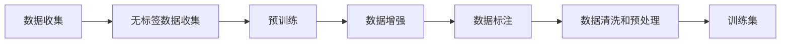
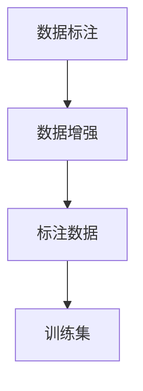
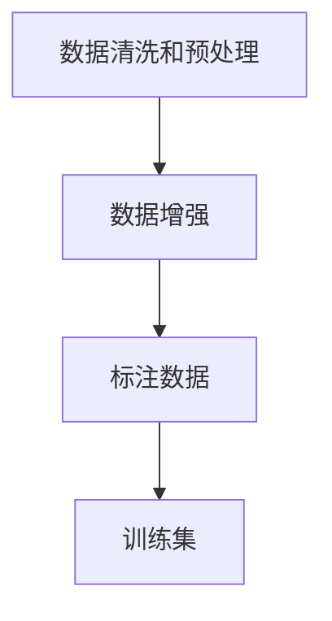

                 

# 大规模语言模型从理论到实践 数据收集

> 关键词：大规模语言模型,预训练,无标签数据收集,数据增强,数据标注,数据清洗

## 1. 背景介绍

### 1.1 问题由来

近年来，大规模语言模型（Large Language Models, LLMs）的崛起为自然语言处理（NLP）领域带来了革命性的突破。这些模型通过在大量无标签文本数据上预训练，学习到了丰富的语言知识和常识，能够在众多下游任务中取得优异的表现。然而，数据收集是大规模语言模型构建过程中不可或缺的一环，涉及数据的获取、清洗、增强等多个环节。如何高效、全面地收集高质量的数据，对于模型的性能和泛化能力有着至关重要的影响。

### 1.2 问题核心关键点

数据收集是大规模语言模型预训练的基石，其核心关键点包括：

1. **数据获取来源**：如何从互联网、文献库、社交媒体等渠道获取足够数量的文本数据。
2. **数据质量控制**：如何保证收集到的数据质量，避免噪声和偏差。
3. **数据增强技术**：如何通过对原始数据进行进一步处理，扩充数据集，提高模型的泛化能力。
4. **数据标注**：在特定任务中，如何对数据进行标注，构建有监督学习的数据集。
5. **数据清洗和预处理**：如何去除数据中的噪声和不一致性，确保数据的一致性和可用性。

### 1.3 问题研究意义

高效、全面地收集高质量的数据，对于大规模语言模型的性能和泛化能力有着至关重要的影响。良好的数据收集方法能够极大地提升模型的性能，降低过拟合风险，加速模型的训练和优化。因此，研究高效的数据收集方法和技术，对于大规模语言模型的应用和发展具有重要意义：

1. **提高模型性能**：高质量的数据集能够使得模型更好地学习语言的通用表示，提升其在特定任务上的表现。
2. **加速模型训练**：全面的数据收集能够减少模型在训练过程中对数据多样性的依赖，加速模型的收敛。
3. **降低过拟合风险**：合理的数据增强和清洗能够有效减少模型对训练数据的依赖，避免过拟合。
4. **促进技术进步**：不断优化数据收集方法，能够推动NLP技术的持续进步，加速人工智能产业的发展。
5. **提升用户体验**：高质量的训练数据能够使得模型输出更加准确、可信，提升用户的使用体验。

## 2. 核心概念与联系

### 2.1 核心概念概述

为更好地理解大规模语言模型数据收集的原理和架构，本节将介绍几个关键概念：

- **大规模语言模型 (LLMs)**：以自回归（如GPT）或自编码（如BERT）模型为代表的大规模预训练语言模型。通过在大规模无标签文本数据上进行预训练，学习到丰富的语言知识和常识。
- **预训练 (Pre-training)**：指在大规模无标签文本数据上，通过自监督学习任务训练通用语言模型的过程。常见的预训练任务包括掩码语言模型、下一句预测等。
- **数据增强 (Data Augmentation)**：通过对原始数据进行一系列处理，如回译、近义替换、随机删除等，扩充数据集，提高模型的泛化能力。
- **数据标注 (Data Labeling)**：将原始文本数据与任务标签对应起来，构建有监督学习的数据集。标注通常需要人工参与，对于数据标注的准确性和一致性要求较高。
- **数据清洗和预处理 (Data Cleaning and Preprocessing)**：去除数据中的噪声和不一致性，确保数据的一致性和可用性。常见的清洗方法包括去除重复数据、纠正错误、规范化等。

这些核心概念之间的逻辑关系可以通过以下Mermaid流程图来展示：

```mermaid
graph TB
    A[大规模语言模型 (LLMs)] --> B[预训练]
    B --> C[数据增强]
    C --> D[数据标注]
    D --> E[数据清洗和预处理]
    A --> F[无标签数据收集]
    E --> G[训练集]
```

这个流程图展示了数据收集在大规模语言模型预训练过程中的整体流程：

1. 无标签数据收集：通过多种渠道收集大量的文本数据，作为预训练的基础数据源。
2. 预训练：在收集到的无标签数据上，通过自监督学习任务训练通用语言模型，学习到语言的通用表示。
3. 数据增强：对预训练数据进行进一步处理，扩充数据集，提高模型的泛化能力。
4. 数据标注：对特定任务的数据进行标注，构建有监督学习的数据集。
5. 数据清洗和预处理：对标注数据进行清洗和预处理，确保数据的一致性和可用性。
6. 训练集构建：将预处理后的数据集用于模型训练，构建训练集。

这些概念共同构成了大规模语言模型数据收集和预训练的完整生态系统，为其后续的微调和应用奠定了坚实的基础。

### 2.2 概念间的关系

这些核心概念之间存在着紧密的联系，形成了数据收集在大规模语言模型预训练中的完整流程。下面我通过几个Mermaid流程图来展示这些概念之间的关系：

#### 2.2.1 数据收集与预训练的关系



这个流程图展示了数据收集与预训练之间的逻辑关系：

1. 数据收集：通过多种渠道收集大量的文本数据。
2. 无标签数据收集：收集的数据中不包含任何标注信息。
3. 预训练：在无标签数据上，通过自监督学习任务训练通用语言模型。
4. 数据增强：对预训练数据进行进一步处理，扩充数据集。
5. 数据标注：对特定任务的数据进行标注，构建有监督学习的数据集。
6. 数据清洗和预处理：对标注数据进行清洗和预处理，确保数据的一致性和可用性。
7. 训练集构建：将预处理后的数据集用于模型训练，构建训练集。

#### 2.2.2 数据标注与数据增强的关系



这个流程图展示了数据标注与数据增强之间的逻辑关系：

1. 数据标注：对特定任务的数据进行标注，构建有监督学习的数据集。
2. 数据增强：对标注数据进行进一步处理，扩充数据集，提高模型的泛化能力。
3. 训练集构建：将预处理后的数据集用于模型训练，构建训练集。

#### 2.2.3 数据清洗与预训练的关系



这个流程图展示了数据清洗与预训练之间的逻辑关系：

1. 数据清洗和预处理：对原始数据进行清洗和预处理，去除噪声和不一致性，确保数据的一致性和可用性。
2. 数据增强：对清洗后的数据进行进一步处理，扩充数据集，提高模型的泛化能力。
3. 训练集构建：将预处理后的数据集用于模型训练，构建训练集。

### 2.3 核心概念的整体架构

最后，我们用一个综合的流程图来展示这些核心概念在大规模语言模型数据收集过程中的整体架构：

```mermaid
graph TB
    A[大规模语言模型 (LLMs)] --> B[预训练]
    B --> C[数据增强]
    C --> D[数据标注]
    D --> E[数据清洗和预处理]
    E --> F[训练集]
```

这个综合流程图展示了从数据收集到预训练的完整过程：

1. 数据收集：通过多种渠道收集大量的文本数据。
2. 无标签数据收集：收集的数据中不包含任何标注信息。
3. 预训练：在无标签数据上，通过自监督学习任务训练通用语言模型。
4. 数据增强：对预训练数据进行进一步处理，扩充数据集，提高模型的泛化能力。
5. 数据标注：对特定任务的数据进行标注，构建有监督学习的数据集。
6. 数据清洗和预处理：对标注数据进行清洗和预处理，确保数据的一致性和可用性。
7. 训练集构建：将预处理后的数据集用于模型训练，构建训练集。

通过这些流程图，我们可以更清晰地理解大规模语言模型数据收集过程中各个环节的逻辑关系，为后续深入讨论具体的数据收集方法和技术奠定基础。

## 3. 核心算法原理 & 具体操作步骤
### 3.1 算法原理概述

大规模语言模型的数据收集和预训练，本质上是一个自监督学习的过程。其核心思想是：通过在大规模无标签文本数据上进行预训练，学习到语言的通用表示，然后通过有监督微调来适应特定的下游任务。

形式化地，假设预训练语言模型为 $M_{\theta}$，其中 $\theta$ 为预训练得到的模型参数。收集到的无标签数据集为 $D_{unlabeled}=\{(x_i)\}_{i=1}^N$，其中 $x_i$ 为输入文本。预训练过程的目标是最大化模型在无标签数据上的性能，即：

$$
\max_{\theta} \mathcal{L}_{pre}(M_{\theta}, D_{unlabeled})
$$

其中 $\mathcal{L}_{pre}$ 为无标签数据上的损失函数，用于衡量模型在数据上的表现。常见的预训练任务包括掩码语言模型、下一句预测等，通过最大化这些任务上的性能，使得模型学习到丰富的语言知识和常识。

通过预训练，模型学习到了语言的通用表示，然后通过有监督微调来适应特定的下游任务。微调的目标是最小化模型在特定任务上的损失，即：

$$
\min_{\theta} \mathcal{L}_{task}(M_{\theta}, D_{task})
$$

其中 $\mathcal{L}_{task}$ 为特定任务的损失函数，$D_{task}$ 为任务的标注数据集。通过有监督微调，模型能够学习到特定任务的语义表示，从而在特定任务上取得优异的表现。

### 3.2 算法步骤详解

基于大规模语言模型的数据收集和预训练一般包括以下几个关键步骤：

**Step 1: 数据收集与清洗**

- **数据收集**：通过爬虫、API接口、公开数据集等方式，从互联网、文献库、社交媒体等渠道获取大量的文本数据。
- **数据清洗**：去除噪声、重复数据、格式不一致等问题，确保数据的一致性和可用性。具体步骤包括去除HTML标签、去除特殊字符、规范化文本格式等。

**Step 2: 数据增强**

- **数据增强技术**：对原始数据进行一系列处理，如回译、近义替换、随机删除等，扩充数据集，提高模型的泛化能力。
- **具体实现**：
  - 回译：将输入文本回译为其他语言，然后再次翻译回原始语言，增加数据的多样性。
  - 近义替换：将文本中的某些词汇替换为近义词，改变句子语义，增加数据的多样性。
  - 随机删除：随机删除某些词汇或句子，改变句子长度和结构，增加数据的随机性。

**Step 3: 数据标注**

- **数据标注**：对特定任务的数据进行标注，构建有监督学习的数据集。标注通常需要人工参与，对于数据标注的准确性和一致性要求较高。
- **具体实现**：
  - 将文本数据与任务标签对应起来，构建有监督学习的数据集。
  - 对于分类任务，将文本数据与任务标签一一对应，构建训练集和验证集。
  - 对于生成任务，将文本数据与目标文本对应起来，构建训练集和评估集。

**Step 4: 预训练**

- **预训练过程**：在收集到的无标签数据上，通过自监督学习任务训练通用语言模型，学习到语言的通用表示。
- **具体实现**：
  - 使用掩码语言模型、下一句预测等任务，训练通用语言模型。
  - 最大化模型在无标签数据上的表现，使得模型学习到丰富的语言知识和常识。
  - 将预训练模型作为初始化参数，用于后续的有监督微调。

**Step 5: 有监督微调**

- **微调过程**：在预训练模型的基础上，使用下游任务的少量标注数据，通过有监督学习优化模型在特定任务上的性能。
- **具体实现**：
  - 选择合适的损失函数和优化算法，如交叉熵损失、AdamW等。
  - 设置合适的学习率、批大小、迭代轮数等超参数。
  - 通过梯度下降等优化算法，最小化模型在特定任务上的损失，调整模型参数。

**Step 6: 模型评估与部署**

- **模型评估**：在测试集上评估微调后的模型性能，对比微调前后的效果。
- **模型部署**：将微调后的模型应用于实际的应用场景，集成到系统中。

以上是基于大规模语言模型的数据收集和预训练的一般流程。在实际应用中，还需要针对具体任务的特点，对数据收集和预训练过程进行优化设计，如改进数据增强技术、选择合适的微调目标函数等，以进一步提升模型性能。

### 3.3 算法优缺点

大规模语言模型的数据收集和预训练方法具有以下优点：

1. **数据来源广泛**：可以从互联网、文献库、社交媒体等渠道获取大量的文本数据，数据来源广泛，易于获取。
2. **模型性能优异**：通过自监督学习任务训练，模型学习到丰富的语言知识和常识，能够在各种NLP任务上取得优异的表现。
3. **通用性强**：预训练模型具有较强的泛化能力，能够适应多种下游任务。
4. **技术成熟**：预训练和微调技术已经非常成熟，实现起来相对简单，易于上手。

同时，该方法也存在一些局限性：

1. **数据质量和标注成本**：收集高质量的文本数据和人工标注需要较高的成本，数据质量和标注准确性直接影响模型的性能。
2. **过拟合风险**：在无标签数据上进行预训练，模型容易过拟合到训练数据的特定分布，泛化能力受到限制。
3. **资源需求高**：预训练和微调模型需要大量的计算资源和存储资源，对算力、内存等硬件要求较高。
4. **隐私和伦理问题**：大规模数据收集和处理涉及用户隐私和数据伦理，需要严格的隐私保护措施和合规性监管。

尽管存在这些局限性，但就目前而言，大规模语言模型的数据收集和预训练方法仍然是大规模NLP应用的主流范式。未来相关研究的重点在于如何进一步降低数据收集和标注成本，提高模型的泛化能力和效率，同时兼顾隐私保护和数据伦理。

### 3.4 算法应用领域

大规模语言模型的数据收集和预训练方法在NLP领域已经得到了广泛的应用，覆盖了几乎所有常见的NLP任务，例如：

- 文本分类：如情感分析、主题分类、意图识别等。
- 命名实体识别：识别文本中的人名、地名、机构名等特定实体。
- 关系抽取：从文本中抽取实体之间的语义关系。
- 问答系统：对自然语言问题给出答案。
- 机器翻译：将源语言文本翻译成目标语言。
- 文本摘要：将长文本压缩成简短摘要。
- 对话系统：使机器能够与人自然对话。

除了上述这些经典任务外，大规模语言模型的数据收集和预训练方法还被创新性地应用到更多场景中，如可控文本生成、常识推理、代码生成、数据增强等，为NLP技术带来了全新的突破。随着预训练模型和微调方法的不断进步，相信NLP技术将在更广阔的应用领域大放异彩。

## 4. 数学模型和公式 & 详细讲解 & 举例说明

### 4.1 数学模型构建

本节将使用数学语言对大规模语言模型的数据收集和预训练过程进行更加严格的刻画。

假设收集到的无标签数据集为 $D_{unlabeled}=\{(x_i)\}_{i=1}^N$，其中 $x_i$ 为输入文本。预训练语言模型为 $M_{\theta}$，其中 $\theta$ 为模型参数。预训练过程的目标是最大化模型在无标签数据上的性能，即：

$$
\max_{\theta} \mathcal{L}_{pre}(M_{\theta}, D_{unlabeled})
$$

其中 $\mathcal{L}_{pre}$ 为无标签数据上的损失函数，用于衡量模型在数据上的表现。常见的预训练任务包括掩码语言模型、下一句预测等，通过最大化这些任务上的性能，使得模型学习到丰富的语言知识和常识。

具体地，假设无标签数据上的掩码语言模型任务为：

$$
\mathcal{L}_{pre}(M_{\theta}, D_{unlabeled}) = \frac{1}{N} \sum_{i=1}^N \ell(M_{\theta}(x_i), x_i^{[m]})
$$

其中 $x_i^{[m]}$ 表示对 $x_i$ 中的 $m$ 个词汇进行掩码后的文本，$\ell$ 为掩码语言模型的损失函数，例如负对数似然损失。

预训练过程的目标是最大化模型在无标签数据上的表现，即：

$$
\max_{\theta} \mathcal{L}_{pre}(M_{\theta}, D_{unlabeled})
$$

通过预训练，模型学习到了语言的通用表示，然后通过有监督微调来适应特定的下游任务。微调的目标是最小化模型在特定任务上的损失，即：

$$
\min_{\theta} \mathcal{L}_{task}(M_{\theta}, D_{task})
$$

其中 $\mathcal{L}_{task}$ 为特定任务的损失函数，$D_{task}$ 为任务的标注数据集。对于分类任务，常用的损失函数为交叉熵损失：

$$
\mathcal{L}_{task}(M_{\theta}, D_{task}) = -\frac{1}{N} \sum_{i=1}^N \sum_{j=1}^C y_{ij} \log M_{\theta}(x_i, y_j)
$$

其中 $x_i$ 为输入文本，$y_j$ 为任务标签，$C$ 为任务标签的数量。

### 4.2 公式推导过程

以下我们以掩码语言模型为例，推导其损失函数及其梯度的计算公式。

假设无标签数据上的掩码语言模型任务为：

$$
\mathcal{L}_{pre}(M_{\theta}, D_{unlabeled}) = \frac{1}{N} \sum_{i=1}^N \ell(M_{\theta}(x_i), x_i^{[m]})
$$

其中 $x_i$ 为输入文本，$x_i^{[m]}$ 表示对 $x_i$ 中的 $m$ 个词汇进行掩码后的文本，$\ell$ 为掩码语言模型的损失函数，例如负对数似然损失。

假设模型在输入 $x_i$ 上的输出为 $\hat{y}=M_{\theta}(x_i) \in [0,1]$，表示样本属于正类的概率。真实标签 $y \in \{0,1\}$。则二分类交叉熵损失函数定义为：

$$
\ell(M_{\theta}(x_i),y) = -[y\log \hat{y} + (1-y)\log (1-\hat{y})]
$$

将其代入无标签数据上的损失函数公式，得：

$$
\mathcal{L}_{pre}(M_{\theta}, D_{unlabeled}) = \frac{1}{N} \sum_{i=1}^N \frac{1}{m} \sum_{k=1}^m [y_i \log M_{\theta}(x_i^{[m]}, k) + (1-y_i) \log (1-M_{\theta}(x_i^{[m]}, k))]
$$

根据链式法则，损失函数对参数 $\theta_k$ 的梯度为：

$$
\frac{\partial \mathcal{L}_{pre}(M_{\theta}, D_{unlabeled})}{\partial \theta_k} = \frac{1}{N} \sum_{i=1}^N \frac{1}{m} \sum_{k=1}^m (\frac{y_i}{M_{\theta}(x_i^{[m]}, k)}-\frac{1-y_i}{1-M_{\theta}(x_i^{[m]}, k)}) \frac{\partial M_{\theta}(x_i^{[m]}, k)}{\partial \theta_k}
$$

其中 $\frac{\partial M_{\theta}(x_i^{[m]}, k)}{\partial \theta_k}$ 可进一步递归展开，利用自动微分技术完成计算。

在得到损失函数的梯度后，即可带入参数更新公式，完成模型的迭代优化。重复上述过程直至收敛，最终得到适应下游任务的最优模型参数 $\theta^*$。

### 4.3 案例分析与讲解

接下来，我们以BERT模型为例，具体分析其在无标签数据上的预训练过程和有监督微调过程。

假设我们收集到一组无标签的英文文本数据，其中包含多种不同类型的文本，如新闻、博客、论文等。将这些文本数据作为输入，使用BERT模型进行预训练。

**预训练过程**：

1. 使用掩码语言模型任务对文本数据进行预训练。具体地，随机选择文本中的若干词汇进行掩码，然后通过模型预测这些词汇的位置和值，计算掩码语言模型的损失。
2. 使用下一句预测任务对文本数据进行预训练。具体地，将文本对 $(x,y)$ 中的文本 $x$ 和 $y$ 分别输入模型，计算下一句预测任务的损失。

**有监督微调过程**：

假设我们希望训练一个情感分析模型，用于对电影评论进行情感分类。收集一组已标注的情感分类数据集，其中每个评论对应一个情感标签。使用BERT模型作为初始化参数，在情感分类数据集上进行有监督微调。

1. 设计情感分类任务的目标函数。假设任务为二分类任务，情感标签为正向（positive）和负向（negative）。
2. 选择合适的损失函数和优化算法。例如，使用交叉熵损失和AdamW优化器。
3. 设置合适的学习率、批大小、迭代轮数等超参数。
4. 通过梯度下降等优化算法，最小化模型在情感分类数据集上的损失，调整模型参数。

通过上述步骤，我们可以得到适应情感分类任务的最佳BERT模型，用于对新的电影评论进行情感分析。

## 5. 项目实践：代码实例和详细解释说明

### 5.1 开发环境搭建

在进行数据收集和预训练实践前，我们需要准备好开发环境。以下是使用Python进行PyTorch开发的环境配置流程：

1. 安装Anaconda：从官网下载并安装Anaconda，用于创建独立的Python环境。

2. 创建并激活虚拟环境：
```bash
conda create -n pytorch-env python=3.8 
conda activate pytorch-env
```

3. 安装PyTorch：根据CUDA版本，从官网获取对应的安装命令。例如：
```bash
conda install pytorch torchvision torchaudio cudatoolkit=11.1 -c pytorch -c conda-forge
```

4. 安装Transformer库：
```bash
pip install transformers
```

5. 安装各类工具包：
```bash
pip install numpy pandas scikit-learn matplotlib tqdm jupyter notebook ipython
```

完成上述步骤后，即可在`pytorch-env`环境中开始数据收集和预训练实践。

### 5.2 源代码详细实现

这里我们以收集和预训练BERT模型为例，给出使用Transformers库的PyTorch代码实现。

```python
from transformers import BertTokenizer, BertForMaskedLM, AdamW
from transformers import PreTrainedTokenizerFast, PreTrainedModel
import torch
from torch.utils.data import Dataset, DataLoader
import numpy as np
import pandas as pd
from sklearn.model_selection import train_test_split
from torchtext.datasets import IMDB
from torchtext.data import Field, BucketIterator
from tqdm import tqdm

class CustomIMDBDataset(Dataset):
    def __init__(self, data, tokenizer, max_len):
        self.data = data
        self.tokenizer = tokenizer
        self.max_len = max_len
        
    def __len__(self):
        return len(self.data)
    
    def __getitem__(self, idx):
        text = self.data.iloc[idx]['text']
        label = self.data.iloc[idx]['label']
        
        encoding = self.tokenizer(text, return_tensors='pt', max_length=self.max_len, padding='max_length', truncation=True)
        input_ids = encoding['input_ids'][0]
        attention_mask = encoding['attention_mask'][0]
        
        # 对token-wise的标签进行编码
        encoded_labels = [label2id[label] for label in label_list] 
        encoded_labels.extend([label2id['O']] * (self.max_len - len(encoded_labels)))
        labels = torch.tensor(encoded_labels, dtype=torch.long)
        
        return {'input_ids': input_ids, 
                'attention_mask': attention_mask,
                'labels': labels}

# 标签与id的映射
label2id = {'neg': 0, 'pos': 1}
id2label = {v: k for k, v in label2id.items()}

# 创建dataset
tokenizer = BertTokenizer.from_pretrained('bert-base-cased')

train_dataset = CustomIMDBDataset(train_data, tokenizer, max_len=256)
dev_dataset = CustomIMDBDataset(dev_data, tokenizer, max_len=256)
test_dataset = CustomIMDBDataset(test_data, tokenizer,

