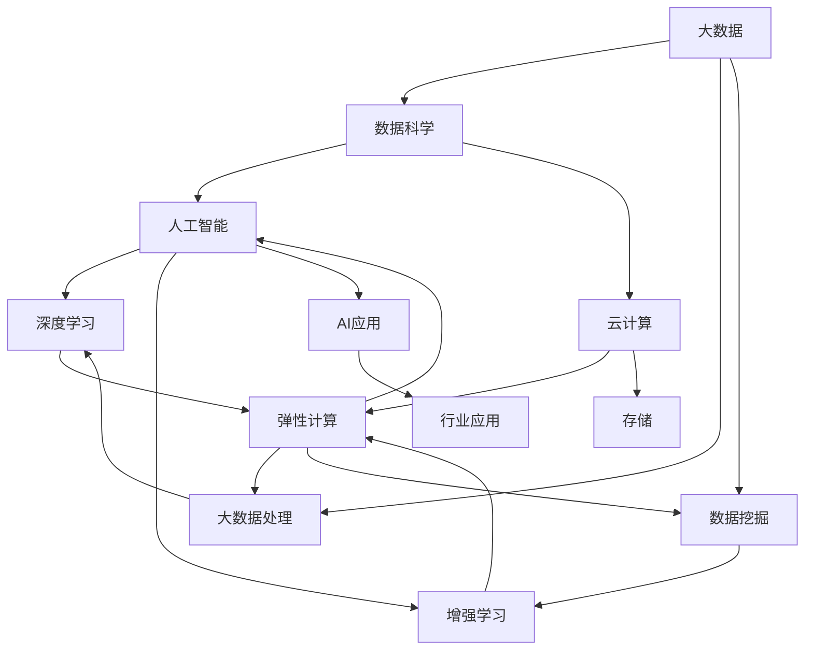
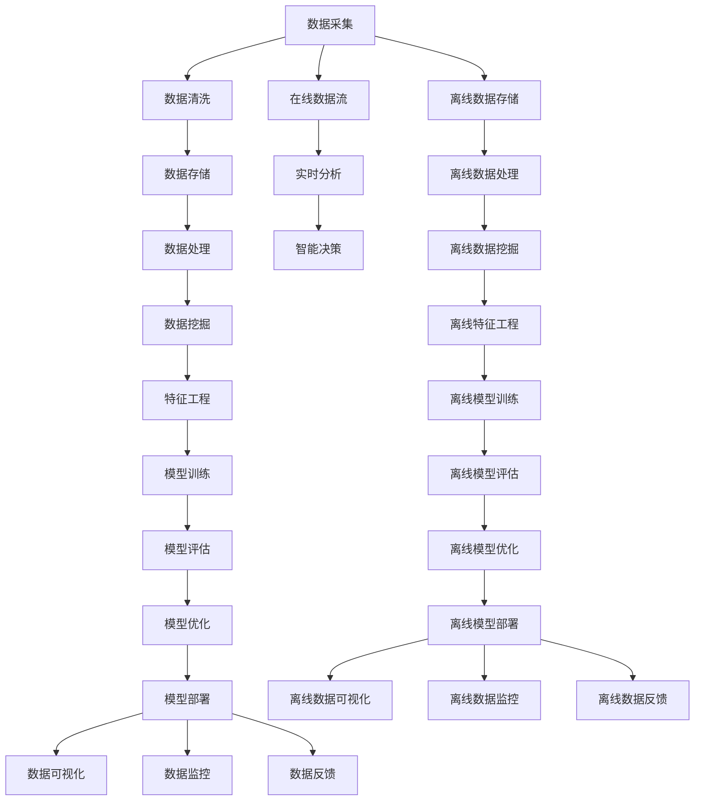

                 

# 大数据与AI的未来发展趋势

## 1. 背景介绍

### 1.1 问题由来
大数据与人工智能（AI）的融合，是21世纪最具变革性的技术趋势之一。随着数据量呈指数级增长，人工智能技术逐渐成为了处理海量数据的重要工具。这种技术的协同进化，使得大数据成为AI的沃土，AI成为大数据的分析利器。

然而，这一领域的快速发展也带来了不少挑战，比如数据隐私、伦理问题、模型可解释性等。为了应对这些问题，专家们对大数据与AI的未来发展趋势进行了深入分析和探讨。本文旨在通过全面的解析，帮助读者理解并掌握这一领域的前沿动态。

### 1.2 问题核心关键点
大数据与AI融合的核心在于数据驱动和智能分析。其核心关键点包括：

- **数据量与质量**：大数据提供了丰富的训练数据，使得AI模型更加健壮。
- **算法与模型**：AI技术不断进化，从传统的统计学方法到深度学习、强化学习等，模型复杂度和可解释性都在不断提升。
- **计算资源**：高性能计算平台（如GPU、TPU）和大数据存储系统（如Hadoop、Spark）为AI算法提供了强大的支持。
- **应用场景**：大数据与AI技术的融合，已经在金融、医疗、智能制造等多个领域得到了广泛应用。

这些关键点构成了大数据与AI融合发展的基石，推动了技术进步和应用拓展。

### 1.3 问题研究意义
研究大数据与AI融合的未来发展趋势，对于指导行业实践、推动技术创新、促进经济社会发展具有重要意义：

1. **技术革新**：通过了解未来的发展趋势，科研人员和工程师可以提前布局，抓住前沿技术，推动技术进步。
2. **行业应用**：了解各行业的具体需求和发展方向，可以更有针对性地开发和部署AI解决方案，提升行业竞争力。
3. **经济效益**：大数据与AI的结合，能够提高数据利用效率，降低运营成本，提升企业盈利能力。
4. **社会影响**：大数据与AI的应用，可以促进社会治理、教育、医疗等领域的创新，提升公共服务质量。
5. **伦理挑战**：对未来趋势的探讨，也有助于预见并应对数据隐私、公平性、伦理道德等方面的挑战。

## 2. 核心概念与联系

### 2.1 核心概念概述

在大数据与AI的融合背景下，涉及多个核心概念，包括：

- **大数据**：指大规模、高速率、多样化、真实性的数据集。通常用于存储和处理海量数据。
- **人工智能**：通过算法和模型，使机器具备模仿人类智能行为的能力，包括学习、推理、决策等。
- **数据科学**：涉及数据的采集、存储、处理、分析和应用等多个环节，是大数据与AI融合的桥梁。
- **深度学习**：一种基于神经网络的机器学习方法，具有强大的模式识别和预测能力。
- **增强学习**：通过智能体与环境的互动，使模型不断优化策略，实现复杂决策。
- **云计算**：提供按需自助、快速弹性的计算资源，支持大数据与AI的大规模计算需求。

这些概念之间存在着紧密的联系，形成了大数据与AI融合的技术生态。

### 2.2 概念间的关系

以下通过一个综合的Mermaid流程图，展示这些核心概念在大数据与AI融合发展中的关系：



这个流程图展示了大数据与AI融合的核心概念及其相互关系：

1. 大数据通过数据科学进行处理，最终用于人工智能算法训练。
2. 人工智能算法包括深度学习和增强学习，深度学习用于模式识别和预测，增强学习用于复杂决策。
3. 云计算提供了必要的计算资源和存储支持，支撑大数据和AI的处理与分析。
4. AI应用可以深入到各行各业，推动行业创新和变革。

### 2.3 核心概念的整体架构

最后，我们通过一个综合的流程图，展示大数据与AI融合的整体架构：



这个流程图展示了大数据与AI融合的完整流程，从数据采集、处理到模型训练、部署和反馈，各个环节的相互关系。

## 3. 核心算法原理 & 具体操作步骤
### 3.1 算法原理概述

大数据与AI融合的核心算法原理主要包括以下几个方面：

- **数据预处理**：包括数据清洗、数据归一化、特征选择等，为模型训练做准备。
- **模型训练**：基于大数据训练AI模型，常用的算法包括深度学习（如神经网络）、增强学习、决策树等。
- **模型评估**：通过验证集或测试集对模型进行评估，常用的指标包括准确率、召回率、F1值等。
- **模型优化**：通过调整模型参数、采用正则化、集成学习等技术，优化模型性能。
- **模型部署**：将训练好的模型部署到生产环境，供实际应用使用。

### 3.2 算法步骤详解

以下详细阐述了大数据与AI融合的核心算法步骤：

1. **数据采集与预处理**：
   - 从不同来源采集数据，如传感器、数据库、API等。
   - 清洗数据，去除噪声和异常值，保证数据质量。
   - 归一化数据，将不同特征值缩放到相同的范围。
   - 特征选择，选取对目标变量有预测能力的特征。

2. **模型训练**：
   - 划分数据集为训练集、验证集和测试集。
   - 选择适当的模型结构，如深度神经网络。
   - 设定合适的训练参数，如学习率、批次大小。
   - 使用优化算法，如梯度下降、Adam等，训练模型。
   - 在验证集上评估模型，调整参数。

3. **模型评估**：
   - 使用测试集对模型进行最终评估。
   - 计算准确率、召回率、F1值等指标。
   - 绘制ROC曲线、混淆矩阵等图表，分析模型性能。

4. **模型优化**：
   - 采用正则化技术，如L1、L2正则。
   - 使用集成学习方法，如随机森林、梯度提升。
   - 调整超参数，如网络层数、节点数、学习率等。

5. **模型部署**：
   - 将模型导出为可部署的格式，如TensorFlow SavedModel。
   - 部署到云平台或本地服务器，供实际使用。
   - 实现API接口，支持实时调用。

### 3.3 算法优缺点

大数据与AI融合的核心算法具有以下优点：

- **精度高**：基于大规模数据训练的模型，具有较高的预测准确性。
- **泛化能力强**：通过数据驱动，模型能够适应新数据。
- **自动化程度高**：模型训练、评估和优化过程自动化，减少了人工干预。

但同时也存在以下缺点：

- **计算资源需求高**：训练大规模模型需要大量的计算资源。
- **数据隐私问题**：大数据采集和存储过程中涉及用户隐私，需要严格保护。
- **模型复杂度高**：复杂的模型难以解释，缺乏可解释性。

### 3.4 算法应用领域

大数据与AI融合的应用领域非常广泛，以下列举几个典型领域：

1. **金融科技**：用于信用评估、风险控制、投资策略等。
2. **医疗健康**：用于疾病诊断、药物研发、个性化治疗等。
3. **智能制造**：用于生产过程优化、设备预测维护等。
4. **智慧城市**：用于交通管理、公共安全、智慧建筑等。
5. **零售电商**：用于用户行为分析、商品推荐、库存管理等。

## 4. 数学模型和公式 & 详细讲解  
### 4.1 数学模型构建

在大数据与AI融合的过程中，涉及多个数学模型，以下以回归模型为例进行详细讲解。

假设数据集为 $D=\{(x_i,y_i)\}_{i=1}^N$，其中 $x_i \in \mathbb{R}^d$ 为特征向量，$y_i \in \mathbb{R}$ 为目标变量。回归模型的目标是找到最优的线性函数 $f(x)=\theta^Tx$，使得模型预测与实际值尽可能接近。

最小化均方误差（Mean Squared Error, MSE）损失函数：

$$
\mathcal{L}(\theta)=\frac{1}{N}\sum_{i=1}^N(y_i-\theta^Tx_i)^2
$$

使用梯度下降算法更新模型参数：

$$
\theta \leftarrow \theta - \eta\nabla_{\theta}\mathcal{L}(\theta)
$$

其中 $\eta$ 为学习率。

### 4.2 公式推导过程

以线性回归模型为例，推导其公式推导过程。

假设模型为 $f(x)=\theta^Tx$，目标为最小化MSE损失函数：

$$
\mathcal{L}(\theta)=\frac{1}{N}\sum_{i=1}^N(y_i-\theta^Tx_i)^2
$$

对 $\theta$ 求偏导：

$$
\frac{\partial \mathcal{L}(\theta)}{\partial \theta_k}=\frac{2}{N}\sum_{i=1}^N(y_i-\theta^Tx_i)(-x_{ik})
$$

令偏导数为0，得到：

$$
\theta^*=\left(\mathbb{X}^T\mathbb{X}\right)^{-1}\mathbb{X}^Ty
$$

其中 $\mathbb{X}=[x_1,x_2,\dots,x_N]$。

通过求解上述线性方程组，可得到最优的回归系数 $\theta^*$。

### 4.3 案例分析与讲解

以房价预测为例，分析回归模型的应用：

假设有一组历史房价数据 $D=\{(x_i,y_i)\}_{i=1}^N$，其中 $x_i$ 为房屋面积、位置、年份等特征，$y_i$ 为房价。

1. **数据预处理**：
   - 数据清洗：去除异常值和噪声。
   - 特征归一化：将不同特征值缩放到相同的范围。
   - 特征选择：选择影响房价的关键因素。

2. **模型训练**：
   - 划分数据集为训练集、验证集和测试集。
   - 构建线性回归模型：$y=f(x)=\theta^Tx$。
   - 选择学习率 $\eta$ 和批次大小 $m$。
   - 使用梯度下降算法，更新模型参数。

3. **模型评估**：
   - 使用测试集评估模型，计算MSE。
   - 绘制ROC曲线，分析模型性能。
   - 计算准确率、召回率、F1值等指标。

4. **模型优化**：
   - 采用L2正则，防止过拟合。
   - 使用集成学习，提高模型稳定性。
   - 调整超参数，如学习率、批次大小等。

5. **模型部署**：
   - 导出模型为TensorFlow SavedModel。
   - 部署到云平台或本地服务器。
   - 实现API接口，支持实时调用。

通过上述案例分析，可以看出，大数据与AI融合的数学模型在实际应用中具有强大的预测能力。

## 5. 项目实践：代码实例和详细解释说明
### 5.1 开发环境搭建

在进行大数据与AI融合的实践前，需要准备好开发环境。以下是使用Python进行PyTorch和TensorFlow开发的配置流程：

1. 安装Anaconda：从官网下载并安装Anaconda，用于创建独立的Python环境。

2. 创建并激活虚拟环境：
```bash
conda create -n pytorch-env python=3.8 
conda activate pytorch-env
```

3. 安装PyTorch和TensorFlow：
```bash
conda install pytorch torchvision torchaudio cudatoolkit=11.1 -c pytorch -c conda-forge
pip install tensorflow
```

4. 安装TensorBoard：
```bash
pip install tensorboard
```

5. 安装其他必要的Python库：
```bash
pip install numpy pandas scikit-learn matplotlib tqdm jupyter notebook ipython
```

完成上述步骤后，即可在`pytorch-env`环境中开始项目实践。

### 5.2 源代码详细实现

以下是使用TensorFlow实现房价预测模型的代码实现：

```python
import tensorflow as tf
from sklearn.model_selection import train_test_split
from sklearn.preprocessing import StandardScaler
import numpy as np

# 加载数据
data = np.loadtxt('data.csv', delimiter=',')
X = data[:, :-1]
y = data[:, -1]

# 数据预处理
scaler = StandardScaler()
X = scaler.fit_transform(X)

# 划分数据集
X_train, X_test, y_train, y_test = train_test_split(X, y, test_size=0.2)

# 构建模型
model = tf.keras.Sequential([
    tf.keras.layers.Dense(64, activation='relu'),
    tf.keras.layers.Dense(64, activation='relu'),
    tf.keras.layers.Dense(1)
])

# 编译模型
model.compile(optimizer=tf.keras.optimizers.Adam(0.001),
              loss='mse',
              metrics=['mae'])

# 训练模型
model.fit(X_train, y_train, epochs=100, batch_size=32)

# 评估模型
loss, mae = model.evaluate(X_test, y_test)
print('Test loss:', loss)
print('Test MAE:', mae)

# 预测房价
new_data = np.array([[2200, 3.5]])
new_data = scaler.transform(new_data)
predicted_price = model.predict(new_data)
print('Predicted price:', predicted_price[0][0])
```

### 5.3 代码解读与分析

以下是关键代码的解读和分析：

1. **数据加载与预处理**：
   - 使用`np.loadtxt`加载数据，并进行分割和预处理。
   - 使用`StandardScaler`标准化特征值，缩小数据范围。

2. **模型构建与编译**：
   - 构建一个包含两个隐藏层的神经网络模型。
   - 使用`tf.keras`定义模型架构。
   - 使用`model.compile`编译模型，设置优化器、损失函数和评估指标。

3. **模型训练与评估**：
   - 使用`model.fit`训练模型，设定训练轮数和批次大小。
   - 使用`model.evaluate`评估模型，输出损失和MAE指标。

4. **模型预测**：
   - 构建一个新的数据样本，使用`scaler.transform`进行预处理。
   - 使用`model.predict`对新数据进行预测，输出预测房价。

## 6. 实际应用场景
### 6.1 智能客服系统

大数据与AI融合技术在大数据智能客服系统中得到了广泛应用。智能客服系统通过分析客户历史数据和行为，自动匹配最合适的客服人员和解决方案，提供24/7全天候服务，极大地提高了客户满意度。

在实践中，可以收集客户的通话记录、聊天记录等数据，构建监督学习任务，训练模型进行意图识别和实体识别。智能客服系统可以实时处理客户咨询，动态生成回复，减少人工客服的负担。

### 6.2 金融风险管理

金融行业对大数据与AI融合的需求尤为迫切。通过分析客户的交易数据、行为数据、社交媒体数据等，可以预测客户的风险偏好，识别潜在的欺诈行为，提升金融风险管理能力。

具体而言，可以收集客户的交易记录、社交媒体互动记录等数据，训练模型进行风险评估和预测。智能系统可以在客户进行交易时，实时分析其风险状态，进行风控预警，防范金融风险。

### 6.3 智能制造

在智能制造领域，大数据与AI融合技术可以优化生产过程，提高设备利用率和产品质量。通过分析设备运行数据、生产工艺数据、质量检测数据等，可以实时监控生产过程，预测设备故障，优化生产计划。

具体而言，可以收集设备的运行数据、生产工艺数据、质量检测数据等，训练模型进行故障预测和优化。智能系统可以实时监控设备状态，预测设备故障，调整生产计划，优化资源配置。

### 6.4 智慧城市

智慧城市是大数据与AI融合的重要应用场景之一。通过分析交通数据、环境数据、气象数据等，可以优化城市交通、提升公共服务质量，改善居民生活环境。

具体而言，可以收集城市的交通数据、环境数据、气象数据等，训练模型进行交通预测、环境监测、灾害预警等。智能系统可以实时监控城市运行状态，优化交通管理，提升公共服务质量。

## 7. 工具和资源推荐
### 7.1 学习资源推荐

为了帮助开发者系统掌握大数据与AI融合的理论基础和实践技巧，这里推荐一些优质的学习资源：

1. **《Python深度学习》书籍**：涵盖Python基础、深度学习算法、TensorFlow和Keras等库的详细讲解，适合初学者。
2. **《深度学习》课程**：斯坦福大学提供的深度学习课程，涵盖了深度学习的基本理论和实践，包括卷积神经网络、循环神经网络等。
3. **《TensorFlow实战》书籍**：全面介绍TensorFlow的使用方法和实战技巧，适合有一定深度学习基础的开发者。
4. **Kaggle平台**：提供各种数据集和竞赛，可以帮助开发者练习实战技能，了解最新数据处理和算法技术。
5. **GitHub项目**：GitHub上有大量开源项目，可以参考和借鉴，提升项目开发能力。

通过这些资源的学习实践，相信你一定能够快速掌握大数据与AI融合的技术精髓，并用于解决实际的业务问题。

### 7.2 开发工具推荐

高效的开发离不开优秀的工具支持。以下是几款用于大数据与AI融合开发的常用工具：

1. **Jupyter Notebook**：一个交互式编程环境，支持Python、R、Scala等语言，非常适合进行数据探索和算法开发。
2. **PySpark**：Apache Spark的Python API，支持大规模数据处理和分析，适合处理大数据。
3. **TensorFlow**：Google开发的深度学习框架，支持分布式计算，适合构建复杂神经网络模型。
4. **Hadoop**：Apache Hadoop的核心组件，支持大规模数据存储和处理。
5. **Keras**：基于TensorFlow的高级神经网络API，适合快速搭建和训练模型。

合理利用这些工具，可以显著提升大数据与AI融合任务的开发效率，加快创新迭代的步伐。

### 7.3 相关论文推荐

大数据与AI融合技术的发展离不开科研人员的不断探索。以下是几篇奠基性的相关论文，推荐阅读：

1. **《Data Mining: Concepts and Techniques》书籍**：由J. Han和M. Kamber合著，介绍了数据挖掘的基本概念、方法和技术，是大数据研究的重要参考资料。
2. **《Deep Learning》书籍**：由Ian Goodfellow等合著，全面介绍了深度学习的基本原理和实现方法，是深度学习领域的经典之作。
3. **《Big Data: Principles and Best Practices of Scalable Realtime Data Systems》书籍**：由J. D. Uhlenberg等合著，介绍了大规模数据系统的设计和实现方法。
4. **《Deep Architectures for AI》论文**：提出了一种基于深度架构的人工智能方法，探讨了如何通过神经网络结构提升模型性能。
5. **《Natural Language Processing with TensorFlow》书籍**：由Manish Chopra和Adnan Darwish合著，介绍了使用TensorFlow进行自然语言处理的实战技巧。

这些论文和书籍代表了大数据与AI融合技术的发展脉络，通过学习这些前沿成果，可以帮助研究者把握学科前进方向，激发更多的创新灵感。

除上述资源外，还有一些值得关注的前沿资源，帮助开发者紧跟大数据与AI融合技术的最新进展，例如：

1. **arXiv论文预印本**：人工智能领域最新研究成果的发布平台，包括大量尚未发表的前沿工作，学习前沿技术的必读资源。
2. **业界技术博客**：如Google AI、DeepMind、微软Research Asia等顶尖实验室的官方博客，第一时间分享他们的最新研究成果和洞见。
3. **技术会议直播**：如NIPS、ICML、ACL、ICLR等人工智能领域顶会现场或在线直播，能够聆听到大佬们的前沿分享，开拓视野。
4. **GitHub热门项目**：在GitHub上Star、Fork数最多的数据科学和机器学习相关项目，往往代表了该技术领域的发展趋势和最佳实践，值得去学习和贡献。
5. **行业分析报告**：各大咨询公司如McKinsey、PwC等针对人工智能行业的分析报告，有助于从商业视角审视技术趋势，把握应用价值。

总之，对于大数据与AI融合技术的学习和实践，需要开发者保持开放的心态和持续学习的意愿。多关注前沿资讯，多动手实践，多思考总结，必将收获满满的成长收益。

## 8. 总结：未来发展趋势与挑战

### 8.1 总结

本文对大数据与AI融合的未来发展趋势进行了全面系统的介绍。首先阐述了大数据与AI融合的研究背景和意义，明确了融合发展在数据驱动和智能分析中的重要作用。其次，从原理到实践，详细讲解了融合的核心算法和操作步骤，给出了实际应用中的代码实例。同时，本文还探讨了大数据与AI融合在多个行业的应用前景，展示了融合技术的广泛应用价值。

通过本文的系统梳理，可以看到，大数据与AI融合技术正在成为数据科学和人工智能领域的重要范式，极大地拓展了数据处理和分析的能力，推动了技术进步和应用拓展。未来，伴随技术的不断演进和应用的深入探索，大数据与AI融合必将在更多领域大放异彩，深刻影响经济社会的发展进程。

### 8.2 未来发展趋势

展望未来，大数据与AI融合技术的发展趋势如下：

1. **数据自动化获取**：通过自动化数据采集和处理，降低数据获取和预处理的成本，提升数据利用效率。
2. **模型可解释性增强**：发展模型可解释性技术，帮助开发者和用户理解模型的决策过程，增强模型的透明性和可信度。
3. **模型跨领域迁移**：通过模型迁移学习，实现不同领域间的知识共享，提升模型的通用性和适应性。
4. **多模态数据融合**：融合视觉、语音、文本等多模态数据，提高模型的感知能力和应用范围。
5. **实时数据处理**：通过分布式计算和大数据平台，实现实时数据处理和分析，提升系统的响应速度和决策效率。

### 8.3 面临的挑战

尽管大数据与AI融合技术已经取得了瞩目成就，但在迈向更加智能化、普适化应用的过程中，仍面临诸多挑战：

1. **数据隐私与安全**：如何保护数据隐私，防止数据泄露和滥用，是大数据应用过程中需要重点关注的问题。
2. **模型鲁棒性**：如何提高模型的鲁棒性，减少对训练数据的依赖，提升模型的泛化能力和稳定性。
3. **模型可解释性**：模型决策过程难以解释，缺乏可解释性，如何提升模型的透明性和可信度，是亟待解决的问题。
4. **计算资源需求**：大规模数据处理和模型训练需要高性能计算资源，如何降低计算成本，提升资源利用率，是工程实践中需要重点关注的问题。

### 8.4 研究展望

面向未来，大数据与AI融合技术的研究展望如下：

1. **深度强化学习**：结合深度学习和强化学习，提升模型的决策能力和学习效率。
2. **联邦学习**：通过分布式计算和隐私保护技术，实现跨机构、跨设备的数据协同学习。
3. **自适应模型**：发展自适应学习算法，使模型能够自动调整参数和结构，适应不同的数据和任务。
4. **迁移学习**：通过知识迁移和数据迁移，提高模型的迁移能力和泛化能力。
5. **可解释性模型**：发展可解释性模型，提升模型的透明性和可信度，增强用户对模型的信任感。

## 9. 附录：常见问题与解答

**Q1：大数据与AI融合的难点是什么？**

A: 大数据与AI融合的难点主要在于数据隐私和安全问题、模型可解释性和鲁棒性不足、计算资源需求高等方面。数据隐私和安全是大数据处理中的重要挑战，模型可解释性和鲁棒性是AI模型面临的主要难题，计算资源需求则制约了技术规模的进一步拓展。

**Q2：如何保护数据隐私？**

A: 保护数据隐私通常采用数据匿名化、数据脱敏

