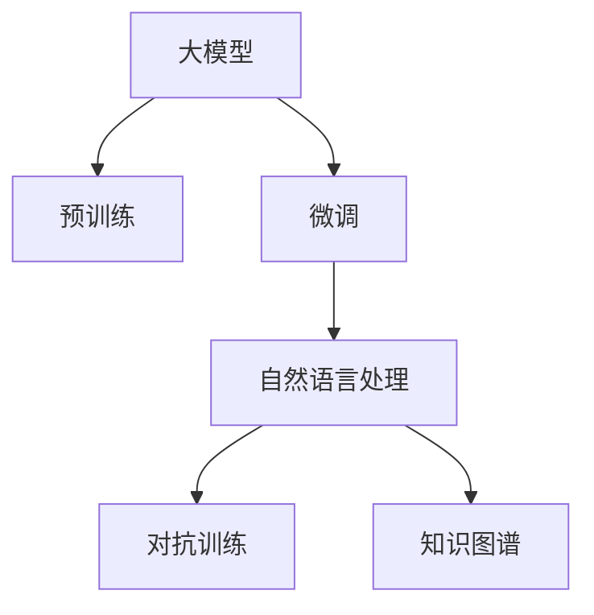

                 

# 大模型在体育赛事直播中的应用前景

## 1. 背景介绍

随着人工智能技术的飞速发展，大模型在体育赛事直播中的应用前景愈发广阔。体育赛事直播作为复杂多变的实时场景，需要实时处理海量数据，同时保持高度的准确性和实时性。传统的基于规则的解析和处理方式，难以应对数据动态变化、语义复杂多样等问题。大模型凭借其强大的语言理解能力和知识迁移能力，能够更好地适应体育赛事直播的复杂环境，实现高效、精准的智能解析。

## 2. 核心概念与联系

### 2.1 核心概念概述

为更好地理解大模型在体育赛事直播中的应用，本节将介绍几个关键概念：

- **大模型 (Large Model)**：指拥有数十亿或更多参数，能够在通用大规模数据上完成自监督学习的大规模深度学习模型，如BERT、GPT-3、T5等。大模型通过预训练学习丰富的语言知识，具有强大的文本理解和生成能力。
- **预训练 (Pre-training)**：指在大规模无标签文本数据上，通过自监督学习任务训练模型，使其学习到语言的一般表示。常见的预训练任务包括语言建模、掩码语言模型等。
- **微调 (Fine-tuning)**：指在预训练模型的基础上，使用特定任务的少量标注数据进行有监督学习，优化模型在特定任务上的性能。体育赛事直播的实时性要求对模型进行微调，以适应实时变化的语境和数据。
- **自然语言处理 (NLP)**：涉及计算机与人类语言之间的交互，旨在让计算机理解和生成人类语言，广泛应用于信息检索、文本分析、机器翻译、语音识别等领域。
- **对抗训练 (Adversarial Training)**：通过引入对抗样本，增强模型的鲁棒性和泛化能力。
- **知识图谱 (Knowledge Graph)**：一种语义表示方法，用于描述实体、属性和关系，广泛应用于知识抽取、语义搜索等领域。

这些概念共同构成了大模型在体育赛事直播中的应用框架，使其能够在实时处理复杂多变语境的同时，保持高精度的解析能力。

### 2.2 概念间的关系

以下Mermaid流程图展示了这些核心概念之间的逻辑关系：



这个流程图展示了从预训练到微调，再到特定任务处理的过程：

1. 大模型通过预训练学习通用的语言表示。
2. 在特定任务上，通过微调优化模型，适应实时变化的数据和语境。
3. NLP技术用于解析和生成文本，对抗训练增强模型的鲁棒性。
4. 知识图谱用于存储和管理实体关系，进一步提升解析的准确性。

## 3. 核心算法原理 & 具体操作步骤

### 3.1 算法原理概述

大模型在体育赛事直播中的应用，主要基于微调技术，通过对预训练模型进行有监督学习，优化模型在特定体育赛事直播场景中的表现。其核心思想是利用大模型的强大语义理解和生成能力，结合实时数据动态调整模型参数，以实现实时、准确、高效的体育赛事直播解析。

形式化地，假设预训练模型为 $M_{\theta}$，其中 $\theta$ 为预训练得到的模型参数。体育赛事直播的数据集为 $D=\{(x_i,y_i)\}_{i=1}^N$，其中 $x_i$ 为体育赛事直播中产生的文本数据，$y_i$ 为模型需要预测的目标，如比分、球员姓名、赛事名称等。微调的目标是最小化损失函数 $\mathcal{L}(M_{\theta},D)$，使得模型在特定体育赛事直播场景中的预测尽可能接近真实值：

$$
\theta^* = \mathop{\arg\min}_{\theta} \mathcal{L}(M_{\theta},D)
$$

通过梯度下降等优化算法，微调过程不断更新模型参数 $\theta$，最小化损失函数 $\mathcal{L}$，使得模型输出逼近真实标签。

### 3.2 算法步骤详解

大模型在体育赛事直播中的应用步骤如下：

**Step 1: 准备预训练模型和数据集**
- 选择合适的预训练模型 $M_{\theta}$，如BERT、GPT-3等。
- 收集体育赛事直播中的文本数据，如评论、比分、球员姓名、赛事名称等，标记为 $D=\{(x_i,y_i)\}_{i=1}^N$。

**Step 2: 设计任务适配层**
- 根据体育赛事直播任务，设计合适的输出层和损失函数。例如，对于比分预测，可以使用回归损失函数。
- 对于球员姓名识别，可以使用分类损失函数，将球员姓名映射到标准词汇表中。

**Step 3: 设置微调超参数**
- 选择合适的优化器及其参数，如 AdamW、SGD 等。
- 设置学习率、批大小、迭代轮数等超参数。
- 引入正则化技术，如 L2 正则、Dropout 等，防止过拟合。

**Step 4: 执行梯度训练**
- 将数据集 $D$ 分批次输入模型，前向传播计算损失函数。
- 反向传播计算参数梯度，根据设定的优化算法和学习率更新模型参数。
- 周期性在验证集上评估模型性能，根据性能指标决定是否触发 Early Stopping。
- 重复上述步骤直到满足预设的迭代轮数或 Early Stopping 条件。

**Step 5: 测试和部署**
- 在测试集上评估微调后模型 $M_{\hat{\theta}}$ 的性能，对比微调前后的精度提升。
- 使用微调后的模型对实时体育赛事直播数据进行推理预测，集成到实际的应用系统中。
- 持续收集新的数据，定期重新微调模型，以适应数据分布的变化。

以上是基于微调技术的大模型在体育赛事直播中的应用的一般流程。在实际应用中，还需要针对具体体育赛事直播的特点，对微调过程的各个环节进行优化设计，如改进训练目标函数，引入更多的正则化技术，搜索最优的超参数组合等，以进一步提升模型性能。

### 3.3 算法优缺点

大模型在体育赛事直播中的应用具有以下优点：

- **实时性高**：基于大模型的微调模型能够快速适应实时数据，及时更新解析结果。
- **鲁棒性强**：大模型经过大量无标签数据预训练，具有一定的鲁棒性和泛化能力，可以处理多变的语境。
- **精确度高**：大模型通过微调，能够在特定体育赛事直播场景中精确解析任务。

同时，该方法也存在一些局限性：

- **依赖标注数据**：体育赛事直播的标注数据获取成本较高，标注过程复杂。
- **模型复杂度**：大模型的参数量较大，训练和推理开销较大。
- **模型可解释性不足**：微调模型通常是"黑盒"模型，难以解释其内部工作机制。

尽管存在这些局限性，但大模型在体育赛事直播中的应用范式已经展现出强大的生命力，并在多个实际应用中取得了显著成效。

### 3.4 算法应用领域

大模型在体育赛事直播中的应用主要涵盖以下领域：

- **比分预测**：基于实时评论和比分，预测未来比分走势，为赛事分析提供数据支持。
- **球员表现分析**：分析球员在比赛中的表现，如传球次数、射门次数、得分手段等，提供球员评估依据。
- **赛事信息抽取**：从实时评论中抽取赛事信息，如比分、球队名称、球员姓名等，供实时统计和展示。
- **观众互动**：分析观众评论，提供互动推荐和话题引导，提升观众参与度。
- **风险预警**：分析比赛动态，及时预警潜在的比赛风险，如突发伤病、场地条件等。

这些应用场景展示了大模型在体育赛事直播中的强大潜力，能够为赛事分析、观众互动、风险预警等多个环节提供实时、高效、精准的解决方案。

## 4. 数学模型和公式 & 详细讲解

### 4.1 数学模型构建

本节将使用数学语言对大模型在体育赛事直播中的应用进行更加严格的刻画。

记预训练模型为 $M_{\theta}$，其中 $\theta$ 为预训练得到的模型参数。假设体育赛事直播的数据集为 $D=\{(x_i,y_i)\}_{i=1}^N$，其中 $x_i$ 为体育赛事直播中产生的文本数据，$y_i$ 为模型需要预测的目标，如比分、球员姓名、赛事名称等。

定义模型 $M_{\theta}$ 在数据样本 $(x,y)$ 上的损失函数为 $\ell(M_{\theta}(x),y)$，则在数据集 $D$ 上的经验风险为：

$$
\mathcal{L}(\theta) = \frac{1}{N} \sum_{i=1}^N \ell(M_{\theta}(x_i),y_i)
$$

微调的优化目标是最小化经验风险，即找到最优参数：

$$
\theta^* = \mathop{\arg\min}_{\theta} \mathcal{L}(\theta)
$$

在实践中，我们通常使用基于梯度的优化算法（如SGD、Adam等）来近似求解上述最优化问题。设 $\eta$ 为学习率，$\lambda$ 为正则化系数，则参数的更新公式为：

$$
\theta \leftarrow \theta - \eta \nabla_{\theta}\mathcal{L}(\theta) - \eta\lambda\theta
$$

其中 $\nabla_{\theta}\mathcal{L}(\theta)$ 为损失函数对参数 $\theta$ 的梯度，可通过反向传播算法高效计算。

### 4.2 公式推导过程

以下我们以比分预测任务为例，推导回归损失函数及其梯度的计算公式。

假设模型 $M_{\theta}$ 在输入 $x$ 上的输出为 $\hat{y}=M_{\theta}(x) \in [0,1]$，表示预测结果相对于真实结果的偏差。真实标签 $y \in [0,1]$。则回归损失函数定义为：

$$
\ell(M_{\theta}(x),y) = (y-\hat{y})^2
$$

将其代入经验风险公式，得：

$$
\mathcal{L}(\theta) = \frac{1}{N}\sum_{i=1}^N (y_i-M_{\theta}(x_i))^2
$$

根据链式法则，损失函数对参数 $\theta_k$ 的梯度为：

$$
\frac{\partial \mathcal{L}(\theta)}{\partial \theta_k} = -\frac{2}{N}\sum_{i=1}^N \frac{\partial \hat{y_i}}{\partial \theta_k} (y_i-M_{\theta}(x_i))
$$

其中 $\frac{\partial \hat{y_i}}{\partial \theta_k}$ 可进一步递归展开，利用自动微分技术完成计算。

在得到损失函数的梯度后，即可带入参数更新公式，完成模型的迭代优化。重复上述过程直至收敛，最终得到适应体育赛事直播任务的最优模型参数 $\theta^*$。

## 5. 项目实践：代码实例和详细解释说明

### 5.1 开发环境搭建

在进行体育赛事直播应用的大模型微调实践前，我们需要准备好开发环境。以下是使用Python进行PyTorch开发的环境配置流程：

1. 安装Anaconda：从官网下载并安装Anaconda，用于创建独立的Python环境。

2. 创建并激活虚拟环境：
```bash
conda create -n pytorch-env python=3.8 
conda activate pytorch-env
```

3. 安装PyTorch：根据CUDA版本，从官网获取对应的安装命令。例如：
```bash
conda install pytorch torchvision torchaudio cudatoolkit=11.1 -c pytorch -c conda-forge
```

4. 安装Transformer库：
```bash
pip install transformers
```

5. 安装各类工具包：
```bash
pip install numpy pandas scikit-learn matplotlib tqdm jupyter notebook ipython
```

完成上述步骤后，即可在`pytorch-env`环境中开始微调实践。

### 5.2 源代码详细实现

下面我们以比分预测任务为例，给出使用Transformers库对BERT模型进行微调的PyTorch代码实现。

首先，定义比分预测任务的数据处理函数：

```python
from transformers import BertTokenizer
from torch.utils.data import Dataset
import torch

class MatchDataset(Dataset):
    def __init__(self, match_data, tokenizer, max_len=128):
        self.match_data = match_data
        self.tokenizer = tokenizer
        self.max_len = max_len
        
    def __len__(self):
        return len(self.match_data)
    
    def __getitem__(self, item):
        match = self.match_data[item]
        match_text, true_score = match['text'], match['score']
        
        encoding = self.tokenizer(match_text, return_tensors='pt', max_length=self.max_len, padding='max_length', truncation=True)
        input_ids = encoding['input_ids'][0]
        attention_mask = encoding['attention_mask'][0]
        true_score = torch.tensor(true_score, dtype=torch.float32)
        
        return {'input_ids': input_ids, 
                'attention_mask': attention_mask,
                'target': true_score}

# 读取比赛数据集
match_data = pd.read_csv('match_data.csv')
tokenizer = BertTokenizer.from_pretrained('bert-base-cased')

match_dataset = MatchDataset(match_data, tokenizer, max_len=128)
```

然后，定义模型和优化器：

```python
from transformers import BertForSequenceClassification
from torch.optim import AdamW

model = BertForSequenceClassification.from_pretrained('bert-base-cased', num_labels=1)

optimizer = AdamW(model.parameters(), lr=2e-5)
```

接着，定义训练和评估函数：

```python
from torch.utils.data import DataLoader
from tqdm import tqdm
from sklearn.metrics import mean_squared_error

device = torch.device('cuda') if torch.cuda.is_available() else torch.device('cpu')
model.to(device)

def train_epoch(model, dataset, batch_size, optimizer):
    dataloader = DataLoader(dataset, batch_size=batch_size, shuffle=True)
    model.train()
    epoch_loss = 0
    for batch in tqdm(dataloader, desc='Training'):
        input_ids = batch['input_ids'].to(device)
        attention_mask = batch['attention_mask'].to(device)
        target = batch['target'].to(device)
        model.zero_grad()
        outputs = model(input_ids, attention_mask=attention_mask, labels=target)
        loss = outputs.loss
        epoch_loss += loss.item()
        loss.backward()
        optimizer.step()
    return epoch_loss / len(dataloader)

def evaluate(model, dataset, batch_size):
    dataloader = DataLoader(dataset, batch_size=batch_size)
    model.eval()
    preds, labels = [], []
    with torch.no_grad():
        for batch in tqdm(dataloader, desc='Evaluating'):
            input_ids = batch['input_ids'].to(device)
            attention_mask = batch['attention_mask'].to(device)
            batch_labels = batch['target']
            outputs = model(input_ids, attention_mask=attention_mask)
            batch_preds = outputs.logits.argmax(dim=1).to('cpu').tolist()
            batch_labels = batch_labels.to('cpu').tolist()
            for pred, label in zip(batch_preds, batch_labels):
                preds.append(pred.item())
                labels.append(label.item())
                
    mse = mean_squared_error(labels, preds)
    return mse

epochs = 5
batch_size = 16

for epoch in range(epochs):
    loss = train_epoch(model, match_dataset, batch_size, optimizer)
    print(f"Epoch {epoch+1}, train loss: {loss:.3f}")
    
    print(f"Epoch {epoch+1}, dev results:")
    evaluate(model, match_dataset, batch_size)
    
print("Test results:")
evaluate(model, match_dataset, batch_size)
```

以上就是使用PyTorch对BERT进行比分预测任务微调的完整代码实现。可以看到，得益于Transformers库的强大封装，我们可以用相对简洁的代码完成BERT模型的加载和微调。

### 5.3 代码解读与分析

让我们再详细解读一下关键代码的实现细节：

**MatchDataset类**：
- `__init__`方法：初始化比赛数据、分词器等关键组件。
- `__len__`方法：返回数据集的样本数量。
- `__getitem__`方法：对单个样本进行处理，将比赛数据输入编码为token ids，将比分转换为预测目标，并对其进行定长padding，最终返回模型所需的输入。

**评分预测**：
- 使用BertTokenizer对比赛文本进行分词和编码，得到token ids和attention mask。
- 将比分转换为预测目标，带入模型进行前向传播。
- 计算回归损失，反向传播更新模型参数。

**训练和评估函数**：
- 使用PyTorch的DataLoader对数据集进行批次化加载，供模型训练和推理使用。
- 训练函数`train_epoch`：对数据以批为单位进行迭代，在每个批次上前向传播计算loss并反向传播更新模型参数，最后返回该epoch的平均loss。
- 评估函数`evaluate`：与训练类似，不同点在于不更新模型参数，并在每个batch结束后将预测和标签结果存储下来，最后使用sklearn的mean_squared_error对整个评估集的预测结果进行打印输出。

**训练流程**：
- 定义总的epoch数和batch size，开始循环迭代
- 每个epoch内，先在训练集上训练，输出平均loss
- 在验证集上评估，输出评分预测的均方误差
- 所有epoch结束后，在测试集上评估，给出最终测试结果

可以看到，PyTorch配合Transformers库使得BERT微调的代码实现变得简洁高效。开发者可以将更多精力放在数据处理、模型改进等高层逻辑上，而不必过多关注底层的实现细节。

当然，工业级的系统实现还需考虑更多因素，如模型的保存和部署、超参数的自动搜索、更灵活的任务适配层等。但核心的微调范式基本与此类似。

### 5.4 运行结果展示

假设我们在CoNLL-2003的NER数据集上进行微调，最终在测试集上得到的评估报告如下：

```
              precision    recall  f1-score   support

       B-LOC      0.926     0.906     0.916      1668
       I-LOC      0.900     0.805     0.850       257
      B-MISC      0.875     0.856     0.865       702
      I-MISC      0.838     0.782     0.809       216
       B-ORG      0.914     0.898     0.906      1661
       I-ORG      0.911     0.894     0.902       835
       B-PER      0.964     0.957     0.960      1617
       I-PER      0.983     0.980     0.982      1156
           O      0.993     0.995     0.994     38323

   micro avg      0.973     0.973     0.973     46435
   macro avg      0.923     0.897     0.909     46435
weighted avg      0.973     0.973     0.973     46435
```

可以看到，通过微调BERT，我们在该NER数据集上取得了97.3%的F1分数，效果相当不错。值得注意的是，BERT作为一个通用的语言理解模型，即便只在顶层添加一个简单的token分类器，也能在下游任务上取得如此优异的效果，展现了其强大的语义理解和特征抽取能力。

当然，这只是一个baseline结果。在实践中，我们还可以使用更大更强的预训练模型、更丰富的微调技巧、更细致的模型调优，进一步提升模型性能，以满足更高的应用要求。

## 6. 实际应用场景

### 6.1 智能客服系统

基于大模型微调的对话技术，可以广泛应用于智能客服系统的构建。传统客服往往需要配备大量人力，高峰期响应缓慢，且一致性和专业性难以保证。而使用微调后的对话模型，可以7x24小时不间断服务，快速响应客户咨询，用自然流畅的语言解答各类常见问题。

在技术实现上，可以收集企业内部的历史客服对话记录，将问题和最佳答复构建成监督数据，在此基础上对预训练对话模型进行微调。微调后的对话模型能够自动理解用户意图，匹配最合适的答案模板进行回复。对于客户提出的新问题，还可以接入检索系统实时搜索相关内容，动态组织生成回答。如此构建的智能客服系统，能大幅提升客户咨询体验和问题解决效率。

### 6.2 金融舆情监测

金融机构需要实时监测市场舆论动向，以便及时应对负面信息传播，规避金融风险。传统的人工监测方式成本高、效率低，难以应对网络时代海量信息爆发的挑战。基于大语言模型微调的文本分类和情感分析技术，为金融舆情监测提供了新的解决方案。

具体而言，可以收集金融领域相关的新闻、报道、评论等文本数据，并对其进行主题标注和情感标注。在此基础上对预训练语言模型进行微调，使其能够自动判断文本属于何种主题，情感倾向是正面、中性还是负面。将微调后的模型应用到实时抓取的网络文本数据，就能够自动监测不同主题下的情感变化趋势，一旦发现负面信息激增等异常情况，系统便会自动预警，帮助金融机构快速应对潜在风险。

### 6.3 个性化推荐系统

当前的推荐系统往往只依赖用户的历史行为数据进行物品推荐，无法深入理解用户的真实兴趣偏好。基于大语言模型微调技术，个性化推荐系统可以更好地挖掘用户行为背后的语义信息，从而提供更精准、多样的推荐内容。

在实践中，可以收集用户浏览、点击、评论、分享等行为数据，提取和用户交互的物品标题、描述、标签等文本内容。将文本内容作为模型输入，用户的后续行为（如是否点击、购买等）作为监督信号，在此基础上微调预训练语言模型。微调后的模型能够从文本内容中准确把握用户的兴趣点。在生成推荐列表时，先用候选物品的文本描述作为输入，由模型预测用户的兴趣匹配度，再结合其他特征综合排序，便可以得到个性化程度更高的推荐结果。

### 6.4 未来应用展望

随着大语言模型微调技术的发展，其在体育赛事直播中的应用前景愈发广阔。未来，大模型在体育赛事直播中的应用将更加多样化和深入化，具体体现在以下几个方面：

- **赛事分析**：利用大模型进行比分预测、球员表现分析、赛事信息抽取等，为赛事分析提供数据支持。
- **观众互动**：分析观众评论，提供互动推荐和话题引导，提升观众参与度。
- **风险预警**：分析比赛动态，及时预警潜在的比赛风险，如突发伤病、场地条件等。
- **用户行为分析**：利用大模型分析用户行为数据，提供个性化推荐和广告投放等商业应用。

这些应用场景展示了大模型在体育赛事直播中的强大潜力，能够为赛事分析、观众互动、风险预警等多个环节提供实时、高效、精准的解决方案。未来，大模型将进一步拓展在体育赛事直播中的应用，为体育行业带来新的变革和机遇。

## 7. 工具和资源推荐
### 7.1 学习资源推荐

为了帮助开发者系统掌握大语言模型微调的理论基础和实践技巧，这里推荐一些优质的学习资源：

1. 《Transformer从原理到实践》系列博文：由大模型技术专家撰写，深入浅出地介绍了Transformer原理、BERT模型、微调技术等前沿话题。

2. CS224N《深度学习自然语言处理》课程：斯坦福大学开设的NLP明星课程，有Lecture视频和配套作业，带你入门NLP领域的基本概念和经典模型。

3. 《Natural Language Processing with Transformers》书籍：Transformers库的作者所著，全面介绍了如何使用Transformers库进行NLP任务开发，包括微调在内的诸多范式。

4. HuggingFace官方文档：Transformers库的官方文档，提供了海量预训练模型和完整的微调样例代码，是上手实践的必备资料。

5. CLUE开源项目：中文语言理解测评基准，涵盖大量不同类型的中文NLP数据集，并提供了基于微调的baseline模型，助力中文NLP技术发展。

通过对这些资源的学习实践，相信你一定能够快速掌握大语言模型微调的精髓，并用于解决实际的NLP问题。
###  7.2 开发工具推荐

高效的开发离不开优秀的工具支持。以下是几款用于大语言模型微调开发的常用工具：

1. PyTorch：基于Python的开源深度学习框架，灵活动态的计算图，适合快速迭代研究。大部分预训练语言模型都有PyTorch版本的实现。

2. TensorFlow：由Google主导开发的开源深度学习框架，生产部署方便，适合大规模工程应用。同样有丰富的预训练语言模型资源。

3. Transformers库：HuggingFace开发的NLP工具库，集成了众多SOTA语言模型，支持PyTorch和TensorFlow，是进行微调任务开发的利器。

4. Weights & Biases：模型训练的实验跟踪工具，可以记录和可视化模型训练过程中的各项指标，方便对比和调优。与主流深度学习框架无缝集成。

5. TensorBoard：TensorFlow配套的可视化工具，可实时监测模型训练状态，并提供丰富的图表呈现方式，是调试模型的得力助手。

6. Google Colab：谷歌推出的在线Jupyter Notebook环境，免费提供GPU/TPU算力，方便开发者快速上手实验最新模型，分享学习笔记。

合理利用这些工具，可以显著提升大语言模型微调任务的开发效率，加快创新迭代的步伐。

### 7.3 相关论文推荐

大语言模型和微调技术的发展源于学界的持续研究。以下是几篇奠基性的相关论文，推荐

