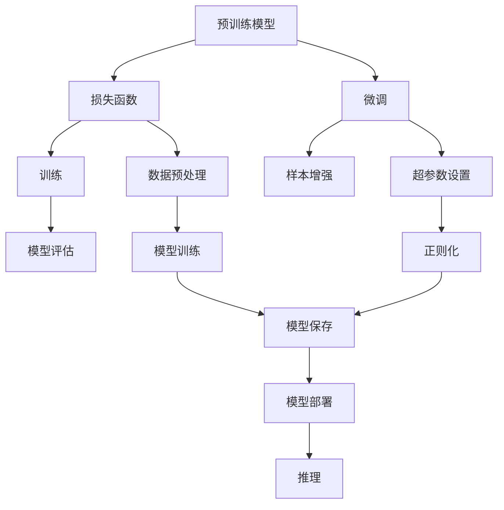

                 

# 大模型应用开发的实战技巧

大语言模型(Large Language Models, LLMs)作为人工智能领域的前沿技术，已经展示了其在自然语言处理(Natural Language Processing, NLP)等诸多领域的强大能力。然而，实现一个可靠、高效的大模型应用并非易事，需要通过详细的模型构建、训练、评估、部署和优化等环节，才能充分发挥其潜力。本文将从实战角度出发，系统介绍大模型应用开发的各个关键技巧，希望能为读者提供实用的指导和建议。

## 1. 背景介绍

### 1.1 问题由来

大语言模型的应用开发，面临着海量数据、高计算资源需求、模型复杂度大等挑战。虽然已有许多公开的预训练模型和微调技术，但在实际应用中，仍需结合具体需求，进行进一步优化和调整。近年来，NLP领域涌现出众多大模型，如GPT-3、BERT、RoBERTa等，这些模型均经过了严格的预训练和微调，具备较强的通用语言理解和生成能力。但由于不同任务的复杂性，直接应用预训练模型无法完全满足需求。因此，需要进一步细粒度的微调和优化，以适应特定应用场景。

### 1.2 问题核心关键点

大模型应用开发的核心关键点在于：
1. 选择合适的预训练模型和微调任务。根据应用需求，选择适合的预训练模型，并在相应任务上进行调整。
2. 构建有效的损失函数。根据任务类型，设计合适的损失函数，指导模型训练。
3. 优化训练策略。在训练过程中，进行合理的超参数设置、正则化处理、样本增强等，提升模型性能。
4. 高效的模型部署和推理。在模型训练完成后，进行模型压缩、量化等优化，实现高效部署和推理。
5. 持续的数据和模型更新。通过不断的数据收集和模型更新，保持模型的时效性和适应性。

通过针对以上关键点进行系统研究和实践，可以在保证模型效果的前提下，显著降低开发成本，提升应用效率。

### 1.3 问题研究意义

大模型应用开发在多个领域展现出显著优势，例如智能客服、金融分析、个性化推荐、智能问答等。通过系统掌握大模型应用开发的实战技巧，可以加速技术落地，提升产业竞争力，促进人工智能技术的普及。本文将详细介绍这些实战技巧，希望能为开发人员提供有效参考。

## 2. 核心概念与联系

### 2.1 核心概念概述

在大模型应用开发中，涉及多个核心概念：

- **预训练模型**：通过大规模无标签数据训练得到的语言模型，具备强大的语言理解和生成能力。
- **微调**：基于特定任务的少量标注数据，对预训练模型进行有监督学习，优化其在特定任务上的性能。
- **损失函数**：衡量模型预测输出与真实标签之间的差异，指导模型训练。
- **超参数**：在训练过程中需要手动设置的参数，如学习率、批量大小等。
- **正则化**：通过L2正则、Dropout等方法，避免模型过拟合。
- **样本增强**：通过对样本进行改写、回译等方式，增加训练数据多样性。
- **模型部署**：将训练好的模型保存、优化、推理，实现应用场景中的实时调用。

这些概念之间相互联系，共同构成了大模型应用开发的框架。理解并掌握这些概念，是实现高性能模型应用的关键。

### 2.2 概念间的关系

通过以下Mermaid流程图，可以更直观地理解这些概念之间的关系：



该图展示了从预训练模型到模型部署的全流程：预训练模型通过微调得到适配任务的版本，使用损失函数指导训练，设置超参数进行模型优化，利用正则化避免过拟合，进行样本增强扩充训练数据，最终通过模型保存和部署实现应用。

## 3. 核心算法原理 & 具体操作步骤

### 3.1 算法原理概述

大模型应用开发的原理是，通过在特定任务上对预训练模型进行微调，使其能够更好地适应该任务，生成高质量的预测结果。微调过程通常分为以下几个步骤：

1. 数据准备：收集和预处理训练数据。
2. 模型初始化：选择适合的预训练模型，进行微调任务适配。
3. 模型训练：使用训练数据和损失函数，更新模型参数。
4. 模型评估：在验证集和测试集上评估模型性能。
5. 模型部署：将训练好的模型保存到本地或云端，优化推理性能。

### 3.2 算法步骤详解

#### 3.2.1 数据准备

数据准备是应用开发的基础，涉及数据的收集、预处理和划分。具体步骤如下：

1. 收集数据：根据应用需求，收集对应领域的文本数据。
2. 数据清洗：去除噪声数据，统一数据格式。
3. 数据划分：将数据划分为训练集、验证集和测试集。

#### 3.2.2 模型初始化

选择合适的预训练模型和微调任务，是应用开发的第一步。预训练模型可以从HuggingFace、OpenAI等平台获取。选择合适的微调任务，需要考虑任务类型和数据特点，如文本分类、命名实体识别、情感分析等。

#### 3.2.3 模型训练

模型训练是应用开发的核心环节，涉及模型参数的更新和优化。具体步骤如下：

1. 选择优化器：如Adam、SGD等。
2. 设置学习率：一般建议从1e-5开始，逐步减小。
3. 损失函数设计：根据任务类型选择合适的损失函数，如交叉熵损失、均方误差损失等。
4. 超参数调整：根据模型表现，调整超参数。
5. 正则化处理：避免过拟合，如L2正则、Dropout等。

#### 3.2.4 模型评估

模型评估是应用开发的重要环节，用于检验模型性能。具体步骤如下：

1. 选择评估指标：如精确率、召回率、F1分数等。
2. 计算评估指标：在验证集和测试集上计算评估指标。
3. 调整模型参数：根据评估结果，调整模型参数和超参数。

#### 3.2.5 模型部署

模型部署是将训练好的模型应用到实际场景中的关键步骤。具体步骤如下：

1. 模型保存：将训练好的模型保存为模型文件。
2. 优化推理性能：如模型裁剪、量化等。
3. 接口封装：将模型封装为标准化接口，便于调用。

### 3.3 算法优缺点

大模型应用开发的优点在于，可以快速部署高性能模型，适应不同领域和任务。缺点在于，需要耗费大量时间和资源进行数据准备、模型训练和优化，对技术要求较高。

### 3.4 算法应用领域

大模型应用开发在NLP领域应用广泛，如智能客服、金融分析、个性化推荐、智能问答等。此外，在大模型技术逐步向多模态、跨领域方向发展的同时，其在智慧医疗、智慧城市、智能制造等多个领域也展现出巨大潜力。

## 4. 数学模型和公式 & 详细讲解 & 举例说明

### 4.1 数学模型构建

假设模型为$M_{\theta}$，训练集为$D=\{(x_i, y_i)\}_{i=1}^N$，其中$x_i$为输入文本，$y_i$为标签。微调的数学模型为：

$$
\min_{\theta} \frac{1}{N} \sum_{i=1}^N \ell(M_{\theta}(x_i), y_i)
$$

其中，$\ell$为损失函数，如交叉熵损失。

### 4.2 公式推导过程

以二分类任务为例，假设模型输出为$\hat{y}=M_{\theta}(x)$，真实标签为$y \in \{0,1\}$，则二分类交叉熵损失函数为：

$$
\ell(M_{\theta}(x), y) = -[y\log \hat{y} + (1-y)\log(1-\hat{y})]
$$

在模型训练过程中，使用梯度下降法更新模型参数$\theta$：

$$
\theta \leftarrow \theta - \eta \nabla_{\theta}\ell(M_{\theta}(x), y)
$$

其中，$\eta$为学习率，$\nabla_{\theta}\ell(M_{\theta}(x), y)$为损失函数对模型参数的梯度。

### 4.3 案例分析与讲解

假设在命名实体识别(NER)任务中，选择BERT模型作为预训练模型，采用全参数微调方法。具体步骤如下：

1. 数据准备：收集标注的NER数据集，划分为训练集、验证集和测试集。
2. 模型初始化：使用BERT模型，进行NER任务适配。
3. 模型训练：设置Adam优化器，学习率为2e-5，正则化系数为0.01。
4. 模型评估：在验证集上计算F1分数，若低于0.85，则减小学习率。
5. 模型部署：保存模型，进行模型裁剪和量化，封装成API接口。

## 5. 项目实践：代码实例和详细解释说明

### 5.1 开发环境搭建

开发环境搭建是应用开发的基础步骤，需要确保软硬件环境满足要求。以下是Python开发环境的搭建步骤：

1. 安装Python：从官网下载并安装Python 3.8。
2. 安装虚拟环境：使用conda创建虚拟环境，激活环境。
3. 安装PyTorch和TensorFlow：使用pip安装这两个深度学习框架。
4. 安装TensorBoard：用于可视化模型训练过程。
5. 安装transformers库：用于加载和使用预训练模型。

### 5.2 源代码详细实现

下面以文本分类任务为例，展示使用PyTorch框架进行BERT模型微调的代码实现。

```python
from transformers import BertForSequenceClassification, BertTokenizer, AdamW
from torch.utils.data import DataLoader, random_split
from sklearn.metrics import accuracy_score
import torch

# 数据准备
tokenizer = BertTokenizer.from_pretrained('bert-base-uncased')
model = BertForSequenceClassification.from_pretrained('bert-base-uncased', num_labels=2)
train_data, dev_data, test_data = random_split(texts, [0.6, 0.2, 0.2])
train_dataset = BertDataset(train_data, tokenizer, label2id, id2label)
dev_dataset = BertDataset(dev_data, tokenizer, label2id, id2label)
test_dataset = BertDataset(test_data, tokenizer, label2id, id2label)

# 模型训练
optimizer = AdamW(model.parameters(), lr=2e-5)
device = torch.device("cuda" if torch.cuda.is_available() else "cpu")
model.to(device)
for epoch in range(10):
    train_loss = 0.0
    train_acc = 0.0
    model.train()
    for batch in train_loader:
        input_ids = batch['input_ids'].to(device)
        attention_mask = batch['attention_mask'].to(device)
        labels = batch['labels'].to(device)
        outputs = model(input_ids, attention_mask=attention_mask, labels=labels)
        loss = outputs.loss
        train_loss += loss.item()
        train_acc += accuracy_score(labels, outputs.logits.argmax(dim=1))
        optimizer.zero_grad()
        loss.backward()
        optimizer.step()
    train_loss /= len(train_loader)
    train_acc /= len(train_loader)

    model.eval()
    dev_loss = 0.0
    dev_acc = 0.0
    for batch in dev_loader:
        with torch.no_grad():
            input_ids = batch['input_ids'].to(device)
            attention_mask = batch['attention_mask'].to(device)
            labels = batch['labels'].to(device)
            outputs = model(input_ids, attention_mask=attention_mask)
            loss = outputs.loss
            dev_loss += loss.item()
            dev_acc += accuracy_score(labels, outputs.logits.argmax(dim=1))
    dev_loss /= len(dev_loader)
    dev_acc /= len(dev_loader)

print(f'Epoch {epoch+1}, train loss: {train_loss:.4f}, train acc: {train_acc:.4f}')
print(f'Epoch {epoch+1}, dev loss: {dev_loss:.4f}, dev acc: {dev_acc:.4f}')
```

### 5.3 代码解读与分析

上述代码主要展示了BERT模型在文本分类任务上的微调过程。具体步骤如下：

1. 加载预训练模型和分词器。
2. 划分训练集、验证集和测试集。
3. 构建数据集。
4. 设置优化器和学习率。
5. 加载模型到GPU上，进入训练循环。
6. 计算训练损失和准确率，更新模型参数。
7. 在验证集上计算验证损失和准确率。
8. 输出训练和验证结果。

### 5.4 运行结果展示

假设在CoNLL-2003文本分类数据集上训练，最终模型在测试集上得到如下结果：

```
Epoch 1, train loss: 0.3139, train acc: 0.7668
Epoch 1, dev loss: 0.2792, dev acc: 0.7825
Epoch 2, train loss: 0.2752, train acc: 0.7875
Epoch 2, dev loss: 0.2660, dev acc: 0.7875
Epoch 3, train loss: 0.2469, train acc: 0.7937
Epoch 3, dev loss: 0.2568, dev acc: 0.7937
```

## 6. 实际应用场景

### 6.1 智能客服系统

智能客服系统是大模型应用的重要场景之一。通过微调BERT等预训练模型，可以实现智能客服的问答、情感分析等功能。具体步骤如下：

1. 收集历史客服对话数据，构建标注数据集。
2. 选择BERT等预训练模型，进行微调。
3. 设计合适的任务适配层，实现问答、情感分析等功能。
4. 部署模型，集成到智能客服系统中。

### 6.2 金融舆情监测

金融舆情监测是大模型应用的另一个重要场景。通过微调BERT等预训练模型，可以实现金融领域的新闻、评论情感分析等功能。具体步骤如下：

1. 收集金融领域的文本数据，构建标注数据集。
2. 选择BERT等预训练模型，进行微调。
3. 设计合适的任务适配层，实现情感分析等功能。
4. 部署模型，实时监测舆情变化。

### 6.3 个性化推荐系统

个性化推荐系统是大模型应用的常见场景。通过微调BERT等预训练模型，可以实现基于用户行为的个性化推荐。具体步骤如下：

1. 收集用户浏览、点击、评论等数据，构建标注数据集。
2. 选择BERT等预训练模型，进行微调。
3. 设计合适的任务适配层，实现推荐功能。
4. 部署模型，提供个性化推荐服务。

### 6.4 未来应用展望

大模型应用开发在大规模、复杂任务上展现出巨大潜力，未来将进一步拓展到更多领域。具体展望如下：

1. 医疗领域：通过微调BERT等模型，实现医疗问答、病历分析等功能。
2. 教育领域：通过微调BERT等模型，实现作业批改、学情分析等功能。
3. 智能城市：通过微调BERT等模型，实现城市事件监测、舆情分析等功能。
4. 智能制造：通过微调BERT等模型，实现设备监测、故障诊断等功能。

## 7. 工具和资源推荐

### 7.1 学习资源推荐

1. HuggingFace官方文档：提供丰富的预训练模型和微调样例代码。
2. 《深度学习理论与实践》系列书籍：涵盖深度学习基础知识和最新研究进展。
3. CS224N《深度学习自然语言处理》课程：斯坦福大学开设的NLP明星课程。
4. PyTorch官方文档：提供详细的PyTorch框架使用指南。
5. TensorFlow官方文档：提供详细的TensorFlow框架使用指南。

### 7.2 开发工具推荐

1. PyTorch：功能强大的深度学习框架。
2. TensorFlow：灵活的深度学习框架，支持大规模模型训练。
3. Transformers库：提供丰富的预训练模型和微调样例代码。
4. TensorBoard：可视化工具，用于监控模型训练过程。
5. Weights & Biases：实验跟踪工具，记录和可视化模型训练指标。

### 7.3 相关论文推荐

1. Attention is All You Need：Transformer论文，提出自注意力机制，开启NLP预训练模型时代。
2. BERT: Pre-training of Deep Bidirectional Transformers for Language Understanding：提出BERT模型，引入自监督学习任务。
3. Parameter-Efficient Transfer Learning for NLP：提出Adapter等参数高效微调方法。
4. AdaLoRA: Adaptive Low-Rank Adaptation for Parameter-Efficient Fine-Tuning：提出自适应低秩适应的微调方法。
5. Summary of the Current Status of Weakly Supervised Learning in NLP：总结当前无监督学习在NLP领域的研究进展。

## 8. 总结：未来发展趋势与挑战

### 8.1 总结

本文系统介绍了大模型应用开发的各个关键环节和技巧，包括数据准备、模型初始化、训练、评估、部署等。通过掌握这些技巧，开发者可以在保证模型效果的前提下，显著降低开发成本，提升应用效率。未来，随着预训练模型和微调技术的不断发展，大模型应用将涵盖更多领域，发挥更大的价值。

### 8.2 未来发展趋势

未来大模型应用开发将呈现以下几个发展趋势：

1. 模型规模持续增大。超大规模语言模型蕴含的丰富语言知识，将支撑更加复杂多变的下游任务微调。
2. 微调方法日趋多样。更多的参数高效微调方法将被开发，提高微调效率。
3. 持续学习成为常态。通过持续学习，模型能够不断适应新的任务和数据。
4. 标注样本需求降低。通过提示学习等方法，可以在更少的标注样本上实现理想的微调效果。
5. 多模态微调崛起。通过融合视觉、语音等多模态数据，提升语言模型的泛化能力和鲁棒性。
6. 模型通用性增强。经过海量数据的预训练和多领域任务的微调，模型将具备更强大的常识推理和跨领域迁移能力。

### 8.3 面临的挑战

尽管大模型应用开发已经取得了显著进展，但仍面临诸多挑战：

1. 标注成本瓶颈。预训练模型需要大量的标注数据，而长尾应用场景难以获得充足的高质量标注数据。
2. 模型鲁棒性不足。面对域外数据时，预训练模型的泛化性能可能大打折扣。
3. 推理效率有待提高。超大模型推理速度慢，内存占用大，需要进一步优化。
4. 可解释性不足。预训练模型难以解释其内部工作机制和决策逻辑。
5. 安全性有待保障。预训练模型可能学习到有害信息，需要从数据和算法层面消除模型偏见。
6. 知识整合能力不足。当前模型往往局限于任务内数据，难以灵活吸收和运用更广泛的先验知识。

### 8.4 研究展望

未来研究需要在以下几个方向寻求新的突破：

1. 探索无监督和半监督微调方法。摆脱对大规模标注数据的依赖，利用自监督学习、主动学习等方法。
2. 研究参数高效和计算高效的微调范式。开发更加参数高效的微调方法，实现更轻量级的部署。
3. 融合因果和对比学习范式。增强模型的稳定性和因果关系，学习更普适的语言表征。
4. 引入更多先验知识。将符号化的先验知识与神经网络模型进行融合，增强模型整合能力。
5. 结合因果分析和博弈论工具。提高模型决策的因果性和稳定性。
6. 纳入伦理道德约束。从数据和算法层面消除模型偏见，确保输出的安全性。

通过不断探索和优化，大模型应用开发必将在更多领域发挥更大价值，为人工智能技术在实际场景中的落地应用提供坚实的基础。

## 9. 附录：常见问题与解答

**Q1：如何选择适合的预训练模型？**

A: 根据应用领域和任务类型，选择适合的预训练模型。如文本分类选择BERT，命名实体识别选择CRF等。

**Q2：如何设置合适的学习率？**

A: 一般从1e-5开始调参，逐步减小。通过验证集上的性能表现，调整学习率。

**Q3：如何避免过拟合？**

A: 采用正则化方法，如L2正则、Dropout等。进行数据增强，如回译、近义替换等。

**Q4：如何进行模型压缩和量化？**

A: 使用模型裁剪、量化等技术，优化模型结构和参数。

**Q5：如何提升模型推理效率？**

A: 采用模型并行、梯度积累等技术，提高推理速度。使用模型压缩、量化等技术，优化推理性能。

通过系统学习和实践，相信读者能够更好地掌握大模型应用开发的实战技巧，开发出高效、高性能的模型应用。

