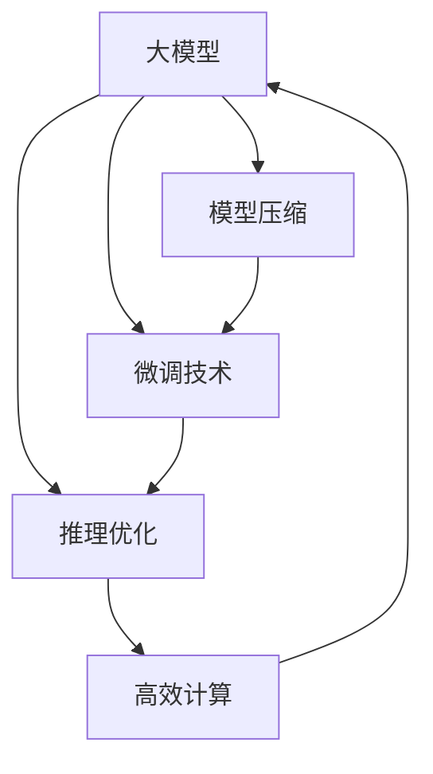

                 

# 大模型应用落地加速，AI商业化进程提速

在人工智能(AI)技术的不断演进中，大模型（Large Model）的应用已经从学术研究向产业落地快速转变。大模型的落地不仅能够提升业务效率、增强用户体验，还推动了AI技术的商业化进程。本文将深入探讨大模型应用落地的关键技术、实际应用场景以及未来发展趋势，以期为AI技术的进一步普及和应用提供理论支持和实践指导。

## 1. 背景介绍

### 1.1 问题由来
近年来，深度学习模型的参数量急剧增长，从最初的几百万到如今的数十亿甚至上百亿，大模型（如BERT、GPT-3、T5等）成为AI研究的热点。大模型通常经过大规模无标签数据预训练，学习到丰富的语言知识和常识，通过少量的有标签数据进行微调，能够快速适应特定任务，显著提升模型性能。

然而，大模型的应用落地面临诸多挑战。首先，模型参数量巨大，对硬件和算力要求极高。其次，模型性能依赖于大量的标注数据，而标注数据获取成本高昂。此外，模型推理速度慢，难以满足实时性要求。因此，如何高效地将大模型落地应用，成为一个重要课题。

### 1.2 问题核心关键点
要加速大模型应用落地，需要从模型压缩、微调、推理优化等多个维度进行综合优化。以下是几个核心关键点：

- **模型压缩**：减小模型参数量，降低硬件资源需求，提升推理效率。
- **微调技术**：利用少量标注数据进行快速适应，提升模型精度。
- **推理优化**：改进模型结构和算法，提升推理速度和精度。
- **高效计算**：引入并行计算和分布式训练技术，加速模型训练。

解决这些关键问题，可以显著降低大模型的落地成本，加速AI技术的商业化进程。

## 2. 核心概念与联系

### 2.1 核心概念概述

- **大模型**：指参数量达数亿乃至数十亿的深度学习模型，如BERT、GPT-3、T5等，经过大规模无标签数据预训练，学习到丰富的语言知识和常识。
- **模型压缩**：通过量化、剪枝、蒸馏等技术，减小模型参数量，降低计算资源需求。
- **微调技术**：在大模型基础上，利用少量标注数据进行任务特定优化，提升模型性能。
- **推理优化**：改进模型结构和算法，提升推理速度和精度。
- **高效计算**：采用并行计算、分布式训练等技术，加速模型训练和推理。

这些概念之间相互关联，共同构成了大模型应用落地的完整框架。

### 2.2 概念间的关系

这些核心概念之间的关系可以用以下Mermaid流程图表示：



该流程图展示了从大模型到实际应用的完整流程。首先，对大模型进行压缩和优化，然后通过微调技术适应特定任务，最后通过高效计算加速模型推理和训练。

## 3. 核心算法原理 & 具体操作步骤

### 3.1 算法原理概述

大模型应用落地的关键在于如何在大模型的基础上进行高效地微调和推理。以下是几个主要步骤：

1. **模型压缩**：采用量化、剪枝、蒸馏等技术，减小模型参数量。
2. **微调技术**：利用少量标注数据进行快速适应，提升模型精度。
3. **推理优化**：改进模型结构和算法，提升推理速度和精度。
4. **高效计算**：采用并行计算、分布式训练等技术，加速模型训练和推理。

### 3.2 算法步骤详解

#### 3.2.1 模型压缩

模型压缩主要包括量化、剪枝和蒸馏三种技术：

- **量化**：将浮点数模型转换为定点数模型，减小存储需求和计算量。常见的量化技术包括均匀量化和非均匀量化。
- **剪枝**：去除冗余的参数和连接，减小模型规模。剪枝分为结构剪枝和权重剪枝两种方式。
- **蒸馏**：将大规模模型（教师模型）的知识迁移到较小模型（学生模型），减小模型规模。

#### 3.2.2 微调技术

微调技术主要分为全参数微调和参数高效微调（PEFT）：

- **全参数微调**：更新所有参数以适应新任务。适用于标注数据量较大时，但计算成本较高。
- **参数高效微调**：仅更新任务相关的少量参数，如Adapter、LoRA等，减小微调成本。

#### 3.2.3 推理优化

推理优化主要通过模型结构和算法的改进来实现：

- **模型结构**：采用更轻量级的模型结构，如MobileBERT、SwinBERT等。
- **算法优化**：改进推理算法，如利用快速解码算法、并行推理等。

#### 3.2.4 高效计算

高效计算主要通过并行计算和分布式训练来实现：

- **并行计算**：利用GPU、TPU等硬件进行并行计算，提升推理速度。
- **分布式训练**：将模型分布到多个计算节点上进行训练，加速模型优化。

### 3.3 算法优缺点

#### 3.3.1 模型压缩

**优点**：
- 减小模型参数量，降低硬件资源需求。
- 提升推理速度和效率。

**缺点**：
- 压缩后模型精度可能下降。
- 压缩算法复杂，实现难度较大。

#### 3.3.2 微调技术

**优点**：
- 利用少量标注数据进行快速适应，提升模型精度。
- 适应性强，可以适应各种NLP任务。

**缺点**：
- 依赖标注数据，获取成本高昂。
- 过拟合风险较高。

#### 3.3.3 推理优化

**优点**：
- 提升推理速度和精度。
- 降低计算资源需求。

**缺点**：
- 优化过程复杂，需要大量实验和调参。
- 可能影响模型性能。

#### 3.3.4 高效计算

**优点**：
- 加速模型训练和推理，提高业务效率。
- 降低计算成本。

**缺点**：
- 分布式训练和并行计算技术复杂，实现难度较大。
- 硬件资源需求较高。

## 4. 数学模型和公式 & 详细讲解 & 举例说明

### 4.1 数学模型构建

假设大模型为 $M_{\theta}$，微调任务为 $T$，标注数据集为 $D=\{(x_i,y_i)\}_{i=1}^N$。

定义模型在数据样本 $(x,y)$ 上的损失函数为 $\ell(M_{\theta}(x),y)$，则经验风险为：

$$
\mathcal{L}(\theta) = \frac{1}{N}\sum_{i=1}^N \ell(M_{\theta}(x_i),y_i)
$$

### 4.2 公式推导过程

以全参数微调为例，微调过程的目标是最小化经验风险：

$$
\theta^* = \mathop{\arg\min}_{\theta} \mathcal{L}(\theta)
$$

通过梯度下降等优化算法，更新模型参数：

$$
\theta \leftarrow \theta - \eta \nabla_{\theta}\mathcal{L}(\theta)
$$

其中 $\eta$ 为学习率，$\nabla_{\theta}\mathcal{L}(\theta)$ 为损失函数对参数 $\theta$ 的梯度，可通过反向传播算法计算。

### 4.3 案例分析与讲解

假设任务为文本分类，模型为BERT，使用交叉熵损失函数：

$$
\ell(M_{\theta}(x),y) = -[y\log M_{\theta}(x_i)+(1-y)\log(1-M_{\theta}(x_i))]
$$

## 5. 项目实践：代码实例和详细解释说明

### 5.1 开发环境搭建

开发环境搭建步骤如下：

1. 安装Anaconda：从官网下载并安装Anaconda，用于创建独立的Python环境。

2. 创建并激活虚拟环境：
```bash
conda create -n pytorch-env python=3.8 
conda activate pytorch-env
```

3. 安装PyTorch：根据CUDA版本，从官网获取对应的安装命令。例如：
```bash
conda install pytorch torchvision torchaudio cudatoolkit=11.1 -c pytorch -c conda-forge
```

4. 安装Transformers库：
```bash
pip install transformers
```

5. 安装各类工具包：
```bash
pip install numpy pandas scikit-learn matplotlib tqdm jupyter notebook ipython
```

完成上述步骤后，即可在`pytorch-env`环境中开始微调实践。

### 5.2 源代码详细实现

我们以BERT模型进行文本分类任务为例，展示微调的代码实现。

首先，定义数据集和模型：

```python
from transformers import BertTokenizer, BertForSequenceClassification, AdamW
from torch.utils.data import Dataset, DataLoader

class TextDataset(Dataset):
    def __init__(self, texts, labels, tokenizer):
        self.texts = texts
        self.labels = labels
        self.tokenizer = tokenizer
        
    def __len__(self):
        return len(self.texts)
    
    def __getitem__(self, item):
        text = self.texts[item]
        label = self.labels[item]
        
        encoding = self.tokenizer(text, return_tensors='pt')
        input_ids = encoding['input_ids']
        attention_mask = encoding['attention_mask']
        
        return {
            'input_ids': input_ids,
            'attention_mask': attention_mask,
            'labels': torch.tensor(label, dtype=torch.long)
        }

tokenizer = BertTokenizer.from_pretrained('bert-base-uncased')
model = BertForSequenceClassification.from_pretrained('bert-base-uncased', num_labels=2)
```

然后，定义优化器和训练函数：

```python
optimizer = AdamW(model.parameters(), lr=2e-5)

def train(model, train_dataset, val_dataset, epochs, batch_size):
    device = 'cuda'
    model.to(device)
    
    for epoch in range(epochs):
        model.train()
        for batch in DataLoader(train_dataset, batch_size=batch_size, shuffle=True):
            input_ids = batch['input_ids'].to(device)
            attention_mask = batch['attention_mask'].to(device)
            labels = batch['labels'].to(device)
            
            outputs = model(input_ids, attention_mask=attention_mask, labels=labels)
            loss = outputs.loss
            
            optimizer.zero_grad()
            loss.backward()
            optimizer.step()
            
        model.eval()
        with torch.no_grad():
            correct = 0
            total = 0
            for batch in DataLoader(val_dataset, batch_size=batch_size):
                input_ids = batch['input_ids'].to(device)
                attention_mask = batch['attention_mask'].to(device)
                labels = batch['labels'].to(device)
                
                outputs = model(input_ids, attention_mask=attention_mask)
                logits = outputs.logits
                predicted_labels = logits.argmax(dim=1).to('cpu')
                
                correct += (predicted_labels == labels).sum().item()
                total += predicted_labels.shape[0]
                
            acc = correct / total
            print(f'Epoch {epoch+1}, val acc: {acc:.4f}')
```

最后，启动训练流程：

```python
epochs = 3
batch_size = 16

train(model, train_dataset, val_dataset, epochs, batch_size)
```

## 6. 实际应用场景

### 6.1 智能客服系统

智能客服系统可以应用大模型进行快速搭建。传统客服需要大量人工，高峰期响应速度慢，且服务质量难以保障。使用大模型进行微调，可以24/7全天候服务，提升响应速度和用户满意度。

具体实现上，可以收集历史客服对话记录，进行微调。微调后的模型能够自动理解用户意图，匹配最佳答复，提供快速高效的服务。

### 6.2 金融舆情监测

金融机构需要实时监测舆情动向，以规避金融风险。传统人工监测方式成本高、效率低。使用大模型进行微调，可以实时监测舆情，快速发现负面信息。

具体实现上，可以收集金融领域的文本数据，进行微调。微调后的模型能够自动分析舆情情绪，及时预警金融风险，辅助金融机构决策。

### 6.3 个性化推荐系统

推荐系统依赖用户历史行为数据进行推荐，难以深入挖掘用户兴趣。使用大模型进行微调，可以更全面地理解用户兴趣，提供个性化推荐。

具体实现上，可以收集用户浏览、点击、评论数据，进行微调。微调后的模型能够从文本中提取用户兴趣，生成个性化推荐结果。

### 6.4 未来应用展望

未来，大模型将在更多领域落地应用。以下展望几个未来应用方向：

1. **智慧医疗**：大模型可以用于医疗问答、病历分析、药物研发等，提升医疗服务智能化水平。
2. **智能教育**：微调后的模型可以用于作业批改、学情分析、知识推荐等，提升教育公平性。
3. **智慧城市**：用于城市事件监测、舆情分析、应急指挥等，提升城市管理效率。

## 7. 工具和资源推荐

### 7.1 学习资源推荐

为了快速掌握大模型微调技术，推荐以下学习资源：

1. 《Transformer从原理到实践》系列博文：深入浅出地介绍Transformer原理、BERT模型、微调技术等。
2. CS224N《深度学习自然语言处理》课程：斯坦福大学开设的NLP明星课程，提供Lecture视频和配套作业。
3. 《Natural Language Processing with Transformers》书籍：介绍如何使用Transformers库进行NLP任务开发。
4. HuggingFace官方文档：提供丰富的预训练模型和微调样例代码。
5. CLUE开源项目：涵盖大量不同类型的中文NLP数据集和微调baseline。

### 7.2 开发工具推荐

常用的开发工具包括：

1. PyTorch：基于Python的深度学习框架，灵活动态的计算图。
2. TensorFlow：由Google主导的深度学习框架，生产部署方便。
3. Transformers库：HuggingFace开发的NLP工具库，集成了众多SOTA语言模型。
4. Weights & Biases：实验跟踪工具，记录和可视化模型训练过程。
5. TensorBoard：可视化工具，监测模型训练状态。
6. Google Colab：免费提供的Jupyter Notebook环境，方便实验和分享。

### 7.3 相关论文推荐

推荐以下几篇奠基性的相关论文：

1. Attention is All You Need（Transformer原论文）：提出Transformer结构，开启大模型时代。
2. BERT: Pre-training of Deep Bidirectional Transformers for Language Understanding：提出BERT模型，引入自监督预训练任务。
3. Language Models are Unsupervised Multitask Learners（GPT-2论文）：展示大模型的零样本学习能力。
4. Parameter-Efficient Transfer Learning for NLP：提出Adapter等参数高效微调方法。
5. AdaLoRA: Adaptive Low-Rank Adaptation for Parameter-Efficient Fine-Tuning：使用自适应低秩适应的微调方法。

## 8. 总结：未来发展趋势与挑战

### 8.1 研究成果总结

本文深入探讨了大模型应用落地的关键技术，包括模型压缩、微调技术、推理优化和高效计算。通过详细的算法步骤和实际应用场景，展示了大模型在智能客服、金融舆情、个性化推荐等领域的落地应用。

### 8.2 未来发展趋势

未来大模型应用落地的趋势包括：

1. **模型规模持续增大**：超大规模语言模型有望支撑更加复杂多变的下游任务微调。
2. **微调方法日趋多样**：引入更多的参数高效微调方法，减小微调成本。
3. **持续学习成为常态**：微调模型需要持续学习新知识，保持性能。
4. **少样本学习崛起**：利用更少的标注样本进行微调。
5. **多模态微调崛起**：融合视觉、语音等多模态数据进行微调。
6. **模型通用性增强**：学习更普适、鲁棒的语言表征。

### 8.3 面临的挑战

尽管大模型应用落地取得了显著进展，但仍面临诸多挑战：

1. **标注成本瓶颈**：获取高质量标注数据成本高昂。
2. **模型鲁棒性不足**：面对域外数据泛化性能差。
3. **推理效率有待提高**：推理速度和资源占用问题。
4. **可解释性亟需加强**：模型决策过程缺乏可解释性。
5. **安全性有待保障**：避免模型输出偏见和有害信息。
6. **知识整合能力不足**：难以灵活吸收和运用先验知识。

### 8.4 研究展望

未来需要在以下方面进行研究：

1. **探索无监督和半监督微调方法**：降低标注成本，利用自监督学习等方法。
2. **研究参数高效和计算高效的微调范式**：在固定大部分预训练参数的情况下，更新少量任务相关参数。
3. **引入因果和对比学习范式**：增强模型泛化能力和鲁棒性。
4. **引入更多先验知识**：与知识图谱、逻辑规则等结合，提升模型性能。
5. **结合因果分析和博弈论工具**：增强模型稳定性和鲁棒性。
6. **纳入伦理道德约束**：过滤和惩罚有偏见、有害的输出。

这些研究方向将引领大模型微调技术迈向更高台阶，推动AI技术的进一步普及和应用。

## 9. 附录：常见问题与解答

**Q1：大模型微调适用于所有NLP任务吗？**

A: 大模型微调在大多数NLP任务上都能取得不错的效果，特别是对于数据量较小的任务。但对于一些特定领域的任务，如医学、法律等，微调效果可能不如预训练模型。

**Q2：微调过程中如何选择学习率？**

A: 微调学习率一般比预训练时小1-2个数量级。建议使用warmup策略，在开始阶段使用较小的学习率，逐步过渡到预设值。

**Q3：微调模型在落地部署时需要注意哪些问题？**

A: 需要注意模型裁剪、量化加速、服务化封装、弹性伸缩、监控告警、安全防护等。这些环节的优化，可以显著提升模型部署效率和用户体验。

**Q4：微调过程中如何避免过拟合？**

A: 常见方法包括数据增强、正则化、对抗训练等。在微调过程中，需要灵活应用这些技术，减小过拟合风险。

**Q5：模型压缩会影响微调效果吗？**

A: 压缩后的模型参数量减少，可能会导致微调效果下降。因此，需要在压缩和微调之间找到平衡点。

**Q6：分布式训练如何实现？**

A: 需要采用分布式计算框架，如Horovod、DistributedTensor等，将模型分布到多个计算节点上进行训练。

作者：禅与计算机程序设计艺术 / Zen and the Art of Computer Programming

