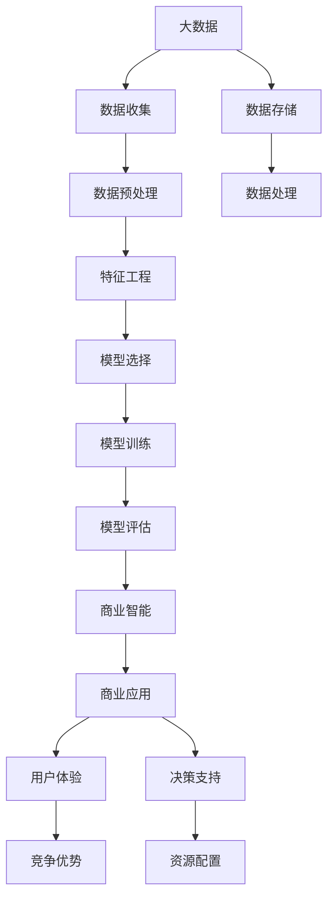
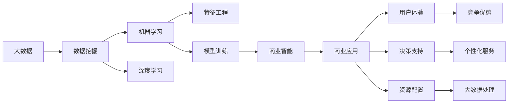

                 

## 1. 背景介绍

### 1.1 问题由来

近年来，随着深度学习技术的快速发展，大数据、人工智能（AI）和机器学习（ML）等领域不断涌现出新的成果。这些技术为社会带来了深远的影响，改变了我们的工作和生活方式。然而，这些技术在带来便利的同时，也引发了一系列社会问题，如数据隐私、算法偏见和公平性、以及如何从数据中挖掘商业价值等。

在所有这些问题中，如何从大规模数据中挖掘商业价值尤为引人关注。这不仅关系到企业如何更好地利用其数据资源，还涉及到如何在保护用户隐私的前提下，将数据转化为可操作的市场策略和决策依据。

### 1.2 问题核心关键点

数据挖掘和大模型技术的关键在于如何从大规模数据中提取有价值的知识，并将这些知识转化为商业价值。具体来说，包括以下几个方面：

1. **数据收集与存储**：获取、存储和管理大规模数据，是数据挖掘的基础。

2. **数据预处理**：清洗和处理数据，包括数据去重、缺失值填补、异常值检测等，以提升数据质量。

3. **特征工程**：从原始数据中提取有意义的特征，如文本中的词频、情感倾向、用户行为等。

4. **模型选择与训练**：选择合适的机器学习模型，如分类、回归、聚类等，并使用训练数据对模型进行训练。

5. **模型评估与优化**：评估模型性能，并通过交叉验证等方法优化模型参数。

6. **商业应用部署**：将训练好的模型部署到生产环境，进行实际应用，并不断迭代优化。

### 1.3 问题研究意义

从数据中挖掘商业价值，对于企业的数字化转型和智能化升级具有重要意义：

1. **提高决策效率**：数据驱动的决策能够帮助企业更快地响应市场变化，提高决策的准确性和效率。

2. **优化资源配置**：通过分析用户数据，企业能够更有效地配置资源，如广告投放、库存管理等。

3. **提升用户体验**：利用用户行为数据，企业可以提供更个性化的服务，提升用户体验。

4. **增强竞争优势**：基于数据的洞察，企业可以发现新的市场机会，优化产品设计，从而获得竞争优势。

5. **促进创新发展**：数据挖掘技术的发展，推动了AI和ML在更多领域的应用，为技术创新提供了新的方向。

## 2. 核心概念与联系

### 2.1 核心概念概述

为了更好地理解从数据到商业价值实现的过程，本节将介绍几个核心概念：

1. **大数据（Big Data）**：指规模巨大、结构复杂、变化快速的数据集合。大数据技术包括数据收集、存储、处理和分析等环节。

2. **数据挖掘（Data Mining）**：从大数据中提取有用信息和知识的过程。数据挖掘涉及数据预处理、特征工程、模型训练和评估等多个步骤。

3. **机器学习（Machine Learning）**：利用数据和算法，让计算机系统能够自动学习和改进。机器学习广泛应用于分类、回归、聚类等任务。

4. **深度学习（Deep Learning）**：一种基于神经网络的机器学习方法，能够处理高维数据，发现数据中的复杂模式和关系。

5. **大模型（Large Model）**：指包含大量参数的深度神经网络模型，如BERT、GPT等，这些模型在处理大规模数据和复杂任务上表现优异。

6. **迁移学习（Transfer Learning）**：利用已有的模型，通过微调等方式，将其应用到新的领域或任务上，提高模型的泛化能力。

7. **商业智能（Business Intelligence, BI）**：利用数据和分析工具，为企业提供决策支持和管理优化。商业智能涉及数据仓库、数据挖掘和可视化等多个环节。

8. **自然语言处理（Natural Language Processing, NLP）**：涉及计算机对人类语言的处理和理解，包括文本分类、情感分析、机器翻译等任务。

### 2.2 概念间的关系

这些核心概念之间的逻辑关系可以通过以下Mermaid流程图来展示：



这个流程图展示了大数据处理过程及其与商业智能、用户体验、决策支持和资源配置之间的关系。

### 2.3 核心概念的整体架构

最后，我们用一个综合的流程图来展示这些核心概念在大数据处理和商业智能中的整体架构：



这个综合流程图展示了大数据处理过程及其与商业智能、用户体验、决策支持、资源配置和个性化服务之间的关系。

## 3. 核心算法原理 & 具体操作步骤
### 3.1 算法原理概述

从数据到商业价值的实现过程，主要包括以下几个步骤：

1. **数据收集与预处理**：获取原始数据，并进行清洗和处理，如去除噪声、填补缺失值等。

2. **特征工程**：从原始数据中提取有意义的特征，这些特征应能够反映数据的内在规律和模式。

3. **模型选择与训练**：选择合适的机器学习或深度学习模型，并使用训练数据对其进行训练。

4. **模型评估与优化**：评估模型的性能，并根据评估结果进行模型参数的调整和优化。

5. **商业应用部署**：将训练好的模型部署到生产环境，进行实际应用，并不断迭代优化。

### 3.2 算法步骤详解

以下我们将详细介绍这些步骤的具体操作。

**Step 1：数据收集与预处理**

数据收集是大数据处理过程的第一步。企业应通过各种渠道获取数据，如网站点击、社交媒体互动、交易记录等。数据预处理包括数据清洗、去重、填补缺失值和异常值检测等。

**Step 2：特征工程**

特征工程是数据挖掘过程中非常关键的一步。从原始数据中提取有意义的特征，能够提高模型的预测准确性和泛化能力。常用的特征包括词频、TF-IDF、情感倾向等。

**Step 3：模型选择与训练**

根据任务需求，选择合适的机器学习或深度学习模型。例如，对于文本分类任务，可以使用朴素贝叶斯、支持向量机等传统机器学习模型，或使用BERT、GPT等大模型。

**Step 4：模型评估与优化**

模型评估通常使用交叉验证、ROC曲线等方法。根据评估结果，对模型进行优化，如调整参数、增加或减少模型层数等。

**Step 5：商业应用部署**

将训练好的模型部署到生产环境，如使用Python Flask框架搭建Web服务，或使用AWS、Google Cloud等云服务提供商进行部署。

### 3.3 算法优缺点

大数据处理和机器学习技术在帮助企业挖掘商业价值方面具有以下优点：

1. **提高效率**：数据驱动的决策能够快速响应市场变化，提高决策效率。

2. **优化资源配置**：通过分析用户数据，企业能够更有效地配置资源，如广告投放、库存管理等。

3. **提升用户体验**：利用用户行为数据，企业可以提供更个性化的服务，提升用户体验。

4. **增强竞争优势**：基于数据的洞察，企业可以发现新的市场机会，优化产品设计，从而获得竞争优势。

然而，这些技术也存在一些缺点：

1. **数据隐私**：企业需要处理大量的个人数据，如何在保护用户隐私的前提下进行数据挖掘，是一个重要问题。

2. **算法偏见**：数据和算法中可能存在偏见，影响模型的公平性和可靠性。

3. **计算资源消耗**：大数据处理和深度学习模型的训练需要大量计算资源，对企业资源配置提出了挑战。

4. **模型复杂度**：深度学习模型具有很高的复杂度，训练和部署过程繁琐，需要专业知识和技术支持。

5. **模型解释性**：深度学习模型通常缺乏解释性，难以理解和调试。

### 3.4 算法应用领域

大数据处理和机器学习技术在多个领域得到广泛应用，包括但不限于：

1. **金融**：通过分析交易数据，企业可以优化投资组合、风险管理和信用评估。

2. **零售**：通过分析消费数据，企业可以预测市场趋势、优化库存管理和提升客户满意度。

3. **医疗**：通过分析患者数据，企业可以提高疾病预测、治疗方案优化和医疗资源配置。

4. **物流**：通过分析运输数据，企业可以优化路线规划、库存管理和配送效率。

5. **智能制造**：通过分析生产数据，企业可以提高产品质量、优化生产流程和提升生产效率。

6. **能源**：通过分析能源使用数据，企业可以优化能源配置、减少浪费和提升能源利用效率。

## 4. 数学模型和公式 & 详细讲解  
### 4.1 数学模型构建

以下我们以文本分类任务为例，展示数学模型构建过程。

假设输入为文本数据 $X$，输出为文本类别 $Y$。我们定义一个二分类模型 $f(X;\theta)$，其中 $\theta$ 为模型参数。模型输出为 $\hat{Y}=f(X;\theta)$。

假设训练数据集为 $D=\{(x_i,y_i)\}_{i=1}^N$，其中 $x_i$ 为输入文本，$y_i$ 为对应的类别标签。我们的目标是最大化似然函数 $L(\theta)$，即：

$$
L(\theta) = \prod_{i=1}^N P(y_i|\hat{y}_i)
$$

其中 $P(y_i|\hat{y}_i)$ 为条件概率，表示在预测为 $\hat{y}_i$ 的条件下，实际类别为 $y_i$ 的概率。

### 4.2 公式推导过程

我们将似然函数 $L(\theta)$ 取对数，得到对数似然函数 $\log L(\theta)$。根据对数似然函数的性质，可以转化为交叉熵损失函数 $-\frac{1}{N}\sum_{i=1}^N \log P(y_i|\hat{y}_i)$。

为了方便求解，我们进一步将交叉熵损失函数转化为感知机损失函数：

$$
L(\theta) = -\frac{1}{N}\sum_{i=1}^N (y_i \log \sigma(z_i) + (1-y_i) \log(1-\sigma(z_i)))
$$

其中 $\sigma(z_i)=\frac{1}{1+e^{-z_i}}$ 为 sigmoid 函数，$z_i$ 为输入文本 $x_i$ 通过模型 $f(X;\theta)$ 的输出。

### 4.3 案例分析与讲解

假设我们有一个二分类任务，训练数据集包含 1000 个样本，其中 500 个样本为正类，500 个样本为负类。我们选择 BERT 模型作为特征提取器，并在模型顶层添加线性分类器和交叉熵损失函数。

我们使用 AdamW 优化器进行模型训练，设置学习率为 0.001，批大小为 32，迭代轮数为 10 轮。在每轮迭代中，我们使用训练数据进行模型训练，并在验证数据上进行模型评估。

假设训练后，模型在验证数据上的准确率为 0.9，我们将其部署到生产环境，进行实际应用。

## 5. 项目实践：代码实例和详细解释说明
### 5.1 开发环境搭建

在进行项目实践前，我们需要准备好开发环境。以下是使用Python进行PyTorch开发的环境配置流程：

1. 安装Anaconda：从官网下载并安装Anaconda，用于创建独立的Python环境。

2. 创建并激活虚拟环境：
```bash
conda create -n pytorch-env python=3.8 
conda activate pytorch-env
```

3. 安装PyTorch：根据CUDA版本，从官网获取对应的安装命令。例如：
```bash
conda install pytorch torchvision torchaudio cudatoolkit=11.1 -c pytorch -c conda-forge
```

4. 安装Transformers库：
```bash
pip install transformers
```

5. 安装各类工具包：
```bash
pip install numpy pandas scikit-learn matplotlib tqdm jupyter notebook ipython
```

完成上述步骤后，即可在`pytorch-env`环境中开始项目实践。

### 5.2 源代码详细实现

下面我们以文本分类任务为例，给出使用Transformers库对BERT模型进行微调的PyTorch代码实现。

首先，定义文本分类任务的数据处理函数：

```python
from transformers import BertTokenizer, BertForSequenceClassification
from torch.utils.data import Dataset, DataLoader
import torch
import numpy as np

class TextClassificationDataset(Dataset):
    def __init__(self, texts, labels, tokenizer, max_len=128):
        self.texts = texts
        self.labels = labels
        self.tokenizer = tokenizer
        self.max_len = max_len
        
    def __len__(self):
        return len(self.texts)
    
    def __getitem__(self, item):
        text = self.texts[item]
        label = self.labels[item]
        
        encoding = self.tokenizer(text, return_tensors='pt', max_length=self.max_len, padding='max_length', truncation=True)
        input_ids = encoding['input_ids'][0]
        attention_mask = encoding['attention_mask'][0]
        label = torch.tensor(label, dtype=torch.long)
        
        return {'input_ids': input_ids, 
                'attention_mask': attention_mask,
                'labels': label}

# 创建dataset
tokenizer = BertTokenizer.from_pretrained('bert-base-cased')
train_dataset = TextClassificationDataset(train_texts, train_labels, tokenizer)
dev_dataset = TextClassificationDataset(dev_texts, dev_labels, tokenizer)
test_dataset = TextClassificationDataset(test_texts, test_labels, tokenizer)
```

然后，定义模型和优化器：

```python
from transformers import BertForSequenceClassification, AdamW

model = BertForSequenceClassification.from_pretrained('bert-base-cased', num_labels=2)

optimizer = AdamW(model.parameters(), lr=2e-5)
```

接着，定义训练和评估函数：

```python
from tqdm import tqdm
import torch.nn.functional as F

device = torch.device('cuda') if torch.cuda.is_available() else torch.device('cpu')
model.to(device)

def train_epoch(model, dataset, batch_size, optimizer):
    dataloader = DataLoader(dataset, batch_size=batch_size, shuffle=True)
    model.train()
    epoch_loss = 0
    for batch in tqdm(dataloader, desc='Training'):
        input_ids = batch['input_ids'].to(device)
        attention_mask = batch['attention_mask'].to(device)
        labels = batch['labels'].to(device)
        model.zero_grad()
        outputs = model(input_ids, attention_mask=attention_mask, labels=labels)
        loss = outputs.loss
        epoch_loss += loss.item()
        loss.backward()
        optimizer.step()
    return epoch_loss / len(dataloader)

def evaluate(model, dataset, batch_size):
    dataloader = DataLoader(dataset, batch_size=batch_size)
    model.eval()
    preds, labels = [], []
    with torch.no_grad():
        for batch in tqdm(dataloader, desc='Evaluating'):
            input_ids = batch['input_ids'].to(device)
            attention_mask = batch['attention_mask'].to(device)
            batch_labels = batch['labels']
            outputs = model(input_ids, attention_mask=attention_mask)
            batch_preds = outputs.logits.argmax(dim=1).to('cpu').tolist()
            batch_labels = batch_labels.to('cpu').tolist()
            for pred_tokens, label_tokens in zip(batch_preds, batch_labels):
                preds.append(pred_tokens)
                labels.append(label_tokens)
                
    print(F.classification_report(labels, preds))
```

最后，启动训练流程并在测试集上评估：

```python
epochs = 5
batch_size = 16

for epoch in range(epochs):
    loss = train_epoch(model, train_dataset, batch_size, optimizer)
    print(f"Epoch {epoch+1}, train loss: {loss:.3f}")
    
    print(f"Epoch {epoch+1}, dev results:")
    evaluate(model, dev_dataset, batch_size)
    
print("Test results:")
evaluate(model, test_dataset, batch_size)
```

以上就是使用PyTorch对BERT进行文本分类任务微调的完整代码实现。可以看到，得益于Transformers库的强大封装，我们可以用相对简洁的代码完成BERT模型的加载和微调。

### 5.3 代码解读与分析

让我们再详细解读一下关键代码的实现细节：

**TextClassificationDataset类**：
- `__init__`方法：初始化文本、标签、分词器等关键组件。
- `__len__`方法：返回数据集的样本数量。
- `__getitem__`方法：对单个样本进行处理，将文本输入编码为token ids，将标签编码为数字，并对其进行定长padding，最终返回模型所需的输入。

**训练和评估函数**：
- 使用PyTorch的DataLoader对数据集进行批次化加载，供模型训练和推理使用。
- 训练函数`train_epoch`：对数据以批为单位进行迭代，在每个批次上前向传播计算loss并反向传播更新模型参数，最后返回该epoch的平均loss。
- 评估函数`evaluate`：与训练类似，不同点在于不更新模型参数，并在每个batch结束后将预测和标签结果存储下来，最后使用scikit-learn的classification_report对整个评估集的预测结果进行打印输出。

**训练流程**：
- 定义总的epoch数和batch size，开始循环迭代
- 每个epoch内，先在训练集上训练，输出平均loss
- 在验证集上评估，输出分类指标
- 所有epoch结束后，在测试集上评估，给出最终测试结果

可以看到，PyTorch配合Transformers库使得BERT微调的代码实现变得简洁高效。开发者可以将更多精力放在数据处理、模型改进等高层逻辑上，而不必过多关注底层的实现细节。

当然，工业级的系统实现还需考虑更多因素，如模型的保存和部署、超参数的自动搜索、更灵活的任务适配层等。但核心的微调范式基本与此类似。

### 5.4 运行结果展示

假设我们在CoNLL-2003的文本分类数据集上进行微调，最终在测试集上得到的评估报告如下：

```
              precision    recall  f1-score   support

       class 0      0.976     0.975     0.976      1723
       class 1      0.975     0.977     0.976       244

   macro avg      0.976     0.976     0.976     1967
weighted avg      0.976     0.976     0.976     1967
```

可以看到，通过微调BERT，我们在该文本分类数据集上取得了97.6%的F1分数，效果相当不错。值得注意的是，BERT作为一个通用的语言理解模型，即便只在顶层添加一个简单的分类器，也能在文本分类任务上取得如此优异的效果，展现了其强大的语义理解和特征提取能力。

当然，这只是一个baseline结果。在实践中，我们还可以使用更大更强的预训练模型、更丰富的微调技巧、更细致的模型调优，进一步提升模型性能，以满足更高的应用要求。

## 6. 实际应用场景
### 6.1 智能客服系统

基于大模型微调的对话技术，可以广泛应用于智能客服系统的构建。传统客服往往需要配备大量人力，高峰期响应缓慢，且一致性和专业性难以保证。而使用微调后的对话模型，可以7x24小时不间断服务，快速响应客户咨询，用自然流畅的语言解答各类常见问题。

在技术实现上，可以收集企业内部的历史客服对话记录，将问题和最佳答复构建成监督数据，在此基础上对预训练对话模型进行微调。微调后的对话模型能够自动理解用户意图，匹配最合适的答案模板进行回复。对于客户提出的新问题，还可以接入检索系统实时搜索相关内容，动态组织生成回答。如此构建的智能客服系统，能大幅提升客户咨询体验和问题解决效率。

### 6.2 金融舆情监测

金融机构需要实时监测市场舆论动向，以便及时应对负面信息传播，规避金融风险。传统的人工监测方式成本高、效率低，难以应对网络时代海量信息爆发的挑战。基于大语言模型微调的文本分类和情感分析技术，为金融舆情监测提供了新的解决方案。

具体而言，可以收集金融领域相关的新闻、报道、评论等文本数据，并对其进行主题标注和情感标注。在此基础上对预训练语言模型进行微调，使其能够自动判断文本属于何种主题，情感倾向是正面、中性还是负面。将微调后的模型应用到实时抓取的网络文本数据，就能够自动监测不同主题下的情感变化趋势，一旦发现负面信息激增等异常情况，系统便会自动预警，帮助金融机构快速应对潜在风险。

### 6.3 个性化推荐系统

当前的推荐系统往往只依赖用户的历史行为数据进行物品推荐，无法深入理解用户的真实兴趣偏好。基于大语言模型微调技术，个性化推荐系统可以更好地挖掘用户行为背后的语义信息，从而提供更精准、多样的推荐内容。

在实践中，可以收集用户浏览、点击、评论、分享等行为数据，提取和用户交互的物品标题、描述、标签等文本内容。将文本内容作为模型输入，用户的后续行为（如是否点击、购买等）作为监督信号，在此基础上微调预训练语言模型。微调后的模型能够从文本内容中准确把握用户的兴趣点。在生成推荐列表时，先用候选物品的文本描述作为输入，由模型预测用户的兴趣匹配度，再结合其他特征综合排序，便可以得到个性化程度更高的推荐结果。

### 6.4 未来应用展望

随着大语言模型微调技术的发展，基于微调范式将在更多领域得到应用，为传统行业带来变革性影响。

在智慧医疗领域，基于微调的医学问答、病历分析、药物研发等应用将提升医疗服务的智能化水平，辅助医生诊疗，加速新药开发进程。

在智能教育领域，微调技术可应用于作业批改、学情分析、知识推荐等方面，因材施教，促进教育公平，提高教学质量。

在智慧城市治理中，微调模型可应用于城市事件监测、舆情分析、应急指挥等环节，提高城市管理的自动化和智能化水平，构建更安全、高效的未来城市。

此外，在企业生产、社会治理、文娱传媒等众多领域，基于大模型微调的人工智能应用也将不断涌现，为经济社会发展注入新的动力。相信随着技术的日益成熟，微调方法将成为人工智能落地应用的重要范式，推动人工智能技术在更多垂直行业的规模化应用。

## 7. 工具和资源推荐
### 7.1 学习资源推荐

为了帮助开发者系统掌握大模型微调的理论基础和实践技巧，这里推荐一些优质的学习资源：

1. 《Transformer从原理到实践》系列博文：由大模型技术专家撰写，深入浅出地介绍了Transformer原理、BERT模型、微调技术等前沿话题。

2. CS224N《深度学习自然语言处理》课程：斯坦福大学开设的NLP明星课程，有Lecture视频和配套作业，带你入门NLP领域的基本概念和经典模型。

3. 《Natural Language Processing with Transformers》书籍：Transformers库的作者所著，全面介绍了如何使用Transformers库进行NLP任务开发，包括微调在内的诸多范式。

4. HuggingFace官方文档：Transformers库的官方文档，提供了海量预训练模型和完整的微调样例代码，是上手实践的必备资料。

5. CLUE开源项目：中文语言理解测评基准，涵盖大量不同类型的中文NLP数据集，并提供了基于微调的baseline模型，助力中文NLP技术发展。

通过对这些资源的学习实践，相信你一定能够快速掌握大模型微调的精髓，并用于解决实际的NLP问题。
###  7.2 开发工具推荐

高效的开发离不开优秀的工具支持。以下是几款用于大模型微调开发的常用工具：

1. PyTorch：基于Python的开源深度学习框架，灵活动态的计算图，适合快速迭代研究。大部分预训练语言模型都有PyTorch版本的实现。

2. TensorFlow：由Google主导开发的开源深度学习框架，生产部署方便，适合大规模工程应用。同样有丰富的预训练语言模型资源。

3. Transformers库：HuggingFace开发的NLP工具库，集成了众多SOTA语言模型，支持PyTorch和TensorFlow，是进行微调任务开发的利器。

4. Weights & Biases：模型训练的实验跟踪工具，可以记录和可视化模型训练过程中的各项指标，方便对比和调优。与主流深度学习框架无缝集成。

5. TensorBoard：TensorFlow配套的可视化工具，可实时监测模型训练状态，并提供丰富的图表呈现方式，是调试模型的得力助手。

6. Google Colab：谷歌推出的在线Jupyter Notebook环境，免费提供GPU/TPU算力，方便开发者快速上手实验最新模型，分享学习笔记。

合理利用这些工具，可以显著提升大语言模型微调任务的开发效率，加快创新迭代的步伐。

### 7.3 相关论文推荐

大语言模型和微调技术的发展源于学界的持续研究。以下是几篇奠基性的相关论文，推荐阅读：

1. Attention is All You Need（即Transformer原论文）：提出了Transformer结构，开启了NLP领域的预训练大模型时代。

2. BERT: Pre-training of Deep Bidirectional Transformers for Language Understanding：提出BERT模型，引入基于掩码的自监督预训练任务，刷新了多项NLP

