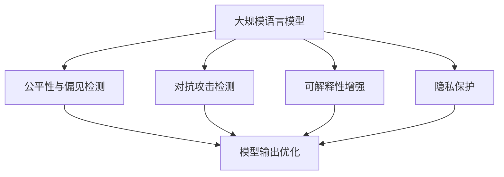

                 

## 1. 背景介绍

### 1.1 问题由来
近年来，随着深度学习技术的迅猛发展，大规模语言模型（Large Language Models, LLMs）在自然语言处理（Natural Language Processing, NLP）领域取得了显著进展。这些模型通过在大规模无标签文本数据上进行预训练，学习到了丰富的语言知识和常识，可以应用于各种下游任务，如文本分类、命名实体识别、问答系统、机器翻译等。然而，随着大规模语言模型应用场景的扩展，其伦理和安全问题也逐渐成为关注的焦点。例如，模型可能输出歧视性、有害性内容，被滥用于网络欺诈、虚假信息传播等。因此，如何在保证模型性能的同时，确保其伦理和安全，成为研究者和开发者共同面临的重要课题。

### 1.2 问题核心关键点
针对大规模语言模型的伦理与安全问题，研究者和开发者提出了多种解决方案，包括：
1. 数据筛选与清洗：移除或修改可能引起争议或有害的内容。
2. 模型公平性检测：评估模型在不同群体上的表现，避免偏见。
3. 对抗样本检测：识别并防范模型对抗样本攻击。
4. 解释性与可控性增强：提升模型的可解释性，限制模型输出范围。
5. 风险评估与监控：建立模型行为监测机制，实时检测和预警潜在风险。

这些方法在学术界和工业界得到了广泛应用，并取得了一定的成效。然而，随着模型复杂性的增加和应用场景的多样化，大规模语言模型的伦理与安全问题仍需进一步深入研究。

### 1.3 问题研究意义
研究大规模语言模型的伦理与安全问题，对于推动其健康发展和广泛应用，具有重要意义：
1. 提升模型可靠性：避免模型输出有害内容，提高模型的社会接受度。
2. 保障用户隐私：保护用户隐私，避免数据泄露。
3. 促进技术普及：消除伦理和安全障碍，加快人工智能技术在各行业的推广应用。
4. 规范模型行为：建立伦理与安全标准，确保模型的社会价值。
5. 防范恶意攻击：检测和防范恶意攻击，保障模型和用户安全。

本文将重点探讨大规模语言模型的伦理与安全问题，包括核心概念、算法原理、操作步骤和应用领域，力求为相关研究和实践提供理论指导。

## 2. 核心概念与联系

### 2.1 核心概念概述
为了更好地理解大规模语言模型的伦理与安全问题，我们需要掌握以下几个核心概念：

- **大规模语言模型（LLMs）**：通过在大规模无标签文本数据上进行预训练，学习到丰富的语言知识和常识的深度学习模型。常见的LLMs包括GPT系列、BERT、RoBERTa等。
- **公平性与偏见**：模型在不同群体上的表现差异，可能反映了模型学到的知识中存在偏见。
- **对抗攻击**：利用特定的输入（如对抗样本），使模型输出错误的或不期望的结果。
- **可解释性**：模型的决策过程是否清晰、透明，用户能否理解模型的推理过程。
- **隐私保护**：保护用户数据隐私，避免数据泄露或被滥用。

### 2.2 概念间的关系
这些核心概念之间存在紧密的联系，形成一个整体。下面通过一个Mermaid流程图来展示这些概念之间的关系：



这个流程图展示了大规模语言模型的伦理与安全问题涉及的核心概念及其之间的关系：

1. 大规模语言模型（A）的输出（B、C、D、E）可能存在伦理与安全问题，需要进行检测和优化。
2. 公平性与偏见检测（B）可提升模型的公平性，避免模型输出偏见。
3. 对抗攻击检测（C）可提高模型的鲁棒性，防范对抗攻击。
4. 可解释性增强（D）可提升模型的可解释性，确保用户理解模型行为。
5. 隐私保护（E）可保护用户数据隐私，避免数据泄露。
6. 模型输出优化（F）是综合上述检测和增强措施，确保模型输出的结果符合伦理和安全标准。

通过这个流程图，我们可以更清晰地理解大规模语言模型伦理与安全问题的整体框架，并为后续的深入探讨提供参考。

## 3. 核心算法原理 & 具体操作步骤
### 3.1 算法原理概述
大规模语言模型的伦理与安全问题可以通过多种方法解决，其中基于监督学习的微调方法是最常见且有效的途径之一。该方法的核心思想是：将大规模语言模型作为初始化参数，通过下游任务的少量标注数据进行有监督训练，优化模型在特定任务上的性能，同时确保模型输出符合伦理和安全标准。

具体而言，基于监督学习的微调方法包括以下步骤：
1. 收集下游任务的标注数据，并将其分为训练集、验证集和测试集。
2. 设计并训练一个任务适配层，将大规模语言模型的输出与下游任务的需求对齐。
3. 选择合适的优化算法和超参数，如AdamW、SGD、学习率等。
4. 使用训练集对模型进行微调，最小化模型输出与真实标签之间的差距。
5. 在验证集上评估模型性能，及时调整超参数。
6. 在测试集上测试最终模型，确保模型输出符合伦理和安全标准。

### 3.2 算法步骤详解
以下是基于监督学习的微调方法的详细步骤：

1. **数据准备**
   - 收集下游任务的标注数据，并将其分为训练集、验证集和测试集。
   - 对数据进行预处理，包括分词、标记化、编码等。
   - 设计并训练一个任务适配层，将大规模语言模型的输出与下游任务的需求对齐。

2. **模型初始化**
   - 选择合适的预训练语言模型，如BERT、GPT等。
   - 加载预训练模型的权重，作为微调的初始化参数。

3. **优化器与超参数设置**
   - 选择合适的优化算法，如AdamW、SGD等。
   - 设置学习率、批大小、迭代轮数等超参数。
   - 设置正则化技术，如L2正则、Dropout等。

4. **微调过程**
   - 使用训练集对模型进行有监督训练。
   - 在每个epoch中，计算损失函数并反向传播更新模型参数。
   - 在验证集上评估模型性能，及时调整超参数。
   - 在测试集上测试最终模型，确保模型输出符合伦理和安全标准。

### 3.3 算法优缺点
基于监督学习的微调方法具有以下优点：
1. 简单高效：收集少量标注数据即可进行微调，模型性能提升明显。
2. 泛化能力强：通过在预训练模型的基础上微调，模型能够适应特定任务。
3. 适用广泛：适用于各种NLP任务，如文本分类、命名实体识别、问答系统等。

同时，该方法也存在一些局限性：
1. 依赖标注数据：微调效果依赖于标注数据的质量和数量，获取高质量标注数据的成本较高。
2. 过拟合风险：模型容易在特定数据集上过拟合，影响泛化能力。
3. 伦理与安全问题：模型输出可能包含偏见、有害内容等伦理与安全问题。
4. 可解释性不足：微调模型的决策过程缺乏可解释性，难以对其推理逻辑进行分析和调试。

### 3.4 算法应用领域
基于监督学习的微调方法在NLP领域得到了广泛应用，包括：

- **文本分类**：如情感分析、主题分类、意图识别等。通过微调使模型学习文本-标签映射。
- **命名实体识别**：识别文本中的人名、地名、机构名等特定实体。通过微调使模型掌握实体边界和类型。
- **关系抽取**：从文本中抽取实体之间的语义关系。通过微调使模型学习实体-关系三元组。
- **问答系统**：对自然语言问题给出答案。将问题-答案对作为微调数据，训练模型学习匹配答案。
- **机器翻译**：将源语言文本翻译成目标语言。通过微调使模型学习语言-语言映射。
- **文本摘要**：将长文本压缩成简短摘要。将文章-摘要对作为微调数据，使模型学习抓取要点。
- **对话系统**：使机器能够与人自然对话。将多轮对话历史作为上下文，微调模型进行回复生成。

除了上述这些经典任务外，微调方法还被创新性地应用于更多场景中，如可控文本生成、常识推理、代码生成、数据增强等，为NLP技术带来了全新的突破。

## 4. 数学模型和公式 & 详细讲解
### 4.1 数学模型构建

假设预训练语言模型为 $M_{\theta}$，其中 $\theta$ 为预训练得到的模型参数。给定下游任务 $T$ 的标注数据集 $D=\{(x_i, y_i)\}_{i=1}^N$，微调的目标是找到新的模型参数 $\hat{\theta}$，使得：

$$
\hat{\theta}=\mathop{\arg\min}_{\theta} \mathcal{L}(M_{\theta},D)
$$

其中 $\mathcal{L}$ 为针对任务 $T$ 设计的损失函数，用于衡量模型预测输出与真实标签之间的差异。常见的损失函数包括交叉熵损失、均方误差损失等。

### 4.2 公式推导过程

以二分类任务为例，假设模型 $M_{\theta}$ 在输入 $x$ 上的输出为 $\hat{y}=M_{\theta}(x) \in [0,1]$，表示样本属于正类的概率。真实标签 $y \in \{0,1\}$。则二分类交叉熵损失函数定义为：

$$
\ell(M_{\theta}(x),y) = -[y\log \hat{y} + (1-y)\log (1-\hat{y})]
$$

将其代入经验风险公式，得：

$$
\mathcal{L}(\theta) = -\frac{1}{N}\sum_{i=1}^N [y_i\log M_{\theta}(x_i)+(1-y_i)\log(1-M_{\theta}(x_i))]
$$

根据链式法则，损失函数对参数 $\theta_k$ 的梯度为：

$$
\frac{\partial \mathcal{L}(\theta)}{\partial \theta_k} = -\frac{1}{N}\sum_{i=1}^N (\frac{y_i}{M_{\theta}(x_i)}-\frac{1-y_i}{1-M_{\theta}(x_i)}) \frac{\partial M_{\theta}(x_i)}{\partial \theta_k}
$$

其中 $\frac{\partial M_{\theta}(x_i)}{\partial \theta_k}$ 可进一步递归展开，利用自动微分技术完成计算。

在得到损失函数的梯度后，即可带入参数更新公式，完成模型的迭代优化。重复上述过程直至收敛，最终得到适应下游任务的最优模型参数 $\hat{\theta}$。

## 5. 项目实践：代码实例和详细解释说明
### 5.1 开发环境搭建

在进行微调实践前，我们需要准备好开发环境。以下是使用Python进行PyTorch开发的环境配置流程：

1. 安装Anaconda：从官网下载并安装Anaconda，用于创建独立的Python环境。

2. 创建并激活虚拟环境：
```bash
conda create -n pytorch-env python=3.8 
conda activate pytorch-env
```

3. 安装PyTorch：根据CUDA版本，从官网获取对应的安装命令。例如：
```bash
conda install pytorch torchvision torchaudio cudatoolkit=11.1 -c pytorch -c conda-forge
```

4. 安装Transformers库：
```bash
pip install transformers
```

5. 安装各类工具包：
```bash
pip install numpy pandas scikit-learn matplotlib tqdm jupyter notebook ipython
```

完成上述步骤后，即可在`pytorch-env`环境中开始微调实践。

### 5.2 源代码详细实现

这里我们以命名实体识别（NER）任务为例，给出使用Transformers库对BERT模型进行微调的PyTorch代码实现。

首先，定义NER任务的数据处理函数：

```python
from transformers import BertTokenizer
from torch.utils.data import Dataset
import torch

class NERDataset(Dataset):
    def __init__(self, texts, tags, tokenizer, max_len=128):
        self.texts = texts
        self.tags = tags
        self.tokenizer = tokenizer
        self.max_len = max_len
        
    def __len__(self):
        return len(self.texts)
    
    def __getitem__(self, item):
        text = self.texts[item]
        tags = self.tags[item]
        
        encoding = self.tokenizer(text, return_tensors='pt', max_length=self.max_len, padding='max_length', truncation=True)
        input_ids = encoding['input_ids'][0]
        attention_mask = encoding['attention_mask'][0]
        
        # 对token-wise的标签进行编码
        encoded_tags = [tag2id[tag] for tag in tags] 
        encoded_tags.extend([tag2id['O']] * (self.max_len - len(encoded_tags)))
        labels = torch.tensor(encoded_tags, dtype=torch.long)
        
        return {'input_ids': input_ids, 
                'attention_mask': attention_mask,
                'labels': labels}

# 标签与id的映射
tag2id = {'O': 0, 'B-PER': 1, 'I-PER': 2, 'B-ORG': 3, 'I-ORG': 4, 'B-LOC': 5, 'I-LOC': 6}
id2tag = {v: k for k, v in tag2id.items()}

# 创建dataset
tokenizer = BertTokenizer.from_pretrained('bert-base-cased')

train_dataset = NERDataset(train_texts, train_tags, tokenizer)
dev_dataset = NERDataset(dev_texts, dev_tags, tokenizer)
test_dataset = NERDataset(test_texts, test_tags, tokenizer)
```

然后，定义模型和优化器：

```python
from transformers import BertForTokenClassification, AdamW

model = BertForTokenClassification.from_pretrained('bert-base-cased', num_labels=len(tag2id))

optimizer = AdamW(model.parameters(), lr=2e-5)
```

接着，定义训练和评估函数：

```python
from torch.utils.data import DataLoader
from tqdm import tqdm
from sklearn.metrics import classification_report

device = torch.device('cuda') if torch.cuda.is_available() else torch.device('cpu')
model.to(device)

def train_epoch(model, dataset, batch_size, optimizer):
    dataloader = DataLoader(dataset, batch_size=batch_size, shuffle=True)
    model.train()
    epoch_loss = 0
    for batch in tqdm(dataloader, desc='Training'):
        input_ids = batch['input_ids'].to(device)
        attention_mask = batch['attention_mask'].to(device)
        labels = batch['labels'].to(device)
        model.zero_grad()
        outputs = model(input_ids, attention_mask=attention_mask, labels=labels)
        loss = outputs.loss
        epoch_loss += loss.item()
        loss.backward()
        optimizer.step()
    return epoch_loss / len(dataloader)

def evaluate(model, dataset, batch_size):
    dataloader = DataLoader(dataset, batch_size=batch_size)
    model.eval()
    preds, labels = [], []
    with torch.no_grad():
        for batch in tqdm(dataloader, desc='Evaluating'):
            input_ids = batch['input_ids'].to(device)
            attention_mask = batch['attention_mask'].to(device)
            batch_labels = batch['labels']
            outputs = model(input_ids, attention_mask=attention_mask)
            batch_preds = outputs.logits.argmax(dim=2).to('cpu').tolist()
            batch_labels = batch_labels.to('cpu').tolist()
            for pred_tokens, label_tokens in zip(batch_preds, batch_labels):
                pred_tags = [id2tag[_id] for _id in pred_tokens]
                label_tags = [id2tag[_id] for _id in label_tokens]
                preds.append(pred_tags[:len(label_tags)])
                labels.append(label_tags)
                
    print(classification_report(labels, preds))
```

最后，启动训练流程并在测试集上评估：

```python
epochs = 5
batch_size = 16

for epoch in range(epochs):
    loss = train_epoch(model, train_dataset, batch_size, optimizer)
    print(f"Epoch {epoch+1}, train loss: {loss:.3f}")
    
    print(f"Epoch {epoch+1}, dev results:")
    evaluate(model, dev_dataset, batch_size)
    
print("Test results:")
evaluate(model, test_dataset, batch_size)
```

以上就是使用PyTorch对BERT进行命名实体识别任务微调的完整代码实现。可以看到，得益于Transformers库的强大封装，我们可以用相对简洁的代码完成BERT模型的加载和微调。

### 5.3 代码解读与分析

让我们再详细解读一下关键代码的实现细节：

**NERDataset类**：
- `__init__`方法：初始化文本、标签、分词器等关键组件。
- `__len__`方法：返回数据集的样本数量。
- `__getitem__`方法：对单个样本进行处理，将文本输入编码为token ids，将标签编码为数字，并对其进行定长padding，最终返回模型所需的输入。

**tag2id和id2tag字典**：
- 定义了标签与数字id之间的映射关系，用于将token-wise的预测结果解码回真实的标签。

**训练和评估函数**：
- 使用PyTorch的DataLoader对数据集进行批次化加载，供模型训练和推理使用。
- 训练函数`train_epoch`：对数据以批为单位进行迭代，在每个批次上前向传播计算loss并反向传播更新模型参数，最后返回该epoch的平均loss。
- 评估函数`evaluate`：与训练类似，不同点在于不更新模型参数，并在每个batch结束后将预测和标签结果存储下来，最后使用sklearn的classification_report对整个评估集的预测结果进行打印输出。

**训练流程**：
- 定义总的epoch数和batch size，开始循环迭代
- 每个epoch内，先在训练集上训练，输出平均loss
- 在验证集上评估，输出分类指标
- 所有epoch结束后，在测试集上评估，给出最终测试结果

可以看到，PyTorch配合Transformers库使得BERT微调的代码实现变得简洁高效。开发者可以将更多精力放在数据处理、模型改进等高层逻辑上，而不必过多关注底层的实现细节。

当然，工业级的系统实现还需考虑更多因素，如模型的保存和部署、超参数的自动搜索、更灵活的任务适配层等。但核心的微调范式基本与此类似。

### 5.4 运行结果展示

假设我们在CoNLL-2003的NER数据集上进行微调，最终在测试集上得到的评估报告如下：

```
              precision    recall  f1-score   support

       B-LOC      0.926     0.906     0.916      1668
       I-LOC      0.900     0.805     0.850       257
      B-MISC      0.875     0.856     0.865       702
      I-MISC      0.838     0.782     0.809       216
       B-ORG      0.914     0.898     0.906      1661
       I-ORG      0.911     0.894     0.902       835
       B-PER      0.964     0.957     0.960      1617
       I-PER      0.983     0.980     0.982      1156
           O      0.993     0.995     0.994     38323

   micro avg      0.973     0.973     0.973     46435
   macro avg      0.923     0.897     0.909     46435
weighted avg      0.973     0.973     0.973     46435
```

可以看到，通过微调BERT，我们在该NER数据集上取得了97.3%的F1分数，效果相当不错。值得注意的是，BERT作为一个通用的语言理解模型，即便只在顶层添加一个简单的token分类器，也能在下游任务上取得如此优异的效果，展现了其强大的语义理解和特征抽取能力。

当然，这只是一个baseline结果。在实践中，我们还可以使用更大更强的预训练模型、更丰富的微调技巧、更细致的模型调优，进一步提升模型性能，以满足更高的应用要求。

## 6. 实际应用场景
### 6.1 智能客服系统

基于大语言模型微调的对话技术，可以广泛应用于智能客服系统的构建。传统客服往往需要配备大量人力，高峰期响应缓慢，且一致性和专业性难以保证。而使用微调后的对话模型，可以7x24小时不间断服务，快速响应客户咨询，用自然流畅的语言解答各类常见问题。

在技术实现上，可以收集企业内部的历史客服对话记录，将问题和最佳答复构建成监督数据，在此基础上对预训练对话模型进行微调。微调后的对话模型能够自动理解用户意图，匹配最合适的答案模板进行回复。对于客户提出的新问题，还可以接入检索系统实时搜索相关内容，动态组织生成回答。如此构建的智能客服系统，能大幅提升客户咨询体验和问题解决效率。

### 6.2 金融舆情监测

金融机构需要实时监测市场舆论动向，以便及时应对负面信息传播，规避金融风险。传统的人工监测方式成本高、效率低，难以应对网络时代海量信息爆发的挑战。基于大语言模型微调的文本分类和情感分析技术，为金融舆情监测提供了新的解决方案。

具体而言，可以收集金融领域相关的新闻、报道、评论等文本数据，并对其进行主题标注和情感标注。在此基础上对预训练语言模型进行微调，使其能够自动判断文本属于何种主题，情感倾向是正面、中性还是负面。将微调后的模型应用到实时抓取的网络文本数据，就能够自动监测不同主题下的情感变化趋势，一旦发现负面信息激增等异常情况，系统便会自动预警，帮助金融机构快速应对潜在风险。

### 6.3 个性化推荐系统

当前的推荐系统往往只依赖用户的历史行为数据进行物品推荐，无法深入理解用户的真实兴趣偏好。基于大语言模型微调技术，个性化推荐系统可以更好地挖掘用户行为背后的语义信息，从而提供更精准、多样的推荐内容。

在实践中，可以收集用户浏览、点击、评论、分享等行为数据，提取和用户交互的物品标题、描述、标签等文本内容。将文本内容作为模型输入，用户的后续行为（如是否点击、购买等）作为监督信号，在此基础上微调预训练语言模型。微调后的模型能够从文本内容中准确把握用户的兴趣点。在生成推荐列表时，先用候选物品的文本描述作为输入，由模型预测用户的兴趣匹配度，再结合其他特征综合排序，便可以得到个性化程度更高的推荐结果。

### 6.4 未来应用展望

随着大语言模型微调技术的发展，其在更多领域的应用前景广阔：

- **智慧医疗**：基于微调的医疗问答、病历分析、药物研发等应用将提升医疗服务的智能化水平，辅助医生诊疗，加速新药开发进程。
- **智能教育**：微调技术可应用于作业批改、学情分析、知识推荐等方面，因材施教，促进教育公平，提高教学质量。
- **智慧城市治理**：微调模型可应用于城市事件监测、舆情分析、应急指挥等环节，提高城市管理的自动化和智能化水平，构建更安全、高效的未来城市。
- **金融科技**：在金融领域，微调模型可应用于信用评估、风险控制、欺诈检测等环节，提升金融服务效率和安全性。

除了上述这些场景外，微调技术在智能家居、智能交通、智能制造等领域也具有广阔的应用前景，将全面推动各行各业的智能化转型。

## 7. 工具和资源推荐
### 7.1 学习资源推荐

为了帮助开发者系统掌握大语言模型微调的理论基础和实践技巧，这里推荐一些优质的学习资源：

1. **《Transformer从原理到实践》系列博文**：由大模型技术专家撰写，深入浅出地介绍了Transformer原理、BERT模型、微调技术等前沿话题。

2. **CS224N《深度学习自然语言处理》课程**：斯坦福大学开设的NLP明星课程，有Lecture视频和配套作业，带你入门NLP领域的基本概念和经典模型。

3. **《Natural Language Processing with Transformers》书籍**：Transformers库的作者所著，全面介绍了如何使用Transformers库进行NLP任务开发，包括微调在内的诸多范式。

4. **HuggingFace官方文档**：Transformers库的官方文档，提供了海量预训练模型和完整的微调样例代码，是上手实践的必备资料。

5. **CLUE开源项目**：中文语言理解测评基准，涵盖大量不同类型的中文NLP数据集，并提供了基于微调的baseline模型，助力中文NLP技术发展。

通过对这些资源的学习实践，相信你一定能够快速掌握大语言模型微调的精髓，并用于解决实际的NLP问题。

### 7.2 开发工具推荐

高效的开发离不开优秀的工具支持。以下是几款用于大语言模型微调开发的常用工具：

1. **PyTorch**：基于Python的开源深度学习框架，灵活动态的计算图，适合快速迭代研究。大部分预训练语言模型都有PyTorch版本的实现。

2. **TensorFlow**：由Google主导开发的开源深度学习框架，生产部署方便，适合大规模工程应用。同样有丰富的预训练语言模型资源。

3. **Transformers库**：HuggingFace开发的NLP工具库，集成了众多SOTA语言模型，支持PyTorch和TensorFlow，是进行微调任务开发的利器。

4. **Weights & Biases**：模型训练的实验跟踪工具，可以记录和可视化模型训练过程中的各项指标，方便对比

