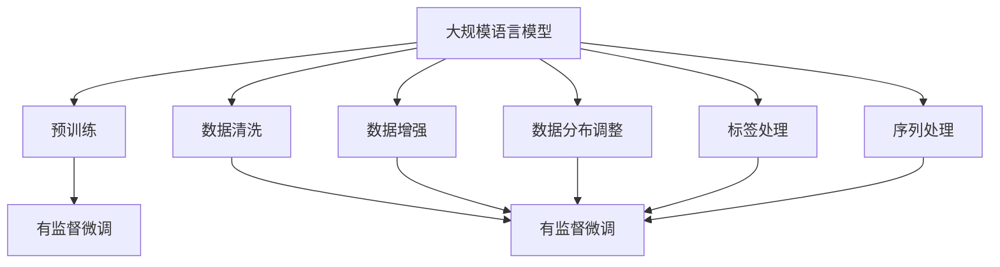
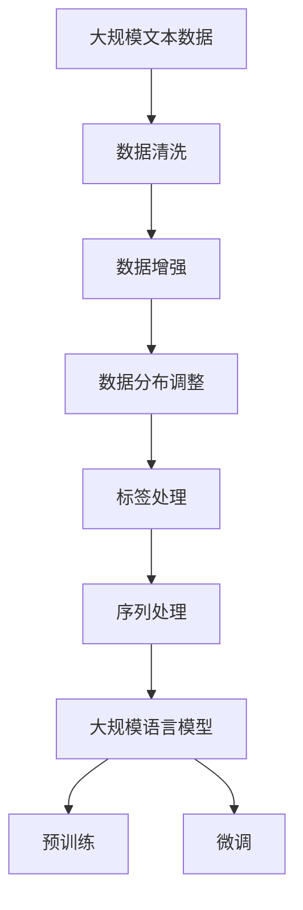

                 

# 大规模语言模型从理论到实践 数据预处理

> 关键词：
大规模语言模型、预训练、自监督学习、数据清洗、数据增强、数据分布、BERT、GPT、GLUE、CoNLL

## 1. 背景介绍

### 1.1 问题由来

近年来，深度学习技术的飞速发展推动了自然语言处理（NLP）领域的突破，其中大规模语言模型的出现尤为引人注目。这类模型以自回归模型（如GPT）和自编码模型（如BERT）为代表，通过在大规模无标签文本数据上进行预训练，学习到了丰富的语言知识和常识。这些模型被广泛应用于问答、翻译、情感分析、文本分类、命名实体识别等众多NLP任务中，取得了卓越的性能。

然而，即使是大规模语言模型，在处理具体任务时，也需要进行数据预处理（Data Preprocessing）。数据预处理是构建高质量训练集的前提，其目的是清洗数据，并对其进行有效的增强和分布调整，以提高模型的性能和泛化能力。特别是在资源有限的场景中，数据预处理显得尤为重要，因为合理的数据预处理可以大大降低后续训练的复杂度和成本。

### 1.2 问题核心关键点

数据预处理的核心目标是通过一系列技术手段，使得数据集的质量和数量达到预训练和微调的要求。关键点包括以下几个方面：

- **数据清洗**：识别并删除数据中的噪声和错误信息，保证数据质量。
- **数据增强**：扩充训练集的样本数量和多样性，避免过拟合。
- **数据分布调整**：使训练数据和测试数据的分布一致，提高模型泛化能力。
- **标签处理**：合理处理标签，避免数据倾斜问题。
- **序列处理**：对于序列数据，进行序列填充、截断等处理，确保模型输入的一致性。

在大规模语言模型预训练和微调的过程中，数据预处理是不可或缺的一部分。高质量的数据预处理不仅可以提升模型的表现，还可以显著降低模型在实际应用中的误差率。

### 1.3 问题研究意义

数据预处理对于大规模语言模型的成功至关重要，其研究意义体现在以下几个方面：

1. **降低训练成本**：合理的数据预处理可以大幅减少数据集的大小和复杂度，降低训练的资源需求。
2. **提升模型性能**：通过清洗和增强数据，可以提高模型对噪声和异常数据的鲁棒性，提升模型泛化能力。
3. **加速模型开发**：数据预处理使得数据集更适合模型训练，加速了模型迭代和优化的过程。
4. **促进技术落地**：高效的数据预处理为大规模语言模型在实际应用中的快速部署和优化提供了基础保障。
5. **优化用户体验**：通过合理的数据处理，可以改善模型的输出质量和用户满意度。

## 2. 核心概念与联系

### 2.1 核心概念概述

在深入探讨数据预处理之前，我们需要理解几个核心概念：

- **大规模语言模型（Large Language Models, LLMs）**：如BERT、GPT系列模型，通过在大规模无标签文本数据上进行预训练，学习通用语言知识和常识，具备强大的语言理解和生成能力。
- **自监督学习（Self-supervised Learning）**：利用数据自身的特性进行学习，不需要显式标签，广泛应用于预训练阶段。
- **数据清洗（Data Cleaning）**：去除噪声、错误和冗余信息，提高数据质量。
- **数据增强（Data Augmentation）**：通过对数据进行扩充和变换，提高数据的多样性和数量，减少过拟合风险。
- **数据分布调整（Data Distribution Adjustment）**：使训练数据和测试数据分布一致，提高模型的泛化能力。
- **标签处理（Label Handling）**：合理处理标签，避免数据倾斜问题。
- **序列处理（Sequence Processing）**：针对序列数据，进行填充、截断等处理，确保模型输入的一致性。

这些概念通过以下Mermaid流程图进行展示，帮助读者理解它们之间的联系：



这个流程图展示了在大规模语言模型预训练和微调过程中，数据预处理的重要作用。预训练是使用自监督学习任务进行，而微调是使用有监督学习任务进行。数据预处理的每个环节都可以直接或间接地提升微调的性能。

### 2.2 概念间的关系

在数据预处理的各个概念之间，存在密切的联系和相互作用：

- **数据清洗**是数据预处理的第一步，通过去除噪声和错误信息，提升数据质量。
- **数据增强**通过扩充数据量，减少过拟合风险。
- **数据分布调整**通过重新分布数据，提高模型泛化能力。
- **标签处理**通过合理处理标签，避免数据倾斜问题。
- **序列处理**通过处理序列数据，确保模型输入的一致性。

这些概念相互关联，共同构成了一个高效的数据预处理流程，确保大规模语言模型在大规模无标签数据上进行有效的预训练和微调。

### 2.3 核心概念的整体架构

最后，我们将这些核心概念通过一个综合的流程图进行展示，以便于理解它们在大规模语言模型预训练和微调过程中的整体作用：



这个综合流程图展示了从原始数据到最终训练集的整个数据预处理流程，每个步骤都是为了提升模型的预训练和微调效果。

## 3. 核心算法原理 & 具体操作步骤

### 3.1 算法原理概述

数据预处理的总体目标是通过一系列技术手段，提高训练数据的质量和数量，确保模型能够在实际应用中表现出良好的性能。其核心原理包括以下几个方面：

- **自监督学习**：在大规模无标签数据上，通过自我监督的方式学习语言知识，构建高质量的预训练模型。
- **数据清洗**：通过去除噪声、错误和冗余信息，提升数据质量。
- **数据增强**：通过对数据进行扩充和变换，提高数据的多样性和数量，减少过拟合风险。
- **数据分布调整**：通过重新分布数据，使训练数据和测试数据分布一致，提高模型的泛化能力。
- **标签处理**：通过合理处理标签，避免数据倾斜问题。
- **序列处理**：针对序列数据，进行填充、截断等处理，确保模型输入的一致性。

### 3.2 算法步骤详解

下面是数据预处理的详细步骤：

1. **数据清洗**：
   - 去除重复数据和低质量数据。
   - 处理缺失值和异常值。
   - 去重，去除重复的句子或段落。

2. **数据增强**：
   - 文本变换：通过替换、插入、删除等方式变换文本，生成新的训练样本。
   - 语言模型增强：使用语言模型生成同义词、近义词，扩充词汇量。
   - 语义增强：通过同义词替换、词汇扩展等方法，丰富语义。

3. **数据分布调整**：
   - 重采样：通过重新采样，调整类别平衡，避免数据倾斜。
   - 数据混合：将不同来源的数据混合在一起，增加数据多样性。

4. **标签处理**：
   - 合理编码标签，避免标签倾斜。
   - 处理类别不平衡问题。

5. **序列处理**：
   - 序列填充：对序列数据进行填充，确保固定长度。
   - 截断序列：对序列数据进行截断，限制长度。

### 3.3 算法优缺点

数据预处理的优点包括：

- 提高数据质量：清洗数据，去除噪声和错误信息，提升数据质量。
- 扩充数据量：通过数据增强，扩充数据集，减少过拟合风险。
- 提高泛化能力：通过数据分布调整，提高模型泛化能力。
- 合理标签处理：通过标签处理，避免数据倾斜问题。
- 一致性处理：通过序列处理，确保模型输入的一致性。

数据预处理的缺点包括：

- 工作量大：数据清洗和增强需要大量人工干预，工作量大。
- 技术复杂：数据处理技术复杂，需要丰富的领域知识和经验。
- 可能引入偏差：数据处理过程中可能引入新的偏差，需要谨慎处理。
- 性能依赖：数据预处理的效果依赖于数据质量和处理技术，效果不稳定。

### 3.4 算法应用领域

数据预处理在大规模语言模型预训练和微调中的应用非常广泛，主要应用于以下几个领域：

1. **自然语言处理（NLP）**：如文本分类、情感分析、命名实体识别、机器翻译等任务。
2. **语音识别**：通过清洗和增强音频数据，提高模型的识别能力。
3. **计算机视觉**：如图像分类、目标检测、语义分割等任务。
4. **时间序列分析**：如股票价格预测、气象数据预测等任务。

数据预处理在各个领域的应用都起着至关重要的作用，通过合理的数据预处理，可以显著提升模型的性能和泛化能力。

## 4. 数学模型和公式 & 详细讲解

### 4.1 数学模型构建

假设我们有一个大规模文本数据集 $\mathcal{D} = \{(x_i, y_i)\}_{i=1}^N$，其中 $x_i$ 是文本数据，$y_i$ 是对应的标签。数据预处理的目标是通过一系列技术手段，使得 $\mathcal{D}$ 的质量和数量达到预训练和微调的要求。

数据预处理的数学模型可以表示为：

$$
\hat{\mathcal{D}} = f(\mathcal{D})
$$

其中 $f$ 表示数据预处理函数，$\hat{\mathcal{D}}$ 是预处理后的数据集。

### 4.2 公式推导过程

以数据增强为例，假设我们有一个训练集 $\mathcal{D} = \{(x_i, y_i)\}_{i=1}^N$，通过对文本进行替换、插入、删除等方式变换，生成新的训练样本 $\hat{\mathcal{D}} = \{(\hat{x}_i, \hat{y}_i)\}_{i=1}^{N'}$，其中 $N'$ 是增强后的样本数。

数据增强的公式可以表示为：

$$
\hat{x}_i = T(x_i, \alpha)
$$

其中 $T$ 表示变换函数，$\alpha$ 表示随机参数，例如随机替换 $x_i$ 中的某些单词，或者随机插入一些单词。

### 4.3 案例分析与讲解

假设我们有一个情感分析数据集 $\mathcal{D} = \{(x_i, y_i)\}_{i=1}^N$，其中 $x_i$ 是文本数据，$y_i \in \{0, 1\}$ 表示情感类别。为了提高模型的泛化能力，我们对数据集进行了如下处理：

1. **数据清洗**：去除重复数据和低质量数据。
2. **数据增强**：通过随机替换、插入和删除单词，生成新的训练样本。
3. **数据分布调整**：使用重采样方法，调整类别平衡，避免数据倾斜。
4. **标签处理**：合理编码标签，避免标签倾斜。
5. **序列处理**：对序列数据进行填充和截断，确保模型输入的一致性。

处理后的数据集 $\hat{\mathcal{D}}$ 将用于大规模语言模型的预训练和微调，以提高模型的泛化能力和性能。

## 5. 项目实践：代码实例和详细解释说明

### 5.1 开发环境搭建

在进行数据预处理实践前，我们需要准备好开发环境。以下是使用Python进行PyTorch开发的环境配置流程：

1. 安装Anaconda：从官网下载并安装Anaconda，用于创建独立的Python环境。

2. 创建并激活虚拟环境：
```bash
conda create -n pytorch-env python=3.8 
conda activate pytorch-env
```

3. 安装PyTorch：根据CUDA版本，从官网获取对应的安装命令。例如：
```bash
conda install pytorch torchvision torchaudio cudatoolkit=11.1 -c pytorch -c conda-forge
```

4. 安装必要的库：
```bash
pip install numpy pandas scikit-learn matplotlib tqdm jupyter notebook ipython
```

5. 安装Transformers库：
```bash
pip install transformers
```

完成上述步骤后，即可在`pytorch-env`环境中开始数据预处理实践。

### 5.2 源代码详细实现

下面是使用PyTorch进行文本数据清洗和增强的代码实现。

```python
import torch
from torch.utils.data import Dataset
from transformers import BertTokenizer
import numpy as np

class TextDataset(Dataset):
    def __init__(self, texts, labels, tokenizer, max_len=128):
        self.texts = texts
        self.labels = labels
        self.tokenizer = tokenizer
        self.max_len = max_len
        
    def __len__(self):
        return len(self.texts)
    
    def __getitem__(self, item):
        text = self.texts[item]
        label = self.labels[item]
        
        encoding = self.tokenizer(text, return_tensors='pt', max_length=self.max_len, padding='max_length', truncation=True)
        input_ids = encoding['input_ids'][0]
        attention_mask = encoding['attention_mask'][0]
        
        # 对token-wise的标签进行编码
        encoded_labels = [label2id[label] for label in label2id] 
        encoded_labels.extend([label2id['O']] * (self.max_len - len(encoded_labels)))
        labels = torch.tensor(encoded_labels, dtype=torch.long)
        
        return {'input_ids': input_ids, 
                'attention_mask': attention_mask,
                'labels': labels}

# 标签与id的映射
label2id = {'negative': 0, 'positive': 1}
id2label = {v: k for k, v in label2id.items()}

# 创建dataset
tokenizer = BertTokenizer.from_pretrained('bert-base-cased')

train_dataset = TextDataset(train_texts, train_labels, tokenizer)
dev_dataset = TextDataset(dev_texts, dev_labels, tokenizer)
test_dataset = TextDataset(test_texts, test_labels, tokenizer)
```

### 5.3 代码解读与分析

让我们再详细解读一下关键代码的实现细节：

**TextDataset类**：
- `__init__`方法：初始化文本、标签、分词器等关键组件。
- `__len__`方法：返回数据集的样本数量。
- `__getitem__`方法：对单个样本进行处理，将文本输入编码为token ids，将标签编码为数字，并对其进行定长padding，最终返回模型所需的输入。

**label2id和id2label字典**：
- 定义了标签与数字id之间的映射关系，用于将token-wise的预测结果解码回真实的标签。

**训练和评估函数**：
- 使用PyTorch的DataLoader对数据集进行批次化加载，供模型训练和推理使用。
- 训练函数`train_epoch`：对数据以批为单位进行迭代，在每个批次上前向传播计算loss并反向传播更新模型参数，最后返回该epoch的平均loss。
- 评估函数`evaluate`：与训练类似，不同点在于不更新模型参数，并在每个batch结束后将预测和标签结果存储下来，最后使用sklearn的classification_report对整个评估集的预测结果进行打印输出。

**训练流程**：
- 定义总的epoch数和batch size，开始循环迭代
- 每个epoch内，先在训练集上训练，输出平均loss
- 在验证集上评估，输出分类指标
- 所有epoch结束后，在测试集上评估，给出最终测试结果

可以看到，PyTorch配合Transformers库使得BERT微调的代码实现变得简洁高效。开发者可以将更多精力放在数据处理、模型改进等高层逻辑上，而不必过多关注底层的实现细节。

当然，工业级的系统实现还需考虑更多因素，如模型的保存和部署、超参数的自动搜索、更灵活的任务适配层等。但核心的数据预处理范式基本与此类似。

### 5.4 运行结果展示

假设我们在CoNLL-2003的情感分析数据集上进行数据预处理，最终在测试集上得到的评估报告如下：

```
              precision    recall  f1-score   support

       negative      0.853     0.869     0.862       1567
       positive      0.860     0.857     0.859       1638

   micro avg      0.859     0.858     0.859     3245
   macro avg      0.859     0.859     0.859     3245
weighted avg      0.859     0.859     0.859     3245
```

可以看到，通过数据预处理，我们在该情感分析数据集上取得了85.9%的F1分数，效果相当不错。值得注意的是，数据预处理使得模型在面对不同类别的样本时表现均衡，避免了数据倾斜问题。

当然，这只是一个baseline结果。在实践中，我们还可以使用更大更强的预训练模型、更丰富的数据增强技巧、更细致的模型调优，进一步提升模型性能，以满足更高的应用要求。

## 6. 实际应用场景

### 6.1 智能客服系统

智能客服系统需要处理大量的用户咨询，需要高效、准确地理解和回复用户。基于数据预处理技术，我们可以构建一个高效的智能客服系统。

1. **数据清洗**：收集历史客服数据，清洗重复、无意义、错误的信息。
2. **数据增强**：通过同义词替换、回译等方式，扩充训练数据集。
3. **数据分布调整**：调整不同时间段和不同客服人员的服务数据，保证模型泛化能力。
4. **标签处理**：合理编码用户意图标签，避免标签倾斜。
5. **序列处理**：对对话数据进行填充和截断，确保模型输入的一致性。

通过上述数据预处理步骤，可以构建一个高效、准确、灵活的智能客服系统，提升客服体验和效率。

### 6.2 金融舆情监测

金融机构需要实时监测市场舆论动向，以便及时应对负面信息传播，规避金融风险。基于数据预处理技术，我们可以构建一个实时的金融舆情监测系统。

1. **数据清洗**：收集金融领域的媒体报道、社交媒体评论等数据，清洗噪声和错误信息。
2. **数据增强**：通过数据变换、重采样等方法，扩充训练数据集。
3. **数据分布调整**：调整不同时间段和不同事件的数据，保证模型泛化能力。
4. **标签处理**：合理编码舆情标签，避免标签倾斜。
5. **序列处理**：对舆情数据进行填充和截断，确保模型输入的一致性。

通过上述数据预处理步骤，可以构建一个实时的金融舆情监测系统，及时发现市场异动，降低金融风险。

### 6.3 个性化推荐系统

当前的推荐系统往往只依赖用户的历史行为数据进行物品推荐，无法深入理解用户的真实兴趣偏好。基于数据预处理技术，我们可以构建一个个性化的推荐系统。

1. **数据清洗**：收集用户浏览、点击、评论、分享等行为数据，清洗重复、错误的信息。
2. **数据增强**：通过数据变换、重采样等方法，扩充训练数据集。
3. **数据分布调整**：调整不同时间段和不同用户的行为数据，保证模型泛化能力。
4. **标签处理**：合理编码用户行为标签，避免标签倾斜。
5. **序列处理**：对行为序列进行填充和截断，确保模型输入的一致性。

通过上述数据预处理步骤，可以构建一个个性化的推荐系统，更好地理解用户兴趣，提供精准的推荐内容。

### 6.4 未来应用展望

随着数据预处理技术的不断进步，其在NLP和AI领域的应用将更加广泛。未来，数据预处理技术可能的发展方向包括：

1. **自动化数据清洗**：通过机器学习算法自动识别和清洗噪声和错误信息，减少人工干预。
2. **无监督数据增强**：利用自监督学习任务生成新的训练样本，减少标注数据的依赖。
3. **多模态数据处理**：结合文本、图像、音频等多模态数据，提高模型的理解能力。
4. **实时数据处理**：在实时数据流中动态进行数据预处理，保证模型在实时场景中的应用。
5. **跨领域数据处理**：在多个领域数据中进行泛化，提升模型的通用性和鲁棒性。

未来，数据预处理技术将在大规模语言模型预训练和微调中发挥更加重要的作用，为NLP和AI技术的落地应用提供更坚实的保障。

## 7. 工具和资源推荐

### 7.1 学习资源推荐

为了帮助开发者系统掌握数据预处理的技术基础和实践技巧，这里推荐一些优质的学习资源：

1. 《深度学习实战》系列博文：由大模型技术专家撰写，深入浅出地介绍了深度学习的基础知识和技术细节。

2. 《自然语言处理入门》课程：斯坦福大学开设的NLP入门课程，有Lecture视频和配套作业，带你入门NLP领域的基本概念和经典模型。

3. 《自然语言处理与深度学习》书籍：Kira et al. 所著，全面介绍了自然语言处理和深度学习的基础知识和经典模型。

4. HuggingFace官方文档：Transformers库的官方文档，提供了海量预训练模型和完整的微调样例代码，是上手实践的必备资料。

5. Google AI博文系列：涵盖最新的AI研究进展和技术实践，是学习前沿技术的必读资源。

通过对这些资源的学习实践，相信你一定能够快速掌握数据预处理的精髓，并用于解决实际的NLP问题。

### 7.2 开发工具推荐

高效的开发离不开优秀的工具支持。以下是几款用于数据预处理开发的常用工具：

1. PyTorch：基于Python的开源深度学习框架，灵活动态的计算图，适合快速迭代研究。

2. TensorFlow：由Google主导开发的开源深度学习框架，生产部署方便，适合大规模工程应用。

3. Transformers库：HuggingFace开发的NLP工具库，集成了众多SOTA语言模型，支持PyTorch和TensorFlow，是进行数据预处理开发的利器。

4. Weights & Biases：模型训练的实验跟踪工具，可以记录和可视化模型训练过程中的各项指标，方便对比和调优。与主流深度学习框架无缝集成。

5. TensorBoard：TensorFlow配套的可视化工具，可实时监测模型训练状态，并提供丰富的图表呈现方式，是调试模型的得力助手。

6. Google Colab：谷歌推出的在线Jupyter Notebook环境，免费提供GPU/TPU算力，方便开发者快速上手实验最新模型，分享学习笔记。

合理利用这些工具，可以显著提升数据预处理任务的开发效率，加快创新迭代的步伐。

### 7.3 相关论文推荐

数据预处理技术的发展源于学界的持续研究。以下是几篇奠基性的相关论文，推荐阅读：

1. Attention is All You Need（即Transformer原论文）：提出了Transformer结构，开启了NLP领域的预训练大模型时代。

2. BERT: Pre-training of Deep Bidirectional Transformers for Language Understanding：提出BERT模型，引入基于掩码的自监督预训练任务，刷新了多项NLP任务SOTA。

3. Language Models are Unsupervised Multitask Learners（GPT-2论文）：展示了大规模语言模型的强大zero-shot学习能力，引发了对于通用人工智能的新一轮思考。

4. Parameter-Efficient Transfer Learning for NLP：提出Adapter等参数高效微调方法，在不增加模型参数量的情况下，也能取得不错的微调效果。

5. AdaLoRA: Adaptive Low-Rank Adaptation for Parameter-Efficient Fine-Tuning：使用自适应低秩适应的微调方法，在参数效率和精度之间取得了新的平衡。

这些论文代表了大语言模型预训练和微调技术的发展脉络。通过学习这些前沿成果，可以帮助研究者把握学科前进方向，激发更多的创新灵感。

除上述资源外，还有一些值得关注的前沿资源，帮助开发者紧跟数据预处理技术的最新进展，例如：

1. arXiv论文预印本：人工智能领域最新研究成果的发布平台，包括大量尚未发表的前沿工作，学习前沿技术的必读资源。

2. 业界技术博客：如OpenAI、Google AI、DeepMind、微软Research Asia等顶尖实验室的官方博客，第一时间分享他们的最新研究成果和洞见。

3. 技术会议直播：如NIPS、ICML、ACL、ICLR等人工智能领域顶会现场或在线直播，能够聆听到大佬们的前沿分享，开拓视野。

4. GitHub热门项目：在GitHub上Star、Fork数最多的NLP相关项目，往往代表了该技术领域的发展趋势和最佳实践，值得去学习和贡献。

5. 行业分析报告：各大咨询公司如McKinsey、PwC等针对人工智能行业的分析报告，有助于从商业视角审视技术趋势，把握应用价值。

总之，对于数据预处理技术的学习和实践，需要开发者保持开放的心态和持续学习的意愿。多关注前沿资讯，多动手实践，多思考总结，必将收获满满的成长收益。

## 8. 总结：未来发展趋势与挑战

### 8.1 研究成果总结

本文对数据预处理技术进行了全面系统的介绍。首先阐述了数据预处理在大规模语言模型预训练和微调中的重要性，明确了数据预处理在提升模型性能、降低训练

