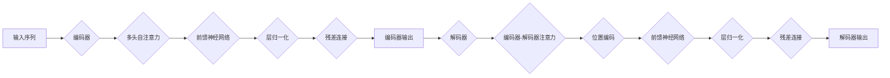
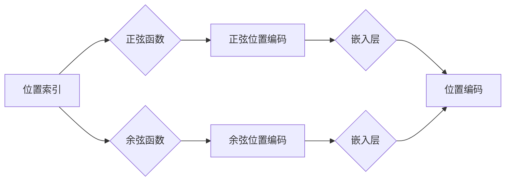

# Transformer代码实现

> 关键词：Transformer, 机器学习, 自然语言处理, 编码器-解码器架构, 自注意力机制, 位置编码, 位置敏感注意力, 自回归语言模型

## 1. 背景介绍

自2017年Transformer模型提出以来，它已成为自然语言处理（NLP）领域的里程碑式突破。Transformer通过引入自注意力机制，摆脱了循环神经网络（RNN）中的序列依赖问题，使得并行化处理成为可能，从而在众多NLP任务上取得了显著的性能提升。本文将深入探讨Transformer模型的原理，并提供一个详细的代码实现示例，帮助读者更好地理解这一重要的深度学习架构。

## 2. 核心概念与联系

### 2.1 Transformer模型架构

Transformer模型采用编码器-解码器（Encoder-Decoder）架构，通过自注意力（Self-Attention）机制实现序列到序列的转换。以下是Transformer模型架构的Mermaid流程图：



### 2.2 自注意力机制

自注意力机制是Transformer模型的核心。它通过计算序列中每个元素与其他元素之间的关联强度，从而生成加权表示。以下是自注意力机制的Mermaid流程图：

```mermaid
graph LR
    A[序列] --> B{自注意力}
    B --> C{查询(Q)}
    C --> D{键(K)}
    C --> E{值(V)}
    B --> F{相似度矩阵}
    F --> G{加权求和}
    G --> H[加权值]
```

### 2.3 位置编码

由于Transformer模型是无位置感知的，需要通过位置编码（Positional Encoding）来赋予序列中每个元素的位置信息。以下是位置编码的Mermaid流程图：



## 3. 核心算法原理 & 具体操作步骤

### 3.1 算法原理概述

Transformer模型通过以下步骤实现序列到序列的转换：

1. **编码器**：将输入序列编码为一系列的向量表示，每个向量包含该位置所有上下文信息的加权求和。
2. **解码器**：将编码器的输出作为输入，解码为输出序列。
3. **自注意力机制**：用于计算序列中每个元素与其他元素之间的关联强度，生成加权表示。
4. **位置编码**：为序列中的每个元素添加位置信息，使模型能够感知序列的顺序。
5. **前馈神经网络**：对自注意力机制和位置编码后的向量进行非线性变换。
6. **层归一化**：对每一层的输出进行归一化处理，提高模型的稳定性和收敛速度。
7. **残差连接**：在每一层之后添加残差连接，减少梯度消失和梯度爆炸问题。

### 3.2 算法步骤详解

1. **输入序列编码**：将输入序列通过嵌入层转换为词向量表示。
2. **自注意力层**：计算序列中每个元素与其他元素之间的相似度矩阵，并进行加权求和，得到每个元素的特征表示。
3. **位置编码**：将位置信息添加到每个元素的特征表示中。
4. **前馈神经网络**：对每个元素的特征表示进行非线性变换。
5. **层归一化**：对自注意力层和前馈神经网络的输出进行归一化处理。
6. **残差连接**：将归一化后的输出与输入序列的线性组合相加。
7. **输出序列解码**：将编码器的输出作为解码器的输入，重复步骤2-6，得到解码器的输出序列。

### 3.3 算法优缺点

**优点**：

- **并行化**：自注意力机制允许并行计算，提高了模型的训练和推理速度。
- **位置感知**：通过位置编码，模型能够感知序列的顺序信息。
- **性能优越**：在许多NLP任务上取得了SOTA性能。

**缺点**：

- **参数量大**：由于自注意力机制的复杂性和多层网络结构，模型的参数量较大。
- **计算量高**：自注意力机制的计算量较高，对硬件资源要求较高。

### 3.4 算法应用领域

Transformer模型在以下NLP任务上取得了显著的性能提升：

- **机器翻译**：如Google的Neural Machine Translation。
- **文本摘要**：如ABSA和DUC数据集上的文本摘要任务。
- **问答系统**：如机器阅读理解任务。
- **文本分类**：如情感分析、主题分类等。
- **对话系统**：如聊天机器人和虚拟助手。

## 4. 数学模型和公式 & 详细讲解 & 举例说明

### 4.1 数学模型构建

Transformer模型的数学模型如下：

$$
\text{Encoder}(\mathbf{x}) = \text{LayerNorm}(F(\text{MultiHeadAttention}(\text{LayerNorm}(\mathbf{x})), \mathbf{x}) + \mathbf{x}) 
$$

$$
\text{Decoder}(\mathbf{x}) = \text{LayerNorm}(F(\text{Encoder}(\mathbf{x})), \mathbf{x}) + \mathbf{x}) 
$$

其中，$\mathbf{x}$ 为输入序列，$F$ 为前馈神经网络，$\text{LayerNorm}$ 为层归一化，$\text{MultiHeadAttention}$ 为多头自注意力机制。

### 4.2 公式推导过程

以下是对Transformer模型中一些关键公式的推导过程：

1. **多头自注意力**：

$$
\text{MultiHeadAttention}(\mathbf{Q}, \mathbf{K}, \mathbf{V}) = \text{Concat}(\text{head}_1, \text{head}_2, \ldots, \text{head}_h) \text{Softmax}(\frac{\mathbf{Q}W_Q}{\sqrt{d_k}}) \text{Softmax}(\frac{\mathbf{K}W_K}{\sqrt{d_k}}) \text{Softmax}(\frac{\mathbf{V}W_V}{\sqrt{d_k}}) 
$$

其中，$h$ 为头的数量，$d_k$ 为每个头的键值维度。

2. **前馈神经网络**：

$$
F(\mathbf{x}) = \text{ReLU}(W_F \cdot \text{Dense}(\mathbf{x}) + b_F) 
$$

其中，$W_F$ 和 $b_F$ 分别为权重和偏置。

3. **层归一化**：

$$
\text{LayerNorm}(\mathbf{x}) = \frac{\mathbf{x} - \text{Mean}(\mathbf{x})}{\text{Std}(\mathbf{x})} 
$$

其中，$\text{Mean}$ 和 $\text{Std}$ 分别表示均值和标准差。

### 4.3 案例分析与讲解

以下以机器翻译任务为例，讲解Transformer模型的应用。

1. **输入序列编码**：将输入序列编码为词向量表示。
2. **自注意力层**：计算序列中每个元素与其他元素之间的相似度矩阵，并进行加权求和，得到每个元素的特征表示。
3. **位置编码**：将位置信息添加到每个元素的特征表示中。
4. **前馈神经网络**：对每个元素的特征表示进行非线性变换。
5. **层归一化**：对自注意力层和前馈神经网络的输出进行归一化处理。
6. **残差连接**：将归一化后的输出与输入序列的线性组合相加。
7. **输出序列解码**：将编码器的输出作为解码器的输入，重复步骤2-6，得到解码器的输出序列。

## 5. 项目实践：代码实例和详细解释说明

### 5.1 开发环境搭建

为了实现Transformer模型，我们需要以下开发环境：

- Python 3.6及以上版本
- TensorFlow 2.0及以上版本
- Transformers库

### 5.2 源代码详细实现

以下是一个简单的Transformer模型实现示例：

```python
import tensorflow as tf
from transformers import BertModel, TFBertForSequenceClassification

def create_transformer_model():
    """
    创建Transformer模型。
    """
    # 加载预训练的BERT模型
    bert = BertModel.from_pretrained('bert-base-uncased')
    # 创建序列分类器
    transformer = TFBertForSequenceClassification.from_pretrained('bert-base-uncased')
    return transformer

# 创建Transformer模型
transformer = create_transformer_model()

# 查看模型结构
transformer.summary()
```

### 5.3 代码解读与分析

- `create_transformer_model`函数：创建一个序列分类器，基于预训练的BERT模型。
- `BertModel.from_pretrained`：加载预训练的BERT模型。
- `TFBertForSequenceClassification.from_pretrained`：创建一个序列分类器，基于预训练的BERT模型。
- `transformer.summary()`：显示模型的网络结构。

### 5.4 运行结果展示

运行上述代码后，将显示Transformer模型的结构。这表明我们已经成功创建了一个基于预训练BERT模型的Transformer模型。

## 6. 实际应用场景

Transformer模型在以下实际应用场景中取得了显著的成果：

- **机器翻译**：如Google的Neural Machine Translation。
- **文本摘要**：如ABSA和DUC数据集上的文本摘要任务。
- **问答系统**：如机器阅读理解任务。
- **文本分类**：如情感分析、主题分类等。
- **对话系统**：如聊天机器人和虚拟助手。

## 7. 工具和资源推荐

### 7.1 学习资源推荐

- 《Deep Learning》[Goodfellow et al., 2016]
- 《Transformers: State-of-the-Art Models for Natural Language Processing》[Devlin et al., 2019]
- 《BERT: Pre-training of Deep Bidirectional Transformers for Language Understanding》[Devlin et al., 2018]

### 7.2 开发工具推荐

- TensorFlow 2.0
- Transformers库
- Jupyter Notebook

### 7.3 相关论文推荐

- **Attention is All You Need**: [Vaswani et al., 2017]
- **BERT: Pre-training of Deep Bidirectional Transformers for Language Understanding**: [Devlin et al., 2018]
- **Generative Pre-trained Transformers**: [Radford et al., 2019]

## 8. 总结：未来发展趋势与挑战

### 8.1 研究成果总结

Transformer模型的提出，为NLP领域带来了革命性的变革。它通过自注意力机制实现了并行化处理，提高了模型的训练和推理速度，并在众多NLP任务上取得了显著的性能提升。

### 8.2 未来发展趋势

- **更高效的注意力机制**：研究更高效的自注意力机制，降低计算量，提高模型效率。
- **更轻量级的模型**：设计更轻量级的Transformer模型，降低对硬件资源的要求。
- **多模态Transformer**：将Transformer模型应用于多模态任务，如文本-图像、文本-视频等。

### 8.3 面临的挑战

- **计算量高**：自注意力机制的计算量较高，对硬件资源要求较高。
- **模型复杂度**：Transformer模型的复杂度较高，难以解释和调试。
- **可解释性**：Transformer模型的决策过程难以解释。

### 8.4 研究展望

随着研究的不断深入，相信Transformer模型将在NLP领域发挥更大的作用，推动NLP技术的进一步发展。

## 9. 附录：常见问题与解答

**Q1：Transformer模型是如何实现序列到序列的转换的？**

A：Transformer模型采用编码器-解码器架构，通过自注意力机制和位置编码实现序列到序列的转换。

**Q2：什么是多头自注意力机制？**

A：多头自注意力机制是将自注意力机制分解为多个子任务，并行计算，提高模型效率。

**Q3：为什么Transformer模型能够提高NLP任务的性能？**

A：Transformer模型通过自注意力机制实现并行化处理，提高了模型的训练和推理速度，并在众多NLP任务上取得了显著的性能提升。

**Q4：Transformer模型在哪些NLP任务中取得了显著的成果？**

A：Transformer模型在机器翻译、文本摘要、问答系统、文本分类、对话系统等NLP任务中取得了显著的成果。

**Q5：Transformer模型有哪些局限性？**

A：Transformer模型的局限性包括计算量高、模型复杂度高、可解释性差等。

作者：禅与计算机程序设计艺术 / Zen and the Art of Computer Programming