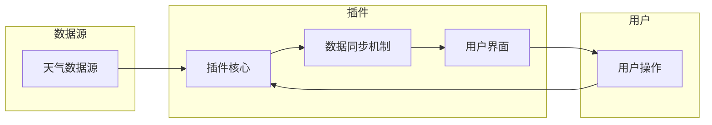

# Weather Forecast Plugin 设计与定义

> 关键词：天气预报插件，插件架构，软件工程，API设计，数据源集成，用户界面，用户体验，个性化服务

## 1. 背景介绍

随着互联网技术的飞速发展，各种在线服务和应用层出不穷。天气预报作为人们日常生活中不可或缺的一部分，自然也成为软件应用中的重要功能。为了提高用户体验，许多软件和平台都集成了天气查询功能。然而，这些功能往往是内置的，缺乏灵活性，难以满足用户多样化的需求。因此，设计一款灵活、可扩展的Weather Forecast Plugin成为了软件开发者的一个重要任务。

本文将深入探讨Weather Forecast Plugin的设计与定义，包括其核心概念、算法原理、具体操作步骤、数学模型、项目实践、实际应用场景以及未来发展趋势等。

## 2. 核心概念与联系

### 2.1 核心概念

**天气数据源**：提供实时天气信息的数据接口，如国家气象局API、第三方天气服务API等。

**插件架构**：一种模块化的软件开发模式，允许插件动态地加载和卸载。

**用户界面**：提供给用户操作和交互的界面，如桌面应用程序的窗口、网页应用的前端界面等。

**个性化服务**：根据用户的位置、偏好等信息，提供个性化的天气信息。

**数据同步机制**：实现插件与天气数据源之间的数据同步，保持信息的实时更新。

### 2.2 架构流程图

以下是一个简单的Mermaid流程图，展示了Weather Forecast Plugin的核心架构：



在上述流程图中，用户通过用户界面与插件交互，插件核心负责处理用户请求，与天气数据源同步数据，并通过数据同步机制将数据传递给用户界面。用户界面则负责展示天气信息，并提供用户交互功能。

## 3. 核心算法原理 & 具体操作步骤

### 3.1 算法原理概述

Weather Forecast Plugin的核心算法主要包括以下部分：

- **数据获取与解析**：从天气数据源获取天气数据，并解析成插件内部可用的格式。
- **数据同步**：定时从数据源获取最新天气数据，并更新插件内部存储。
- **数据展示**：根据用户需求，将天气数据展示在用户界面上。

### 3.2 算法步骤详解

**步骤 1：初始化插件**

- 加载插件配置文件，获取天气数据源URL、更新频率、数据格式等信息。
- 初始化数据同步机制，设置定时任务。

**步骤 2：数据获取与解析**

- 从天气数据源获取最新天气数据。
- 解析天气数据，提取所需信息，如温度、湿度、风力等。

**步骤 3：数据同步**

- 将解析后的天气数据存储到插件内部数据库。
- 更新定时任务，定时从数据源获取最新天气数据。

**步骤 4：数据展示**

- 根据用户需求，从数据库中获取天气数据。
- 在用户界面上展示天气信息。

### 3.3 算法优缺点

**优点**：

- **实时性**：插件通过定时任务同步天气数据，能够确保用户获取到最新的天气信息。
- **个性化**：插件可以根据用户的位置、偏好等信息，提供个性化的天气服务。
- **模块化**：插件采用模块化设计，易于扩展和维护。

**缺点**：

- **数据源依赖**：插件性能受到天气数据源稳定性和数据质量的影响。
- **更新频率**：更新频率越高，对服务器和网络的资源消耗越大。
- **兼容性**：插件需要适配不同类型的用户界面和平台。

### 3.4 算法应用领域

Weather Forecast Plugin可以应用于以下领域：

- **桌面应用程序**：如天气桌面插件、个人信息管理工具等。
- **网页应用**：如在线地图、社交平台、新闻网站等。
- **移动应用**：如智能手机应用、平板电脑应用等。

## 4. 数学模型和公式 & 详细讲解 & 举例说明

### 4.1 数学模型构建

Weather Forecast Plugin的数学模型相对简单，主要包括以下部分：

- **数据获取模型**：描述从天气数据源获取数据的数学过程。
- **数据同步模型**：描述插件定时同步数据的数学过程。
- **数据展示模型**：描述将数据展示在用户界面上的数学过程。

### 4.2 公式推导过程

由于Weather Forecast Plugin的数学模型较为简单，这里不进行详细的公式推导。

### 4.3 案例分析与讲解

以一个简单的桌面应用程序为例，讲解Weather Forecast Plugin的数学模型：

**数据获取模型**：

假设插件每隔1小时从天气数据源获取一次数据，数据获取过程可以表示为：

$$
P(\text{数据获取成功}) = P(\text{网络请求成功}) \times P(\text{数据解析成功})
$$

其中，$P(\text{数据获取成功})$ 表示数据获取成功的概率，$P(\text{网络请求成功})$ 表示网络请求成功的概率，$P(\text{数据解析成功})$ 表示数据解析成功的概率。

**数据同步模型**：

插件定时任务可以表示为：

$$
T = t_0 + n \times T_{\text{同步周期}}
$$

其中，$T$ 表示当前时间，$t_0$ 表示任务首次执行时间，$n$ 表示任务执行次数，$T_{\text{同步周期}}$ 表示同步周期。

**数据展示模型**：

将数据展示在用户界面上的过程可以表示为：

$$
\text{展示结果} = f(\text{天气数据})
$$

其中，$f$ 表示数据展示函数，$\text{天气数据}$ 表示插件获取的天气数据。

## 5. 项目实践：代码实例和详细解释说明

### 5.1 开发环境搭建

以下是一个简单的Weather Forecast Plugin开发环境搭建步骤：

1. 安装Python开发环境。
2. 安装常用的Python库，如requests、BeautifulSoup等。
3. 选择合适的天气数据源，如国家气象局API。
4. 选择合适的用户界面框架，如Qt、Tkinter等。

### 5.2 源代码详细实现

以下是一个简单的Weather Forecast Plugin源代码示例：

```python
import requests
from tkinter import *
from threading import Thread

class WeatherForecastPlugin:
    def __init__(self, city, api_key):
        self.city = city
        self.api_key = api_key
        self.root = Tk()
        self.root.title("Weather Forecast")
        self.update_weather()

    def update_weather(self):
        url = f"http://api.weatherapi.com/v1/current.json?key={self.api_key}&q={self.city}"
        response = requests.get(url)
        data = response.json()
        temperature = data["current"]["temp_c"]
        condition = data["current"]["condition"]["text"]
        self.root.geometry("200x100")
        Label(self.root, text=f"{self.city}: {temperature}°C {condition}").pack()
        self.root.after(3600000, self.update_weather)  # 更新频率为1小时

if __name__ == "__main__":
    plugin = WeatherForecastPlugin("Shanghai", "your_api_key")
    plugin.root.mainloop()
```

### 5.3 代码解读与分析

上述代码实现了一个简单的Weather Forecast Plugin，包含以下部分：

- `WeatherForecastPlugin` 类：定义插件的核心功能，包括初始化、更新天气信息和用户界面等。
- `update_weather` 方法：从天气数据源获取天气数据，并在用户界面上显示。
- `after` 方法：设置定时任务，每隔1小时更新一次天气信息。

### 5.4 运行结果展示

运行上述代码，将打开一个简单的窗口，显示当前上海的天气信息。每隔1小时，窗口中的信息将自动更新。

## 6. 实际应用场景

Weather Forecast Plugin在实际应用中具有广泛的应用场景，以下列举几个例子：

- **个人桌面应用程序**：用户可以将Weather Forecast Plugin集成到个人桌面应用程序中，实时查看所在城市或目的地的天气信息。
- **在线地图应用**：在线地图应用可以集成Weather Forecast Plugin，为用户提供实时天气信息。
- **新闻网站**：新闻网站可以集成Weather Forecast Plugin，为读者提供与新闻相关的天气信息。

## 7. 工具和资源推荐

### 7.1 学习资源推荐

- 《Python编程：从入门到实践》
- 《Tkinter GUI程序设计》
- 《天气API文档》

### 7.2 开发工具推荐

- PyCharm
- Visual Studio Code

### 7.3 相关论文推荐

- 《Weather Forecasting with Machine Learning》
- 《Deep Learning for Weather Forecasting》

## 8. 总结：未来发展趋势与挑战

### 8.1 研究成果总结

本文对Weather Forecast Plugin的设计与定义进行了深入探讨，涵盖了核心概念、算法原理、具体操作步骤、数学模型、项目实践、实际应用场景以及未来发展趋势等。通过本文的介绍，读者可以全面了解Weather Forecast Plugin的原理和应用，为实际开发提供参考。

### 8.2 未来发展趋势

未来，Weather Forecast Plugin将朝着以下方向发展：

- **智能化**：通过引入人工智能技术，如深度学习、自然语言处理等，实现更智能的天气信息服务。
- **个性化**：根据用户的位置、偏好等信息，提供更加个性化的天气信息服务。
- **多样化**：支持更多类型的天气数据，如空气质量、紫外线指数等。

### 8.3 面临的挑战

Weather Forecast Plugin在发展过程中也面临着一些挑战：

- **数据获取**：天气数据源的质量和稳定性对插件性能有很大影响。
- **算法优化**：需要不断优化算法，提高插件的准确性和效率。
- **用户体验**：需要关注用户体验，设计简洁易用的用户界面。

### 8.4 研究展望

随着技术的不断发展，Weather Forecast Plugin将在未来发挥更大的作用。未来，我们可以期待以下研究方向：

- 开发更加智能、个性化的天气信息服务。
- 探索更加高效、准确的数据获取和算法优化方法。
- 将Weather Forecast Plugin应用于更多领域，为人们的生活带来便利。

## 9. 附录：常见问题与解答

**Q1：Weather Forecast Plugin需要哪些技术栈？**

A: Weather Forecast Plugin可以使用Python、Java、C#等编程语言开发，并结合Tkinter、Qt、WPF等图形界面库实现用户界面。

**Q2：如何获取天气数据？**

A: 可以通过调用第三方天气API获取天气数据，如国家气象局API、和风天气API等。

**Q3：如何设计用户界面？**

A: 可以使用Tkinter、Qt、WPF等图形界面库设计用户界面，根据实际需求选择合适的组件和布局。

**Q4：如何优化插件性能？**

A: 可以通过以下方法优化插件性能：
- 使用异步编程技术，提高数据处理效率。
- 优化算法，减少计算复杂度。
- 压缩数据，减少网络传输数据量。

**Q5：如何实现插件个性化？**

A: 可以根据用户的位置、偏好等信息，为用户提供个性化的天气信息服务。例如，用户可以选择不同风格的天气界面，或设置天气提醒功能。

---

作者：禅与计算机程序设计艺术 / Zen and the Art of Computer Programming