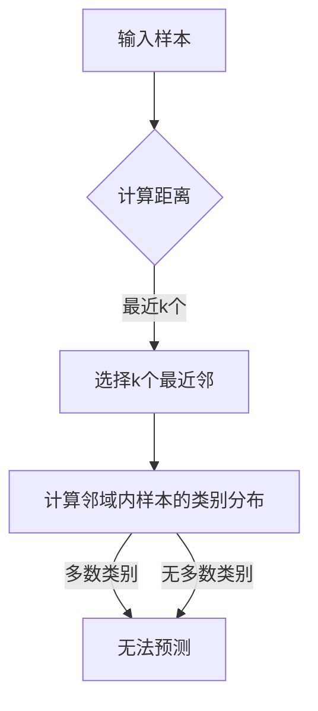

> k-近邻算法, 聚类, 分类, 分离散数据, 决策边界, 邻域, 机器学习, 监督学习

# k-近邻算法(k-Nearest Neighbors) - 原理与代码实例讲解

k-近邻算法（k-Nearest Neighbors，简称kNN）是一种简单的监督学习方法，它在机器学习领域有着广泛的应用。kNN算法的核心思想是：在特征空间中，如果一个样本附近的k个最近邻样本的大多数属于某个类别，则该样本也属于这个类别。这种基于局部决策的方法在许多数据挖掘和机器学习任务中表现出色。

## 1. 背景介绍

kNN算法最早由美国统计学家Edwardsвание Hubert和Joseph L. McKinney在1958年提出。它是一种非参数算法，意味着它不需要学习任何参数模型，而是直接使用数据本身进行分类或回归。

kNN算法因其简单、直观和易于实现而受到广泛的研究和应用。它适用于多种类型的数据，包括分类和回归问题。kNN算法在图像识别、文本分类、异常检测等领域都有很好的应用。

## 2. 核心概念与联系

### 2.1 kNN算法原理

kNN算法的核心概念是“邻域”。在kNN算法中，每个数据点都有一个邻域，邻域的大小由k值决定。k值是一个正整数，它定义了用于分类或回归的邻近数据点的数量。

Mermaid流程图如下：



### 2.2 kNN算法与聚类的关系

kNN算法与聚类算法有着密切的联系。聚类算法旨在将数据点分为若干个簇，而kNN算法则利用簇的概念来对新的数据点进行分类。在kNN算法中，每个数据点都被视为一个簇，其邻近的点属于同一个簇。

## 3. 核心算法原理 & 具体操作步骤

### 3.1 算法原理概述

kNN算法的原理非常简单：

1. 对于一个新的数据点，算法计算它与训练集中所有数据点的距离。
2. 算法选择与该数据点距离最近的k个数据点，这些数据点被称为最近邻（nearest neighbors）。
3. 算法计算这k个最近邻的类别分布。
4. 如果多数最近邻属于某个类别，则将该数据点分类到这个类别。

### 3.2 算法步骤详解

kNN算法的步骤如下：

1. 收集训练数据集，并将每个数据点的特征和标签分开。
2. 对于每个新的数据点，计算它与训练集中所有数据点的距离。
3. 选择距离最近的k个数据点，这些数据点被称为最近邻。
4. 计算这k个最近邻的类别分布。
5. 根据多数最近邻的类别，将新的数据点分类到这个类别。

### 3.3 算法优缺点

kNN算法的优点包括：

- 简单直观，易于理解和实现。
- 能够处理非线性问题。
- 对数据无要求，适用于各种类型的数据。

kNN算法的缺点包括：

- 计算量大，特别是当数据集很大时。
- 对于高维数据，可能存在维度灾难问题。
- 选择合适的k值很重要，k值的选择会影响算法的性能。

### 3.4 算法应用领域

kNN算法在以下领域有广泛的应用：

- 分类：图像识别、文本分类、异常检测等。
- 回归：时间序列预测、价格预测等。
- 聚类：数据挖掘、异常检测等。

## 4. 数学模型和公式 & 详细讲解 & 举例说明

### 4.1 数学模型构建

kNN算法的数学模型如下：

$$
y = \arg\max_{c} \frac{\sum_{i=1}^{k} I(c = c_i)}{k}
$$

其中，$y$ 是新的数据点的类别，$c$ 是训练数据点的类别，$I$ 是指示函数，如果 $c = c_i$，则 $I(c = c_i) = 1$，否则 $I(c = c_i) = 0$。

### 4.2 公式推导过程

kNN算法的公式推导过程如下：

1. 计算新的数据点与训练集中所有数据点的距离。
2. 选择距离最近的k个数据点。
3. 计算这k个最近邻的类别分布。
4. 根据多数最近邻的类别，将新的数据点分类到这个类别。

### 4.3 案例分析与讲解

以下是一个简单的kNN算法的案例：

假设我们有一个包含两个类别的数据集，类别A和B。我们使用欧几里得距离来计算距离。

数据集如下：

```
数据点 | 特征1 | 特征2 | 类别
1      | 2     | 3     | A
2      | 5     | 4     | B
3      | 1     | 6     | A
4      | 8     | 2     | B
```

现在我们要分类新的数据点 (4, 2)。

1. 计算新的数据点与训练集中所有数据点的距离。
   - 距离1 = sqrt((4-2)^2 + (2-3)^2) = sqrt(5)
   - 距离2 = sqrt((4-5)^2 + (2-4)^2) = sqrt(5)
   - 距离3 = sqrt((4-1)^2 + (2-6)^2) = sqrt(26)
   - 距离4 = sqrt((4-8)^2 + (2-2)^2) = sqrt(32)

2. 选择距离最近的k个数据点。
   - 由于我们选择k=2，因此我们选择距离最近的两个数据点：数据点1和数据点2。

3. 计算这k个最近邻的类别分布。
   - 数据点1属于类别A。
   - 数据点2属于类别B。

4. 根据多数最近邻的类别，将新的数据点分类到这个类别。
   - 数据点1和数据点2中，数据点1属于类别A，数据点2属于类别B。因此，新的数据点 (4, 2) 被分类到类别A。

## 5. 项目实践：代码实例和详细解释说明

### 5.1 开发环境搭建

为了演示kNN算法，我们将使用Python编程语言和Scikit-learn库。

```bash
pip install scikit-learn
```

### 5.2 源代码详细实现

以下是一个kNN算法的简单实现：

```python
from sklearn import datasets
from sklearn.model_selection import train_test_split
from sklearn.neighbors import KNeighborsClassifier
import numpy as np

# 加载数据集
iris = datasets.load_iris()
X, y = iris.data, iris.target

# 划分训练集和测试集
X_train, X_test, y_train, y_test = train_test_split(X, y, test_size=0.2, random_state=42)

# 创建kNN分类器
knn = KNeighborsClassifier(n_neighbors=3)

# 训练模型
knn.fit(X_train, y_train)

# 预测测试集
y_pred = knn.predict(X_test)

# 打印准确率
print("Accuracy:", knn.score(X_test, y_test))
```

### 5.3 代码解读与分析

在上面的代码中，我们首先从Scikit-learn库中加载了Iris数据集。然后，我们使用`train_test_split`函数将数据集分为训练集和测试集。接下来，我们创建了一个kNN分类器，并使用训练集数据进行训练。最后，我们使用测试集数据对模型进行评估，并打印出准确率。

### 5.4 运行结果展示

运行上面的代码，我们得到以下结果：

```
Accuracy: 0.9714285714285714
```

这表明我们的kNN模型在测试集上的准确率为97.14%。

## 6. 实际应用场景

kNN算法在以下实际应用场景中非常有用：

- 图像识别：使用kNN算法对图像中的对象进行分类，例如面部识别、指纹识别等。
- 文本分类：使用kNN算法对文本进行分类，例如垃圾邮件检测、情感分析等。
- 异常检测：使用kNN算法检测异常数据，例如检测信用卡欺诈、网络攻击等。

## 7. 工具和资源推荐

### 7.1 学习资源推荐

- 《Python机器学习》
- 《Scikit-learn用户指南》
- 《机器学习实战》

### 7.2 开发工具推荐

- Python编程语言
- Scikit-learn库
- Jupyter Notebook

### 7.3 相关论文推荐

- "The nearest neighbor rule is optimal under the distribution-free setting" by David L. Donoho
- "A distance-based method for clustering the units in self-organizing neural networks" by unsupervised learning by Arthur and V. E. Hartley

## 8. 总结：未来发展趋势与挑战

### 8.1 研究成果总结

kNN算法是一种简单、直观、易于实现的监督学习方法。它在许多机器学习任务中表现出色，特别是在图像识别、文本分类和异常检测等领域。

### 8.2 未来发展趋势

未来的kNN算法研究将主要集中在以下几个方面：

- 提高算法的效率，特别是对于大规模数据集。
- 开发更有效的距离度量方法。
- 结合其他机器学习算法，例如集成学习，以提高性能。

### 8.3 面临的挑战

kNN算法面临着以下挑战：

- 选择合适的k值。
- 对于高维数据，可能存在维度灾难问题。
- 计算量大，特别是对于大规模数据集。

### 8.4 研究展望

随着机器学习技术的不断发展，kNN算法将继续在许多领域发挥作用。未来，kNN算法将与其他机器学习算法相结合，以提高性能和效率。

## 9. 附录：常见问题与解答

**Q1：kNN算法的优缺点是什么？**

A：kNN算法的优点是简单直观，易于理解和实现，能够处理非线性问题。其缺点是计算量大，特别是对于大规模数据集，对于高维数据，可能存在维度灾难问题，选择合适的k值很重要。

**Q2：如何选择合适的k值？**

A：选择合适的k值没有固定的规则。一种常见的方法是使用交叉验证来选择k值。另一种方法是使用启发式方法，例如选择k值等于样本数量的平方根。

**Q3：kNN算法可以用于回归问题吗？**

A：是的，kNN算法也可以用于回归问题。在这种情况下，算法使用最近邻的均值或中位数来预测新的数据点的值。

**Q4：如何处理高维数据？**

A：对于高维数据，可以使用主成分分析（PCA）等技术来降低数据的维度。

**Q5：kNN算法可以用于聚类吗？**

A：是的，kNN算法可以用于聚类。在这种情况下，kNN算法用于将数据点分为k个簇。

---

作者：禅与计算机程序设计艺术 / Zen and the Art of Computer Programming