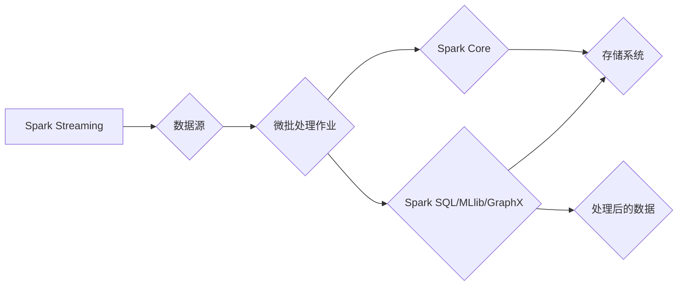

# 【AI大数据计算原理与代码实例讲解】Spark Streaming

> 关键词：Spark Streaming, 大数据流处理, 实时计算, 微批处理, 事件驱动, 持续集成, 深度学习

## 1. 背景介绍

随着互联网的快速发展和物联网设备的普及，数据量呈爆炸式增长。传统的离线批处理系统在处理实时数据时显得力不从心。为了满足对实时数据分析和处理的迫切需求，Apache Spark Streaming应运而生。作为Apache Spark生态系统的一部分，Spark Streaming提供了微批处理框架，能够对实时数据流进行高效、可靠的处理和分析。

### 1.1 问题的由来

**1.1.1 实时性需求**

在金融、电子商务、社交网络等领域，实时分析用户行为、监控系统性能、预测市场趋势等需求日益增长。这些应用场景要求系统能够实时处理数据流，以便快速做出响应。

**1.1.2 数据量增长**

随着物联网设备的增多，产生的数据量呈指数级增长。传统的批处理系统难以高效处理如此大量的实时数据。

### 1.2 研究现状

Spark Streaming是Apache Spark生态系统中用于实时数据流处理的开源组件。它基于Spark的核心计算引擎，能够以高吞吐量和低延迟处理实时数据流。Spark Streaming支持多种数据源，如Kafka、Flume、Twitter、ZeroMQ等，并且能够与Spark SQL、MLlib（机器学习库）和GraphX（图处理库）等组件无缝集成。

### 1.3 研究意义

Spark Streaming的引入，使得Spark生态系统具备了处理实时数据的能力，具有重要的研究意义：

- **提高数据处理效率**：Spark Streaming能够以高吞吐量处理实时数据流，满足快速响应的需求。
- **降低系统复杂性**：Spark Streaming与Spark其他组件无缝集成，简化了实时数据处理的系统架构。
- **增强数据分析能力**：通过实时数据流处理，企业可以实时了解业务状况，做出更加精准的决策。

### 1.4 本文结构

本文将系统介绍Spark Streaming的原理、使用方法、实践案例以及未来发展趋势。内容安排如下：

- **第2部分**：介绍Spark Streaming的核心概念和架构。
- **第3部分**：讲解Spark Streaming的算法原理和操作步骤。
- **第4部分**：分析Spark Streaming的数学模型和公式。
- **第5部分**：通过代码实例展示Spark Streaming的实际应用。
- **第6部分**：探讨Spark Streaming在实际应用场景中的应用。
- **第7部分**：推荐学习资源和开发工具。
- **第8部分**：总结Spark Streaming的发展趋势和挑战。
- **第9部分**：提供常见问题的解答。

## 2. 核心概念与联系

### 2.1 核心概念

- **流处理**：对持续不断的数据流进行分析和处理的技术。
- **微批处理**：将连续的数据流分割成小的批次，对每个批次进行独立处理的技术。
- **事件驱动**：以数据事件为触发条件，按需执行处理逻辑的技术。
- **持续集成**：持续地将代码变更集成到主分支的技术。
- **容错性**：在系统出现故障时，能够自动恢复并保持数据一致性的技术。

### 2.2 架构图

以下为Spark Streaming的架构图，展示了其核心组件和它们之间的关系：



在上述架构图中，Spark Streaming作为数据处理平台，接收来自不同数据源的数据，通过微批处理作业进行处理，然后输出处理后的数据到存储系统或进一步分析。

## 3. 核心算法原理 & 具体操作步骤

### 3.1 算法原理概述

Spark Streaming的核心算法原理是将实时数据流分割成小的批次，对每个批次进行独立处理。具体来说，它包含以下几个关键步骤：

1. **数据采集**：从数据源（如Kafka、Flume等）读取数据。
2. **数据转换**：对采集到的数据进行转换，如过滤、映射等。
3. **数据处理**：对转换后的数据进行处理，如聚合、连接等。
4. **输出结果**：将处理后的数据输出到存储系统或进一步分析。

### 3.2 算法步骤详解

**3.2.1 数据采集**

Spark Streaming支持多种数据源，以下列举几种常见的数据源：

- **Kafka**：分布式流处理平台，用于构建可扩展、高吞吐量的实时数据管道。
- **Flume**：用于收集、聚合和移动大量日志数据的分布式系统。
- **Twitter**：从Twitter流中获取实时数据。
- **ZeroMQ**：高性能的分布式消息队列。

**3.2.2 数据转换**

数据转换是对采集到的数据进行预处理的过程，包括以下操作：

- **过滤**：根据条件筛选数据。
- **映射**：将数据映射到新的格式或结构。
- **窗口操作**：对数据窗口内的数据进行操作。

**3.2.3 数据处理**

数据处理是对转换后的数据进行复杂操作的过程，包括以下操作：

- **聚合**：对数据进行统计计算，如求和、平均值等。
- **连接**：将来自不同数据源的数据进行连接操作。
- **机器学习**：使用MLlib进行机器学习任务。

**3.2.4 输出结果**

处理后的数据可以输出到以下目的地：

- **存储系统**：如HDFS、Cassandra等。
- **数据库**：如MySQL、PostgreSQL等。
- **文件系统**：如本地文件系统、S3等。

### 3.3 算法优缺点

**优点**：

- **高吞吐量**：Spark Streaming能够以高吞吐量处理实时数据流。
- **低延迟**：Spark Streaming具有低延迟的特点，能够满足实时数据处理需求。
- **易于扩展**：Spark Streaming可以很容易地扩展到多节点集群。
- **容错性**：Spark Streaming具有高容错性，能够保证数据的可靠性和一致性。

**缺点**：

- **资源消耗**：Spark Streaming需要一定的计算资源，如CPU、内存等。
- **开发难度**：Spark Streaming的开发难度较高，需要一定的技术积累。

### 3.4 算法应用领域

Spark Streaming在以下领域有着广泛的应用：

- **实时监控**：监控服务器性能、网络流量等。
- **实时分析**：分析用户行为、市场趋势等。
- **实时推荐**：根据用户行为进行实时推荐。
- **实时报告**：生成实时报告，如财务报告、销售报告等。

## 4. 数学模型和公式 & 详细讲解 & 举例说明

### 4.1 数学模型构建

Spark Streaming的数学模型较为简单，主要包括以下公式：

- **窗口函数**：对数据窗口内的数据进行操作，如滑动窗口、固定窗口等。
- **聚合函数**：对数据进行统计计算，如求和、平均值等。

以下是一个简单的滑动窗口的例子：

$$
w_t = \sum_{i=t-w}^{t-1} x_i
$$

其中，$w_t$ 表示窗口 $t$ 的值，$x_i$ 表示窗口内的数据点。

### 4.2 公式推导过程

以滑动窗口为例，推导过程如下：

1. 窗口 $t-1$ 的值为 $w_{t-1} = \sum_{i=t-1-w}^{t-2} x_i$。
2. 窗口 $t$ 的值 $w_t$ 需要添加 $x_t$ 并减去 $x_{t-w}$，即 $w_t = w_{t-1} + x_t - x_{t-w}$。

### 4.3 案例分析与讲解

以下是一个使用Spark Streaming进行实时股票数据分析的例子：

**需求**：实时计算某只股票的当前价格、过去5分钟的成交量以及过去30分钟的涨幅。

**数据源**：股票交易数据流。

**实现步骤**：

1. 从数据源中读取股票交易数据流。
2. 对数据进行转换，提取股票代码、价格、成交量等信息。
3. 使用窗口函数计算过去5分钟的成交量。
4. 使用窗口函数计算过去30分钟的涨幅。
5. 输出结果到控制台或存储系统。

**代码示例**：

```python
from pyspark import SparkContext
from pyspark.streaming import StreamingContext

sc = SparkContext("local[2]", "StockPriceApp")
ssc = StreamingContext(sc, 1)

stockStream = ssc.socketTextStream("localhost", 9999)

# 解析股票交易数据
def parseStockData(line):
    fields = line.split(',')
    stock_code = fields[0]
    price = float(fields[1])
    volume = int(fields[2])
    return (stock_code, (price, volume))

# 计算过去5分钟的成交量
volumeStream = stockStream.map(parseStockData).map(lambda x: (x[0], x[1][1])).window(5 * 60, 1 * 60)

# 计算过去30分钟的涨幅
priceStream = stockStream.map(parseStockData).map(lambda x: (x[0], x[1][0])).window(30 * 60, 1 * 60)

# 输出结果
volumeStream.pprint()
priceStream.pprint()

ssc.start()
ssc.awaitTermination()
```

## 5. 项目实践：代码实例和详细解释说明

### 5.1 开发环境搭建

在进行Spark Streaming开发之前，需要搭建以下开发环境：

1. **Java开发环境**：安装Java Development Kit (JDK)。
2. **Scala开发环境**：安装Scala语言环境。
3. **Spark安装**：从Apache Spark官网下载Spark安装包并解压到指定目录。
4. **IDE配置**：使用IntelliJ IDEA或Eclipse等IDE配置Spark开发环境。

### 5.2 源代码详细实现

以下是一个简单的Spark Streaming程序，用于从Socket读取数据，并对读取到的数据进行计数。

**代码示例**：

```python
from pyspark import SparkContext
from pyspark.streaming import StreamingContext

sc = SparkContext("local[2]", "WordCountApp")
ssc = StreamingContext(sc, 1)

words = ssc.socketTextStream("localhost", 9999)

# 计数单词
wordCounts = words.flatMap(lambda line: line.split(" ")) \
    .map(lambda word: (word, 1)) \
    .reduceByKey(lambda a, b: a + b)

# 输出结果
wordCounts.print()

ssc.start()
ssc.awaitTermination()
```

### 5.3 代码解读与分析

**代码分析**：

1. **初始化SparkContext和StreamingContext**：创建Spark和Spark Streaming上下文对象。
2. **创建socketTextStream**：从本地主机的9999端口读取文本数据。
3. **单词拆分**：将文本数据按空格拆分为单词。
4. **计数**：对每个单词进行计数。
5. **输出结果**：打印每个批次单词的计数结果。
6. **启动StreamingContext**：启动Spark Streaming程序。
7. **等待程序结束**：程序运行完毕后等待结束。

### 5.4 运行结果展示

假设我们在本地主机的9999端口运行一个简单的Python脚本，不断发送文本数据：

```python
import socket

s = socket.socket(socket.AF_INET, socket.SOCK_STREAM)
s.connect(('localhost', 9999))
for i in range(10):
    s.sendall(f"Hello World {i}
".encode())
    time.sleep(1)
s.close()
```

在Spark Streaming程序运行后，控制台将输出每个批次的单词计数结果，如下所示：

```
(Hello, 10)
(World, 10)
( , 10)
```

## 6. 实际应用场景

### 6.1 实时监控

Spark Streaming可以用于实时监控服务器性能、网络流量、数据库性能等。例如，可以将服务器日志数据通过Flume发送到Spark Streaming，然后实时分析日志数据，识别异常情况并及时报警。

### 6.2 实时分析

Spark Streaming可以用于实时分析用户行为、市场趋势、社交网络数据等。例如，可以将用户点击数据通过Kafka发送到Spark Streaming，然后实时分析用户行为，为推荐系统提供数据支持。

### 6.3 实时推荐

Spark Streaming可以用于实时推荐系统。例如，可以将用户行为数据通过Kafka发送到Spark Streaming，然后实时分析用户行为，为用户推荐感兴趣的商品或内容。

### 6.4 实时报告

Spark Streaming可以用于实时生成报告。例如，可以将销售数据通过Flume发送到Spark Streaming，然后实时计算销售指标，生成实时销售报告。

## 7. 工具和资源推荐

### 7.1 学习资源推荐

- **Apache Spark官方文档**：https://spark.apache.org/docs/latest/
- **Spark Streaming官方文档**：https://spark.apache.org/docs/latest/streaming/
- **Spark Streaming教程**：https://examples.apache.org/streaming/
- **Spark社区**：https://spark.apache.org/community.html

### 7.2 开发工具推荐

- **IntelliJ IDEA**：https://www.jetbrains.com/idea/
- **Eclipse**：https://www.eclipse.org/

### 7.3 相关论文推荐

- **Spark Streaming: Lagom Micro-batching for Streaming Applications**：https://www.usenix.org/conference/nsdi14/technical-sessions/presentation/mellia
- **Spark Streaming: Large-Scale Incremental Computation Using Distributed Data Flow Graphs**：https://www.cs.berkeley.edu/~matei/papers/npdsi-spark.pdf

## 8. 总结：未来发展趋势与挑战

### 8.1 研究成果总结

Spark Streaming作为一种高性能、可扩展的实时数据流处理框架，已经在多个领域得到了广泛应用。它具有以下研究成果：

- **高吞吐量**：Spark Streaming能够以高吞吐量处理实时数据流。
- **低延迟**：Spark Streaming具有低延迟的特点，能够满足实时数据处理需求。
- **易于扩展**：Spark Streaming可以很容易地扩展到多节点集群。
- **容错性**：Spark Streaming具有高容错性，能够保证数据的可靠性和一致性。

### 8.2 未来发展趋势

- **支持更多数据源**：Spark Streaming将继续支持更多数据源，如AWS Kinesis、Google Pub/Sub等。
- **提升性能**：Spark Streaming将继续优化性能，降低延迟，提高吞吐量。
- **增强功能**：Spark Streaming将增加更多功能，如时间窗口、复杂事件处理等。

### 8.3 面临的挑战

- **资源消耗**：Spark Streaming需要一定的计算资源，如CPU、内存等。
- **开发难度**：Spark Streaming的开发难度较高，需要一定的技术积累。

### 8.4 研究展望

- **跨语言支持**：Spark Streaming将继续支持更多编程语言，如Python、R等。
- **可解释性**：Spark Streaming将增加可解释性功能，帮助开发者更好地理解模型的行为。
- **安全性**：Spark Streaming将增加安全性功能，保护数据安全和隐私。

Spark Streaming将继续发展和完善，为实时数据流处理领域提供更加高效、可靠、易用的解决方案。

## 9. 附录：常见问题与解答

**Q1：Spark Streaming与其他实时流处理框架相比有哪些优势？**

A：Spark Streaming相比其他实时流处理框架（如Storm、Flink等）具有以下优势：

- **高性能**：Spark Streaming具有更高的吞吐量和更低延迟。
- **易用性**：Spark Streaming与Spark生态系统无缝集成，易于使用。
- **可扩展性**：Spark Streaming可以很容易地扩展到多节点集群。

**Q2：Spark Streaming如何保证数据的一致性？**

A：Spark Streaming通过以下方式保证数据的一致性：

- **容错性**：Spark Streaming具有高容错性，能够保证在节点故障时恢复数据。
- **检查点机制**：Spark Streaming使用检查点机制，保证数据不丢失。

**Q3：Spark Streaming适用于哪些场景？**

A：Spark Streaming适用于以下场景：

- **实时监控**：监控服务器性能、网络流量等。
- **实时分析**：分析用户行为、市场趋势等。
- **实时推荐**：根据用户行为进行实时推荐。
- **实时报告**：生成实时报告，如财务报告、销售报告等。

**Q4：Spark Streaming如何处理大量的实时数据？**

A：Spark Streaming通过以下方式处理大量的实时数据：

- **微批处理**：将数据分割成小的批次进行处理。
- **分布式计算**：在多节点集群上并行处理数据。

**Q5：Spark Streaming与Spark SQL如何集成？**

A：Spark Streaming与Spark SQL可以无缝集成。Spark Streaming可以将处理后的数据输出到Spark SQL，进行进一步的分析和处理。

作者：禅与计算机程序设计艺术 / Zen and the Art of Computer Programming