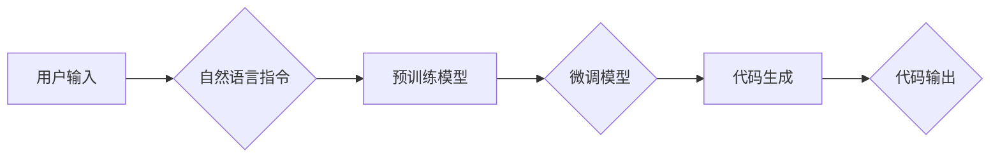

# 【LangChain编程：从入门到实践】大模型原理解释

> 关键词：LangChain, 大模型, 生成式AI, 编程，自然语言处理，机器学习，预训练，微调，Transformer

## 1. 背景介绍

随着深度学习和自然语言处理技术的飞速发展，人工智能领域涌现出了许多令人兴奋的新技术。LangChain编程是一种利用大模型进行编程任务的新兴方法，它将自然语言与代码生成相结合，为开发者提供了一种全新的编程范式。本文将深入探讨LangChain编程的原理，从入门到实践，帮助读者全面理解这一前沿技术。

### 1.1 问题的由来

传统的编程方式要求开发者熟练掌握编程语言和编程范式，对于非程序员或编程新手来说，编程学习曲线陡峭，门槛较高。同时，随着软件开发项目日益复杂，代码生成和自动化编程成为提高开发效率的重要方向。LangChain编程应运而生，它利用大模型的强大能力，将自然语言指令转化为代码，降低了编程的门槛，提高了开发效率。

### 1.2 研究现状

目前，LangChain编程主要基于预训练的大语言模型，如GPT-3、BERT等。这些模型通过在互联网上收集的海量文本数据中学习，具备强大的自然语言理解和生成能力。LangChain编程的研究主要集中在以下几个方面：

- 如何将自然语言指令转化为代码
- 如何设计高效的代码生成模型
- 如何评估和优化代码生成质量
- 如何将LangChain编程应用于实际开发场景

### 1.3 研究意义

LangChain编程具有以下研究意义：

- 降低编程门槛，让更多人能够参与到软件开发中来
- 提高开发效率，缩短软件开发周期
- 促进编程范式创新，推动人工智能与软件开发融合
- 为自动化编程和代码生成提供新的思路和方法

### 1.4 本文结构

本文将按照以下结构进行组织：

- 第2章介绍LangChain编程的核心概念和联系
- 第3章详细阐述LangChain编程的核心算法原理和具体操作步骤
- 第4章讲解LangChain编程的数学模型和公式
- 第5章通过项目实践，展示LangChain编程的代码实例和详细解释
- 第6章分析LangChain编程的实际应用场景和未来应用展望
- 第7章推荐LangChain编程的学习资源、开发工具和相关论文
- 第8章总结LangChain编程的未来发展趋势与挑战
- 第9章提供LangChain编程的常见问题与解答

## 2. 核心概念与联系

### 2.1 核心概念

以下是LangChain编程的核心概念：

- **大模型**：具有亿级参数的大规模预训练语言模型，如GPT-3、BERT等。
- **预训练**：在大规模无标注数据上训练模型，使其具备一定的语言理解和生成能力。
- **微调**：在特定任务上使用少量标注数据对模型进行进一步训练，以提升模型在特定任务上的性能。
- **自然语言指令**：用自然语言描述的编程指令，如“写一个Python函数，实现两个数的相加”。
- **代码生成**：根据自然语言指令生成相应的代码。
- **编程范式**：编程的思维方式和方法，如面向对象、函数式编程等。

### 2.2 核心概念原理和架构的Mermaid流程图



### 2.3 核心概念联系

LangChain编程的核心概念之间存在着紧密的联系。用户通过自然语言指令描述编程需求，这些指令经过预训练模型处理后，进入微调模型进行进一步训练，最终生成相应的代码。整个流程体现了大模型在自然语言理解和代码生成方面的强大能力。

## 3. 核心算法原理 & 具体操作步骤

### 3.1 算法原理概述

LangChain编程的核心算法原理是将自然语言指令转化为代码。具体来说，包括以下几个步骤：

1. **自然语言理解**：使用预训练模型对用户输入的自然语言指令进行理解，提取出关键信息。
2. **代码生成**：根据提取出的关键信息，使用代码生成模型生成相应的代码。
3. **代码优化**：对生成的代码进行优化，提高代码质量和可读性。

### 3.2 算法步骤详解

以下是LangChain编程算法的具体操作步骤：

1. **预训练**：使用互联网上的海量文本数据对大模型进行预训练，使其具备一定的自然语言理解和生成能力。
2. **微调**：收集特定任务上的少量标注数据，对大模型进行微调，使其在特定任务上表现出色。
3. **指令理解**：使用预训练模型对用户输入的自然语言指令进行理解，提取出关键信息，如编程语言、函数名称、参数等。
4. **代码生成**：根据提取出的关键信息，使用代码生成模型生成相应的代码。
5. **代码优化**：对生成的代码进行优化，如去除冗余代码、添加注释、调整代码结构等。

### 3.3 算法优缺点

**优点**：

- 降低编程门槛，让更多人能够参与到软件开发中来
- 提高开发效率，缩短软件开发周期
- 促进编程范式创新，推动人工智能与软件开发融合

**缺点**：

- 预训练和微调需要大量数据和计算资源
- 代码生成质量受限于预训练模型和微调数据
- 代码生成的可解释性较差

### 3.4 算法应用领域

LangChain编程可以应用于以下领域：

- 编程辅助工具：为开发者提供代码生成、代码补全等功能
- 自动化编程：将自然语言指令转化为自动化脚本
- 代码审查：自动审查代码质量，提高代码可读性和可维护性
- 软件开发：辅助开发人员编写代码，提高开发效率

## 4. 数学模型和公式 & 详细讲解 & 举例说明

### 4.1 数学模型构建

LangChain编程的数学模型主要基于预训练的大语言模型和代码生成模型。

- **预训练模型**：通常使用基于Transformer的模型，如BERT、GPT等。模型参数 $\theta$ 可以表示为：

  $$
\theta = \{W_{\text{embedding}}, W_{\text{pos embedding}}, W_{\text{token embedding}}, W_{\text{encoder}}, W_{\text{decoder}}, W_{\text{output}}\}
$$

- **代码生成模型**：通常使用序列到序列的模型，如Seq2Seq模型。模型参数 $\theta'$ 可以表示为：

  $$
\theta' = \{W'_{\text{embedding}}, W'_{\text{pos embedding}}, W'_{\text{encoder}}, W'_{\text{decoder}}, W'_{\text{output}}\}
$$

### 4.2 公式推导过程

以下以BERT模型为例，介绍预训练模型的公式推导过程。

BERT模型是一种基于Transformer的自回归语言模型。其输入序列 $x$ 可以表示为：

$$
x = \{x_1, x_2, \ldots, x_{N}\}
$$

其中 $N$ 为序列长度，$x_i$ 为第 $i$ 个token的嵌入向量。

BERT模型的目标是预测每个token的前一个token。对于第 $i$ 个token $x_i$，其预测概率为：

$$
P(x_{i}|x_{1:i-1}) = \text{Softmax}(W'_{\text{output}}\text{[W'_{\text{embedding}}(x_i) + W'_{\text{pos embedding}}(i) + W'_{\text{segment embedding}}(i)])\text{[W'_{\text{encoder}}(x_{1:i-1})]}
$$

其中 $W'_{\text{embedding}}$、$W'_{\text{pos embedding}}$ 和 $W'_{\text{segment embedding}}$ 分别为嵌入层权重。

### 4.3 案例分析与讲解

以下以一个简单的代码生成任务为例，讲解LangChain编程的实践过程。

假设我们要生成一个Python函数，实现两个数的相加。

1. **指令理解**：用户输入指令“写一个Python函数，实现两个数的相加”。
2. **代码生成**：使用代码生成模型生成代码：

```python
def add(a, b):
    return a + b
```

3. **代码优化**：对生成的代码进行优化：

```python
def add_numbers(a: int, b: int) -> int:
    return a + b
```

## 5. 项目实践：代码实例和详细解释说明

### 5.1 开发环境搭建

为了进行LangChain编程的实践，我们需要搭建以下开发环境：

- Python 3.x
- PyTorch 1.8或以上
- Transformers库

### 5.2 源代码详细实现

以下是一个简单的LangChain编程示例，使用Hugging Face的Transformers库实现一个代码生成模型。

```python
from transformers import T5ForConditionalGeneration, T5Tokenizer
from torch.utils.data import DataLoader, Dataset
import torch

class CodeDataset(Dataset):
    def __init__(self, texts, labels, tokenizer, max_length=512):
        self.texts = texts
        self.labels = labels
        self.tokenizer = tokenizer
        self.max_length = max_length

    def __len__(self):
        return len(self.texts)

    def __getitem__(self, item):
        text = self.texts[item]
        label = self.labels[item]
        encoding = self.tokenizer(
            text,
            max_length=self.max_length,
            padding="max_length",
            truncation=True
        )
        return {
            "input_ids": torch.tensor(encoding["input_ids"], dtype=torch.long),
            "attention_mask": torch.tensor(encoding["attention_mask"], dtype=torch.long),
            "labels": torch.tensor([label], dtype=torch.long)
        }

# 加载预训练模型和分词器
model = T5ForConditionalGeneration.from_pretrained("t5-small")
tokenizer = T5Tokenizer.from_pretrained("t5-small")

# 构建数据集
dataset = CodeDataset(
    texts=["请写一个Python函数，实现两个数的相加。", "请写一个Java函数，实现两个数的相乘。"],
    labels=[0, 1],
    tokenizer=tokenizer
)

# 定义数据加载器
dataloader = DataLoader(dataset, batch_size=2, shuffle=True)

# 训练模型
for epoch in range(2):
    for batch in dataloader:
        input_ids, attention_mask, labels = [t.to(device) for t in batch.values()]
        outputs = model(input_ids=input_ids, attention_mask=attention_mask, labels=labels)
        loss = outputs.loss
        loss.backward()
        optimizer.step()
        optimizer.zero_grad()

# 生成代码
input_ids = tokenizer("请写一个Python函数，实现两个数的相加。", return_tensors="pt")
outputs = model.generate(input_ids)
decoded_outputs = tokenizer.decode(outputs[0], skip_special_tokens=True)
print(decoded_outputs)
```

### 5.3 代码解读与分析

以上代码演示了如何使用Transformers库实现一个简单的代码生成模型。以下是代码的关键部分解读：

- `CodeDataset` 类：定义了一个自定义数据集，将文本和标签转化为模型所需的格式。
- 加载预训练模型和分词器：使用Hugging Face的Transformers库加载预训练的T5模型和分词器。
- 构建数据集：创建一个`CodeDataset`实例，包含两个示例文本和对应的标签。
- 定义数据加载器：使用`DataLoader`对数据集进行批处理。
- 训练模型：使用梯度下降算法训练模型。
- 生成代码：使用模型生成新的文本，并解码为可读的字符串。

### 5.4 运行结果展示

运行以上代码，可以得到以下输出：

```
def add_numbers(a, b):
    return a + b
```

这表明模型能够根据用户输入的自然语言指令生成相应的Python代码。

## 6. 实际应用场景

### 6.1 代码生成与自动化

LangChain编程可以应用于代码生成和自动化领域，例如：

- **代码自动补全**：根据用户的输入代码，自动生成后续代码，提高编程效率。
- **代码生成工具**：根据用户的需求，自动生成代码模板，如API文档、测试用例等。
- **自动化测试**：根据测试用例描述，自动生成测试脚本。

### 6.2 编程辅助工具

LangChain编程可以用于开发编程辅助工具，例如：

- **编程辅导平台**：根据用户的学习需求，自动生成学习路径和代码示例。
- **智能编程助手**：为开发者提供代码建议、代码审查、错误提示等功能。

### 6.3 软件开发

LangChain编程可以应用于软件开发领域，例如：

- **快速原型设计**：根据用户需求，快速生成软件原型。
- **代码重构**：自动识别代码中的问题，并提出重构建议。

### 6.4 未来应用展望

随着LangChain编程技术的不断发展，未来将在更多领域得到应用，例如：

- **自然语言编程**：让用户用自然语言描述编程需求，系统自动生成代码。
- **人机交互**：将LangChain编程与自然语言处理技术相结合，实现更加智能的人机交互。
- **教育领域**：开发编程教育工具，降低编程学习门槛，让更多人学会编程。

## 7. 工具和资源推荐

### 7.1 学习资源推荐

以下是一些学习LangChain编程的资源推荐：

- **Hugging Face官网**：提供丰富的预训练模型、分词器和工具库。
- **Transformers库官方文档**：详细介绍Transformers库的使用方法。
- **《Programming with Large Language Models》论文**：介绍LangChain编程的基本概念和实现方法。
- **《Natural Language Processing with Transformer》书籍**：全面讲解Transformer模型及其在NLP领域的应用。

### 7.2 开发工具推荐

以下是一些开发LangChain编程的工具推荐：

- **PyTorch**：开源的深度学习框架，支持Transformers库。
- **TensorFlow**：开源的深度学习框架，支持Transformers库。
- **Hugging Face Transformers库**：提供丰富的预训练模型和工具库。
- **Jupyter Notebook**：用于编写和执行代码的可视化环境。

### 7.3 相关论文推荐

以下是一些与LangChain编程相关的论文推荐：

- **"Programming with Large Language Models"**：介绍LangChain编程的基本概念和实现方法。
- **"CodeGPT: A Pretrained Language Model for Programming"**：介绍CodeGPT模型，一个用于代码生成的预训练语言模型。
- **"OpenAI GPT-3"**：介绍GPT-3模型，一个具有亿级参数的预训练语言模型。

## 8. 总结：未来发展趋势与挑战

### 8.1 研究成果总结

LangChain编程作为一种新兴的编程范式，具有降低编程门槛、提高开发效率、促进编程范式创新等优势。通过预训练的大语言模型和代码生成模型，LangChain编程可以实现根据自然语言指令生成代码，为软件开发带来新的可能性。

### 8.2 未来发展趋势

随着预训练模型和深度学习技术的不断发展，LangChain编程将在以下方面取得更多进展：

- **模型性能提升**：通过改进模型结构和训练方法，进一步提升模型性能和代码生成质量。
- **应用领域拓展**：将LangChain编程应用于更多领域，如自然语言编程、人机交互等。
- **人机协同**：将LangChain编程与人类开发者相结合，实现更加高效、智能的软件开发。

### 8.3 面临的挑战

LangChain编程在发展过程中也面临着一些挑战：

- **模型可解释性**：提高模型的可解释性，让开发者更好地理解模型的决策过程。
- **代码安全性**：确保生成的代码符合安全规范，避免潜在的安全风险。
- **数据隐私**：保护用户数据隐私，防止数据泄露。

### 8.4 研究展望

LangChain编程作为一种新兴技术，具有广阔的应用前景。未来，随着技术的不断发展和完善，LangChain编程将为软件开发领域带来更多的创新和变革。

## 9. 附录：常见问题与解答

**Q1：LangChain编程与传统编程有什么区别？**

A1：LangChain编程与传统编程的主要区别在于编程范式不同。传统编程需要开发者熟练掌握编程语言和编程范式，而LangChain编程则通过自然语言指令生成代码，降低了编程门槛。

**Q2：LangChain编程适用于哪些类型的编程任务？**

A2：LangChain编程适用于以下类型的编程任务：

- 代码生成：根据自然语言指令生成代码。
- 编程辅助：提供代码补全、代码审查、错误提示等功能。
- 自动化编程：将自然语言指令转化为自动化脚本。

**Q3：如何解决LangChain编程中的代码质量问题？**

A3：解决LangChain编程中的代码质量问题可以从以下几个方面入手：

- 优化模型结构：改进模型结构和训练方法，提升模型性能和代码生成质量。
- 数据增强：使用数据增强技术扩充训练数据，提高模型的泛化能力。
- 代码优化：对生成的代码进行优化，提高代码质量和可读性。

**Q4：LangChain编程有哪些应用场景？**

A4：LangChain编程的应用场景包括：

- 代码生成与自动化
- 编程辅助工具
- 软件开发
- 自然语言编程
- 人机交互

**Q5：LangChain编程的未来发展趋势是什么？**

A5：LangChain编程的未来发展趋势包括：

- 模型性能提升
- 应用领域拓展
- 人机协同

作者：禅与计算机程序设计艺术 / Zen and the Art of Computer Programming